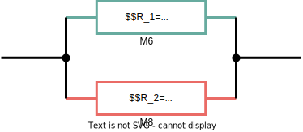
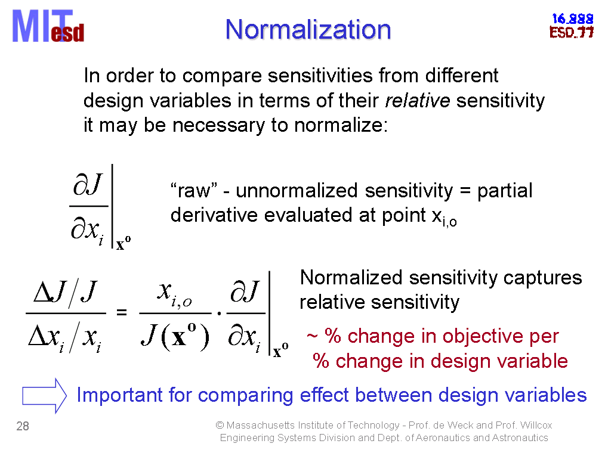

Assuming Target  $T$ ( for example, the total resistance) is  function of $x_1,x_2,...,x_N$, then total variation can be expressed as

$$\begin{align}
dT  &= \sum_{n=1}^N\frac{\partial T}{\partial x_n}dx_n \\
&= \sum_{n=1}^N\frac{\partial T}{\partial x_n}x_n\cdot \frac{dx_n}{x_n}
\end{align}$$

Then, we obtain relative variation
$$\begin{align}
\frac{dT}{T} &= \sum_{n=1}^N\frac{\partial T}{\partial x_n}\frac{x_n}{T}\cdot \frac{dx_n}{x_n}  \\
&= \sum_{n=1}^N S_{x_n}^T \cdot \frac{dx_n}{x_n}
\end{align}$$

&#11088; where $S_{x_n}^T=\frac{\partial T}{\partial x_n}\frac{x_n}{T}$ is **relative sensitivity**

> **relative sensitivity** connect $\frac{dx_n}{x_n}$ with total relative variation $\frac{dT}{T}$

And $dT$ can be expressed as
$$
dT =\sum_{n=1}^N S_{x_n}^T T\cdot \frac{dx_n}{x_n} = \sum_{n=1}^N x_n'\cdot \frac{dx_n}{x_n}
$$
&#11088; where $x_n'= S_{x_n}^T T$ is the contribution of $x_n$ in $T$

&#11088; For parallel or series resistors, it can prove $\sum_{n=1}^N S_{x_n}^T = 1$ and $ \sum_{n=1}^N x_n'=T$

---

Here $T= R_1 \parallel R_2 = \frac{R_1R_2}{R_1+R_2}$, and $T|_{R_1=8000, R_2=2000} = 1600$

We obtain *relative sensitivity:*
$$\begin{align}
S_{R_1}^T & = \frac{R_2}{R_1+R_2} \\
S_{R_2}^T & = \frac{R_1}{R_1+R_2}
\end{align}$$

The contribution of $R_1$ and $R_2$ to $T$
$$\begin{align}
R_1'  &= S_{R_1}^T  T | _{R_1=8000, R_2=2000} = 320 \\
R_2'  &= S_{R_2}^T  T | _{R_1=8000, R_2=2000} = 1280
\end{align}$$

## scholar
**Normalized sensitivity** captures **relative sensitivity**

>  change in objective per change in design variable

## reference

Olivier de Weck, Karen Willcox. MIT, Gradient Calculation and Sensitivity Analysis [[pdf](https://ocw.mit.edu/courses/ids-338j-multidisciplinary-system-design-optimization-spring-2010/ce1a087c39ebe629ff93ed57686ada0a_MITESD_77S10_lec09.pdf)]

Karti Mayaram, ECE 521 Fall 2016 Analog Circuit Simulation, Sensitivity and noise analyses [[https://web.engr.oregonstate.edu/~karti/ece521/lec16_11_09.pdf](https://web.engr.oregonstate.edu/~karti/ece521/lec16_11_09.pdf)]