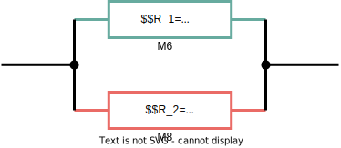

## Relative Sensitivity

Assuming Target  $T$ ( for example, the total resistance) is  function of $x_1,x_2,...,x_N$, then total variation can be represented as 

$$\begin{align}
dT  &= \sum_{n=1}^N\frac{\partial T}{\partial x_n}dx_n \\
&= \sum_{n=1}^N\frac{\partial T}{\partial x_n}x_n\cdot \frac{dx_n}{x_n}
\end{align}$$

Then, we obtain relative variation
$$\begin{align}
\frac{dT}{T} &= \sum_{n=1}^N\frac{\partial T}{\partial x_n}\frac{x_n}{T}\cdot \frac{dx_n}{x_n}  \\
&= \sum_{n=1}^N S_{x_n}^T \cdot \frac{dx_n}{x_n}
\end{align}$$

where $S_{x_n}^T=\frac{\partial T}{\partial x_n}\frac{x_n}{T}$ is **relative sensitivity**

> **relative sensitivity** connect $\frac{dx_n}{x_n}$ with total relative variation $\frac{dT}{T}$

## 2 parallel resistors

$$
R_{eq} = R_1 \parallel R_2 = 1098.64
$$

> $R_{1,eq} = 211$
>
> $R_{2,eq}=887$
