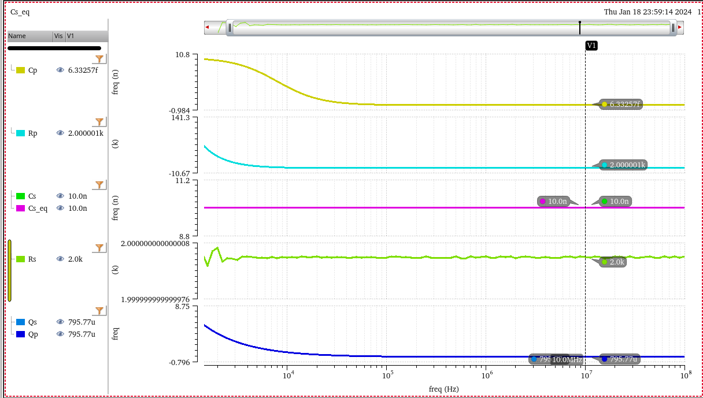

A ***resonant circuit*** refers to an electrical circuit using circuit elements such as an inductor (L) and a capacitor (C) to cause resonance at a specific frequency. 

There are two types of resonant circuits: 

- series resonant circuits
- parallel resonant circuits 

In a series resonant circuit, the impedance of the circuit reaches its minimum value at resonance, whereas in a parallel resonant circuit, the impedance reaches its maximum value

## Resonant Frequency

> $\zeta \lt 1$: ***Complex-Conjugate Poles***, but not *resonant peak*
>
> $\zeta \lt \sqrt{2}/2$: ***resonant peak***

> [[https://lpsa.swarthmore.edu/Bode/underdamped/underdampedApprox.html](https://lpsa.swarthmore.edu/Bode/underdamped/underdampedApprox.html)]
>
> 

---

> Prof. M. Green / U.C. Irvine EECS 270C / Winter 2013 [[pdf](https://picture.iczhiku.com/resource/eetop/WhKTaAlgfKwzLxXM.pdf)]

$$
s^2 + \frac{R}{L}s + \frac{1}{LC_L} = s^2 + 2\zeta \omega_n s + \omega_n^2
$$
where $\omega_n = \frac{1}{\sqrt{LC_L}}$ and $\zeta=\frac{R}{2}\sqrt{\frac{C_L}{L}}$

Resonant frequency is
$$
\omega_r = \omega_n \sqrt{1-2\zeta^2} = \frac{1}{\sqrt{LC_L}}\left(1-\frac{C_LR^2}{2L}\right)
$$
To have no resonant $\zeta^2 >\frac{1}{2}$, i.e
$$
\frac{L}{C_LR^2} < \frac{1}{2}
$$

## LC Resonator

> ***Complex Conjugate Zeros***

> ***Complex Conjugate Poles***
>
> $\zeta \to 0$ push $|G(s)\approx \frac{1}{2\zeta} \to+\infty$
>
> 

---

## Non ideal capacitor & inductor

> Tank Circuits/Impedances [[https://stanford.edu/class/ee133/handouts/lecturenotes/lecture5_tank.pdf](https://stanford.edu/class/ee133/handouts/lecturenotes/lecture5_tank.pdf)]
>
> Resonant Circuits  [[https://web.ece.ucsb.edu/~long/ece145b/Resonators.pdf](https://web.ece.ucsb.edu/~long/ece145b/Resonators.pdf)]
>
> Series & Parallel Impedance Parameters and Equivalent Circuits [[https://assets.testequity.com/te1/Documents/pdf/series-parallel-impedance-parameters-an.pdf](https://assets.testequity.com/te1/Documents/pdf/series-parallel-impedance-parameters-an.pdf)]
>
> ES Lecture 35: Non ideal capacitor, Capacitor Q and series RC to parallel RC conversion [[https://youtu.be/CJ_2U5pEB4o?si=4j4CWsLSapeu-hBo](https://youtu.be/CJ_2U5pEB4o?si=4j4CWsLSapeu-hBo)]

### Capacitor

---

> 

$$
Q_s = \frac{X_s}{R_s} = X_p\frac{Q_p^2}{Q_p^2+1}\cdot \frac{Q_p^2+1}{R_p} =\frac{Q_p^2}{R_p/X_p}=Q_p
$$

So long as $Q_s\gg 1$
$$\begin{align}
R_p &\approx Q_s^2R_s \\
C_p &\approx C_s
\end{align}$$

---

### Inductor

So long as $Q_s\gg 1$
$$\begin{align}
R_p &\approx Q_s^2R_s \\
L_p &\approx L_s
\end{align}$$

## SRF (Self-Resonant Frequency)

> [Understanding RF Inductor Specifications, [https://www.ece.uprm.edu/~rafaelr/inel5325/SupportDocuments/doc671_Selecting_RF_Inductors.pdf](https://www.ece.uprm.edu/~rafaelr/inel5325/SupportDocuments/doc671_Selecting_RF_Inductors.pdf)]
>
> [RFIC-GPT Wiki, [https://wiki.icprophet.net/](https://wiki.icprophet.net/)]

$$
f_\text{SRF} = \frac{1}{2\pi \sqrt{LC}}
$$
The SRF of an inductor is the frequency at which the parasitic capacitance of the inductor resonates with the ideal inductance of the inductor, resulting in an extremely high impedance. The inductance only acts like an inductor below its SRF

- For **choking** applications, chose an inductor whose SRF is at or near the frequency to be attenuated

- For other applications, the SRF should be at least **10** times higher than the operating frequency

  it is more important to have a *relatively flat inductance curve* (constant inductance vs. frequency) near the required frequency

## antiresonance

*TODO* &#128197;

## reference

Hossein Hashemi, RF Circuits, [[https://youtu.be/0f3yZMvD2Jg?si=2c1Q4y6WJq8Jj8oN](https://youtu.be/0f3yZMvD2Jg?si=2c1Q4y6WJq8Jj8oN)]

Resonant Circuits: Resonant Frequency and Q Factor [[https://techweb.rohm.com/product/circuit-design/electric-circuit-design/18332/](https://techweb.rohm.com/product/circuit-design/electric-circuit-design/18332/)]

J. Nako, G. Tsirimokou, C. Psychalinos and A. S. Elwakil, "Approximation of First–Order Complex Resonators in the Frequency–Domain," in *IEEE Access*, vol. 13, pp. 54494-54503, 2025 [[pdf](https://ieeexplore.ieee.org/stamp/stamp.jsp?arnumber=10937072)]

How to generate **complex poles without inductor**? [[https://a2d2ic.wordpress.com/2020/02/19/basics-on-active-rc-low-pass-filters/](https://a2d2ic.wordpress.com/2020/02/19/basics-on-active-rc-low-pass-filters/)]
