**Metastability** is an **undesirable non-equilibrium** electronic state that can persist for a long period of time

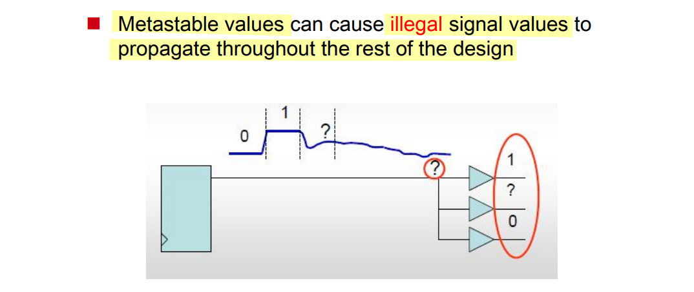

---

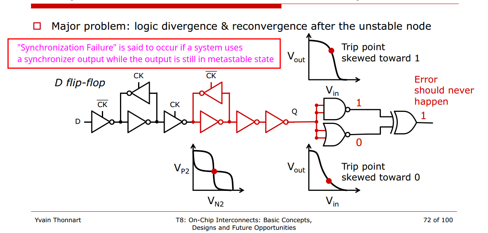

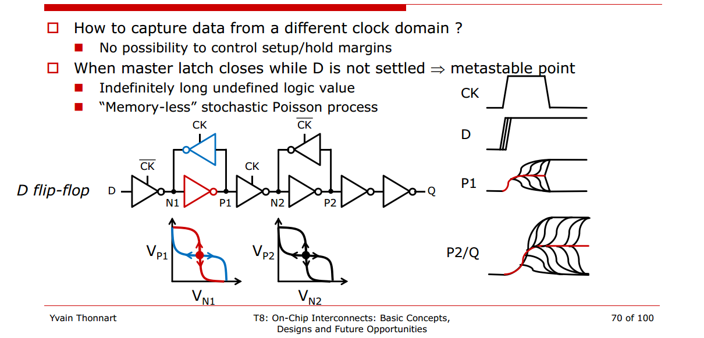

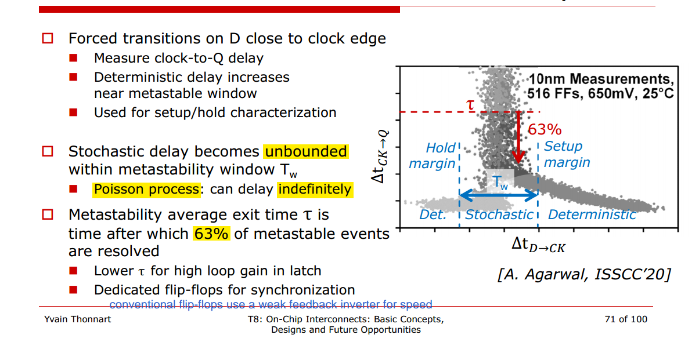

*Poisson stochastic process*

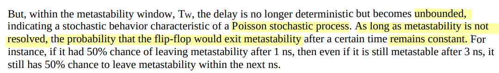

---

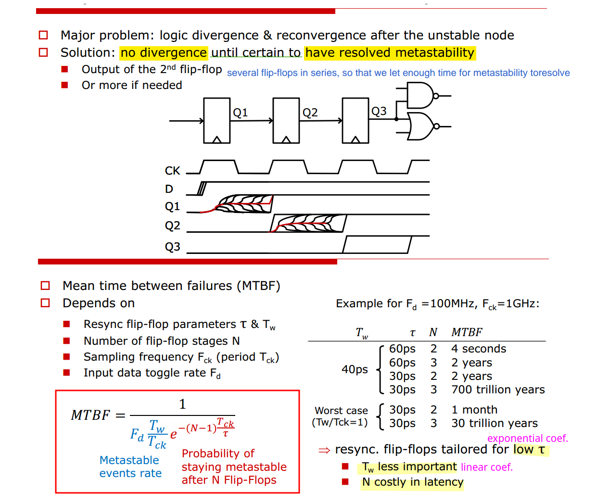

## Synchronizer effect – latency uncertainty

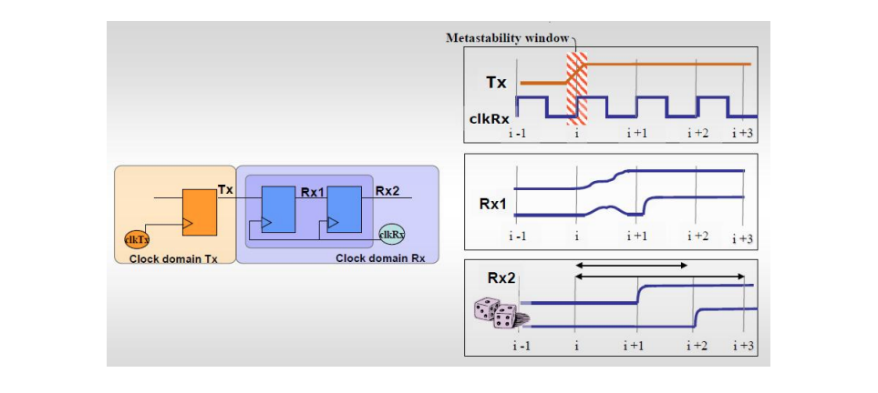

## simulation of DFF

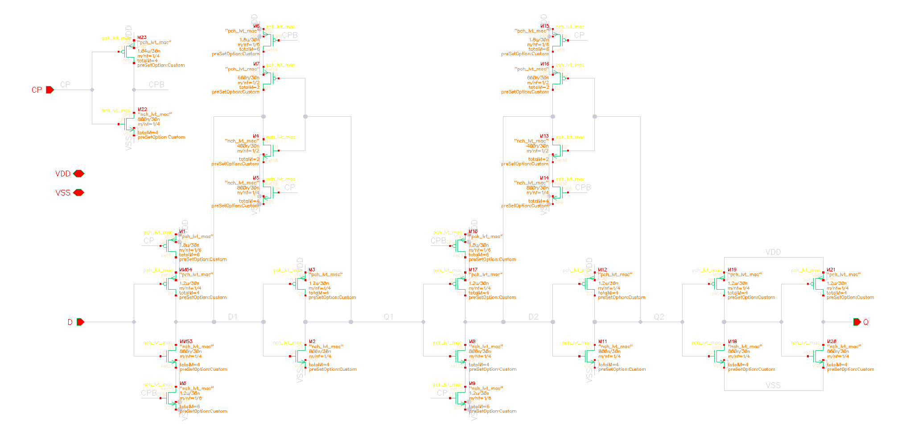

The typical flip-flops comprise master and slave latches and decoupling inverters.

In metastability, the voltage levels of nodes A and B of the *master latch* are roughly midway between logic 1 (VDD) and 0 (GND)

> *master latch* enter metastability

In fact, one popular definition says that if the output of a *flip-flop* changes later than the nominal clock-to-Q propagation delay, then the flip-flop must have been metastable

---

***sweep*** $\Delta t_{D \to \space \text{CK}}$

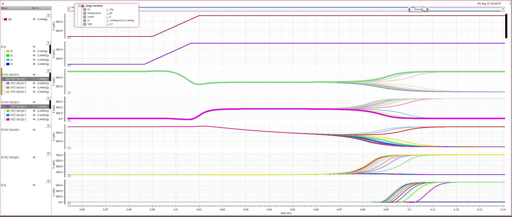

---

***transient noise analysis*** @ $\Delta t_{D \to \space \text{CK}} = -3.444525p$

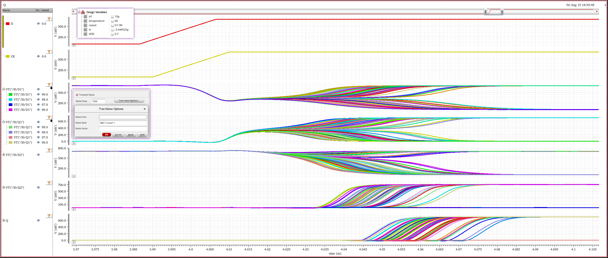

> zoom out
>
> 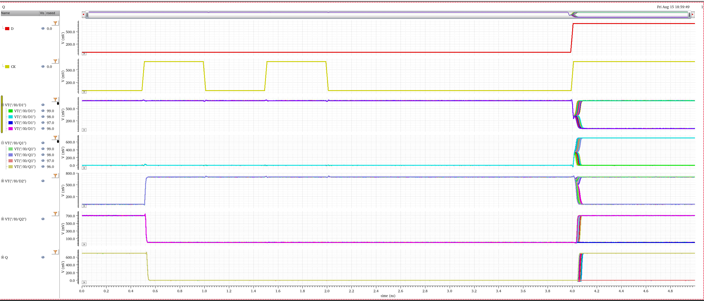

---

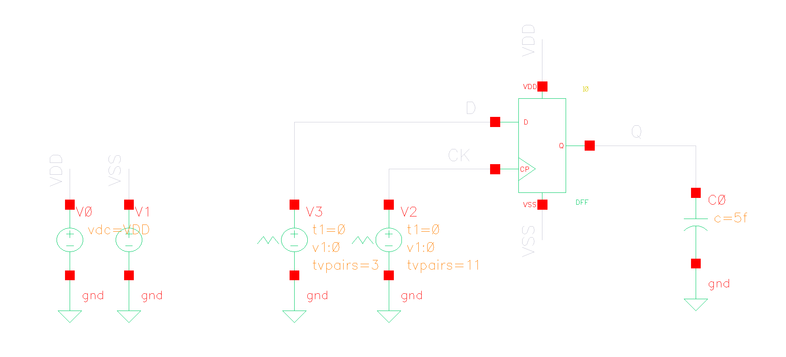

> `Noise Seed`—Seed for the random number generator (used by the simulator to vary the noise sources internally). Specifying the *same seed* allows you to *reproduce* a previous experiment. The default value is `1`.

## reference

Yvain Thonnart, CEA-LIST. ISSCC2021 T8: On-Chip Interconnects: Basic Concepts, Designs and Future Opportunities [[https://www.nishanchettri.com/isscc-slides/2021%20ISSCC/TUTORIALS/ISSCC2021-T8.pdf](https://www.nishanchettri.com/isscc-slides/2021%20ISSCC/TUTORIALS/ISSCC2021-T8.pdf)]

R. Ginosar, "Metastability and Synchronizers: A Tutorial," in IEEE Design & Test of Computers, vol. 28, no. 5, pp. 23-35, Sept.-Oct. 2011 [[https://webee.technion.ac.il/~ran/papers/Metastability-and-Synchronizers.IEEEDToct2011.pdf](https://webee.technion.ac.il/~ran/papers/Metastability-and-Synchronizers.IEEEDToct2011.pdf)]

Amr Adel Mohammady. Clock Domain Crossing [[linkedin](https://www.linkedin.com/posts/amradelm_clock-domain-crossing-all-parts-activity-7245373317526818816-tiO8?utm_source=share&utm_medium=member_desktop&rcm=ACoAAD-cuiIBDJ62eh9q3qTSSdslYXr-XMd8TGw)]

Steve Golson. Synchronization and Metastability [[https://trilobyte.com/pdf/golson_snug14.pdf](https://trilobyte.com/pdf/golson_snug14.pdf)]

Kinniment, D. J. Synchronization and arbitration in digital systems. John Wiley & Sons Ltd (2007).

Synchronizers And Data FlipFlops are Different [[pdf](https://ee.usc.edu/async2015/web/wp-content/uploads/2015/03/S1_P4_ASYNC2015IndustrialPaperDFF.pdf)]

S. Beer, R. Ginosar, M. Priel, R. Dobkin and A. Kolodny, "The Devolution of Synchronizers," *2010 IEEE Symposium on Asynchronous Circuits and Systems*, Grenoble, France, 2010 [[pdf](https://kolodny.net.technion.ac.il/files/2016/07/The-devolution-of-synchronizers-ASYNC-2010.pdf)]

赵启林 klin, Metastability [[https://picture.iczhiku.com/resource/eetop/SHKSFADwZerLPBXN.pdf](https://picture.iczhiku.com/resource/eetop/SHKSFADwZerLPBXN.pdf)]

Asad Abidi. ISSCC 2023: Circuit Insights "The CMOS Latch" [[https://youtu.be/sVe3VUTNb4Q&t=681](https://youtu.be/sVe3VUTNb4Q&t=681)]

Matt Venn. Interactive flip flop simulation [[https://github.com/mattvenn/flipflop_demo](https://github.com/mattvenn/flipflop_demo)]

I. W. Jones, S. Yang and M. Greenstreet, "Synchronizer Behavior and Analysis," 2009 15th IEEE Symposium on Asynchronous Circuits and Systems, Chapel Hill, NC, USA, 2009 [[https://sci-hub.ru/10.1109/ASYNC.2009.8](https://sci-hub.ru/10.1109/ASYNC.2009.8)]

Xprova. bisect-tau - EDA tool for characterizing the metastability resolution time constant (Tau) of bistable circuits [[https://github.com/xprova/bisect-tau](https://github.com/xprova/bisect-tau)]

