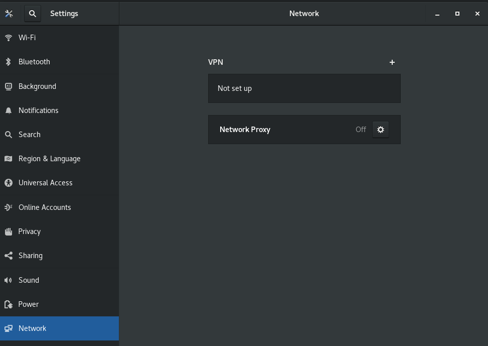
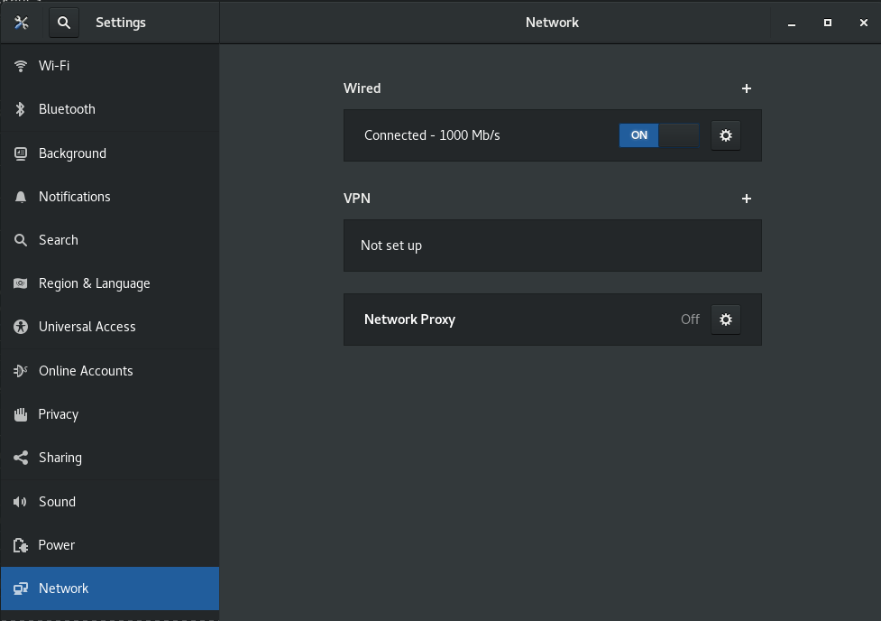

#### Problem

There is no network connection and device is not managed


```
$ nmcli device status 
DEVICE  TYPE      STATE      CONNECTION            
eth0    ethernet  unmanaged  --  
lo      loopback  unmanaged  --  
```



#### solution

```bash
sudo nmcli networking on
```

Then, **eth0** is connected

```
$ nmcli device status 
DEVICE  TYPE      STATE      CONNECTION            
eth0    ethernet  connected  Ethernet connection 1 
lo      loopback  unmanaged  --  
```




