## Gm-TIA CTLE

> H. Kimura *et al*., "A 28 Gb/s 560 mW Multi-Standard SerDes With Single-Stage Analog Front-End and 14-Tap Decision Feedback Equalizer in 28 nm CMOS," in *IEEE Journal of Solid-State Circuits*, vol. 49, no. 12, pp. 3091-3103, Dec. 2014 [[https://ieeexplore.ieee.org/ielx7/4/6963535/06894632.pdf](https://ieeexplore.ieee.org/ielx7/4/6963535/06894632.pdf)]
>
> Pisati, et.al., "Sub-250mW 1-to-56Gb/s Continuous-Range PAM-4 42.5dB IL ADC/DAC- Based Transceiver in 7nm FinFET," 2019 IEEE International Solid-State Circuits Conference (ISSCC), 2019 [[https://sci-hub.se/10.1109/ISSCC.2019.8662428](https://sci-hub.se/10.1109/ISSCC.2019.8662428)]
>
> Z. Li, M. Tang, T. Fan and Q. Pan, "A 56-Gb/s PAM4 Receiver Analog Front-End With Fixed Peaking Frequency and Bandwidth in 40-nm CMOS," in *IEEE Transactions on Circuits and Systems II: Express Briefs*, vol. 68, no. 9, pp. 3058-3062, Sept. 2021 [[slides](https://confcats-event-sessions.s3.amazonaws.com/isicas21/slides/9402.pdf)] [[paper](https://sci-hub.se/10.1109/TCSII.2021.3074384)]
>
> K. Kwon *et al*., "A 212.5Gb/s Pam-4 Receiver With Mutual Inductive Coupled Gm-Tia in 4nm Finfet," *2025 Symposium on VLSI Technology and Circuits (VLSI Technology and Circuits)*, Kyoto, Japan, 2025
>
> Bae, W. (2019). CMOS Inverter as Analog Circuit: An Overview. *Journal of Low Power Electronics and Applications*. [[pdf](https://pdfs.semanticscholar.org/6494/3a15452b12c89d31cdcedb22d605c42ed8bd.pdf)]

*CTLE, with Gm + TIA structure*

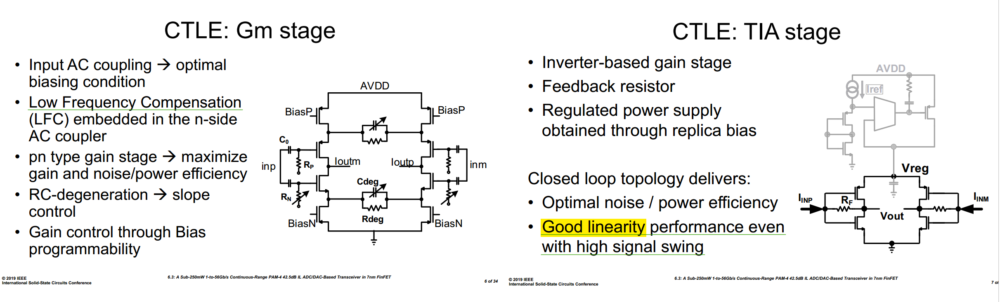


---

> Chongyun ZHANG, 2025, "Energy-Efficient CMOS Optical Receiver for Short-Reach Data Center Application,". [[slides](https://yuegroup.hkust.edu.hk/sites/default/files/Thesis/2.Slides/1.PhD/Chongyun%20ZHANG%202025.pdf), [paper](https://yuegroup.hkust.edu.hk/sites/default/files/Thesis/1.Thesis/1.PhD/Chongyun%20Zhang%202025.pdf)]

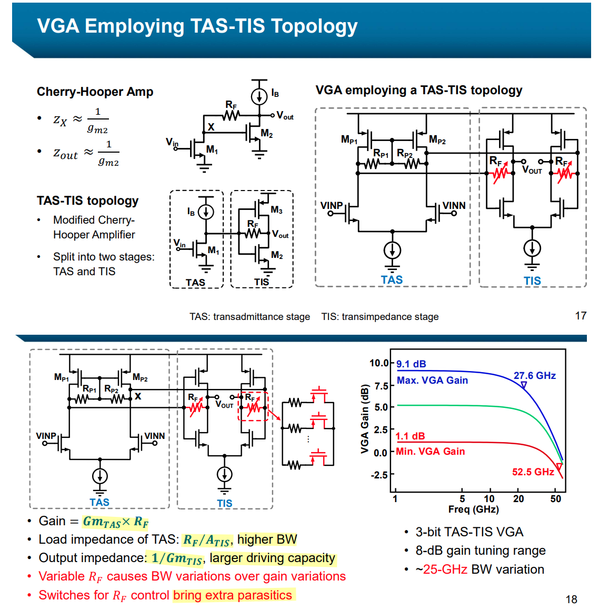

>  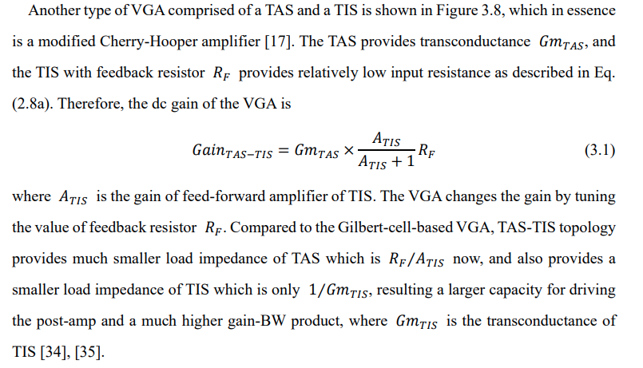


## Equalization Shaping

> PCIe Gen6 Channel and Reference Package S4P Models for Rx Stressed Eye Calibration

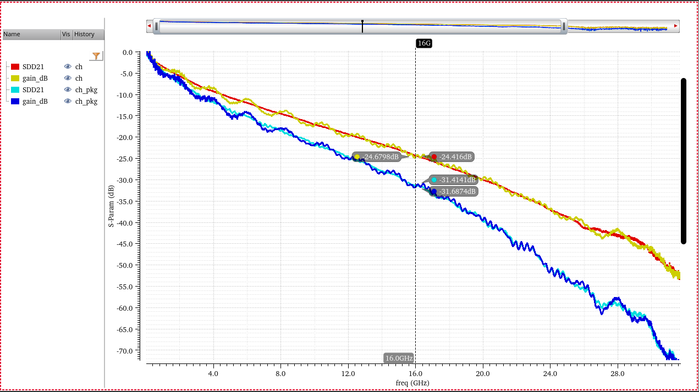

Above curve demonstrate that only zero is not enough to compensate channel+pkg loss (>20 dB/decade), peaking or *Complex*-*Conjugate Poles* is necessary

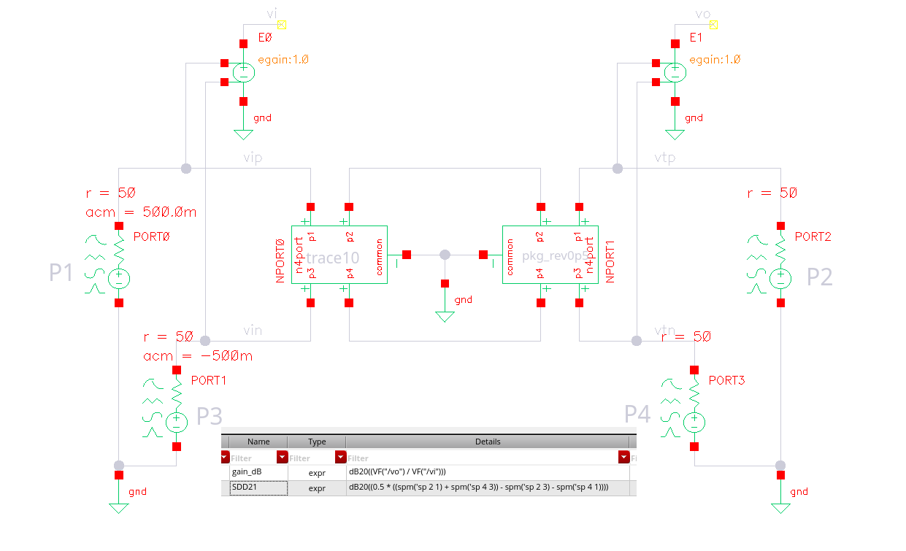


---

> S. Shahramian *et al*., "30.5 A 1.41pJ/b 56Gb/s PAM-4 Wireline Receiver Employing Enhanced Pattern Utilization CDR and Genetic Adaptation Algorithms in 7nm CMOS," *2019 IEEE International Solid-State Circuits Conference - (ISSCC)*, San Francisco, CA, USA, 2019 [[pdf](https://sci-hub.se/10.1109/ISSCC.2019.8662421)]

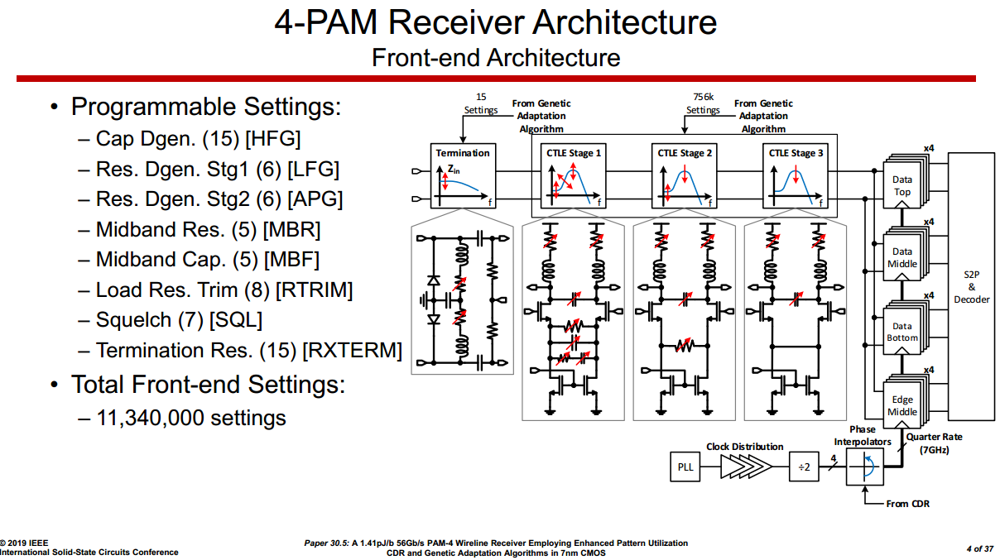

---

> P. A. Francese *et al*., "10.6 continuous-time linear equalization with programmable active-peaking transistor arrays in a 14nm FinFET 2mW/Gb/s 16Gb/s 2-Tap speculative DFE receiver," *2015 IEEE International Solid-State Circuits Conference - (ISSCC) Digest of Technical Papers*, San Francisco, CA, USA, 2015 [[pdf](https://sci-hub.se/10.1109/ISSCC.2015.7062988)]

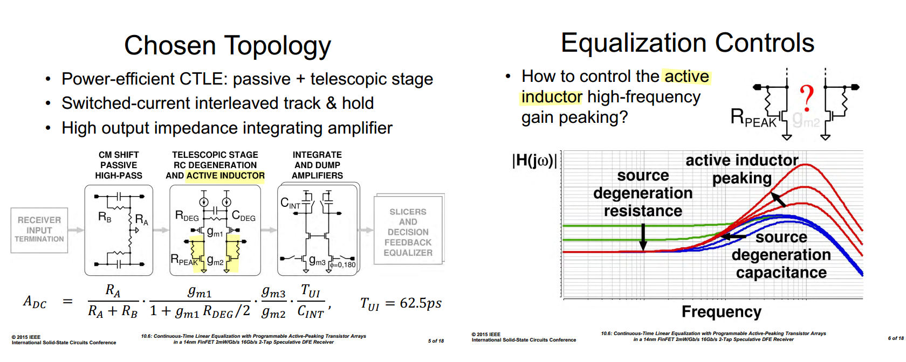

---

> Z. Li, M. Tang, T. Fan and Q. Pan, "A 56-Gb/s PAM4 Receiver Analog Front-End With Fixed Peaking Frequency and Bandwidth in 40-nm CMOS," in *IEEE Transactions on Circuits and Systems II: Express Briefs*, vol. 68, no. 9, pp. 3058-3062, Sept. 2021 [[slides](https://confcats-event-sessions.s3.amazonaws.com/isicas21/slides/9402.pdf)] [[paper](https://sci-hub.se/10.1109/TCSII.2021.3074384)]

In the active copper cable (ACC) application, it is necessary to give different equalizations at the same frequency according to different cable lengths, Therefore, the AFE with ***fixed peaking frequency*** and ***constant bandwidth*** is desirable for these applications

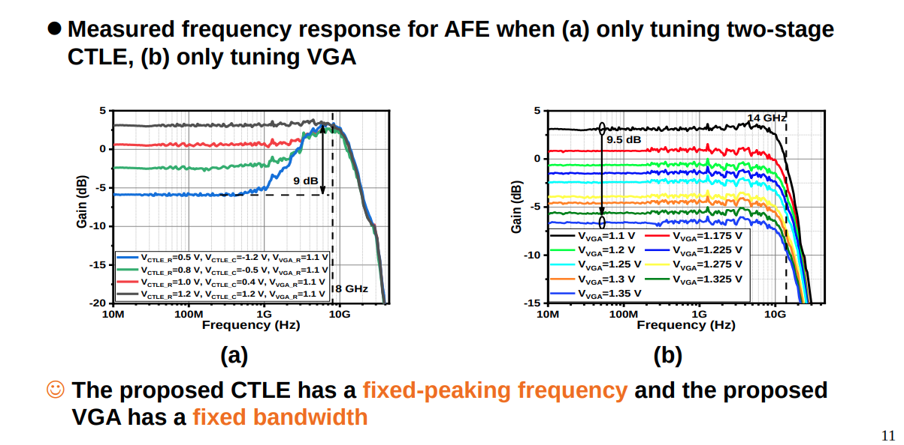


##  Low-Frequency CTLE (LF-CTLE)

> S. Parikh *et al*., "A 32Gb/s wireline receiver with a low-frequency equalizer, CTLE and 2-tap DFE in 28nm CMOS," *2013 IEEE International Solid-State Circuits Conference Digest of Technical Papers*, San Francisco, CA, USA, 2013 [[https://sci-hub.se/10.1109/ISSCC.2013.6487622](https://sci-hub.se/10.1109/ISSCC.2013.6487622)]
>
> T. Shibasaki *et al*., "A 56-Gb/s receiver front-end with a CTLE and 1-tap DFE in 20-nm CMOS," *2014 Symposium on VLSI Circuits Digest of Technical Papers*, Honolulu, HI, USA, 2014, pp. 1-2
>
> Yasuo Hidaka  Comment #146, #174: Low-Frequency CTLE to support 3m cable w/o FEC [[https://www.ieee802.org/3/by/public/Sept15/hidaka_3by_01_0915.pdf](https://www.ieee802.org/3/by/public/Sept15/hidaka_3by_01_0915.pdf)]

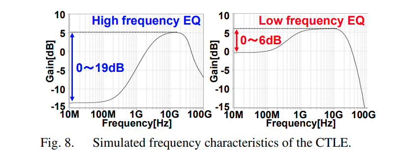

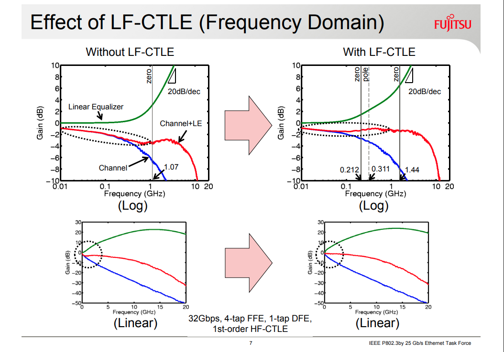

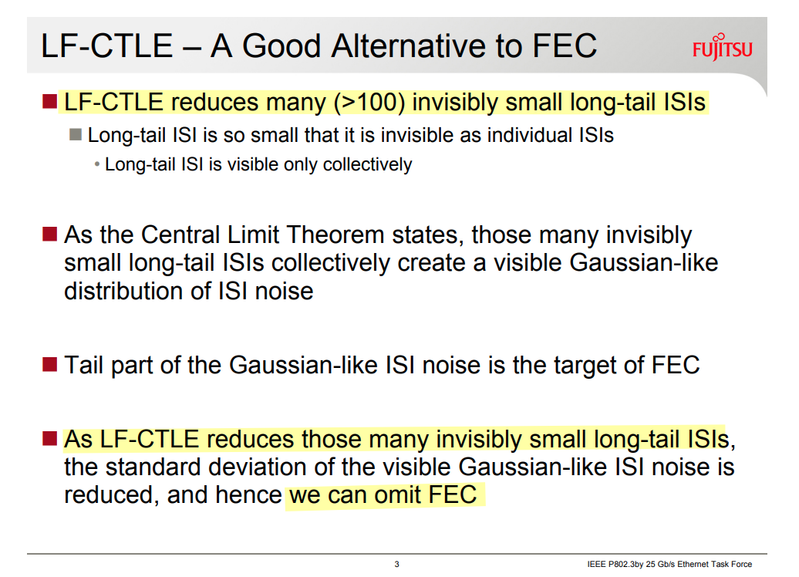

## Negative Capacitance Circuit

### Negative Miller Capacitance

> S. Gondi and B. Razavi, "Equalization and Clock and Data Recovery Techniques for 10-Gb/s CMOS Serial-Link Receivers," in *IEEE Journal of Solid-State Circuits*, vol. 42, no. 9, pp. 1999-2011 [[pdf](https://www.seas.ucla.edu/brweb/papers/Journals/GBRSep07.pdf)]
>
> Sam Palermo. ECEN620 Lecture 14: Limiting Amplifiers (LAs) [[https://people.engr.tamu.edu/spalermo/ecen620/lecture14_ee620_limiting_amps.pdf](https://people.engr.tamu.edu/spalermo/ecen620/lecture14_ee620_limiting_amps.pdf)]

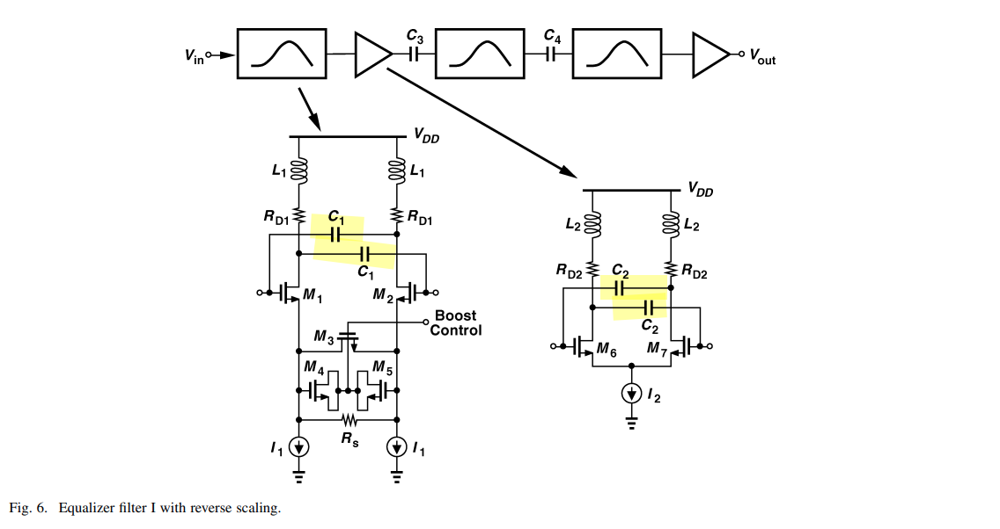

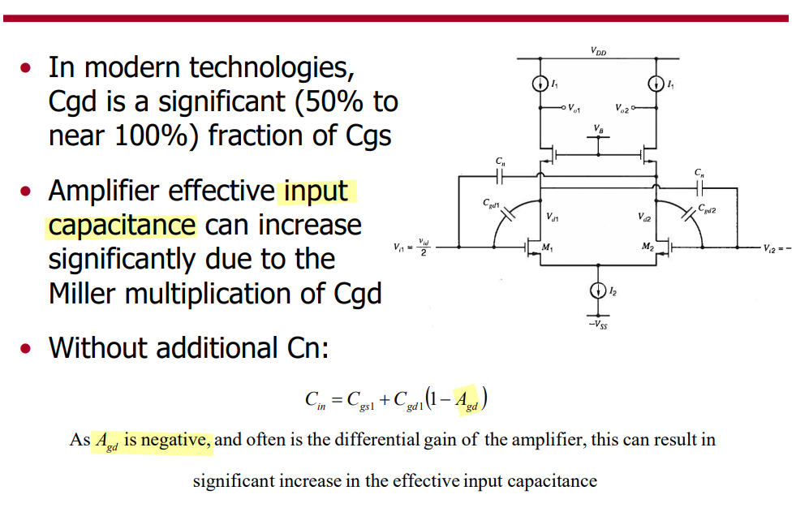
$$
C_{d1} = C_{dd1} + (1+\frac{1}{|A_{gd}|})C_{gd1}
$$
where $A_{gd}\lt 0$

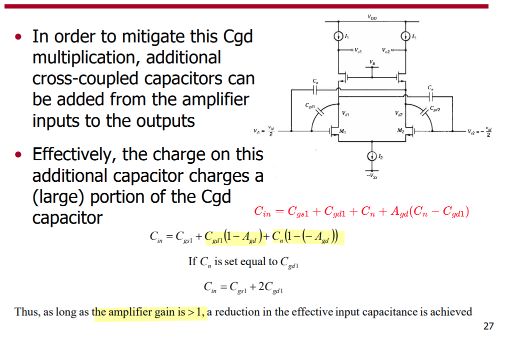

For ***differential mode input***, *effective input capacitance*
$$
C_{in} = C_{gs} +(1+A_{dm}) C_{gd}+\color{red}(1-A_{dm})C_n
$$
and *effective output capacitance*
$$
C_{out} = C_{dd} + (1+\frac{1}{A_{dm}})C_{gd}+\color{red} (1-\frac{1}{A_{dm}})C_n
$$
That is $C_n$ deteriorate the effective output capacitance 

For ***common mode input***, *effective input capacitance*
$$
C_{in} = C_{gs} + (1+A_{cm}) C_{gd}+ \color{red}(1+A_{cm})C_n
$$
and *effective output capacitance*
$$
C_{d1} = C_{dd} + (1+\frac{1}{A_{cm}})C_{gd}+\color{red} (1+\frac{1}{A_{cm}})C_n
$$
i.e., $C_n$ deteriorate both effective input capacitance and effective output capacitance, unfortunately

---

effective input capacitance $\Pi$ model, which is appropriate for both differential input and common mode input


Suppose $C_n=C_{gd}$,  effective *differential* input capacitance is *same* with effective *common-mode* input capacitance ($C_n=\frac{A_{dm}-A_{cm}}{A_{dm}+A_{cm}}C_{gd}$)


### XCP with Capacitor

> B. Razavi, "The Cross-Coupled Pair - Part III [A Circuit for All Seasons]," IEEE Solid-State Circuits Magazine, Issue. 1, pp. 10-13, Winter 2015. [[https://www.seas.ucla.edu/brweb/papers/Journals/BR_Magzine3.pdf](https://www.seas.ucla.edu/brweb/papers/Journals/BR_Magzine3.pdf)]
>
> S. Galal and B. Razavi, "10-Gb/s Limiting Amplifier and Laser/Modulator Driver in 0.18um CMOS Technology,” IEEE Journal of Solid-State Circuits, vol. 38, pp. 2138-2146, Dec. 2003.[[https://www.seas.ucla.edu/brweb/papers/Journals/G&RDec03_2.pdf](https://www.seas.ucla.edu/brweb/papers/Journals/G&RDec03_2.pdf)]
>
> A. Sheikholeslami, "Bandwidth Extension [Circuit Intuitions]," in IEEE Solid-State Circuits Magazine, vol. 7, no. 2, pp. 8-11, Spring 2015 [[https://www.eecg.utoronto.ca/~ali/papers/mag-spr-15-bandwidth-extention.pdf](https://www.eecg.utoronto.ca/~ali/papers/mag-spr-15-bandwidth-extention.pdf)]

The **Cross-Coupled Pair (XCP)** can operate as an **impedance negator** [a.k.a. a **negative impedance converter** (**NIC**)] 

A common application is to create a *negative capacitance* that can cancel the *positive capacitance*
seen at a port, thereby improving the *speed*

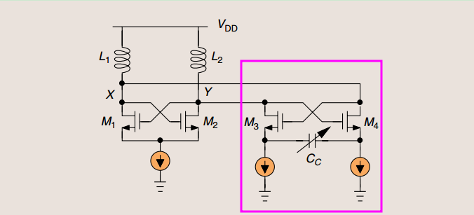
$$
I_{NIC} =\frac{V_{im} - V_{ip}}{\frac{2}{g_m}+\frac{1}{sC_c}} = \frac{-2V_{ip}}{\frac{2}{g_m}+\frac{1}{sC_c}}
$$
Therefore
$$
Z_{NIC} = \frac{V_{ip} - V_{im}}{I_{NIC}}=\frac{2V_{ip}}{I_{NIC}} =- \frac{2}{g_m}-\frac{1}{sC_c}
$$
***half-circuit***

If $C_{gd}$ is considered, and apply miller effect. half equivalent circuit is shown as below


---

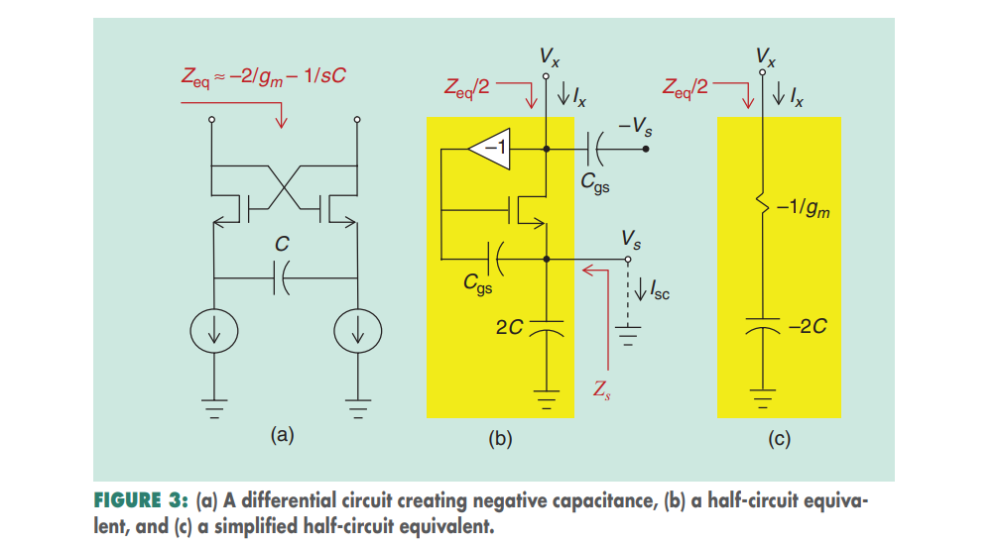


## Equalization Noise Enhancement

> Advanced Signal Integrity for High-Speed Digital Designs, S. H. Hall and H. L. Heck, John Wiley & Sons, 2009
>
> CC Chen, Why CTLE? [[https://youtu.be/zsuJMqadaKY](https://youtu.be/zsuJMqadaKY)]

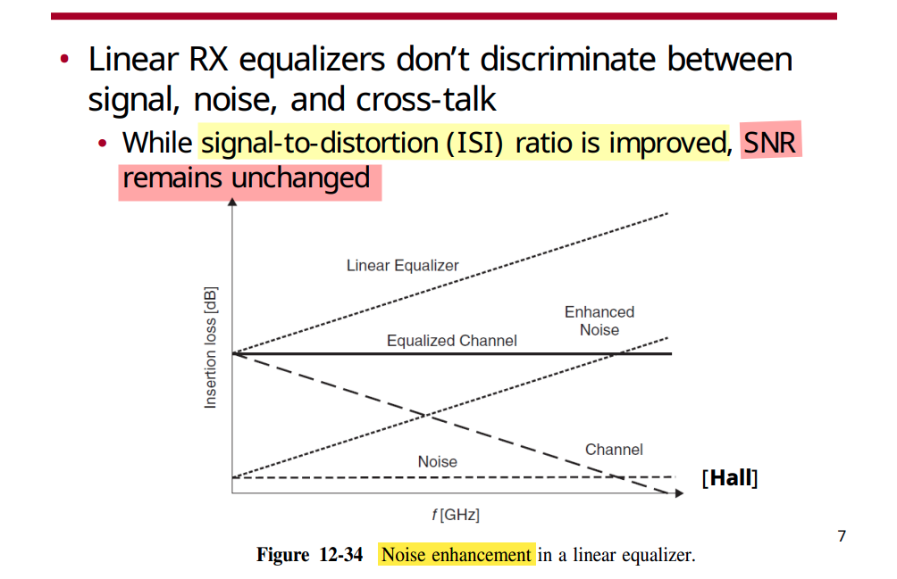

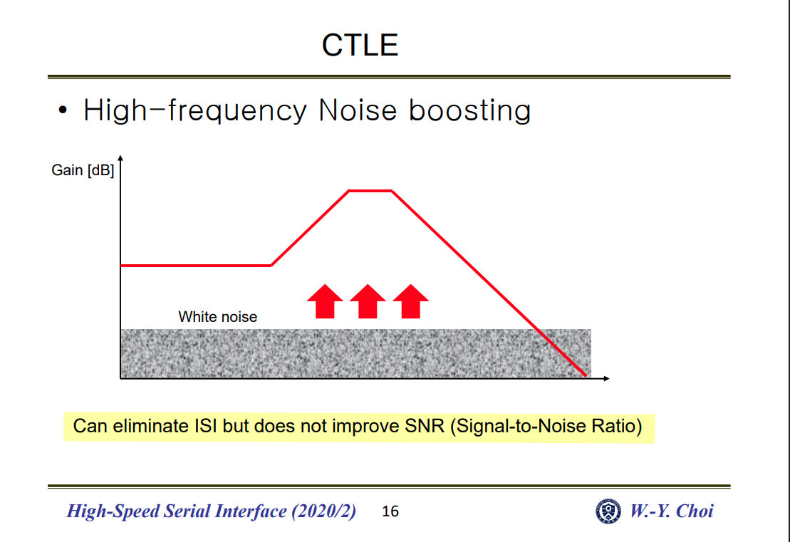

Assuming $\mathrm{SNR}(f) = \frac{S_x(f)}{S_n(f)}$

---

trade-offs between *noise amplification* and *signal equalization*


## input network

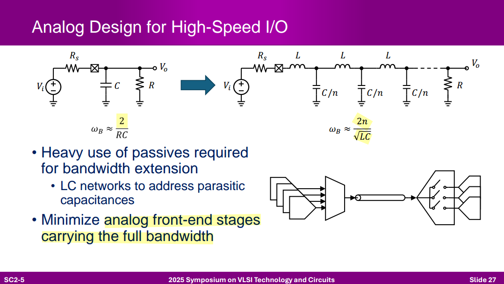

---

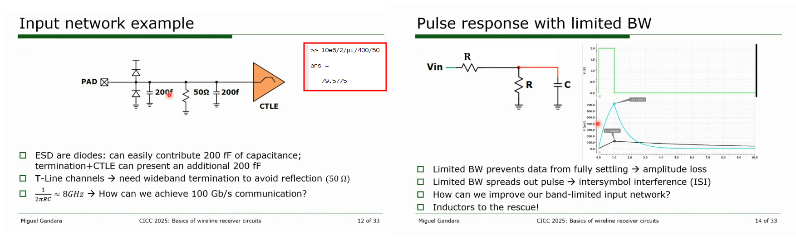

> ```
> >> 10e6/2/pi/400/50
> 
> ans =
> 
> 79.5775
> ```


## shunt peaking

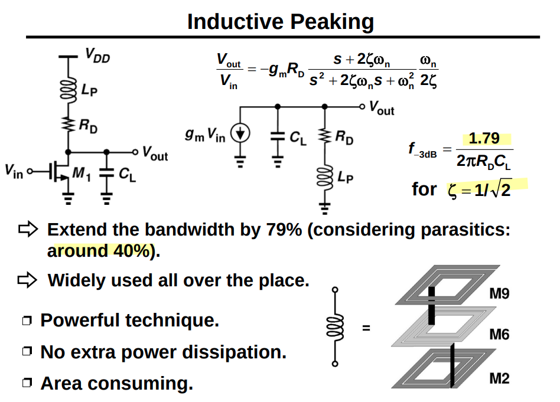

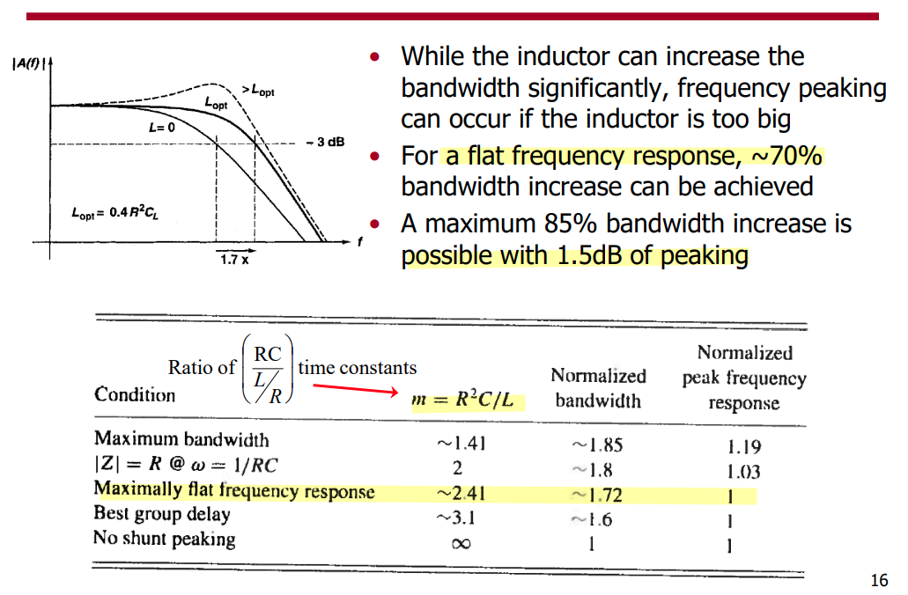


## T-Coil Peaking

> Jri Lee. ISSCC 2009 Tutorial. CMOS Circuit Techniques for High Speed Wireline Transceivers [[http://cc.ee.ntu.edu.tw/~jrilee/course/2009_Tutorial_10.pdf](http://cc.ee.ntu.edu.tw/~jrilee/course/2009_Tutorial_10.pdf)]
>
> CC Chen. Why SerDes Needs a Rule of Thumb for T-Coil Design? [[https://youtu.be/RIQLYQG2u0A](https://youtu.be/RIQLYQG2u0A)]

***Capacitor Splitting*** + ***Magnetic Coupling of a transformer***

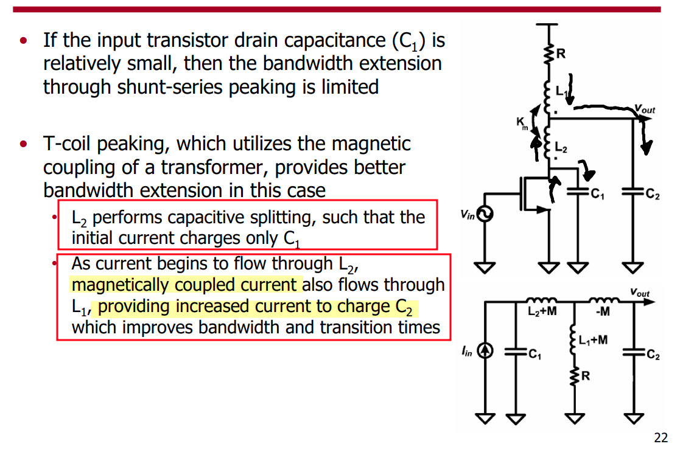

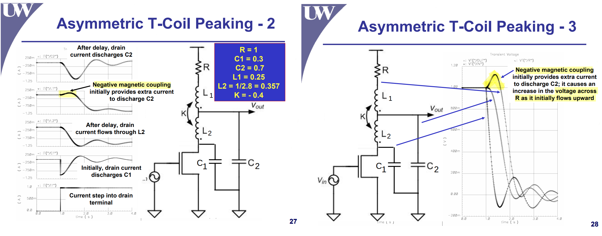


---

***alternative analysis with the below 3 uncoupled inductors model***


---

***Three uncoupled inductors model***

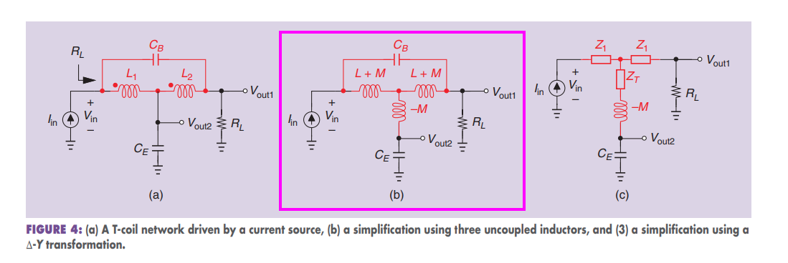


$$\begin{align}
V_{P13} &= I_1\cdot sL_1 + I_2\cdot sM = I_1\cdot s(L_1+M) + (I_1-I_2)\cdot s(-M) \\
V_{P23} &= -I_2\cdot sL_2 - I_1\cdot sM = -I_2\cdot s(L_2 + M) + (I_1-I_2)\cdot s(-M)
\end{align}$$


The negative inductor $-M$ can be seen as capacitor
$$
-j\omega M = \frac{1}{j}\omega M = \frac{1}{j\omega \frac{1}{\omega^2 M}}
$$
That is $C_{-M}  = \frac{1}{\omega^2 M} \approx 10 \times C_E$


## Triple Resonance

*TODO* &#128197;

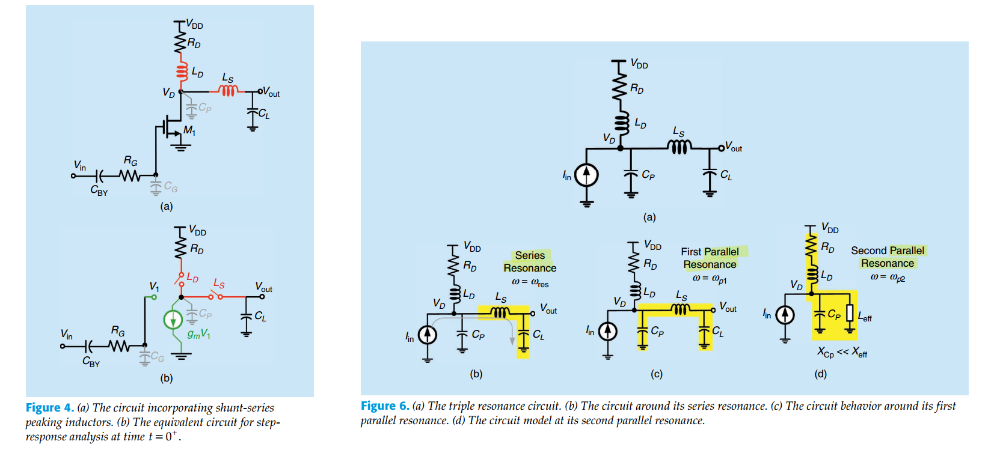


## Active Inductor

> B. Razavi, "The Active Inductor [A Circuit for All Seasons]," in *IEEE Solid-State Circuits Magazine*, vol. 12, no. 2, pp. 7-11, Spring 2020 [[https://www.seas.ucla.edu/brweb/papers/Journals/BR_SSCM_2_2020.pdf](https://www.seas.ucla.edu/brweb/papers/Journals/BR_SSCM_2_2020.pdf)]


$$\begin{align}
A &= \frac{g_mR_L}{1+(g_{\text{m}_{\text{dio}}}+ g_{\text{ds}_\text{tot}})R_L}\cdot \frac{1+R_pC_Ps}{1+\frac{(1+g_{\text{ds}_{\text{tot}}}R_L)R_PC_P+C_PR_L+R_LC_L}{1+(g_{\text{m}_{\text{dio}}}+g_{\text{ds}_\text{tot}})R_L}s + \frac{R_LC_LR_PC_P}{1+(g_{\text{m}_\text{dio}}+g_{\text{ds}_{\text{tot}}})R_L}s^2} \\
&= \frac{g_mR_L}{1+(g_{\text{m}_{\text{dio}}}+ g_{\text{ds}_{\text{tot}}})R_L}\cdot \frac{R_PC_P}{ \frac{R_LC_LR_PC_P}{1+(g_{\text{m}_{\text{dio}}}+g_{\text{ds}_{\text{tot}}})R_L}}\cdot \frac{1/(R_PC_P)+s}{s^2 + \frac{(1+g_{\text{ds}_{\text{tot}}}R_L)R_PC_P+C_PR_L+R_LC_L}{R_PC_P}s + \frac{1+(g_{\text{m}_{\text{dio}}}+g_{\text{ds}_\text{tot}})R_L}{R_LC_LR_PC_P}} \\
&= A_0 \cdot A(s)
\end{align}$$

That is

$$\begin{align}
\omega_z &= \frac{1}{R_PC_P} \tag{1} \\ 
\omega_n &= \sqrt{\frac{1+(g_{\text{m}_{\text{dio}}}+ g_{\text{ds}_\text{tot}})R_L}{R_LC_LR_PC_P}} = \sqrt{\omega_{p0}\omega_z} \\
\zeta & = \frac{(1+g_{\text{ds}_\text{tot}}R_L)R_PC_P+C_PR_L+R_LC_L}{R_PC_P} \frac{1}{2 \omega_n}
\end{align}$$

Where
$$\begin{align}
\omega_{p0} &= \frac{1}{(R_L||\frac{1}{g_{\text{m}_{\text{dio}}}}||\frac{1}{g_{\text{m}_{\text{tot}}}})C_L}  \tag{2}
\end{align}$$

Here, relate $\omega_{p0}$ and $\omega_z$ by coefficient $\alpha$
$$
\omega_{p0} = \alpha \cdot  \omega_z \tag{3}
$$
This way
$$
\omega_n= \sqrt{\alpha}\cdot \omega_z
$$

$$
\zeta = \frac{1}{2}(K\sqrt{\alpha}+\frac{1+C_P/C_L}{\sqrt{\alpha}}) \tag{4}
$$

where
$$
K = \frac{R_L||\frac{1}{g_{\text{m}_{\text{dio}}}}||\frac{1}{g_{\text{m}_{\text{tot}}}}}{R_L||g_\text{ds\_tot}}
$$


And $A(s)$ can be expressed as
$$
A(s) = \frac{\frac{s}{\omega_z}+1}{\frac{s^2}{\omega_n^2}+2\frac{\zeta}{\omega_n}s+1}
$$
It magnitude in dB
$$
A_\text{dB} = 10\log\frac{1+(\omega/\omega_z)^2}{1+(\omega/\omega_n)^4+2\omega^2(2\zeta^2-1)/\omega_n^2}
$$
Substitute $\omega_n$ with Eq (2), followed is obtained
$$
A_\text{dB} = 10\log{\frac{\alpha^2(\omega_z^4 + \omega_z^2\omega^2)}{\alpha^2\omega_z^4+\omega^4+2\alpha\omega_z^2(2\zeta^2-1)\omega^2}}
$$
peaking frequency
$$
\omega_\text{peak} = \omega_z\cdot \sqrt{\sqrt{(\alpha+1)^2 - 4\alpha \zeta^2}-1}
$$
If $\zeta=1$
$$\begin{align}
\omega_{A_\text{dB = 0dB} }&= \sqrt{1-2/\alpha}\cdot \omega_{p0} \\
\omega_\text{peak} &= \omega_z\sqrt{\alpha-2} \\
A_\text{dB,peak} &= 10\log\frac{\alpha^2}{4(\alpha-1)}
\end{align}$$


## reference

J. Kim et al., "A 112Gb/s PAM-4 transmitter with 3-Tap FFE in 10nm CMOS," 2018 IEEE International Solid-State Circuits Conference - (ISSCC), San Francisco, CA, USA, 2018 [[https://2024.sci-hub.se/6715/9a3d5a4825e551544403f87f0b9f6a89/10.1109@ISSCC.2018.8310204.pdf](https://2024.sci-hub.se/6715/9a3d5a4825e551544403f87f0b9f6a89/10.1109@ISSCC.2018.8310204.pdf)] [[slides](https://picture.iczhiku.com/resource/eetop/shiGDYTDYikLlnXv.pdf)]

Miguel Gandara. CICC2025 Circuits Insights: Wireline Receiver Circuits [[https://youtu.be/X4JTuh2Gdzg](https://youtu.be/X4JTuh2Gdzg)]

---

S. Shekhar, J. S. Walling and D. J. Allstot, "Bandwidth Extension Techniques for CMOS Amplifiers," in *IEEE Journal of Solid-State Circuits*, vol. 41, no. 11, pp. 2424-2439, Nov. 2006 [[pdf](https://people.engr.tamu.edu/spalermo/ecen689_oi/2006_passive_bw_extension_techniques_shekhar_jssc.pdf)]

David J. Allstot Bandwidth Extension Techniques for CMOS Amplifiers [[https://ewh.ieee.org/r5/denver/sscs/Presentations/2007_08_Allstot.pdf](https://ewh.ieee.org/r5/denver/sscs/Presentations/2007_08_Allstot.pdf)]

J. Paramesh and D. J. Allstot, "Analysis of the Bridged T-Coil Circuit Using the Extra-Element Theorem," in IEEE Transactions on Circuits and Systems II: Express Briefs, vol. 53, no. 12, pp. 1408-1412, Dec. 2006 [[https://sci-hub.st/10.1109/TCSII.2006.885971](https://sci-hub.st/10.1109/TCSII.2006.885971)]

S. C. D. Roy, "Comments on "Analysis of the Bridged T-coil Circuit Using the Extra-Element Theorem," in IEEE Transactions on Circuits and Systems II: Express Briefs, vol. 54, no. 8, pp. 673-674, Aug. 2007 [[https://sci-hub.st/10.1109/TCSII.2007.899834](https://sci-hub.st/10.1109/TCSII.2007.899834)]

B. Razavi, "The Bridged T-Coil [A Circuit for All Seasons]," IEEE Solid-State Circuits Magazine, Volume. 7, Issue. 40, pp. 10-13, Fall 2015 [[https://www.seas.ucla.edu/brweb/papers/Journals/BRFall15TCoil.pdf](https://www.seas.ucla.edu/brweb/papers/Journals/BRFall15TCoil.pdf)]

—, "The Design of Broadband I/O Circuits [The Analog Mind]," IEEE Solid-State Circuits Magazine, Volume. 13, Issue. 2, pp. 6-15, Spring 2021 [[http://www.seas.ucla.edu/brweb/papers/Journals/BR_SSCM_2_2021.pdf](http://www.seas.ucla.edu/brweb/papers/Journals/BR_SSCM_2_2021.pdf)]

Deog-Kyoon Jeong. Topics in IC Design: T-Coil [[pdf](https://ocw.snu.ac.kr/sites/default/files/NOTE/Lec%2010%20-%20Bandwidth%20Extension%20Techniques.pdf)]

P. Heydari, "Neutralization Techniques for High-Frequency Amplifiers: An Overview," in IEEE Solid-State Circuits Magazine, vol. 9, no. 4, pp. 82-89, Fall 2017 [[https://sci-hub.ru/10.1109/MSSC.2017.2745858](https://sci-hub.ru/10.1109/MSSC.2017.2745858)]

—, "Evolution of Broadband Amplifier Design: From Single-Stage to Distributed Topology," in IEEE Microwave Magazine, vol. 24, no. 9, pp. 18-29, Sept. 2023 

Cowan G. *Mixed-Signal CMOS for Wireline Communication: Transistor-Level and System-Level Design Considerations*. Cambridge University Press; 2024

Starič, Peter and Erik Margan. “Wideband amplifiers.” (2006) [[pdf](https://www-f9.ijs.si/~margan/WBA3_4web/Wideband_Amplifiers_FPRL.pdf)]

Bob Ross. IBIS Summit [[T-Coils and Bridged-T Networks](https://ibis.org/summits/may11/ross2.pdf)], [[T-Coil Topics](https://ibis.org/summits/feb11/ross.pdf)]

Walling, Jeffrey & Shekhar, Sudip & Allstot, David. (2008). Wideband CMOS Amplifier Design: Time-Domain Considerations. Circuits and Systems I: Regular Papers, IEEE Transactions on. 55. 1781 - 1793.  [[pdf](https://sudip.sites.olt.ubc.ca/files/2022/10/6.pdf)]

A. A. Abidi, "The T-Coil Circuit Demystified," in IEEE Transactions on Circuits and Systems I: Regular Papers, vol. 72, no. 9, pp. 4469-4480, Sept. 2025

S. Lin, D. Huang and S. Wong, "Pi Coil: A New Element for Bandwidth Extension," in *IEEE Transactions on Circuits and Systems II: Express Briefs*, vol. 56, no. 6, pp. 454-458, June 2009

M. Kossel *et al*., "A T-Coil-Enhanced 8.5 Gb/s High-Swing SST Transmitter in 65 nm Bulk CMOS With <−16 dB Return Loss Over 10 GHz Bandwidth," in *IEEE Journal of Solid-State Circuits*, vol. 43, no. 12, pp. 2905-2920, Dec. 2008 [[https://web.mit.edu/magic/Public/papers/04684644.pdf](https://web.mit.edu/magic/Public/papers/04684644.pdf)]

---

S. Galal and B. Razavi, "Broadband ESD protection circuits in CMOS technology," in IEEE Journal of Solid-State Circuits, vol. 38, no. 12, pp. 2334-2340, Dec. 2003, doi: 10.1109/JSSC.2003.818568.

M. Ker and Y. Hsiao, "On-Chip ESD Protection Strategies for RF Circuits in CMOS Technology," 2006 8th International Conference on Solid-State and Integrated Circuit Technology Proceedings, 2006, pp. 1680-1683, doi: 10.1109/ICSICT.2006.306371.

M. Ker, C. Lin and Y. Hsiao, "Overview on ESD Protection Designs of Low-Parasitic Capacitance for RF ICs in CMOS Technologies," in IEEE Transactions on Device and Materials Reliability, vol. 11, no. 2, pp. 207-218, June 2011, doi: 10.1109/TDMR.2011.2106129.

Kosnac, Stefan (2021) *Analysis* of On-*Chip Inductors* and *Arithmetic Circuits* in the *Context* of *High Performance Computing* [[https://archiv.ub.uni-heidelberg.de/volltextserver/30559/1/Dissertation_Stefan_Kosnac.pdf](https://archiv.ub.uni-heidelberg.de/volltextserver/30559/1/Dissertation_Stefan_Kosnac.pdf)]

Chapter 4.5. High Frequency Passive Devices [[https://www.cambridge.org/il/files/7713/6698/2369/HFIC_chapter_4_passives.pdf](https://www.cambridge.org/il/files/7713/6698/2369/HFIC_chapter_4_passives.pdf)]

---

Elad Alon, ISSCC 2014, "T6: Analog Front-End Design for Gb/s Wireline Receivers" [[pdf](https://picture.iczhiku.com/resource/eetop/wHKfZPYpAleAKXBV.pdf)]

Byungsub Kim,  ISSCC 2022, "T11: Basics of Equalization Techniques: Channels, Equalization, and Circuits"

K. Yadav, P. -H. Hsieh and A. Chan Carusone, "Linearity Analysis of Source-Degenerated Differential Pairs for Wireline Applications," in IEEE Open Journal of Circuits and Systems [[https://ieeexplore.ieee.org/stamp/stamp.jsp?tp=&arnumber=10769573](https://ieeexplore.ieee.org/stamp/stamp.jsp?tp=&arnumber=10769573)]

Minsoo Choi et al., "An Approximate Closed-Form Channel Model for Diverse Interconnect Applications," IEEE Transactions on Circuits and Systems-I: Regular Papers, vol. 61, no. 10, pp. 3034-3043, Oct. 2014.

