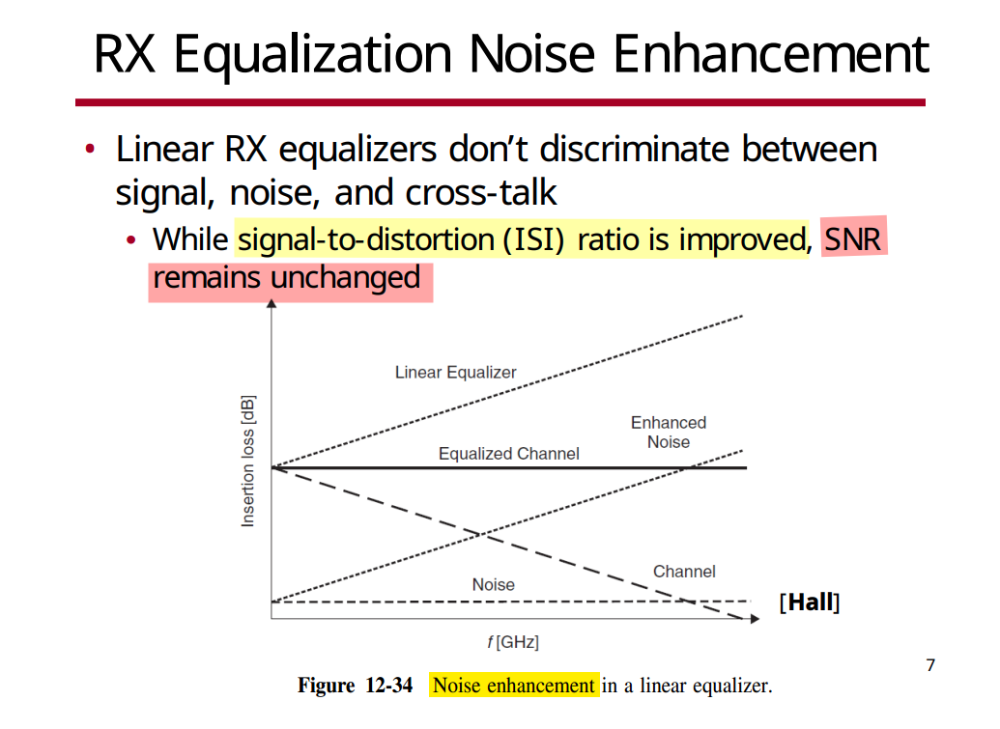
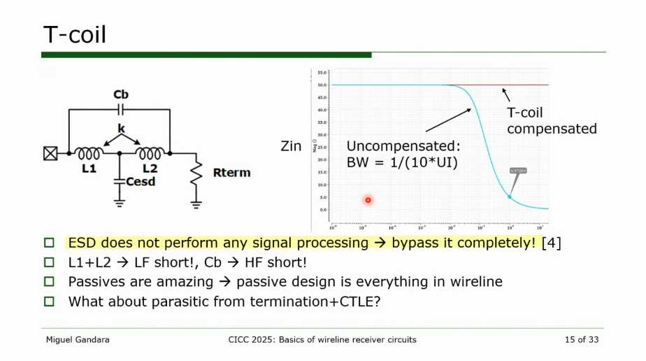
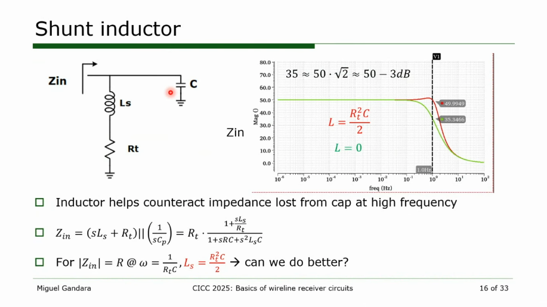
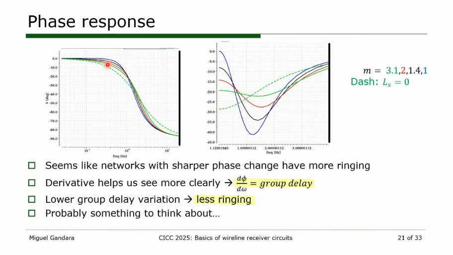

## Gm-TIA CTLE

*CTLE, with Gm + TIA structure*


> Pisati, et.al., "Sub-250mW 1-to-56Gb/s Continuous-Range PAM-4 42.5dB IL ADC/DAC- Based Transceiver in 7nm FinFET," 2019 IEEE International Solid-State Circuits Conference (ISSCC), 2019 [[https://sci-hub.se/10.1109/ISSCC.2019.8662428](https://sci-hub.se/10.1109/ISSCC.2019.8662428)]
>
> Z. Li, M. Tang, T. Fan and Q. Pan, "A 56-Gb/s PAM4 Receiver Analog Front-End With Fixed Peaking Frequency and Bandwidth in 40-nm CMOS," in *IEEE Transactions on Circuits and Systems II: Express Briefs*, vol. 68, no. 9, pp. 3058-3062, Sept. 2021 [[slides](https://confcats-event-sessions.s3.amazonaws.com/isicas21/slides/9402.pdf)] [[paper](https://sci-hub.se/10.1109/TCSII.2021.3074384)]
>
> K. Kwon *et al*., "A 212.5Gb/s Pam-4 Receiver With Mutual Inductive Coupled Gm-Tia in 4nm Finfet," *2025 Symposium on VLSI Technology and Circuits (VLSI Technology and Circuits)*, Kyoto, Japan, 2025


## RX Equalization Noise Enhancement

> Advanced Signal Integrity for High-Speed Digital Designs, S. H. Hall and H. L. Heck, John Wiley & Sons, 2009




Assuming $\mathrm{SNR}(f) = \frac{S_x(f)}{S_n(f)}$

## input network


---


> ```
> >> 10e6/2/pi/400/50
> 
> ans =
> 
> 79.5775
> ```




> charging parasitic from CTLE is signal processing,  bypassing the capacitor is not feasible







## Asymmetric T-Coil

*TODO* &#128197;


> Deog-Kyoon Jeong. Topics in IC Design: T-Coil [[pdf](https://ocw.snu.ac.kr/sites/default/files/NOTE/Lec%2010%20-%20Bandwidth%20Extension%20Techniques.pdf)]
>
> Razavi, Behzad, "The bridged T-coil [a circuit for all seasons]." IEEE Solid-State Circuits Magazine 7.4 (2015): 9-13. [[https://www.seas.ucla.edu/brweb/papers/Journals/BRFall15TCoil.pdf](https://www.seas.ucla.edu/brweb/papers/Journals/BRFall15TCoil.pdf)]


## reference

J. Kim et al., "A 112Gb/s PAM-4 transmitter with 3-Tap FFE in 10nm CMOS," 2018 IEEE International Solid-State Circuits Conference - (ISSCC), San Francisco, CA, USA, 2018 [[https://2024.sci-hub.se/6715/9a3d5a4825e551544403f87f0b9f6a89/10.1109@ISSCC.2018.8310204.pdf](https://2024.sci-hub.se/6715/9a3d5a4825e551544403f87f0b9f6a89/10.1109@ISSCC.2018.8310204.pdf)] [[slides](https://picture.iczhiku.com/resource/eetop/shiGDYTDYikLlnXv.pdf)]

Miguel Gandara. CICC2025 Circuits Insights: Wireline Receiver Circuits [[https://youtu.be/X4JTuh2Gdzg](https://youtu.be/X4JTuh2Gdzg)]
