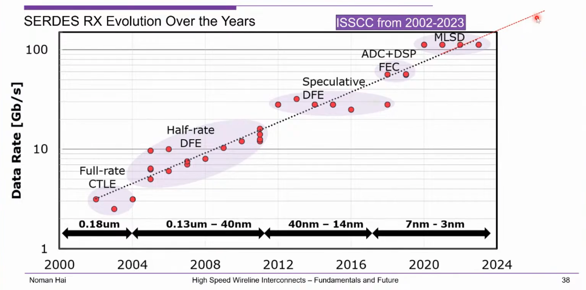

***speculative DFE*** is also known as ***loop unrolled DFE***, which solve the critical timing on first tap

---

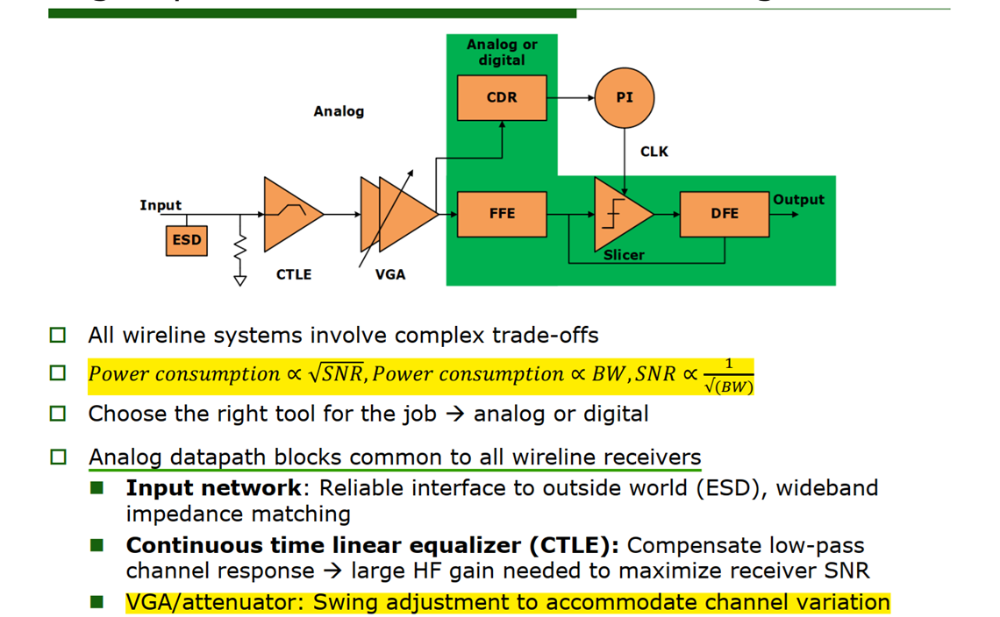

*VGA/attenuator: ensure a constant swing at the slicer input regardless of the channel variation*

---

## Inductive Peaking
*TODO* &#128197;

**series peaking**: *capacitive splitting* - *split* the load capacitance between the amplifier drain capacitance and the next stage gate capacitance

> S. Shekhar, J. S. Walling and D. J. Allstot, "Bandwidth Extension Techniques for CMOS Amplifiers," in IEEE Journal of Solid-State Circuits, vol. 41, no. 11, pp. 2424-2439, Nov. 2006 [[https://people.engr.tamu.edu/spalermo/ecen689_oi/2006_passive_bw_extension_techniques_shekhar_jssc.pdf](https://people.engr.tamu.edu/spalermo/ecen689_oi/2006_passive_bw_extension_techniques_shekhar_jssc.pdf)]

## CTLE Linearity

*TODO* &#128197;
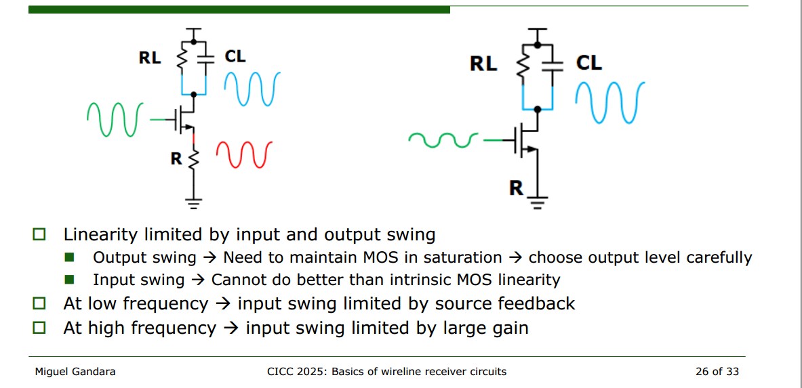

## Front-End Noise

> [https://people.engr.tamu.edu/spalermo/ecen689/lecture6_ee720_rx_circuits.pdf](https://people.engr.tamu.edu/spalermo/ecen689/lecture6_ee720_rx_circuits.pdf)

> 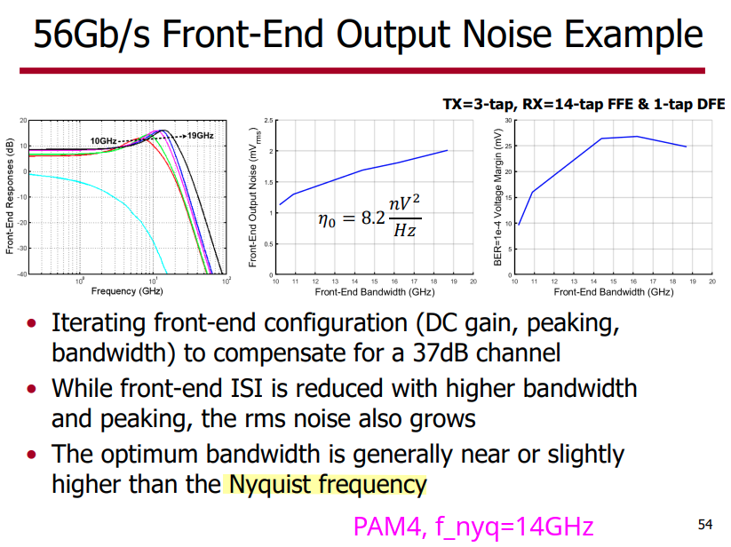

## DFE Error Propagation

*TODO* &#128197;

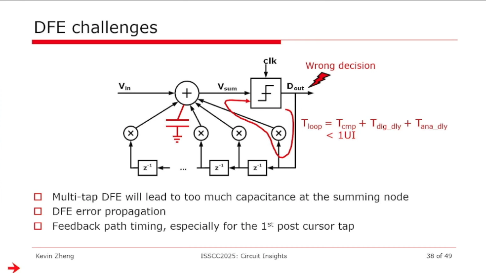

> Geoff Zhang. Preliminary Studies on DFE Error Propagation, Precoding, and their Impact on KP4 FEC Performance for PAM4 Signaling Systems [[https://www.ieee802.org/3/ck/public/18_09/zhang_3ck_01a_0918.pdf](https://www.ieee802.org/3/ck/public/18_09/zhang_3ck_01a_0918.pdf)]

## CTLE transfer function

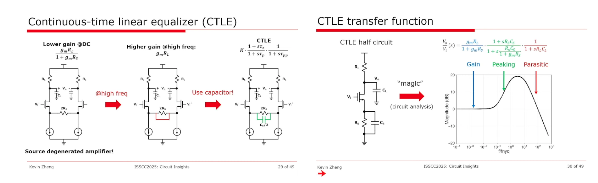

> Circuit Insights @ ISSCC2025: Circuits for Wireline Communications - Kevin Zheng [[https://youtu.be/8NZl81Dj45M?si=J11oGnXnkJYPUi2n&t=1045](https://youtu.be/8NZl81Dj45M?si=J11oGnXnkJYPUi2n&t=1045)]

## DFE architecture

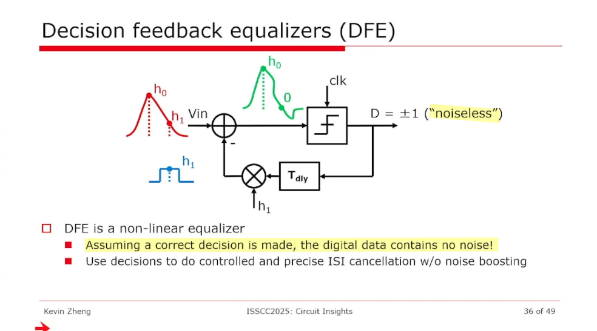

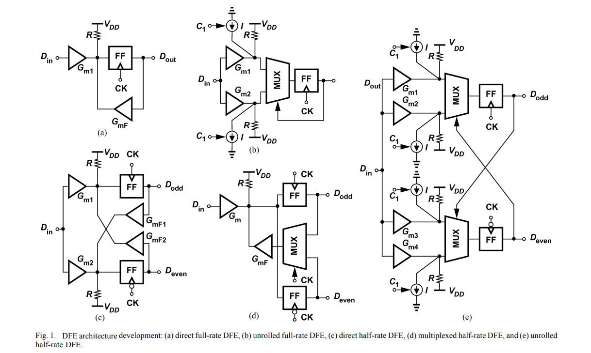

Extensive work on DFEs has produced a multitude of architectures, which can be broadly categorized as "**direct**"" or "**unrolled**" (**speculative**) DFEs with "**full-rate**" or "**half-rate**" clocking

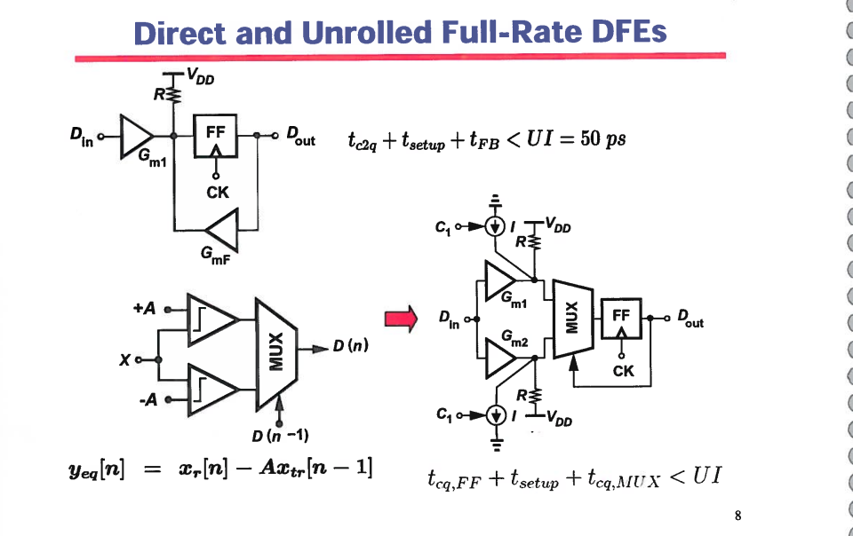

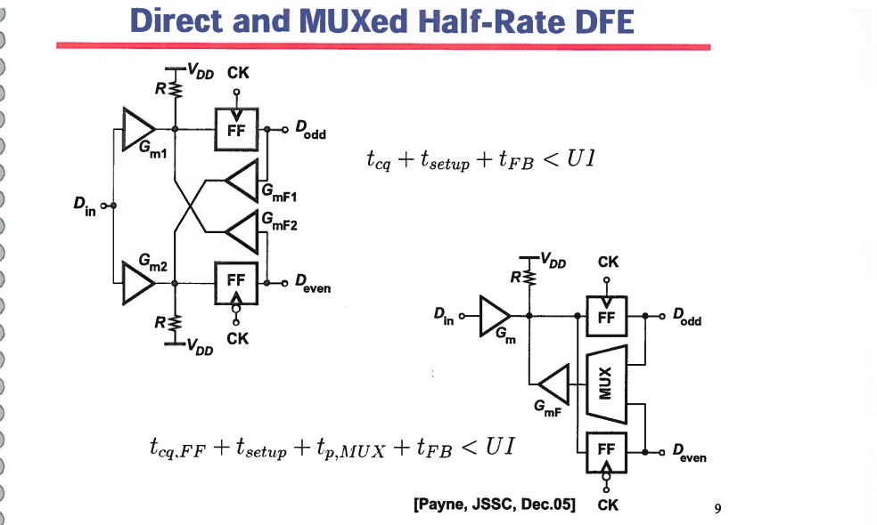

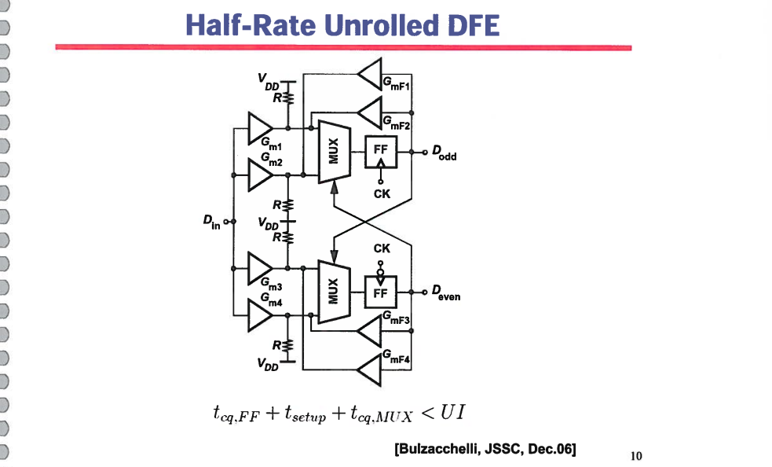

> S. Ibrahim and B. Razavi, "Low-Power CMOS Equalizer Design for 20-Gb/s Systems," in *IEEE Journal of Solid-State Circuits*, vol. 46, no. 6, pp. 1321-1336, June 2011 [[https://sci-hub.se/10.1109/JSSC.2011.2134450](https://sci-hub.se/10.1109/JSSC.2011.2134450)]
>
> S. Ibrahim and B. Razavi, *Low-Power DFE Design* [[https://picture.iczhiku.com/resource/eetop/wykflwIuIQDzYNcB.PDF](https://picture.iczhiku.com/resource/eetop/wykflwIuIQDzYNcB.PDF)]

## PAM4 DFE

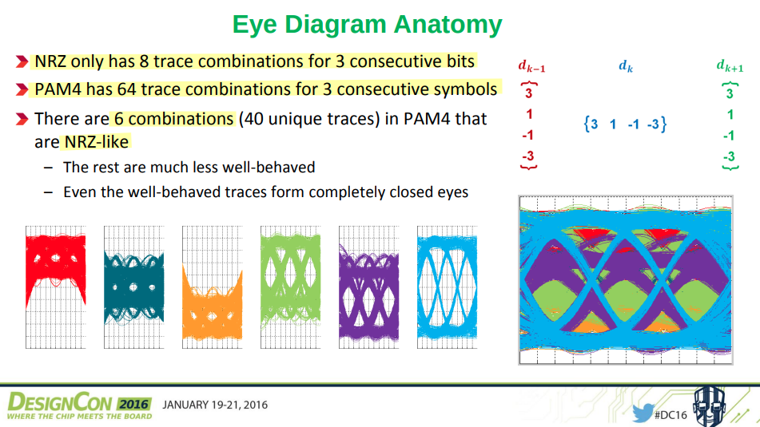

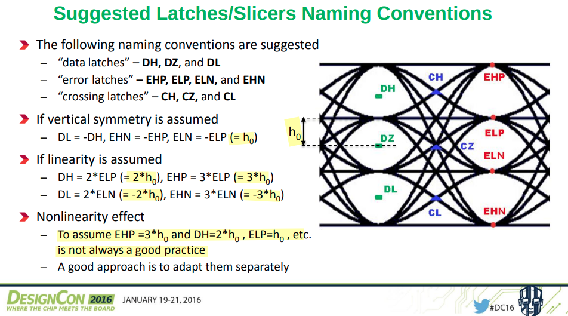

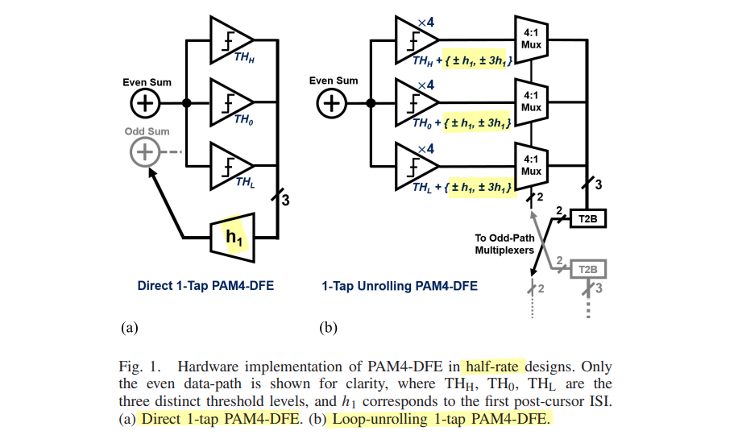

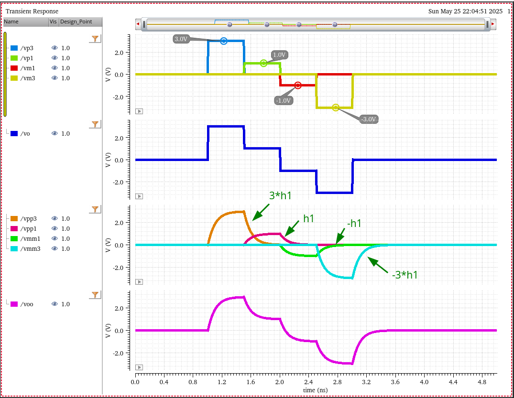

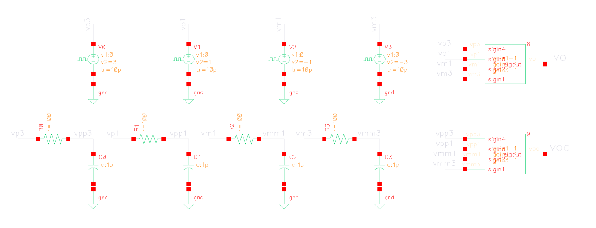

> K. -C. Chen, W. W. -T. Kuo and A. Emami, "A 60-Gb/s PAM4 Wireline Receiver With 2-Tap Direct Decision Feedback Equalization Employing Track-and-Regenerate Slicers in 28-nm CMOS," in *IEEE Journal of Solid-State Circuits*, vol. 56, no. 3, pp. 750-762, March 2021 [[https://www.mics.caltech.edu/wp-content/uploads/2021/02/JSSC-2020-Xavier-PAM4-Receiver.pdf](https://www.mics.caltech.edu/wp-content/uploads/2021/02/JSSC-2020-Xavier-PAM4-Receiver.pdf)]
>
> Hongtao Zhang, DesignCon 2016. PAM4 Signaling for 56G Serial Link Applications − A Tutorial [[https://www.xilinx.com/publications/events/designcon/2016/slides-pam4signalingfor56gserial-zhang-designcon.pdf](https://www.xilinx.com/publications/events/designcon/2016/slides-pam4signalingfor56gserial-zhang-designcon.pdf)]

## reference

Miguel Gandara, MediaTek. CICC 2025 Circuit Insights: Basics of Wireline Receiver Circuits [[https://youtu.be/X4JTuh2Gdzg](https://youtu.be/X4JTuh2Gdzg)]

Tony Chan Carusone, Alphawave Semi. VLSI2025 SC2: Connectivity Technologies to Accelerate AI

H. Park et al., "7.4 A 112Gb/s DSP-Based PAM-4 Receiver with an LC-Resonator-Based CTLE for >52dB Loss Compensation in 4nm FinFET," 2025 IEEE International Solid-State Circuits Conference (ISSCC), San Francisco, CA, USA, 2025

Noman Hai, Synopsys, Canada CASS Talks 2025 - May 2, 2025: High-speed Wireline Interconnects: Design Challenges and Innovations in 224G SerDes [[https://www.youtube.com/live/wHNOlxHFTzY](https://www.youtube.com/live/wHNOlxHFTzY)]
