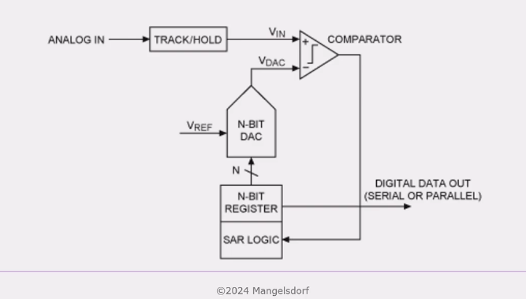
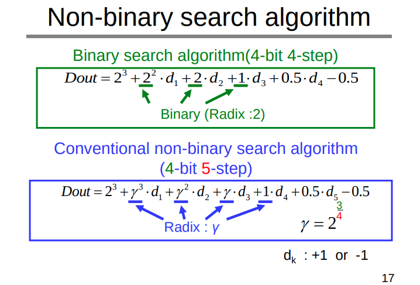
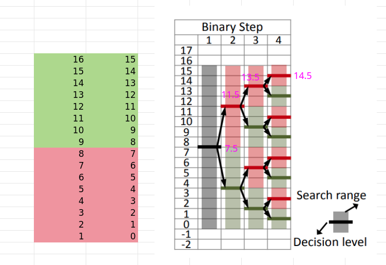
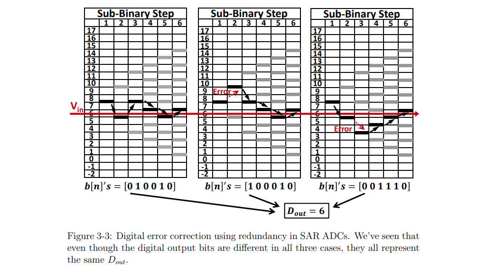
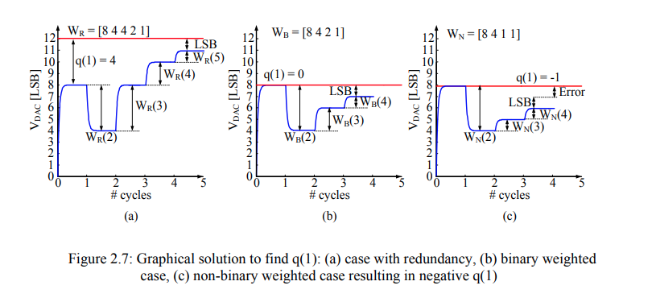
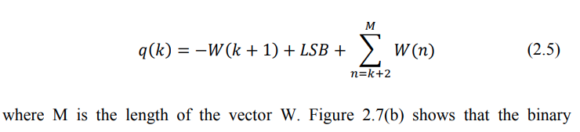

---

## Pipeline ADC

> CMP reference voltage is 0.5vref, DAC output is 0.5vref or 0

residual error
$$
V_{r,n} = (V_{r,n-1}-\frac{1}{2}b_{n})\cdot 2
$$
and $V_{r,-1}=V_i$
$$
V_{r,n-1} = 2^{n}V_i -\sum_{k=0}^{n-1}2^{n-k-1}b_k = 2^{n}\left(V_i - \sum_{k=0}^{n-1}\frac{b_k}{2^{k+1}}\right)
$$

here, $b_0$ is first stage and MSB

It divides the process into several comparison stages, the number of which is proportional to the number of bits

> Due to the pipeline structure of both analog and digital signal path, inter-stage **residue amplification** is needed which consumes considerable power and limits high speed operation

> Vishal Saxena, "Pipelined ADC Design - A Tutorial"[[https://www.eecis.udel.edu/~vsaxena/courses/ece517/s17/Lecture%20Notes/Pipelined%20ADC%20NonIdealities%20Slides%20v1_0.pdf](https://www.eecis.udel.edu/~vsaxena/courses/ece517/s17/Lecture%20Notes/Pipelined%20ADC%20NonIdealities%20Slides%20v1_0.pdf)] [[https://www.eecis.udel.edu/~vsaxena/courses/ece517/s17/Lecture%20Notes/Pipelined%20ADC%20Slides%20v1_2.pdf](https://www.eecis.udel.edu/~vsaxena/courses/ece517/s17/Lecture%20Notes/Pipelined%20ADC%20Slides%20v1_2.pdf)]
>
> Bibhu Datta Sahoo, Analog-to-Digital Converter Design From System Architecture to Transistor-level [[http://smdpc2sd.gov.in/downloads/IGF/IGF%201/Analog%20to%20Digital%20Converter%20Design.pdf](http://smdpc2sd.gov.in/downloads/IGF/IGF%201/Analog%20to%20Digital%20Converter%20Design.pdf)] 
>
> Bibhu Datta Sahoo, Associate Professor, IIT, Kharagpur, [[https://youtu.be/HiIWEBAYRJY?si=pjQnIdi03i5N7805](https://youtu.be/HiIWEBAYRJY?si=pjQnIdi03i5N7805)]

## Synchronous SAR ADC

It also divides a full conversion into several comparison stages in a way similar to the *pipeline ADC*, except the algorithm is executed **sequentially** rather than in *parallel* as in the pipeline case.

However, the sequential operation of the SA algorithm has traditionally been a *limitation in achieving high-speed operation*

- a clock running at least $(N + 1) \cdot F_s$ is required for an $N$-bit converter with conversion rate of $F_s$
- every clock cycle has to tolerate the worst case comparison time
- every clock cycle requires margin for the clock jitter 

> The power and speed limitations of a synchronous SA design comes largely from the *high-speed internal clock*

### Split Arrary CDAC

> *Split* capacitor, double-array cap
>
> attenuation capacitance $C_a$

$$\begin{align}
\Delta V_{dac} &= \frac{1}{2}b_3+\frac{1}{4}b_2+\frac{1}{4}\left(\frac{1}{2}b_1+\frac{1}{4}b_0 \right) \\
&= \frac{1}{2}b_3+\frac{1}{4}b_2 + \frac{1}{8}b_1+\frac{1}{16}b_0
\end{align}$$

## Redundancy

For overlapped search ranges, a less than ***radix-2 (sub-binary)*** search is needed. Essentially, a sub-binary search takes ***more than $N$ steps*** to convert an analog input into a ***$N$-bit digital output***

**Binary search algorithm(4-bit 4-step):**

$$\begin{align}
D_\text{out} &= d_1 \cdot 2^3 + d_2 \cdot 2^2 + d_3 \cdot 2^1 + d_4 \cdot 2^0 \\
&= \frac{2d_1-1}{2} \cdot 2^3 + \frac{2d_2-1}{2} \cdot 2^2 + \frac{2d_3-1}{2} \cdot 2^1 + \frac{2d_4-1}{2} \cdot 2^0 +\frac{1}{2}\sum_{k=0}^3 2^k \\
&= D_1 \cdot 2^2 + D_2\cdot 2 + D_3 \cdot 1 + D_4 \cdot 0.5 + 2^3-0.5
\end{align}$$

where $d_k \in \{0, 1\}$ and $D_k=2d_k-1$, $D_k\in\{+1,-1\}$

---

That is
$$
D_\text{out} = \sum_{i=1}^{M-1}b[i]\cdot 2s(i) +b[0]+S(M)-\sum_{i=1}^{M-1}s(i)-1
$$
which is valid in binary weighted search, obviously.

> note $s[?]$ is not cap weight in non-binary search 

###  max recoverable error

> Chang, Albert Hsu Ting. "Low-power high-performance SAR ADC with redundancy and digital background calibration." (2013). [[https://dspace.mit.edu/bitstream/handle/1721.1/82177/861702792-MIT.pdf](https://dspace.mit.edu/bitstream/handle/1721.1/82177/861702792-MIT.pdf)]
>
> Kuttner, Franz. "A 1.2V 10b 20MSample/s non-binary successive approximation ADC in 0.13/spl mu/m CMOS." *2002 IEEE International Solid-State Circuits Conference. Digest of Technical Papers (Cat. No.02CH37315)* 1 (2002): 176-177 vol.1. [[https://sci-hub.se/10.1109/ISSCC.2002.992993](https://sci-hub.se/10.1109/ISSCC.2002.992993)]
>
> T. Ogawa, H. Kobayashi, et. al., "SAR ADC Algorithm with Redundancy and Digital Error Correction." IEICE Trans. Fundam. Electron. Commun. Comput. Sci. 93-A (2010): 415-423. [[paper](https://sci-hub.se/https://doi.org/10.1587/transfun.E93.A.415), [slides](https://pdfs.semanticscholar.org/9745/3f1a69d43414c123965280cd6fc45274f296.pdf)]
>
> B. Murmann, “On the use of redundancy in successive approximation A/D converters,” International Conference on Sampling Theory and Applications (SampTA), Bremen, Germany, July 2013.  [[https://www.eurasip.org/Proceedings/Ext/SampTA2013/papers/p556-murmann.pdf](https://www.eurasip.org/Proceedings/Ext/SampTA2013/papers/p556-murmann.pdf)]
>
> Krämer, M. et al. (2015) *High-resolution SAR A/D converters with loop-embedded input buffer*. dissertation. Available at: [[http://purl.stanford.edu/fc450zc8031](http://purl.stanford.edu/fc450zc8031)].

## Asynchronous processing

a global clock running at the sample rate is still used for an **uniform sampling**

> The concept of asynchronous processing is to trigger the internal comparison from MSB to LSB like
> *dominoes*. 

The maximum resolving time reduction between synchronous and asynchronous case is ***two fold***  

## reference

S. -W. M. Chen and R. W. Brodersen, "A 6-bit 600-MS/s 5.3-mW Asynchronous ADC in 0.13-μm CMOS," in *IEEE Journal of Solid-State Circuits*, vol. 41, no. 12, pp. 2669-2680, Dec. 2006

Shuo-Wei Chen, Power Efficient System and A/D Converter Design for Ultra-Wideband Radio [[http://www2.eecs.berkeley.edu/Pubs/TechRpts/2006/EECS-2006-71.pdf](http://www2.eecs.berkeley.edu/Pubs/TechRpts/2006/EECS-2006-71.pdf)]

Andrea Baschirotto, "T6: SAR ADCs" ISSCC2009

Pieter Harpe, ISSCC 2016 Tutorial: "Basics of SAR ADCs Circuits & Architectures"

C. -C. Liu, S. -J. Chang, G. -Y. Huang and Y. -Z. Lin, "A 10-bit 50-MS/s SAR ADC With a Monotonic Capacitor Switching Procedure," in *IEEE Journal of Solid-State Circuits*, vol. 45, no. 4, pp. 731-740, April 2010 [[https://sci-hub.se/10.1109/JSSC.2010.2042254](https://sci-hub.se/10.1109/JSSC.2010.2042254)]
