## Reference Ripple

> C-H Chan (U. of Macau) "Extreme SAR ADCs - Exploring New Frontiers" Online Course (2024) : Reference Buffer in SAR ADC [[https://youtu.be/vj98B7AaC9E](https://youtu.be/vj98B7AaC9E)]
>
> C. Li, C. -H. Chan, Y. Zhu and R. P. Martins, "Analysis of Reference Error in High-Speed SAR ADCs With Capacitive DAC," in IEEE Transactions on Circuits and Systems I: Regular Papers, vol. 66, no. 1, pp. 82-93, Jan. 2019 [[https://ime.um.edu.mo/wp-content/uploads/magazines/961546494e705f6fd16b9f785a121030.pdf](https://ime.um.edu.mo/wp-content/uploads/magazines/961546494e705f6fd16b9f785a121030.pdf)]
>
> J. Zhong, Y. Zhu, S. -W. Sin, S. -P. U and R. P. Martins, "Thermal and Reference Noise Analysis of Time-Interleaving SAR and Partial-Interleaving Pipelined-SAR ADCs," in IEEE Transactions on Circuits and Systems I: Regular Papers, vol. 62, no. 9, pp. 2196-2206, Sept. 2015 [[https://sci-hub.st/10.1109/TCSI.2015.2452331](https://sci-hub.st/10.1109/TCSI.2015.2452331)]
>
> C. -H. Chan et al., "60-dB SNDR 100-MS/s SAR ADCs With Threshold Reconfigurable Reference Error Calibration," in IEEE Journal of Solid-State Circuits, vol. 52, no. 10, pp. 2576-2588, Oct. 2017 [[https://ime.um.edu.mo/wp-content/uploads/magazines/407e580ac0218605bcf9b9bbd0ea1109.pdf](https://ime.um.edu.mo/wp-content/uploads/magazines/407e580ac0218605bcf9b9bbd0ea1109.pdf)]


*TODO* &#128197;


## Sampling Front-End (SFE) Pulse Response

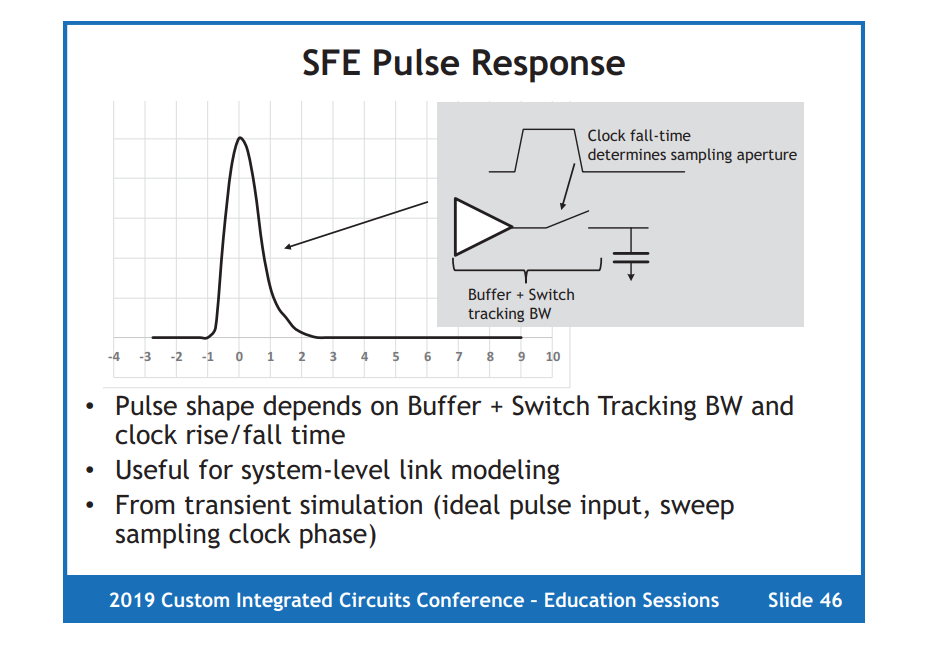

sweep the setup time between ideal pulse input and clock, sample the output of SFE at falling edge


### sample-by-sample

> 3rd harmonic

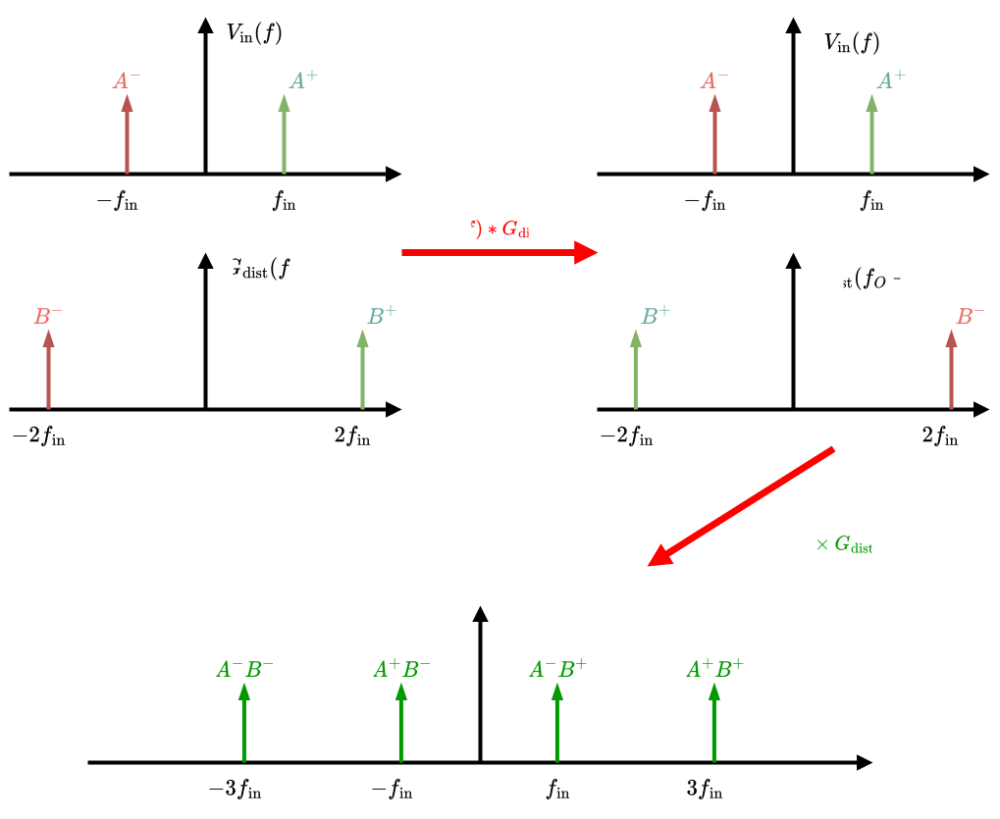


### bit-by-bit

The amplitude of the reference ripple is code-dependent as it is correlated with switching energy in each bit cycling


## SAR ADC Noise Analysis

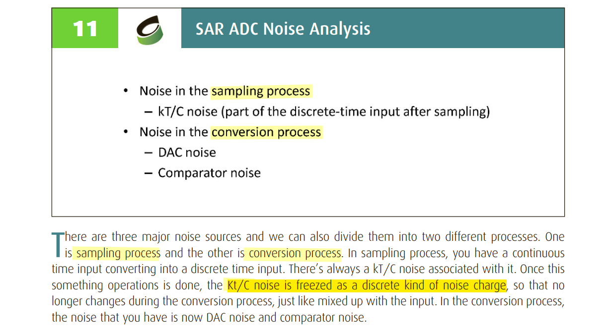

### kT/C Noise in sampling

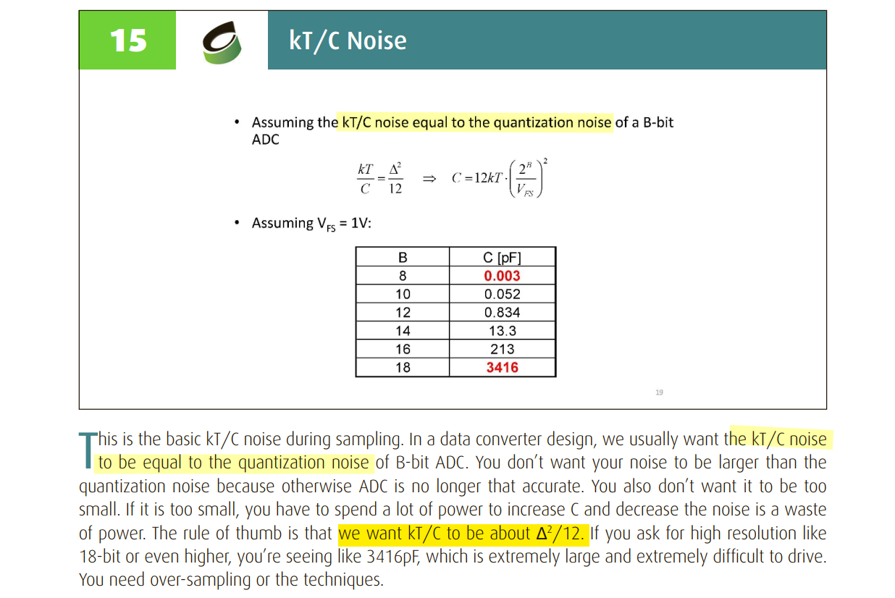

### DAC Noise in conversion

> T. Miki et al., "A 4.2 mW 50 MS/s 13 bit CMOS SAR ADC With SNR and SFDR Enhancement Techniques," in IEEE Journal of Solid-State Circuits, vol. 50, no. 6, pp. 1372-1381, June 2015 [[https://sci-hub.jp/10.1109/JSSC.2015.2417803](https://sci-hub.jp/10.1109/JSSC.2015.2417803)]

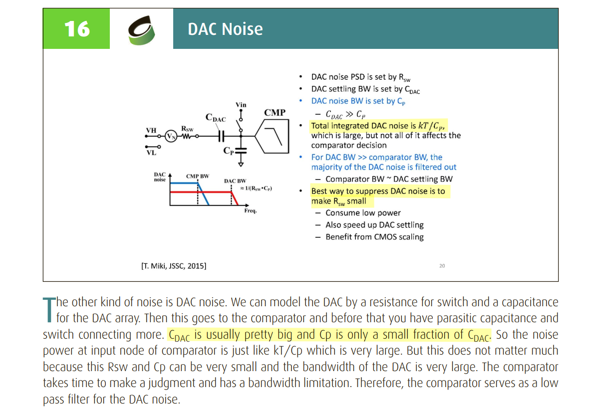

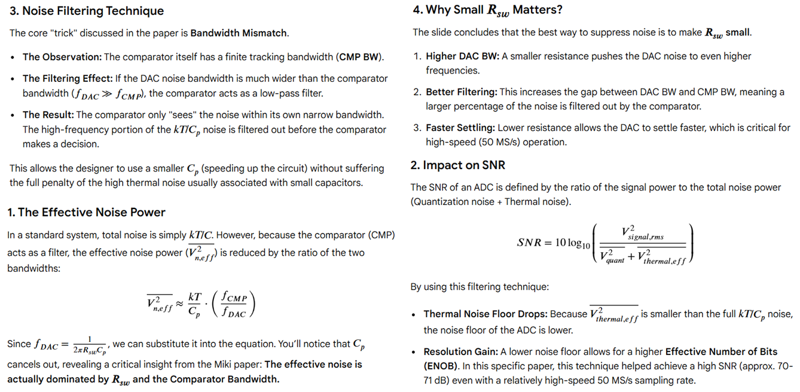

### Comparator Noise in conversion

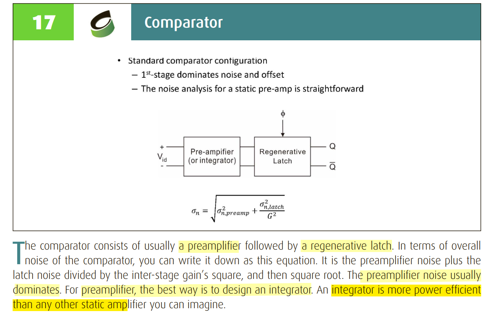

---

---

***noise analysis for dynamic integrator***

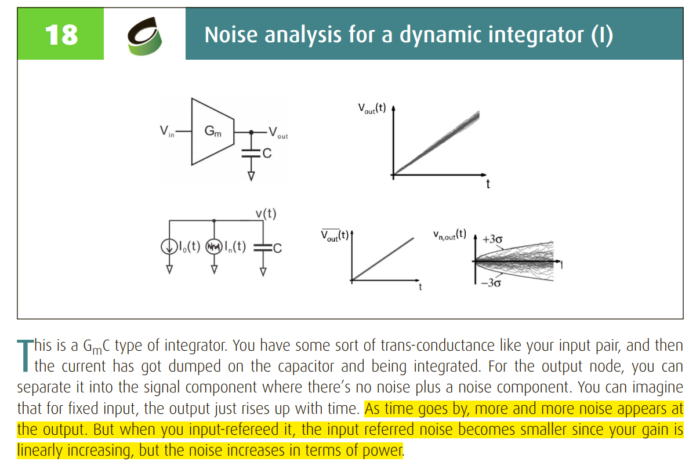

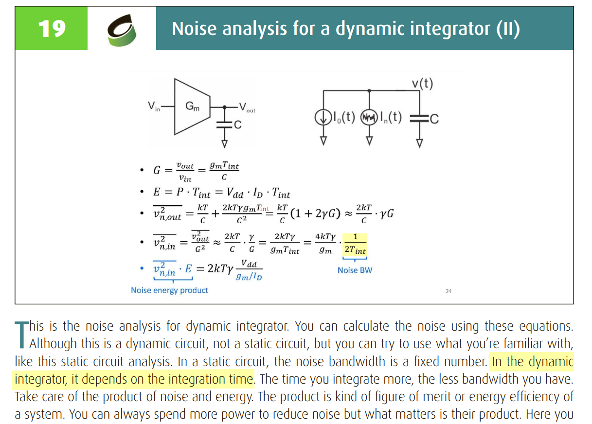

---

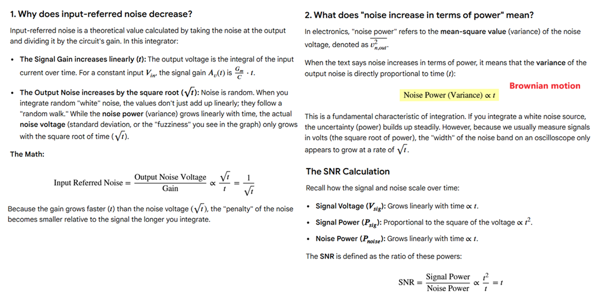

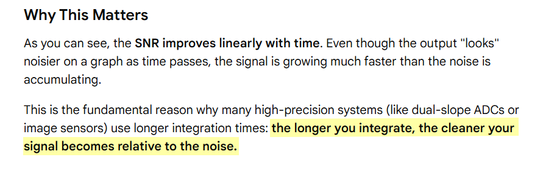

---

***noise analysis for latch phase***

> P. Nuzzo, F. De Bernardinis, P. Terreni and G. Van der Plas, "Noise Analysis of Regenerative Comparators for Reconfigurable ADC Architectures," in *IEEE Transactions on Circuits and Systems I: Regular Papers*, vol. 55, no. 6, pp. 1441-1454, July 2008

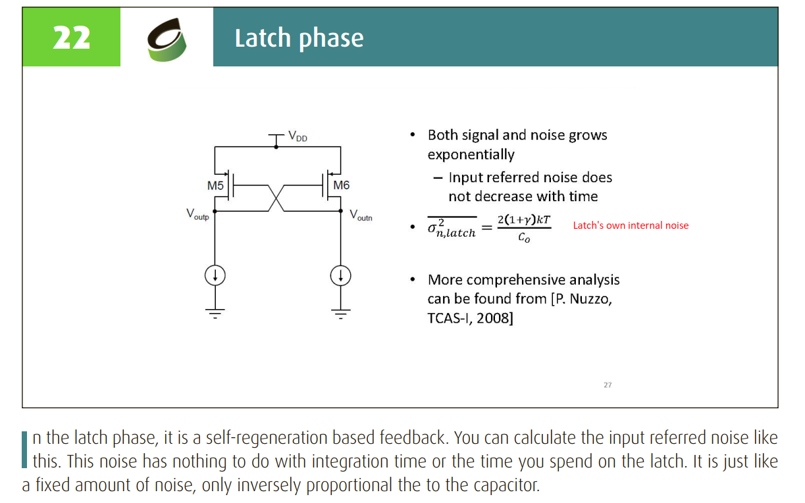


## Comparator

### Comparator input cap effect

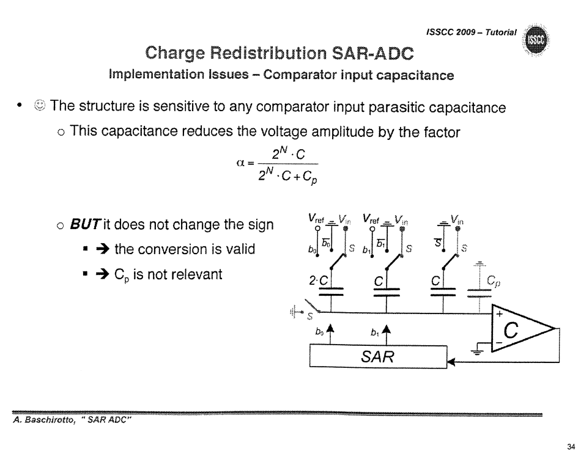
$$
-V_{in}\cdot 2^N C = V_c (2^N C + C_p)
$$
Then $V_c = -\frac{2^N C}{2^N C + C_p}V_{in}$, i.e. this capacitance reduce the voltage amplitude by the factor

During conversion
$$\begin{align}
V_c &= -\frac{2^N C}{2^N C + C_p}V_{in} +V_{ref}\sum_{n=0}^{N-1} \frac{b_n\cdot2^n C}{2^N C + C_p} \\
&= \frac{2^N C}{2^N C + C_p}\left(-V_{in} + V_{ref}\sum_{n=0}^{N-1}\frac{b_n }{2^{N-n}}  \right)
\end{align}$$

That is, it does not change the sign


### Comparator offset effect

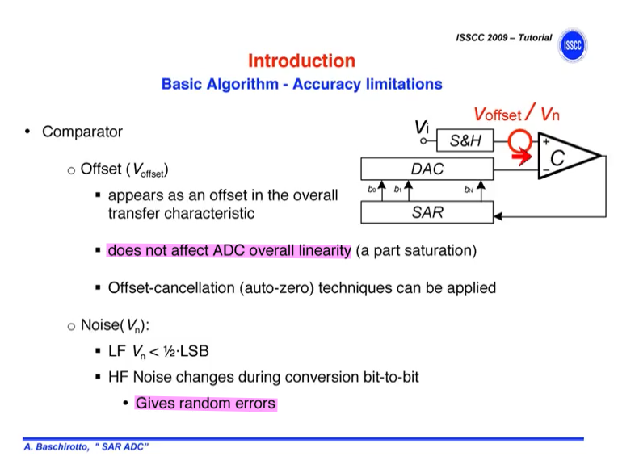


## CDAC

The *charge redistribution capacitor network* is used to sample the input signal and serves as a
digital-to-analog converter (DAC) for creating and subtracting reference voltages

sampling charge
$$
Q = V_{in} C_{tot}
$$
conversion charge
$$
Q = -C_{tot}V_c + V_{ref}C_\Delta
$$
That is
$$
V_c = \frac{C_\Delta}{C_{tot}}V_{ref} - V_{in}
$$

---

CDAC is actually working as a **capacitive divider** during *conversion phase*, the charge of internal node retain (*charge conservation law*)

assuming $\Delta V_i$ is applied to series capacitor $C_1$ and $C_2$

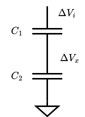
$$
(\Delta V_i - \Delta V_x) C_1 = \Delta V_x \cdot C_2
$$
Then
$$
\Delta V_x = \frac{C_1}{C_1+C_2}\Delta V_i
$$

> $V_x= V_{x,0} + \Delta V_x$


### CDAC Settling Accuracy

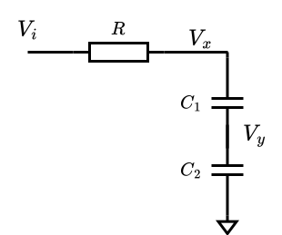
$$
V_x(s) = \frac{C_1+C_2}{RC_1C_2}\cdot \frac{1}{s+\frac{C_1+C_2}{RC_1C_2}}\cdot V_i(s) = \frac{1}{\tau}\cdot \frac{1}{s+\frac{1}{\tau}}\cdot \frac{1}{s}=  \frac{1}{\tau}\cdot \tau(\frac{1}{s} - \frac{1}{s+\frac{1}{\tau}})=\frac{1}{s} - \frac{1}{s+\frac{1}{\tau}}
$$

inverse Laplace Transform is $V_x(t) = 1 - e^{-t/\tau}$

$$
V_y(s) = V_x\frac{C_1}{C_1+C_2} = \frac{C_1}{C_1+C_2} \left(\frac{1}{s} - \frac{1}{s+\frac{1}{\tau}}\right)
$$

inverse Laplace Transform is $V_y(t) = \frac{C_1}{C_1+C_2}\left(1 - e^{-t/\tau}\right)$

$V_x(t)$ and $V_y(t)$ prove that the settling time is *same*


$\tau = R\frac{C_1C_2}{C_1+C_2}$, which means usually worst for MSB capacitor (largest)

> both $\tau$ and $\Delta V$ are the maximum

A popular way to improve the settling behavior, again, is to employ unit-element DACs that statistically reduce the switching activities, which, unfortunately, exhibits unnecessary complications to the power, area and speed tradeoffs of the design


---

**In a SAR conversion the DAC doesn't move by full scale** — the **MSB trial is the largest single step**, and it is exactly **half of full scale**. Subsequent trials step by $V_{FS}/4$, $V_{FS}/8$, … So the MSB transition ($\color{red}0 \to V_{FS}/2$) is the worst case, and if it settles in the allotted per-bit time, every later trial does too.

<span style="color:white; background-color:black">The accuracy criterion</span>

The settling error must stay below half an LSB, where $\text{LSB} = V_{FS}/2^{n}$:

$$
\frac{V_{FS}}{2} - V_{DAC}(t_{settle}) \;\le\; \frac{1}{2}\cdot\frac{V_{FS}}{2^{n}} = \frac{V_{FS}}{2^{\,n+1}}
$$

Rearranged
$$
V_{DAC}(t_{settle}) \ge V_{FS}\left(\frac{1}{2}-\frac{1}{2^{n+1}}\right)
$$

<span style="color:white; background-color:black">Solving for the time</span>
$$
\frac{V_{FS}}{2}e^{-t_{settle}/\tau} \le \frac{V_{FS}}{2^{\,n+1}} \;\Longrightarrow\; e^{-t_{settle}/\tau} \le 2^{-n}
$$

$$
\boxed{\;t_{settle} \ge n\,\tau\ln 2 \approx 0.693\,n\,\tau\;}
$$

| $n$               | 8    | 10   | 12   | 14   | 16   |
| ----------------- | ---- | ---- | ---- | ---- | ---- |
| $t_{settle}/\tau$ | 5.5  | 6.9  | 8.3  | 9.7  | 11.1 |


### CDAC Energy Consumption


$$
E_{Vref} = \int P(t)dt = \int V_{ref} I(t) dt = V_{ref}\int I(t)dt = V_{ref}\cdot \Delta Q
$$


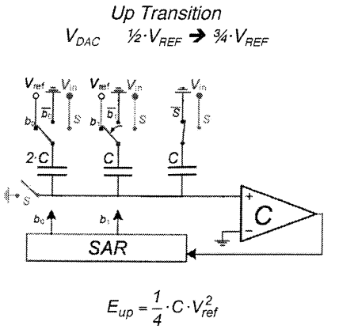

Given $V_{c,0}=\frac{1}{2}V_{ref}-V_{in}$ and $V_{c,1}=\frac{3}{4}V_{ref}-V_{in}$
$$\begin{align}
Q_{b0,0} &= \left(V_{ref} - V_{c,0} \right)\cdot 2C = \left(\frac{1}{2}V_{ref}+V_{in} \right)\cdot 2C \\
Q_{b1,0} &= (0 - V_{c,0})\cdot C = \left(-\frac{1}{2}V_{ref}+V_{in} \right)\cdot C \\
Q_{b0,1} &= \left(V_{ref} - V_{c,1} \right)\cdot 2C = \left(\frac{1}{4}V_{ref}+V_{in} \right)\cdot 2C \\
Q_{b1,1} &= \left(V_{ref} - V_{c,1} \right)\cdot C = \left(\frac{1}{4}V_{ref}+V_{in} \right)\cdot C
\end{align}$$

Therefore
$$
E_{Vref} = V_{ref}\cdot (Q_{b0,1}+Q_{b1,1} - Q_{b0,0}-Q_{b1,0}) = \frac{1}{4}C V_{ref}^2
$$


---

CDAC total energy change
$$\begin{align}
\Delta E_{tot} &= \frac{1}{2}\cdot 2C \cdot (U_{2c,1}^2  - U_{2c,0}^2) + \frac{1}{2}\cdot C \cdot (U_{c,1}^2  - U_{c,0}^2) + \frac{1}{2}\cdot C \cdot (U_{c1,1}^2  - U_{c1,0}^2) \\
&= \left(-\frac{3}{16}V_{ref}^2 - \frac{1}{2}V_{ref}V_{in} - \frac{3}{32}V_{ref}^2+\frac{3}{4}V_{ref}V_{vin} + \frac{5}{32}V_{ref}^2-\frac{1}{4}V_{ref}V_{in}\right)C \\
&= -\frac{1}{8}CV_{ref}^2
\end{align}$$


***alternative method***

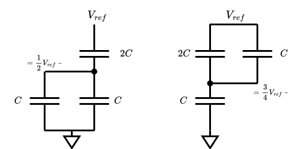
$$
\Delta E_{tot} = \frac{1}{2}\cdot\frac{3}{4}C\cdot V_{ref}^2  -  \frac{1}{2}\cdot C\cdot V_{ref}^2 = -\frac{1}{8}CV_{ref}^2
$$


> The total energy decreases by $-\frac{1}{8}CV_{ref}^2$, though $V_{ref}$ provides $\frac{1}{4}C V_{ref}^2$


---

The charge redistribution change the CDAC energy

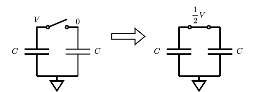


$$
E_{c,0} = \frac{1}{2}CV^2
$$
After charge redistribution
$$
E_{c,1} = \frac{1}{2}\cdot 2C\cdot \left(\frac{1}{2}V\right)^2 = \frac{1}{4}CV^2
$$

> That make sense, **charge redistribution consume energy**


### Binary-Weighted (BW) DAC

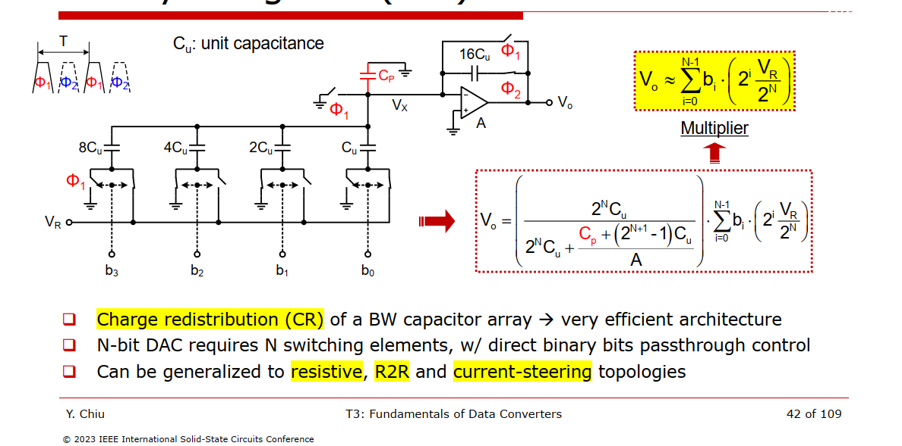

During $\Phi_1$, all capacitor are shorted, the net charge at $V_x$ is 0

During $\Phi_2$, the charge at bottom plate of CDAC
$$
Q_{DAC,btm} = \sum_{i=0}^{N-1}(b_i\cdot V_R - V_x)\cdot 2^{i}C_u = C_uV_R\sum_{i=0}^{N-1}b_i2^i - (2^N-1)C_uV_x
$$
the charge at the internal plate of integrator
$$
Q_{intg} = V_x C_p + (V_x - V_o)2^NC_u
$$
and we know $-V_x A = V_o$ and $Q_{DAC,btm} = Q_{intg}$
$$
C_uV_R\sum_{i=0}^{N-1}b_i2^i - (2^N-1)C_uV_x = V_x C_p + (V_x - V_o)2^NC_u
$$
i.e.
$$
C_uV_R\sum_{i=0}^{N-1}b_i2^i = (2^N-1)C_uV_x + V_x C_p + (V_x - V_o)2^NC_u
$$
therefore
$$
-V_o = \frac{2^N C_u}{\frac{(2^{N+1}-1)C_u+C_p}{A}+2^NC_u}\sum_{i=0}^{N-1}b_i\left(2^i\frac{V_R}{2^N}\right)\approx \sum_{i=0}^{N-1}b_i\left(2^i\frac{V_R}{2^N}\right)
$$

---

> *Midscale (MSB Transition)* often is the *largest DNL error*

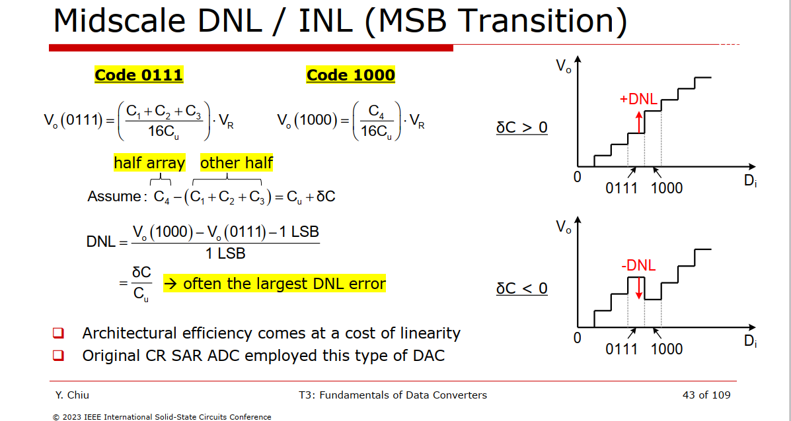

> $C_4$ and $C_1+C_2+C_3$ are independent (can't cancel out) and their variance is two largest ($16\sigma_u^2$, $15\sigma_u^2$, ), the total standard deviation is $\sqrt{16\sigma_u^2+15\sigma_u^2}=\sqrt{31}\sigma_u$


### CDAC with Custom MoM

> P. J. A. Harpe *et al*., "A 26 μ W 8 bit 10 MS/s Asynchronous SAR ADC for Low Energy Radios," in *IEEE Journal of Solid-State Circuits*, vol. 46, no. 7, pp. 1585-1595, July 2011 [[https://sci-hub.ru/10.1109/JSSC.2011.2143870](https://sci-hub.ru/10.1109/JSSC.2011.2143870)]
>
> P. Harpe, "A Compact 10-b SAR ADC With Unit-Length Capacitors and a Passive FIR Filter," in *IEEE Journal of Solid-State Circuits*, vol. 54, no. 3, pp. 636-645, March 2019 [[https://sci-hub.ru/10.1109/JSSC.2018.2878830](https://sci-hub.ru/10.1109/JSSC.2018.2878830)]

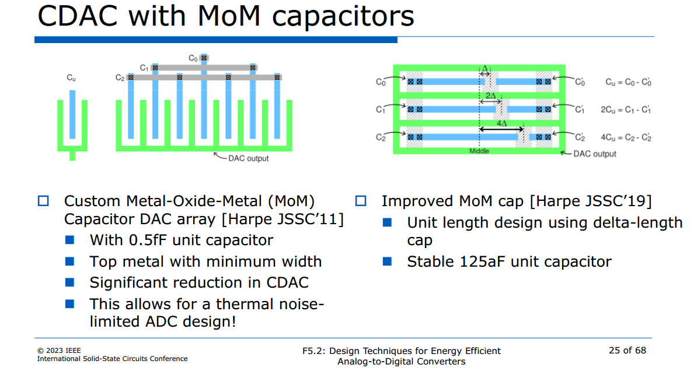


## CDAC Switching Scheme

> Y. Zhu *et al*., "A 10-bit 100-MS/s Reference-Free SAR ADC in 90 nm CMOS," in *IEEE Journal of Solid-State Circuits*, vol. 45, no. 6, pp. 1111-1121, June 2010 [[https://sci-hub.ru/10.1109/JSSC.2010.2048498](https://sci-hub.ru/10.1109/JSSC.2010.2048498)]
>
> C. -C. Liu, S. -J. Chang, G. -Y. Huang and Y. -Z. Lin, "A 10-bit 50-MS/s SAR ADC With a Monotonic Capacitor Switching Procedure," in *IEEE Journal of Solid-State Circuits*, vol. 45, no. 4, pp. 731-740, April 2010 [[https://sci-hub.ru/10.1109/JSSC.2010.2042254](https://sci-hub.ru/10.1109/JSSC.2010.2042254)]

<span style="background-color:yellow">**VCM-based switching scheme**</span>, <span style="background-color:yellow">**Monotonic switching scheme**</span>

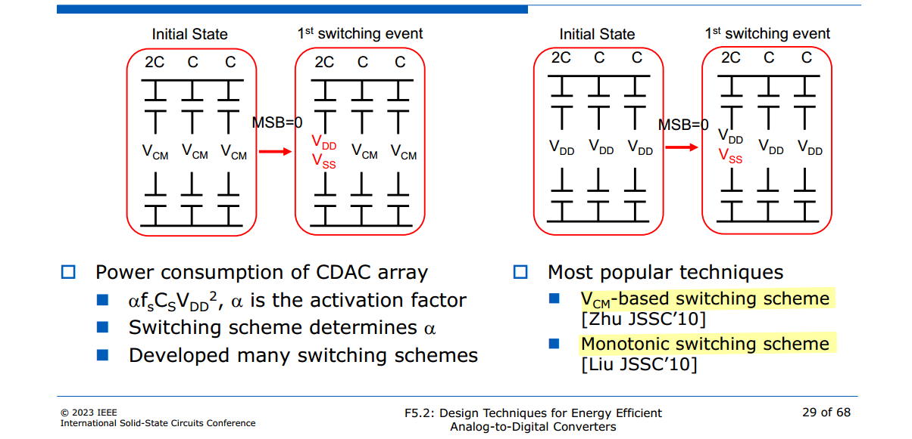


---

<span style="color:white; background-color:black">**CDAC with constant common-mode voltage**</span>

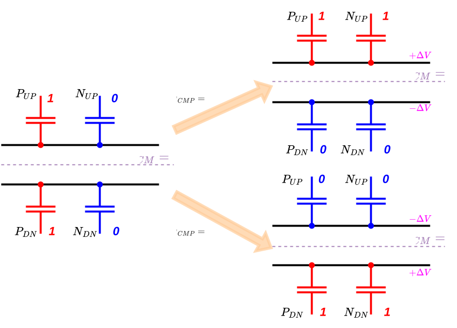

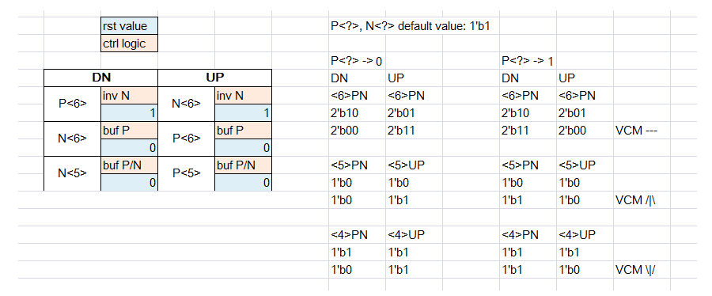


## Synchronous SAR ADC

It also divides a full conversion into several comparison stages in a way similar to the *pipeline ADC*, except the algorithm is executed **sequentially** rather than in *parallel* as in the pipeline case.

However, the sequential operation of the SA algorithm has traditionally been a *limitation in achieving high-speed operation*

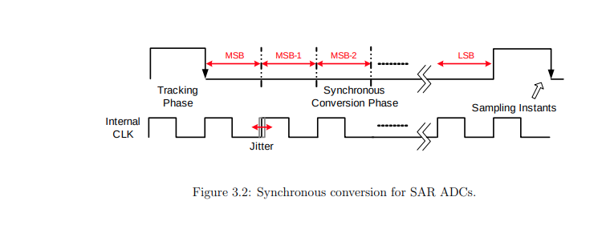

- a clock running at least $(N + 1) \cdot F_s$ is required for an $N$-bit converter with conversion rate of $F_s$
- every clock cycle has to tolerate the worst case comparison time
- every clock cycle requires margin for the clock jitter 

> The power and speed limitations of a synchronous SA design comes largely from the *high-speed internal clock*


### Split Arrary CDAC

> *Split* capacitor, double-array cap
>
> attenuation capacitance $C_a$

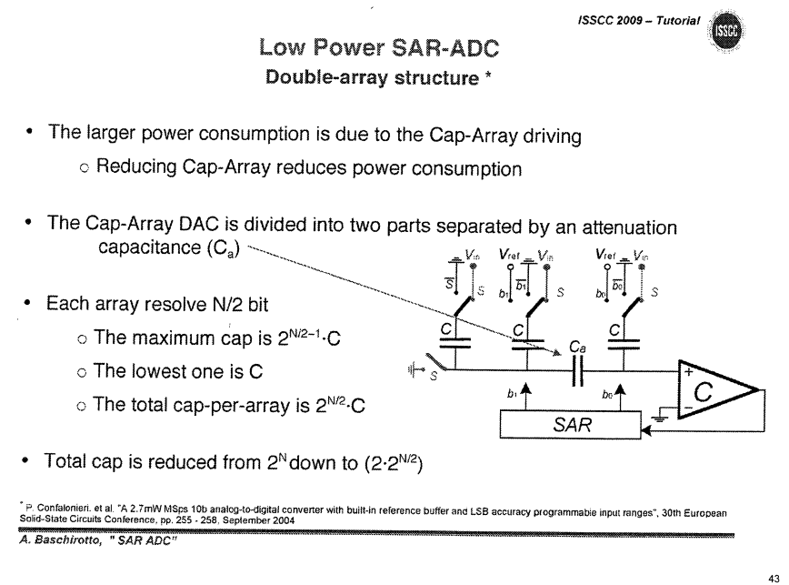

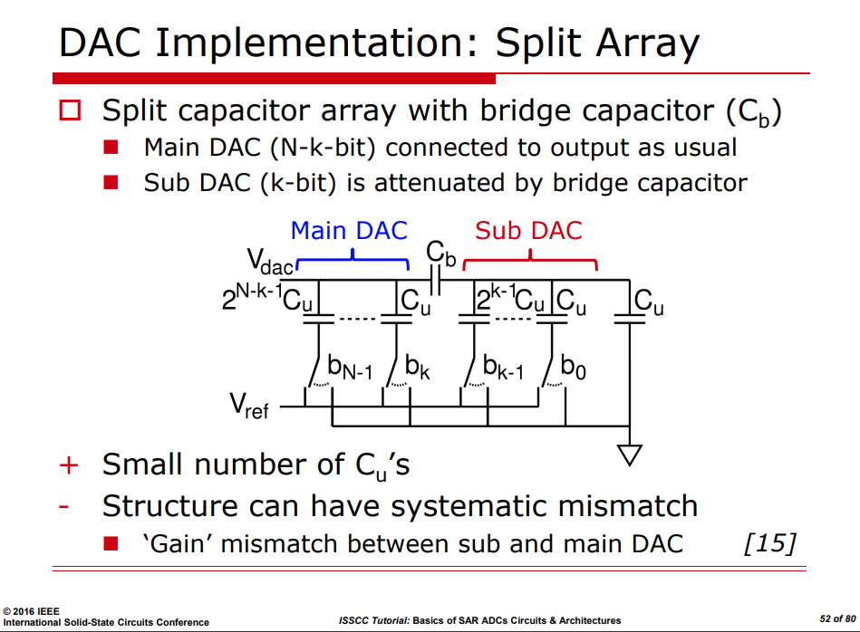

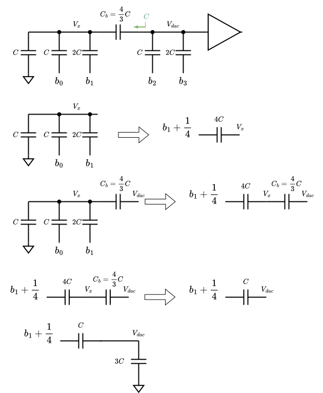

$$
\Delta V_{dac} = \frac{1}{2}b_3+\frac{1}{4}b_2+\frac{1}{4}\left(\frac{1}{2}b_1+\frac{1}{4}b_0 \right) = \frac{1}{2}b_3+\frac{1}{4}b_2 + \frac{1}{8}b_1+\frac{1}{16}b_0
$$


## Asynchronous SAR ADC

> Mike Shuo-Wei Chen and R. W. Brodersen, "A 6-bit 600-MS/s 5.3-mW Asynchronous ADC in 0.13-μm CMOS," in *IEEE Journal of Solid-State Circuits*, vol. 41, no. 12, pp. 2669-2680, Dec. 2006 [[pdf](https://engineering.purdue.edu/oxidemems/conferences/isscc2006/files/D31_05.pdf), [slides](https://engineering.purdue.edu/oxidemems/conferences/isscc2006/files/V31_05.pdf)]
>
> —. "Power Efficient System and A/D Converter Design for Ultra-Wideband Radio" [[http://www2.eecs.berkeley.edu/Pubs/TechRpts/2006/EECS-2006-71.pdf](http://www2.eecs.berkeley.edu/Pubs/TechRpts/2006/EECS-2006-71.pdf)]
>
> —. "Asynchronous SAR ADC: Past, Present and Beyond" [[https://viterbi-web.usc.edu/~swchen/index_files/async_sar_tutorial_chen_final.pdf](https://viterbi-web.usc.edu/~swchen/index_files/async_sar_tutorial_chen_final.pdf)]

The comparator itself trigger the next bit-conversion cycle as soon as the present bit decision has been taken

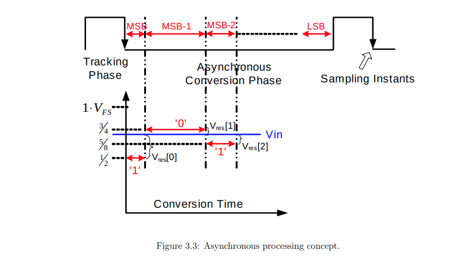

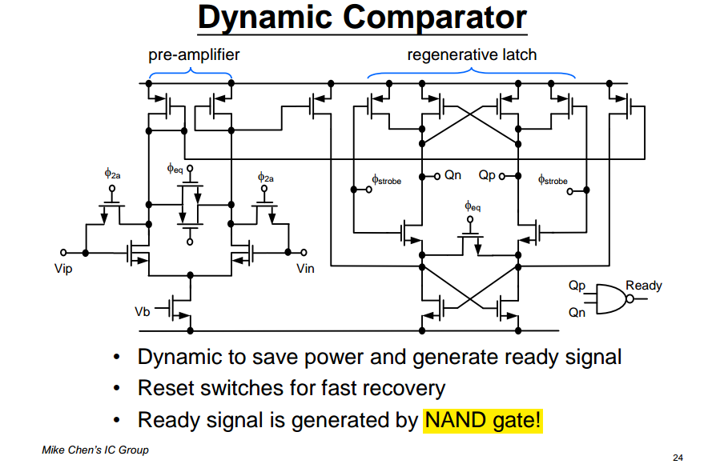

The maximum resolving time reduction between synchronous and asynchronous case is ***two fold***


### comparator metastable state

> when the *input is sufficiently small*. The time needed for the comparator outputs to fully resolve may take *arbitrarily long*
>
> In this case, the *ready signal generator should still set the flag* and the decision result is simply taken from the previous value stored in the SR latch

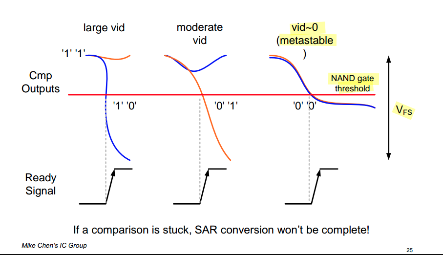

both outputs ($Q_p$ and $Q_n$) will drop *together*, NAND is **inverter** actually

The transition point of this NAND gate is **skewed** to eliminate *metastability issues arising when the input differential voltage level is small (comparator)*


## Redundancy

> Kuttner, Franz. "A 1.2V 10b 20MSample/s non-binary successive approximation ADC in 0.13/spl mu/m CMOS." *2002 IEEE International Solid-State Circuits Conference. Digest of Technical Papers (Cat. No.02CH37315)* 1 (2002): 176-177 vol.1. [[https://sci-hub.jp/10.1109/ISSCC.2002.992993](https://sci-hub.jp/10.1109/ISSCC.2002.992993)]
>
> M. Hesener, T. Eicher, A. Hanneberg, D. Herbison, F. Kuttner and H. Wenske, "A 14b 40MS/s Redundant SAR ADC with 480MHz Clock in 0.13pm CMOS," *2007 IEEE International Solid-State Circuits Conference. Digest of Technical Papers*, San Francisco, CA, USA, 2007, pp. 248-600 [[https://sci-hub.ru/10.1109/ISSCC.2007.373387](https://sci-hub.ru/10.1109/ISSCC.2007.373387)]
>
> C. -C. Liu *et al*., "A 10b 100MS/s 1.13mW SAR ADC with binary-scaled error compensation," *2010 IEEE International Solid-State Circuits Conference - (ISSCC)*, San Francisco, CA, USA, 2010, pp. 386-387 [[https://sci-hub.ru/10.1109/ISSCC.2010.5433970](https://sci-hub.ru/10.1109/ISSCC.2010.5433970)]
>
> —, “Design of High-Speed Energy-Efficient Successive-Approximation Analog-to-Digital Converters,” Ph.D. dissertation, Dept. Elect. Eng., National Cheng Kung University, Tainan, Taiwan, R.O.C., 2010.
>
> —, "A 10 bit 320 MS/s Low-Cost SAR ADC for IEEE 802.11ac Applications in 20 nm CMOS," in *IEEE Journal of Solid-State Circuits*, vol. 50, no. 11, pp. 2645-2654, Nov. 2015 [[https://sci-hub.ru/10.1109/JSSC.2015.2466475](https://sci-hub.ru/10.1109/JSSC.2015.2466475)]
>
> W. Liu, P. Huang and Y. Chiu, "A 12-bit, 45-MS/s, 3-mW Redundant Successive-Approximation-Register Analog-to-Digital Converter With Digital Calibration," in IEEE Journal of Solid-State Circuits, vol. 46, no. 11, pp. 2661-2672, Nov. 2011 [[https://sci-hub.ru/10.1109/JSSC.2011.2163556](https://sci-hub.ru/10.1109/JSSC.2011.2163556)]
>
> Albert H. Chang, Hae-Seung Lee, and Duane S. Boning. 2011. Redundancy in SAR ADCs. In Proceedings of the 21st edition of the great lakes symposium on Great lakes symposium on VLSI (GLSVLSI '11). Association for Computing Machinery, New York, NY, USA, 283–288. [[https://dl.acm.org/doi/10.1145/1973009.1973066](https://dl.acm.org/doi/10.1145/1973009.1973066)]
>
> —, “Low-power high-performance SAR ADC with redundancy and digital background calibration,” Ph.D. dissertation, Dept. Elect. Eng. Comput. Sci., Massachusetts Institute of Technology, Cambridge, MA, USA, 2013. [Online]. [[https://dspace.mit.edu/bitstream/handle/1721.1/82177/861702792-MIT.pdf](https://dspace.mit.edu/bitstream/handle/1721.1/82177/861702792-MIT.pdf)]
>
> ---
>
> B. Murmann, “On the use of redundancy in successive approximation A/D converters,” International Conference on Sampling Theory and Applications (SampTA), Bremen, Germany, July 2013.  [[https://www.eurasip.org/Proceedings/Ext/SampTA2013/papers/p556-murmann.pdf](https://www.eurasip.org/Proceedings/Ext/SampTA2013/papers/p556-murmann.pdf)]
>
> Krämer, M. et al. (2015) *High-resolution SAR A/D converters with loop-embedded input buffer*. dissertation. Available at: [[http://purl.stanford.edu/fc450zc8031](http://purl.stanford.edu/fc450zc8031)].
>
> sarthak, "Visualising redundancy in a 1.5 bit pipeline ADC“ [[https://electronics.stackexchange.com/a/523489/233816](https://electronics.stackexchange.com/a/523489/233816)]

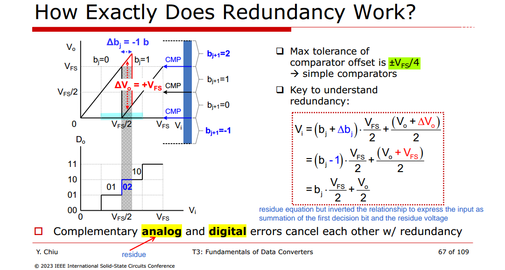

Max tolerance of comparator offset is $\pm V_{FS}/4$

1. $b_j$ error is $\pm 1$
2. $b_{j+1}$ error is  $\pm 2$ , wherein $b_{j+1}$: $0\to 2$ or $1\to -1$  

i.e. complementary analog and digital errors cancel each other, $V_o +\Delta V_{o}$ should be in **over-/under-range comparators** ($-V_{FS}/2 \sim 3V_{FS}/2$)


$$\begin{align}
V_{in,j} &= (b_j + \Delta b_j)\cdot \frac{V_{FS}}{2} + \frac{V_{out,j}+\Delta V_{out,j}}{2} \\
V_{in,{j+1}} &= (b_{j+1} + \Delta b_{j+1})\cdot \frac{V_{FS}}{2} + \frac{V_{out,j+1}+\Delta V_{out,j+1}}{2}
\end{align}$$

with $V_{in,j+1} = V_{out,j}+\Delta V_{out,j}$

$$\begin{align}
V_{in,j} &= (b_j + \Delta b_j)\cdot \frac{V_{FS}}{2} + \frac{1}{2} \left\{ (b_{j+1} + \Delta b_{j+1})\cdot \frac{V_{FS}}{2} + \frac{V_{out,j+1}+\Delta V_{out,j+1}}{2} \right\} \\
&= (b_j + \Delta b_j)\cdot \frac{V_{FS}}{2} + \frac{1}{2}(b_{j+1} + \Delta b_{j+1})\cdot \frac{V_{FS}}{2}+ \frac{1}{2}\frac{V_{in,j+2}}{2} \\
&=\tilde{b_j} \cdot \frac{V_{FS}}{2}+ \tilde{b_{j+1}}\cdot \frac{V_{FS}}{4}+ \frac{1}{4}V_{in,j+2}
\end{align}$$

where $b_j$ is *1-bit residue without redundancy* and $\tilde{b_j}$ is *redundant bits*

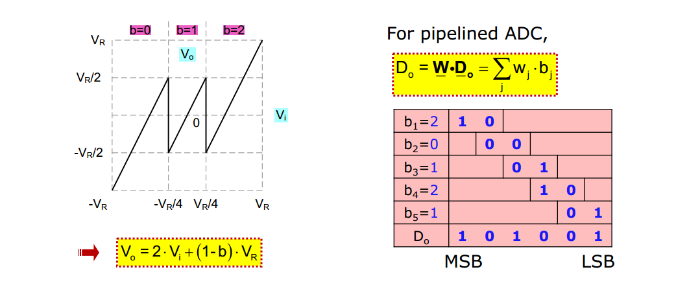


---

<span style="color:white; background-color:black">**Uniform Sub-Radix-2 SAR ADC**</span>

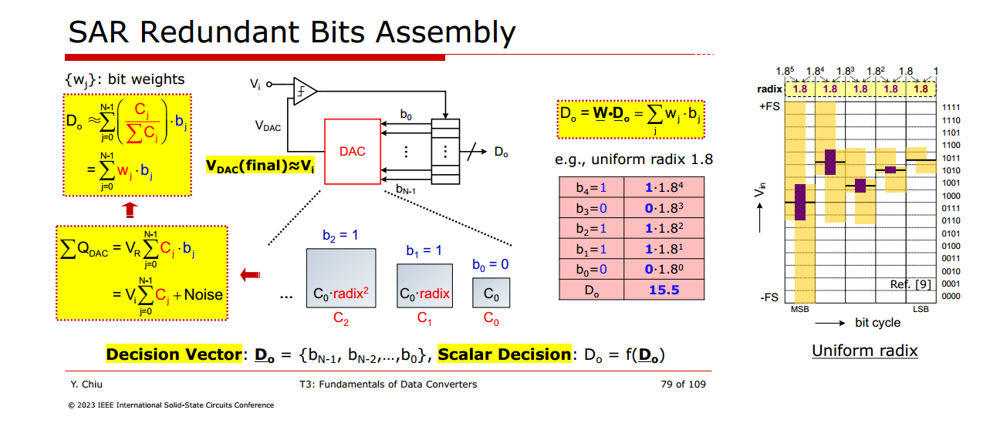

> Minimal analog complexity, *no additional decoding effort*


### Search Algorithm

**final digital output** of $N$-bit $M$-step ADC
$$
\boxed{\color{blue}D_{out} = s(M) + \sum_{i=1}^{M-1}(2\cdot b[i] - 1)\times s(i) + (b[0] -1)\cdot s(1)}
$$

| i        | M      | M-1          | M-2          | ...       | 2          | 1          | 0      |
| -------- | ------ | ------------ | ------------ | --------- | ---------- | ---------- | ------ |
| **b[i]** |        | ***b[M-1]*** | ***b[M-2]*** | ***...*** | ***b[2]*** | ***b[1]*** | *b[0]* |
| **s[i]** | *s(M)* | ***s(M-1)*** | ***s(M-2)*** | ***...*** | ***s(2)*** | ***s(1)*** |        |

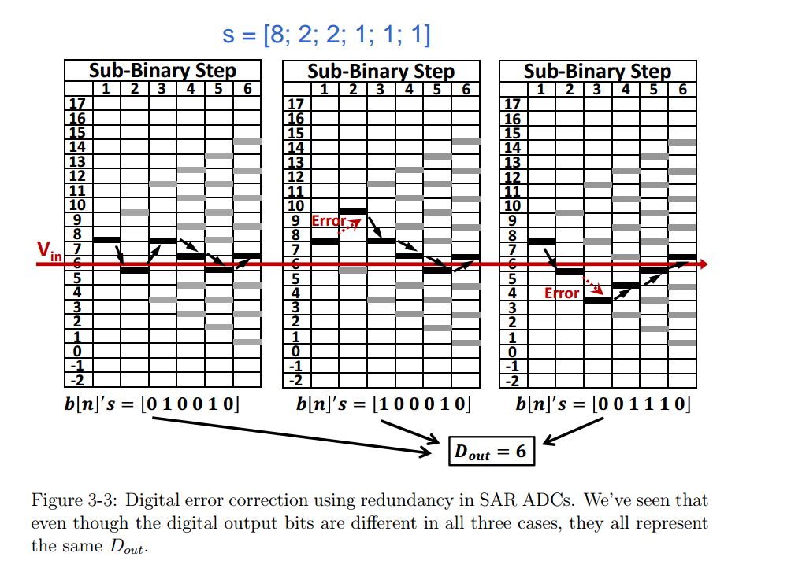


<span style="color:white; background-color:black">**$N$-bit binary weighted algorithm**</span>

with $N=M$ and $s(i)=2^{i-1}$, where $i\in \{N, N-1,...,2,1  \}$

$$\begin{align}
D_{out} &= s(M) + \sum_{i=1}^{M-1}(2\cdot b[i] - 1)\times s(i) + (b[0] -1) \\
&= 2^{N-1} + \sum_{i=1}^{N-1}2^i\cdot b[i] - \sum_{i=0}^{N-2}2^{i} + (b[0] -1) \\
&= \boxed{\color{blue}\sum_{i=0}^{N-1} b[i] \cdot 2^i}
\end{align}$$


<span style="color:white; background-color:black">**alternative method for d2a & CDAC equivalent weight**</span>

| i        | M-1       | M-2       | ...       | 2       | 1       | 0      |
| -------- | --------- | --------- | --------- | ------- | ------- | ------ |
| **b[i]** | *b[M-1]*  | *b[M-2]*  | ***...*** | *b[2]*  | *b[1]*  | *b[0]* |
| **w[i]** |           | *w[M-2]*  | ***...*** | *w[2]*  | *w[1]*  | *w[0]* |
| **W[i]** | *2w[M-2]* | *2w[M-3]* | ***...*** | 2*w[1]* | *2w[0]* | *w[0]* |

$$\begin{align}
D_{out} &= \sum_{i=1}^{M-1}(2b_i -1)w_{i-1} + (b_0-1)w_0 \\
&= \sum_{i=1}^{M-1}b_i\cdot 2w_{i-1} + b_0\cdot w_0 -\sum_{i=1}^{M-1}w_{i-1} -w_0 \\
&= \left[\sum_{i=1}^{M-1}b_i\cdot 2w_{i-1} + b_0\cdot w_0\right] - \frac{1}{2}\left[\sum_{i=1}^{M-1}2w_{i-1} +w_0 + w_0\right] \\
&= \boxed{\color{blue}\sum_{i=0}^{M-1}b_i\cdot W_i  - \frac{1}{2}\left[\sum_{i=0}^{M-1}W_i + W_0\right]}
\end{align}$$

where $W_i = 2w_{i-1}$ for $i\in [M-1,1]$ and $W_0 = w_0$


### Error Tolerance Window

$$
\varepsilon_t(n) = \sum_{i=1}^{n-2} s(i) - s(n-1)
$$

where $n\in [1, N]$, and $N$-bit SAR

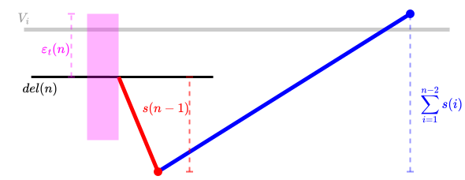

For the $n$th output bit, once a decision is made, the next decision level will either move up or down by the step size of $s(n − 1)$

If this decision is erroneous, then the sum of the follow-on step sizes, $s(n − 2)$, $s(n − 3)$, ..., $s(1)$, must be large enough and exceed the value of the current step size to counteract this mistake

The exceeded amount is the tolerance window for that decision level

### sub-binary search

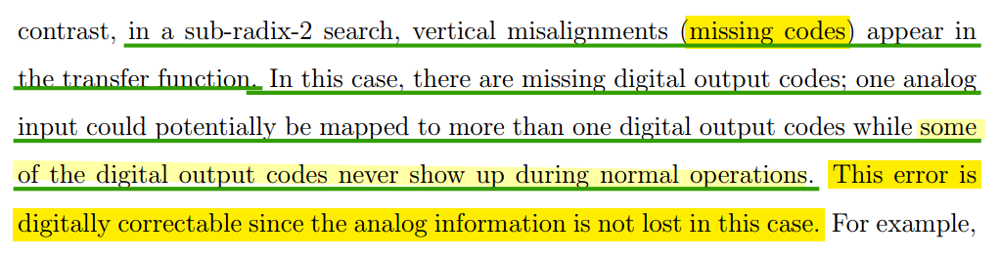

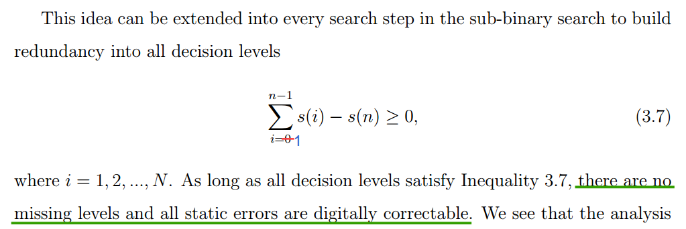

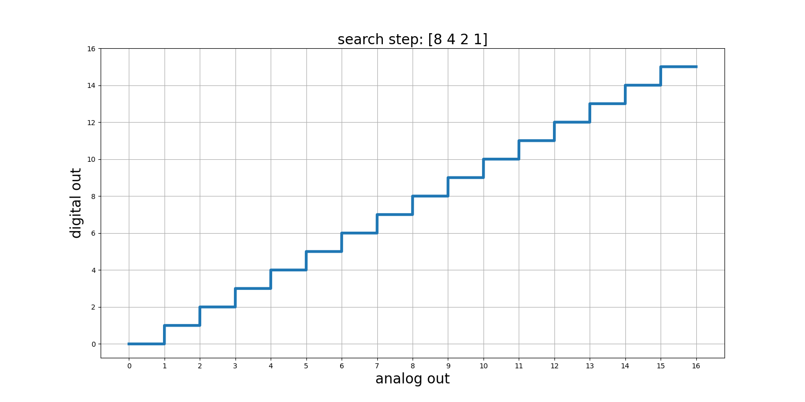

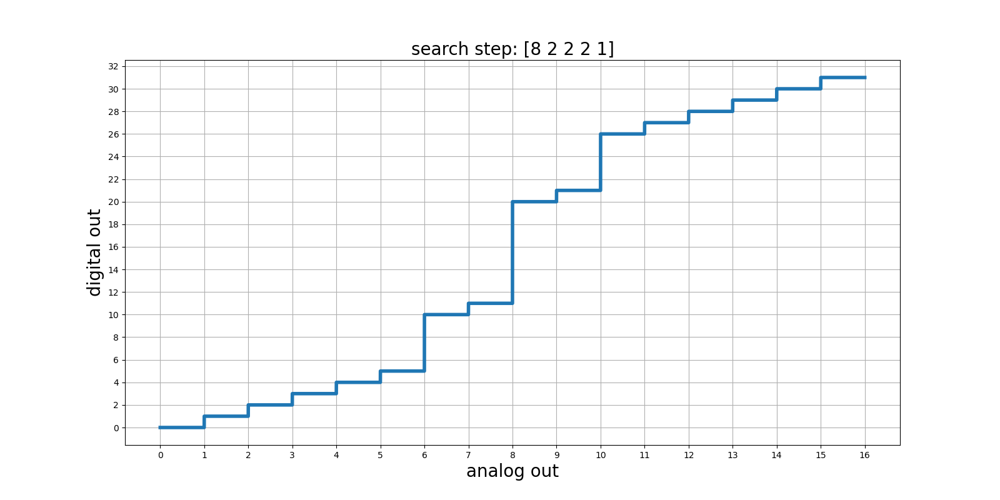

```python
import numpy as np
import matplotlib.pyplot as plt


def sar(xi, ss):
    M = ss.size
    th = ss[0]
    oob = []
    for i in range(M):
        ocur = 1 if xi >= th else 0
        oob.append(ocur)
        if i + 1 < M:
            th += (2 * ocur - 1) * ss[i + 1]
        else:
            break

    binstr = ''.join([str(s) for s in oob])
    decval = int(binstr, 2)
    return binstr, decval


def sar_plot(ss, Npts=10000):
    ss = np.asarray(ss)
    ssum = np.sum(ss)
    xilist = np.linspace(0, ssum + 1, Npts)
    outlist = []
    for i in range(Npts):
        _, decval = sar(xilist[i], ss)
        outlist.append(decval)
    outmax = np.max(outlist)
    plt.figure(figsize=(16,8))
    plt.plot(xilist, outlist, '-', linewidth=4)
    plt.xticks(range(0, ssum + 2))
    plt.yticks(range(0, outmax + 2, 2))
    plt.title('search step: {}'.format(ss), fontsize=20)
    plt.xlabel('analog out', fontsize=20); plt.ylabel('digital out', fontsize=20)

    plt.grid(True)

ss = [8, 4, 2, 1]
sar_plot(ss)

ss = [8, 2, 2, 2, 1]
sar_plot(ss)

plt.show()
```

### ENOB vs. fixed radix

When the ADC is designed with a fixed radix, $\alpha$ and the required number of conversion steps, $M$

the sum of all the step sizes $s_{tot}$
$$
s_{tot} = \sum_{k=0}^{M-1} s_0 \alpha^k = s_0\frac{\alpha^M-1}{\alpha-1}
$$

where $s(i)$ is step size and $i \in [0, 1, 2, M-1]$

The effective number of bits, $N$, can be calculated
$$
N \leq \log 2\left(\frac{s_{tot} + s_0}{s_0}\right) = \frac{\alpha^M+\alpha-2}{\alpha-1}
$$


### Speed Benefit

*TODO* &#128197;


### MSB with noise simualtion

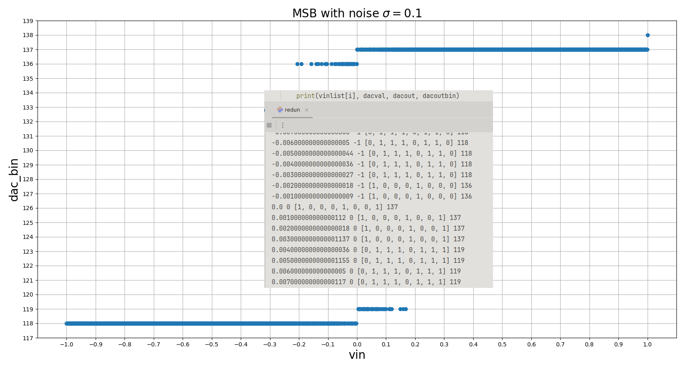

```python
import numpy as np
import matplotlib.pyplot as plt

def sar(vin, weight, sigmaMSB=0):
    nbit = len(weight)
    dacval = 0
    dacout = []
    for i in range(nbit+1):
        if i ==0:
            if vin + np.random.normal(0,sigmaMSB) > dacval:
                dacout.append(1)
                dacval += weight[i]
            else:
                dacout.append(0)
                dacval -= weight[i]
        elif vin >= dacval:
            dacout.append(1)
            if i == nbit: break
            dacval += weight[i]
        else:
            dacout.append(0)
            if i == nbit: break
            dacval -= weight[i]
    dacval += (dacout[-1] - 1)*weight[-1]
    return dacout, dacval

W = [36, 20, 11, 6, 4, 2, 1]
step = 0.001
N = int(1*2/step) + 1
vinlist = np.linspace(-1,1, N)
wbin = [2**i for i in range(len(W)+1)]
wbin = wbin[::-1]

dacout_list = []
dacval_list = []
dacoutbin_list = []
for i in range(N):
    dacout, dacval = sar(vinlist[i], W, sigmaMSB=0.1)
    dacoutbin = np.sum(np.array(dacout)*np.array(wbin))
    print(vinlist[i], dacval, dacout, dacoutbin)
    dacout_list.append(dacout)
    dacval_list.append(dacval)
    dacoutbin_list.append(dacoutbin)


values, counts = np.unique(dacoutbin_list, return_counts=True)

print(values,'\n', counts)
plt.figure(figsize=(20,10))
# plt.plot(bin_edges[:-1], hist, 'o')
# plt.show()

# plt.plot(values[-200:], counts[-200:], 'o-', color='red')
plt.plot(vinlist, dacoutbin_list, 'o')
plt.xlabel('vin', fontsize=20)
plt.ylabel('dac_bin', fontsize=20)
plt.xticks(np.arange(-1,1.1,0.1))
plt.yticks(np.arange(117,140,1))
plt.title('MSB with noise $\sigma=0.1$', fontsize=20)
plt.grid(True)
plt.show()
```


## reference

Andrea Baschirotto, ISSCC2009 T6: SAR ADCs

Pieter Harpe, ISSCC 2016 Tutorial: "Basics of SAR ADCs Circuits & Architectures"

Yun Chiu, ISSCC2023 T3: "Fundamentals of Data Converters" [[https://personal.utdallas.edu/~yxc101000/courses/7327/handout/isscc2023_tutorial.pdf](https://personal.utdallas.edu/~yxc101000/courses/7327/handout/isscc2023_tutorial.pdf)]

Youngcheol Chae, Yonsei University, ISSCC 2023 *F5.2 Design Techniques for Energy Efficient Analog-to-Digital Converters*

Zhang, Milin, Zhihua Wang, Jan van der Spiegel and Franco Maloberti. "Advanced Tutorial on Analog Circuit Design." (2023)

Harpe, P. J. A. (2022). Low-Power SAR ADCs: Basic Techniques and Trends. IEEE Open Journal of the SolidState Circuits Society, 2, 73-81. Article 9908164 [[https://ieeexplore.ieee.org/stamp/stamp.jsp?tp=&arnumber=9908164](https://ieeexplore.ieee.org/stamp/stamp.jsp?tp=&arnumber=9908164)]

---

L. Jie et al., "An Overview of Noise-Shaping SAR ADC: From Fundamentals to the Frontier," in IEEE Open Journal of the Solid-State Circuits Society, vol. 1, pp. 149-161, 2021 [[pdf](https://ieeexplore.ieee.org/stamp/stamp.jsp?tp=&arnumber=9569768)]

---

Andrew Yu. Understanding Metastability in SAR ADCs: Part II: Asynchronous [[https://github.com/phonon/sar-adc-metastability](https://github.com/phonon/sar-adc-metastability)] [[pdf](https://sci-hub.jp/10.1109/MSSC.2019.2922890)]

