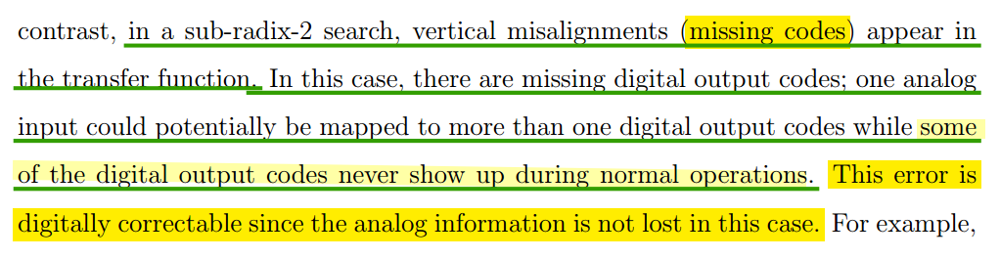

## Reference Ripple

> C-H Chan (U. of Macau) "Extreme SAR ADCs - Exploring New Frontiers" Online Course (2024) : Reference Buffer in SAR ADC [[https://youtu.be/vj98B7AaC9E?si=hMt0PM07CdkHN5Qn](https://youtu.be/vj98B7AaC9E?si=hMt0PM07CdkHN5Qn)]
>
> C. Li, C. -H. Chan, Y. Zhu and R. P. Martins, "Analysis of Reference Error in High-Speed SAR ADCs With Capacitive DAC," in IEEE Transactions on Circuits and Systems I: Regular Papers, vol. 66, no. 1, pp. 82-93, Jan. 2019 [[https://ime.um.edu.mo/wp-content/uploads/magazines/961546494e705f6fd16b9f785a121030.pdf](https://ime.um.edu.mo/wp-content/uploads/magazines/961546494e705f6fd16b9f785a121030.pdf)]
>
> J. Zhong, Y. Zhu, S. -W. Sin, S. -P. U and R. P. Martins, "Thermal and Reference Noise Analysis of Time-Interleaving SAR and Partial-Interleaving Pipelined-SAR ADCs," in IEEE Transactions on Circuits and Systems I: Regular Papers, vol. 62, no. 9, pp. 2196-2206, Sept. 2015 [[https://sci-hub.st/10.1109/TCSI.2015.2452331](https://sci-hub.st/10.1109/TCSI.2015.2452331)]
>
> C. -H. Chan et al., "60-dB SNDR 100-MS/s SAR ADCs With Threshold Reconfigurable Reference Error Calibration," in IEEE Journal of Solid-State Circuits, vol. 52, no. 10, pp. 2576-2588, Oct. 2017 [[https://ime.um.edu.mo/wp-content/uploads/magazines/407e580ac0218605bcf9b9bbd0ea1109.pdf](https://ime.um.edu.mo/wp-content/uploads/magazines/407e580ac0218605bcf9b9bbd0ea1109.pdf)]


*TODO* &#128197;


### sample-by-sample

> 3rd harmonic


### bit-by-bit

The amplitude of the reference ripple is code-dependent as it is correlated with switching energy in each bit cycling


## quantization error & quantization noise


---

Notice $e_q\in (0, \Delta)$ and its average is $\Delta/2$. To calculate SNDR, *DC component shall be excluded*

Don't confuse **resolution** $\Delta$ with **Bounded Quantization Noise** $-\Delta/2 \sim  \Delta/2$


## Redundancy

### decision level

final digital output for an $N$-bit $M$-step ADC can be calculated
$$
D_{out} = s(M) + \sum_{i=1}^{M-1}(2\cdot b[i] - 1)\times s(i) + (b[0] -1)\cdot s(1)
$$

| i    | M    | M-1          | M-2          | ...       | 2          | 1          | 0    |
| ---- | ---- | ------------ | ------------ | --------- | ---------- | ---------- | ---- |
| b[i] |      | ***b[M-1]*** | ***b[M-2]*** | ***...*** | ***b[2]*** | ***b[1]*** | b[0] |
| s[i] | s(M) | ***s(M-1)*** | ***s(M-2)*** | ***...*** | ***s(2)*** | ***s(1)*** |      |


> ***track the decision level***


For $N$-bit *binary weighted algorithm*,$N=M$ and $s(i)=2^{i-1}$, where $i\in \{N, N-1,...,2,1  \}$

$$\begin{align}
D_{out} &= s(M) + \sum_{i=1}^{M-1}(2\cdot b[i] - 1)\times s(i) + (b[0] -1) \\
&= 2^{N-1} + \sum_{i=1}^{N-1}2^i\cdot b[i] - \sum_{i=0}^{N-2}2^{i} + (b[0] -1) \\
&= \sum_{i=0}^{N-1} b[i] \cdot 2^i
\end{align}$$


### Error Tolerance Window

$$
\varepsilon_t(n) = \sum_{i=1}^{n-2} s(i) - s(n-1)
$$

where $n\in [1, N]$, and $N$-bit SAR


For the $n$th output bit, once a decision is made, the next decision level will either move up or down by the step size of $s(n − 1)$

If this decision is erroneous, then the sum of the follow-on step sizes, $s(n − 2)$, $s(n − 3)$, ..., $s(1)$, must be large enough and exceed the value of the current step size to counteract this mistake

The exceeded amount is the tolerance window for that decision level

### sub-binary search




```python
import numpy as np
import matplotlib.pyplot as plt


def sar(xi, ss):
    M = ss.size
    th = ss[0]
    oob = []
    for i in range(M):
        ocur = 1 if xi >= th else 0
        oob.append(ocur)
        if i + 1 < M:
            th += (2 * ocur - 1) * ss[i + 1]
        else:
            break

    binstr = ''.join([str(s) for s in oob])
    decval = int(binstr, 2)
    return binstr, decval


def sar_plot(ss, Npts=10000):
    ss = np.asarray(ss)
    ssum = np.sum(ss)
    xilist = np.linspace(0, ssum + 1, Npts)
    outlist = []
    for i in range(Npts):
        _, decval = sar(xilist[i], ss)
        outlist.append(decval)
    outmax = np.max(outlist)
    plt.figure(figsize=(16,8))
    plt.plot(xilist, outlist, '-', linewidth=4)
    plt.xticks(range(0, ssum + 2))
    plt.yticks(range(0, outmax + 2, 2))
    plt.title('search step: {}'.format(ss), fontsize=20)
    plt.xlabel('analog out', fontsize=20); plt.ylabel('digital out', fontsize=20)

    plt.grid(True)

ss = [8, 4, 2, 1]
sar_plot(ss)

ss = [8, 2, 2, 2, 1]
sar_plot(ss)

plt.show()
```

### ENOB vs. fixed radix

When the ADC is designed with a fixed radix, $\alpha$ and the required number of conversion steps, $M$

the sum of all the step sizes $s_{tot}$
$$
s_{tot} = \sum_{k=0}^{M-1} s_0 \alpha^k = s_0\frac{\alpha^M-1}{\alpha-1}
$$

where $s(i)$ is step size and $i \in [0, 1, 2, M-1]$

The effective number of bits, $N$, can be calculated
$$
N \leq \log 2\left(\frac{s_{tot} + s_0}{s_0}\right) = \frac{\alpha^M+\alpha-2}{\alpha-1}
$$


### Speed Benefit

*TODO* &#128197;


## CDAC

The *charge redistribution capacitor network* is used to sample the input signal and serves as a
digital-to-analog converter (DAC) for creating and subtracting reference voltages

sampling charge
$$
Q = V_{in} C_{tot}
$$
conversion charge
$$
Q = -C_{tot}V_c + V_{ref}C_\Delta
$$
That is
$$
V_c = \frac{C_\Delta}{C_{tot}}V_{ref} - V_{in}
$$

---

CDAC is actually working as a **capacitive divider** during *conversion phase*, the charge of internal node retain (*charge conservation law*)

assuming $\Delta V_i$ is applied to series capacitor $C_1$ and $C_2$


$$
(\Delta V_i - \Delta V_x) C_1 = \Delta V_x \cdot C_2
$$
Then
$$
\Delta V_x = \frac{C_1}{C_1+C_2}\Delta V_i
$$

> $V_x= V_{x,0} + \Delta V_x$


### CDAC settling accuracy


$$\begin{align}
V_x(s) &= \frac{C_1+C_2}{RC_1C_2}\cdot \frac{1}{s+\frac{C_1+C_2}{RC_1C_2}}\cdot V_i(s) \\
&= \frac{1}{\tau}\cdot \frac{1}{s+\frac{1}{\tau}}\cdot \frac{1}{s}\\
&=  \frac{1}{\tau}\cdot \tau(\frac{1}{s} - \frac{1}{s+\frac{1}{\tau}})=\frac{1}{s} - \frac{1}{s+\frac{1}{\tau}}
\end{align}$$

inverse Laplace Transform is $V_x(t) = 1 - e^{-t/\tau}$

$$\begin{align}
V_y(s) &= V_x\frac{C_1}{C_1+C_2} \\
&= \frac{C_1}{C_1+C_2} \left(\frac{1}{s} - \frac{1}{s+\frac{1}{\tau}}\right)\\
\end{align}$$

inverse Laplace Transform is $V_y(t) = \frac{C_1}{C_1+C_2}\left(1 - e^{-t/\tau}\right)$

$V_x(t)$ and $V_y(t)$ prove that the settling time is *same*


$\tau = R\frac{C_1C_2}{C_1+C_2}$, which means usually worst for MSB capacitor (largest)

> both $\tau$ and $\Delta V$ are the maximum


A popular way to improve the settling behavior, again, is to employ unit-element DACs that statistically reduce the switching activities, which, unfortunately, exhibits unnecessary complications to the power, area and speed tradeoffs of the design


### CDAC Energy Consumption


$$
E_{Vref} = \int P(t)dt = \int V_{ref} I(t) dt = V_{ref}\int I(t)dt = V_{ref}\cdot \Delta Q
$$


Given $V_{c,0}=\frac{1}{2}V_{ref}-V_{in}$ and $V_{c,1}=\frac{3}{4}V_{ref}-V_{in}$
$$\begin{align}
Q_{b0,0} &= \left(V_{ref} - V_{c,0} \right)\cdot 2C = \left(\frac{1}{2}V_{ref}+V_{in} \right)\cdot 2C \\
Q_{b1,0} &= (0 - V_{c,0})\cdot C = \left(-\frac{1}{2}V_{ref}+V_{in} \right)\cdot C \\
Q_{b0,1} &= \left(V_{ref} - V_{c,1} \right)\cdot 2C = \left(\frac{1}{4}V_{ref}+V_{in} \right)\cdot 2C \\
Q_{b1,1} &= \left(V_{ref} - V_{c,1} \right)\cdot C = \left(\frac{1}{4}V_{ref}+V_{in} \right)\cdot C
\end{align}$$

Therefore
$$
E_{Vref} = V_{ref}\cdot (Q_{b0,1}+Q_{b1,1} - Q_{b0,0}-Q_{b1,0}) = \frac{1}{4}C V_{ref}^2
$$


---

CDAC total energy change
$$\begin{align}
\Delta E_{tot} &= \frac{1}{2}\cdot 2C \cdot (U_{2c,1}^2  - U_{2c,0}^2) + \frac{1}{2}\cdot C \cdot (U_{c,1}^2  - U_{c,0}^2) + \frac{1}{2}\cdot C \cdot (U_{c1,1}^2  - U_{c1,0}^2) \\
&= \left(-\frac{3}{16}V_{ref}^2 - \frac{1}{2}V_{ref}V_{in} - \frac{3}{32}V_{ref}^2+\frac{3}{4}V_{ref}V_{vin} + \frac{5}{32}V_{ref}^2-\frac{1}{4}V_{ref}V_{in}\right)C \\
&= -\frac{1}{8}CV_{ref}^2
\end{align}$$


***alternative method***


$$
\Delta E_{tot} = \frac{1}{2}\cdot\frac{3}{4}C\cdot V_{ref}^2  -  \frac{1}{2}\cdot C\cdot V_{ref}^2 = -\frac{1}{8}CV_{ref}^2
$$


> The total energy decreases by $-\frac{1}{8}CV_{ref}^2$, though $V_{ref}$ provides $\frac{1}{4}C V_{ref}^2$


---

The charge redistribution change the CDAC energy


$$
E_{c,0} = \frac{1}{2}CV^2
$$
After charge redistribution
$$
E_{c,1} = \frac{1}{2}\cdot 2C\cdot \left(\frac{1}{2}V\right)^2 = \frac{1}{4}CV^2
$$

> That make sense, **charge redistribution consume energy**


## Comparator

### Comparator input cap effect


$$
-V_{in}\cdot 2^N C = V_c (2^N C + C_p)
$$
Then $V_c = -\frac{2^N C}{2^N C + C_p}V_{in}$, i.e. this capacitance reduce the voltage amplitude by the factor

During conversion
$$\begin{align}
V_c &= -\frac{2^N C}{2^N C + C_p}V_{in} +V_{ref}\sum_{n=0}^{N-1} \frac{b_n\cdot2^n C}{2^N C + C_p} \\
&= \frac{2^N C}{2^N C + C_p}\left(-V_{in} + V_{ref}\sum_{n=0}^{N-1}\frac{b_n }{2^{N-n}}  \right)
\end{align}$$

That is, it does not change the sign


### Comparator offset effect


## Synchronous SAR ADC

It also divides a full conversion into several comparison stages in a way similar to the *pipeline ADC*, except the algorithm is executed **sequentially** rather than in *parallel* as in the pipeline case.

However, the sequential operation of the SA algorithm has traditionally been a *limitation in achieving high-speed operation*


- a clock running at least $(N + 1) \cdot F_s$ is required for an $N$-bit converter with conversion rate of $F_s$
- every clock cycle has to tolerate the worst case comparison time
- every clock cycle requires margin for the clock jitter 

> The power and speed limitations of a synchronous SA design comes largely from the *high-speed internal clock*


### Split Arrary CDAC

> *Split* capacitor, double-array cap
>
> attenuation capacitance $C_a$


$$\begin{align}
\Delta V_{dac} &= \frac{1}{2}b_3+\frac{1}{4}b_2+\frac{1}{4}\left(\frac{1}{2}b_1+\frac{1}{4}b_0 \right) \\
&= \frac{1}{2}b_3+\frac{1}{4}b_2 + \frac{1}{8}b_1+\frac{1}{16}b_0
\end{align}$$


## Asynchronous SAR ADC

The comparator itself trigger the next bit-conversion cycle as soon as the present bit decision has been taken


The maximum resolving time reduction between synchronous and asynchronous case is ***two fold***


### comparator metastable state

> when the *input is sufficiently small*. The time needed for the comparator outputs to fully resolve may take *arbitrarily long*
>
> In this case, the *ready signal generator should still set the flag* and the decision result is simply taken from the previous value stored in the SR latch


both outputs ($Q_p$ and $Q_n$) will drop *together*, NAND is **inverter** actually

The transition point of this NAND gate is **skewed** to eliminate *metastability issues arising when the input differential voltage level is small (comparator)*


## reference

Andrea Baschirotto, "T6: SAR ADCs" ISSCC2009

Pieter Harpe, ISSCC 2016 Tutorial: "Basics of SAR ADCs Circuits & Architectures"

---

Mike Shuo-Wei Chen and R. W. Brodersen, "A 6-bit 600-MS/s 5.3-mW Asynchronous ADC in 0.13-μm CMOS," in *IEEE Journal of Solid-State Circuits*, vol. 41, no. 12, pp. 2669-2680, Dec. 2006 [[pdf](https://engineering.purdue.edu/oxidemems/conferences/isscc2006/files/D31_05.pdf), [slides](https://engineering.purdue.edu/oxidemems/conferences/isscc2006/files/V31_05.pdf)]

—. "Power Efficient System and A/D Converter Design for Ultra-Wideband Radio" [[http://www2.eecs.berkeley.edu/Pubs/TechRpts/2006/EECS-2006-71.pdf](http://www2.eecs.berkeley.edu/Pubs/TechRpts/2006/EECS-2006-71.pdf)]

—. "Asynchronous SAR ADC: Past, Present and Beyond" [[https://viterbi-web.usc.edu/~swchen/index_files/async_sar_tutorial_chen_final.pdf](https://viterbi-web.usc.edu/~swchen/index_files/async_sar_tutorial_chen_final.pdf)]

C. -C. Liu, S. -J. Chang, G. -Y. Huang and Y. -Z. Lin, "A 10-bit 50-MS/s SAR ADC With a Monotonic Capacitor Switching Procedure," in *IEEE Journal of Solid-State Circuits*, vol. 45, no. 4, pp. 731-740, April 2010 [[https://sci-hub.se/10.1109/JSSC.2010.2042254](https://sci-hub.se/10.1109/JSSC.2010.2042254)]

L. Jie et al., "An Overview of Noise-Shaping SAR ADC: From Fundamentals to the Frontier," in IEEE Open Journal of the Solid-State Circuits Society, vol. 1, pp. 149-161, 2021 [[pdf](https://ieeexplore.ieee.org/stamp/stamp.jsp?tp=&arnumber=9569768)]

W. Liu, P. Huang and Y. Chiu, "A 12-bit, 45-MS/s, 3-mW Redundant Successive-Approximation-Register Analog-to-Digital Converter With Digital Calibration," in IEEE Journal of Solid-State Circuits, vol. 46, no. 11, pp. 2661-2672, Nov. 2011 [[https://sci-hub.st/10.1109/JSSC.2011.2163556](https://sci-hub.st/10.1109/JSSC.2011.2163556)]

