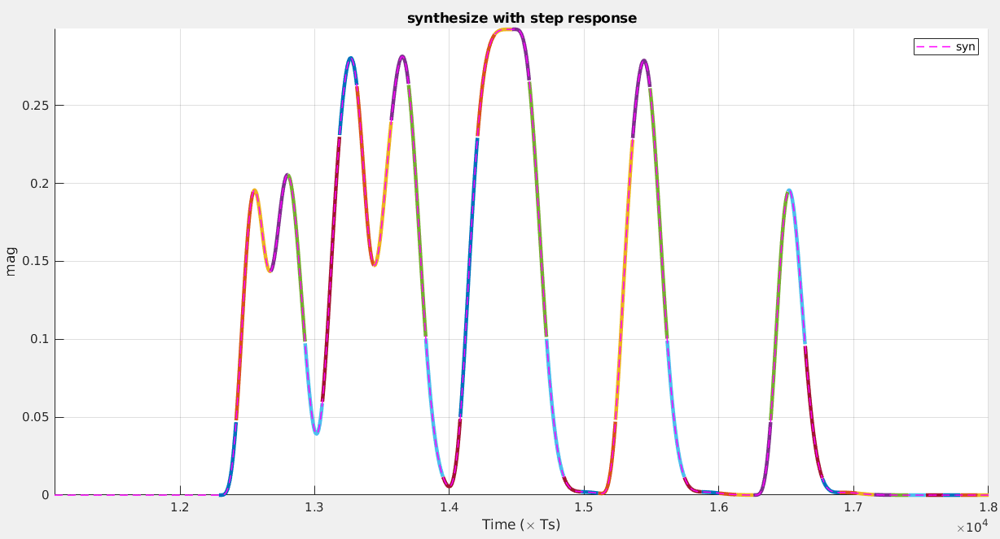

Three fast time-domain system simulation techniques: 

- **single-bit response method**
- **double-edge response method**
- **multiple-edge response method**


## Single-Bit Response (SBR) Method

To avoid spurious glitches between consecutive ones, rising and falling edge responses shall be **symmetric**. This is the limitation of SBR method.

 Let $p(t)$ be the SBR of the channel, $t_s$ be the data sampling phase, $T$ be the bit time, $N_c$ is the number of UI in stored pulse response and $b_m$ be the $m$th transmitted symbol. The voltage seen by the receiver's data sampler at the $m$th data sample is determined by
$$
y_m = \sum_{k=m-N_c+1}^{m}b_kp(t_s+(m-k)T)
$$
where $b_k \in [0, 1]$ and $p(t) \ge 0$

We always prepend $Nc-1$ 0s in random bit stream for consistency.


For computation convenient, the pulse need to be positive. For differential signal and amplitude $V_{peak}$,  the peak to peak is $-V_{peak}$ to $+V_{peak}$. After pulse added by $V_{peak}$, peak to peak is $0$ to $+2V_{peak}$. 


```matlab
hold on;

yy_sum = zeros(OSR*Ns, Ns);
for idxBit = 1:Ns
    bs_split = zeros(1, Ns+Nc-1);
    bs_split(idxBit) = bs(idxBit);
    yy = zeros(OSR, Ns);
    for ii = Nc:Nc+Ns-1
        bb = bs_split(ii:-1:ii-Nc+1);
        yy(:,ii-Nc+1) = sum(bb.*yrps, 2);
    end
    yy_cont2 = reshape(yy, [], 1);
    h = plot(yy_cont2);
    h.Annotation.LegendInformation.IconDisplayStyle = 'off';
    yy_sum(:, idxBit) = yy_cont2;
end
yy_sum = sum(yy_sum, 2);    % merge
plot(yy_sum, 'k--');
plot(yy_cont, 'm-.');
grid on;
legend('sum', 'syn');
title('merge all single bit');
ylabel('mag');
xlabel('Time (\times Ts)');
```

> The pulse response contain rising and falling edge. The **1 bit ** first rise from -1 to 1,  then fall to -1; The **0 bit** just do nothing for synthesized waveform with the help of falling edge of **1 bit**. 
>
> The DC shift help deal with continuous **0 bits**.


## Double-Edge Response (DER) Method

To handle the more general cases, with **asymmetric rising and falling edges**, the system response can be constructed in terms of **edge transitions instead of bit responses**. 

The DER method decomposes the input data pattern, in terms of **rising and falling edge transitions**. The system response can be calculated by *superimposing the shifted versions of the rising and falling edge responses* :
$$
y_m = \sum_{k=m-N_c+1}^{m}(b_k-b_{k-1})s_k(t_s+(m-k)T) + y_{int}
$$
where

$$\begin{align}
s_i(t) &= r(t) -V_{low} \quad \text{if} \: (b_i\gt b_{i-1}) \\
&= V_{high}-f(t) \quad \text{otherwise}
\end{align}$$

$r(t)$ and $f(t)$ are the rising and falling edge responses,respectively.  $V_{high}$ and $V_{low}$ are the steady state DC levels, in response to a constant stream of ones and zeros, respectively. $y_{int}$ is the initial DC state (either $V_{high}$ or $V_{low}$ ).

We always prepend $Nc$ 0s in random bit stream for consistency.




```matlab
figure(1)
subplot(3, 1, 1)
plot(yrc); 
hold on;
plot(yfc); 
hold off;
legend('rising', 'falling')
grid on;
ylabel('mag');
xlabel('Time (\times Ts)');
title('step response');

subplot(3, 1, 2)
stem(bs, 'k'); grid on;
hold on;
stem((idxPreRspStart:idxPreRspEnd), bs(idxPreRspStart:idxPreRspEnd), "filled", 'r');
stem(idxPreRspStart, bs(idxPreRspStart), 'go');
stem(idxCurData, bs(idxCurData), "filled", 'm');
stem((idxPreRspStart:idxPreRspEnd)+0.5, 0.1.*bd(idxPreRspStart:idxPreRspEnd), 'bd-.');
hold off;
legend('', 'Nc bits', 'y_{int}', 'Current bit', 'Edge Transitions');
ylabel('mag');
xlabel('Time (\times UI)');
title('input stream');

subplot(3, 1, 3)
yy_cont = reshape(yy, [], 1);   % continuous version
plot(yy_cont); grid on;
title('continuous yout')
ylabel('mag');
xlabel('Time (\times Ts)');

figure(2)
hold on;
for idx = idxPreRspStart+1-Nc:idxCurData+32-Nc
    ys = yy(:, idx);
    tt = ((idx-1)*OSR+1:idx*OSR);
    h = plot(tt(:), ys(:), 'LineWidth',3);
    h.Annotation.LegendInformation.IconDisplayStyle = 'off';
end
plot(yy_cont, 'm--', 'LineWidth',1); 
hold off;
legend('syn')
ylabel('mag');
xlabel('Time (\times Ts)');
title('synthesize with step response');
grid on;
```


## Reference

Oh, Kyung Suk Dan, and Xing Chao Chuck Yuan. High-Speed Signaling: Jitter Modeling, Analysis, and Budgeting. Prentice Hall, 2011.

Ren, Jihong and Kyung Suk Oh. “Multiple Edge Responses for Fast and Accurate System Simulations.” *IEEE Transactions on Advanced Packaging* 31 (2008): 741-748.

Shi, Rui. “Off-chip wire distribution and signal analysis.” (2008).
