## Track-and-Hold (TH)

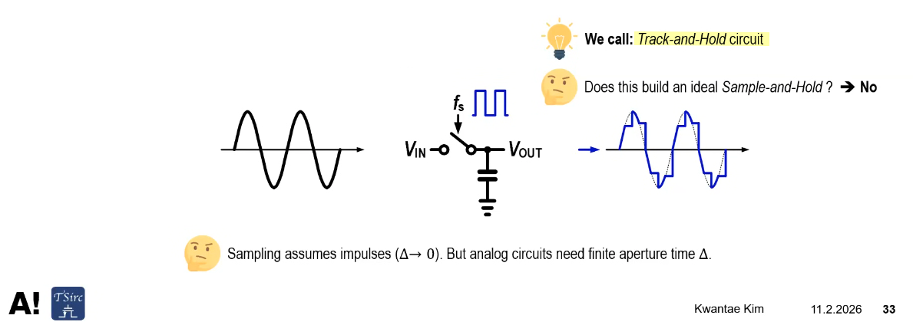

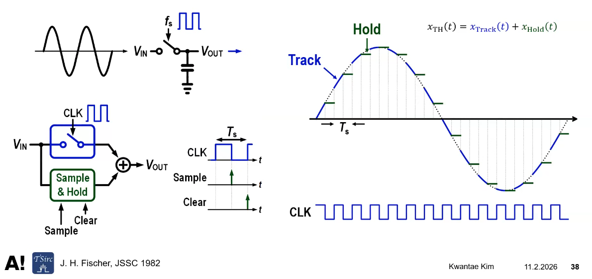

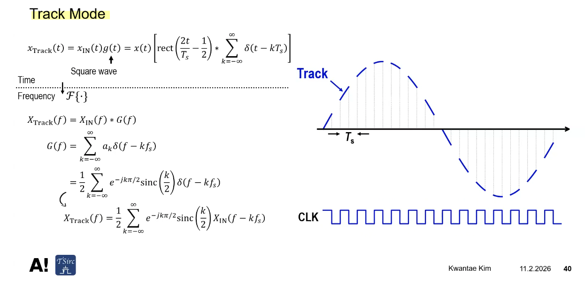

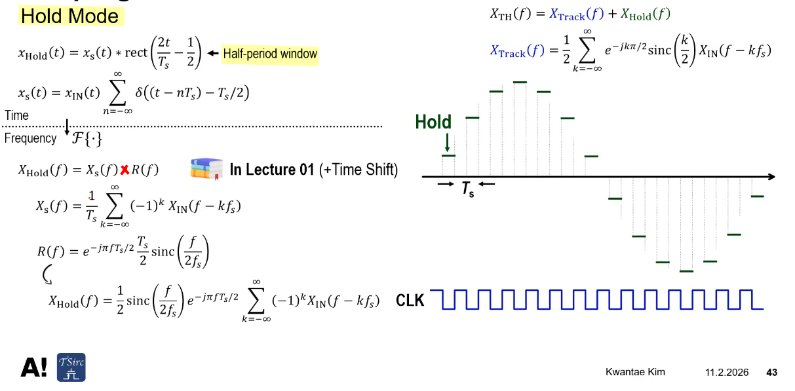

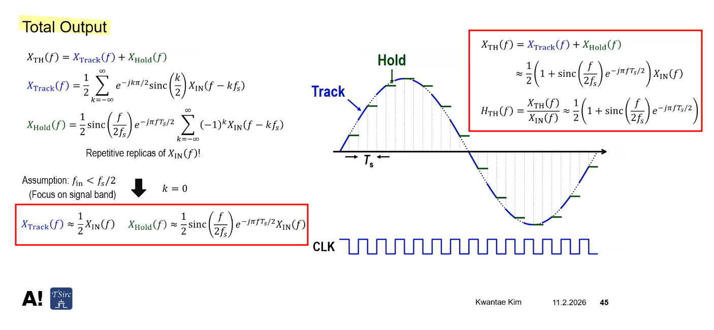
$$
H_\mathrm{TH}(f) \approx \frac{1}{2}
\left(
    1 + \mathrm{sinc}\left( \frac{f}{2f_s} \right)e^{-j\pi f T_s/2}
\right)
$$

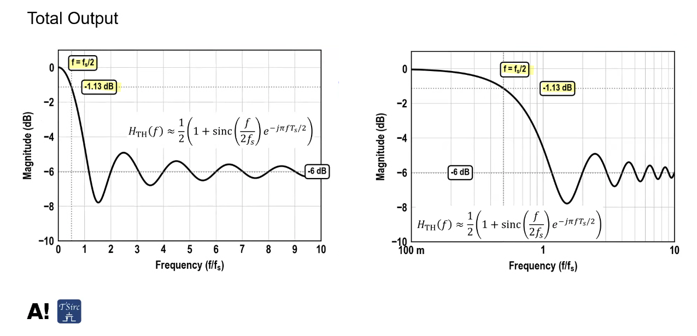

## Sample-and-Hold (SH)

> ***Zero-Order Hold***

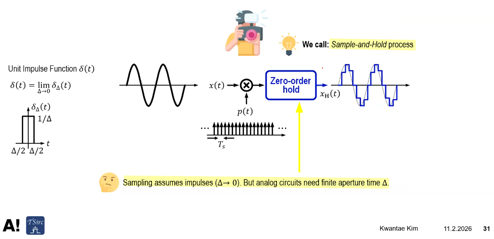

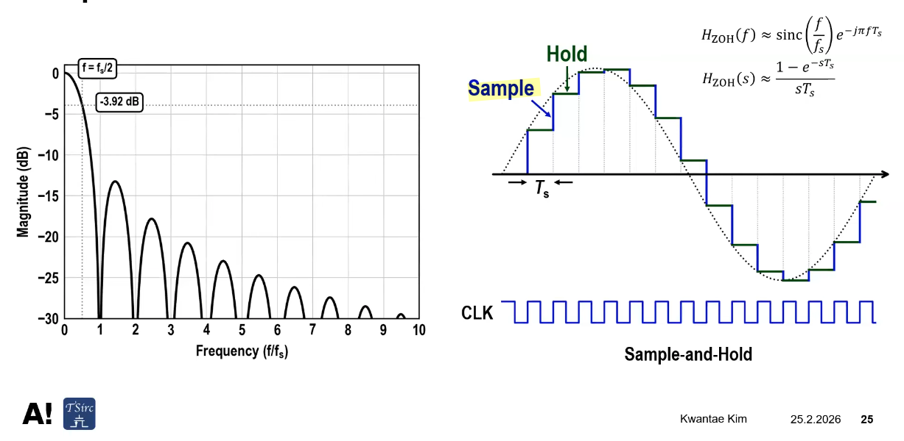

Given $\color{red}T_p = T_s$
$$
H_\mathrm{SH}(f) \approx
    \mathrm{sinc}\left( \frac{f}{f_s} \right)e^{-j\pi f T_s}
$$

---

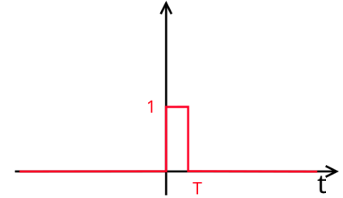
$$
h_{ZOH}(t) = \text{rect}(\frac{t}{T} - \frac{1}{2}) = \left\{ \begin{array}{cl}
1 & : \ 0 \leq t \lt T \\
0 & : \ \text{otherwise}
\end{array} \right.
$$
The effective frequency response is the continuous Fourier transform of the impulse response
$$
H_{ZOH}(f) = \mathcal{F}\{h_{ZOH}(t)\} = T\frac{1-e^{j2\pi fT}}{j2\pi fT}=Te^{-j\pi fT}\text{sinc}(fT)
$$
where $\text{sinc}(x)$ is the normalized sinc function $\frac{\sin(\pi x)}{\pi x}$

The Laplace transform transfer function of the ZOH is found by substituting $s=j2\pi f$
$$
H_{ZOH}(s) = \mathcal{L}\{h_{ZOH}(t)\}=\frac{1-e^{-sT}}{s}
$$

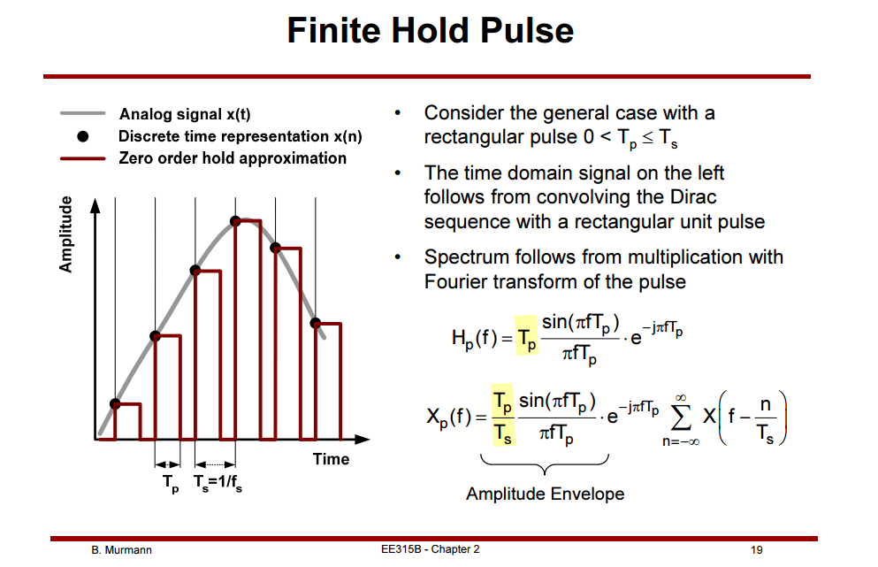

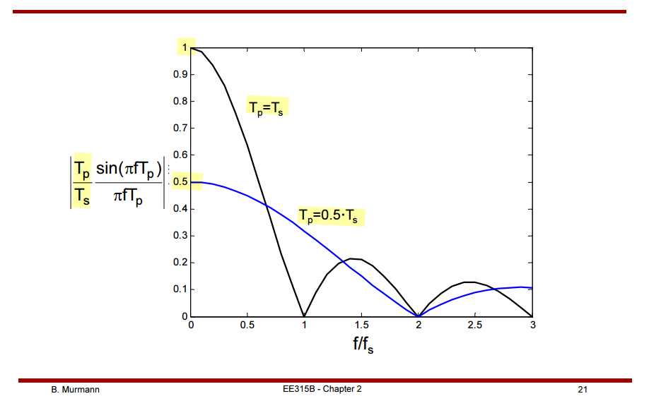

## Clock Feedthrough

> aka. **LO leakage**

*TODO* &#128197;

## Integrator

*TODO* &#128197;

> [[https://www.eecg.utoronto.ca/~johns/ece1371/slides/10_switched_capacitor.pdf](https://www.eecg.utoronto.ca/~johns/ece1371/slides/10_switched_capacitor.pdf)]
>
> [[https://www.seas.ucla.edu/brweb/papers/Journals/BRWinter17SwCap.pdf](https://www.seas.ucla.edu/brweb/papers/Journals/BRWinter17SwCap.pdf)]
>
> [[https://class.ece.iastate.edu/ee508/lectures/EE%20508%20Lect%2029%20Fall%202016.pdf](https://class.ece.iastate.edu/ee508/lectures/EE%20508%20Lect%2029%20Fall%202016.pdf)]

## reference

Boris Murmann. EE315A VLSI Signal Conditioning Circuits [[pdf](https://picture.iczhiku.com/resource/eetop/SyIgQJfyzyuDhBXc.pdf)]

Kwantae Kim. ELEC-E3530 Integrated Analog Systems D (5 ECTS) [[video](https://youtube.com/playlist?list=PLmK06TkPUUKo-2LmZfhBpbcLTjFOxk2WJ)] [[github](https://github.com/KwantaeKim)]

R. S. Ashwin Kumar, Analog circuits for signal processing [[https://home.iitk.ac.in/~ashwinrs/2022_EE698W.html](https://home.iitk.ac.in/~ashwinrs/2022_EE698W.html)]

R. Gregorian and G. C. Temes. Analog MOS Integrated Circuits for Signal Processing. Wiley-Interscience, 1986 [[pdf](https://picture.iczhiku.com/resource/eetop/SHkTDjaejpdzPCBv.pdf)]

Christian-Charles Enz. "High precision CMOS micropower amplifiers" [[pdf](https://picture.iczhiku.com/resource/eetop/wYItQFykkAQDFccB.pdf)]

Negar Reiskarimian. CICC 2025 Insight: Switched Capacitor Circuits [[https://youtu.be/SL3-9ZMwdJQ](https://youtu.be/SL3-9ZMwdJQ)]
