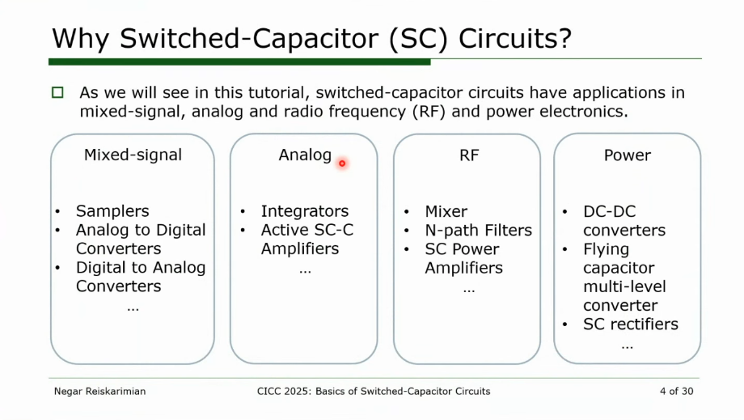
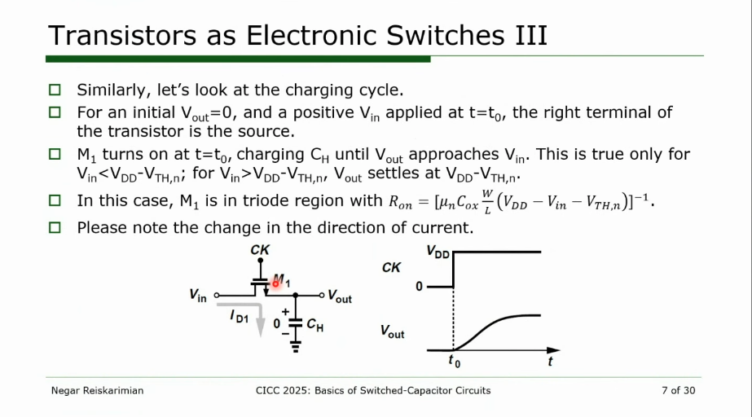

## Switched Capacitor Circuits

### Clock Feedthrough

> aka. **LO leakage**

*TODO* &#128197;

## Integrator

*TODO* &#128197;

> [[https://www.eecg.utoronto.ca/~johns/ece1371/slides/10_switched_capacitor.pdf](https://www.eecg.utoronto.ca/~johns/ece1371/slides/10_switched_capacitor.pdf)]
>
> [[https://www.seas.ucla.edu/brweb/papers/Journals/BRWinter17SwCap.pdf](https://www.seas.ucla.edu/brweb/papers/Journals/BRWinter17SwCap.pdf)]
>
> [[https://class.ece.iastate.edu/ee508/lectures/EE%20508%20Lect%2029%20Fall%202016.pdf](https://class.ece.iastate.edu/ee508/lectures/EE%20508%20Lect%2029%20Fall%202016.pdf)]

## reference

R. S. Ashwin Kumar, Analog circuits for signal processing [[https://home.iitk.ac.in/~ashwinrs/2022_EE698W.html](https://home.iitk.ac.in/~ashwinrs/2022_EE698W.html)]

R. Gregorian and G. C. Temes. Analog MOS Integrated Circuits for Signal Processing. Wiley-Interscience, 1986 [[pdf](https://picture.iczhiku.com/resource/eetop/SHkTDjaejpdzPCBv.pdf)]

Christian-Charles Enz. "High precision CMOS micropower amplifiers" [[pdf](https://picture.iczhiku.com/resource/eetop/wYItQFykkAQDFccB.pdf)]

Boris Murmann. EE315A VLSI Signal Conditioning Circuits

ELEC-E3530 Integrated Analog Systems D (5 ECTS) [[video](https://youtube.com/playlist?list=PLmK06TkPUUKo-2LmZfhBpbcLTjFOxk2WJ)] [[github](https://github.com/KwantaeKim)]

---

Negar Reiskarimian. CICC 2025 Insight: Switched Capacitor Circuits [[https://youtu.be/SL3-9ZMwdJQ](https://youtu.be/SL3-9ZMwdJQ)]
