## Track-and-Hold (TH)


$$
H_\mathrm{TH}(f) \approx \frac{1}{2}
\left(
    1 + \mathrm{sinc}\left( \frac{f}{2f_s} \right)e^{-j\pi f T_s/2}
\right)
$$


---

***PSS+PAC SImulaiton*** [[https://youtu.be/VLdcY76V9Ss](https://youtu.be/VLdcY76V9Ss)]


## Sample-and-Hold (SH)

> ***Zero-Order Hold***


Given $\color{red}T_p = T_s$
$$
H_\mathrm{SH}(f) \approx
    \mathrm{sinc}\left( \frac{f}{f_s} \right)e^{-j\pi f T_s}
$$


---


$$
h_{ZOH}(t) = \text{rect}(\frac{t}{T} - \frac{1}{2}) = \left\{ \begin{array}{cl}
1 & : \ 0 \leq t \lt T \\
0 & : \ \text{otherwise}
\end{array} \right.
$$
The effective frequency response is the continuous Fourier transform of the impulse response
$$
H_{ZOH}(f) = \mathcal{F}\{h_{ZOH}(t)\} = T\frac{1-e^{j2\pi fT}}{j2\pi fT}=Te^{-j\pi fT}\text{sinc}(fT)
$$
where $\text{sinc}(x)$ is the normalized sinc function $\frac{\sin(\pi x)}{\pi x}$

The Laplace transform transfer function of the ZOH is found by substituting $s=j2\pi f$
$$
H_{ZOH}(s) = \mathcal{L}\{h_{ZOH}(t)\}=\frac{1-e^{-sT}}{s}
$$


## Sinc Droop of ZOH sampler

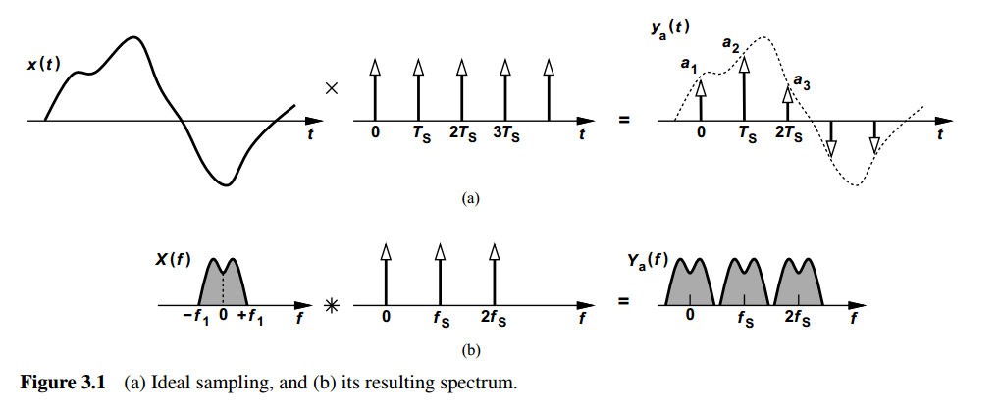

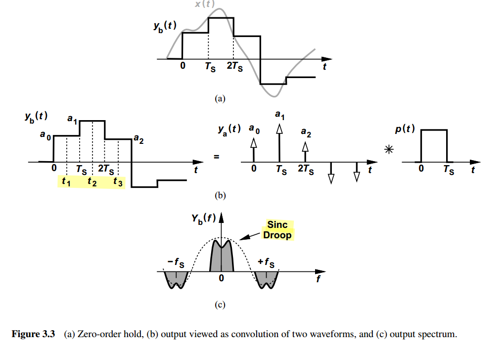

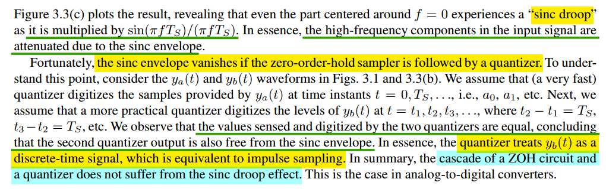

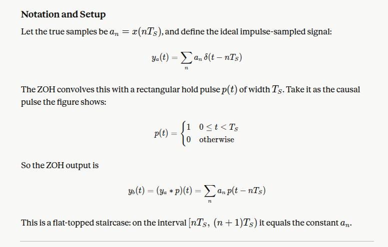

***Time-Domain Argument***

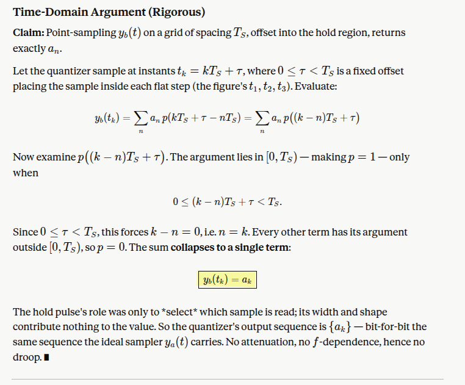

***Frequency-Domain Argument***

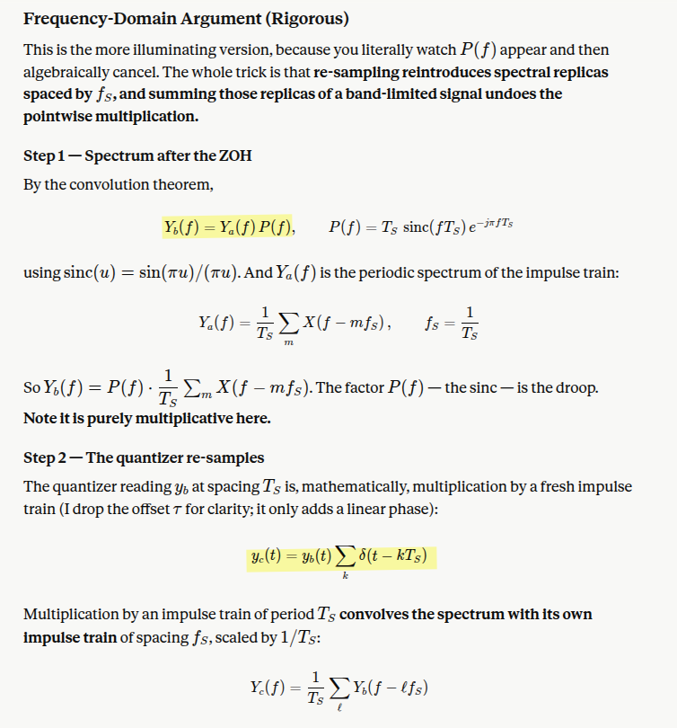

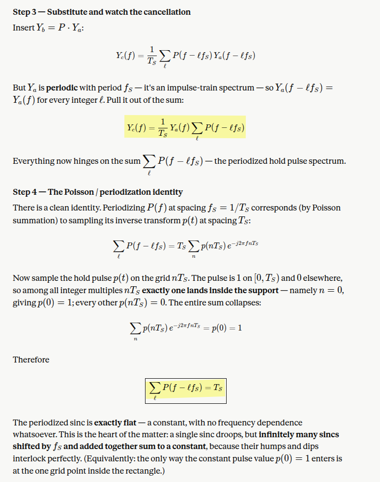

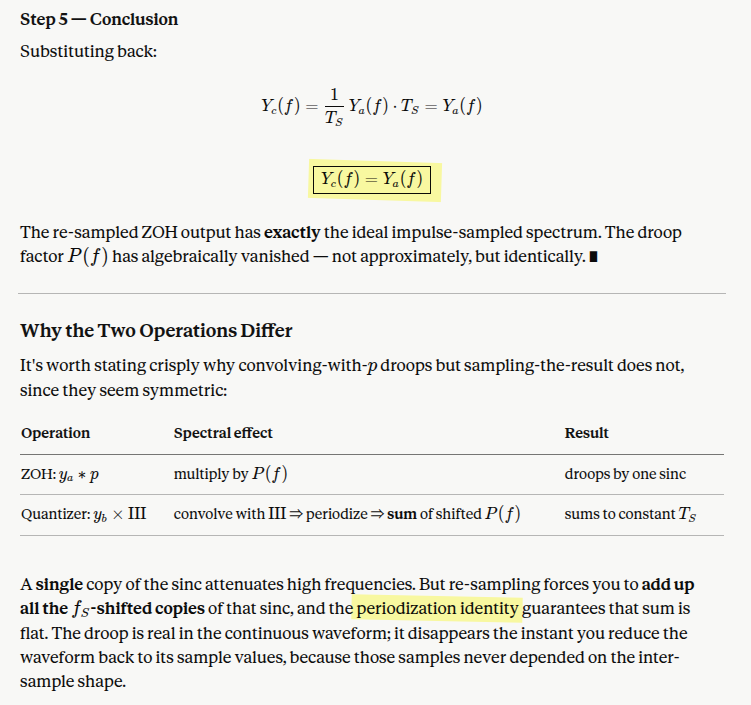


## Switched-Capacitor Filter

> Kwantae Kim, Integrated Analog Systems D - Lecture 08 (Switched-Capacitor Filter) [[https://youtu.be/G0lzrMll-Ho](https://youtu.be/G0lzrMll-Ho)]
>
> —, Integrated Analog Systems D - Lecture 10 CAD (Switched-Capacitor Filter) [[[https://youtu.be/eMOFMjuKiJQ](https://youtu.be/eMOFMjuKiJQ)]

***switched-Capacitor Resistor***


Due to not taking loading $C_2$ into account, actual switched-capacitor filter deviate from equivalent $R_{SC}$ + $C_2$ low pass filter as $f_p$ approaching to $f_s$


$$
\color{red}H(z) =\frac{V_{OUT}(z)}{V_{IN}(z)}=\frac{C_1z^{-1/2}}{C_1+C_2}\frac{1}{1-\frac{C_2}{C_1+C_2}z^{-1}}
$$


---


> [[https://youtu.be/eMOFMjuKiJQ](https://youtu.be/eMOFMjuKiJQ)]


## Sampling Switch

> Kwantae Kim, *Integrated Analog Systems D - Lecture 10 (ADC)* [[https://youtu.be/IEdbLNJb9wQ](https://youtu.be/IEdbLNJb9wQ)]


### Noise In Sampling Circuit

> Kwantae Kim, *Integrated Analog Systems D - Lecture 12 (ADC)* [[https://youtu.be/NkSitVkPNig](https://youtu.be/NkSitVkPNig)]
>
> Shanthi Pavan , *6.4 - kT/C noise in a sample-and-hold circuit* [[https://youtu.be/EmyMuRswsjo](https://youtu.be/EmyMuRswsjo)]


## Bootstrapped Switch


> A. Abo et al., "A 1.5-V, 10-bit, 14.3-MS/s CMOS Pipeline Analog-to Digital Converter," IEEE J. Solid-State Circuits, pp. 599, May 1999 [[https://sci-hub.se/10.1109/4.760369](https://sci-hub.se/10.1109/4.760369)]
>
> Dessouky and Kaiser, "Input switch configuration suitable for rail-to-rail operation of switched opamp circuits," Electronics Letters, Jan. 1999. [[https://sci-hub.se/10.1049/EL:19990028](https://sci-hub.se/10.1049/EL:19990028)]
>
> B. Razavi, "The Bootstrapped Switch [A Circuit for All Seasons]," in *IEEE Solid-State Circuits Magazine*, vol. 7, no. 3, pp. 12-15, Summer 2015 [[https://www.seas.ucla.edu/brweb/papers/Journals/BRSummer15Switch.pdf](https://www.seas.ucla.edu/brweb/papers/Journals/BRSummer15Switch.pdf)]
>
> B. Razavi, "The Design of a bootstrapped Sampling Circuit [The Analog Mind]," IEEE Solid-State Circuits Magazine, Volume. 13, Issue. 1, pp. 7-12, Summer 2021. [[http://www.seas.ucla.edu/brweb/papers/Journals/BR_SSCM_1_2021.pdf](http://www.seas.ucla.edu/brweb/papers/Journals/BR_SSCM_1_2021.pdf)]


## Hold Mode Feedthrough


> P. Schvan et al., "A 24GS/s 6b ADC in 90nm CMOS," 2008 IEEE International Solid-State Circuits Conference - Digest of Technical Papers, San Francisco, CA, USA, 2008, pp. 544-634
>
> B. Sedighi, A. T. Huynh and E. Skafidas, "A CMOS track-and-hold circuit with beyond 30 GHz input bandwidth," 2012 19th IEEE International Conference on Electronics, Circuits, and Systems (ICECS 2012), Seville, Spain, 2012, pp. 113-116
>
> Tania Khanna, ESE 568: Mixed Signal Circuit Design and Modeling [[https://www.seas.upenn.edu/~ese5680/fall2019/handouts/lec11.pdf](https://www.seas.upenn.edu/~ese5680/fall2019/handouts/lec11.pdf)]


## Clock Feedthrough

> aka. **LO leakage**

*TODO* &#128197;


## analytical expression for $HD_3$

> Boris Murmann, MEAD2026 [[https://github.com/bmurmann/MEAD2026](https://github.com/bmurmann/MEAD2026)]
>
> HW #1 - “ICONS 2026: Masterclass Series on Advanced IC Design” Online Course - May 2026 [[https://youtu.be/hS2ZY_UHh_0](https://youtu.be/hS2ZY_UHh_0)]

In most differential designs, $HD_3$ is of primary concern, where even harmonics are absent

***Plain NMOS switch***

[[https://github.com/bmurmann/MEAD2026/blob/main/xschem/tb_track_nmos.sch](https://github.com/bmurmann/MEAD2026/blob/main/xschem/tb_track_nmos.sch)]

[[https://xschem-viewer.com/?file=https%3A%2F%2Fgithub.com%2Fbmurmann%2FMEAD2026%2Fblob%2Fmain%2Fxschem%2Ftb_track_nmos.sch](https://xschem-viewer.com/?file=https%3A%2F%2Fgithub.com%2Fbmurmann%2FMEAD2026%2Fblob%2Fmain%2Fxschem%2Ftb_track_nmos.sch)]

```
.param vdd=1.2 viq=0.3 vamp=0.2
.param cl=5p cb=1p w=100u ng=20
.param ndft=53 npad=5 bin=3 
.param fclk=500e6 per=1/fclk fin=fclk*bin/ndft
```

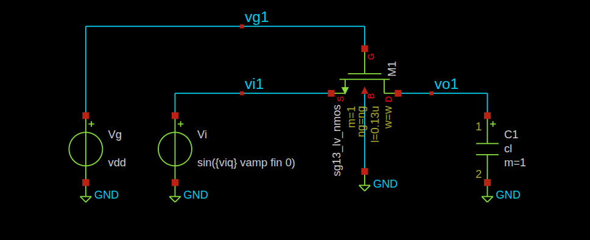

> sinusoidal source waveform, using parameters: `DC offset = viq`,  `amplitude = vamp`, `frequency = fin`, `delay = 0`
>
> Vth is about 0.466, then `vov=vdd-vth-viq = 1.2-0.466-0.3=0.434`

```python
## https://github.com/bmurmann/MEAD2026/blob/main/tb_track_nmos.ipynb

vov = 0.4344;  vm = 0.20;  c = 5e-12;  gds = 86e-3
fbw = 1/(2*np.pi*c/gds)
hd3_calc1 = -20*np.log10((1/2)*fin/fbw*(vm/vov)**2)
```

$$
\color{red}HD_3 \approx \frac{1}{2} \cdot \frac{f_{in}}{f_{BW}} \cdot \left(\frac{V_m}{V_{OV}}\right)^2
$$

Pure `Ron`-modulation distortion. **No bootstrap term, no body-effect term**

---

***Bootstrapped switch — ideal***

[[https://github.com/bmurmann/MEAD2026/blob/main/xschem/tb_track_nmos.sch](https://github.com/bmurmann/MEAD2026/blob/main/xschem/tb_track_nmos.sch)]

```
.param vdd=1.2 viq=0.3 vamp=0.2
.param cl=5p cb=1p w=100u ng=20
.param ndft=53 npad=5 bin=3 
.param fclk=500e6 per=1/fclk fin=fclk*bin/ndft
```

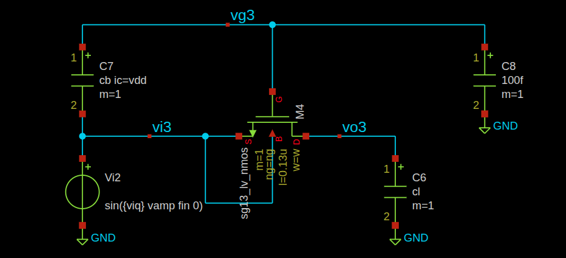

> Vth is about 0.466, then `vov=vdd-vth = 1.2-0.466=0.734`

```python
## https://github.com/bmurmann/MEAD2026/blob/main/tb_track_nmos.ipynb

cb = 1e-12; cp = 100e-15 + 2e-15; vov = 0.734; gds = 151e-3
hd3_calc2 = -20*np.log10((1/2)*fin/fbw*(vm/vov)**2 *(cp/cb)**2)
```

$$
\color{red}HD_3 \approx \frac{1}{2} \cdot \frac{f_{in}}{f_{BW}} \cdot \left(\frac{V_m}{V_{OV}}\right)^2 \cdot \left(\frac{C_p}{C_B}\right)^2
$$

Adds the bootstrap parasitic-ratio term. **No body-effect floor**

> 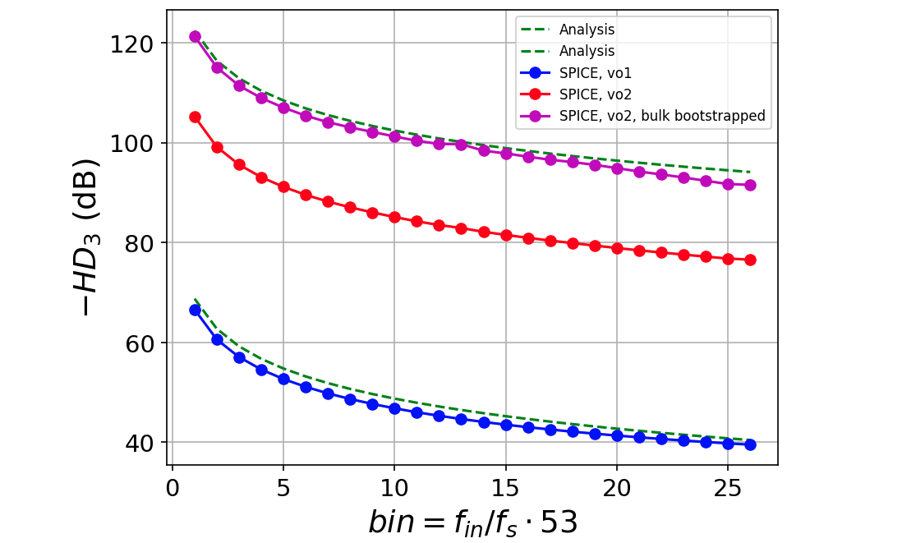
>
> 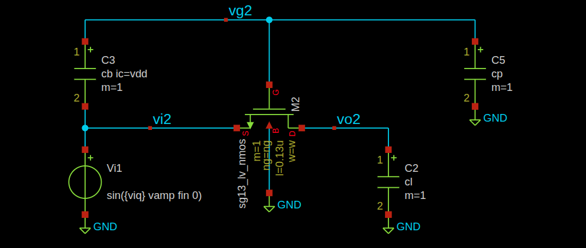


---

***Bootstrapped switch — with body effect***

[[https://github.com/bmurmann/MEAD2026/blob/main/xschem/tb_boot.sch](https://github.com/bmurmann/MEAD2026/blob/main/xschem/tb_boot.sch)]

[[https://xschem-viewer.com/?file=https%3A%2F%2Fgithub.com%2Fbmurmann%2FMEAD2026%2Fblob%2Fmain%2Fxschem%2Ftb_boot.sch](https://xschem-viewer.com/?file=https%3A%2F%2Fgithub.com%2Fbmurmann%2FMEAD2026%2Fblob%2Fmain%2Fxschem%2Ftb_boot.sch)]

```
.param vdd=1.2 viq=0.3 vamp=0.2
.param cl=1p cb=1p cp=100f w=100u ng=20
.param ndft=31 npad=5 bin=5 fclk=500e6 
.param per=1/fclk fin=fclk*bin/ndft trf=100p
.param vh=0 rsw=10 roff=1e9 rs=10

foreach i $&bin_vec
  alterparam bin=$i
  reset
  tran 10p $&tstop2 0
  let lin-tstep = $&per
  let lin-tstart = 1.25n
  linearize
  wrdata tb_boot_track.txt v(vi) v(vo)
  tran 10p $&tstop2 0
  let lin-tstep = $&per
  let lin-tstart = 1.8n
  linearize
  wrdata tb_boot.txt v(vi) v(vo)
  set appendwrite
  unset set wr_vecnames
end
```

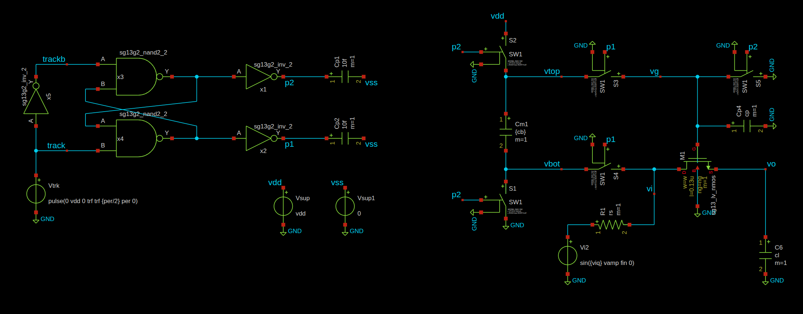


`ss`: small signal; `ls`: large signal; `1.6e-15`: capacitance per M1 MOS (Main Switch) width

```python
## https://github.com/bmurmann/MEAD2026/blob/main/tb_boot.ipynb

vdd = 1.2; vt = 0.466; cpss = 100e-15; cpls = 100*1.6e-15 + 100e-15
cb = 1e-12; cl = 1e-12; vgs = vdd*cb/(cb+cpls)
vov = vgs - vt; print(vov)
vm = 0.20; fs = 500e6; fin = bins*fs/ndft
gds = 151e-3; fbw=1/(2*np.pi*cl/gds)
hd3_calc = -20*np.log10((1/2)*fin/fbw*(vm/vov)**2 *(cpss/cb+0.11)**2)
```

$$
\color{red}HD_3 \approx \frac{1}{2} \cdot \frac{f_{in}}{f_{BW}} \cdot \left(\frac{V_m}{V_{OV}}\right)^2 \cdot \left(\frac{C_{p,ss}}{C_B} + 0.11\right)^2
$$


The `+0.11` is the residual `Vt(vin)` body-effect contribution that the bootstrap cannot cancel.

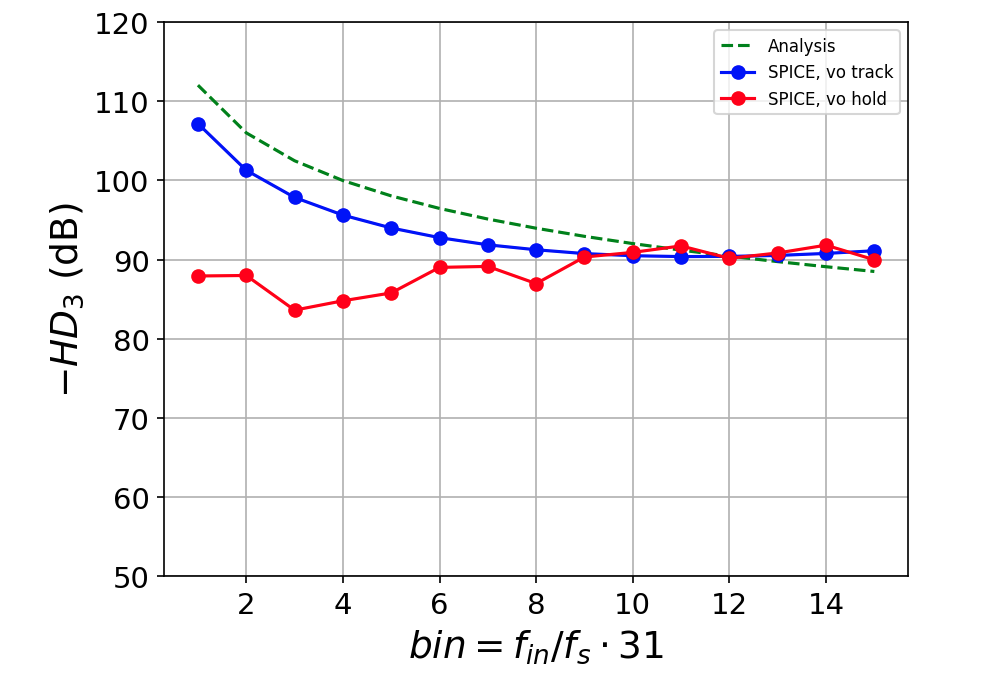


---

---

> [[https://github.com/bmurmann/MEAD2026/blob/main/tb_boot_bottom_4.ipynb](https://github.com/bmurmann/MEAD2026/blob/main/tb_boot_bottom_4.ipynb)]


```python
### fin, fin +/-N*fs

def get_third_harmonic_bin(i, ndft):
    """
    Finds the 3rd harmonic bin for a real-valued signal.
    i: fundamental bin index
    nfft: total number of FFT points
    """
    # Step 1: Wrap around the sampling frequency
    wrapped_bin = (3 * i) % ndft	### trim N
    
    # Step 2: Fold back if it's above Nyquist
    if wrapped_bin > ndft // 2:
        harmonic_bin = ndft - wrapped_bin	### fold back to fs/2
    else:
        harmonic_bin = wrapped_bin
        
    return int(harmonic_bin)


def compute_spectra(bins, v, ndft):
    sfdr = np.zeros(len(bins))
    hd3 = np.zeros(len(bins))
    spec_dbv_out = np.zeros((len(bins), ndft//2+1))
    for i in bins:
        y = v[i-1, :]
        y = y[:-1]
        
        ### Coherence sanity check
        ### With coherent sampling, y[-1] and y[-1-ndft] should be (nearly) equal
        relative_error = (y[-1]-y[-1-ndft])/y[-1]
        print(relative_error)
        
        y = y[-ndft:]
        spec = np.fft.rfft(y)
        spec_dbv = 20*np.log10(np.abs(spec)/(ndft/2))
        spec_dbv_out[i-1, :] = spec_dbv
        sfdr[i-1] = spec_dbv[i] - np.max(np.delete(spec_dbv, [0, i]))
        hd3[i-1] = spec_dbv[i] - spec_dbv[get_third_harmonic_bin(i, ndft)]
    return sfdr, hd3, spec_dbv_out
```


## Integrator

*TODO* &#128197;


> [[https://www.eecg.utoronto.ca/~johns/ece1371/slides/10_switched_capacitor.pdf](https://www.eecg.utoronto.ca/~johns/ece1371/slides/10_switched_capacitor.pdf)]
>
> [[https://www.seas.ucla.edu/brweb/papers/Journals/BRWinter17SwCap.pdf](https://www.seas.ucla.edu/brweb/papers/Journals/BRWinter17SwCap.pdf)]
>
> [[https://class.ece.iastate.edu/ee508/lectures/EE%20508%20Lect%2029%20Fall%202016.pdf](https://class.ece.iastate.edu/ee508/lectures/EE%20508%20Lect%2029%20Fall%202016.pdf)]


## simulation setup

### `strobeperiod`

> ADC Verification Rapid Adoption Kit (RAK)
>
> Spectre Tech Tips: Using the Spectre Strobe Feature [[https://community.cadence.com/cadence_blogs_8/b/cic/posts/spectre-tech-tips-using-the-spectre-strobe-feature](https://community.cadence.com/cadence_blogs_8/b/cic/posts/spectre-tech-tips-using-the-spectre-strobe-feature)]
>
> FFT in Cadence [[https://www.rfinsights.com/cadence/fft-in-cadence/](https://www.rfinsights.com/cadence/fft-in-cadence/)]

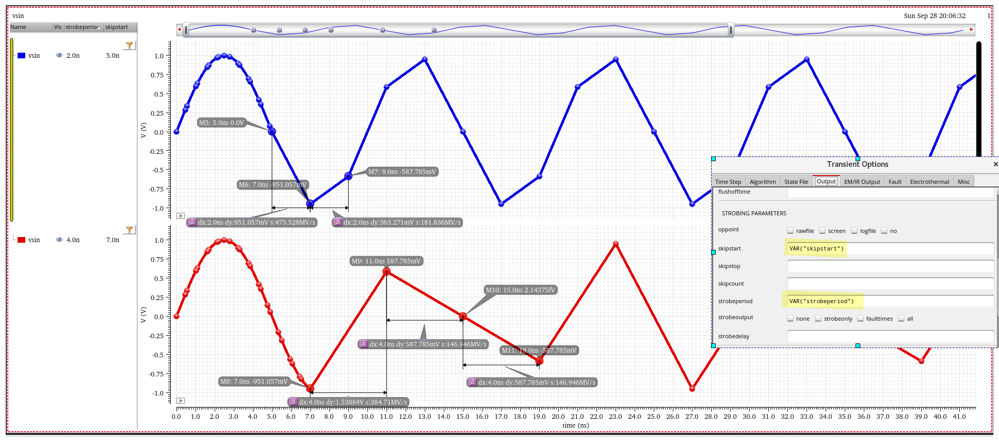

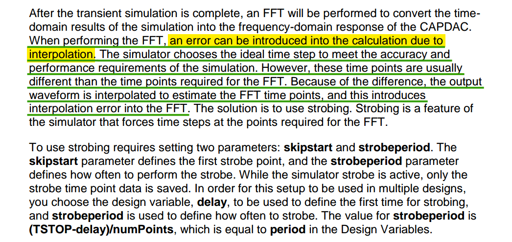

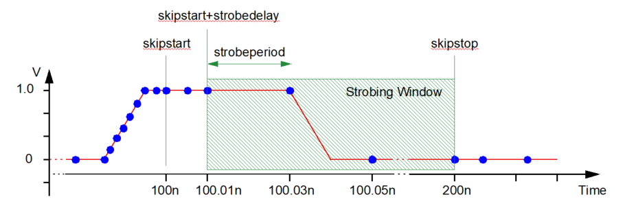


### PSS spectrum vs. FFT

> Kwantae Kim, Integrated Analog Systems D - Lecture 14S CAD (Linearity and FFT)  [[https://youtu.be/qwJ_tlZTaq8](https://youtu.be/qwJ_tlZTaq8)]

FFT analysis need **sampling**, then **aliasing** occur

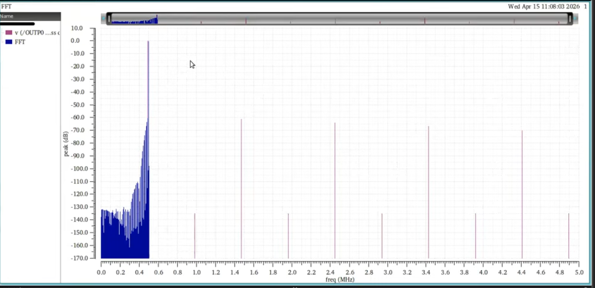


### Bootstrapped Switch

> Kwantae Kim, Integrated Analog Systems D - Lecture 14S CAD (Linearity and FFT)  [[https://youtu.be/qwJ_tlZTaq8](https://youtu.be/qwJ_tlZTaq8)]
>
> Sampled PAC (Spectre RF) Analysis - Strange results ? [[https://designers-guide.org/forum/YaBB.pl?num=1590925194](https://designers-guide.org/forum/YaBB.pl?num=1590925194)]


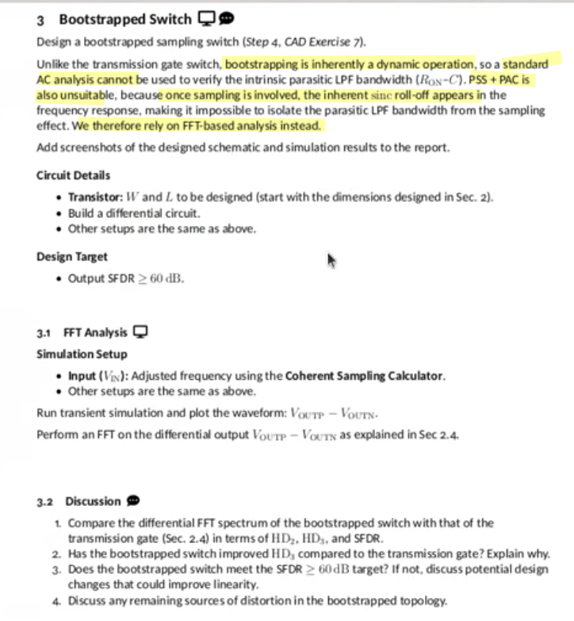


---

> Vishal Saxena, "SpectreRF Periodic Analysis" [[https://www.eecis.udel.edu/~vsaxena/courses/ece614/Handouts/SpectreRF%20Periodic%20Analysis.pdf](https://www.eecis.udel.edu/~vsaxena/courses/ece614/Handouts/SpectreRF%20Periodic%20Analysis.pdf)]
>
> [[https://designers-guide.org/forum/YaBB.pl?num=1590925194/1#1](https://designers-guide.org/forum/YaBB.pl?num=1590925194/1#1)]

**PSS + *SampledPAC*** should be suitable to characterize bootstrapped switch

It's the **hold** function that is responsible for the $\operatorname{sinc}()$ behavior

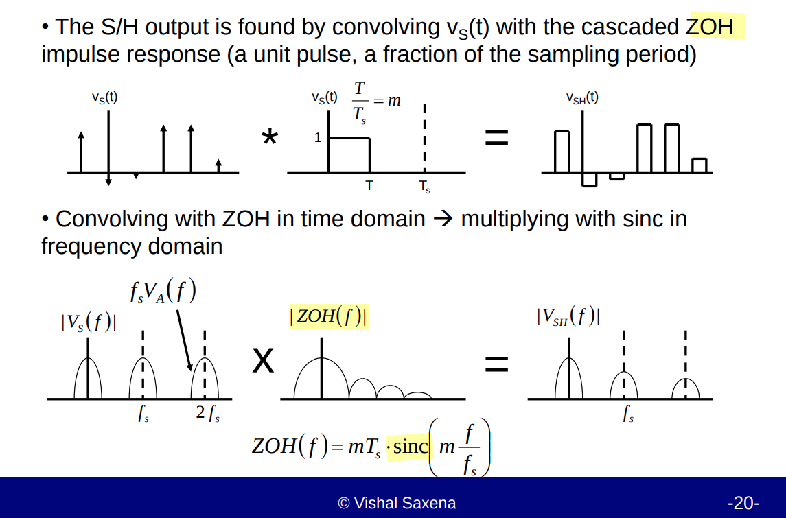


## reference

Boris Murmann. EE315A VLSI Signal Conditioning Circuits [[pdf](https://picture.iczhiku.com/resource/eetop/SyIgQJfyzyuDhBXc.pdf)]

Kwantae Kim. ELEC-E3530 Integrated Analog Systems D (5 ECTS) [[video](https://youtube.com/playlist?list=PLmK06TkPUUKo-2LmZfhBpbcLTjFOxk2WJ)] [[github](https://github.com/KwantaeKim/ELEC-E3530)]

R. S. Ashwin Kumar, Analog circuits for signal processing [[https://home.iitk.ac.in/~ashwinrs/2022_EE698W.html](https://home.iitk.ac.in/~ashwinrs/2022_EE698W.html)]

R. Gregorian and G. C. Temes. Analog MOS Integrated Circuits for Signal Processing. Wiley-Interscience, 1986 [[pdf](https://picture.iczhiku.com/resource/eetop/SHkTDjaejpdzPCBv.pdf)]

Christian-Charles Enz. "High precision CMOS micropower amplifiers" [[pdf](https://picture.iczhiku.com/resource/eetop/wYItQFykkAQDFccB.pdf)]

Negar Reiskarimian. CICC 2025 Insight: Switched Capacitor Circuits [[https://youtu.be/SL3-9ZMwdJQ](https://youtu.be/SL3-9ZMwdJQ)] [[dropbox](https://tinyurl.com/298ft6cg)]

Carsten Wulff, Switched-Capacitor Circuits [[https://analogicus.com/aic2026/switched-capacitor_circuits](https://analogicus.com/aic2026/switched-capacitor_circuits)]

rfinsights, switched capacitor analysis [[https://www.rfinsights.com/concepts/switched-capacitor-analysis/](https://www.rfinsights.com/concepts/switched-capacitor-analysis/)], [[https://www.rfinsights.com/concepts/switched-capacitor-analysis-with-switch-resistance/](https://www.rfinsights.com/concepts/switched-capacitor-analysis-with-switch-resistance/)]

