## TDR Impedance

> Amit Bahl, How TDR Impedance Measurements Work [[https://www.protoexpress.com/blog/tdr-impedance-measurements/](https://www.protoexpress.com/blog/tdr-impedance-measurements/)]
>
> Minh Quach. Signal Integrity Consideration and Analysis 4/30/2004 *Frequency & Time Domain Measurements/Analysis* [[https://ewh.ieee.org/r5/denver/sscs/Presentations/2004_04_Quach.pdf](https://ewh.ieee.org/r5/denver/sscs/Presentations/2004_04_Quach.pdf)]
>
> 江上渔樵, 在ADS中查看TDR的3种方法 [[https://zhuanlan.zhihu.com/p/420350734](https://zhuanlan.zhihu.com/p/420350734)]


### VtStep vs TDR

> Abhargava, *TDR Analysis using Agilent ADS* [[https://abhargava.wordpress.com/wp-content/uploads/2014/01/performing-tdr-analysis-using-agilent-ads.pdf](https://abhargava.wordpress.com/wp-content/uploads/2014/01/performing-tdr-analysis-using-agilent-ads.pdf)]
>
> Mike Steinberger, *TDR: Reading the Tea Leaves* [[https://siguys.com/wp-content/uploads/2016/01/TDR_TeaLeaves.pdf](https://siguys.com/wp-content/uploads/2016/01/TDR_TeaLeaves.pdf)]

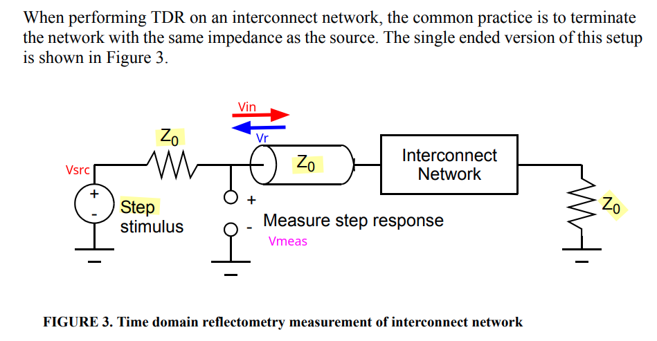

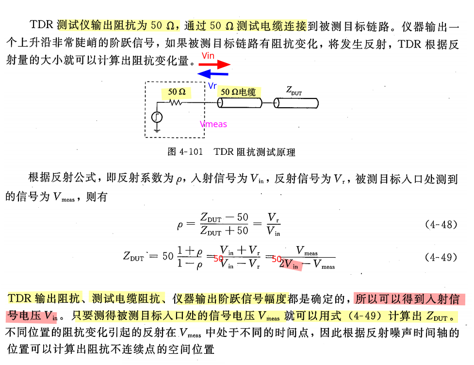

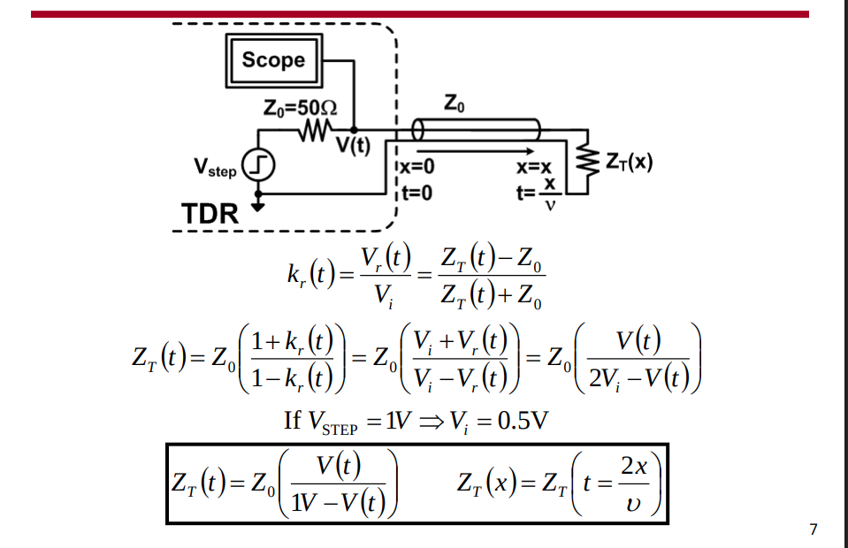
$$
\color{red}Z_T(t) = Z_0\cdot \frac{1+\Gamma(t)}{1-\Gamma(t)}
$$

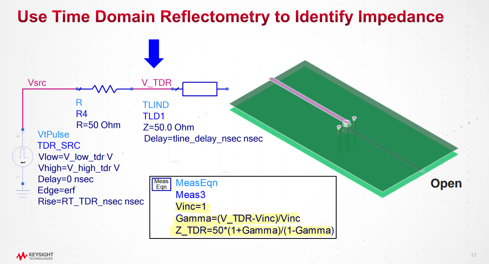

### S11 vs TDR

> Vladimir Dmitriev-Zdorov, Mentor Graphics, DesignCon 2014, *Computation of Time Domain Impedance Profile from S-Parameters: Challenges and Methods* [[link](https://www.researchgate.net/publication/339032423_DesignCon_2014_Computation_of_Time_Domain_Impedance_Profile_from_S-Parameters_Challenges_and_Methods)]
>
> Samtec, High Speed Characterization Report PCIEC-064-1000-EC-EM-P-85 [[https://suddendocs.samtec.com/testreports/hsc-report_pciec-85_web.pdf](https://suddendocs.samtec.com/testreports/hsc-report_pciec-85_web.pdf)]
>


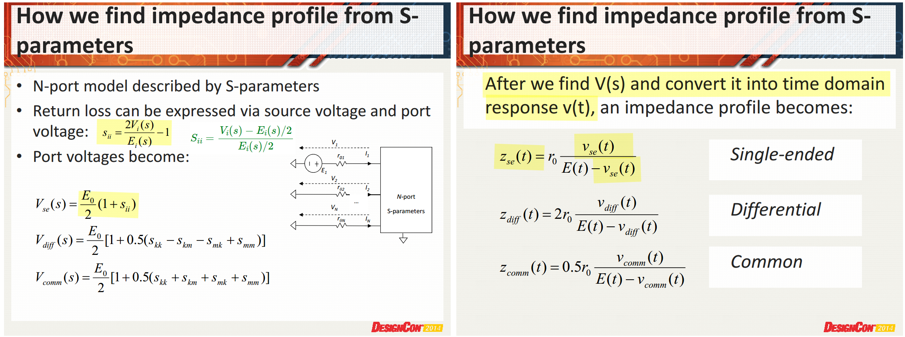

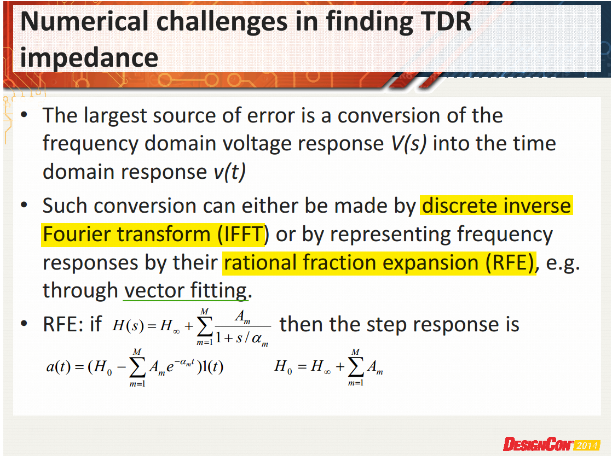

#### w/ IFFT

> 比尔盖子, *Frequency domain S11 conversion to time domain TDR* [[https://electronics.stackexchange.com/a/626063/233816](https://electronics.stackexchange.com/a/626063/233816)]
>
> HFSS™ 3D Layout Window Functions and Time Domain Plotting [[https://ansyshelp.ansys.com/public/Views/Secured/Electronics/v252/en/Subsystems/HFSS3DLayout/Content/ReportsandPostProc/WindowFunctionsandTimeDomainPlotting.htm](https://ansyshelp.ansys.com/public/Views/Secured/Electronics/v252/en/Subsystems/HFSS3DLayout/Content/ReportsandPostProc/WindowFunctionsandTimeDomainPlotting.htm)]
>
> Time Domain Measurements using Vector Network Analyzer ZVR [[https://scdn.rohde-schwarz.com/ur/pws/dl_downloads/dl_application/application_notes/1ez44/1ez44_0e.pdf](https://scdn.rohde-schwarz.com/ur/pws/dl_downloads/dl_application/application_notes/1ez44/1ez44_0e.pdf)]

***scikit-rf*** `plot_z_time_step`

```
S₁₁(f)
   │  (extrapolate_to_dc → uniform grid starting at 0 Hz)
   ▼
W(f) · S₁₁(f)                 ← windowed(): half-window, 1 at DC, 0 at f_max,
                                normalize=False (preserves S(0))
   │  (np.fft.irfft + fftshift)
   ▼
h(t)  – impulse response       ← impulse_response()
   │  (cumulative_trapezoid)
   ▼
Γ_step(t)  ∈ [−1, 1]           ← step_response()
   │  Z(t) = z0 · (1+Γ)/(1−Γ)   (clamp Γ=1)
   ▼
Z(t)  – plotted vs t (in ns)   ← plot_attribute() with attribute='z',
                                conversion='time_step'
```

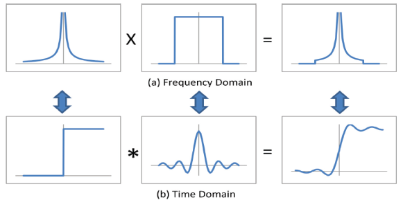

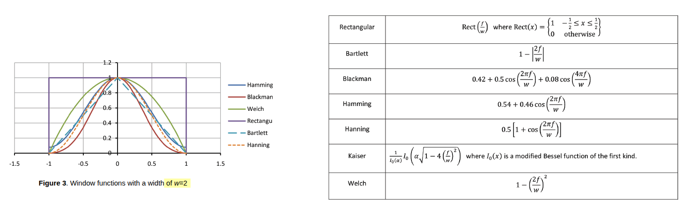

Window function with $w[0] = 1$ and $w[f_{max}]$=0 ensure $\Gamma(+\infty)$ and $\Gamma(0)$ are correct


---

---

> Jim Nadolny, Samtec. Technical Note Transformation of Samtec Connector Test Data For 85 ohm Differential Impedance Applications, [[https://suddendocs.samtec.com/notesandwhitepapers/technical-note_85ohm-reference-z-xform_web.pdf](https://suddendocs.samtec.com/notesandwhitepapers/technical-note_85ohm-reference-z-xform_web.pdf)]
>
> [ADS: 1-10] TDR Impedance (Part 2) TDRインピーダンス解析 [[https://youtu.be/ACINktqpM50](https://youtu.be/ACINktqpM50)]
>
> ADS `tdr_sp_imped`

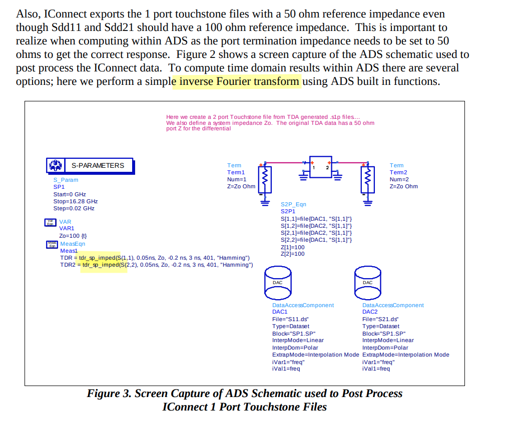

---

---

> Peter Goossens, *Transformation of time domain TDR to its frequency domain S11 (Return Loss) using FFT* [[https://www.gquipment.com/blog/transformation-of-time-domain-tdr-to-its-frequency-domain-s11-return-loss-using-fft](https://www.gquipment.com/blog/transformation-of-time-domain-tdr-to-its-frequency-domain-s11-return-loss-using-fft)]

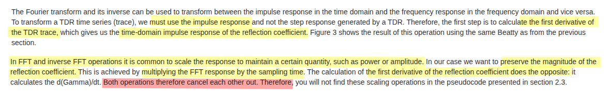

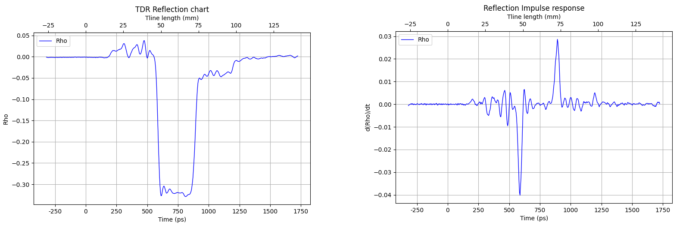

$$
\color{green} \Gamma(t) \to S_{ii}
$$

```python
# Pseudo code, laying out the essential steps only
# Trace data is in x_values
sampling_interval = np.mean(np.diff(x_values))
#  First derivative
diff_gamma_values = np.gradient(gamma_values)
# FFT
fourier_data = fft(diff_gama_values)
# Get the frequencies corresponding to the FFT result
frequencies = np.fft.fftfreq(len(diff_gama_values), d=sampling_interval)
# Calculate the magnitude of the complex Fourier transform data
magnitude = np.abs(fourier_data)
# Return loss
magnitude = 20 * np.log10(magnitude)
# Plot (frequency, magnitude)
```


#### w/ RFE

> ***rational fraction expansion (RFE)***

*TODO* &#128197;


## Time-Domain Transmission (TDT)

*TODO* &#128197;

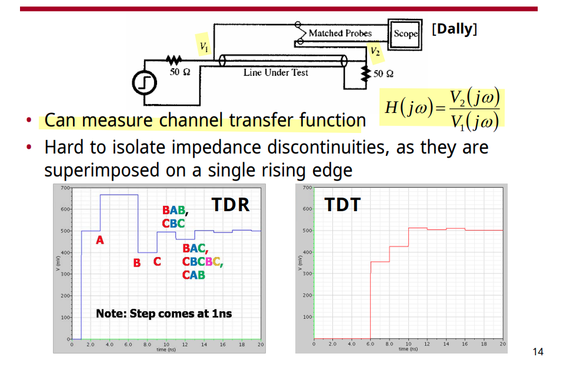


## Reading S-parameters

> teledynelecroy. Reading S-parameters [[https://blog.teledynelecroy.com/2020/05/](https://blog.teledynelecroy.com/2020/05/)]
>
> keysight. How to Interpret Ripple in an S Parameters Measurement [[https://docs.keysight.com/kkbopen/how-to-interpret-ripple-in-an-s-parameters-measurement-849642201.html](https://docs.keysight.com/kkbopen/how-to-interpret-ripple-in-an-s-parameters-measurement-849642201.html)]
>
> You Measured What? Four Must-Know Checks Before Trusting Your Trace S-Parameters [[https://www.signalintegrityjournal.com/articles/4083-you-measured-what-four-must-know-checks-before-trusting-your-trace-s-parameters](https://www.signalintegrityjournal.com/articles/4083-you-measured-what-four-must-know-checks-before-trusting-your-trace-s-parameters)]

*TODO* &#128197;


### Ripple in an S Parameters

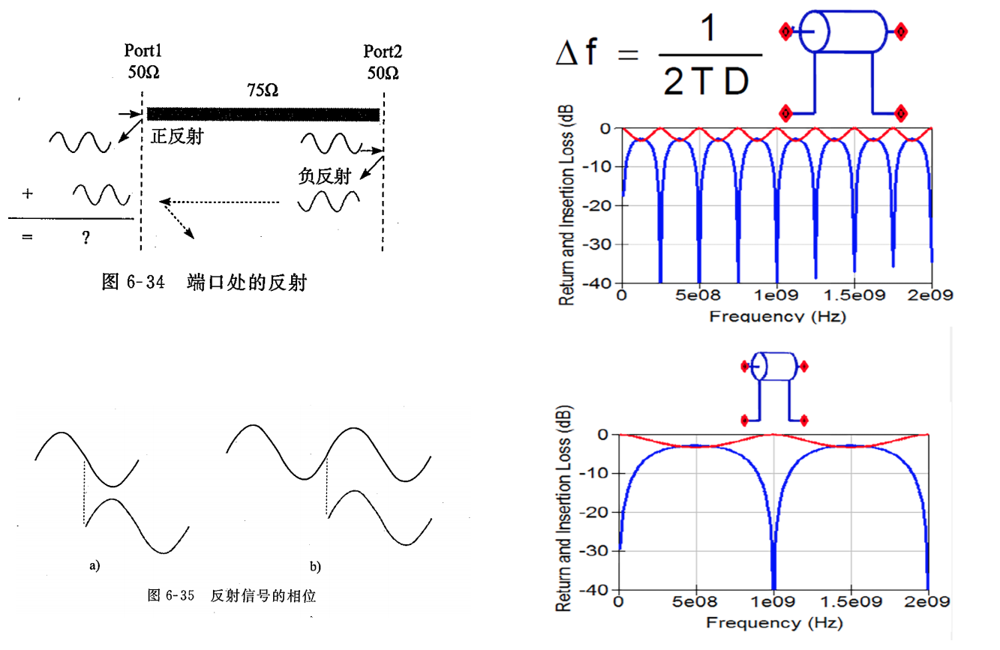

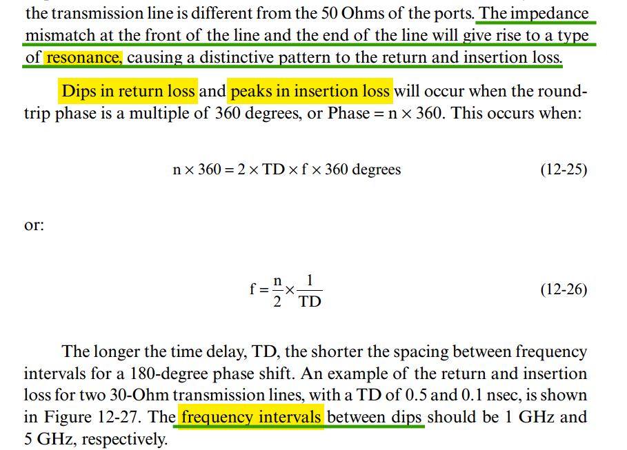


### Using S Parameters to Estimate Q

> Jeff Walling. ECE 5984 Using S Parameters to Estimate Q [[https://youtu.be/PXgM6pGIRvk](https://youtu.be/PXgM6pGIRvk)]

*TODO* &#128197;


## oscilloscope bandwidth

> Realtime oscilloscope bandwidth considerations for 25 Gbps PAM4 patterns, [[https://www.ieee802.org/3/cy/public/adhoc/chang_3cy_01_12_20_22.pdf](https://www.ieee802.org/3/cy/public/adhoc/chang_3cy_01_12_20_22.pdf)]

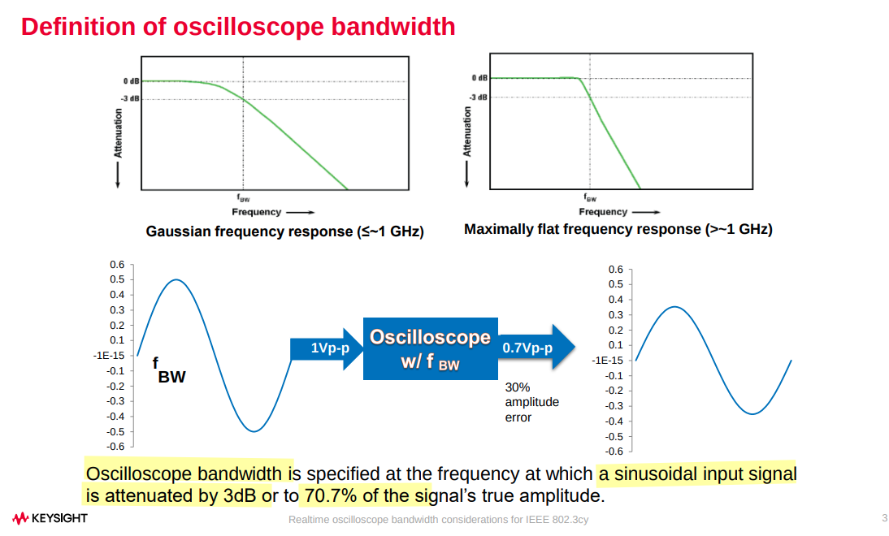

---

---

***Bessel Thomson Filter Bandwidth***


## reference

Bogatin, Eric. 2020. *Bogatin’s Practical Guide to Transmission Line Design and Characterization for Signal Integrity Applications / .Eric Bogatin.* Artech House.

keysight, Signal Integrity Characterization Techniques [[pdf](https://www.keysight.com/us/en/assets/7121-1077/ebooks/Signal-Integrity-Characterization-Techniques.pdf)]

Tim Wang-Lee, DesignCon 2026 KEF: Mastering TDR and De-embedding Through Simulation and Measurement [[link](https://www.keysight.com/us/en/assets/9926-01167/seminar-materials/DesignCon26-KEF-Bridging-Worlds-Mastering-TDR-and-De-embedding-through-Simulation-and-Measurement.pdf)]

Csaba SOOS, Signal and Power Integrity Design Practices [[https://indico.cern.ch/event/358837/attachments/714663/1930957/Signal_and_Power_Integrity_Practices.pdf](https://indico.cern.ch/event/358837/attachments/714663/1930957/Signal_and_Power_Integrity_Practices.pdf)]

Sam Palermo, ECEN689: Special Topics in High-Speed Links Circuits and Systems Spring 2012 Lecture 3: Time-Domain Reflectometry & S-Parameter Channel Models [[https://people.engr.tamu.edu/spalermo/ecen689/lecture3_ee689_tdr_spar.pdf](https://people.engr.tamu.edu/spalermo/ecen689/lecture3_ee689_tdr_spar.pdf)]
