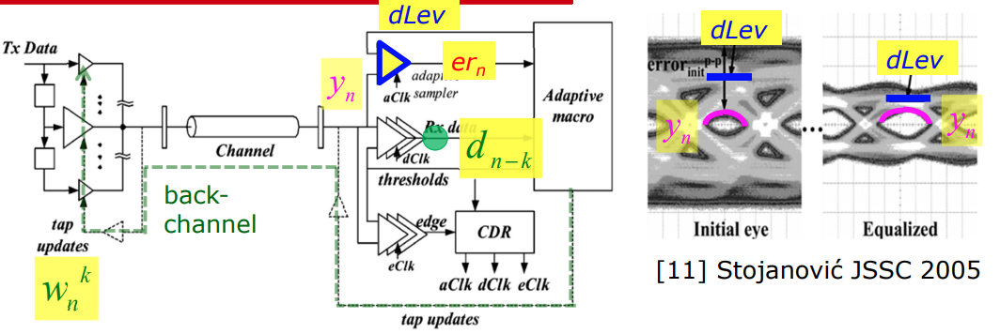

####  Adaptive equalizing link architecture

dLev: desired signal level

yn: received signal at time n

ern: the error slicer sample, i.e. sign(dLev - yn)

dn-k: the data slicer sample at time n-k

#### Least Mean Square Algorithm (LMS)

Loss function or cost function:
$$\begin{align}
e_n^2 &= (dLev - y_n)^2
\end{align}$$

Transmitter and channel response:
$$\begin{align}
ytx_n &= \sum_{0}^{k}\omega_n^k\ast dtx_{n-k} \\
y_n &= f_{ch}(ytx_n)
\end{align}$$
$ytx_n$ is output of transmitter at time n; $f_{ch}$ is channel response, for simplicity, scaling factor $\alpha$, ($\alpha > 0$) is enough.

Update function (i.e. Gradient descent):
$$\begin{align}
\omega_{n+1}^k = \omega_{n}^k - \frac{\eta}{2}\ast\frac{\partial e_n^2}{\partial \omega_{n}^k} \\
\omega_{n+1}^k = \omega_{n}^k + \eta \ast e_n \ast\frac{\partial y_n}{\partial \omega_{n}^k}
\end{align}$$
$\eta$ is learning rate or the rate of update, which is greater than zero.

#### Sign-Sign LMS (SSLMS)

**Why Sign-Sign LMS**

$ (dLev - y_n)$ and $\frac{\partial y_n}{\partial \omega_{n}^k}$ is hard to get in circuit, where the actual analog value should be obtained.

In **SSLMS algorithm**, only the polarities of samples are used since it is easy to detect by simple comparators.  Moreover, recovered data by hard decision is employed instead of $y_n$ for more simplicity.

The update function can be written as,

$$\begin{align}
\omega_{n+1}^k &= \omega_{n}^k + \eta \ast Sign(e_n) \ast Sign(\frac{\partial y_n}{\partial \omega_{n}^k}) \\
\omega_{n+1}^k &= \omega_{n}^k + \eta \ast Sign(e_n) \ast \alpha \ast Sign(\frac{\partial ytx_n}{\partial \omega_{n}^k}) \\
\omega_{n+1}^k &= \omega_{n}^k + \eta \ast Sign(er_n) \ast Sign(d_{n-k})
\end{align}$$

SSLMS algorithm useful for DFE adaptation.

#### Reference

T11: Basics of Equalization Techniques: Channels, Equalization, and Circuits, 2022 IEEE International Solid-State Circuits Conference

V. Stojanovic et al., "Autonomous dual-mode (PAM2/4) serial link transceiver with adaptive equalization and data recovery," in IEEE Journal of Solid-State Circuits, vol. 40, no. 4, pp. 1012-1026, April 2005, doi: 10.1109/JSSC.2004.842863.

Jinhyung Lee, Design of High-Speed Receiver for Video Interface with Adaptive Equalization; Phd thesis, August 2019. [thesis link](http://dcollection.snu.ac.kr/common/orgView/000000157003)

Paulo S. R. Diniz, Adaptive Filtering: Algorithms and Practical Implementation, 5th edition

