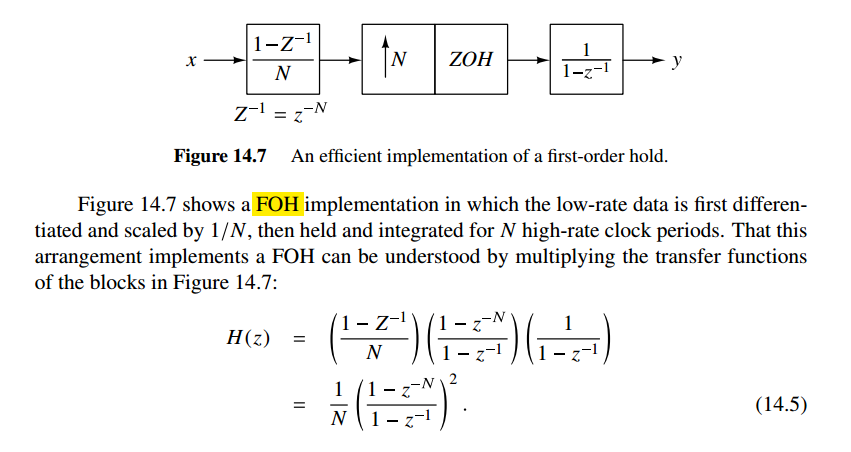

## ADC ENOB

> Dan Boschen, GRCon25: Quantifying Signal Quality: Practical Tools for High-Fidelity Waveform Analysis
>
> [[linkedin](https://www.linkedin.com/posts/danboschen_determining-the-effective-number-of-bits-activity-7367534634886246400-tfzu) [GRCon25](https://events.gnuradio.org/event/26/contributions/761/)]

## decimation filter

> [[https://web.engr.oregonstate.edu/~temes/ece627/Lecture_Notes/First_Order_DS_ADC_scan1.pdf](https://web.engr.oregonstate.edu/~temes/ece627/Lecture_Notes/First_Order_DS_ADC_scan1.pdf)]
>
> [[https://web.engr.oregonstate.edu/~temes/ece627/Lecture_Notes/First_Order_DS_ADC_scan2.pdf](https://web.engr.oregonstate.edu/~temes/ece627/Lecture_Notes/First_Order_DS_ADC_scan2.pdf)]

The combination of the the *digital post-filter* and *downsampler* is called the **decimation filter** or **decimator**

###  $\text{sinc}$ filter

Suppose $T=1$
$$
H_1(e^{j2\pi f}) = \frac{\text{sinc}(Nf)}{\text{sinc}(f)} = \frac{1}{N}\frac{\sin(\pi Nf)}{\sin(\pi f)}
$$
that is $\lim_{f\to 0^+}H_1(e^{j2\pi f}) = 1$  and $H_1 = 0$ when $f=\frac{n}{N}, n\in \mathbb{Z}$

> A Beginner's Guide To Cascaded Integrator-Comb (CIC) Filters [[https://www.dsprelated.com/showarticle/1337.php](https://www.dsprelated.com/showarticle/1337.php)]
>
> 

$$
|H_1(\omega)|^2 = \left|\frac{1}{N}(1-e^{-j\omega N}) \right| = \frac{2}{N^2}(1-\cos (\omega N))
$$
Total noise after $H_1$
$$
\sigma_{q_1}^2 = 2\int_0^\pi \frac{e^2_{rms}}{2\pi}\cdot |H_1(\omega)|^2d\omega = \frac{2e^2_{rms}}{N^2}
$$
inband noise before $H_1$, i.e. ***ideal LPF*** with cutoff frequency $\frac{\pi}{N}$
$$
\sigma_{q_0}^2 = 2\int_0^{\pi/N}\frac{e_{rms}^2}{2\pi}|1-e^{-j\omega}|^2d\omega = \frac{2e_{rms}^2}{\pi}\left(\frac{\pi}{N}-\sin\frac{\pi}{N}\right)
$$
with Taylor series $\sin\frac{\pi}{N}\approx \frac{\pi}{N}-\frac{1}{6}\frac{\pi^3}{N^3}$
$$
\sigma_{q_0}^2 \approx \frac{\pi^2}{3N^3}e_{rms}^2
$$

> Taylor’s Series of $\sin x$ [[pdf](https://ocw.mit.edu/courses/18-01sc-single-variable-calculus-fall-2010/242ad6a22b86b20799afc7f207cd4271_MIT18_01SCF10_Ses99c.pdf)]
>
> 

---

> [[https://analogicus.com/aic2025/2025/02/20/Lecture-6-Oversampling-and-Sigma-Delta-ADCs.html#python-oversample](https://analogicus.com/aic2025/2025/02/20/Lecture-6-Oversampling-and-Sigma-Delta-ADCs.html#python-oversample)]

### $\text{sinc}^2$ filter

## interpolation filter

*Notice that the requirements of the **first** stage are very **demanding***

### replicas suppression

The spectrum of the high resolution digital signal $u_1$ contains the ***original baseband portion*** and its replicas located at integer multiples of $f_{s1}$, plus ***a small amount of quantization noise*** shown as a solid line 

---

> Nigel Redmon [[https://dsp.stackexchange.com/a/63438/59253](https://dsp.stackexchange.com/a/63438/59253)]

***Inserting zeros changes nothing except what we consider the sample rate***

---

> Dan Boschen [[https://dsp.stackexchange.com/a/32130/59253](https://dsp.stackexchange.com/a/32130/59253)]

---

> Bourdopoulos, G. I. (2003). *Delta-Sigma modulators : modeling, design and applications*. Imperial College Press. [[pdf](https://picture.iczhiku.com/resource/eetop/shkgQaSQSIzkhbmc.pdf)]

## DC Gain in Interpolation Filtering

> [[https://raytroop.github.io/2025/06/21/data-converter-in-action/#dac-zoh](https://raytroop.github.io/2025/06/21/data-converter-in-action/#dac-zoh)]

DC gain is used to compensate the ratio of sampling rate before and after upsample

Given
$$
X_e = X =  \propto \frac{1}{T} = \frac{1}{L\cdot T_i}
$$
Then, the lowpass filter (ZOH, FOH .etc) gain shall be $L$

---

Employ definition of DTFT,  $X(e^{j\hat{\omega}})
=\sum_{n=-\infty}^{+\infty}x[n]e^{-j\hat{\omega} n}$, and set $\hat{\omega} = 0$
$$
X(e^{j0}) = \sum_{n=-\infty}^{+\infty}x[n]
$$
That is, $\sum_{n=-\infty}^{+\infty}x[n] = \sum_{n=-\infty}^{+\infty}x_e[n]$, so
$$
\overline{x_e[n]} = \frac{1}{L} \overline{x[n]}
$$
It also indicate that dc gain of upsampling is $1/L$

### ZOH

> Zero-Order Hold (ZOH)

> dc gain = $N$

### FOH

> First-Order Hold (FOH) 

> dc gain = $N$

## reference

Neil Robertson, Model a Sigma-Delta DAC Plus RC Filter [[https://www.dsprelated.com/showarticle/1642.php](https://www.dsprelated.com/showarticle/1642.php)]

—, Modeling a Continuous-Time System with Matlab [[https://www.dsprelated.com/showarticle/1055.php](https://www.dsprelated.com/showarticle/1055.php)]

—, Modeling Anti-Alias Filters [[https://www.dsprelated.com/showarticle/1418.php](https://www.dsprelated.com/showarticle/1418.php)]

—, DAC Zero-Order Hold Models [[https://www.dsprelated.com/showarticle/1627.php](https://www.dsprelated.com/showarticle/1627.php)]

—, “A Simplified Matlab Function for Power Spectral Density”, DSPRelated.com, March, 2020, [[https://www.dsprelated.com/showarticle/1333.php](https://www.dsprelated.com/showarticle/1333.php)]

Arash Loloee, Ph.D. Exploring Decimation Filters [[https://www.highfrequencyelectronics.com/Archives/Nov13/1311_HFE_decimationFilters.pdf](https://www.highfrequencyelectronics.com/Archives/Nov13/1311_HFE_decimationFilters.pdf)]

---

Venkatesh Srinivasan, ISSCC 2019 T5: Noise Shaping in Data Converters

Nan Sun,IEEE CAS 2020: Break the kT/C Noise Limit [[https://www.facebook.com/ieeecas/videos/break-the-ktc-noise-limit/322899188976197/](https://www.facebook.com/ieeecas/videos/break-the-ktc-noise-limit/322899188976197/)]

Yun-Shiang Shu, ISSCC 2022 T3: Noise-Shaping SAR ADCs

Xiyuan Tang, CICC 2025 ES2-1: Noise-Shaping SAR ADCs - From Fundamentals to Recent Advances

---

Qasim Chaudhari. On Analog-to-Digital Converter (ADC), 6 dB SNR Gain per Bit, Oversampling and Undersampling [[https://wirelesspi.com/on-analog-to-digital-converter-adc-6-db-snr-gain-per-bit-oversampling-and-undersampling/](https://wirelesspi.com/on-analog-to-digital-converter-adc-6-db-snr-gain-per-bit-oversampling-and-undersampling/)]

---

Pavan, Shanthi, Richard Schreier, and Gabor Temes. (2016) 2016. Understanding Delta-Sigma Data Converters. 2nd ed. Wiley. 

