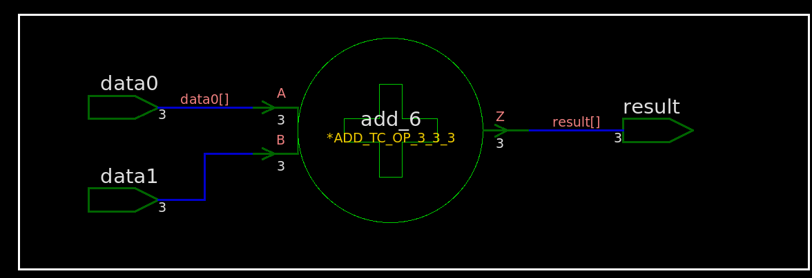

With **implict sign extension**, the implementation of **signed** arithmetic is **DIFFERENT** from that of **unsigned**. Otherwise, their implementations are same.

The implementations manifest the RTL's behaviour correctly

## add without implicit sign extension

### unsigned

#### rtl

```verilog
module TOP (
	input wire [2:0] data0
	,input wire [2:0] data1
	,output wire [2:0] result
);
	assign result = data0 + data1;
endmodule
```


#### synthesized netlist

 

```verilog
/////////////////////////////////////////////////////////////
// Created by: Synopsys DC Ultra(TM) in wire load mode
// Version   : S-2021.06-SP5
// Date      : Sat May  7 11:43:27 2022
/////////////////////////////////////////////////////////////


module TOP ( data0, data1, result );
  input [2:0] data0;
  input [2:0] data1;
  output [2:0] result;
  wire   n4, n5, n6;

  an02d0 U6 ( .A1(data0[0]), .A2(data1[0]), .Z(n5) );
  nr02d0 U7 ( .A1(data0[0]), .A2(data1[0]), .ZN(n4) );
  nr02d0 U8 ( .A1(n5), .A2(n4), .ZN(result[0]) );
  ad01d0 U9 ( .A(data1[1]), .B(data0[1]), .CI(n5), .CO(n6), .S(result[1]) );
  xr03d1 U10 ( .A1(n6), .A2(data0[2]), .A3(data1[2]), .Z(result[2]) );
endmodule
```

> vcs compile with `-v /path/to/lib.v`

### signed

#### rtl

```verilog
module TOP (
	input wire signed [2:0] data0
	,input wire signed [2:0] data1
	,output wire signed [2:0] result
);
	assign result = data0 + data1;
endmodule
```



#### synthesized netlist


```verilog
/////////////////////////////////////////////////////////////
// Created by: Synopsys DC Ultra(TM) in wire load mode
// Version   : S-2021.06-SP5
// Date      : Sat May  7 11:48:54 2022
/////////////////////////////////////////////////////////////


module TOP ( data0, data1, result );
  input [2:0] data0;
  input [2:0] data1;
  output [2:0] result;
  wire   n4, n5, n6;

  an02d0 U6 ( .A1(data0[0]), .A2(data1[0]), .Z(n5) );
  nr02d0 U7 ( .A1(data0[0]), .A2(data1[0]), .ZN(n4) );
  nr02d0 U8 ( .A1(n5), .A2(n4), .ZN(result[0]) );
  ad01d0 U9 ( .A(data1[1]), .B(data0[1]), .CI(n5), .CO(n6), .S(result[1]) );
  xr03d1 U10 ( .A1(n6), .A2(data0[2]), .A3(data1[2]), .Z(result[2]) );
endmodule
```

## add WITH implicit sign extension

### unsigned with 0 extension

#### rtl

```verilog
module TOP (
    input wire [2:0] data0		// 3 bit unsigned
    ,input wire [1:0] data1		// 2 bit unsigned
    ,output wire [2:0] result	// 3 bit unsigned
);
	assign result = data0 + data1;
endmodule
```


#### synthesized netlist


```verilog
/////////////////////////////////////////////////////////////
// Created by: Synopsys DC Ultra(TM) in wire load mode
// Version   : S-2021.06-SP5
// Date      : Sat May  7 12:15:58 2022
/////////////////////////////////////////////////////////////


module TOP ( data0, data1, result );
  input [2:0] data0;
  input [1:0] data1;
  output [2:0] result;
  wire   n4, n5, n6;

  an02d0 U6 ( .A1(data1[0]), .A2(data0[0]), .Z(n6) );
  ad01d0 U7 ( .A(data1[1]), .B(data0[1]), .CI(n6), .CO(n4), .S(result[1]) );
  xr02d1 U8 ( .A1(data0[2]), .A2(n4), .Z(result[2]) );
  nr02d0 U9 ( .A1(data1[0]), .A2(data0[0]), .ZN(n5) );
  nr02d0 U10 ( .A1(n6), .A2(n5), .ZN(result[0]) );
endmodule
```

### signed with implicit sign extension

#### rtl

```verilog
module TOP (
	input wire signed [2:0] data0
	,input wire signed [1:0] data1
	,output wire signed [2:0] result
);
	assign result = data0 + data1;
endmodule
```


#### synthesized netlist


```verilog
/////////////////////////////////////////////////////////////
// Created by: Synopsys DC Ultra(TM) in wire load mode
// Version   : S-2021.06-SP5
// Date      : Sat May  7 12:21:51 2022
/////////////////////////////////////////////////////////////


module TOP ( data0, data1, result );
  input [2:0] data0;
  input [1:0] data1;
  output [2:0] result;
  wire   n6, n7, n8, n9, n10;

  nd02d0 U9 ( .A1(data1[0]), .A2(data0[0]), .ZN(n10) );
  inv0d0 U10 ( .I(n10), .ZN(n9) );
  nr02d0 U11 ( .A1(data0[1]), .A2(data1[1]), .ZN(n7) );
  aor221d1 U12 ( .B1(n9), .B2(data1[1]), .C1(n10), .C2(data0[1]), .A(n7), .Z(
        n6) );
  xn02d1 U13 ( .A1(data0[2]), .A2(n6), .ZN(result[2]) );
  ora21d1 U14 ( .B1(data1[0]), .B2(data0[0]), .A(n10), .Z(result[0]) );
  aor21d1 U15 ( .B1(data1[1]), .B2(data0[1]), .A(n7), .Z(n8) );
  mx02d0 U16 ( .I0(n10), .I1(n9), .S(n8), .Z(result[1]) );
endmodule
```

