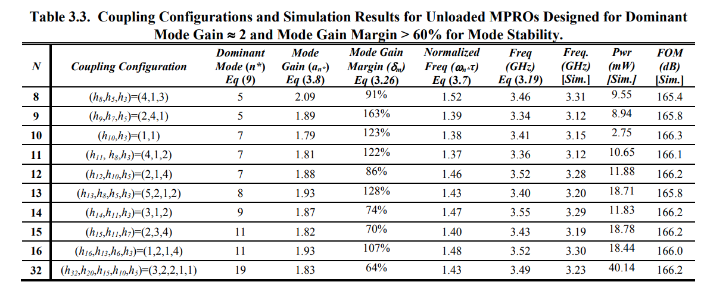

A conventional inverter-based ring oscillator consists of a single loop of an **odd** number of inverters. While compact, easy to design and tunable over a wide frequency range, this oscillator suffers from several limitations.

- it is not possible to increase the number of phases while maintaining the same oscillation frequency since the frequency is inversely proportional to the number of inverters in the loop. In other words, the time resolution of the oscillator is limited to one inverter delay and cannot be improved below this limit.
- the number of phases that can be obtained from this oscillator is limited to **odd** values. Otherwise, if an even number of inverters is used, the circuit remains in *a latched state* and does not oscillate.

To overcome the limitations of conventional ring oscillators, multi-paths ring oscillator (MPRO) is proposed. Each phase can be driven by two or more inverters, or *multi-paths* instead of having each phase in oscillator driven by a single inverter, or *single path*.

One thing that makes the MPRO design problem even more complicated is its property of having **multiple possible oscillation modes**. Without a clear understanding of what makes one of these modes dominant, it is very likely that a designer might end-up having an oscillator that can start-up each time in a different oscillation mode depending on the *initial state of the oscillator*.

In practive, the oscillator starts first from a linear mode of operation where all the buffers are indeed acting as linear transconductors. All oscillation modes that have mode gains, $a_n$, lower than the actual dc gain of the inverter, $a_0$, start to grow. *As the oscillation amplitude grows, the effective gain of the inverter drops due to nonlinearity*. Consequently, modes with higher mode gain die out and only the mode that requires the minimum gain continues to oscillate and hence is the dominant mode.

> The dominant mode is dependent only on the relative sizing vector

#### maximum oscillation frequency

The oscillation frequency of the dominant mode of any MPRO having any arbitrary coupling structure and number of phases is
$$
f_{n^*} = \frac {1}{2\pi}\frac {(a_0-1) \cdot \sum_{i=1}^{N}x_isin\left ( \frac {2\pi n^*(i-1)}{N} \right)}{(a_0\tau _p - \tau _o)\cdot \sum_{i=1}^{N}-x_icos\left( \frac{2\pi n^*(i-1)}{N}+(\tau _o - \tau _p) \right)}
$$

A **linear increase** in the maximum possible normalized oscillation frequency as the number of stages increases *provided that the dc gain of the buffer sufficient to provide the required amplification*

> assuming unlimited dc gain and zero mode gain margins

#### mode stability

A common problem in MPRO design is the stability of the dominant oscillation mode. Mode stability refers to whether the MPRO always oscillates at the same mode regardless of the initial conditions of the oscillator. This problem is especially pronounced for MPROs with a large number of phases. This is due to the existence of many modes and the very small differences in the value of the mode gain of adjacent modes if the MPRO is not well designed.

> In general, when the mode gain difference between two modes is small, the oscillator can operate in either one depending on initial conditions.

#### coupling configurations and simulation results

#### reference

Abou-El-Sonoun, A. A. (2012). High Frequency Multiphase Clock Generation Using Multipath Oscillators and Applications. *UCLA*. ProQuest ID: AbouElSonoun_ucla_0031D_10684. Merritt ID: ark:/13030/m57p9288. Retrieved from https://escholarship.org/uc/item/75g8j8jt
