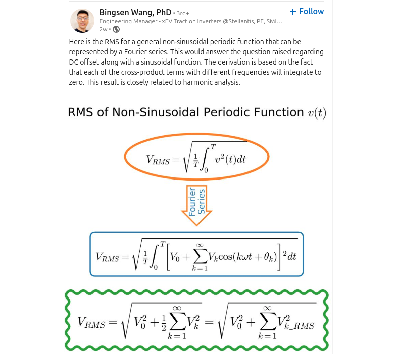

## Pulse Amplitude Modulation (PAM)

> Qasim Chaudhari. Pulse Amplitude Modulation (PAM) [[https://wirelesspi.com/pulse-amplitude-modulation-pam/](https://wirelesspi.com/pulse-amplitude-modulation-pam/)]

*TODO* &#128197;


## pulse averaging

The average value of output pulse are same because of **same DC gain (0dB)**


## Pulse shape vs Frequency Magnitude

*TODO* &#128197;


## Stability Criterion

### Barkhausen criteria

Barkhausen criteria are *necessary* but **not sufficient conditions** for sustainable **oscillations**


it simply *"latches up"* rather than oscillates

### Nyquist Stability Criterion

> Michael H. Perrott, High Speed Communication Circuits and Systems, Lecture 15 Integer-N Frequency Synthesizers[[https://www.cppsim.com/CommCircuitLectures/lec15.pdf](https://www.cppsim.com/CommCircuitLectures/lec15.pdf)]
>
> *Zoran Gajic*. Nyquist Stability Criterion [[https://eceweb1.rutgers.edu/~gajic/psfiles/nyquist.pdf](https://eceweb1.rutgers.edu/~gajic/psfiles/nyquist.pdf)]

*TODO* &#128197;


## Incrementally linear system


---


## fft vs. ifft

> Jason Sachs, Ten Little Algorithms, Part 2: The Single-Pole Low-Pass Filter [[https://www.embeddedrelated.com/showarticle/779.php](https://www.embeddedrelated.com/showarticle/779.php)]


$$
\mathcal{ifft} = \frac{\mathcal{fft}}{N}
$$


```python
import matplotlib.pyplot as plt
import numpy as np
np.random.seed(123456789)   # repeatable results

f0 = 4
t = np.arange(0,1.0,1.0/65536)
mysignal = (np.mod(f0*t,1) < 0.5)*2.0-1
mynoise = 1.0*np.random.randn(*mysignal.shape)

plt.figure(figsize=(8,6))
plt.plot(t, mysignal+mynoise, 'gray',
         t, mysignal,         'black');


def spectrum_fftovN(x):
    return np.abs(np.fft.fft(x))/len(x)

def spectrum_ifft(x):
    return np.abs(np.fft.ifft(x))


mysignal_spectrum_fftovN = spectrum_fftovN(mysignal)
mynoise_spectrum_fftovN  = spectrum_fftovN(mynoise)
mysignal_spectrum_ifft= spectrum_ifft(mysignal)
mynoise_spectrum_ifft = spectrum_ifft(mynoise)

N1 = 500
f = np.arange(N1)
plt.figure(figsize=(16,12))
plt.subplot(2,1,1)
plt.plot(f,mysignal_spectrum_fftovN[:N1], 'b-',
         f,mysignal_spectrum_ifft[:N1], 'r--', linewidth=3)
plt.legend(('fftovN','ifft'), fontsize=16, loc='upper right')
plt.title('signal', fontsize=24); plt.xlim(0,N1); plt.xlabel('frequency'); plt.ylabel('amplitude')

plt.subplot(2,1,2)
plt.plot(f,mynoise_spectrum_fftovN[:N1], 'b-',
         f,mynoise_spectrum_ifft[:N1], 'r--', linewidth=3)
plt.legend(('fftovN','ifft'), fontsize=16, loc='upper right')
plt.title('noise', fontsize=24); plt.xlim(0,N1); plt.xlabel('frequency'); plt.ylabel('amplitude')

plt.show()
```


## Pulse Code Modulation (PCM)

> John M Pauly. Lecture 13: Pulse Code Modulation [[https://web.stanford.edu/class/ee179/lectures/notes13.pdf](https://web.stanford.edu/class/ee179/lectures/notes13.pdf)]

Pulse Code Modulation (PCM) is a method for digitally representing analog signals by sampling their amplitude at regular intervals and then encoding these samples into binary numbers


## Energy/bit (pJ/b)

1mW/Gbps = 1pJ/bit

> **Joules** are a unit of work or *energy*. **Watts** are a unit of *power* which is the rate at which energy is generated or consumed.


## modulation depth

The ***modulation index*** (or ***modulation depth***) of a modulation scheme describes
by how much the modulated variable of the carrier signal varies around its unmodulated level

*TODO* &#128197;


## Image frequency


> Antonio Liscidini, ESSCIRC 2019 Tutorials: Ultra Low Power Receivers [[https://youtu.be/OJRB8g4vUZw](https://youtu.be/OJRB8g4vUZw)]

*TODO* &#128197;


## RMS for non-sinusoidal periodic function




## Nyquist rate & Nyquist frequency

- **Nyquist rate**

  The Nyquist rate is the **minimum sample rate** required to accurately measure a signal's highest frequency. It's equal to ***twice*** the highest frequency of the signal

- **Nyquist frequency**

  The Nyquist frequency is the highest frequency that can be **represented without aliasing** in a discrete signal. It's equal to ***half*** the sampling frequency


> **Oversampling Ratio (OSR)** is defined as the ratio of the *Nyquist frequency* $f_s/2$ to the *signal bandwidth* $B$ given by $\text{OSR}=f_s/2B$


## Summation & Integration 

|             | impulse response | Transform            | ROC                       |
| ----------- | ---------------- | -------------------- | ------------------------- |
| Summation   | $u(t)$           | $\frac{1}{s}$        | $\mathfrak{Re}\{s\}\gt 0$ |
| Integration | $u[n]$           | $\frac{1}{1-z^{-1}}$ | $|z| \gt 1$               |

> both are **NOT** stable


##  sinc function


where $W$ is sampling frequency in Hz


> 

---

 sinc function is *square integrable* but **not** *absolutely integrable*


## Zero-order hold (ZOH)


$$
h_{ZOH}(t) = \text{rect}(\frac{t}{T} - \frac{1}{2}) = \left\{ \begin{array}{cl}
1 & : \ 0 \leq t \lt T \\
0 & : \ \text{otherwise}
\end{array} \right.
$$
The effective frequency response is the continuous Fourier transform of the impulse response
$$
H_{ZOH}(f) = \mathcal{F}\{h_{ZOH}(t)\} = T\frac{1-e^{j2\pi fT}}{j2\pi fT}=Te^{-j\pi fT}\text{sinc}(fT)
$$
where $\text{sinc}(x)$ is the normalized sinc function $\frac{\sin(\pi x)}{\pi x}$

The Laplace transform transfer function of the ZOH is found by substituting $s=j2\pi f$
$$
H_{ZOH}(s) = \mathcal{L}\{h_{ZOH}(t)\}=\frac{1-e^{-sT}}{s}
$$


> 


## frequency convention

- radian frequency $\omega_0$ in **rad/s**
- cyclic frequency $f_0$ in **Hz**


##  Energy signals vs Power signal

> Topic 5 Energy & Power Signals, Correlation & Spectral Density [[https://www.robots.ox.ac.uk/~dwm/Courses/2TF_2021/N5.pdf](https://www.robots.ox.ac.uk/~dwm/Courses/2TF_2021/N5.pdf)]

---


> 

---

---


> 


## modulation & demodulation

> Hossein Hashemi, RF Circuits, [[https://youtu.be/0f3yZMvD2Jg](https://youtu.be/0f3yZMvD2Jg)]


## Convolution of probability distributions

The probability distribution of the *sum of two or more **independent** random variables* is the **convolution** of their individual distributions.


## Thermal noise

Thermal noise in an ideal resistor is approximately **white**, meaning that its power spectral density is nearly **constant** throughout the frequency spectrum.

When limited to a *finite bandwidth* and viewed in the time domain, thermal noise has a nearly **Gaussian amplitude distribution**


> 


## sinusoidal steady-state and frequency response


Due to KCL and $u(t)=e^{j\omega t}$ and $y(t)=H(j\omega)e^{j\omega t}$, we have ODE:

$$\begin{align}
\frac{u(t) - y(t)}{R} = C \frac{dy(t)}{dt} \\
e^{j\omega t} - H(j\omega) e^{j\omega t} = H(j\omega)\cdot j\omega e^{j\omega t} \\
\end{align}$$

$H(j\omega)$ is obtained as below
$$
H(j\omega) = \frac{1}{1+j\omega}
$$


## Different Variants of the PSD Definition

In the practice of engineering, it has become customary to use slightly different variants of the PSD definition, depending on the particular application or research field. 

- **Two-Sided PSD**, $S_x(f)$

  this is a synonym of the PSD defined as the Fourier Transform of the **autocorrelation**.

- **One-Sided PSD**, $S'_x(f)$

   this is a variant derived from the *two-sided PSD* by considering only the *positive frequency* semi-axis.

  To **conserve the total power**, the value of the one-sided PSD is **twice** that of the two-sided PSD
  $$
  S'_x(f) = \left\{ \begin{array}{cl}
  0 & : \ f \geq 0 \\
  S_x(f) & : \ f = 0 \\
  2S_x(f) & : \ f \gt 0 
  \end{array} \right.
  $$
  


  


> Note that the one-sided PSD definition makes sense only if the two-sided is an even function of $f$


If $S'_x(f)$ is even symmetrical around a positive frequency $f_0$, then two additional definitions can be adopted:

- **Single-Sideband PSD**, $S_{SSB,x}(f)$

  This is obtained from $S'_x(f)$ by moving the origin of the frequency axis to $f_0$
  $$
  S_{SSB,x}(f) =S'_x(f+f_0)
  $$
  This concept is particularly useful for describing phase or amplitude modulation schemes in wireless communications, where $f_0$ is the carrier frequency. 

  > Note that there is no difference in the values of the one-sided versus the SSB PSD; it is just a pure translation on the frequency axis. 

- **Double-Sideband PSD**, $S_{DSB,x}(f)$

  this is a variant of the SSB PSD obtained by considering only the positive frequency semi-axis.

  As in the case of the one-sided PSD, to conserve total power, the value of the DSB PSD is twice that of the SSB
  $$
  S_{DSB,x}(f) = \left\{ \begin{array}{cl}
  0 & : \ f \geq 0 \\
  S_{SSB,x}(f) & : \ f = 0 \\
  2S_{SSB,x}(f) & : \ f \gt 0 
  \end{array} \right.
  $$
  


> Note that the DSB definition makes sense only if the SSB PSD is even symmetrical around zero


## Poles and Zeros of transfer function

### poles

$$
H(s) = \frac{1}{1+s/\omega_0}
$$

magnitude and phase at $\omega_0$ and $-\omega_0$
$$\begin{align}
H(j\omega_0) &=  \frac{1}{1+j} = \frac{1}{\sqrt{2}}e^{-j\pi/4} \\
H(-j\omega_0) &=  \frac{1}{1-j} = \frac{1}{\sqrt{2}}e^{j\pi/4}
\end{align}$$

system response $y(t)$ of input $\cos(\omega_0 t)$, note $\cos(\omega_0t) = \frac{1}{2}(e^{j\omega_0 t} + e^{-j\omega_0 t})$
$$\begin{align}
y(t) &= H(j\omega_0)\cdot \frac{1}{2}e^{j\omega_0 t} + H(-j\omega_0)\cdot \frac{1}{2}e^{-j\omega_0 t} \\
&=  \frac{1}{\sqrt{2}}\cos(\omega_0t-\pi/4)
\end{align}$$

> $\cos(\omega_0 t)$, with frequency same with *pole* **DON'T** have *infinite response*
>
> That is,  pole indicate decrease trending 


### zeros

> similar with poles, $\cos(\omega_0 t)$, with frequency same with *zero* **DON'T** have *zero response*

$$
H(s) = 1+s/\omega_0
$$

magnitude and phase at $\omega_0$ and $-\omega_0$
$$\begin{align}
H(j\omega_0) &= 1+j = \sqrt{2}e^{j\pi/4} \\
H(-j\omega_0) &= 1-j = \sqrt{2}e^{-j\pi/4}
\end{align}$$

system response $y(t)$ of input $\cos(\omega_0 t)$, note $\cos(\omega_0t) = \frac{1}{2}(e^{j\omega_0 t} + e^{-j\omega_0 t})$
$$\begin{align}
y(t) &= H(j\omega_0)\cdot \frac{1}{2}e^{j\omega_0 t} + H(-j\omega_0)\cdot \frac{1}{2}e^{-j\omega_0 t} \\
&=  \sqrt{2}\cos(\omega_0t+\pi/4)
\end{align}$$


## baud rate

**symbol rate**, **modulation rate** or **baud rate** is the number of symbol changes per unit of time.

- Bit rate refers to the number of **bits** transmitted between two devices per unit of time
- The baud or symbol rate refers to the number of **symbols** that can be sent in the same amount of time


## reference

Stephen P. Boyd. EE102 Lecture 10 Sinusoidal steady-state and frequency response [[https://web.stanford.edu/~boyd/ee102/freq.pdf](https://web.stanford.edu/~boyd/ee102/freq.pdf)]

*Gene F. Franklin, J. David Powell, and Abbas Emami-Naeini. 2018. Feedback Control of Dynamic Systems (8th Edition) (8th. ed.). Pearson.*

Inter-Symbol Interference (or Leaky Bits) [[http://blog.teledynelecroy.com/2018/06/inter-symbol-interference-or-leaky-bits.html](http://blog.teledynelecroy.com/2018/06/inter-symbol-interference-or-leaky-bits.html)]

[AN001] Designing from zero an IIR filter in Verilog using biquad structure and bilinear discretization. URL:[[https://www.controlpaths.com/articles/an001_designing_iir_biquad_filter_bilinear/](https://www.controlpaths.com/articles/an001_designing_iir_biquad_filter_bilinear/)]

Frequency warping using the bilinear transform. URL:[[https://www.controlpaths.com/2022/05/09/frequency-warping-using-the-bilinear-transform/](https://www.controlpaths.com/2022/05/09/frequency-warping-using-the-bilinear-transform/)]

Digital control loops. Theoretical approach. URL:[[https://www.controlpaths.com/2022/02/28/digital-control-loops-theoretical-approach/](https://www.controlpaths.com/2022/02/28/digital-control-loops-theoretical-approach/)]

Simulation of DSP algorithms in Verilog. URL:[[https://www.controlpaths.com/2023/05/20/simulation-of-dsp-algorithms-in-verilog/](https://www.controlpaths.com/2023/05/20/simulation-of-dsp-algorithms-in-verilog/)]

Implementing a digital biquad filter in Verilog. URL:[[https://www.controlpaths.com/2021/04/19/implementing-a-digital-biquad-filter-in-verilog/](https://www.controlpaths.com/2021/04/19/implementing-a-digital-biquad-filter-in-verilog/)]

Implementing a FIR filter using folding. URL:[[https://www.controlpaths.com/2021/05/17/implementing-a-fir-filter-using-folding/](https://www.controlpaths.com/2021/05/17/implementing-a-fir-filter-using-folding/)]

Oppenheim, Alan V. and Cram. “Discrete-time signal processing : Alan V. Oppenheim, 3rd edition.” (2011).

Extras: PID Compensator with Bilinear Approximation URL:[[https://ctms.engin.umich.edu/CTMS/index.php?aux=Extras_PIDbilin](https://ctms.engin.umich.edu/CTMS/index.php?aux=Extras_PIDbilin)]

