***spread spectrum clock generation (SSCG)*** — an advanced clock generation solution for ***electromagnetic interference (EMI)***

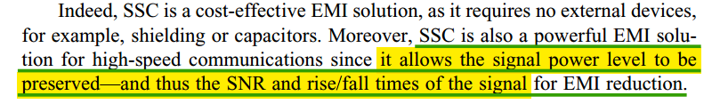

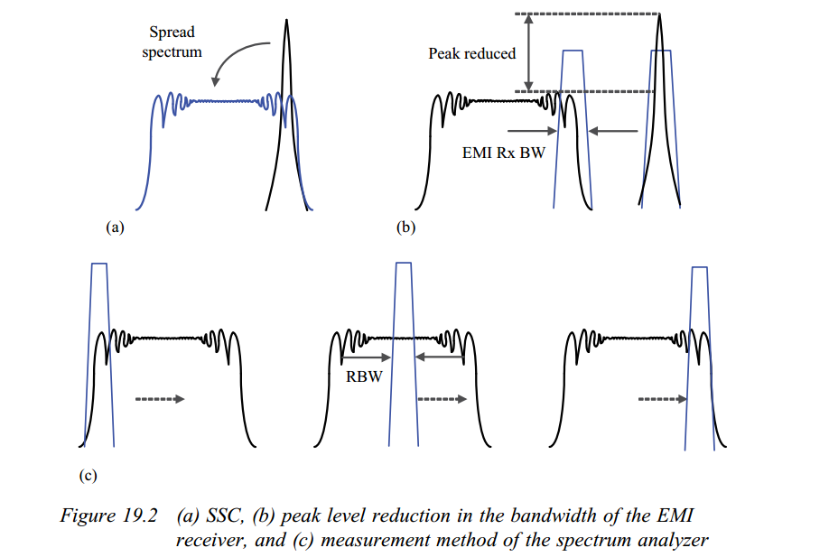

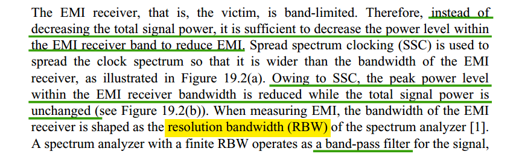

---


## SSC modulation profile

> [[https://www.synopsys.com/blogs/chip-design/understanding-pcie-spread-spectrum-clocking.html](https://www.synopsys.com/blogs/chip-design/understanding-pcie-spread-spectrum-clocking.html)]

The most common modulation techniques are down-spread and center-spread:

- ***Down-spread***: Carrier is modulated to lower than nominal frequency by specified percentage, and not higher

- ***Center-spread***: Carrier is modulated both higher and lower than nominal frequency by specified percentage

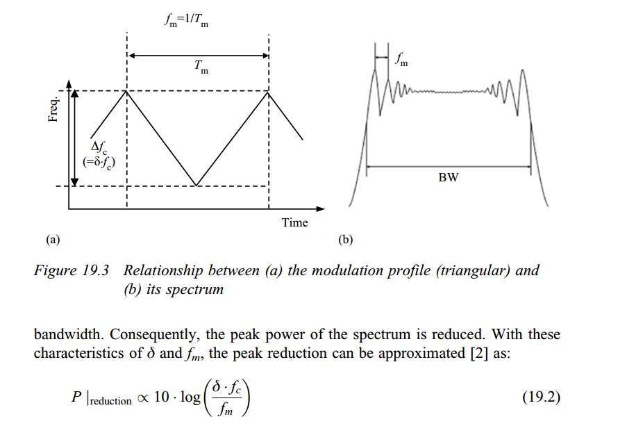

---

> Steve Glaser, NVidia Corporation. *Clocking Mode Terminology-2018-03-01*. Workgroup: PCI Express - Protocol

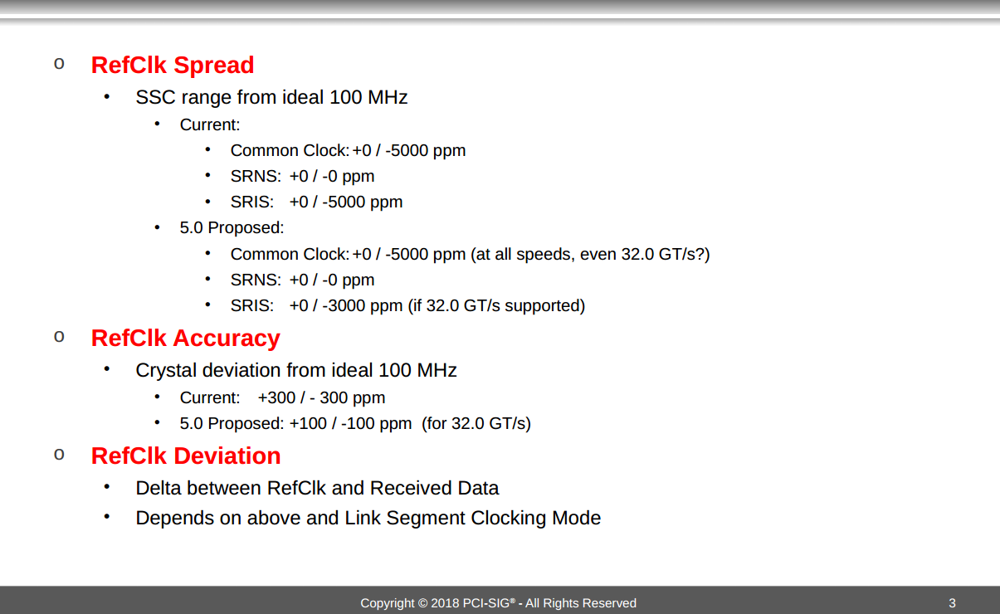


---

> Mike Hertz. Configuring the SSCTrack operator for Spread Spectrum Clock Demodulation of Serial Data [[https://cdn.teledynelecroy.com/files/appnotes/ssctrack_appnote.pdf](https://cdn.teledynelecroy.com/files/appnotes/ssctrack_appnote.pdf)]

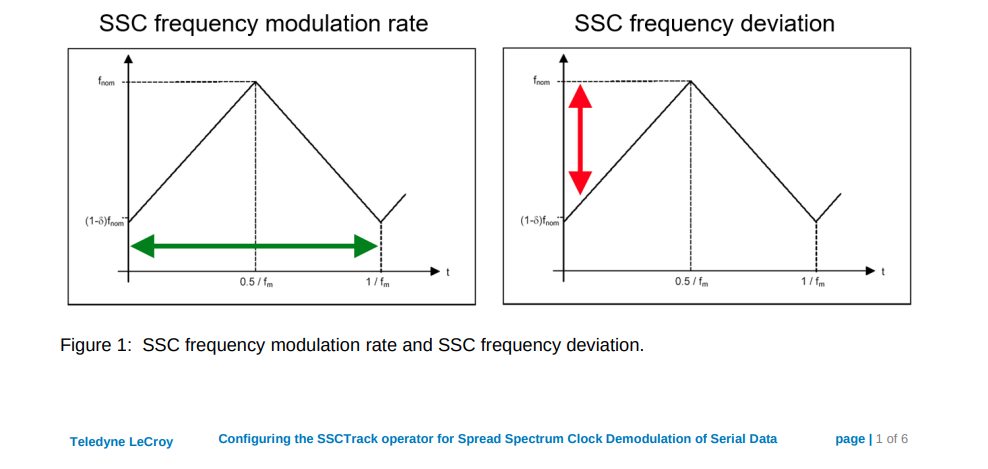

##  SSCG Architectures

> K. -H. Cheng, C. -L. Hung, C. -H. Chang, Y. -L. Lo, W. -B. Yang and J. -W. Miaw, "A Spread-Spectrum Clock Generator Using Fractional-N PLL Controlled Delta-Sigma Modulator for Serial-ATA III," *2008 11th IEEE Workshop on Design and Diagnostics of Electronic Circuits and Systems*, Bratislava, Slovakia, 2008 [[https://sci-hub.se/10.1109/DDECS.2008.4538758](https://sci-hub.se/10.1109/DDECS.2008.4538758)]

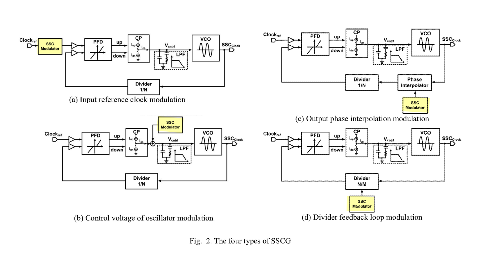


---

Due to $f= K_{vco}V_{ctrl}$, its derivate to $t$ is
$$
\frac{df}{dt} = K_{vco}\frac{dV_{ctrl}}{dt}
$$

For chargepump PLL, $dV_{ctrl} = \frac{\phi_e I_{cp}}{2\pi C}dt$, that is
$$
\frac{df}{dt} = K_{vco}  \frac{\phi_e I_{cp}}{2\pi C}
$$


## Refclk Clocking Architectures

> PCI Express Base Specification Revision *3.0*
>
> Jeff Morriss, Intel Gerry Talbot, AMD. PCI-SIG Devcon 2006. Jitter Budgeting for Clock Architecture
>
> Verification of SRIS/SRNS Clocking [[https://www.esaindia.com/emailer/download/sria-srns-white-paper-final-v3.pdf](https://www.esaindia.com/emailer/download/sria-srns-white-paper-final-v3.pdf)]


### Common Reference Clock (CC)

Common Refclk Rx architectures are characterized by the Tx and Rx sharing the same Refclk source

Most of the SSC jitter sourced by the Refclk is propagated equally through Tx and Rx PLLs, and so intrinsically tracks ***LF jitter***

The amount of jitter appearing at the CDR is then defined by the difference function between the Tx and Rx PLLs multiplied by the ***CDR highpass characteristic***

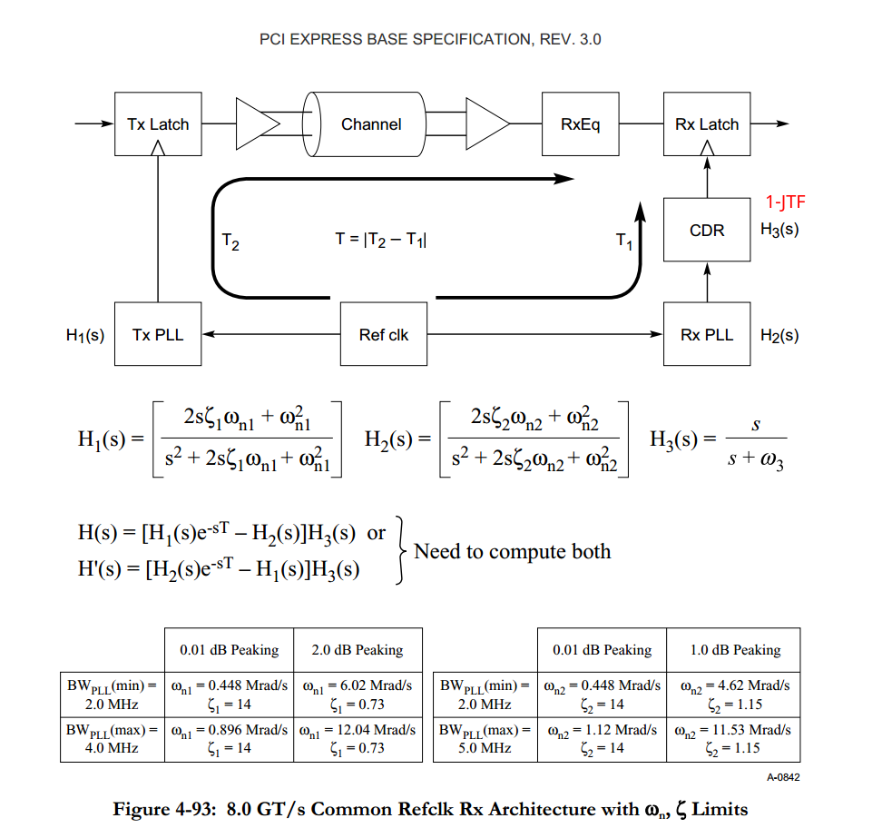
$$
H(s)= H_1(s)e^{-sT} -  \left[H_1(s)e^{-sT}(1-H_3(s)) + H_2(s)H_3(s) \right] = [H_1(s)e^{-sT} -H_2(s)]H_3(s)
$$
where $H_3(s)$ is similar to $NTF_{VCO}$, $1-H_3(s)$ is similar to $NTF_{REF}$


> 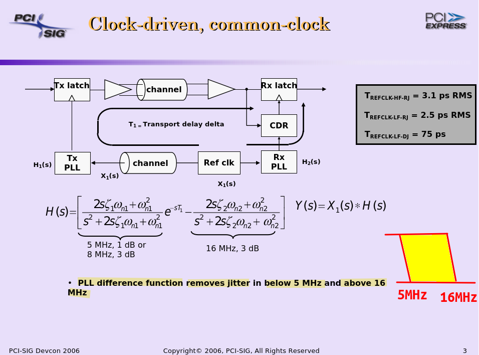


---

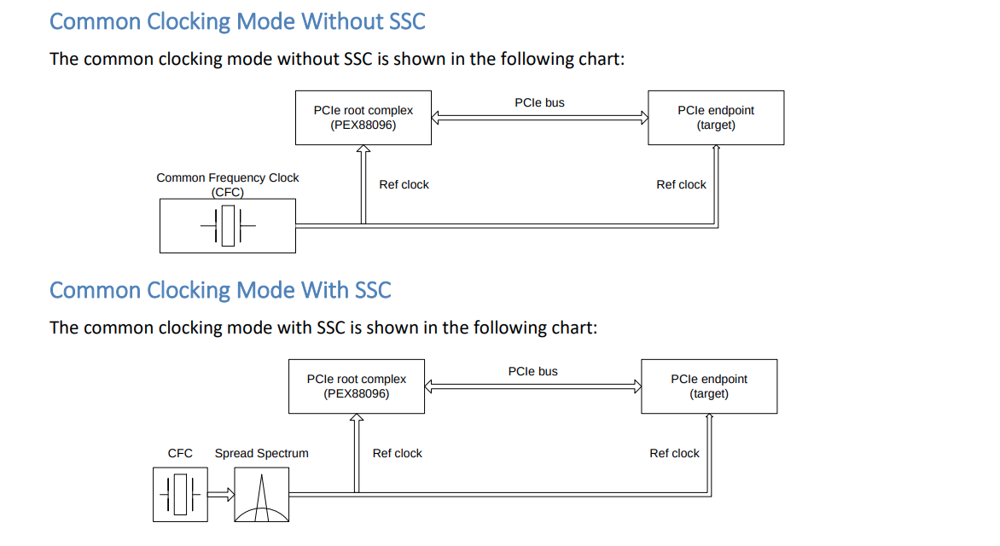

### Data Clocked Refclk Rx Architecture

A data clocked Rx architecture is characterized by requiring the *receiver's CDR to track the entirety of the low frequency jitter, including SSC*

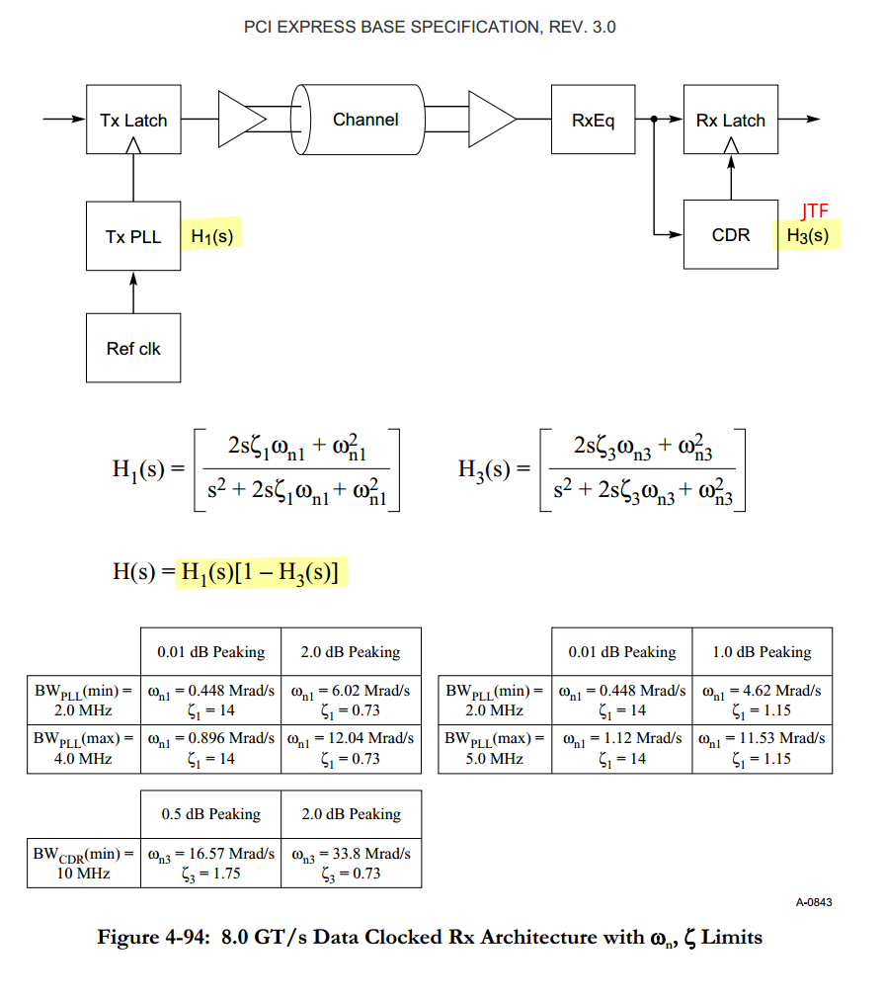


### Separate Reference Clocks with SSC (SRIS) 

> TITLE: Separate Refclk Independent SSC Architecture (SRIS)
> DATE: Updated 10 January 2013
> AFFECTED DOCUMENT: PCI Express Base Spec. Rev. 3.0
> SPONSOR: Intel, HP, AMD

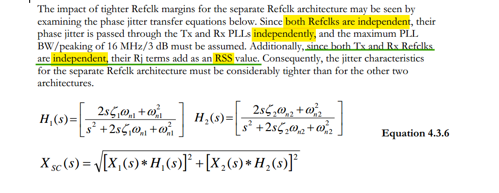
$$\begin{align}
X_{LATCH}(s) &= X_1(s)H_1(s) -  \left[X_1(s)H_1(s)(1-H_3(s)) + X_2(s)H_2(s)H_3(s) \right] \\
& = \left[X_1(s)H_1(s) -X_2(s)H_2(s)\right]H_3(s)
\end{align}$$
where $H_3(s)$ is similar to $NTF_{VCO}$, $1-H_3(s)$ is similar to $NTF_{REF}$


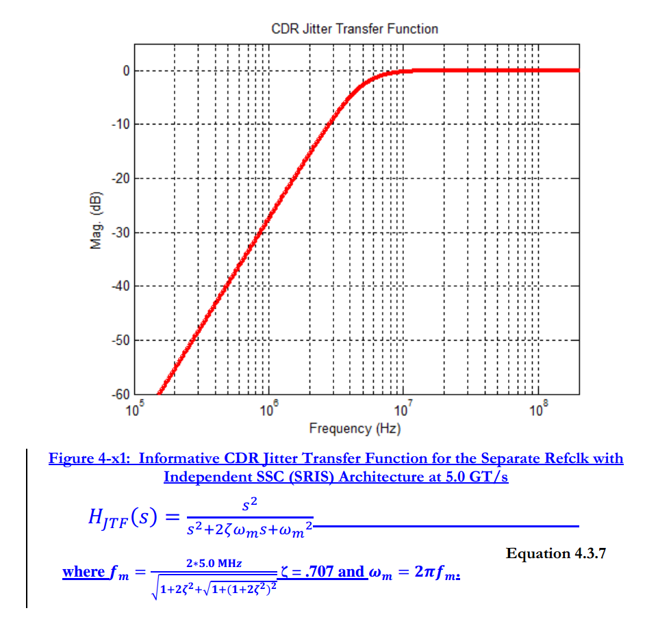


> 
>
> 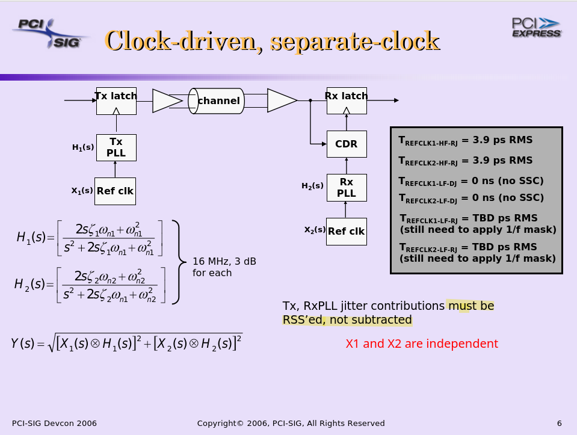

---

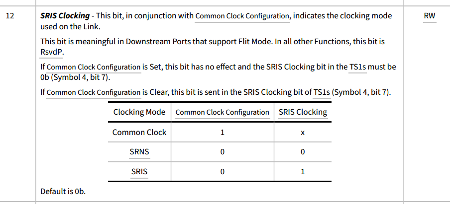

---

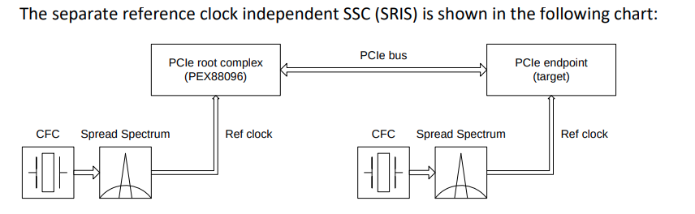

### Separate Reference Clocks with No SSC (SRNS) 

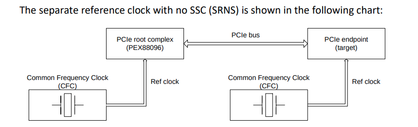


## SSC on digital CDR

> Gerry Talbot, "Impact of SSC on CDR" , April 12th, 2012,  PCI Express EWG

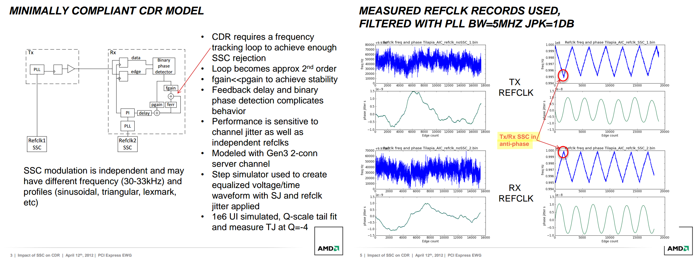


| n     | 0    | 1                    | 2                     | 3                     | ...  |
| ----- | ---- | -------------------- | --------------------- | --------------------- | ---- |
| $A_0$ | $0$  | $k_0\cdot \Delta$    | $k_0\cdot 2\Delta$    | $k_0\cdot 3\Delta$    |      |
| $A_1$ | $0$  | $k_1k_0\cdot \Delta$ | $k_1k_0\cdot 3\Delta$ | $k_1k_0\cdot 6\Delta$ |      |

$$\begin{align}
f[n] &= \frac{A_1[n]-A_1[n-1]}{T} = \frac{k_1\cdot A_0[n]}{T} \\
\Delta f [n] & = \frac{f[n] -f[n-1]}{T} = \frac{k_0k_1\cdot \Delta}{T^2}
\end{align}$$

> the `polyfit` of $f[n]$ is consistent with $\Delta f [n]$

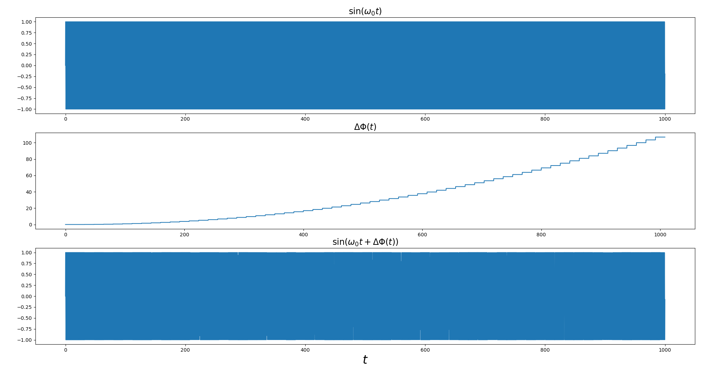

```python
import matplotlib.pyplot as plt
import numpy as np


f0 = 1
fa = f0/16
fs = 32*f0

Mc = 1000
t = np.arange(0, 1/f0*Mc, 1/fs)
phi_raw = 2*np.pi*f0*t
y = np.sin(phi_raw)

plt.figure(figsize=(24,12))
plt.subplot(3, 1, 1)
plt.plot(t, y); plt.title(r'$\sin(\omega_0 t)$', fontsize='xx-large')

k0 = 0.25
k1 = 0.36

A0 = [0]
A1 = [0]
N = int(Mc*fa/f0)
delta = 0.1
dlsb = delta * 2*np.pi

f_deriv_formula = k0*k1*delta*fa**2
print(f'freq derivation by formula = {f_deriv_formula:.3e}')

for i in range(N):
    A1.append(A1[-1] + k1*A0[-1])
    A0.append(A0[-1] + k0*dlsb)


phi_A1 = np.ones((len(A1), int(fs/fa)))
A1_arr  = np.array(A1).reshape((len(A1), 1))
phi_A1 = phi_A1 * A1_arr
phi_A1 = phi_A1.flatten()

t_phi = np.arange(phi_A1.shape[0])*1/fs

plt.subplot(3, 1, 2)
plt.plot(t_phi, phi_A1); plt.title(r'$\Delta \Phi(t)$', fontsize='xx-large')

Ntot = min(t.shape[0], t_phi.shape[0])
t_tot = t_phi[:Ntot]
phi_tot = phi_raw[:Ntot] + phi_A1[:Ntot]
y_tot = np.sin(phi_tot)

phi_tot_deriv1 = (phi_tot[1:] - phi_tot[:-1])*fs/2/np.pi
phi_tot_deriv2 = (phi_tot_deriv1[1:] - phi_tot_deriv1[:-1])*fs

f_deriv_polyfit, _ = np.polyfit(np.arange(phi_tot_deriv1.shape[0])*1/fs, phi_tot_deriv1, 1) # array([3.51305094e-05, 9.99455375e-01])
print(f'freq derivation by polyfit = {f_deriv_polyfit:.3e}')

plt.subplot(3, 1, 3)
plt.plot(t_tot, y_tot); plt.xlabel(r'$t$', fontsize=24); plt.title(r'$\sin(\omega_0 t+\Delta \Phi(t))$', fontsize='xx-large')
plt.show()

y_raw_export = np.zeros((t.shape[0], 2))
y_raw_export[:,0] = t
y_raw_export[:,1] = y

y_tot_export = np.zeros((t.shape[0], 2))
y_tot_export[:,0] = t_tot
y_tot_export[:,1] = y_tot

np.savetxt('y_raw.csv', y_raw_export, delimiter=',')
np.savetxt('y_tot.csv', y_tot_export, delimiter=',')

# freq derivation by formula = 3.516e-05
# freq derivation by polyfit = 3.513e-05
```


## reference

Jason Sachs. Linear Feedback Shift Registers for the Uninitiated, Part XII: Spread-Spectrum Fundamentals [[link](https://www.embeddedrelated.com/showarticle/1124.php)]

Jan Meel, [*Spread Spectrum (SS) — introduction*](http://www.sss-mag.com/pdf/Ss_jme_denayer_intro_print.pdf), De Nayer Instituut, Sint-Katelijne-Waver, Belgium, 1999.

Raymond L. Pickholtz, Donald L. Schilling, Laurence B. Milstein, [*Theory of Spread-Spectrum Communications — A Tutorial*](http://citeseerx.ist.psu.edu/viewdoc/summary?doi=10.1.1.114.208&rank=1), IEEE Transactions on Communications, vol. 30, no. 5, pp. 855-884, May 1982.

Kadeem Samuel. Application Note Clocking for PCIe Applications [[https://www.ti.com/lit/an/snaa386/snaa386.pdf?ts=1756864837383](https://www.ti.com/lit/an/snaa386/snaa386.pdf?ts=1756864837383)]

K. -H. Cheng, C. -L. Hung, C. -H. Chang, Y. -L. Lo, W. -B. Yang and J. -W. Miaw, "A Spread-Spectrum Clock Generator Using Fractional-N PLL Controlled Delta-Sigma Modulator for Serial-ATA III," *2008 11th IEEE Workshop on Design and Diagnostics of Electronic Circuits and Systems*, Bratislava, Slovakia, 2008 [[https://sci-hub.se/10.1109/DDECS.2008.4538758](https://sci-hub.se/10.1109/DDECS.2008.4538758)]

CHUNG-CHUN (CC) CHEN. Why Spread Spectrum Clocking? [[https://youtu.be/_PvwTqaWPo8](https://youtu.be/_PvwTqaWPo8)]

---

Rhee, W. (2020). *Phase-locked frequency generation and clocking : architectures and circuits for modern wireless and wireline systems*. The Institution of Engineering and Technology
