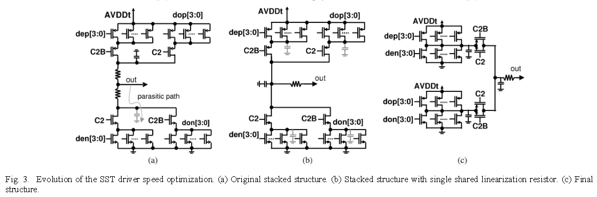

## sharing termination in SST transmitter 

Sharing termination keep a constant current through leg, which improve TX speed in this way.
On the other hand, the sharing termination facilitate drain/source sharing technique in layout.

## pull-up and pull-down resistor

**Original stacked structure**

Pro's:

smaller static current when both pull up and pull down path is on

Con's:

slowly switching due to parasitic capacitance behind pull-up and pull-down resistor

**with single shared linearization resistor**

Pro's:

The parasitic capacitance behind the resistor still exists but is now always driven high or low actively

Con's:

more static current

## reference

Bulzacchelli, J.F. & Menolfi, Christian & Beukema, T.J. & Storaska, D.W. & Hertle, Jürgen & Hanson, D.R. & Hsieh, Ping-Hsuan & Rylov, Sergey & Furrer, Daniel & Gardellini, Daniele & Prati, Andrea & Morf, Thomas & Sharma, Vivek & Kelkar, Ram & Ainspan, H. & Kelly, W.R. & Chieco, L.R. & Ritter, G.A. & Sorice, J.A. & Friedman, D.J.. (2012). A 28-Gb/s 4-Tap FFE/15-Tap DFE Serial Link Transceiver in 32-nm SOI CMOS Technology. Solid-State Circuits, IEEE Journal of. 47. 3232-3248. 10.1109/JSSC.2012.2216414. 