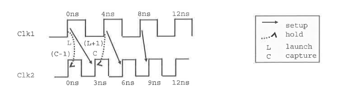
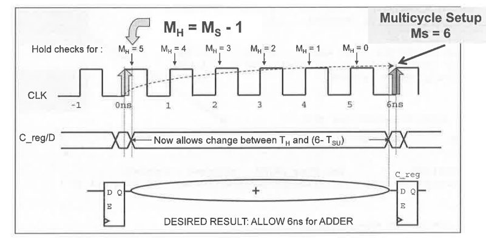

## primary clock, generated clock and virtual clock in SDC

**primary clocks**

- Primary clocks should be created at input ports and output pins of black boxes.
- Never create clocks on hierarchy pins. Creating clocks on hierarchy will cause problems when reading SDF. The net timing arc becomes segmented at the hierarchy and PrimeTime will be unable to annotate the net successfully.

**generated clocks**

- Generated clocks are generally created for waveform modifications of a primary clock (not including simple inversions). PrimeTime does not simulate a design and thus will **not** derive internally generated clocks automatically - these clocks must be created by the user and applied as a constraint.
- PrimeTime caculate source latency for generated clocks if primary clock is **propagated**, otherwise its source latency is zero.

```tcl
# primary clock
create_clock -period 4 [get_ports Clk]
set_clock_latency -source 2 [get_clocks Clk]
set_propagated_clock [get_clocks Clk]
create_generated_clock -divide_by 2 -name div_clk -source [get_ports Clk] FF3/Q
```

**virtual clocks**

- Are clock objects without a source
- Do not clock sequential devices within the current_design
- Serve as references of input or output delays

```tcl
# create a virtual clock, vclk, for input and output delay constraints
create_clock -period 5 -name vclk
set_input_delay -max 2 -clock vclk [get_ports in1]
set_output_delay -max 1 -clock vclk [get_ports out2]
```

> There is **no** network latency to calculate, even if a virtual clock is propagated.


## Clock Edges used for Setup and Hold in PrimeTime

PT picks the most restrictive pair of edges for setup and for hold. It determines which edges to be used as follows:

1. Evaluate waveforms over the smallest common base period

2. For each capture edge, find the closest setup launch edge. Call these the **primary pairs**

3. Out of the **primary pairs**, pick the most restrictive setup launch and capture edges.

4. For each **primary pair**, draw two hold relationships:

   - Launch to (capture - 1)

   - (Launch + 1) to Capture

     From all of these hold relationships, pick the most restrictive.

PrimeTime uses the ideal clock waveform (as reported in `report_clock`) to determine the appropriate clock edges for inter-clock analysis.



> The most restrictive setup pair is from Clk1 8ns to Clk2 9ns
>
> The most restrictive hold pair is from Clk1 0ns to Clk2 0ns


## Multicycle Paths Constraints in PrimeTime

> PrimeTime® User Guide Version O-2018.06-SP4 Chapter 1: Introduction to PrimeTime Overview of Static Timing Analysis - Timing Exceptions

PrimeTime *does not* automatically identifies multicycle paths

### specifying multicycle path for setup

```tcl
set_multicycle_path 6 -from reg[26]/CP -to reg/D
# or
set_multicycle_path -setup 6 -from reg[26]/CP -to reg/D
# check the exception
report_exception
```

### specifying multicycle path for hold (new data every 6 cycles)

```tcl
set_multicycle_path -setup 6 -to [get_pins "*reg[*]/D"]
set_multicycle_path -hold [expr 6-1] -to [get_pins "*reg[*]/D"]
```



M<sub>H</sub> stands for Hold Multiplier, M<sub>S</sub> for Setup Multiplier. The Setup multiplier counts up with increasing clock cycles, the Hold Multiplier counts up with decreasing cycles. The origin (0) for the Hold Multiplier is always at the `Setup Multiplier - 1` position.

### Reporting a multicycle path with report_timing

```tcl
report_timing -exceptions all -from *reg[26]/CP -to *reg/D
```

### Timing Exceptions

If certain paths are **not** intended to operate according to *the default setup and hold behavior
assumed by the PrimeTime tool*, you need to specify those paths as timing exceptions.
Otherwise, the tool might incorrectly report those paths as having timing violations.

The PrimeTime tool lets you specify the following types of exceptions:

- False path – A path that is never sensitized due to the logic configuration, expected data sequence, or operating mode.
- Multicycle path – A path designed to take more than one clock cycle from launch to capture.
- Minimum or maximum delay path – A path that must meet a delay constraint that you explicitly specify as a time value.

