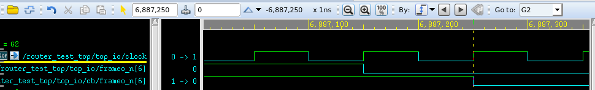

```verilog
@(posedge clk iff(vld));
do_something;
```

is equivalent to

```verilog
forever begin
	@(posedge clk);
    if(vld) break;
end
do_something;
```

> `iff` is more efficient than `if` because the expression is recalculated when `vld` transition rather than `clk`.


One example, detecting the negative edge of `rtr_io.cb.frameo_n[da]`

```verilog
wait(rtr_io.cb.frameo_n[da] !== 0);
@(rtr_io.cb iff(rtr_io.cb.frameo_n[da] === 0 )); 
$display("[DEBUG HGUO] %0t, rtr_io.cb.frameo_n[da] negedge", $realtime);
```



```[DEBUG HGUO] 6887250.0ns, rtr_io.cb.frameo_n[da] negedge```


**reference**

system verilog中的iff, URL: [https://www.francisz.cn/2019/07/18/sv-iff/](https://www.francisz.cn/2019/07/18/sv-iff/)
