## questasim sim flow

> A Short Intro to ModelSim Verilog Simulator [[https://users.ece.cmu.edu/~jhoe/doku/doku.php?id=a_short_intro_to_modelsim_verilog_simulator](https://users.ece.cmu.edu/~jhoe/doku/doku.php?id=a_short_intro_to_modelsim_verilog_simulator)]

```bash
vlib work
vlog -f filelist tb.sv
# "-c": command line mode
vsim -voptargs=+acc -c -do "run 100ns; exit" work.topmodule
```

> `-voptargs=+acc`:  Add the option `-voptargs=+acc` to the *vsim* command, This enables full visibility into every aspect of the design. 


```verilog
module topmodule;
    ...
endmodule
```

**uvm**:

```bash
> vlog test_pkg.sv tb_top.sv -L $QUESTA_HOME/uvm-1.2
> vsim -c -do "run -all;exit" +UVM_TESTNAME=my_test work.tb_top  -L $QUESTA_HOME/uvm-1.2
```


## verilog-mode.el

> Emacs Online Documentation [https://doc.endlessparentheses.com/](https://doc.endlessparentheses.com/)
>
> Emacs verilog-mode 的使用 URL: [https://www.wenhui.space/docs/02-emacs/verilog_mode_useguide/](https://www.wenhui.space/docs/02-emacs/verilog_mode_useguide/)


```bash
emacs --no-site-file --load path/to/verilog-mode.el --batch filename.v -f verilog-auto-save-compile
```

> CAUTION: *filename.v* is **overwrite** by command

### verilog-mode.el

```verilog
/*AUTOINPUT*/
/*AUTOWIRE*/
/*AUTOINST*/
/*AUTO_TEMPLATE*/
```

#### `-f verilog-batch-auto`

> For use with `--batch`, perform automatic expansions as a stand-alone tool. This sets up the appropriate Verilog mode environment, updates automatics with M-x verilog-auto on all command-line files, and saves the buffers.
> For proper results, multiple filenames need to be passed on the command line in bottom-up order.

#### `-f verilog-auto-save-compile`

> Update automatics with M-x verilog-auto, save the buffer, and *compile*


### Emacs

#### `--no-site-file`

Another file for site-customization is `site-start.el`. Emacs loads this *before* the user's init file (`.emacs`, `.emacs.el` or `.emacs.d/.emacs.d`). You can inhibit the loading of this file with the option ``--no-site-file``

#### `--batch`

The command-line option `--batch` causes Emacs to run noninteractively.  The idea is that you specify Lisp programs to run; when they are finished, Emacs should exit.

 `--load, -l FILE`, load Emacs Lisp FILE using the load function; 

`--funcall, -f FUNC`, call Emacs Lisp function FUNC with no arguments

#### `-f FUNC`

`--funcall, -f FUNC`, call Emacs Lisp function FUNC with no arguments

#### `--load, -l FILE`

`--load, -l FILE`, load Emacs Lisp FILE using the load function

> Verilog-mode is a standard part of GNU Emacs as of 22.2.


### multiple directories

**AUTOINST** only search in the file's directory default.

You can append below `verilog-library-directories` for multiple directories search

```
// Local Variables:
// verilog-library-directories:("." "subdir" "subdir2")
// End:
```


## plusargs in Verilog

> systemverilog-command-line-input URL: [https://www.chipverify.com/systemverilog/systemverilog-command-line-input](https://www.chipverify.com/systemverilog/systemverilog-command-line-input)
>
> PLUSARGS IN SYSTEMVERILOG URL:[https://www.theartofverification.com/plusargs-in-systemverilog/](https://www.theartofverification.com/plusargs-in-systemverilog/)


**plusargs** are command-line switches supported by the simulator. As per SystemVerilog LRM arguments beginning with the `+` character will be available using the `$test$plusargs` and `$value$plusargs` **PLI APIs**.

```verilog
$test$plusargs (user_string)

$value$plusargs (user_string, variable)
```

---

```verilog
// tb.v
module tb;
        int a;
        initial begin
                if($test$plusargs("RUNSIM")) begin
                        $display("There is RUNSIM plusargs");
                end else begin
                        $display("There is NO $test$plusargs");
                end
                if($value$plusargs("SEED=%d",a)) begin
                        $display("SEED=%d",a);
                end else begin
                        $display("There is NO $value$plusargs");
                end
        end
endmodule
```

- compile

  ```
  $ vlib work
  $ vlog -sv tb.v
  ```

- simulate (*QuestaSim*)

  - with**out** plusargs

    ```
    $ vsim work.tb -c -do "run; exit"
    ```

    ```
    # //
    # Loading sv_std.std
    # Loading work.tb(fast)
    # run
    # There is NO $test$plusargs
    # There is NO $value$plusargs
    #  exit
    # End time: 13:04:23 on Jun 04,2022, Elapsed time: 0:00:01
    # Errors: 0, Warnings: 0
    ```

  - with plusargs

    ```
    $ vsim work.tb -c -do "run; exit" +SEED=31 +RUNSIM
    ```

    > `+SEED=31 +RUNSIM`

    ```
    # //
    # Loading sv_std.std
    # Loading work.tb(fast)
    # run
    # There is RUNSIM plusargs
    # SEED=         31
    #  exit
    # End time: 13:04:55 on Jun 04,2022, Elapsed time: 0:00:01
    # Errors: 0, Warnings: 0
    ```


## Inertial & transport delays

> [Verilog Nonblocking Assignments With Delays, Myths & Mysteries](http://www.sunburst-design.com/papers/CummingsSNUG2002Boston_NBAwithDelays.pdf)
>
> [Correct Methods For Adding Delays To Verilog Behavioral Models](http://www.sunburst-design.com/papers/CummingsHDLCON1999_BehavioralDelays_Rev1_1.pdf)
>
> Article (20488135) Title: Selecting Different Delay Modes in GLS (RAK)
> URL: [https://support.cadence.com/apex/ArticleAttachmentPortal?id=a1O3w000009bdLyEAI](https://support.cadence.com/apex/ArticleAttachmentPortal?id=a1O3w000009bdLyEAI)
>
> Article (20447759) Title: Gate Level Simulation (GLS): A Quick Guide for Beginners
> URL: [https://support.cadence.com/apex/ArticleAttachmentPortal?id=a1Od0000005xEorEAE](https://support.cadence.com/apex/ArticleAttachmentPortal?id=a1Od0000005xEorEAE)


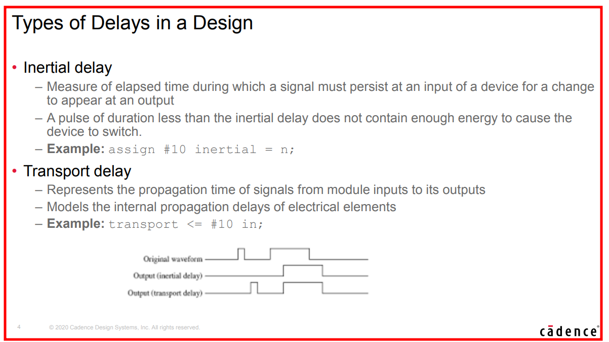

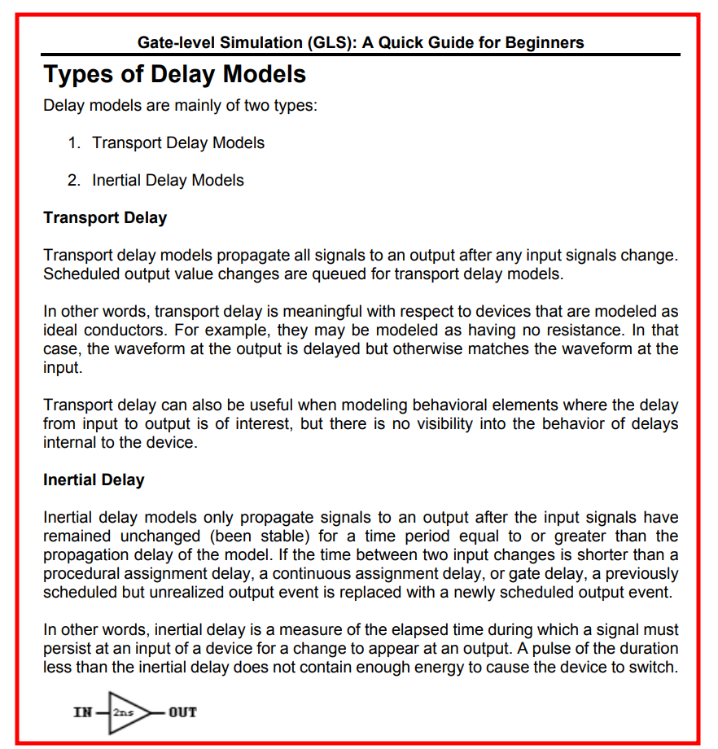


### Inertial delay

Inertial delay models are simulation delay models that filter pulses that are shorted than the propagation delay of **Verilog gate primitives** or **continuous assignments** (`assign #5 y = ~a;`)

​													**COMBINATIONAL LOGIC ONLY !!!**

> - Inertial delays swallow glitches
> - **sequential logic** implemented with **procedure assignments** DON'T follow the rule

#### continuous assignments

```verilog
`timescale 1ns/100ps
module tb;

	reg in;
/////////////////////////////////////////////////////
	wire out;
	assign #2.5 out = in;
/////////////////////////////////////////////////////
	initial begin
		in = 0;
		#16;
		in = 1;
		#2;
		in = 0;
		#10;
		in = 1;
		#4;
		in = 0;
	end

	initial begin
		#50;
		$finish();
	end

endmodule
```


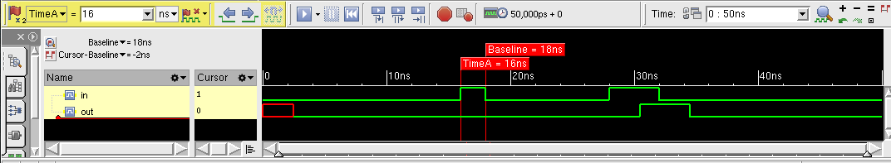

#### procedure assignment - combinational logic

```verilog
`timescale 1ns/100ps
module tb;

	reg in;
	reg out;

//////////// combination logic ////////////////////////
	always @(*)
		#2.5 out = in;
///////////////////////////////////////////////////////
/* the above code is same with following code
    	always @(*) begin
			#2.5;
			out = in;
		end
*/
	initial begin
		in = 0;
		#16;
		in = 1;
		#2;
		in = 0;
		#10;
		in = 1;
		#4;
		in = 0;
	end

	initial begin
		#50;
		$finish();
	end

endmodule
```

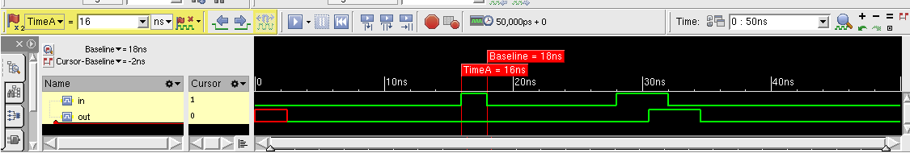

#### procedure assignment - sequential logic

```verilog
`timescale 1ns/100ps
module tb;
	reg clk;

	reg in;
	reg out;

	always begin
		clk = 0;
		#5;
		forever begin
			clk = ~clk;
			#5;
		end
	end
//////////// sequential logic //////////////////
	always @(posedge clk)
		#2.5 out <= in;
///////////////////////////////////////////////
	initial begin
		in = 0;
		#16;
		in = 1;
		#2;
		in = 0;
		#10;
		in = 1;
	end

	initial begin
		#50;
		$finish();
	end

endmodule
```

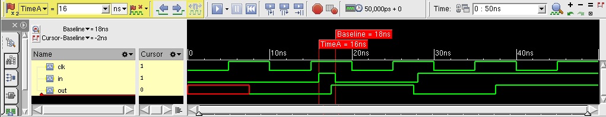

> As shown above, sequential logic DON'T follow inertial delay


### Transport delay

Transport delay models are simulation delay models that pass all pulses, including pulses that are shorter than the propagation delay of corresponding **Verilog procedural assignments**

> - Transport delays pass glitches, delayed in time
> - Verilog can model RTL transport delays by adding **explicit delays to the right-hand-side (RHS) of a nonblocking assignment**

```verilog
always @(*)
    y <= #5 ~a;
```

#### nonblocking assignment

```verilog
`timescale 1ns/100ps
module tb;

	reg in;
	reg out;
/////////////// nonblocking assignment ///
	always @(*) begin
		out <= #2.5 in;
	end
/////////////////////////////////////////
	initial begin
		in = 0;
		#16;
		in = 1;
		#2;
		in = 0;
		#10;
		in = 1;
		#4;
		in = 0;
	end

	initial begin
		#50;
		$finish();
	end

endmodule
```

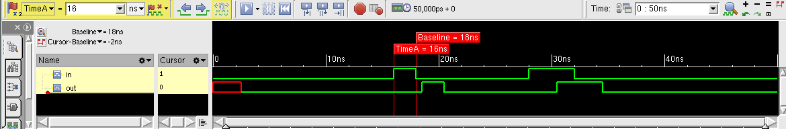


#### blocking assignment

```verilog
`timescale 1ns/100ps
module tb;

	reg in;
	reg out;
/////////////// blocking assignment ///
	always @(*) begin
		out = #2.5 in;
	end
/////////////////////////////////////////
	initial begin
		in = 0;
		#16;
		in = 1;
		#2;
		in = 0;
		#10;
		in = 1;
		#4;
		in = 0;
	end

	initial begin
		#50;
		$finish();
	end

endmodule
```

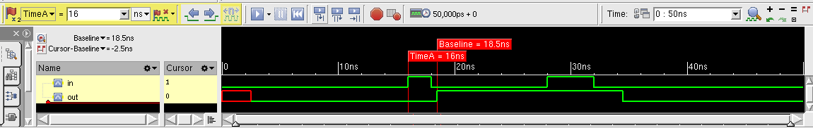

> It seems that new event is **discarded** before previous event is realized.


## clocking block in SystemVerilog

> Assignment at \<interface\>.\<clocking block\>.\<output signal\> (i.e. synchronous) do **NOT** change \<interface\>.\<output signal\> until active clock edge.

 

```verilog
// router_io.sv

interface router_io(input bit clock);
  logic    reset_n;
  logic [15:0]  din;
  logic [15:0]  frame_n;
  logic [15:0]  valid_n;
  logic [15:0]  dout;
  logic [15:0]  valido_n;
  logic [15:0]  busy_n;
  logic [15:0]  frameo_n;

  clocking cb @(posedge clock);
    default input #1ns output #1ns;
    output reset_n;
    output din;
    output frame_n;
    output valid_n;
    input  dout;
    input  valido_n;
    input  frameo_n;
    input  busy_n;
  endclocking: cb
  
  // `reset_n` can be either a synchronous or an asynchronous signal
  modport TB(clocking cb, output reset_n);

endinterface: router_io
```

> All interface signals are asynchronous and without a direction spection (i.e. input, output, inout). 
>
> - The direction can only be specified in `clocking` block for **synchronous signals**
> - or a `modport` for **asynchronous signals**
>
> All directions for the signals in the clocking block must be with respect to the test program;


```verilog
// test.sv

program automatic test(router_io.TB rtr_io);

  initial begin
    reset();
  end
    
  task reset();
    rtr_io.reset_n = 1'b0;
    rtr_io.cb.frame_n <= '1;
    rtr_io.cb.valid_n <= '1;
    repeat(2) @rtr_io.cb;
    rtr_io.cb.reset_n <= 1'b1;
    repeat(15) @(rtr_io.cb);
  endtask: reset

endprogram: test
```

```verilog
// router_test_top.sv

`timescale 1ns/100ps

module router_test_top;
  parameter simulation_cycle = 100;

  bit SystemClock = 0;

  router_io top_io(SystemClock);
  test t(top_io);

  router dut(
    .reset_n  (top_io.reset_n),
    .clock    (top_io.clock),
    .din    (top_io.din),
    .frame_n  (top_io.frame_n),
    .valid_n  (top_io.valid_n),
    .dout    (top_io.dout),
    .valido_n  (top_io.valido_n),
    .busy_n    (top_io.busy_n),
    .frameo_n  (top_io.frameo_n)
  );

  initial begin
    $timeformat(-9, 1, "ns", 10);
    $fsdbDumpvars;
  end

  always begin
    #(simulation_cycle/2) SystemClock = ~SystemClock;
  end

endmodule
```

**compile**:

```
$ vcs -sverilog -full64 -kdb -debug_access+all router_test_top.sv test.sv router_io
.sv ../../rtl/router.v
```

> file with ``timescale` must be placed in the first, which is `router_test_top.sv` in above example


### clocking.output

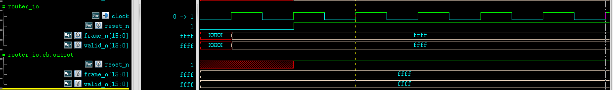

> systemverilog don't pass clocking.output to interface's until current or next active edge and after output-skew 


### clocking.input

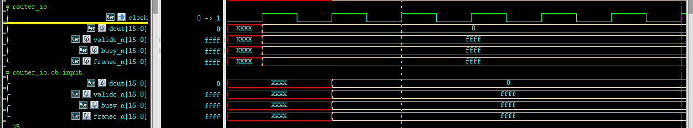

> Systemverilog **automatically** update clocking.input signal from interface's value, input-skew before active edge


### Gotcha

An `interface` must be compiled separately like a `module` and CANNOT ``include` inside a `package` or ohter `module`


## Cadence EE_pkg 101

### What Is Real Number Modeling?

- model analog blocks operation as signal flow model
- only the digital solver is used for high-speed simulation
  - Event-driven
  - No convergence issues, because no analog solver is used
- Five different language standards support real number modeling:
  - **wreal** (wired-real) ports in Verilog-AMS
  - **real** data type in VHDL
  - **real** data type in Verilog
  - **real** variables and **nettypes** in SystemVerilog (SV)
  - **real** types in e

### Benefits of RNM

- Most analog circuits that need to be modeled for MS verification at the SoC level can be described in terms of real-valued voltages or currents
- RNM is a mixed approach, borrowing concepts from both continuous and discrete domains
  - The values are floating-point (real) number.
  - Time is discrete; the real signals change values based on discrete events
- Applicability of RNM is bounded primarily by **signal-flow** model style
- Migrating analog behavior from the analog domain to the event or pseudo-analog domain can bring huge benefits without sacrificing too much accuracy
- Simulation is executed by a digital simulation engine without need for the analog solver
- Hence real-number modeling enables very high performance simulation of mixed-signal systems


### Limitations of RNM

- connecting **real** or **wreal** signals to electrical signals requires careful consideration
  - Too conservative an approach can lead to large numbers of timepoints
  - Too liberal an approach can lead to losing signal accuracy
- Time accuracy limited by the discrete sampling approach and the ``timescale` setting - no continuous signals anymore
- Limited capability for combination of signals by wiring outputs together
  - Requires assumptions about impedances to do simple merging


## constant part-select and indexed part-select in Verilog

> Verilog scalar and vector [[link](https://www.chipverify.com/verilog/verilog-scalar-vector#:~:text=Part-selects,with%20an%20indexed%20part-select.&text=Having%20a%20variable%20part-select,select%20parts%20of%20the%20vector.)]
>
> What is the "+:" operator called in Verilog? [[link](https://electronics.stackexchange.com/questions/74277/what-is-the-operator-called-in-verilog)]

A range of contiguous bits can be selected and is known as **part-select**. There are two types of part-selects, one with a **constant part-select** and another with an **indexed part-select**

```verilog
reg [31:0] addr;
addr [23:16] = 8'h23; //bits 23 to 16 will be replaced by the new value 'h23 -> constant part-select
```

Having a variable part-select allows it to be used effectively in loops to select parts of the vector. Although the starting bit can be **varied**, the width has to be **constant**.

> **[<start_bit +: <width>]	// part-select increments from start-bit**
>
> **[<start_bit -: <width>]	// part-select decrements from start-bit**


**Example**

```verilog
logic [31: 0] a_vect;
logic [0 :31] b_vect;

logic [63: 0] dword;
integer sel;

a_vect[ 0 +: 8] // == a_vect[ 7 : 0]
a_vect[15 -: 8] // == a_vect[15 : 8]
b_vect[ 0 +: 8] // == b_vect[0 : 7]
b_vect[15 -: 8] // == b_vect[8 :15]

dword[8*sel +: 8] // variable part-select with fixed width
```


## Mixing Signed and Unsigned in Verilog

> Bevan Baas, VLSI Digital Signal Processing, EEC 281 - VLSI Digital Signal Processing [[https://www.ece.ucdavis.edu/~bbaas/281/](https://www.ece.ucdavis.edu/~bbaas/281/)]

Sign Extension

1) Calculate the necessary minimum width of the sum so that it contains all input possibilities
2) Extend the inputs' sign bits to the width of the answer
3) Add as usual
4) Ignore bits that ripple to the left of the answer's MSB

1. **signed**

|               | inA (signed) | inB (signed) | outSum<br />(signed/unsigned) |
| ------------- | ------------ | ------------ | ----------------------------- |
|               | 0101 (5)     | 1111 (-1)    |                               |
| *extend sign* | **0**0101    | **1**1111    |                               |
| *sum result*  |              |              | 00100                         |
```verilog
module tb;
	reg signed [3:0] inA;
	reg signed [3:0] inB;
    reg signed [4:0] outSumSg;	// signed result
    reg [4:0] outSumUs;			// unsigned result

	initial begin
		inA = 4'b0101;
		inB = 4'b1111;
		outSumUs = inA + inB;
		outSumSg = inA + inB;

		$display("signed out(%%d): %0d", outSumSg);
		$display("signed out(%%b): %b", outSumSg);

		$display("unsigned out(%%d): %0d", outSumUs);
		$display("unsigned out(%%b): %b", outSumUs);
	end
endmodule
```
2. **mixed**

|               | inA (signed) | inB (unsigned) | outSum<br />(signed/unsigned) |
| ------------- | ------------ | -------------- | ----------------------------- |
|               | 0101 (5)     | 1111 (15)      |                               |
| *extend sign* | **0**0101    | **0**1111      |                               |
| *sum result*  |              |                | 10100                         |
```verilog
reg signed [3:0] inA;
reg [3:0] inB;
```
|               | inA (unsigned) | inB (signed) | outSum<br />(signed/unsigned) |
| ------------- | -------------- | ------------ | ----------------------------- |
|               | 0101 (5)       | 1111 (-1)    |                               |
| *extend sign* | **0**0101      | **0**1111    |                               |
| *sum result*  |                |              | 10100                         |

```verilog
module tb;
	reg [3:0] inA;
	reg signed [3:0] inB;
	reg signed [4:0] outSumSg;
	reg [4:0] outSumUs;

	initial begin
		inA = 4'b0101;
		inB = 4'b1111;
		outSumUs = inA + inB;
		outSumSg = inA + inB;

		$display("signed out(%%d): %0d", outSumSg);
		$display("signed out(%%b): %b", outSumSg);

		$display("unsigned out(%%d): %0d", outSumUs);
		$display("unsigned out(%%b): %b", outSumUs);
	end
endmodule
```

**xcelium**

```
xcelium> run
signed out(%d): -12
signed out(%b): 10100
unsigned out(%d): 20
unsigned out(%b): 10100
xmsim: *W,RNQUIE: Simulation is complete.
xcelium> exit
```

**vcs**

```
Compiler version S-2021.09-SP2-1_Full64; Runtime version S-2021.09-SP2-1_Full64;  May  7 17:24 2022
signed out(%d): -12
signed out(%b): 10100
unsigned out(%d): 20
unsigned out(%b): 10100
           V C S   S i m u l a t i o n   R e p o r t
```

### observation

> When *signed* and *unsigned* is **mixed**, the result is by default **unsigned**. 
>
> Prepend to operands with **0**s instead of extending sign, even though the operands is signed
>
> LHS **DONT** affect how the simulator operate on the operands but what the results represent, signed or unsigned


Therefore, although `outSumUs` is declared as signed, its result is unsigned

#### subtraction example

In logic arithmetic, addition and subtraction are commonly used for digital design. Subtraction is similar to addition except that the subtracted number is 2's complement. By using 2's complement for the subtracted number, both addition and subtraction can be unified to using addition only.

##### operands are signed

|               | inA (signed) | inB (signed) | outSub<br />(signed/unsigned) |
| ------------- | ------------ | ------------ | ----------------------------- |
|               | 1111 (-1)    | 0010 (2)     |                               |
| *extend sign* | **1**1111    | **0**0010    |                               |
| *sub result*  |              |              | 11101                         |

```verilog
module tb;
	reg signed [3:0] inA;
	reg signed [3:0] inB;
	reg signed [4:0] outSubSg;
	reg [4:0] outSubUs;

	initial begin
		inA = 4'b1111;
		inB = 4'b0010;
		outSubUs = inA - inB;
		outSubSg = inA - inB;

		$display("signed out(%%d): %0d", outSubSg);
		$display("signed out(%%b): %b", outSubSg);

		$display("unsigned out(%%d): %0d", outSubUs);
		$display("unsigned out(%%b): %b", outSubUs);
	end
endmodule
```

```
Compiler version S-2021.09-SP2-1_Full64; Runtime version S-2021.09-SP2-1_Full64;  May  7 17:46 2022
signed out(%d): -3
signed out(%b): 11101
unsigned out(%d): 29
unsigned out(%b): 11101
           V C S   S i m u l a t i o n   R e p o r t
```

```
xcelium> run
signed out(%d): -3
signed out(%b): 11101
unsigned out(%d): 29
unsigned out(%b): 11101
xmsim: *W,RNQUIE: Simulation is complete.
```

##### operands are mixed

|               | inA (signed) | inB (unsigned) | outSub<br />(signed/unsigned) |
| ------------- | ------------ | -------------- | ----------------------------- |
|               | 1111 (-1)    | 0010 (2)       |                               |
| *extend sign* | **0**1111    | **0**0010      |                               |
| *sub result*  |              |                | 01101                         |

```verilog
module tb;
	reg signed [3:0] inA;
	reg [3:0] inB;
	reg signed [4:0] outSubSg;
	reg [4:0] outSubUs;

	initial begin
		inA = 4'b1111;
		inB = 4'b0010;
		outSubUs = inA - inB;
		outSubSg = inA - inB;

		$display("signed out(%%d): %0d", outSubSg);
		$display("signed out(%%b): %b", outSubSg);

		$display("unsigned out(%%d): %0d", outSubUs);
		$display("unsigned out(%%b): %b", outSubUs);
	end
endmodule
```

```
Compiler version S-2021.09-SP2-1_Full64; Runtime version S-2021.09-SP2-1_Full64;  May  7 17:50 2022
signed out(%d): 13
signed out(%b): 01101
unsigned out(%d): 13
unsigned out(%b): 01101
           V C S   S i m u l a t i o n   R e p o r t 
```

```
xcelium> run
signed out(%d): 13
signed out(%b): 01101
unsigned out(%d): 13
unsigned out(%b): 01101
xmsim: *W,RNQUIE: Simulation is complete.
xcelium> exit
```


### Danger Sign

[https://projectf.io/posts/numbers-in-verilog/](https://projectf.io/posts/numbers-in-verilog/)

> Verilog has a nasty habit of treating everything as unsigned unless all variables in an expression are signed. To add insult to injury, most tools won’t warn you if signed values are being ignored.
>
> If you take one thing away from this post:
>
> **Never mix signed and unsigned variables in one expression!**

```verilog
module signed_tb ();
    logic [7:0] x;  // 'x' is unsigned
    logic signed [7:0] y;  // 'y' is signed
    logic signed [7:0] x1, y1;
    logic signed [3:0] move;

    always_comb begin
        x1 = x + move;  // !? DANGER: 'x' is unsigned but 'move' is signed
        y1 = y + move;
    end

    initial begin
        #10
        $display("Coordinates (7,7):");
        x = 8'd7;
        y = 8'd7;
        #10
        $display("x : %b  %d", x, x);
        $display("y : %b  %d", y, y);

        #10
        $display("Move +4:");
        move = 4'sd4;  // signed positive value
        #10
        $display("x1: %b  %d  *LOOKS OK*", x1, x1);
        $display("y1: %b  %d", y1, y1);

        #10
        $display("Move -4:");
        move = -4'sd4;  // signed negative value
        #10
        $display("x1: %b  %d  *SURPRISE*", x1, x1);     // 0000_0111 + {0000}_1100 = 0001_0011
        $display("y1: %b  %d", y1, y1);                 // 0000_0111 + {1111}_1100 = 0000_0011
    end
endmodule
```

```
Chronologic VCS simulator copyright 1991-2021
Contains Synopsys proprietary information.
Compiler version S-2021.09-SP2-2_Full64; Runtime version S-2021.09-SP2-2_Full64;  Nov 19 11:02 2022                                     
Coordinates (7,7):
x : 00000111    7
y : 00000111            7
Move +4:
x1: 00001011           11  *LOOKS OK*
y1: 00001011           11
Move -4:
x1: 00010011           19  *SURPRISE*
y1: 00000011            3
           V C S   S i m u l a t i o n   R e p o r t
Time: 60
CPU Time:      0.260 seconds;       Data structure size:   0.0Mb
```


## time format in Verilog

> [https://verificationacademy.com/forums/systemverilog/time-vs-realtime#answer-94062](https://verificationacademy.com/forums/systemverilog/time-vs-realtime#answer-94062)
> [https://verificationacademy.com/forums/systemverilog/time-vs-realtime#answer-94096](https://verificationacademy.com/forums/systemverilog/time-vs-realtime#answer-94096)


### realtime vs time

- `$realtime` round the current time to `timeprecision`

- `$time` round the current time to integer

- `%t` will scale the rounded value to represent `timeprecision`,

  i.e.  $[\$\text{realtime}, \$\text{time}]\cdot \$\text{timeunit} / \$\text{timeprecision}$


```verilog
module tb;
  timeunit 10ns;
  timeprecision 1ps;

  initial begin
    $display("$realtime = %g", $realtime);
    $display("$time = %g", $time);
    // $realtime round to timeprecision
    // $time round to integer
    #1.10016
    $display("$realtime = %g", $realtime);
    $display("$time = %g", $time);

    // %t format will scale the rounded value to represent timeprecision
    // 1.1002*10e-9/1e-12 = 11002
    $display("$realtime %%t = %t", $realtime);
    $display("$time %%t = %t", $time);
  end
endmodule
```

output

```
  $realtime = 0
  $time = 0
  $realtime = 1.1002
  $time = 1
  $realtime %t =                11002
  $time %t =                10000
```

### timeunit, timeprecision

The time unit and time precision can be specified in the following two ways:

- Using the compiler directive `` `timescale``
- Using the keywords `timeunit` and `timeprecision`

```verilog
module D (...);
  timeunit 100ps;
  timeprecision 10fs;
  ...
endmodule

module E (...);
  timeunit 100ps / 10fs; // timeunit with optional second argument
  ...
endmodule
```

The minimum of `timeprecision` determine `%t` output, the nearest `timeunit` and `timeprecision` determine
the round of `$realtime` and `$time`. Of course, the simulator follow the time tick shown by `$realtime`.

```verilog
`timescale 1ns/1ns

// Due to minimum of timeprecision is 10ps
module rawplant;
  timeunit 1ns;
  timeprecision 100ps;

  task print;
    /*
    1ns: 1
    100ps:  6
    10ps: 6
    1ps: 6
    */
    #1.666
    $display("raw: $realtime = %g", $realtime);     // 1.7
    $display("raw: $time = %g", $time);             // 2
    $display("raw: $realtime %%t = %t", $realtime); // 1.7*1ns/10ps=170
    $display("raw: $time %%t = %t", $time);         // 2*1ns/10ps = 200
  endtask

endmodule

module fineplant;
  timeunit 100ps;
  timeprecision 10ps;

  task print;
    /*
    100ps: 2
    10ps: 6
    1ps: 6
    */
    #2.66
    $display("fine: $realtime = %g", $realtime);     // 2.7
    $display("fine: $time = %g", $time);             // 3
    $display("fine: $realtime %%t = %t", $realtime); // 2.7*100ps/10ps = 27
    $display("fine: $time %%t = %t", $time);         // 3*100ps/10ps = 30
  endtask

endmodule

module tb;
  rawplant rawblock();
  fineplant fineblock();

  initial begin
  fork
    rawblock.print();
    fineblock.print();
  join
  end
endmodule
```

output

```
fine: $realtime = 2.7
fine: $time = 3
fine: $realtime %t =                   27
fine: $time %t =                   30
raw: $realtime = 1.7
raw: $time = 2
raw: $realtime %t =                  170
raw: $time %t =                  200
```


### questasim cmd

```bash
vlib work
vlog tb.v
vsim -c -do "run -all;exit" work.tb
```


## data dumping of simulation

> `$dumpvars` and `$dumpfile` Verilog, [[http://www.referencedesigner.com/tutorials/verilog/verilog_62.php](http://www.referencedesigner.com/tutorials/verilog/verilog_62.php)]

### FSDB

#### `$fsdbDumpfile`

It specifies the FSDB file name created by the Novas object files for FSDB dumping. If it is not specified, then the default FSDB file name is "novas.fsdb".

> This command is valid only **before** executing `$fsdbDumpvars` and is ignored if specified after `$fsdbDumpvars`


#### `$fsdbSuppress`

The `fsdbSuppress `utility is used to skip dumping of few instances, scopes, modules and signals. The `fsdbSuppress `utility is a system task like other fsdb tasks.

> For `$fsdbSuppress()` to be effective, it needs to be specified/called **before** `$fsdbDumpvars`


#### `$fsdbAutoSwitchDumpfile`

Automatically switch to a new dump file when the working FSDB file reaches the specified size or the specified wall time period.

> After the dumping is finished, a **virtual FSDB file (\*.vf)** is automatically created and list all of the generated FSDB files with the correct sequence. Only the **virtual FSDB file**, rather than all of the FSDB files, needs to be loaded to view the simulation results

When specified in the design to switch based on **file size**:

```
$fsdbAutoSwitchDumpfile(File_Size | File_Size_var, "FSDB_Name" |FSDB_Name_var, Number_of_Files | Number_of_Files_var[ ,"log_filename" | ,log_filename_var ], ["+no_overwrite"]);
```

When specified in the design to switch based on **time period**

```
$fsdbAutoSwitchDumpfile(File_Size | File_Size_var, "FSDB_Name" |FSDB_Name_var, Number_of_Files | Number_of_Files_var[ ,"log_filename" | ,log_filename_var ], ["+no_overwrite"], “+by_period”);
```

> `“+by_period”`


#### `$fsdbDumpvars`

This command dumps the change in signal value to the FSDB file.

```
$fsdbDumpvars([ depth, | "level=",depth_var, ],[instance | "instance=",instance_var])
```

> For VCS users, to include memory, MDA, packed array and structure information in the generated FSDB file, the `-debug_access` option must be included when VCS is invoked to **compile the design**

- `depth`

  Specify how many sub-scope levels under the given scope you want to dump.

  - Specify this argument as **1** to dump the signals under the given scope
  - Specify this argument as **0** to dump all signals under the given scope and its descendant scopes.

  0: all signals in all scopes.

  1: all signals in current scope.

  2: all signals in the current scope and all scopes one level below.

  n: all signals in the current scope and all scopes n-1 levels below.

  |                             | tb.clk  | tb.u_div2.div2 | tb.u_div2.u_div2neg.div2neg |
  | --------------------------- | ------- | -------------- | --------------------------- |
  | $fsdbDumpvars(0)            | &check; | &check;        | &check;                     |
  | $fsdbDumpvars(1)            | &check; | &cross;        | &cross;                     |
  | $fsdbDumpvars(2)            | &check; | &check;        | &cross;                     |
  | $fsdbDumpvars(1, tb.u_div2) | &cross; | &check;        | &cross;                     |
  | $fsdbDumpvars(0, tb.u_div2) | &cross; | &check;        | &check;                     |

  ```verilog
  module tb;
  	reg clk;
  
  	divider2 u_div2(clk);
  
  	initial begin
  		clk = 1'b0;
  		forever #5 clk = ~clk;
  	end
  
  	initial begin
  		#100;
  		$finish();
  	end
  
  	initial begin
  		 #10;
  		 $fsdbDumpfile("tb.fsdb");
  		 //$fsdbDumpvars(0);				// same with $fsdbDumpvars(0, tb)
  		 //$fsdbDumpvars(1);				// same with $fsdbDumpvars(1, tb)
  		 //$fsdbDumpvars(2);				// same with $fsdbDumpvars(2, tb)
  		 //$fsdbDumpvars(1, tb.u_div2);
  		 $fsdbDumpvars(0, tb.u_div2);
  		 #80 $finish();
  	end
  
  endmodule


  module divider2 (
  	input clk
  );
  	reg div2;

  	divider2neg u_div2neg(div2);
  	
  	always@(posedge clk) begin
  		div2 = ~div2;
  	end
  	
  	initial begin
  		div2 = 1'b0;
  	end

  endmodule

  module divider2neg (
  	input clk
  );
  	reg div2neg;

  	always@(negedge clk) begin
  		div2neg = ~div2neg;
  	end
  	
  	initial begin
  		div2neg= 1'b0;
  	end

  endmodule
  ```
  *compile*
  ```
  vcs -full64 -kdb -debug_access+all tb.v
  ```

  *simulate*

  ```
  ./simv
  ```

  *load fsdb*

  ```
  verdi -ssf tb.fsdb
  ```

  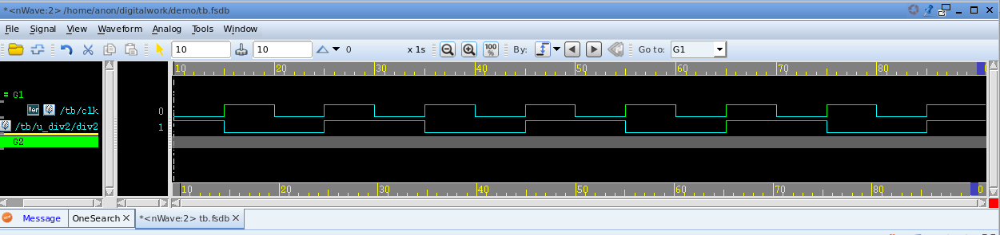

#### `$fsdbDumpon, $fsdbDumpoff`

```verilog
$fsdbDumpon(["+fsdbfile+filename"])

$fsdbDumpoff(["+fsdbfile+filename"])
  ```

These FSDB dumping commands turn dumping on and off. `fsdbDumpon/fsdbDumpoff` has the highest priority and overrides all other FSDB dumping commands.

`fsdbDumpon/fsdbDumpoff` is not restricted to only `fsdbDumpvars`. If there is more than one FSDB file open for dumping at one simulation run, `fsdbDumpon/fsdbDumpoff` may only affect a specific FSDB file by specifying the specific file name.

- `+fsdbfile+filename`: Specify the FSDB file name. If not specified, the default FSDB file name is "novas.fsdb"

#### `$fsdbDumpFinish`

This command closes all FSDB files in the current simulation and stops dumping of signals. Although all FSDB files are *closed automatically at the end of simulation*, this dumping command can be invoked to *explicitly* close the FSDB files during the simulation

### VCD

#### `$dumpfile`

The declaration onf `$dumpfile` must come before the `$dumpvars` or any other system tasks that specifies dump.

```verilog
$dumpfile("test.vcd");
```

> argument **is necessary**, there is no default value

#### `$dumpvars`

The `$dumpvars` is used to specify which variables are to be dumped ( in the file mentioned by `$dumpfile`). The simplest way to use it is without any argument.

```verilog
$dumpvars(<levels> <, <module_or_variable>>* );
```

#### `$dumplimit`

It is possible that you inadvertantly generate huge file in Gigabytes ( for examples while dumping a Gigahertz clock for one second). To reduce such occurrences, we may use `$dumplimit`. It usage is

```verilog
$dumplimit(<filesize>);
```

#### `$dumpoff and $dumpon`

During the simulation if you are bothered about about only during a certain interval then you can use `$dumpoff` and `$dumpon`. The following example shows its usage. It will dump the changes for first 100 units of time and then between 10200 and 10400 units of time.

```verilog
initial
    $monitor($time, " reset=%b,clk_out=%b",reset,clk_out);
    initial begin
            $dumpfile("clkdiv2n_tb.vcd");
            $dumpvars(0,clkdiv2n_tb);
            #100;
            $dumpoff;
            #10200;
            $dumpon;
            #10400;
            $dumpoff;
    end
```

#### demo

stimulus.v

```verilog
`timescale 1ns / 1ps
module stimulus;
	// Inputs
	reg x;
	reg y;
	// Outputs
	wire z;
	// Instantiate the Unit Under Test (UUT)
	comparator uut (
		.x(x),
		.y(y),
		.z(z)
	);

	initial begin
		$dumpfile("test.vcd");
		$dumpvars(0);
		// Initialize Inputs
		x = 0;
		y = 0;

		#20 x = 1;
		#20 y = 1;
		#20 y = 0;
		#20 x = 1;
		#40 ;

	end

	initial begin
		$monitor("t=%3d x=%d,y=%d,z=%d \n",$time,x,y,z, );
	end

endmodule
```


comparator.v

```verilog
module comparator(
	input x,
	input y,
	output z
);

	assign z = (~x & ~y) |(x & y);

endmodule
```

```
$ xrun stimulus.v comparator.v -access +rwc
$ simvision test.vcd
```


## readmemb & readmemh in Verilog

> Initialize Memory in Verilog [[https://projectf.io/posts/initialize-memory-in-verilog/](https://projectf.io/posts/initialize-memory-in-verilog/)]


**`$readmemh("hex_memory_file.mem", memory_array, [start_address], [end_address])`**
**`$readmemb("bin_memory_file.mem", memory_array, [start_address], [end_address])`**

The system task has no versions to accept octal data or decimal data.

- The 1st argument is the data file name.
- The 2nd argument is the array to receive the data.
- The 3rd argument is an optional start address, and if you provide it, you can also provide
- The 4th argument optional end address.

Note, the 3rd and 4th argument address is for array not data file.

If the memory addresses are not specified anywhere, then the system tasks load file data sequentially  from the lowest address toward the highest address. 

> The standard before 2005 specify that the system tasks load file data sequentially
> from the left memory address bound to the right memory address bound.

**readtest.v**

```verilog
module readfile;
	reg [7:0] array4 [0:3];
	reg [7:0] array7 [6:0];
	reg [7:0] array12 [11:0];

	integer i;

	initial begin
		$readmemb("data.txt", array4);
		$readmemb("data.txt", array7, 2, 5);
		$readmemb("data.txt", array12);

		for (i = 0; i < 4; i = i+1)
			$display("array4[%0d] = %b", i, array4[i]);

		$display("=========================");

		for (i = 0; i < 7; i = i+1)
			$display("array7[%0d] = %b", i, array7[i]);

		$display("=========================");

		for (i = 0; i < 12; i = i+1)
			$display("array12[%0d] = %b", i, array12[i]);
	end
endmodule
```

**data.txt**

```
00000000 
00000001
00000010
00000011
00000100
00000101
00000110
00001000
```

**result**

```
array4[0] = 00000000
array4[1] = 00000001
array4[2] = 00000010
array4[3] = 00000011
=========================
array7[0] = xxxxxxxx
array7[1] = xxxxxxxx
array7[2] = 00000000
array7[3] = 00000001
array7[4] = 00000010
array7[5] = 00000011
array7[6] = xxxxxxxx
=========================
array12[0] = 00000000
array12[1] = 00000001
array12[2] = 00000010
array12[3] = 00000011
array12[4] = 00000100
array12[5] = 00000101
array12[6] = 00000110
array12[7] = 00001000
array12[8] = xxxxxxxx
array12[9] = xxxxxxxx
array12[10] = xxxxxxxx
array12[11] = xxxxxxxx
```


## iff in SystemVerilog

> system verilog中的iff, [[https://www.francisz.cn/2019/07/18/sv-iff](https://www.francisz.cn/2019/07/18/sv-iff)]

```verilog
@(posedge clk iff(vld));
do_something;
```

is equivalent to

```verilog
forever begin
	@(posedge clk);
    if(vld) break;
end
do_something;
```

> `iff` is more efficient than `if` because the expression is recalculated when `vld` transition rather than `clk`.


One example, detecting the negative edge of `rtr_io.cb.frameo_n[da]`

```verilog
wait(rtr_io.cb.frameo_n[da] !== 0);
@(rtr_io.cb iff(rtr_io.cb.frameo_n[da] === 0 )); 
$display("[DEBUG HGUO] %0t, rtr_io.cb.frameo_n[da] negedge", $realtime);
```

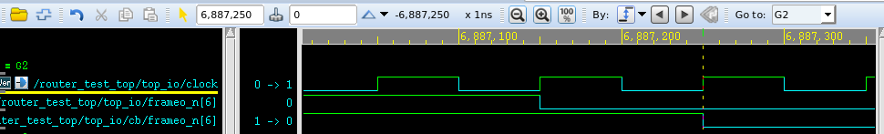

```[DEBUG HGUO] 6887250.0ns, rtr_io.cb.frameo_n[da] negedge```


## signed and unsigned arithmetic in Verilog

With **implict sign extension**, the implementation of **signed** arithmetic is **DIFFERENT** from that of **unsigned**. Otherwise, their implementations are same.

The implementations manifest the RTL's behaviour correctly

### add without implicit sign extension

#### unsigned

##### rtl

```verilog
module TOP (
	input wire [2:0] data0
	,input wire [2:0] data1
	,output wire [2:0] result
);
	assign result = data0 + data1;
endmodule
```

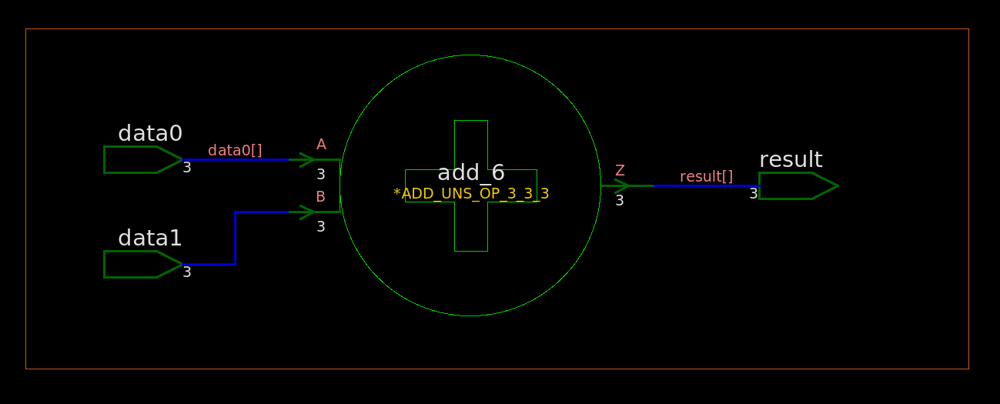

##### synthesized netlist

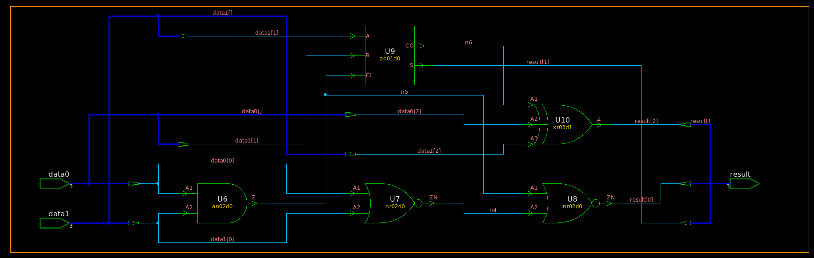 

```verilog
/////////////////////////////////////////////////////////////
// Created by: Synopsys DC Ultra(TM) in wire load mode
// Version   : S-2021.06-SP5
// Date      : Sat May  7 11:43:27 2022
/////////////////////////////////////////////////////////////


module TOP ( data0, data1, result );
  input [2:0] data0;
  input [2:0] data1;
  output [2:0] result;
  wire   n4, n5, n6;

  an02d0 U6 ( .A1(data0[0]), .A2(data1[0]), .Z(n5) );
  nr02d0 U7 ( .A1(data0[0]), .A2(data1[0]), .ZN(n4) );
  nr02d0 U8 ( .A1(n5), .A2(n4), .ZN(result[0]) );
  ad01d0 U9 ( .A(data1[1]), .B(data0[1]), .CI(n5), .CO(n6), .S(result[1]) );
  xr03d1 U10 ( .A1(n6), .A2(data0[2]), .A3(data1[2]), .Z(result[2]) );
endmodule
```

> vcs compile with `-v /path/to/lib.v`

#### signed

##### rtl

```verilog
module TOP (
	input wire signed [2:0] data0
	,input wire signed [2:0] data1
	,output wire signed [2:0] result
);
	assign result = data0 + data1;
endmodule
```

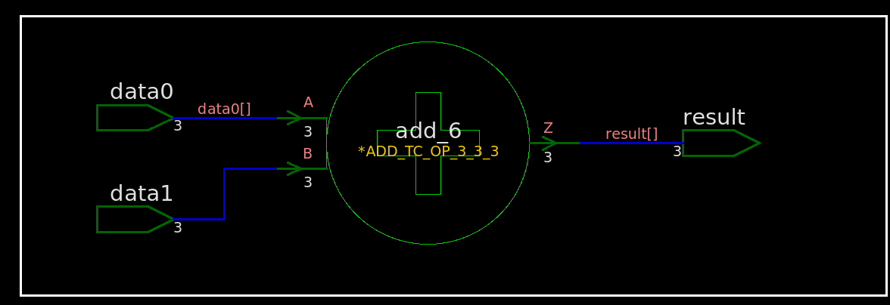

##### synthesized netlist

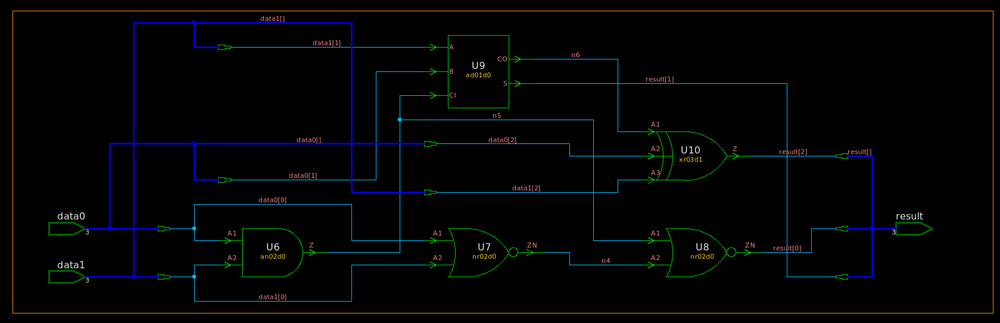

```verilog
/////////////////////////////////////////////////////////////
// Created by: Synopsys DC Ultra(TM) in wire load mode
// Version   : S-2021.06-SP5
// Date      : Sat May  7 11:48:54 2022
/////////////////////////////////////////////////////////////


module TOP ( data0, data1, result );
  input [2:0] data0;
  input [2:0] data1;
  output [2:0] result;
  wire   n4, n5, n6;

  an02d0 U6 ( .A1(data0[0]), .A2(data1[0]), .Z(n5) );
  nr02d0 U7 ( .A1(data0[0]), .A2(data1[0]), .ZN(n4) );
  nr02d0 U8 ( .A1(n5), .A2(n4), .ZN(result[0]) );
  ad01d0 U9 ( .A(data1[1]), .B(data0[1]), .CI(n5), .CO(n6), .S(result[1]) );
  xr03d1 U10 ( .A1(n6), .A2(data0[2]), .A3(data1[2]), .Z(result[2]) );
endmodule
```

### add WITH implicit sign extension

#### unsigned with 0 extension

##### rtl

```verilog
module TOP (
    input wire [2:0] data0		// 3 bit unsigned
    ,input wire [1:0] data1		// 2 bit unsigned
    ,output wire [2:0] result	// 3 bit unsigned
);
	assign result = data0 + data1;
endmodule
```

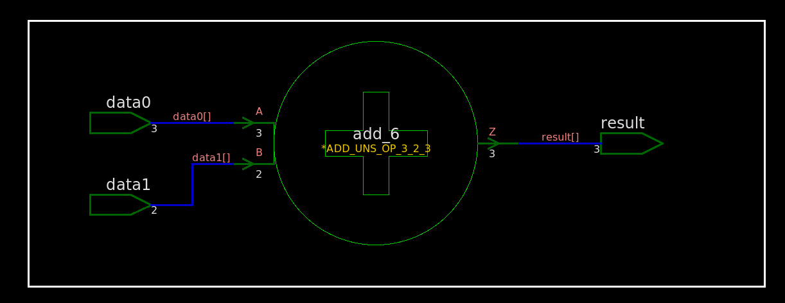

##### synthesized netlist

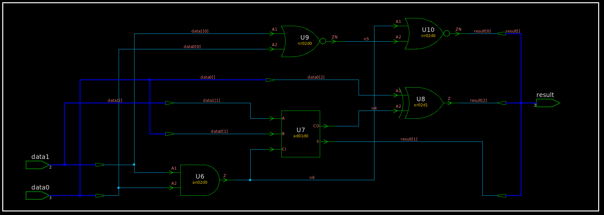

```verilog
/////////////////////////////////////////////////////////////
// Created by: Synopsys DC Ultra(TM) in wire load mode
// Version   : S-2021.06-SP5
// Date      : Sat May  7 12:15:58 2022
/////////////////////////////////////////////////////////////


module TOP ( data0, data1, result );
  input [2:0] data0;
  input [1:0] data1;
  output [2:0] result;
  wire   n4, n5, n6;

  an02d0 U6 ( .A1(data1[0]), .A2(data0[0]), .Z(n6) );
  ad01d0 U7 ( .A(data1[1]), .B(data0[1]), .CI(n6), .CO(n4), .S(result[1]) );
  xr02d1 U8 ( .A1(data0[2]), .A2(n4), .Z(result[2]) );
  nr02d0 U9 ( .A1(data1[0]), .A2(data0[0]), .ZN(n5) );
  nr02d0 U10 ( .A1(n6), .A2(n5), .ZN(result[0]) );
endmodule
```

#### signed with implicit sign extension

##### rtl

```verilog
module TOP (
	input wire signed [2:0] data0
	,input wire signed [1:0] data1
	,output wire signed [2:0] result
);
	assign result = data0 + data1;
endmodule
```

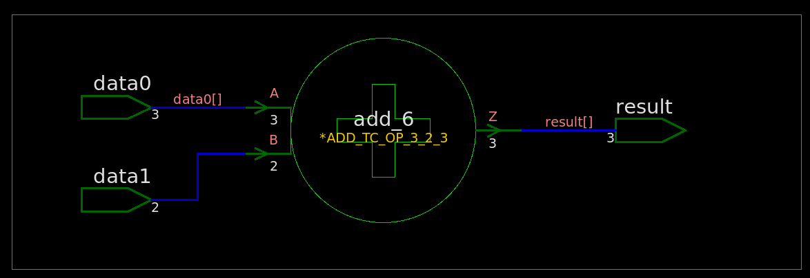

##### synthesized netlist

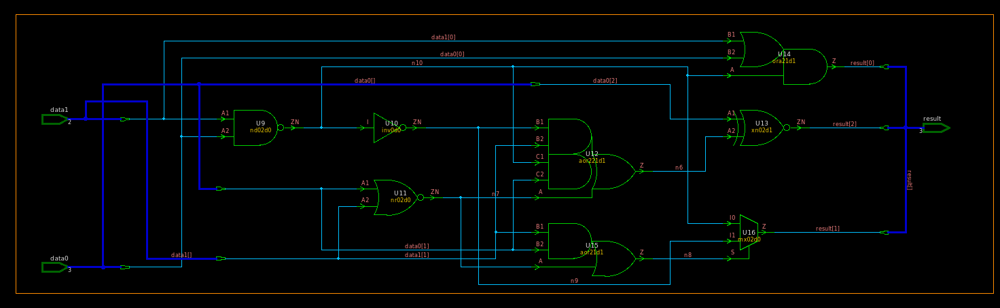

```verilog
/////////////////////////////////////////////////////////////
// Created by: Synopsys DC Ultra(TM) in wire load mode
// Version   : S-2021.06-SP5
// Date      : Sat May  7 12:21:51 2022
/////////////////////////////////////////////////////////////


module TOP ( data0, data1, result );
  input [2:0] data0;
  input [1:0] data1;
  output [2:0] result;
  wire   n6, n7, n8, n9, n10;

  nd02d0 U9 ( .A1(data1[0]), .A2(data0[0]), .ZN(n10) );
  inv0d0 U10 ( .I(n10), .ZN(n9) );
  nr02d0 U11 ( .A1(data0[1]), .A2(data1[1]), .ZN(n7) );
  aor221d1 U12 ( .B1(n9), .B2(data1[1]), .C1(n10), .C2(data0[1]), .A(n7), .Z(
        n6) );
  xn02d1 U13 ( .A1(data0[2]), .A2(n6), .ZN(result[2]) );
  ora21d1 U14 ( .B1(data1[0]), .B2(data0[0]), .A(n10), .Z(result[0]) );
  aor21d1 U15 ( .B1(data1[1]), .B2(data0[1]), .A(n7), .Z(n8) );
  mx02d0 U16 ( .I0(n10), .I1(n9), .S(n8), .Z(result[1]) );
endmodule
```


## Latch Inference in Verilog

> UC Berkeley CS150 Lec #20: Finite State Machines [[slides](https://inst.eecs.berkeley.edu/~cs150/sp11/agenda/lec/lec20-fsm.pdf)]

### `always@( * )`

`always@( * )` blocks are used to describe Combinational Logic, or Logic Gates. Only `=` (blocking)
assignments should be used in an `always@( * )` block.

### Latch Inference

If you **DON'T** assign every element that can be assigned inside an `always@( * )` block every time that `always@( * )` block is executed, a latch will be inferred for that element

The approaches to avoid latch generation:

- set default values
- proper use of the `else` statement, and other flow constructs


#### without default values

> latch is generated

##### RTL

```verilog
module TOP (
	input wire Trigger,
	input wire Pass,
	output reg A,
	output reg C
);
	always @(*) begin
		A = 1'b0;
		if (Trigger) begin
			A = Pass;
			C = Pass;
		end
	end
endmodule
```

##### synthesized  netlist

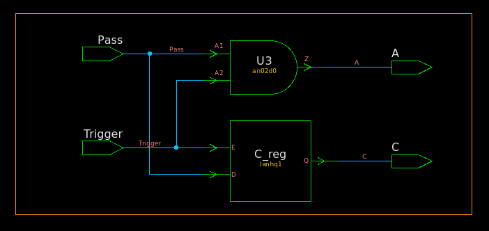

```verilog
/////////////////////////////////////////////////////////////
// Created by: Synopsys DC Ultra(TM) in wire load mode
// Version   : S-2021.06-SP5
// Date      : Mon May  9 17:09:18 2022
/////////////////////////////////////////////////////////////


module TOP ( Trigger, Pass, A, C );
  input Trigger, Pass;
  output A, C;


  lanhq1 C_reg ( .E(Trigger), .D(Pass), .Q(C) );
  an02d0 U3 ( .A1(Pass), .A2(Trigger), .Z(A) );
endmodule
```

#### add default value

> Default values are an easy way to avoid latch generation

##### RTL

```verilog
module TOP (
	input wire Trigger,
	input wire Pass,
	output reg A,
	output reg C
);
	always @(*) begin
		A = 1'b0;
        	C = 1'b1;
		if (Trigger) begin
			A = Pass;
			C = Pass;
		end
	end
```


##### synthesized  netlist

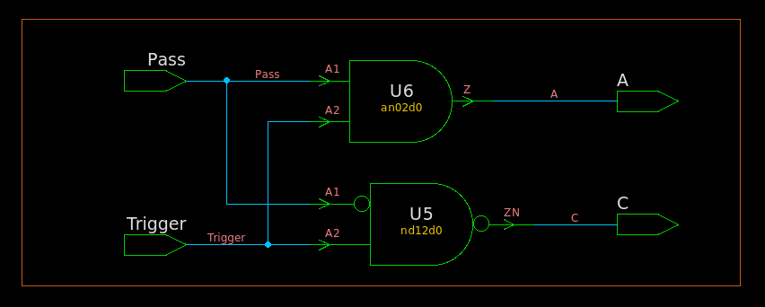

```verilog
/////////////////////////////////////////////////////////////
// Created by: Synopsys DC Ultra(TM) in wire load mode
// Version   : S-2021.06-SP5
// Date      : Mon May  9 17:12:47 2022
/////////////////////////////////////////////////////////////


module TOP ( Trigger, Pass, A, C );
  input Trigger, Pass;
  output A, C;


  nd12d0 U5 ( .A1(Pass), .A2(Trigger), .ZN(C) );
  an02d0 U6 ( .A1(Pass), .A2(Trigger), .Z(A) );
endmodule

```


### `if` evaluation

`signed` number cast to `unsigned` automatically before evaluating

```verilog
// tb.v
module tb; 
  reg signed [1:0] datasg;
  reg [1:0] dataug;

  initial begin
    datasg = 2'b11;
    dataug = 2'b11;

    $display("datasg(%%d): %d", datasg);
    $display("dataug(%%d): %d", dataug);

    if (datasg)
      $display("datasg is OK");
    if (dataug)
      $display("dataug is OK");

    $finish();
  end 
endmodule
```

```
$ vlog tb.v
$ vsim -c -do "run;exit" work.tb
# Loading work.tb(fast)
# run
# datasg(%d): -1
# dataug(%d): 3
# datasg is OK
# dataug is OK
# ** Note: $finish    : tb.v(16)
```


## Arithmetic in Verilog

### unsigned + unsigned = unsigned

```verilog
function [7:0] satadd_uuu8b;   // unsigned + unsigned = unsigned
    input [7:0] a;
    input [7:0] b;

    reg [8:0] t;   // extend 1b
    begin
        t = {1'b0, a} + {1'b0, b};
        satop_uuu16b = t[8] ? {8{1'b1}} : t[7:0];
    end
endfunction
```

> `1'b1`: overflow

### signed + signed = signed

```verilog
function [7:0] satadd_sss8b;    // signed + signed = signed
    input signed    [7:0] a;
    input signed    [7:0] b;

    reg signed [8:0] t; // extend 1b
    begin
        t = a + b;  // extend sign bit automatically
        satadd_sss8b =  (t[8:7] == 2'b01) ? {1'b0, 7{1'b1}} : // up sat
                        (t[8:7] == 2'b10) ? {1'b1, 7{1'b0}} : // dn sat
                                            t[7:0];
    end
endfunction
```

> `2'b01`: overflow
>
> `2'b10`: underflow

### signed + unsigned = unsigned

```verilog
function [7:0] satadd_suu8b;    // signed + unsigned = unsigned
    input signed    [7:0] a;
    input           [7:0] b;

    reg signed [8:0] t; // extend 1b
    begin
        t = {a[7], a} + {1'b0, b};
        satadd_ssu8b =  (t[8:7] == 2'b10) ? {8{1'b1}} : // up saturate for unsigned
                        (t[8:7] == 2'b11) ? {8{1'b0}} : // dn saturate for unsigned
                                            t[7:0];
    end
endfunction
```


### signed + unsigned = signed

```verilog
function signed [7:0] satop_sus8b;    //signed +/- unsigned = signed
    input signed    [7:0] a;
    input           [7:0] b;
    input plus;

    reg signed [8:0] t;    // extend 1b
    begin
        if(plus) begin
            t = {a[7], a} + {1'b0, b};
            satop_sus8b = (t[8:7]==2'b01) ? {1'b0, {7{1'b1}}}   // up saturate for signed
                                             : t[7:0];
        end else begin
            t = {a[7], a} - {1'b0, b};
            satop_sus8b = (t[8:7]==2'b10) ? {1'b1, {7{1'b0}}}   // dn saturate for signed
                                             : t[7:0];
        end
    end
endfunction
```


## Overflow Detection in Verilog

> Overflow Detection: [[http://www.c-jump.com/CIS77/CPU/Overflow/lecture.html](http://www.c-jump.com/CIS77/CPU/Overflow/lecture.html)]

- Arithmetic operations have a potential to run into a condition known as *overflow*.
- Overflow occurs with respect to the **size of the data type** that must accommodate the result.
- Overflow indicates that the result was *too large* or *too small* to fit in the original data type.


### Overflow when adding unsigned number

When two unsigned numbers are added, overflow occurs if

- there is a **carry out** of the leftmost bit.


### Overflow when adding signed numbers

When two signed 2's complement numbers are added, overflow is detected if:

1. both operands are positive and the result is negative, or
2. both operands are negative and the result is positive.

Notice that when operands have **opposite signs**, their sum will never overflow. Therefore, *overflow can only occur when the operands have the same sign*.

| A            | B            | carryout_sum   | overflow  |
| ------------ | ------------ | -------------- | --------- |
| **0**11 (3)  | **0**11 (3)  | 0_**1**10 (6)  | overflow  |
| **1**00 (-4) | **1**00 (-4) | 1_**0**00 (-8) | underflow |
| **1**11 (-1) | **1**10 (-2) | 1_**1**01 (-3) | -         |

> carryout information **ISN'T** needed to detect overflow/underflow for signed number addition


#### EXTBIT:MSB

extended 1bit and msb bit can be used to detect overflow or underflow

```verilog
reg signed  [1:0]      acc_inc;
reg signed  [10-1:0]   acc;
wire signed [10  :0]   acc_w;  // extend 1b for saturation
wire signed [10-1:0]   acc_stat;

assign acc_w = acc + acc_inc;   // signed arithmetic

assign acc_stat = (acc_w[10-1 +: 2] == 2'b01) ? {1'b0, {(10-1){1'b1}}} : // up saturation
    (acc_w[10-1 +: 2] == 2'b10) ? {1'b1, {(10-1){1'b0}}}  :   			 // down saturation
    acc_w[10-1:0];
```

> `2'b01` : overflow, up saturation
>
> `2'b10`: underflow, down saturation


###  2's complement negative number

1. Flip all bits
2. Add **1**.

N-bit signed number
$$
A = -M_{N-1}2^{N-1}+\sum_{k=0}^{N-2}M_k2^k
$$
Flip all bits
$$\begin{align}
A_{flip} &= -(1-M_{N-1})2^{N-1} +\sum_{k=0}^{N-2}(1-M_k)2^k \\
&= M_{N-1}2^{N-1}-\sum_{k=0}^{N-2}M_k2^k -2^{N-1}+\sum_{k=0}^{N-2}2^k \\
&= M_{N-1}2^{N-1}-\sum_{k=0}^{N-2}M_k2^k -1
\end{align}$$

Add **1**
$$\begin{align}
A_- &= A_{flip}+1 \\
&= M_{N-1}2^{N-1}-\sum_{k=0}^{N-2}M_k2^k \\
&= -A
\end{align}$$


## reference

Lee, Weng Fook, Weng Fook Lee, and Glaser. *Learning from VLSI design experience*. Springer International Publishing, 2019.

Bevan Baas, EEC281 VLSI Digital Signal Processing,  [[https://www.ece.ucdavis.edu/~bbaas/281/](https://www.ece.ucdavis.edu/~bbaas/281/)]

