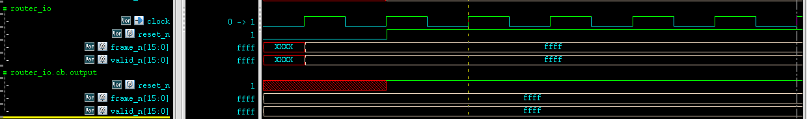
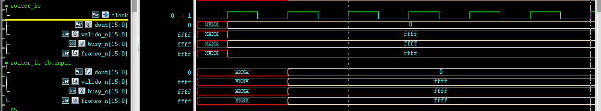

> Assignment at \<interface\>.\<clocking block\>.\<output signal\> (i.e. synchronous) do **NOT** change \<interface\>.\<output signal\> until active clock edge.

 

```verilog
// router_io.sv

interface router_io(input bit clock);
  logic    reset_n;
  logic [15:0]  din;
  logic [15:0]  frame_n;
  logic [15:0]  valid_n;
  logic [15:0]  dout;
  logic [15:0]  valido_n;
  logic [15:0]  busy_n;
  logic [15:0]  frameo_n;

  clocking cb @(posedge clock);
    default input #1ns output #1ns;
    output reset_n;
    output din;
    output frame_n;
    output valid_n;
    input  dout;
    input  valido_n;
    input  frameo_n;
    input  busy_n;
  endclocking: cb
  
  // `reset_n` can be either a synchronous or an asynchronous signal
  modport TB(clocking cb, output reset_n);

endinterface: router_io
```
> All interface signals are asynchronous and without a direction spection (i.e. input, output, inout). 
>
> - The direction can only be specified in `clocking` block for **synchronous signals**
> - or a `modport` for **asynchronous signals**
>
> All directions for the signals in the clocking block must be with respect to the test program;


```verilog
// test.sv

program automatic test(router_io.TB rtr_io);

  initial begin
    reset();
  end
    
  task reset();
    rtr_io.reset_n = 1'b0;
    rtr_io.cb.frame_n <= '1;
    rtr_io.cb.valid_n <= '1;
    repeat(2) @rtr_io.cb;
    rtr_io.cb.reset_n <= 1'b1;
    repeat(15) @(rtr_io.cb);
  endtask: reset

endprogram: test
```

```verilog
// router_test_top.sv

`timescale 1ns/100ps

module router_test_top;
  parameter simulation_cycle = 100;

  bit SystemClock = 0;

  router_io top_io(SystemClock);
  test t(top_io);

  router dut(
    .reset_n  (top_io.reset_n),
    .clock    (top_io.clock),
    .din    (top_io.din),
    .frame_n  (top_io.frame_n),
    .valid_n  (top_io.valid_n),
    .dout    (top_io.dout),
    .valido_n  (top_io.valido_n),
    .busy_n    (top_io.busy_n),
    .frameo_n  (top_io.frameo_n)
  );

  initial begin
    $timeformat(-9, 1, "ns", 10);
    $fsdbDumpvars;
  end

  always begin
    #(simulation_cycle/2) SystemClock = ~SystemClock;
  end

endmodule
```

**compile**:

```
$ vcs -sverilog -full64 -kdb -debug_access+all router_test_top.sv test.sv router_io
.sv ../../rtl/router.v
```

> file with ``timescale` must be placed in the first, which is `router_test_top.sv` in above example


### clocking.output



> systemverilog don't pass clocking.output to interface's until current or next active edge and after output-skew 


### clocking.input



> Systemverilog **automatically** update clocking.input signal from interface's value, input-skew before active edge


### Gotcha

An `interface` must be compiled separately like a `module` and CANNOT ``include` inside a `package` or ohter `module`
