Due to the fact that *long-term drift* of temperature sensors and bandgap references caused by package-induced stress is lower with PNP BJTs than with NPN BJTs, **PNP** BJTs have been used traditionally for temperature sensor design in CMOS

##  Calibration

*TODO* &#128197;

> [[https://ww1.microchip.com/downloads/en/Appnotes/Atmel-8108-Calibration-of-the-AVRs-Internal-Temperature-Reference_ApplicationNote_AVR122.pdf](https://ww1.microchip.com/downloads/en/Appnotes/Atmel-8108-Calibration-of-the-AVRs-Internal-Temperature-Reference_ApplicationNote_AVR122.pdf)]

## $V_{BE}$ curvature

Though it is assumed that  $V_{BE}$ is a linear function of temperature for first oder analysis.

In practice, $V_{BE}$ is *slightly nonlinear*, the magnitude of this nonlinearity is referred to as **curvature**.

**curvature** depends on the temperature dependency of the *saturation current* ($I_s$), and on that of the *collector current* ($I_c$), it can be written as
$$
V_{curv}(T)=\frac{k}{q}(\eta-\delta)(T-T_r-T\cdot \ln(\frac{T}{T_r}))
$$
where $\eta$ = a constant depending on the doping level,  CMOS substrate pnp transistors have a typically value of $\eta \cong 4$

$\delta$ = order of the *temperature dependence of collector current* ($I_c$) 

>  PTAT $I_c$ help reduce $V_{curv}(T)$, $\delta=1$

Although the temperature dependence of the bias current $I_b$ doesn’t impact the accuracy of $V_{BE}$, it does impact the systematic nonlinearity or curvature of $V_{BE}$, and hence the sensor's *systematic error*. **The curvature in $V_{BE}$ can be reduced by using a PTAT bias current**.

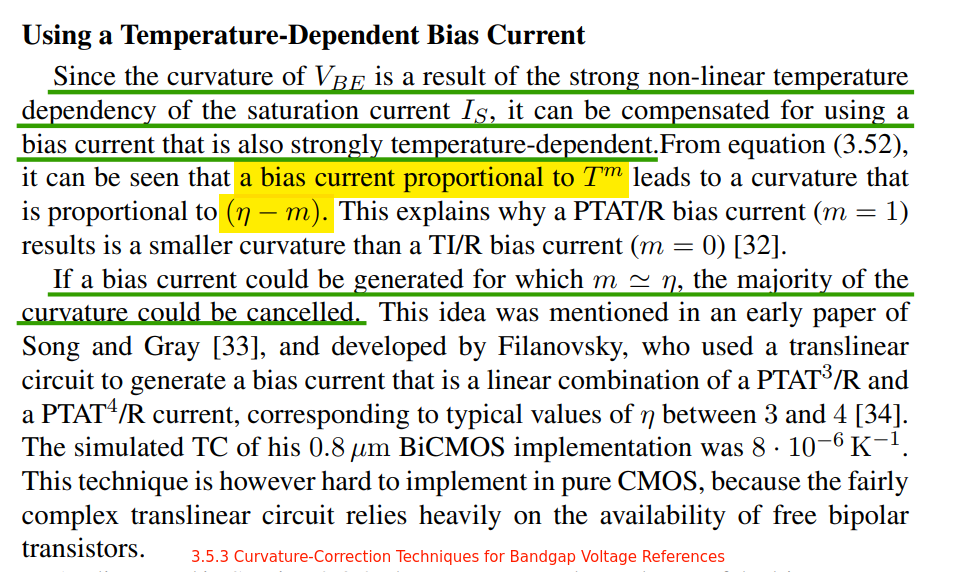

## PTAT bias current

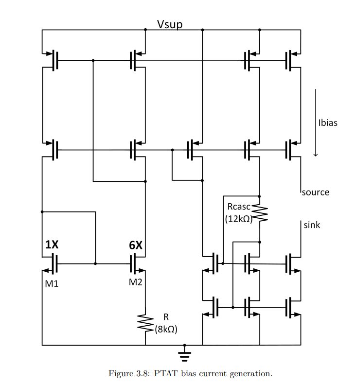
$$
I_{bias} = \frac{0.7}{\beta \cdot R^2}
$$
in which $\beta=\frac{\mu_{n}\cdot C_{ox}\cdot W}{L}$, where:

$\mu_n$=mobility,

$C_{ox}$ = oxide capacitance density,

$\frac{W}{L}$ = dimension ratio of unit NMOS used for $M_1$ and $M_2$

$\mu_n$ is **complementary to the absolute temperature** and resitor R is implemented using high-R flow in FinFET which has a low temperature dependency, the net temperature dependency of $I_{bias}$ is proportional to the absolute temperature
$$
I_{bias}\propto  T
$$

> Kamath, Umanath Ramachandra. "BJT Based Precision Voltage Reference in FinFET Technology." (2021).

## Errors due to V-I Finite Gain

Finite gain introduces errors both in the V-I converters, finite loop gain results in errors in the closed-loop transconductances. 

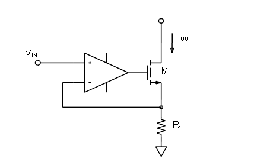
$$\begin{align}
(V_{i1} - V_{o1})\cdot A_{OL1} &= V_{o1} \\
V_{o1} &= \frac{A_{OL1}}{1+A_{OL1}}V_{i1} \\
I_{o1} &= \frac{A_{OL1}}{1+A_{OL1}}\frac{1}{R_1}V_{i1}
\end{align}$$
similarly, 
$$
I_{o2} = \frac{A_{OL2}}{1+A_{OL2}}\frac{1}{R_2}V_{i2}
$$

Then, $\alpha$ is obtained
$$
\alpha = \frac{(1+A_{OL2})A_{OL1}}{A_{OL2}(1+A_{OL1})}\cdot\frac{R_2}{R_1}
$$
 Since the loop gains in the two V-I converters cannot be expected to *match*, the resulting errors in **both** converters should be reduced to negligible levels.

First, assume $A_{OL2}=\infty$
$$\begin{align}
\Delta \alpha &= (1-\frac{A_{OL1}}{1+A_{OL1}})\cdot\frac{R_2}{R_1}\\
&=\frac{1}{1+A_{OL1}}\cdot\frac{R_2}{R_1}\\
&\cong \frac{1}{A_{OL1}}\cdot\frac{R_2}{R_1}
\end{align}$$

We get
$$
\frac{\Delta \alpha}{\alpha}=\frac{1}{A_{OL1}}
$$
Follow the same procedure, assume $A_{OL1}=\infty$
$$
\frac{\Delta \alpha}{\alpha}=\frac{1}{A_{OL2}}
$$
The finite gain introduces an error inversely proportional to the loop gain $A_{OL1}$,$A_{OL2}$, the resulting errors in both converters should be reduced to negligible levels

## Why is it named as "bandgap reference"

 Let us write the output voltage as
$$
V_{REF} = V_{BE} + V_T\cdot \ln n
$$
and hence
$$
\frac{\partial V_{REF}}{\partial T} = \frac{\partial V_{BE}}{\partial T} + \frac{V_T}{T}\ln n
$$
Setting this to zero and substituting for $\frac{\partial V_{BE}}{\partial T}$, we have
$$
\frac{V_{BE}-(4+m)V_T-E_g/q}{T}=-\frac{V_T}{T}\ln n
$$
If $V_T\ln n$ is found from this equation and inserted in $V_{REF}$, we obtain
$$
V_{REF}=\frac{E_g}{q} + (4+m)V_T
$$

> The term **bandgap** is used here because as $T\to 0$, $V_{REF} \to E_g/q$

## sinking PTAT-current generator without current mirrors

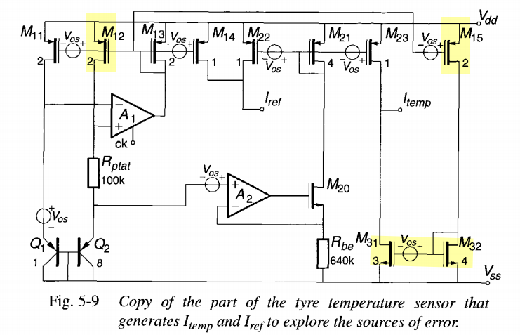

**why without current mirror?**

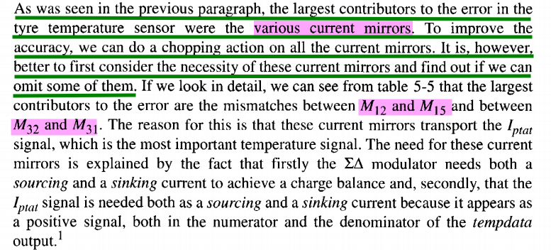

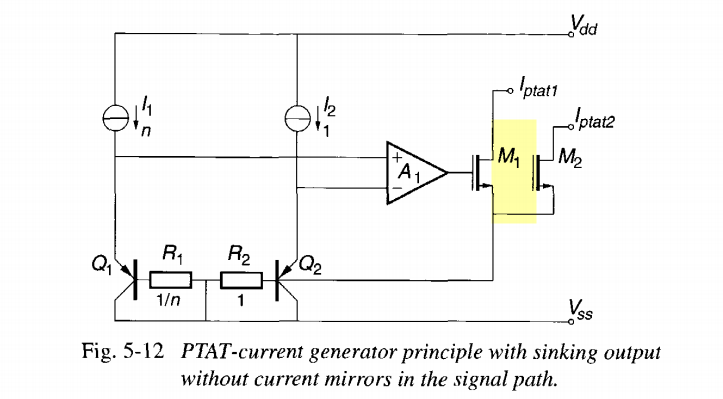

> Bakker, Anton. (2000). High-Accuracy CMOS Smart Temperature Sensors. 10.1007/978-1-4757-3190-3. [[https://repository.tudelft.nl/record/uuid:fd398056-48dd-4d84-8ae8-27a1b011d2c3](https://repository.tudelft.nl/record/uuid:fd398056-48dd-4d84-8ae8-27a1b011d2c3)]

## Consideration for Readout Circuit

### ADC dynamic range

Take $V_{PTAT}=\alpha \cdot \Delta V_{BE}$ as input and $V_{REF}$ as reference. The output $\mu$ of the ADC will then be
$$
\mu =\frac{V_{PTAT}}{V_{VREF}}=\frac{\alpha \cdot \Delta V_{BE}}{V_{BE}+\alpha \cdot \Delta V_{BE}}
$$
 A final digital output $D_{out}$ in degrees *Celsius* can be obtained by linear scaling:
$$
D_{out}=A\cdot \mu + B
$$
where $A\simeq 600K$ and $B\simeq -273K$

While the transfer is simple, it only uses about 30% of the of the ADC (the extremes of the operating range correspond to $\mu \simeq 1/3$ and $\mu \simeq  2/3$). The ratio results in a rather inefficient use of the modulator's *dynamic range*.

For a first-order $\Sigma\Delta$ modulator, this means that about **1.5 bits** of resolution are lost

A more efficient transfer is 
$$
\mu '=\frac{2\alpha \cdot \Delta V_{BE}-V_{BE}}{V_{BE}+\alpha \cdot \Delta V_{BE}}
$$
With this more efficient combination, *90%* of the dynamic range is used rather than 30%. Thus, *the required resolution of the ADC* is reduced by **a factor of three**.

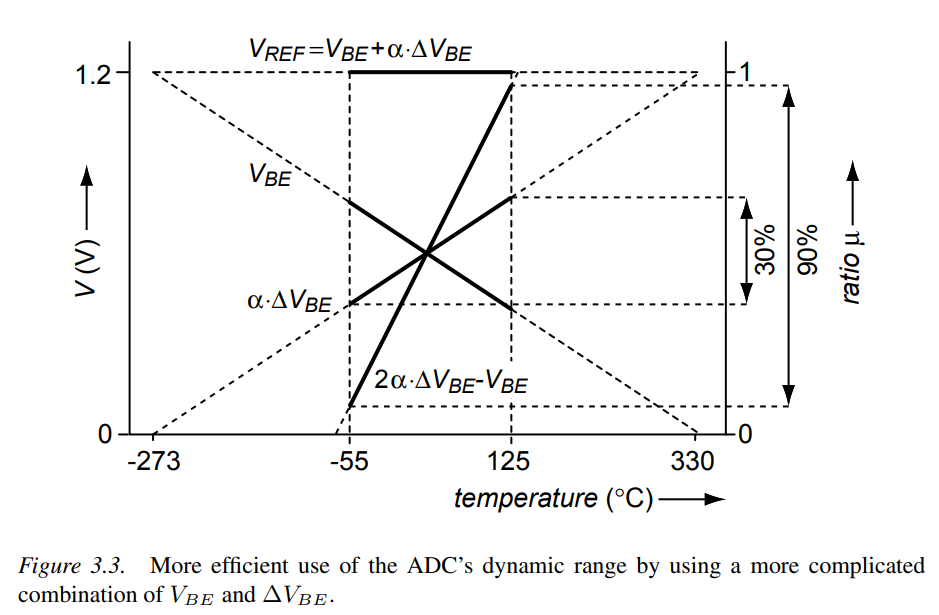

### Integrator Output Swing

> $$
> \mu =\frac{\alpha \cdot \Delta V_{BE}}{V_{BE}+\alpha \cdot \Delta V_{BE}}
> $$

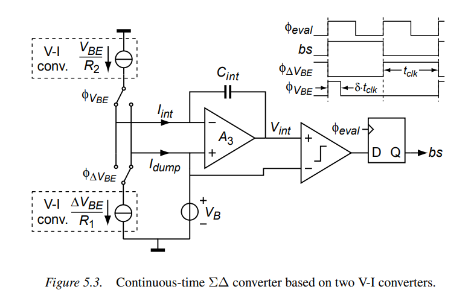

> $$
> \mu '=\frac{2\alpha \cdot \Delta V_{BE}-V_{BE}}{V_{BE}+\alpha \cdot \Delta V_{BE}}
> $$

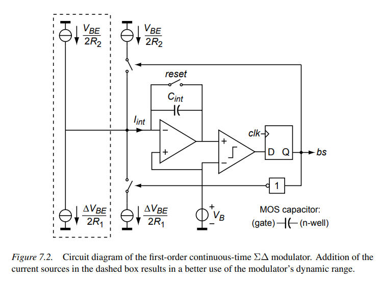

In advanced process, like Finfet 16nm, 7nm, high resistance resistor has **+/-15%** variation and MOM capacitor has **+/-30%** variation.

Then,  $R_1$ and $R_2$ not only determine the $\alpha$ but also the integrator's output swing, so do $V_{BE}$ and $\Delta V_{BE}$, $C_{int}$. 

> The integrator's output change per period

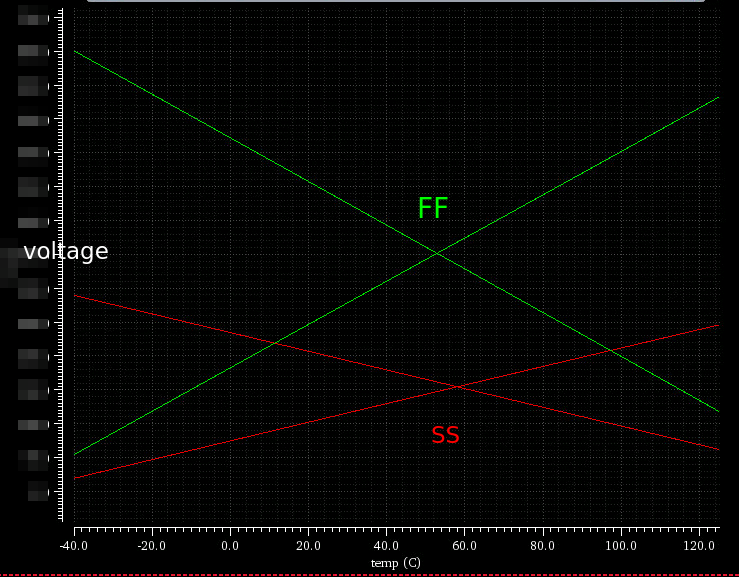

#### example

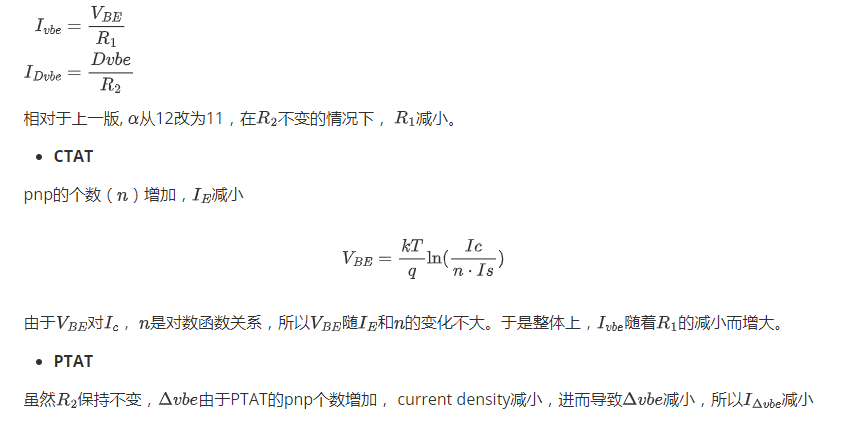

### integrator, comparator offset

#### integrator offset

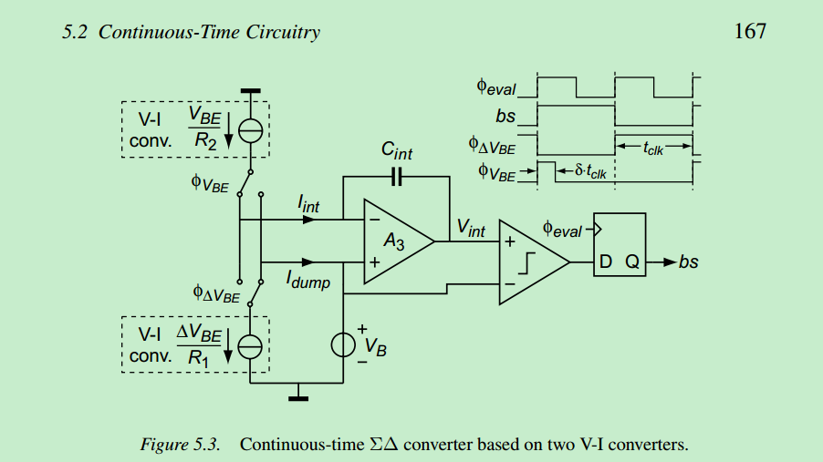

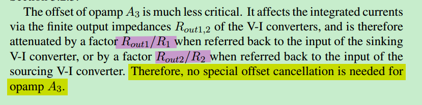

#### comparator offset

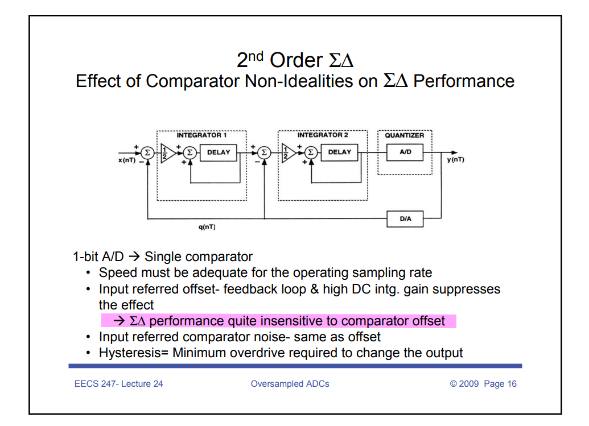

## integrator design

### application in sensor

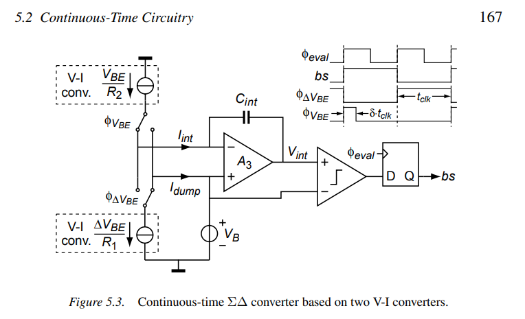

### Offset Errors

The offset of opamp $A_3$ is **much less critical**:

1.  It affects the integrated currents via the finite output impedances $R_{out1,2}$ of the V-I converters, and is therefore attenuated by a factor $R_{out1}/R_1$ when referred back to the input of the sinking V-I converter, 

2.  or by a factor $R_{out2}/R_2$ when referred back to the input of the sourcing V-I converter. 

Therefore, no special offset cancellation is needed for opamp $A_3$.

The current change due to offset of $A_3$:
$$\begin{align}
\frac{V_{BE,os}}{R_1} &= \frac{V_{ota,os}}{R_{out1}} \\
\frac{\Delta V_{BE,os}}{R_2} &= \frac{V_{ota,os}}{R_{out2}} 
\end{align}$$
Then, the input referenced offset is:
$$\begin{align}
V_{BE,os} &=\frac{ V_{ota,os}}{R_{out1}/R_1} \\
\Delta V_{BE,os} &= \frac{ V_{ota,os}}{R_{out2}/R_2}
\end{align}$$

### Errors due to Finite Gain

Finite gain of opamp $A_3$ results in a non-zero overdrive voltage at its input, which modulates the current Iint due to the finite output impedances of the V-I converters. 

Assuming the opamp is implemented as a **transconductance amplifier**, there are two main causes of this non-zero overdrive voltage

1. The finite transconductance $g_{m3}$ of the opamp, , which implies that an overdrive voltage is required to provide the **feedback current**

​	The change in the integrated current

​	$$\begin{align}
​	\Delta I_{int} &= \frac{V_{i,ota}}{R_{out}}\\
​	&= \frac{I_{int}}{g_{m3}}\cdot \frac{1}{R_{out}}
​	\end{align}$$

2. The finite DC gain $A_{0,3}$, which implies that an overdrive voltage is required to produce the **output voltage** $V_{int}$

## reference

Micheal, A., P., Pertijs., Johan, H., Huijsing., Pertijs., Johan, H., Huijsing. (2006). Precision Temperature Sensors in CMOS Technology.   

C. -H. Chang, J. -J. Horng, A. Kundu, C. -C. Chang and Y. -C. Peng, "An ultra-compact, untrimmed CMOS bandgap reference with 3σ inaccuracy of +0.64% in 16nm FinFET," 2014 IEEE Asian Solid-State Circuits Conference (A-SSCC), 2014, pp. 165-168, doi: 10.1109/ASSCC.2014.7008886.

EE247 - Analog Digital Interface Integrated Circuits - Fall 2009 [Lecture 24- Oversampled ADCs](https://inst.eecs.berkeley.edu/~ee247/fa09/files07/lectures/L24_2_f09.pdf)

Hecht, Bruce. (2010). SSCS DL Kofi Makinwa Talks About Smart Sensor Design at SSCS-Boston [People]. Solid-State Circuits Magazine, IEEE. 2. 54 - 56. 10.1109/MSSC.2009.935278. 
