## Are AC-Driven Circuits Linear?

$$
f(x_1 + x_2)= f(x_1)+ f(x_2)
$$

Often, AC-driven circuits can be mistaken as non-linear as the basis that determines the linearity of a circuit is the relationship between the voltage and current. 

While an AC signal varies with time, it still exhibits a linear relationship across elements like resistors, capacitors, and inductors. Therefore, AC driven circuits are linear.

## Phasor

*Phasor concept has no real physical significance. It is just a convenient mathematical tool.*

> Phasor analysis determines the steady-state response to a linear circuit  driven by sinusoidal sources with frequency $f$
>
> If your circuit includes transistors or other nonlinear components, all is not lost. There is an extension of phasor analysis to nonlinear circuits called small-signal analysis in which you linearize the components before performing phasor analysis -  AC analyses of SPICE

A sinusoid is characterized by 3 numbers, its amplitude, its phase, and its frequency. For example
$$
v(t) = A\cos(\omega t + \phi) \tag{1}
$$
In a circuit there will be many signals but in the case of phasor analysis they will all have the same frequency. For this reason, the signals are characterized using only their **amplitude and phase**.

The combination of an **amplitude** and **phase** to describe a signal is the **phasor** for that signal.

Thus, the phasor for the signal in $(1)$ is $A\angle \phi$

> In general, phasors are functions of frequency

Often it is preferable to represent a phasor using **complex numbers** rather than using amplitude and phase. In this case we represent the signal as:
$$
v(t) = \Re\{Ve^{j\omega t} \} \tag{2}
$$
where $V=Ae^{j\phi}$ is the **phasor**.

> $(1)$ and $(2)$ are the same

###  Phasor Model of a Resistor

A linear resistor is defined by the equation $v = Ri$

Now, assume that the resistor current is described with the *phasor* $I$. Then
$$
i(t) = \Re\{Ie^{j\omega t}\}
$$
$R$ is a real constant, and so the voltage can be computed to be
$$
v(t) = R\Re\{Ie^{j\omega t}\} = \Re\{RIe^{j\omega t}\} = \Re\{Ve^{j\omega t}\}
$$
where $V$ is the phasor representation for $v$, i.e.
$$
V = RI
$$

1. Thus, given the *phasor* for the current we can directly compute the *phasor* for the voltage across the resistor. 

2. Similarly, given the *phasor* for the voltage across a resistor we can compute the *phasor* for the current through the resistor using $I = \frac{V}{R}$

###  Phasor Model of a Capacitor

A linear capacitor is defined by the equation $i=C\frac{dv}{dt}$

Now, assume that the voltage across the capacitor is described with the *phasor* $V$. Then
$$
v(t) = \Re\{ V e^{j\omega t}\}
$$
$C$ is a real constant
$$
i(t) = C\Re\{\frac{d}{dt}V e^{j\omega t}\} = \Re\{j\omega C V e^{j\omega t}\}
$$
The *phasor* representation for $i$ is $i(t) = \Re\{Ie^{j\omega t}\}$, that is $I = j\omega C V$

1. Thus, given the *phasor* for the voltage across a capacitor we can directly compute the *phasor* for the current through the capacitor. 

2. Similarly, given the *phasor* for the current through a capacitor we can compute the *phasor* for the voltage across the capacitor using $V=\frac{I}{j\omega C}$

### Phasor Model of an Inductor

A linear inductor is defined by the equation $v=L\frac{di}{dt}$ 

Now, assume that the inductor current is described with the *phasor* $I$. Then
$$
i(t) = \Re\{ I e^{j\omega t}\}
$$
$L$ is a real constant, and so the voltage can be computed to be
$$
v(t) = L\Re\{\frac{d}{dt}I e^{j\omega t}\} = \Re\{j\omega L I e^{j\omega t}\}
$$
The *phasor* representation for $v$ is $v(t) = \Re\{Ve^{j\omega t}\}$, that is $V = j\omega L I$

1. Thus, given the *phasor* for the current we can directly compute the *phasor* for the voltage across the inductor. 

2. Similarly, given the phasor for the voltage across an inductor we can compute the phasor for the current through the inductor using $I=\frac{V}{j\omega L}$

###  Impedance and Admittance

> Impedance and admittance are generalizations of resistance and conductance. 
>
> They differ from resistance and conductance in that they are complex and they vary with frequency.

Impedance is defined to be the ratio of the *phasor* for the voltage across the component and the current through the component:
$$
Z = \frac{V}{I}
$$

>Impedance is a complex value. The real part of the impedance is referred to as the resistance and the imaginary part is referred to as the reactance

For a linear component, admittance is defined to be the ratio of the *phasor* for the current through the component and the voltage across the component:
$$
Y = \frac{I}{V}
$$

> Admittance is a complex value. The real part of the admittance is referred to as the conductance and the imaginary part is referred to as the susceptance. 

## Response to Complex Exponentials

The response of an LTI system to a **complex exponential** input is the same **complex exponential** with only a change in *amplitude*

$$\begin{align}
y(t) &= H(s)e^{st} \\
H(s) &= \int_{-\infty}^{+\infty}h(\tau)e^{-s\tau}d\tau
\end{align}$$

where $h(t)$ is the impulse response of a continuous-time LTI system

> **convolution integral** is used here

$$\begin{align}
y[n] &= H(z)z^n \\
H(z) &= \sum_{k=-\infty}^{+\infty}h[k]z^{-k}
\end{align}$$

where $h(n)$ is the impulse response of a discrete-time LTI system

> **convolution sum** is used here

The signals of the form $e^{st}$ in continuous time and $z^{n}$ in discrete time, where $s$ and $z$ are *complex numbers* are referred to as an **eigenfunction** of the system, and the *amplitude factor* $H(s)$, $H(z)$ is referred to as the system's **eigenvalue**

##  Laplace transform

One of the important applications of the Laplace transform is in the **analysis and characterization of LTI systems**, which stems directly from the *convolution property*
$$
Y(s) = H(s)X(s)
$$
where $X(s)$, $Y(s)$, and $H(s)$ are the *Laplace transforms* of the input, output, and impulse response of the system, respectively

> From the response of LTI systems to complex exponentials, if the input to an LTI system is $x(t) = e^{st}$, with $s$ the ROC of $H(s)$, then the output will be $y(t)=H(s)e^{st}$; i.e., $e^{st}$ is an *eigenfunction* of the system with **eigenvalue** equal to the **Laplace transform of the impulse response**.

### s-Domain Element Models

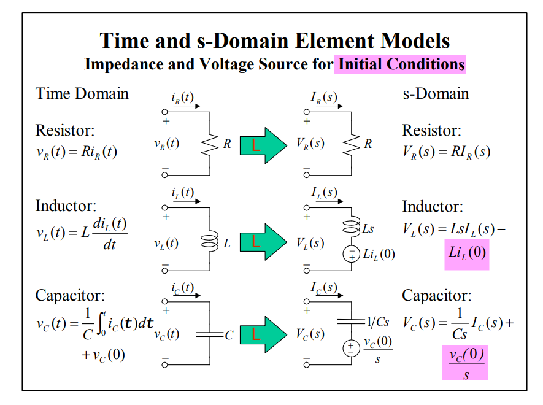

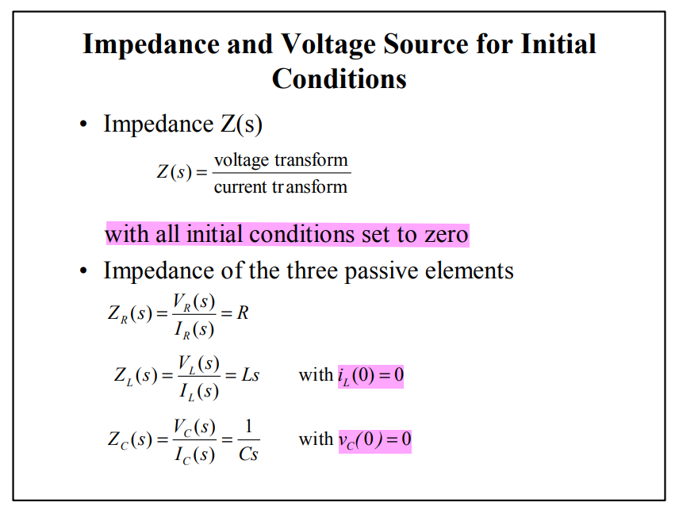

## Sinusoidal Steady-State Analysis

> Here **Sinusoidal** means that source excitations have the form $V_s\cos(\omega t +\theta)$ or $V_s\sin(\omega t+\theta)$
>
> **Steady state** mean that all transient behavior of the stable circuit has died out, i.e., decayed to zero

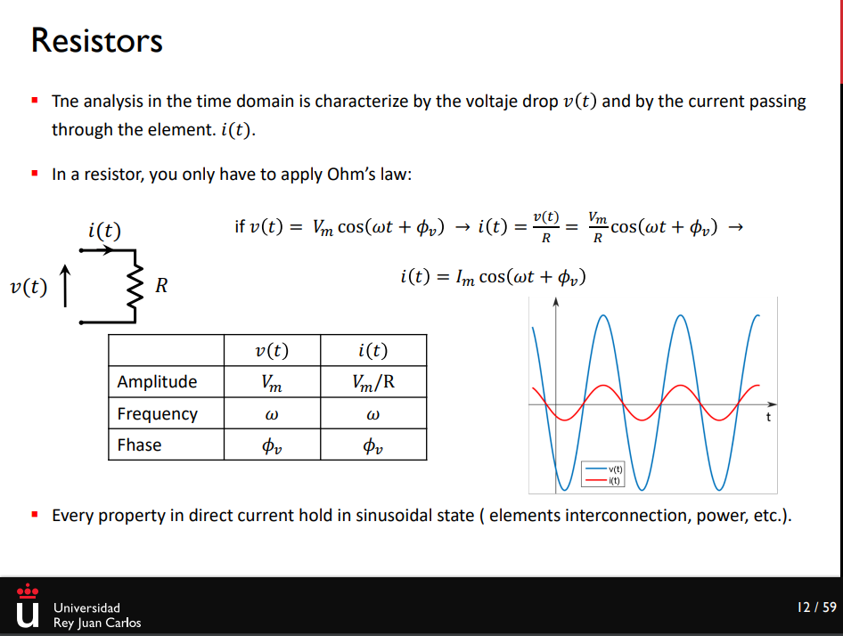

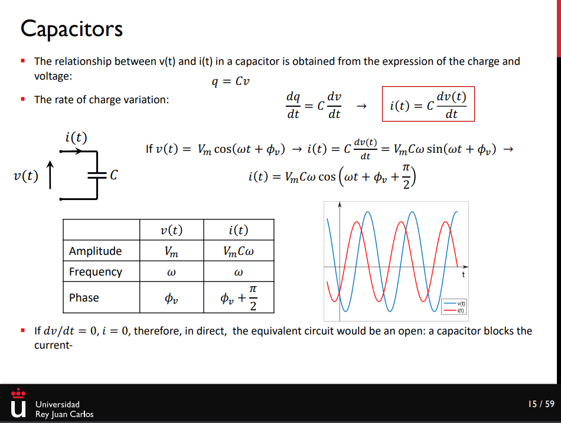

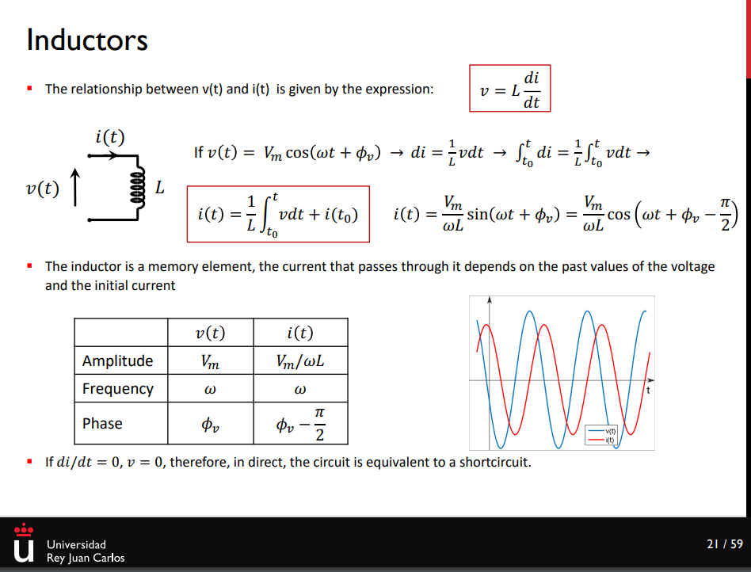

## $s$-domain and phasor-domain

Phasor analysis is a technique to find the *steady-state response* when the system input is a sinusoid. That is, phasor analysis is sinusoidal analysis.

- Phasor analysis is a powerful technique with which to find the steady-state portion of the complete response. 
- Phasor analysis does not find the transient response. 
- Phasor analysis does not find the complete response.

> The beauty of the phasor-domain circuit is that it is described by algebraic KVL and KCL equations with time-invariant sources, not differential equations of time

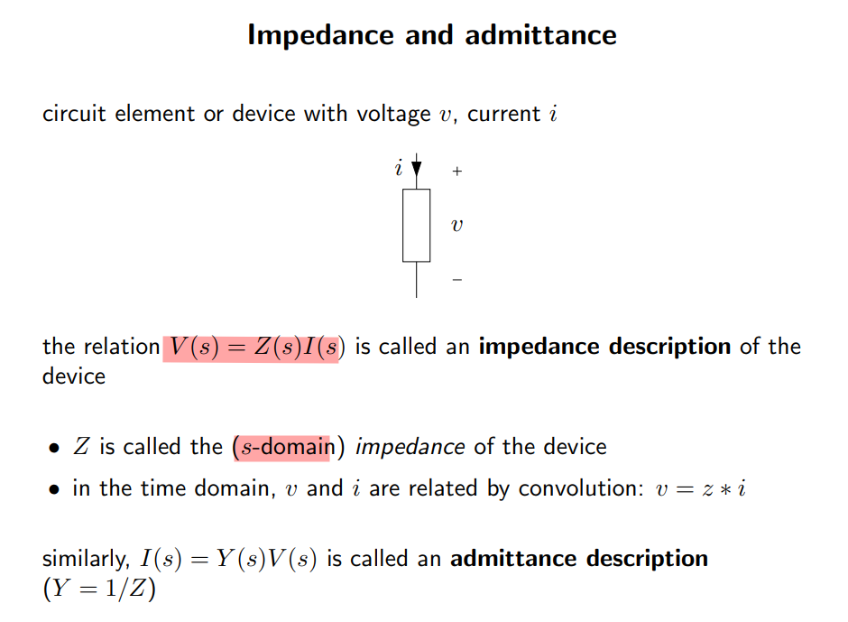

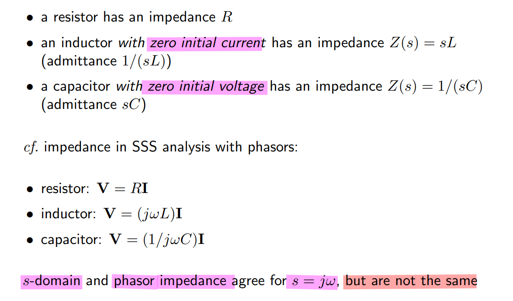

> The difference here is that *Laplace analysis* can also give us the **transient response**

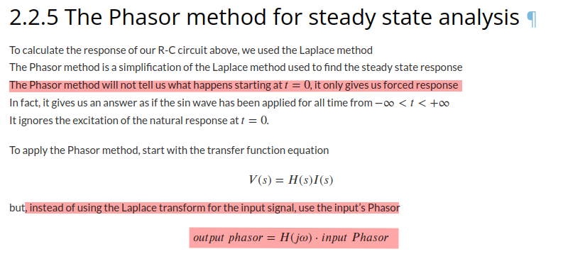

###  General Response Classifications 

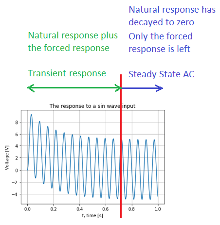

- **zero-input response**, **zero-state response** & **complete response**

  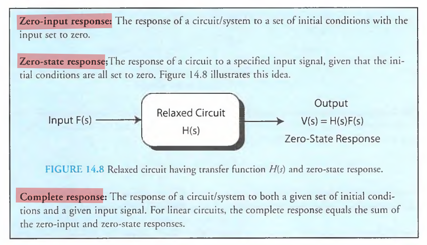

  > The *zero-state response* is given by $\mathscr{L^1}[H(s)F(s)]$, for the arbitrary $s$-domain input $F(s)$
  >
  > where $Z_L(s) = sL$, the inductor with zero initial current $i_L(0)=0$ and $Z_C(s)=1/sC$ with zero initial voltage $v_C(0)=0$

- **transient response** & **steady-state response**

  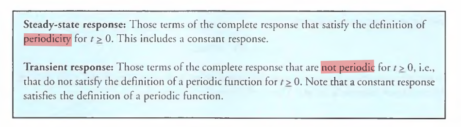

- **natural response** & **forced response**

  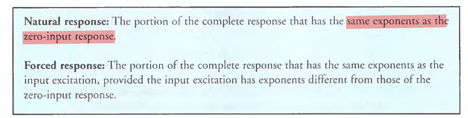

---

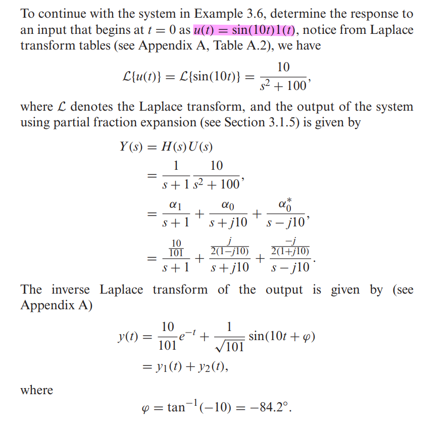

## Transfer Functions and Frequency Response

### transfer function

The **transfer function** $H(s)$ is the ratio of the *Laplace transform* of the output of the system to its input **assuming all zero initial conditions**.

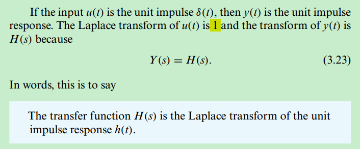

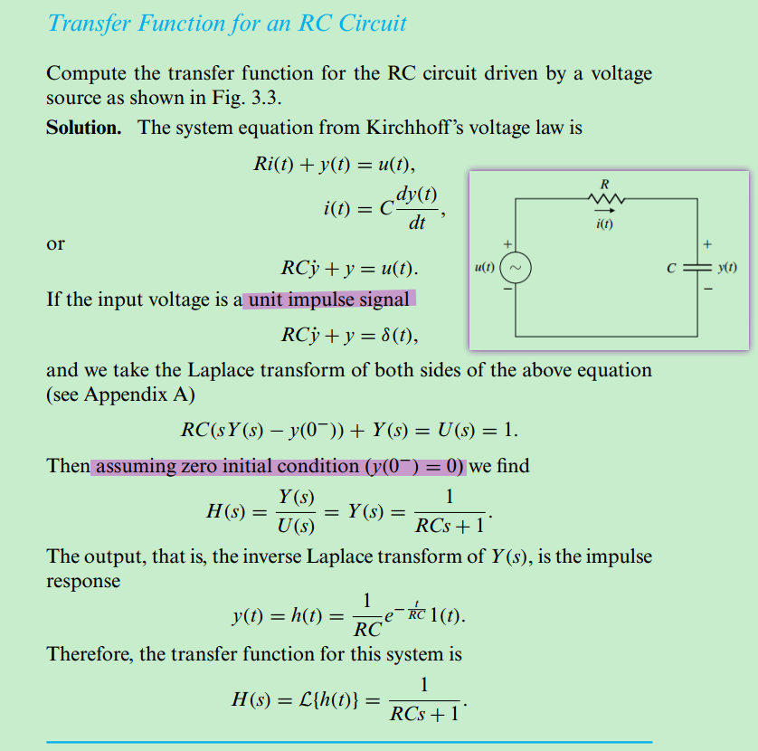

### frequency response

An immediate consequence of *convolution* is that an input of the form $e^{st}$ results in an output
$$
y(t) = H(s)e^{st}
$$
where the specific constant $s$ may be complex, expressed as $s = \sigma + j\omega$

A very common way to use the *exponential response* of LTIs is in finding the **frequency response** i.e. **response to a sinusoid**

First, we express the *sinusoid* as a sum of two *exponential expressions* (Euler’s relation):
$$
\cos(\omega t) = \frac{1}{2}(e^{j\omega t}+e^{-j\omega t})
$$
If we let $s=j\omega$, then $H(-j\omega)=H^*(j\omega)$, in polar form $H(j\omega)=Me^{j\phi}$ and $H(-j\omega)=Me^{-j\phi}$.
$$\begin{align}
y_+(t) & = H(s)e^{st}|_{s=j\omega} = H(j\omega)e^{j\omega t} = M e^{j(\omega t + \phi)} \\
y_-(t) & = H(s)e^{st}|_{s=-j\omega} = H(-j\omega)e^{-j\omega t} = M e^{-j(\omega t + \phi)}
\end{align}$$

By *superposition*, the response to the sum of these two exponentials, which make up the cosine signal, is the sum of the responses
$$\begin{align}
y(t) &= \frac{1}{2}[H(j\omega)e^{j\omega t} + H(-j\omega)e^{-j\omega t}] \\
&= \frac{M}{2}[e^{j(\omega t + \phi)} + e^{-j(\omega t + \phi)}] \\
&= M\cos(\omega t + \phi)
\end{align}$$

where $M = |H(j\omega|$ and $\phi = \angle H(j\omega)$

> This means if a system represented by the transfer function $H(s)$ has a *sinusoidal input*, the output will be *sinusoidal* at the same frequency with magnitude $M$ and will be shifted in phase by the angle $\phi$

### Laplace transform & Fourier transform

- Laplace transforms such as $Y(s)=H(s)U(s)$ can be used to study the **complete response characteristics** of systems, including the *transient response*—that is, the time response to *an initial condition* or *suddenly applied signal* 
- This is in contrast to the use of *Fourier transforms*, which **only take into account the steady-state response**

Given a general linear system with transfer function $H(s)$ and an input signal $u(t)$, the procedure for determining $y(t)$ using the *Laplace transform* is given by the following steps:

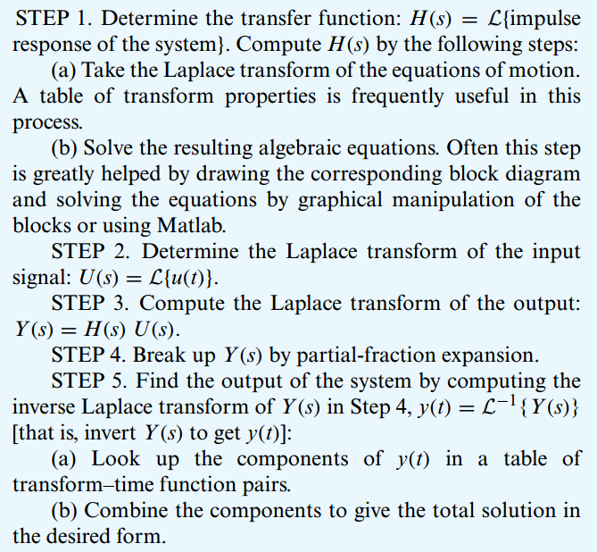

## reference

Ken Kundert. [Introduction to Phasors](http://www.designers-guide.org/Theory/phasors.pdf). *Designer’s Guide Community*. September 2011.

How to Perform Linearity Circuit Analysis [[https://resources.pcb.cadence.com/blog/2021-how-to-perform-linearity-circuit-analysis](https://resources.pcb.cadence.com/blog/2021-how-to-perform-linearity-circuit-analysis )]

Stephen P. Boyd. EE102 Lecture 7 Circuit analysis via Laplace transform [[https://web.stanford.edu/~boyd/ee102/laplace_ckts.pdf]](https://web.stanford.edu/~boyd/ee102/laplace_ckts.pdf)

Cheng-Kok Koh, EE695K VLSI Interconnect, S-Domain Analysis [[https://engineering.purdue.edu/~chengkok/ee695K/lec3c.pdf](https://engineering.purdue.edu/~chengkok/ee695K/lec3c.pdf)]

Kenneth R. Demarest, Circuit Analysis using Phasors, Laplace Transforms, and Network Functions [[https://people.eecs.ku.edu/~demarest/212/Phasor%20and%20Laplace%20review.pdf](https://people.eecs.ku.edu/~demarest/212/Phasor%20and%20Laplace%20review.pdf)]

DeCarlo, R. A., & Lin, P.-M. (2009). *Linear circuit analysis : time domain, phasor, and Laplace transform approaches* (3rd ed).

Davis, Artice M.. "Linear Circuit Analysis." *The Electrical Engineering Handbook - Six Volume Set* (1998)

Duane Marcy, Fundamentals of Linear Systems [[http://lcs-vc-marcy.syr.edu:8080/Chapter22.html](http://lcs-vc-marcy.syr.edu:8080/Chapter22.html)]

*Gene F. Franklin, J. David Powell, and Abbas Emami-Naeini. 2018. Feedback Control of Dynamic Systems (8th Edition) (8th. ed.). Pearson.*
