## Frequency Domain Model

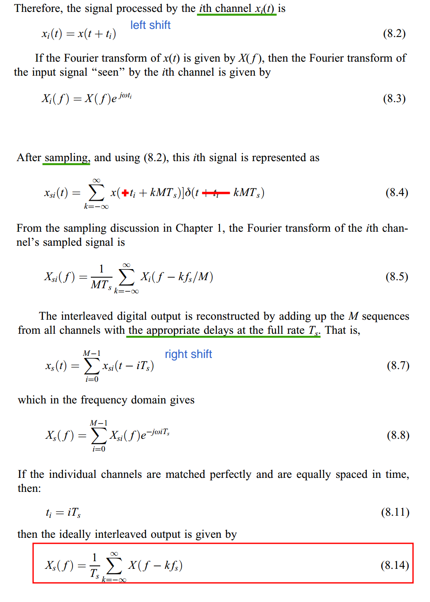

## Skew (Timing Mismatch) Calibration

*TODO* &#128197;

> M. Gu, Y. Tao, Y. Zhong, L. Jie and N. Sun, "Timing-Skew Calibration Techniques in Time-Interleaved ADCs," in *IEEE Open Journal of the Solid-State Circuits Society*, vol. 5, pp. 1-10, 2025 [[https://ieeexplore.ieee.org/stamp/stamp.jsp?tp=&arnumber=10804623](https://ieeexplore.ieee.org/stamp/stamp.jsp?tp=&arnumber=10804623)]
>
> S. Chen, L. Wang, H. Zhang, R. Murugesu, D. Dunwell, A. Chan Carusone, “All-Digital Calibration of Timing Mismatch Error in Time-Interleaved Analog-to-Digital Converters,” *IEEE Transactions on VLSI Systems*, Sept. 2017. [[PDF](https://www.eecg.utoronto.ca/~tcc/Chen_TVLSI17.pdf), [slides](https://www.eecg.utoronto.ca/~tcc/Wang_ISCAS_SLIDES_2018.pdf)]
>
> B. Razavi, "Problem of timing mismatch in interleaved ADCs," *Proceedings of the IEEE 2012 Custom Integrated Circuits Conference*, San Jose, CA, USA, 2012 [[https://www.seas.ucla.edu/brweb/papers/Conferences/BRCICC12.pdf](https://www.seas.ucla.edu/brweb/papers/Conferences/BRCICC12.pdf)]

## resync (alignment)

*TODO* &#128197;

## Multi-Phase Clock Generation (MPCG)

*TODO* &#128197;

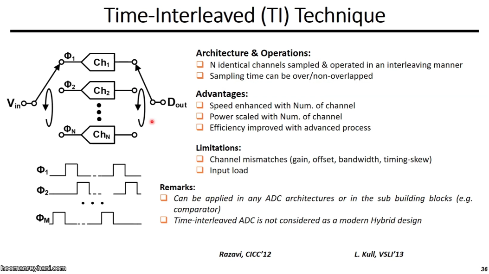

## Interleaver

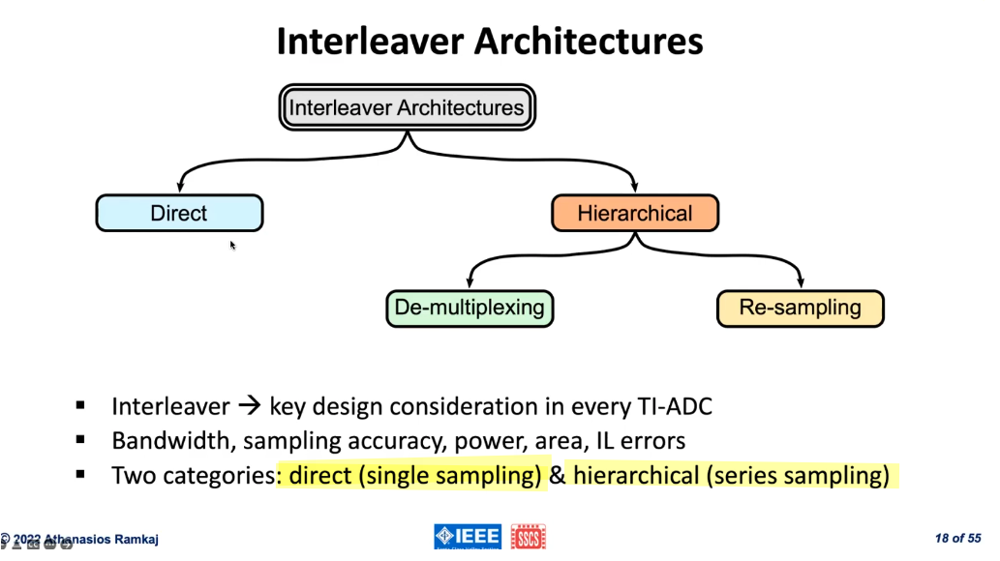

### Direct Interleaver

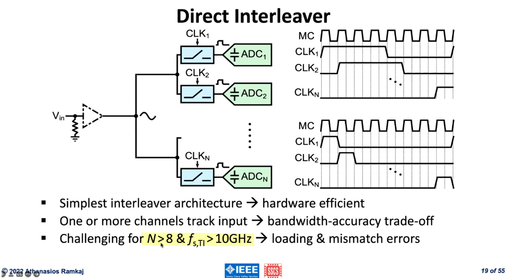

> similar to increase the resolution of the flash ADC with *more* parallel comparators

### De-multiplexing Interleaver

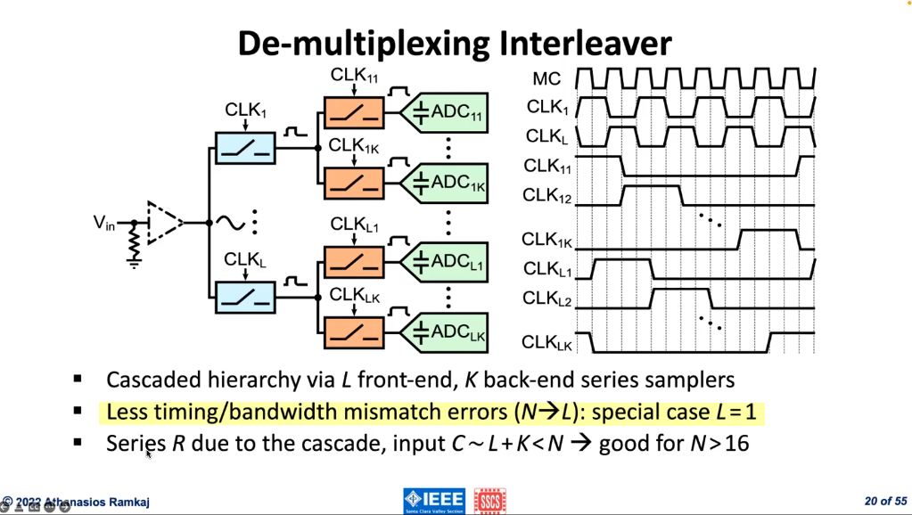

> it is the *front-end samplers* that determine *timing/bandwidth mismatch errors*

### Re-sampling Interleaver

 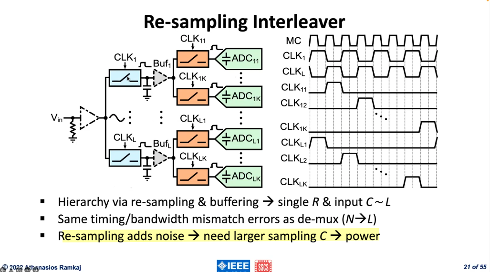

> back-end re-sampling occur after the front-end,  two $\frac{KT}{C}$ contribution in total noise (De-multiplexing Interleaver only one $\frac{KT}{C}$)
>
> without buffer, charging distribution reduce signal and reduce SNR, but buffers give excess noise

### Interleaver Model

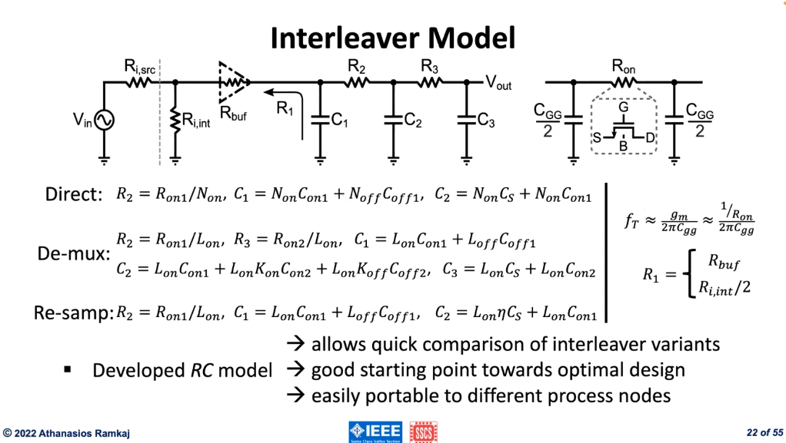

## Interleaving Errors

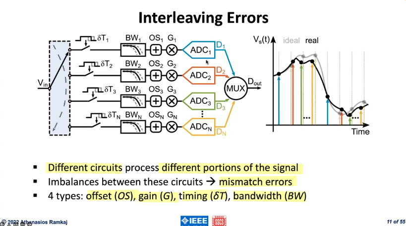

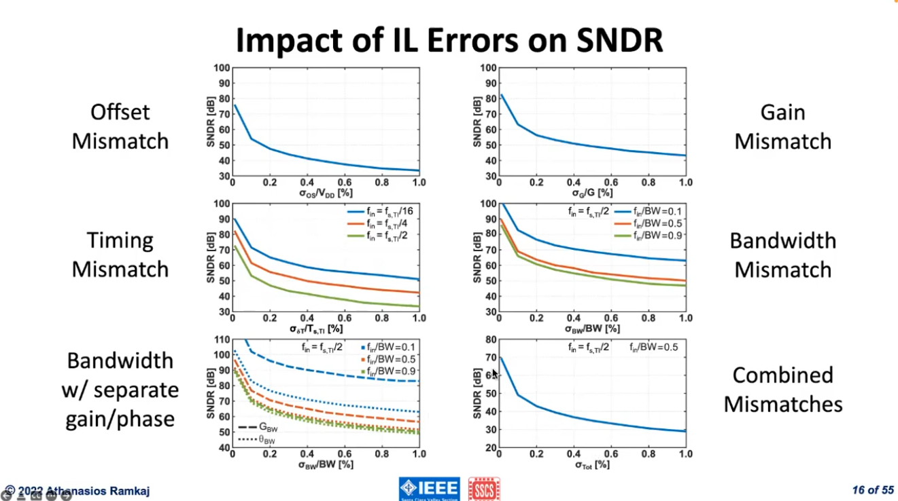

### Offset Mismatch Error

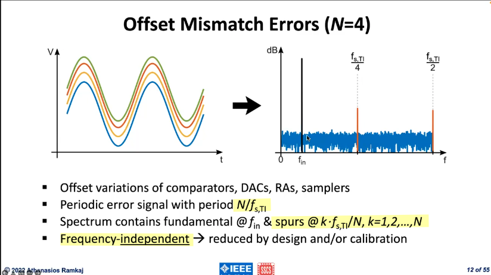

### Gain Mismatch Error

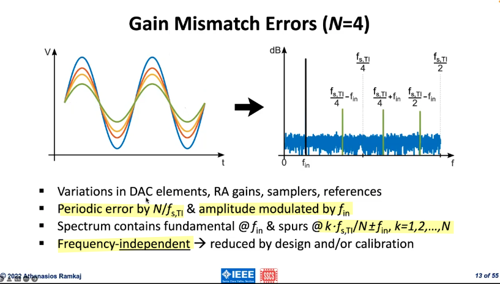

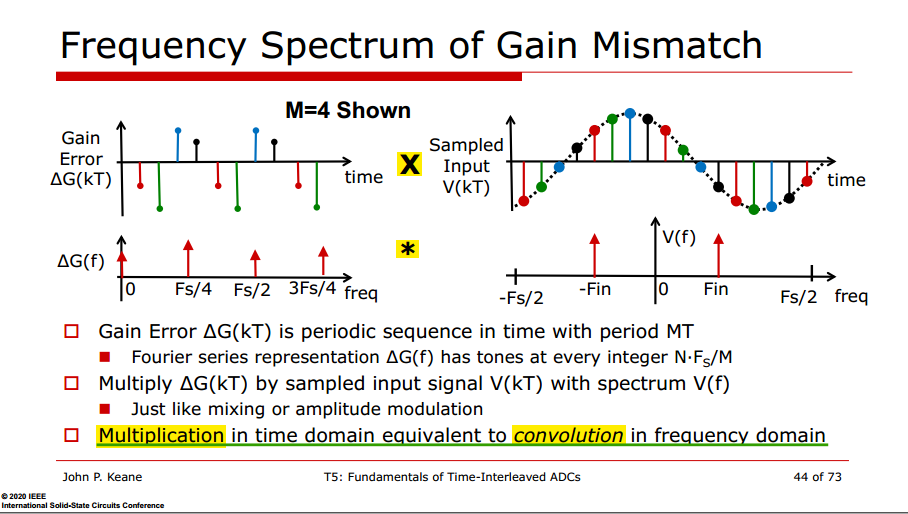

### Timing Mismatch Error

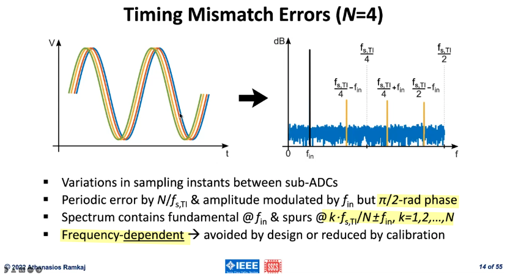

$\pi/2$-rad phase: the maximum error occurs at the ***zero crossing*** and not on the peaks (Gain Mismatch error)

Frequency-dependent: the *higher* frequency input signal $f_\text{in}$, the *larger* error becomes

> 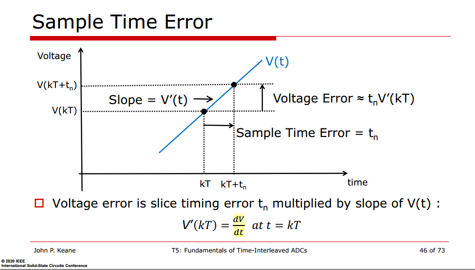
>
> 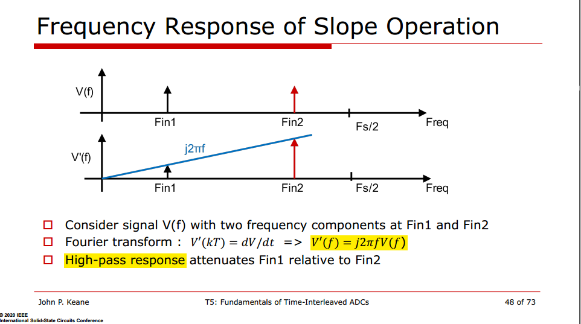
>
> $\pi/2$ phase shift
> $$
> e^{j\pi/2} = j
> $$
> frequency-dependent
> $$
> V^{'} \propto  f
> $$
>
> In time domain
> $$
> \frac{d\sin(\omega t)}{dt} = \omega \cos(\omega t) \propto \omega
> $$

### Bandwidth Mismatch Errors 

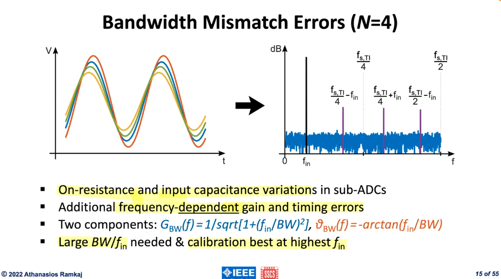

> 

## Overlapping versus Non-overlapping track time

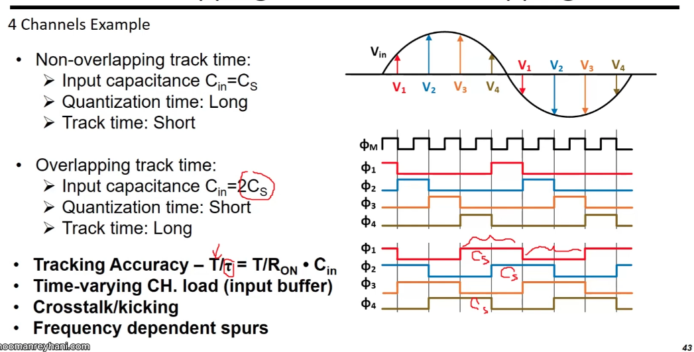

tracking accuracy stay same, Cin (2Cs) counteract the longer tracking

## Summing Interleaved Alias

The sampling function - impulse train is
$$
s(t) = \sum_{n=-\infty}^{\infty}\left[ \delta(t-n4T_s) + \delta(t-n4T_s-T_s) + \delta(t-n4T_s-2T_s) + \delta(t-n4T_s-3T_s)\right]
$$

Its Fourier transform is
$$\begin{align}
S(f) &= \frac{2\pi}{4T}\sum_{k=-\infty}^{\infty}\left[\delta(f-k\frac{f_s}{4}) + e^{-j2\pi f\cdot T_s}\delta(f-k\frac{f_s}{4}) + e^{-j2\pi f\cdot 2T_s}\delta(f-k\frac{f_s}{4}) + e^{-j2\pi f\cdot 3T_s}\delta(f-k\frac{f_s}{4})  \right] \\
&= \frac{2\pi}{4T}\sum_{k=-\infty}^{\infty}\left(1+e^{-j2\pi\frac{f}{f_s}} + e^{-j4\pi\frac{f}{f_s}} + e^{-j6\pi\frac{f}{f_s}}  \right) \delta(f-k\frac{f_s}{4}) \\
&= \frac{2\pi}{4T}\sum_{k=-\infty}^{\infty}\left(1+e^{-jk\frac{\pi}{2}} + e^{-jk\pi} + e^{-jk\frac{3\pi}{2}}  \right) \delta(f-k\frac{f_s}{4})
\end{align}$$

We define $M[k] = 1+e^{-jk\frac{\pi}{2}} + e^{-jk\pi} + e^{-jk\frac{3\pi}{2}}$, which is periodic, i.e. $M[k]=M[k+4]$
$$
M[k]=\left\{ \begin{array}{cl}
4 & : \ k = 4m \\
0 & : \ k=4m+1 \\
0 & : \ k=4m+2 \\
0 & : \ k=4m+3 \\
\end{array} \right.
$$

That is
$$
S(f) = \frac{2\pi}{T}\sum_{k=-\infty}^{\infty} \delta(f-kf_s)
$$

Alias has same frequency for each slice but **different phase**: Alias terms sum to **zero** if all slices match exactly

## Random Chopping in TI-ADC

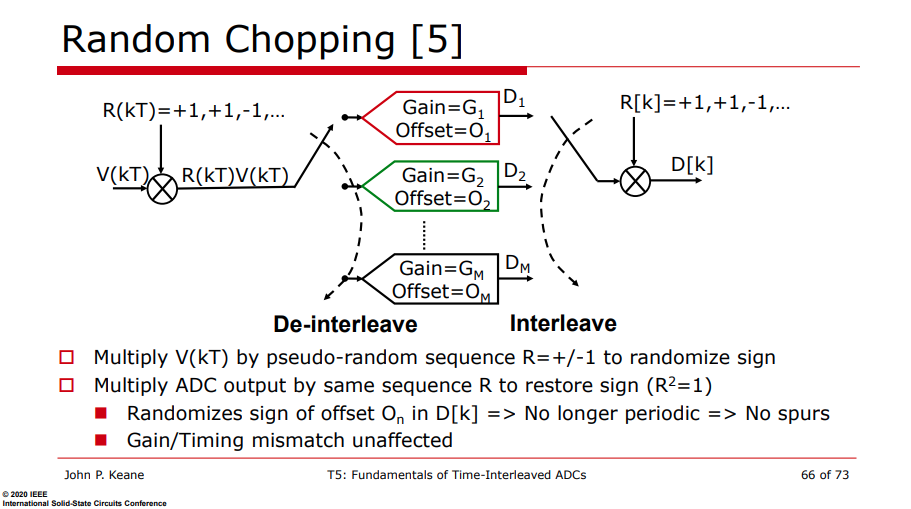

$$
D_n(kT) = (G_n R(kT) V(kT) + O_n)R(kT)= C_n V(kT) + R(kT)O_n
$$

## ADC buffers & memory effect

> Y. Shifman, Y. Krupnik, U. Virobnik, A. Khairi, Y. Sanhedrai and A. Cohen, "A 1.64mW Differential Super Source-Follower Buffer with 9.7GHz BW and 43dB PSRR for Time-Interleaved ADC Applications in 10nm," *2019 IEEE Asian Solid-State Circuits Conference (A-SSCC)*, Macau, Macao, 2019  [[pdf](https://sci-hub.se/10.1109/A-SSCC47793.2019.9056969)]
>
> E. -H. Chen *et al*., "7.1 A 212.5Gb/s DSP-Based PAM-4 Transceiver with 50dB Loss Compensation for Large AI System Interconnects in 4nm FinFET," *2025 IEEE International Solid-State Circuits Conference (ISSCC)*, San Francisco, CA, USA, 2025

*TODO* &#128197;

## Paper from industry

> Z. Guo et al., "A 112.5Gb/s ADC-DSP-Based PAM-4 Long-Reach Transceiver with >50dB Channel Loss in 5nm FinFET," 2022 IEEE International Solid-State Circuits Conference (ISSCC), San Francisco, CA, USA, 2022 [[https://sci-hub.st/10.1109/ISSCC42614.2022.9731650](https://sci-hub.st/10.1109/ISSCC42614.2022.9731650)]

---

> P. Liu et al., "A 128Gb/s ADC/DAC Based PAM-4 Transceiver with >45dB Reach in 3nm FinFET," 2025 Symposium on VLSI Technology and Circuits (VLSI Technology and Circuits), Kyoto, Japan, 2025

---

ISSCC.2024 7.3 A 224Gbs 3pJb 40dB Insertion Loss Transceiver in 3nm FinFET CMOS [[7.3 A 224Gbs 3pJb 40dB Insertion Loss Transceiver in 3nm FinFET CMOS https://www.bilibili.com/video/BV18hYCe7E45/?share_source=copy_web&vd_source=5a095c2d604a5d4392ea78fa2bbc7249]([7.3 A 224Gbs 3pJb 40dB Insertion Loss Transceiver in 3nm FinFET CMOS] https://www.bilibili.com/video/BV18hYCe7E45/?share_source=copy_web&vd_source=5a095c2d604a5d4392ea78fa2bbc7249)]

ISSCC.2018 6.4 A Fully Adaptive 19-to-56Gb/s PAM-4 Wireline Transceiver with a Configurable ADC in 16nm FinFET [[https://sci-hub.st/10.1109/ISSCC.2018.8310207](https://sci-hub.st/10.1109/ISSCC.2018.8310207)]

M. S. Jalali, A. Sheikholeslami, M. Kibune and H. Tamura, "A Reference-Less Single-Loop Half-Rate Binary CDR," in *IEEE Journal of Solid-State Circuits*, vol. 50, no. 9, pp. 2037-2047, Sept. 2015 [[https://www.eecg.utoronto.ca/~ali/papers/jssc2015-09.pdf](https://www.eecg.utoronto.ca/~ali/papers/jssc2015-09.pdf)]

Pisati, et.al., "Sub-250mW 1-to-56Gb/s Continuous-Range PAM-4 42.5dB IL ADC/DAC- Based Transceiver in 7nm FinFET," 2019 IEEE International Solid-State Circuits Conference (ISSCC), 2019 [[https://sci-hub.se/10.1109/ISSCC.2019.8662428](https://sci-hub.se/10.1109/ISSCC.2019.8662428)]

## reference

John P. Keane, ISSCC2020 T5: "Fundamentals of Time-Interleaved ADCs" [[https://www.nishanchettri.com/isscc-slides/2020%20ISSCC/TUTORIALS/T5Visuals.pdf](https://www.nishanchettri.com/isscc-slides/2020%20ISSCC/TUTORIALS/T5Visuals.pdf)]

Yohan Frans, CICC2019 ES3-3- "ADC-based Wireline Transceivers" [[pdf](https://ieeexplore.ieee.org/stamp/stamp.jsp?arnumber=8780306)]

Samuel Palermo, ISSCC 2018 T10: ADC-Based Serial Links: Design and Analysis [[https://www.nishanchettri.com/isscc-slides/2018%20ISSCC/TUTORIALS/T10/T10Visuals.pdf](https://www.nishanchettri.com/isscc-slides/2018%20ISSCC/TUTORIALS/T10/T10Visuals.pdf)]

ISSCC2015 F1: High-Speed Interleaved ADCs [[https://picture.iczhiku.com/resource/eetop/wykrheUfrWasiMVX.pdf](https://picture.iczhiku.com/resource/eetop/wykrheUfrWasiMVX.pdf)]

Poulton, Ken. ISSCC2009  "Time-Interleaved ADCs, Past and Future" [(slides)](http://poulton.net/papers.public/2009_isscc_se0604_interleaving.pdf)

—. CICC2010 "GHz ADCs: From Exotic to Mainstream", tutorial session, [(slides)](http://poulton.net/papers.public/2010_cicc_GHz_ADCs.pdf)

—. ISSCC2015 "Interleaved ADCs Through the Ages", [(slides)](http://poulton.net/papers.public/2015isscc_interleaved.forum.pdf)

Ewout Martens. ESSCIRC 2019 Tutorials: Advanced Techniques for ADCs for 5G Massive MIMO [[https://youtu.be/7hYichGGU6k](https://youtu.be/7hYichGGU6k)]

Athanasios Ramkaj. January 26, 2022, IEEE SSCS Santa Clara Valley Section Technical Talk: Design Considerations Towards Optimal High-Resolution Wide-Bandwidth Time-Interleaved ADCs [[https://youtu.be/k3jY9NtfYlY](https://youtu.be/k3jY9NtfYlY)]

---

Ahmed M. A. Ali 2016, "High Speed Data Converters" [[pdf](https://picture.iczhiku.com/resource/eetop/sYKhdRGJFFGyZbcB.pdf)]

S. Jang, J. Lee, Y. Choi, D. Kim, and G. Kim, "[Recent advances in ultra-high-speed wireline receivers with ADC-DSP-based equalizers](https://ieeexplore.ieee.org/document/10767763)," *IEEE* *Open Journal of the Solid-State Circuits Society* (OJ-SSCS), vol. 4, pp. 290-304, Nov. 2024.

Yida Duan. Design Techniques for Ultra-High-Speed Time-Interleaved Analog-to-Digital Converters (ADCs) [[http://www2.eecs.berkeley.edu/Pubs/TechRpts/2017/EECS-2017-10.pdf](http://www2.eecs.berkeley.edu/Pubs/TechRpts/2017/EECS-2017-10.pdf)]

Preview Lecture #1 - "Extreme SAR ADCs" Online Course (2024) - Prof. Chi-Hang Chan (U. of Macau) [[https://youtu.be/rgMRL4QZ-wA](https://youtu.be/rgMRL4QZ-wA)]

