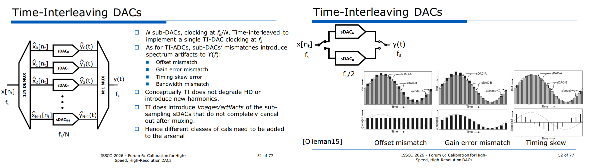
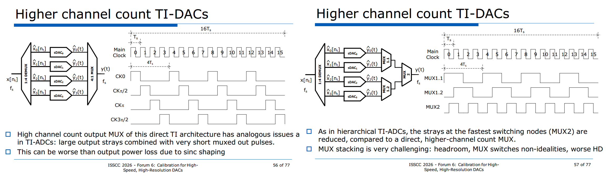
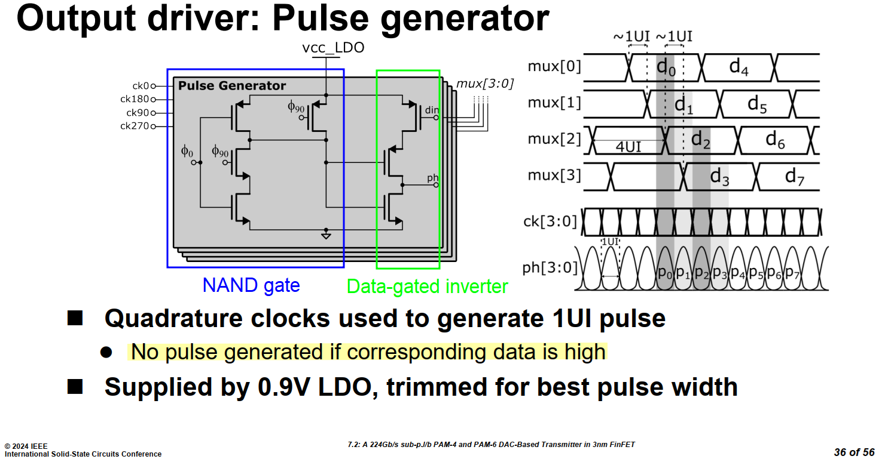
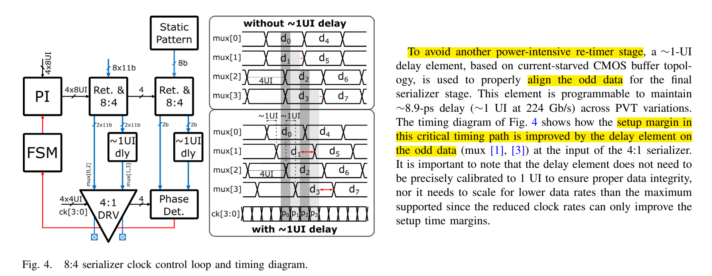

## 4:1 mux

> M. Cusmai *et al*., "7.2 A 224Gb/s sub pJ/b PAM-4 and PAM-6 DAC-Based Transmitter in 3nm FinFET," *2024 IEEE International Solid-State Circuits Conference (ISSCC)*, San Francisco, CA, USA, 2024, pp. 126-128, doi: 10.1109/ISSCC49657.2024.10454558.
>
> —, "A 0.92-pJ/b PAM-4 and 0.61-pJ/b PAM-6 224-Gb/s DAC-Based Transmitter in 3-nm FinFET," in *IEEE Journal of Solid-State Circuits*, vol. 60, no. 1, pp. 23-34, Jan. 2025, doi: 10.1109/JSSC.2024.3456672

> actually, it is hold margin, that is improve by the element

## reference

Schmidt, C. (2020). Interleaving Concepts for Digital-to-Analog Converters. Springer Vieweg, Wiesbaden.

Gabriele Manganaro, MediaTek, ISSCC 2026 - Forum 6: Calibration for HighSpeed, High-Resolution DACs

W.-C. Kim, D. -s. Jo, Y. -J. Roh, Y. -D. Kim and S. -T. Ryu, "A 6b 28GS/s Four-channel Time-interleaved
Current-Steering DAC with Background Clock Phase Calibration," 2019 Symposium on VLSI Circuits, Kyoto,
Japan, 2019, pp. [[https://sci-hub.ru/10.23919/VLSIC.2019.8778096](https://sci-hub.ru/10.23919/VLSIC.2019.8778096)]

E. Olieman, A. -J. Annema and B. Nauta, "An Interleaved Full Nyquist High-Speed DAC Technique," in *IEEE Journal of Solid-State Circuits*, vol. 50, no. 3, pp. 704-713, March 2015 [[https://sci-hub.ru/10.1109/JSSC.2014.2387946](https://sci-hub.ru/10.1109/JSSC.2014.2387946)]

