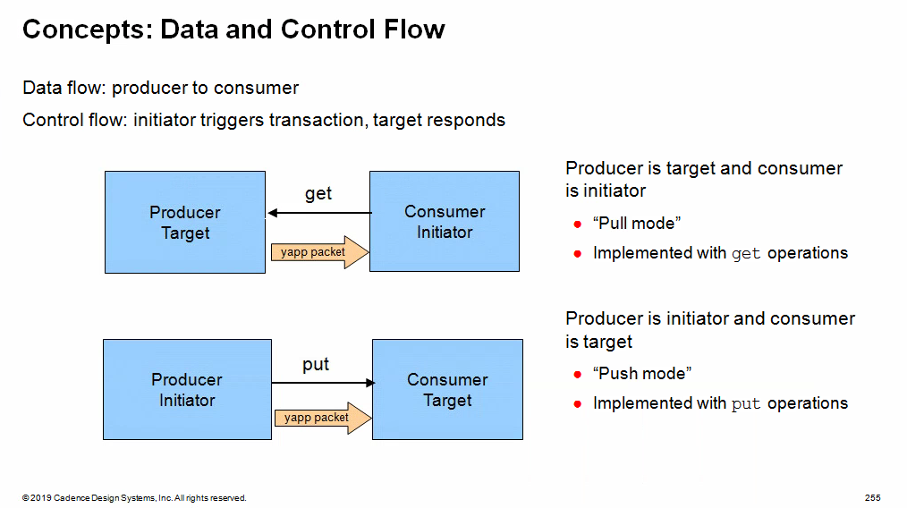
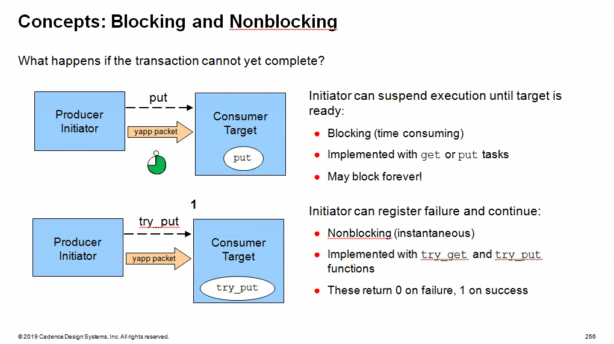
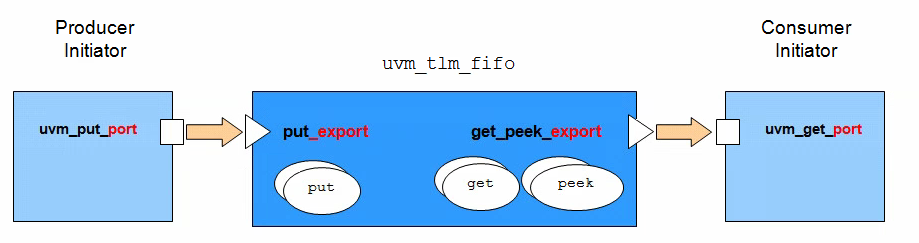
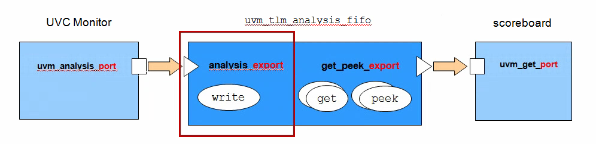
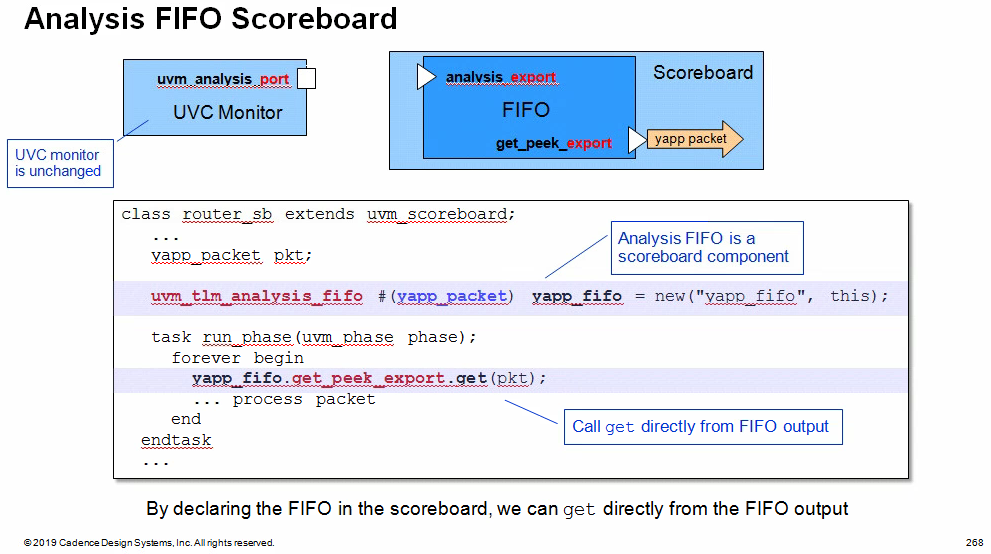
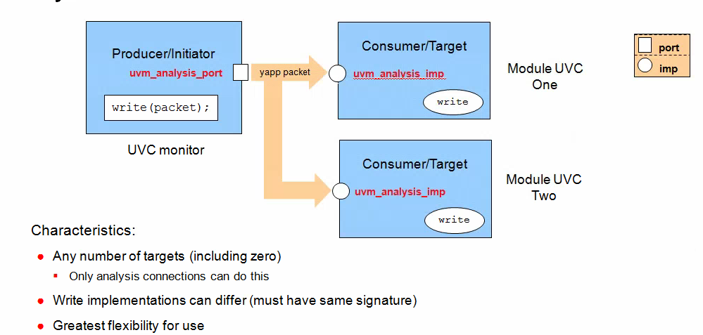
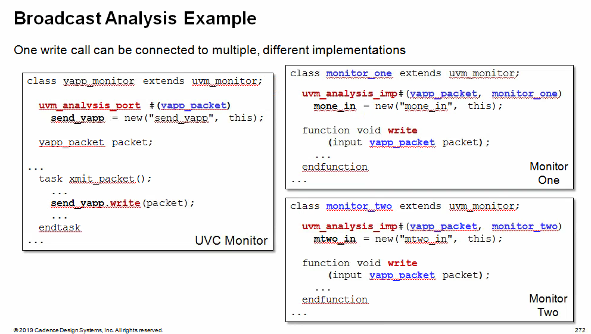
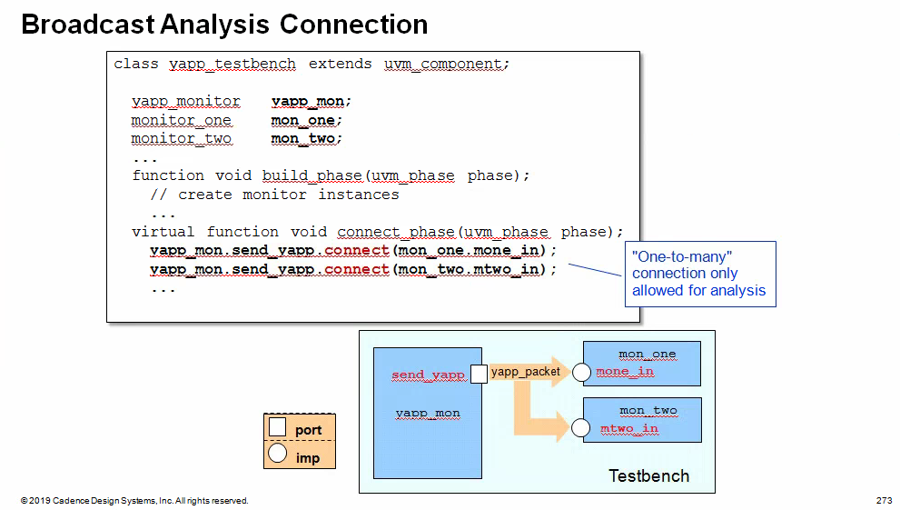
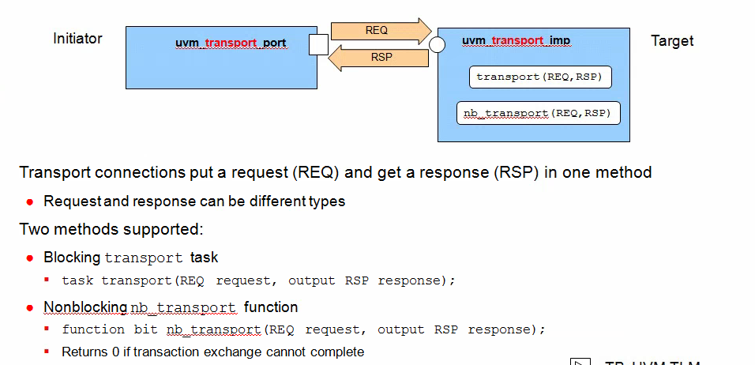

- **Blocking methods** are defined with `get()` or `put()` **tasks** to allow them to consume time
- **Non-blocking methods** are defined with `try_get()` or `try_put()` **functions** as they execute in zero time

## Uni-Directional TLM Methods Reference

| **Method**   | **Description**                                              | **Syntax**                                    |
| ------------ | ------------------------------------------------------------ | --------------------------------------------- |
| `put()`      | Blocking put                                                 | `virtual task put(iput TR t);`                |
| `try_put()`  | Nonblocking put<br />-return 1 if successful<br />-return 0 if not | `virtual function bit try_put(input TR t);`   |
| `can_put()`  | Nonblocking test put<br />-return 1 if put would be successful<br />-return 0 if not | `virtual function bit can_put();`             |
| `get()`      | Blocking get                                                 | `virtual task get(output TR t);`              |
| `try_get()`  | Nonblocking get<br />-return 1 if successful<br />-return 0 if not | `virtual function bit try_get(output TR t);`  |
| `can_get()`  | Nonblocking test get<br />-return 1 if get would be successful<br />-return 0 if not | `virtual function bit can_get();`             |
| `peek()`     | Blocking peek                                                | `virtual task peek(output TR t);`             |
| `try_peek()` | Nonblocking peek<br />-return 1 if successful<br />-return 0 if not | `virtual function bit try_peek(output TR t);` |
| `can_peek`   | Nonblocking test peek<br />-return 1 if peek would be successful<br />-return 0 if not | `virtual function bit can_peek();`            |

> The `peek()` methods are similarly to the `get()` methods, but **copy** the transaction instead of **removing** it. The transaction is not consumed, and a subsequent `get` or `peek` operation will return the *same* transaction

## Selected Connector and Method Options

|                              | `put`   | `try_put` | `can_put` | `get`   | `try_get` | `can_get` | `peek`  | `try_peed` | `can_peek` |
| ---------------------------- | ------- | --------- | --------- | ------- | --------- | --------- | ------- | ---------- | ---------- |
| `uvm_put_*`                  | &check; | &check;   | &check;   |         |           |           |         |            |            |
| `uvm_blocking_put_*`         | &check; |           |           |         |           |           |         |            |            |
| `uvm_nonblocking_put_*`      |         | &check;   | &check;   |         |           |           |         |            |            |
| `uvm_get_*`                  |         |           |           | &check; | &check;   | &check;   |         |            |            |
| `uvm_blocking_get_*`         |         |           |           | &check; |           |           |         |            |            |
| `uvm_nonblocking_get_*`      |         |           |           |         | &check;   | &check;   |         |            |            |
| `uvm_get_peek_*`             |         |           |           | &check; | &check;   | &check;   | &check; | &check;    | &check;    |
| `uvm_blocking_get_peek_*`    |         |           |           | &check; |           |           | &check; |            |            |
| `uvm_nonblocking_get_peek_*` |         |           |           |         | &check;   | &check;   |         | &check;    | &check;    |

> in the connectors above, `*` can be replaced by `port`, `imp`, or `export`
>
> All the methods for a specific connector type **MUST** be implemented. If you define an `uvm_put` connection between two compoents, then the component with the `uvm_put_imp` object must provide implementations of **ALL** three put methods, `put`, `try_put` and `can_put`, even if these methods are not explicitly called

## TLM FIFO

The TLM FIFO is a FIFO component wrapped in `get` and `put` `imp` connectors. This has the benefit of data storage as well as providing implementations of the communication methods. Components connected to the TLM FIFO are in control of data transfer and can simply defined port connectors to initiate read and write operations on the FIFO

### uvm_tlm_fifo



The TLM FIFO object is effectively a FIFO component instantiated between and connected to two components. The FIFO contains `imp` connectors for the standard TLM `put` and `get`/`peek` interfaces, therefore the user does not have to define`imp` ports or communication methods and the FIRO takes care of data storage

The advantages are:

- The user does not need to define communication methods or `imp` connectors
- The FIFO provides data storage between the `write` (`put`) and `read` (`get`/`peek`) components
- There are a number of built-in methods for checking FIFO status

The disadvantages are:

- The user must now initiate both sides of the transfer (both `get`/`peek` and `put`) to complete the transaction
- Two connections must be made (both sides of the FIFO) rather than one


The `put_export` and `get_peek_export` connection objects have alternatives which provide subsets of the full connector. For example, `blocking_put_export` and `nonblocking_put_export` can replace `put_export`. `blocking_get_export`, `nonblocking_get_export` and `get_export` (as well as others) can replace `get_peek_export`.

#### built-in methods

| Method     | Description                                                  | Syntax                                                       |
| ---------- | ------------------------------------------------------------ | ------------------------------------------------------------ |
| `new`      | Standard component constructor with an additional third argument, `size`, which sets the maximum FIFO size. Default size is 1. A size of **0** is an unbounded FIFO | `function new(string name, uvm_component parent=null, int size=1);` |
| `size`     | Return size of FIFO. **0** indicates unbounded FIFO          | `virtual function int size()`                                |
| `used`     | Return number of entries written to the FIFO                 | `virtual function int used();`                               |
| `is_empty` | Return **1** if `used()` is 0, otherwise **0**               | `virtual function bit is empty();`                           |
| `is_full`  | Return 1 if `used()` is equal to `size`, otherwise **0**     | `virtual function bit is_full()`                             |
| `flush`    | Delete all entries from the FIFO, upon which `used()` is **0** and `is_empty()` is **1** | `virtual funciton void flush();`                             |


```verilog
class uvm_tlm_fifo #(type T=int) extends uvm_tlm_fifo_base #(T);
    ...
endclass    
```

```verilog
virtual class uvm_tlm_fifo_base #(type T=int) extends uvm_component;
    uvm_put_imp #(T, this_type) put_export;
    
    uvm_get_peek_imp #(T, this_type) get_peek_export;
    
    uvm_analysis_port #(T) put_ap;
    
    uvm_analysis_port #(T) get_ap;
    
    // The following are aliases to the above put_export
    uvm_put_imp      #(T, this_type) blocking_put_export;
    uvm_put_imp      #(T, this_type) nonblocking_put_export;
    
    // The following are all aliased to the above get_peek_export, which provides
    // the superset of these interfaces.
    uvm_get_peek_imp #(T, this_type) blocking_get_export;
    uvm_get_peek_imp #(T, this_type) nonblocking_get_export;
    uvm_get_peek_imp #(T, this_type) get_export;
    
    uvm_get_peek_imp #(T, this_type) blocking_peek_export;
    uvm_get_peek_imp #(T, this_type) nonblocking_peek_export;
    uvm_get_peek_imp #(T, this_type) peek_export;
    
    uvm_get_peek_imp #(T, this_type) blocking_get_peek_export;
    uvm_get_peek_imp #(T, this_type) nonblocking_get_peek_export;
    
    function new(string name, uvm_component parent = null);
        super.new(name, parent);
        
        put_export = new("put_export", this);
        blocking_put_export     = put_export;
        nonblocking_put_export  = put_export;
        
        get_peek_export = new("get_peek_export", this);
        blocking_get_peek_export    = get_peek_export;
        nonblocking_get_peek_export = get_peek_export;
        blocking_get_export         = get_peek_export;
        nonblocking_get_export      = get_peek_export;
        get_export                  = get_peek_export;
        blocking_peek_export        = get_peek_export;
        nonblocking_peek_export     = get_peek_export;
        peek_export                 = get_peek_export;
        
        put_ap = new("put_ap", this);
        get_ap = new("get_ap", this);
        
    endfunction
```


## Analysis FIFO

### uvm_tlm_analysis_fifo



`uvm_tlm_analysis_fifo` is a specialization of `uvm_tlm_fifo`

- Intended to buffer write transactions between the UVC monitor analysis port and scoreboard

It has the following characteristics:

- Unbounded (size=0)
- `analysis_export` connector replaces `put_export`
  - Support the analysis `write` method



> By declaring the FIFO in the scoreboard, we can `get` directly from the FIFO output. 
>
> However the write side connection of the FIFO to the interface UVC monitor analysis port must be made (usually) in the testbench which has visibility of both UVC and scoreboard components. The connection is made using a connect method call inside the connect phase method

```verilog
class uvm_tlm_analysis_fifo #(type T = int) extends uvm_tlm_fifo #(T);

  // Port: analysis_export #(T)
  //  
  // The analysis_export provides the write method to all connected analysis
  // ports and parent exports:
  //  
  //|  function void write (T t)
  //  
  // Access via ports bound to this export is the normal mechanism for writing
  // to an analysis FIFO. 
  // See write method of <uvm_tlm_if_base #(T1,T2)> for more information.

  uvm_analysis_imp #(T, uvm_tlm_analysis_fifo #(T)) analysis_export;


  // Function: new
  //  
  // This is the standard uvm_component constructor. ~name~ is the local name
  // of this component. The ~parent~ should be left unspecified when this
  // component is instantiated in statically elaborated constructs and must be
  // specified when this component is a child of another UVM component.

  function new(string name ,  uvm_component parent = null);
    super.new(name, parent, 0); // analysis fifo must be unbounded
    analysis_export = new("analysis_export", this);
  endfunction

  const static string type_name = "uvm_tlm_analysis_fifo #(T)";

  virtual function string get_type_name();
    return type_name;
  endfunction

  function void write(input T t); 
    void'(this.try_put(t)); // unbounded => must succeed
  endfunction

endclass
```


## Analysis Port Broadcast



Analysis ports can (uniquely) be connected to any number of `imp` connectors, including zero



The analysis port in component *yapp_monitor* will be connected to both *monitor_one* and *monitor_two* components. Each of the receiving components has an *analysis imp object* and a write communication method declared. The write method must have the same signature - i.e., they must be void functions called write with a single input argument of type *yapp_packet*, but their implementations can be completely different.

When the `send_yapp` prot is connected to both *mone_in* and *mtwo_in* imps, then a single write call from *yapp_monitor* executes both write implementations in *monitor_one* and *monitor_two*



For non-analysis connections

- the TLM object must be connected to a single destination only, i.e., each non-analysis object has exactly **one** connect call.  An object may be used multiple times as the *argument* to a connect, but exactly once as the caller. This is called **many-to-one** connection. For example, many prots can be connected to a one imp connector

For analysis connections

- a TLM object can be connected to any number of destinations i.e., one analysis object can call connect many times. This is called **one-to-many** connection. For example, one port can be connected to many imp connectors. **one-to-many** is only allowed for analysis connections. An analysis connection can also *NOT* call connect. An unconnected TLM object is also only allowed for analysis connections

## Bi-Directional TLM Transport Connection



Connector syntax

```verilog
uvm_blocking_transport_XXX #(type REA, type RSP)
uvm_nonblocking_transport_XXX #(type REQ, type RSP)
uvm_transport_XXX #(type REQ, type RSP)
```

Communication methods

```verilog
task transport(REQ request, output RSP response)
    function bit nb_transport(REQ request, output RSP response)
```


## Gotchas

FIFO/analysis FIFOs do not perform any cloning on input transactions. Therefore, you will need to
check that the UVC monitors collect every transaction into a different instance to avoid
overwriting data in the FIFOs
