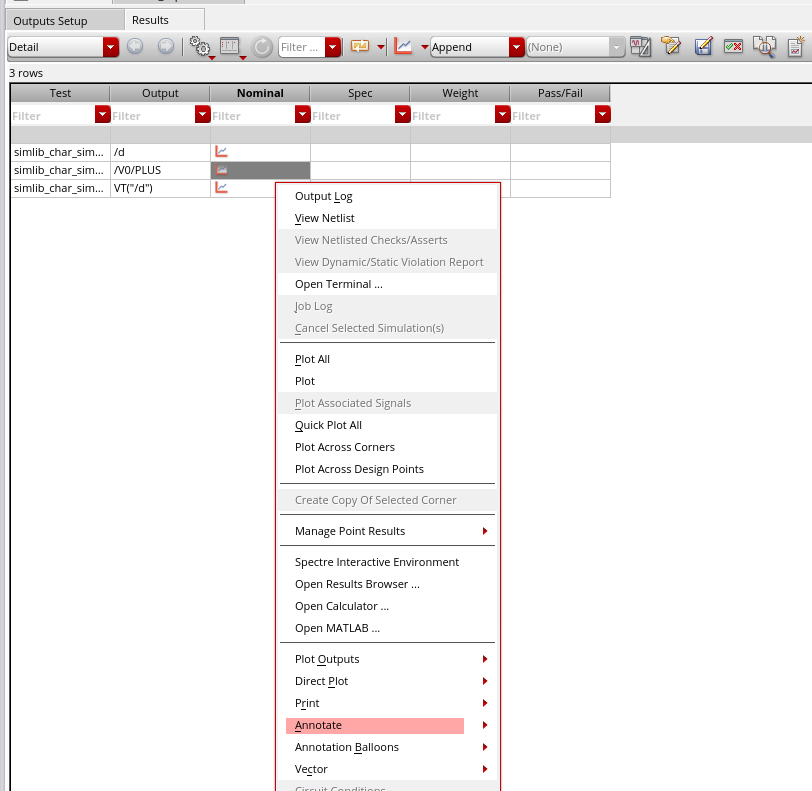

> [Andrew Beckett](https://community.cadence.com/members/andrew-beckett)[over 11 years ago](https://community.cadence.com/cadence_technology_forums/f/rf-design/25702/finding-dc-operating-points-at-certain-timepoints-during-transient-analysis/1321796#1321796)
>
> Two approaches:
>
> 1. On the transient options form, there's a field called "infotimes" - specify the times at which you want it to output the dc operating point data. You can then annotate the "transient operating points" from any of these times after the simulation, or access them via the results browser.
> 2. Or you could get the operating point data to be continuously saved during the transient for selected devices - if so, create a file called (say) "save.scs" (make sure it has a ".scs" suffix), and put:
>     save M1:oppoint
>    or
>     save M*:oppoint sigtype=dev
>    in this file, and then reference the file via Setup->Model Libraries or as a "definition file" on Setup->Simulation Files.
>    With this approach you can then find the operating point data for the selected devices in the results browser and plot it versus time (be cautious of saving too much though because this can generate a lot of data if you're not careful)
>
> Regards,
>
> Andrew.


##  transient options form

### setup


### access 1

**right-click** $\to$ **Annotate**  $\to$ **Transient Operating Points**



### access 2

**tranOpTimed**


## save.scs

```
save M0:oppoint
```


