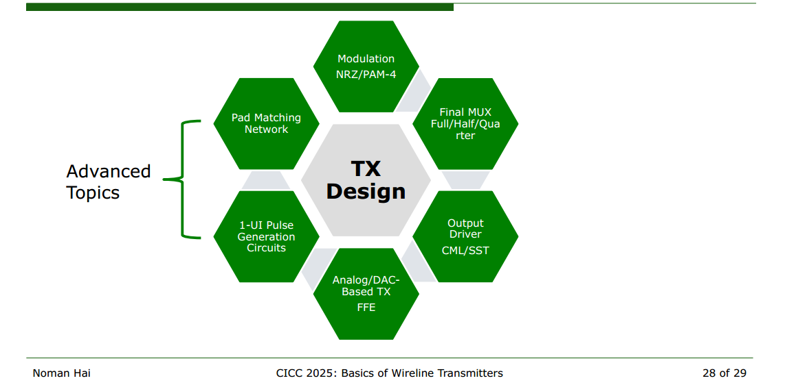

## Analog-based TX vs. DSP/DAC TX

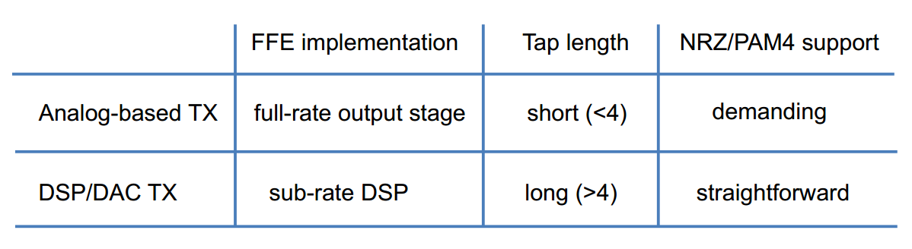


## SST vs. CML Driver

> Z. Toprak-Deniz et al., "A 128-Gb/s 1.3-pJ/b PAM-4 Transmitter With Reconfigurable 3-Tap FFE in 14-nm CMOS," in IEEE Journal of Solid-State Circuits, vol. 55, no. 1, pp. 19-26, Jan. 2020 [[https://sci-hub.st/10.1109/JSSC.2019.2939081](https://sci-hub.st/10.1109/JSSC.2019.2939081)]
>
> Design Challenges Of High-Speed Wireline Transmitters [[https://semiengineering.com/design-challenges-of-high-speed-wireline-transmitters/](https://semiengineering.com/design-challenges-of-high-speed-wireline-transmitters/)]

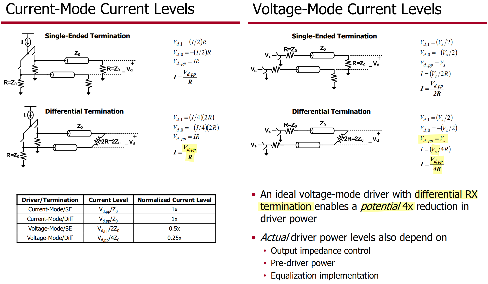


The source-series terminated (SST) drivers are more power-efficient than their current mode logic (CML) counterparts due to their lower termination power

differential output amplitude

$$
V_{ad,SST} = \frac{V_{DD}}{4R_T}\cdot 2R_T = \boxed{I_{DD}\cdot 2R_T} \qquad V_{ad,CML} = \frac{I_{DD}}{4}\cdot 2R_T = \boxed{\frac{1}{4} I_{DD}\cdot 2R_T}
$$

To achieve the same differential output amplitude, CML topologies consume $4$ times the current of SST topologies


---

---

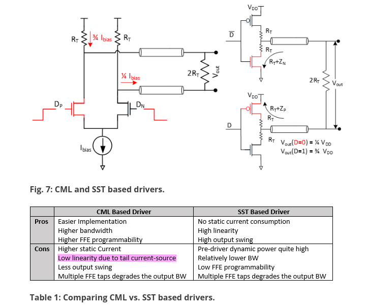

Current mode drivers become power competitive at very high data rates

- <span style="background-color:yellow">Dynamic power consumption **scales with frequency** $\Longrightarrow$ SST drivers lose power advantage</span>


## Data Serialization

> Z. Toprak-Deniz et al., "A 128-Gb/s 1.3-pJ/b PAM-4 Transmitter With Reconfigurable 3-Tap FFE in 14-nm CMOS," in IEEE Journal of Solid-State Circuits, vol. 55, no. 1, pp. 19-26, Jan. 2020 [[https://sci-hub.st/10.1109/JSSC.2019.2939081](https://sci-hub.st/10.1109/JSSC.2019.2939081)]


 ***triple-stacked 4:1 n-type MUX***

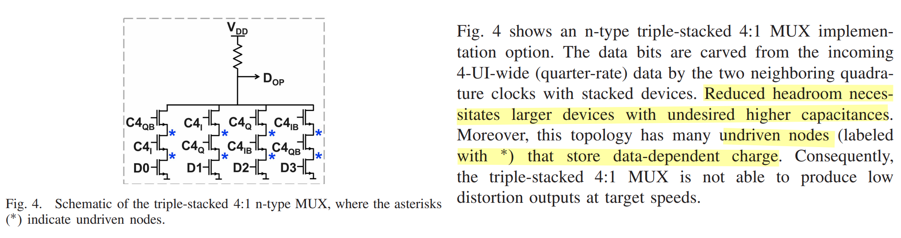

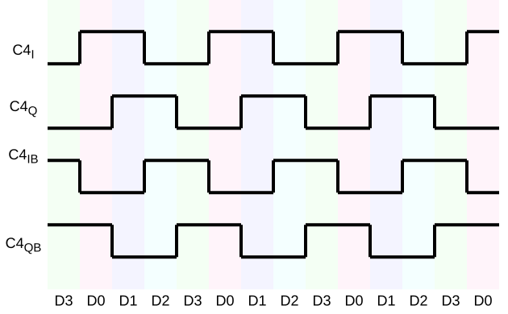

***mux timing***


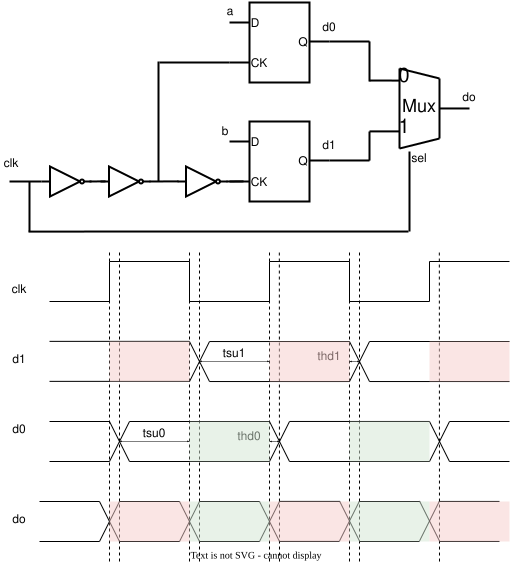


***divider latch timing***

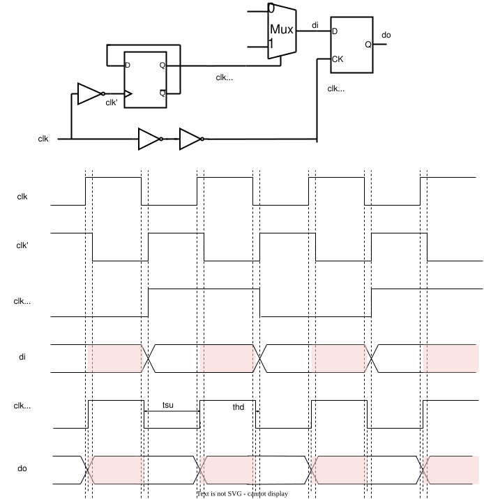

***Two latches***

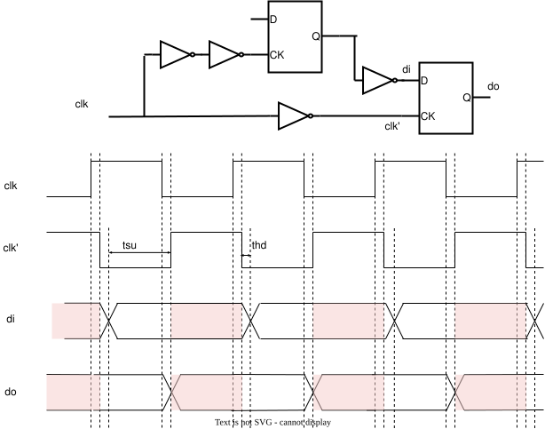


## 1-UI Data Stagger

> C. Menolfi *et al*., "6.2 A 112Gb/S 2.6pJ/b 8-Tap FFE PAM-4 SST TX in 14nm CMOS," *2018 IEEE International Solid-State Circuits Conference - (ISSCC)*, San Francisco, CA, USA, 2018, pp. 104-106 [[https://sci-hub.ru/10.1109/ISSCC.2018.8310205](https://sci-hub.ru/10.1109/ISSCC.2018.8310205)]
>
> T. Dickson *et al*., "C3.2 A 72GS/s, 8-bit DAC-based Wireline Transmitter in 4nm FinFET CMOS for 200+Gb/s Serial Links," *2022 IEEE Symposium on VLSI Technology and Circuits (VLSI Technology and Circuits)*, Honolulu, HI, USA, 2022, pp. 28-29 [[https://sci-hub.ru/10.1109/VLSITechnologyandCir46769.2022.9830421](https://sci-hub.ru/10.1109/VLSITechnologyandCir46769.2022.9830421)]

a.k.a <span style="background-color:yellow">**Phase Aligner**</span>, <span style="background-color:yellow">**Tap Delay Generator**</span>

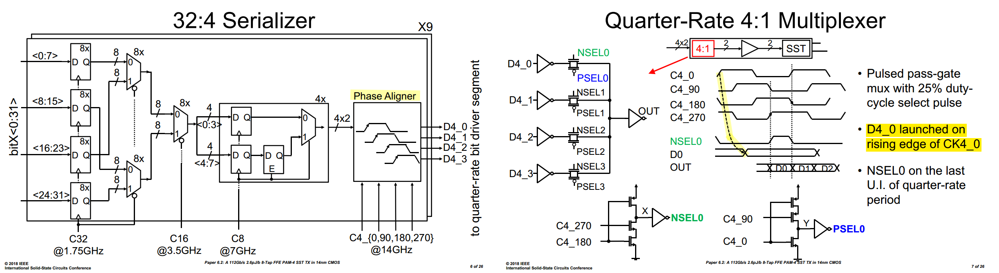


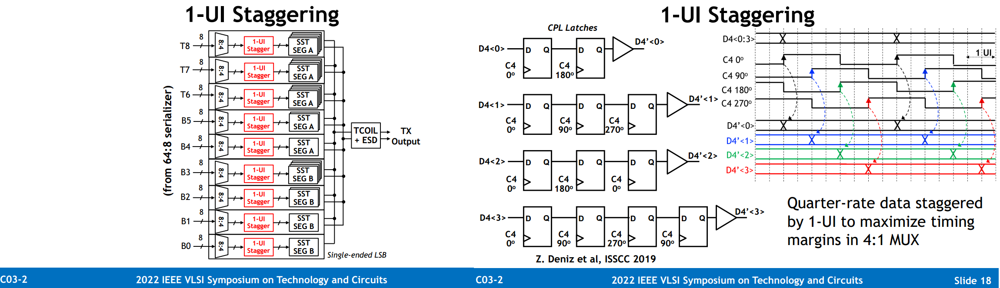


## 1-UI Clock Pulse Generator

>  J. Kim et al., “A 224Gb/s DAC-Based PAM-4 Transmitter with 8-Tap FFE in 10nm CMOS,” ISSCC 2021 [[https://sci-hub.jp/10.1109/ISSCC42613.2021.9365840](https://sci-hub.jp/10.1109/ISSCC42613.2021.9365840)]

**duty correction** & **delay adjustment** 

*TODO* &#128197;

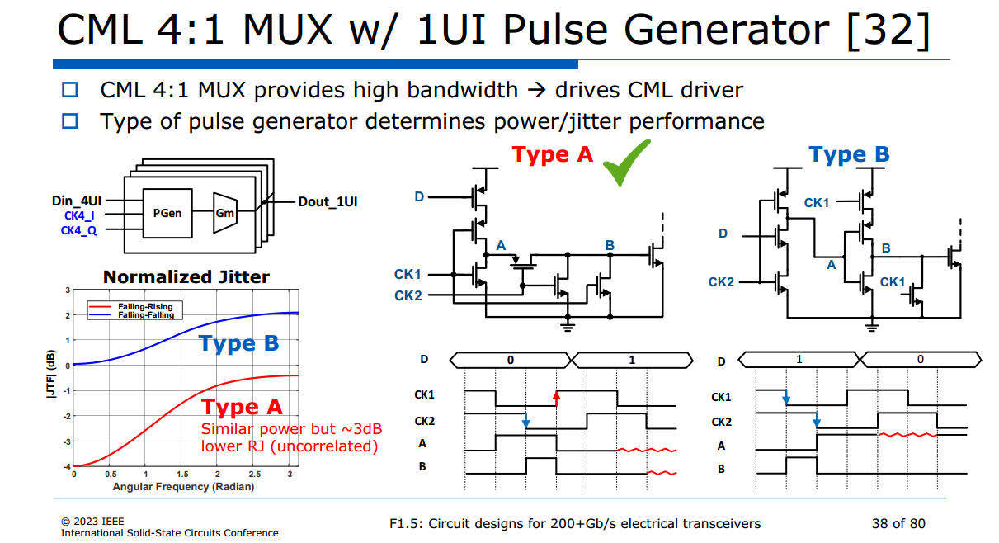

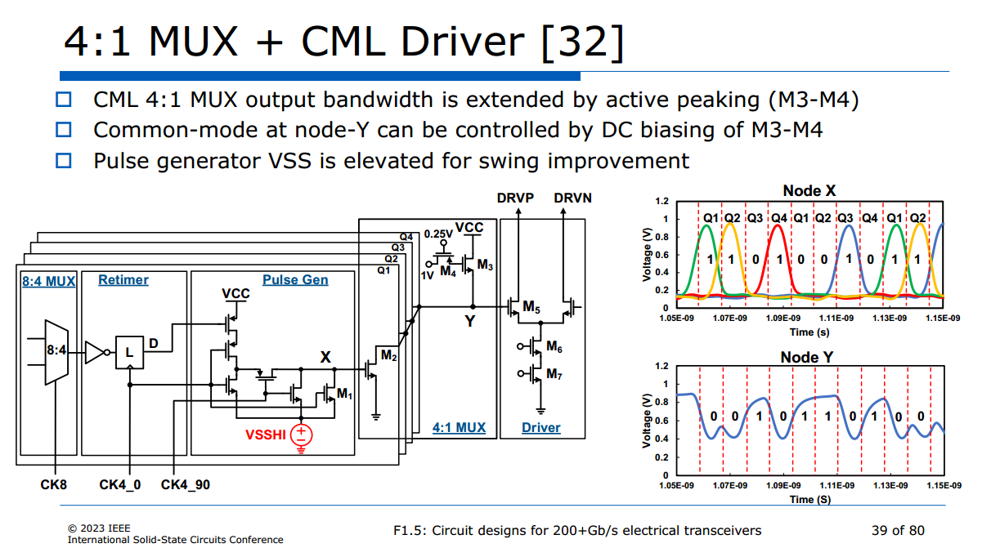


## Synchronized divider

> M. A. Kossel *et al*., "8.3 An 8b DAC-Based SST TX Using Metal Gate Resistors with 1.4pJ/b Efficiency at 112Gb/s PAM-4 and 8-Tap FFE in 7nm CMOS," *2021 IEEE International Solid-State Circuits Conference (ISSCC)*, San Francisco, CA, USA, 2021, pp. 130-132 [[https://sci-hub.ru/10.1109/ISSCC42613.2021.9365784](https://sci-hub.ru/10.1109/ISSCC42613.2021.9365784)]
>
> Michael Perrott August 12, 2008, Short Course On Phase-Locked Loops and Their Applications Day 2, PM Lecture Basic Building Blocks (Part II) High Speed Frequency Dividers, Phase Detectors, Charge Pumps, and Loop Filter Design [[https://cppsim.org/PLL_Lectures/day2_pm.pdf](https://cppsim.org/PLL_Lectures/day2_pm.pdf)]

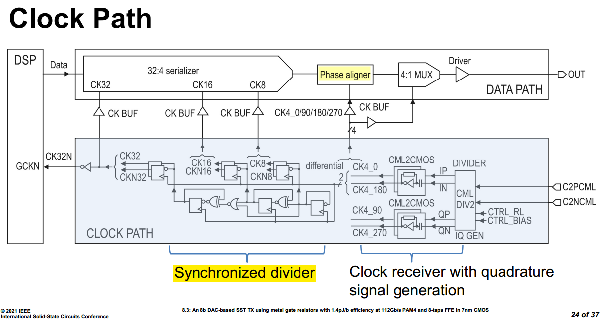

The lower speed sub-rate clocks are then obtained using a **synchronous divider** based on conventional master-slave flip-flops

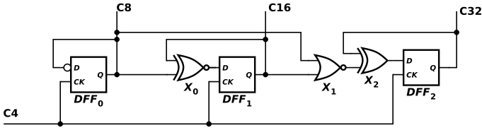

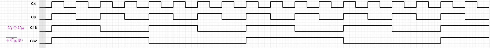


The preceding synchronous divider is equivalent to the synchronous implementation described below

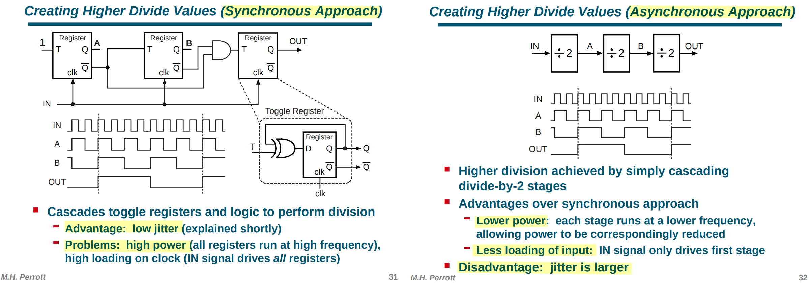

Each stage's toggle decision is computed from **the states of all previous stages**, but its timing comes only from the common input clock


## Single-Ended-to-Differential (S2D)

> T. Dickson *et al*., "C3.2 A 72GS/s, 8-bit DAC-based Wireline Transmitter in 4nm FinFET CMOS for 200+Gb/s Serial Links," *2022 IEEE Symposium on VLSI Technology and Circuits (VLSI Technology and Circuits)*, Honolulu, HI, USA, 2022, pp. 28-29 [[https://sci-hub.ru/10.1109/VLSITechnologyandCir46769.2022.9830421](https://sci-hub.ru/10.1109/VLSITechnologyandCir46769.2022.9830421)]

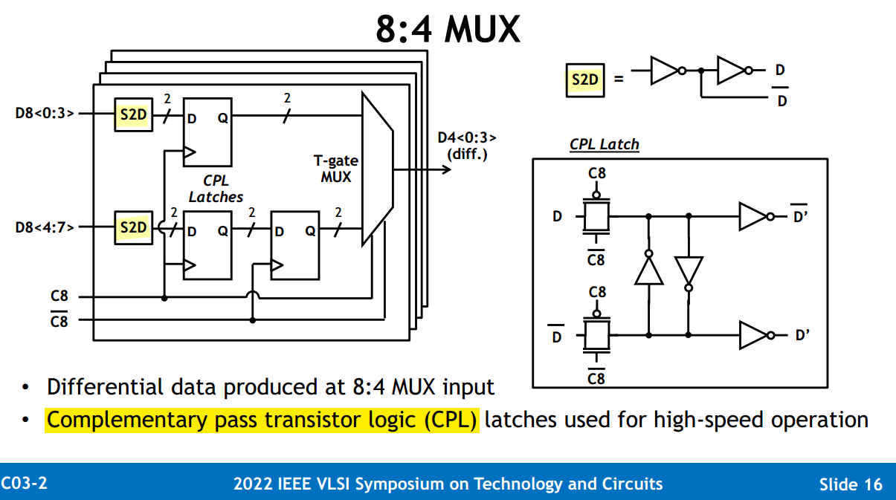


## Quarter-rate TX architecture

> Z. Toprak-Deniz *et al*., "6.6 A 128Gb/s 1.3pJ/b PAM-4 Transmitter with Reconfigurable 3-Tap FFE in 14nm CMOS," *2019 IEEE International Solid-State Circuits Conference - (ISSCC)*, San Francisco, CA, USA, 2019, pp. 122-124 [[https://sci-hub.ru/10.1109/ISSCC.2019.8662479](https://sci-hub.ru/10.1109/ISSCC.2019.8662479)]
>
> —, "A 128-Gb/s 1.3-pJ/b PAM-4 Transmitter With Reconfigurable 3-Tap FFE in 14-nm CMOS," in *IEEE Journal of Solid-State Circuits*, vol. 55, no. 1, pp. 19-26, Jan. 2020 [[https://sci-hub.ru/10.1109/JSSC.2019.2939081](https://sci-hub.ru/10.1109/JSSC.2019.2939081)]

**Quarter-Rate:** A clocking or sampling architecture where the internal circuit clock runs at one-fourth (1/4) of the total serial data rate

**Quadrature:** A relationship between two signals or clocks that have a **90<sup>o</sup> phase difference** (a quarter of a complete wave cycle), commonly used for I/Q modulation, directional tracking in encoders, or generating multi-phase clocks

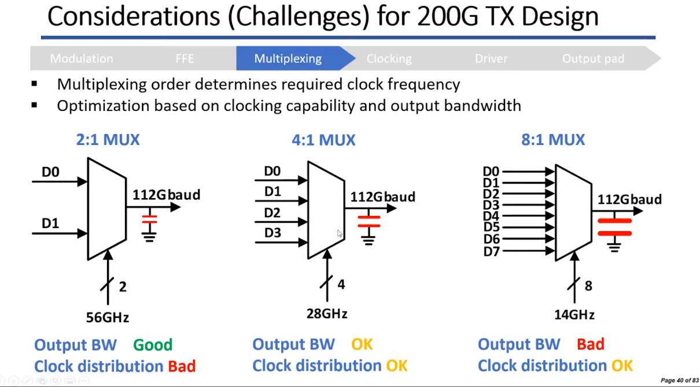

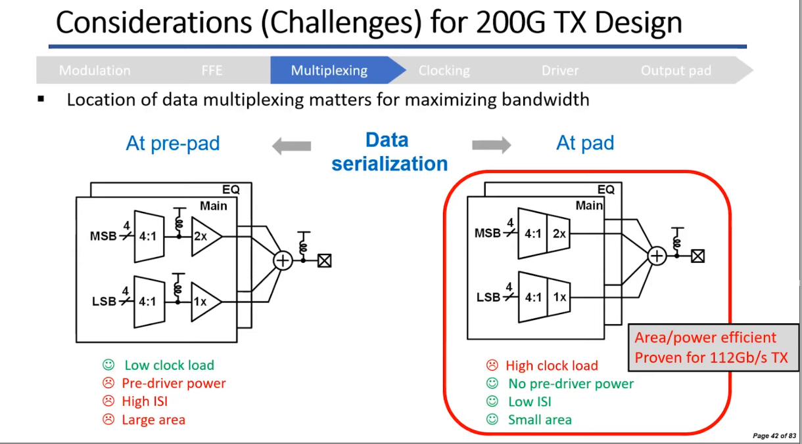


---

**Fig. 5(c)**: The 2-UI pulse D1′ is carved by C4IB alone — it starts on **C4IB rising** and ends on **C4IB falling**. For the D1 → D1′ stage, the margins are 1.5 UI before and 0.5 UI after, which is **asymmetric**

**Fig. 5(d):** D1′ is the 1-UI pulse, C4IB isn't the only reference — It starts on **C4IB rising**, but it ends on **C4Q falling**, as the arrows in the figure show. The pulse generator is enabled only while C4IB *and* C4Q are both high

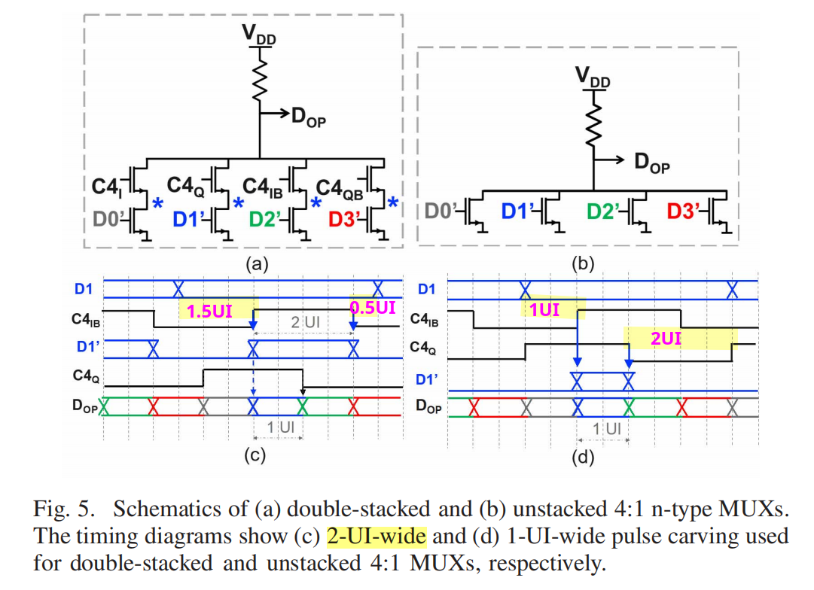

| Case          | Window D1 must be stable over | Before | After  |
| ------------- | ----------------------------- | ------ | ------ |
| (c) D1 → D1′  | C4IB high (2 UI)              | 1.5 UI | 0.5 UI |
| (c) D1 → D_OP | C4IB high and C4Q high (1 UI) | 1.5 UI | 1.5 UI |
| (d) D1 → D1′  | C4IB high and C4Q high (1 UI) | 1 UI   | 2 UI   |


The 0.5 UI in Fig. 5(c) is an idealized drawing, not a real delay value. In silicon, the D1 edge occurs at the launching C4 edge plus the **latch clock-to-Q delay plus wiring delay**. The authors drew it at 0.5 UI to show the ideal centered placement with symmetric margin

The two sub-figures place D1 differently, which shows the data-to-clock offset is set by design and illustration choices. The real requirement is only that **D1 is stable, with margin**, whenever its carving gate is enabled

If the natural delay lands too close to an active edge, the designer can fix it by choosing a different launching clock phase or adding delay


##  Half-rate TX architecture

> M. Meghelli *et al*., "A 10Gb/s 5-Tap-DFE/4-Tap-FFE Transceiver in 90nm CMOS," *2006 IEEE International Solid State Circuits Conference - Digest of Technical Papers*, San Francisco, CA, USA, 2006, pp. 213-222 [[https://sci-hub.ru/10.1109/ISSCC.2006.1696051](https://sci-hub.ru/10.1109/ISSCC.2006.1696051)]
>
> J. F. Bulzacchelli *et al*., "A 10-Gb/s 5-Tap DFE/4-Tap FFE Transceiver in 90-nm CMOS Technology," in *IEEE Journal of Solid-State Circuits*, vol. 41, no. 12, pp. 2885-2900, Dec. 2006 [[https://sci-hub.ru/10.1109/JSSC.2006.884342](https://sci-hub.ru/10.1109/JSSC.2006.884342)]
>
> Yang, Chih-Kong Ken. *Design of high-speed serial links in CMOS*. Stanford University, 1999. [[http://i.stanford.edu/pub/cstr/reports/csl/tr/98/775/CSL-TR-98-775.pdf](http://i.stanford.edu/pub/cstr/reports/csl/tr/98/775/CSL-TR-98-775.pdf)]
>
> Mark Horowitz, Chih-Kong Ken Yang, and Stefanos Sidiropoulos. 1998. High-Speed Electrical Signaling: Overview and Limitations. IEEE Micro 18, 1 (January 1998), 12–24. https://doi.org/10.1109/40.653013 [[https://people.engr.tamu.edu/spalermo/ecen689/hs_electrical_signaling_horowitz_micro_1998.pdf](https://people.engr.tamu.edu/spalermo/ecen689/hs_electrical_signaling_horowitz_micro_1998.pdf)]

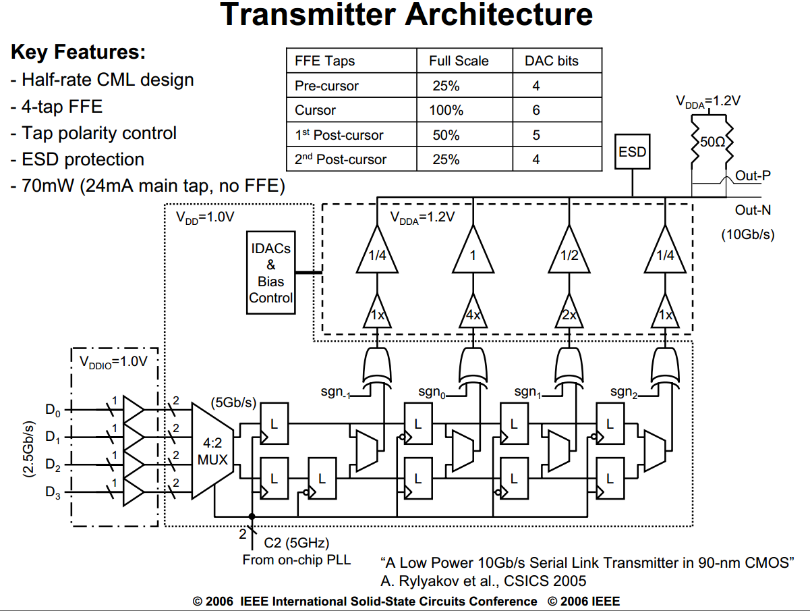


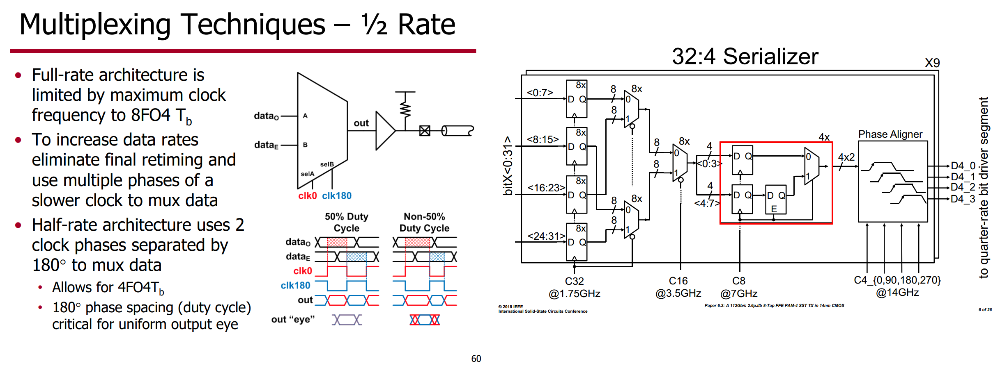

The half period that second-half selection "wastes" is deliberate slack: it lets each input settle fully before it is passed. You're trading a little latency for **robustness**, and designers almost always take that trade. If latency truly mattered, the better move would be to trim pipeline stages or the FIFO depth elsewhere, not to remove the settling slack from the highest-speed MUX.

## Full-rate TX architecture

> Sam Palermo, ECEN720: High-Speed Links Circuits and Systems Spring 2025 Lecture 5: Termination, TX Driver, & Multiplexer Circuits [[https://people.engr.tamu.edu/spalermo/ecen689/lecture5_ee720_termination_txdriver.pdf](https://people.engr.tamu.edu/spalermo/ecen689/lecture5_ee720_termination_txdriver.pdf)]
>
> J. Cao *et al*., "OC-192 transmitter and receiver in standard 0.18-/spl mu/m CMOS," in *IEEE Journal of Solid-State Circuits*, vol. 37, no. 12, pp. 1768-1780, Dec. 2002, doi: 

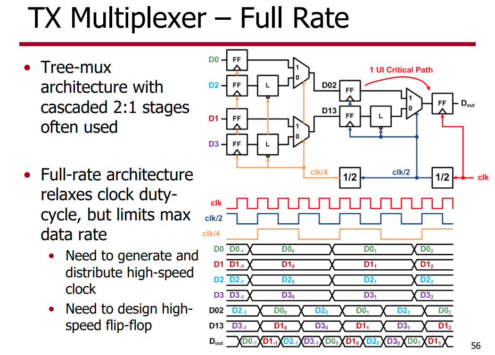

With the FFs, latches, and clocks unchanged, **reversing** the MUX selection still works, but adds **latency**

The bit order is preserved; each bit is selected later.

- Reversing **both first-stage MUXes** adds **2 UI**
- Reversing the **final MUX** adds **1 UI**.
- Reversing **all three** preserves \(D_0,D_1,D_2,D_3,\ldots\), with **3 UI additional latency**


---

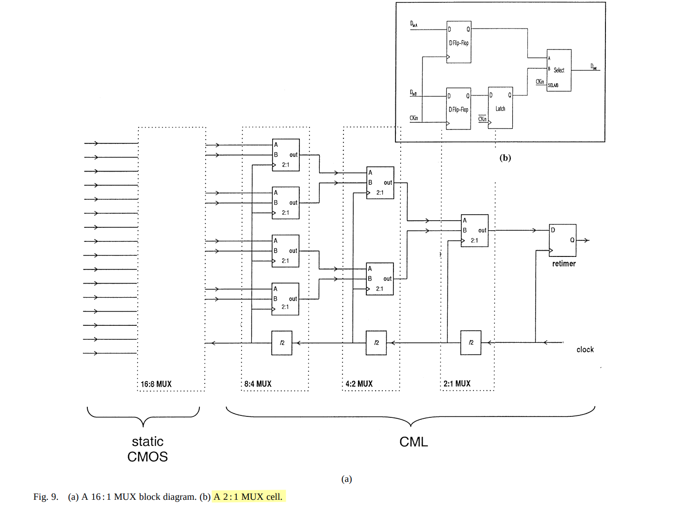

The **retimer** between the final stage of the MUX and the output driver is used to r**educe the data jitter** due to the bandwidth limitation of the selection circuit in the 2 : 1 MUX cell and duty cycle distortion of the half-rate clock driving that stage


## SST Driver

<span style="color:white; background-color:black">sharing termination in SST transmitter</span>

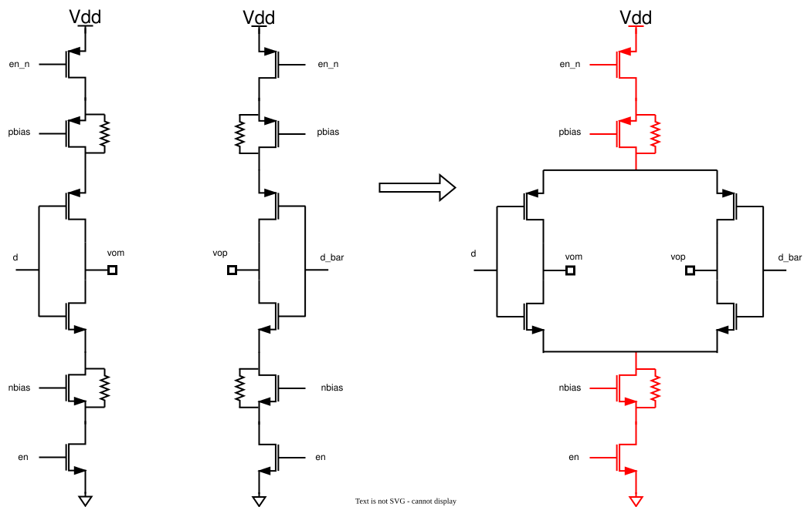

Sharing termination keep a constant current through leg, which improve TX speed in this way.
On the other hand, the sharing termination facilitate drain/source sharing technique in layout.

<span style="color:white; background-color:black">pull-up and pull-down resistor</span>

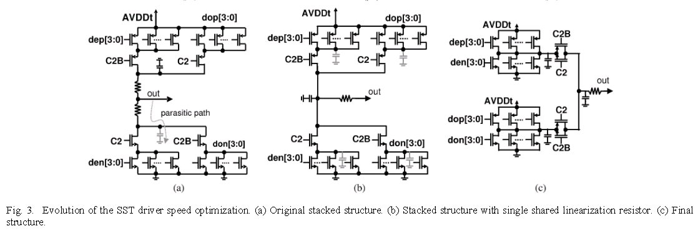

**Original stacked structure**

Pro's:

​	smaller static current when both pull up and pull down path is on

Con's:

​	slowly switching due to parasitic capacitance behind pull-up and pull-down resistor


**with single shared linearization resistor**

Pro's:

​	The parasitic capacitance behind the resistor still exists but is now always driven high or low actively

Con's:

​	more static current


### VM Driver Equalization - differential ended termination

$$
V_o = D_{n+1}C_{-1}+D_nC_0+D_{n-1}C_{+1}
$$

where $D_n \in \{-1, 1\}$

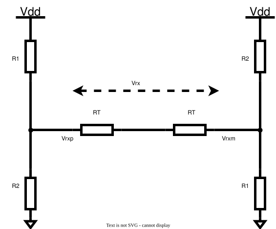
$$
V_{\text{rx}} = V_{\text{dd}} \frac{(R_2-R_1)R_T}{R_1R_T+R_2R_T+R_1R_2}
$$
With $R_u=(L+M+N)R_T$

Normalize above equation, obtain
$$
V_{\text{rx,norm}} = \frac{(R_2-R_1)R_T}{R_1R_T+R_2R_T+R_1R_2}
$$


|          | $D_{n-1}$ | $D_{n}$ | $D_{n+1}$ |
| -------- | --------- | ------- | --------- |
| $C_{-1}$ | 1         | -1      | -1        |
| $C_0$    | -1        | 1       | -1        |
| $C_{+1}$ | -1        | -1      | 1         |

Where precursor  $R_L = L\times R_T$, main cursor $R_M = M\times R_T$ and post cursor $R_N = N\times R_T$

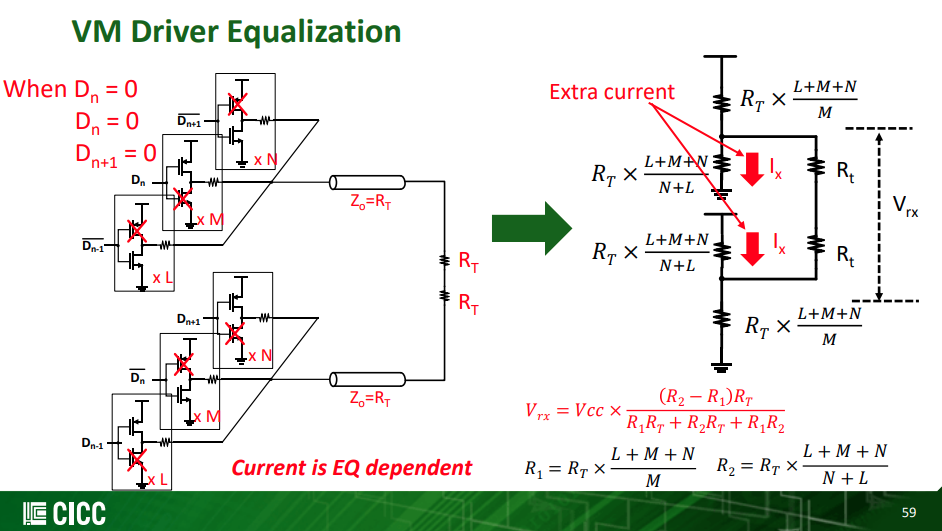

<span style="color:white; background-color:black">Equation-1</span>

> $D_{n-1}D_nD_{n+1}=1,-1,-1$

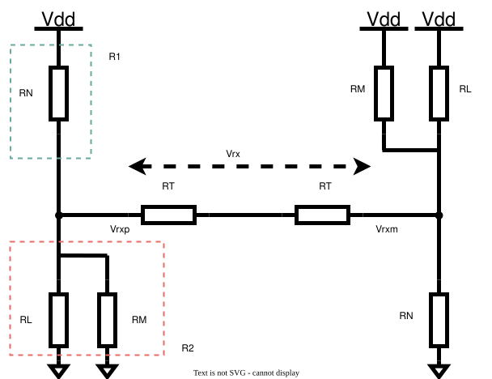

$$\begin{align}
R_1 &= R_N \\
&= \frac{R_u}{N} \\
R_2 &= R_L\parallel R_M \\
&= \frac{R_u}{L+M}
\end{align}$$

We obtain
$$
V_{L}= \frac{1}{2}\cdot\frac{N-(L+M)}{L+M+N}
$$

<span style="color:white; background-color:black">Equation-2</span>

> $D_{n-1}D_nD_{n+1}=-1,1,-1$

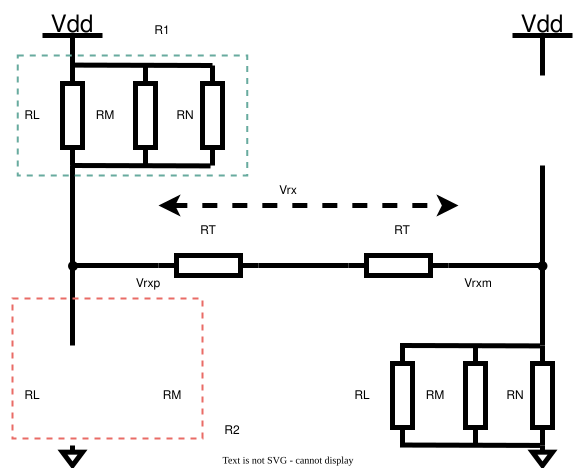

with $R_1=R_T$ and $R_2=+\infty$, we obtain
$$
V_M = \frac{1}{2}
$$

<span style="color:white; background-color:black">Equation-3</span>

> $D_{n-1}D_nD_{n+1}=-1,-1,1$

$$\begin{align}
R_1 &= R_L \\
&= \frac{R_u}{L} \\
R_2 &= R_N\parallel R_M \\
&= \frac{R_u}{N+M}
\end{align}$$

We obtain
$$
V_N = \frac{1}{2}\cdot\frac{L-(N+M)}{L+M+N}
$$

<span style="color:white; background-color:black">Obtain FIR coefficients</span>

We define
$$\begin{align}
l &= \frac{L}{L+M+N} \\
m &= \frac{M}{L+M+N} \\
n &= \frac{N}{L+M+N}
\end{align}$$

where $l+m+n=1$

Due to Eq1 ~ Eq3
$$
\left\{ \begin{array}{cl}
C_{-1}-C_0-C_1 & = \frac{1}{2}(n-l-m) \\
-C_{-1}+C_0-C_1 & = \frac{1}{2} \\
-C_{-1}-C_0+C_1 & = \frac{1}{2}(l-n-m)
\end{array} \right.
$$
After scaling, we get
$$
\left\{ \begin{array}{cl}
C_{-1}-C_0-C_1 & = -l-m+n \\
-C_{-1}+C_0-C_1 & = l+m+n \\
-C_{-1}-C_0+C_1 & = l-m-n
\end{array} \right.
$$
Then, **the relationship between FIR coefficients and legs is clear**, i.e.
$$\begin{align}
C_{-1} &= -\frac{L}{L+M+N} \\
C_{0} &= \frac{M}{L+M+N} \\
C_{1} &= -\frac{N}{L+M+N}
\end{align}$$

For example, $C_{-1}=-0.1$, $C_0=0.7$ and $C_1=-0.2$
$$
H(z) = -0.1+0.7z^{-1}-0.2z^{-2}
$$
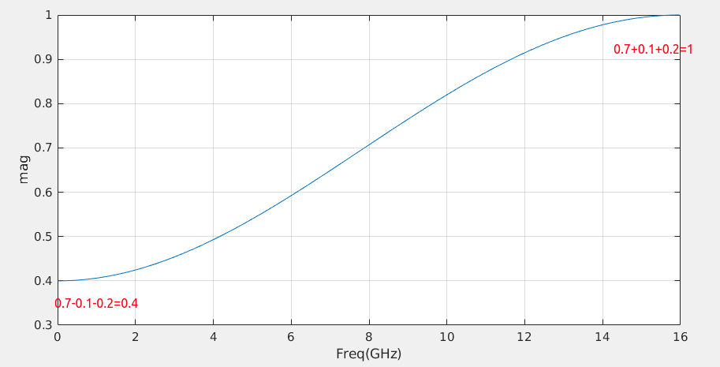

```matlab
w = [-0.1, 0.7, -0.2];
Fs = 32e9;
[mag, w] = freqz(w, 1, [], Fs);
plot(w/1e9, abs(mag));
xlabel('Freq(GHz)');
ylabel('mag');
grid on;
```

### VM Driver Equalization - single ended termination

<span style="color:white; background-color:black">Equation-1</span>

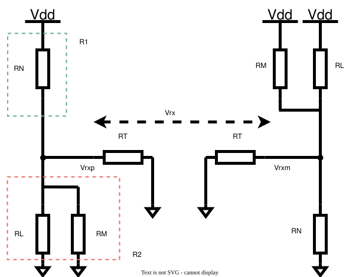

$$\begin{align}
V_{\text{rxp}} &= \frac{1}{2} \cdot \frac{N}{L+M+N} \\
V_{\text{rxm}} &= \frac{1}{2} \cdot \frac{L+M}{L+M+N}
\end{align}$$
So
$$
V_{L}= \frac{1}{2}\cdot\frac{N-(L+M)}{L+M+N}
$$
which is same with differential ended termination

<span style="color:white; background-color:black">Equation-2</span>

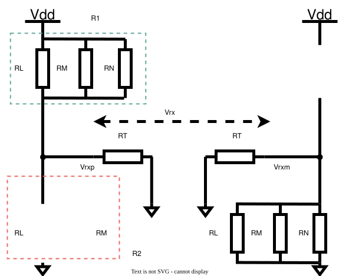

$$\begin{align}
V_{\text{rxp}} &= \frac{1}{2} \\
V_{\text{rxm}} &= 0
\end{align}$$
So
$$
V_{M}= \frac{1}{2}
$$
which is same with differential ended termination

<span style="color:white; background-color:black">Equation-3</span>

$$
V_{N}= \frac{1}{2}\cdot\frac{L-(N+M)}{L+M+N}
$$

<span style="color:white; background-color:black">Obtain FIR coefficients</span>

Same with differential ended termination driver.


## Tailless CML driver

> G. Steffan *et al*., "6.4 A 64Gb/s PAM-4 transmitter with 4-Tap FFE and 2.26pJ/b energy efficiency in 28nm CMOS FDSOI," *2017 IEEE International Solid-State Circuits Conference (ISSCC)*, San Francisco, CA, USA, 2017, pp. 116-117 [[https://sci-hub.ru/10.1109/ISSCC.2017.7870288](https://sci-hub.ru/10.1109/ISSCC.2017.7870288)]

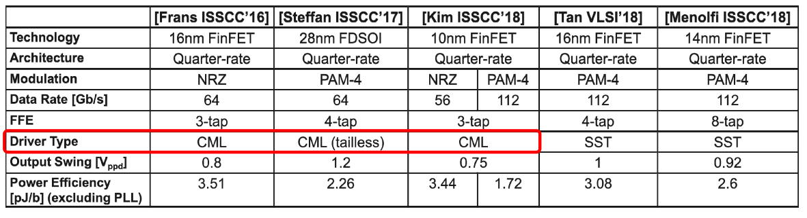


## Peak power constraint of TX FIR

> Kevin Zheng , Circuit Insights @ ISSCC2025: Circuits for Wireline Communications [[https://youtu.be/8NZl81Dj45M&t=829](https://youtu.be/8NZl81Dj45M&t=829)]

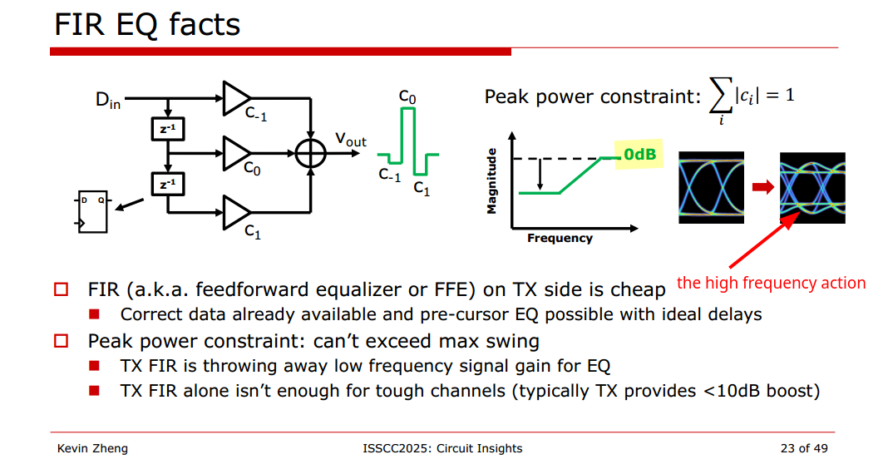

Due to circuit limitation, circuit cannot have arbitrarily large voltage on the output, i.e. a *limited maximum swing*. In order to create the high frequency shape, the best we can do is *lower DC gain* (low frequency gain < 1)

- FIR is not increasing the amplitude on the edges
- FIR is reducing the inner eye diagram

The maximum swing stays the same, $\sum_i |c_i|=1$


## Active Peaking CMOS Pre-Driver

> C. Menolfi *et al*., "A 112Gb/S 2.6pJ/b 8-Tap FFE PAM-4 SST TX in 14nm CMOS," *2018 IEEE International Solid-State Circuits Conference - (ISSCC)*, San Francisco, CA, USA, 2018, pp. 104-106 [[https://sci-hub.ru/10.1109/ISSCC.2018.8310205](https://sci-hub.ru/10.1109/ISSCC.2018.8310205)]
>
> HungWen Lu, ChauChin Su and Chien-Nan Liu, "A scalable digitalized buffer for gigabit I/O," *2008 IEEE Custom Integrated Circuits Conference*, San Jose, CA, USA, 2008, pp. 241-244 [[https://sci-hub.ru/10.1109/CICC.2008.4672068](https://sci-hub.ru/10.1109/CICC.2008.4672068)]

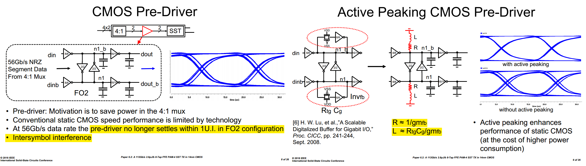

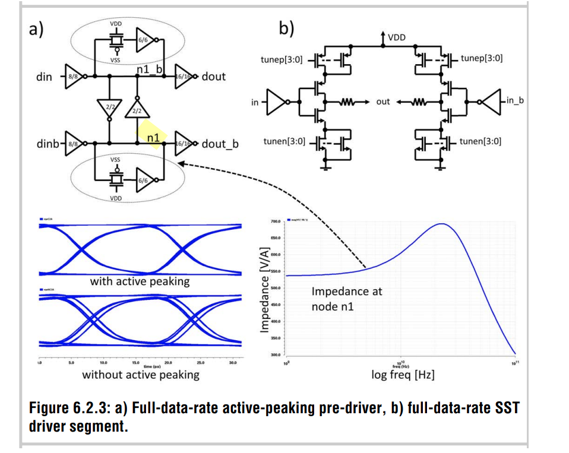


## Basic FeedForward Equalization Theory

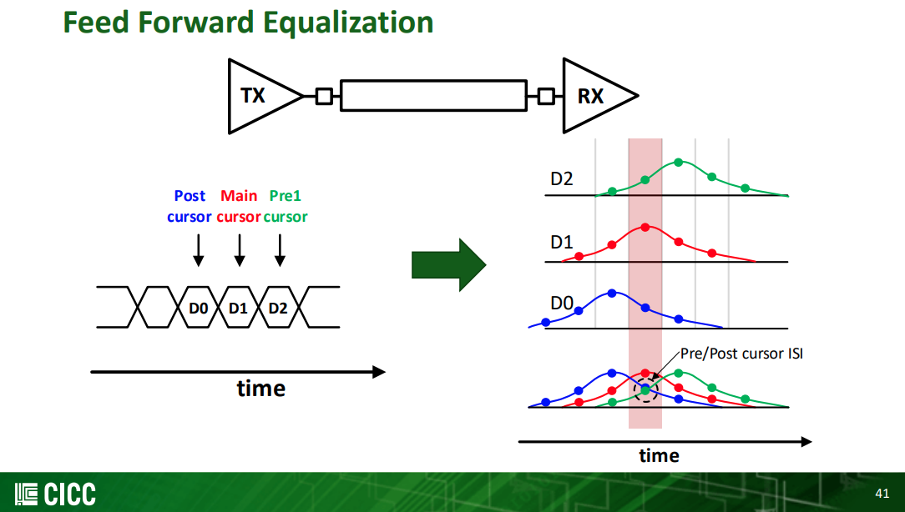

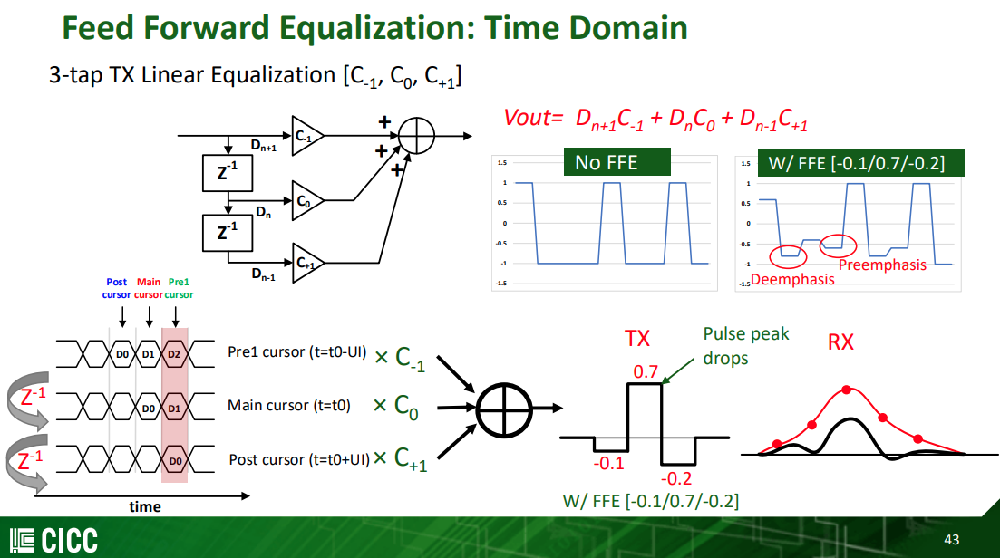

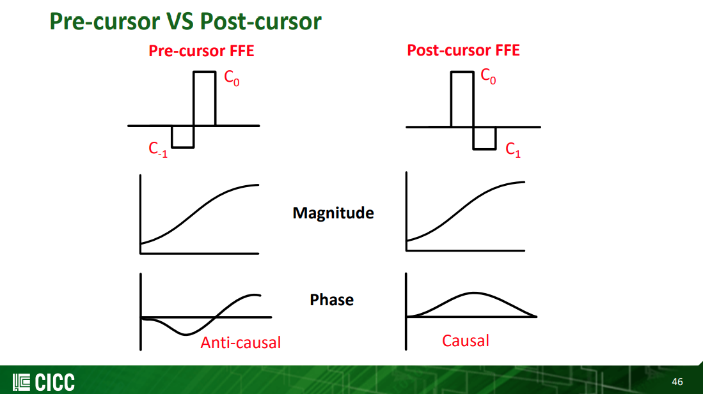

> Pre-cursor FFE can compensate phase distortion through the channel


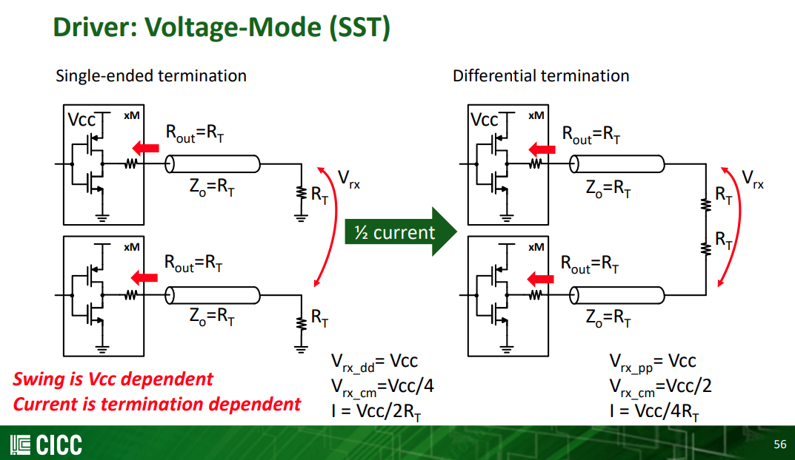

> Single-ended termination
>
> Differential termination


## PAM4 TX

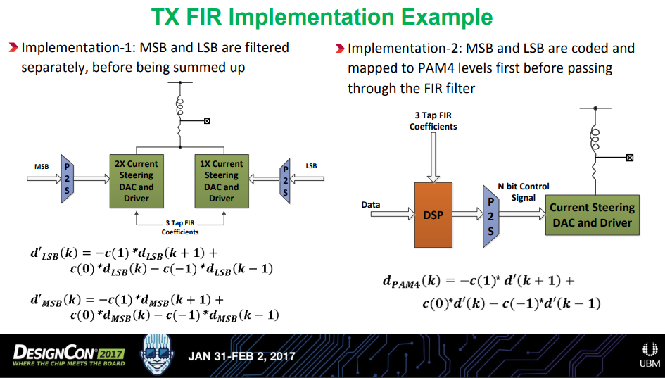

Here, $d_{\text{LSB}} \in \{-1, 1\}$, $d_{\text{MSB}} \in \{-2, 2\}$ and $d' \in \{ -3, -1, 1, 3 \}$


Implementation-1 could potentially experience performance degradation due to

1. Clock skew, $\Delta t$, could make the eye misaligned horizontally
2. Gain mismatch, $\Delta G$, could cause eye nonlinearity
3. Bandwidth mismatch, $\Delta f_{\text{BW}}$, could make the eye misaligned vertically

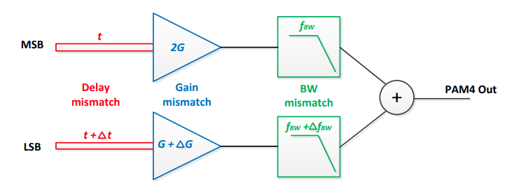


> Typically, a 3-tap FIR (pre + main + post) TX de-emphasis is used
>
> 3-tap FIR results in $4^3 = 64$ possible distinct signal levels


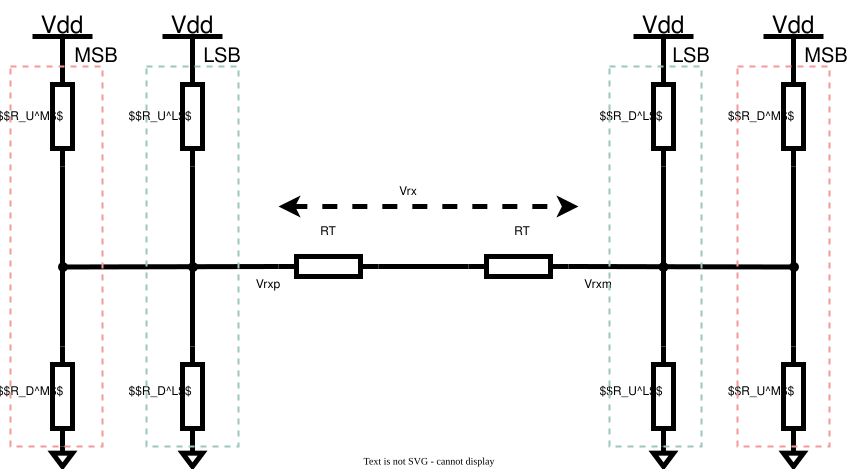

$$\begin{align}
R_U^M \parallel R_D^M &= \frac{3R_T}{2}\\
R_U^L \parallel R_D^L &= 3R_T
\end{align}$$

Thevenin Equivalent Circuit is 
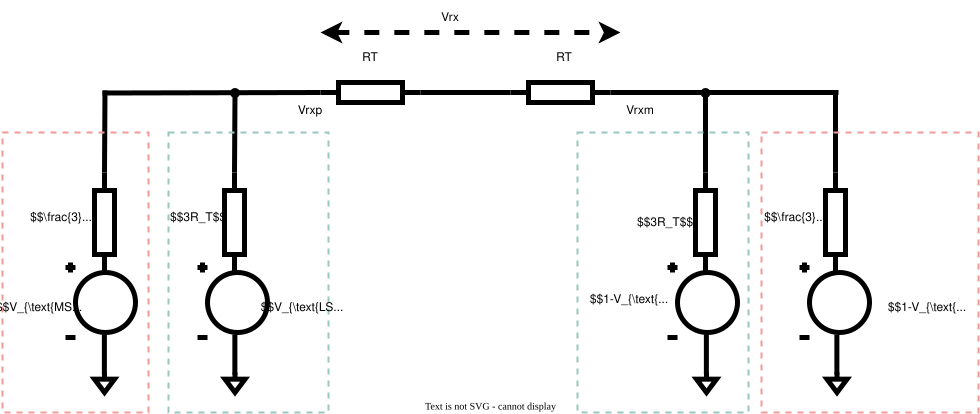

Which can be simpified as
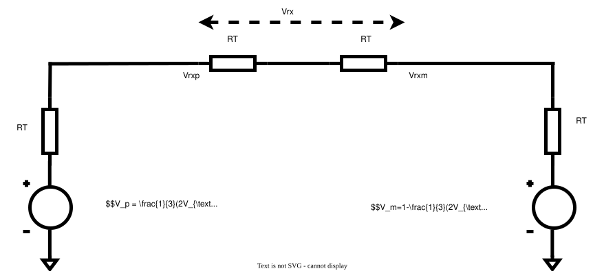
$$\begin{align}
V_{\text{rx}} &= \frac{1}{2}(V_p - V_m) \\
&= \frac{1}{2}(\frac{2}{3}(2V_{\text{MSB}}+V_{\text{LSB}})-1) \\
&=\frac{1}{3}(2V_{\text{MSB}}+V_{\text{LSB}})-\frac{1}{2}
\end{align}$$

The above eqations demonstrate that the output $V_{\text{rx}}$ is the linear sum of **MSB** and **LSB**; **LSB** and **MSB** have relative weight, i.e. *1* for LSB and *2* for MSB.

Assume pre cusor has $L$ legs, main cursor $M$ legs and post cursor $N$ legs, which is same with the convention in "Voltage-Mode Driver Equalization"

The number of legs connected with supply can expressed as
$$
n_{up} = (1-d_{n+1})L + d_{n}M + (1-d_{n-1})N
$$
Where $d_n \in \{0, 1\}$, or
$$
n_{up} = \frac{1}{2}(-D_{n+1}+1)L + \frac{1}{2}(D_{n}+1)M + \frac{1}{2}(-D_{n-1}+1)N
$$
Where $D_n \in \{-1, +1\}$

Then the number of legs connected with ground is
$$
n_{dn}=L+M+N-n_{up}
$$
where $n_{up}+n_{dn}=L+M+N$

Voltage resistor divider
$$\begin{align}
V_o &= \frac{\frac{R_{U}}{n_{dn}}}{\frac{R_U}{n_{dn}}+\frac{R_U}{n_{up}}} \\
&= \frac{1}{2}- \frac{1}{2}D_{n+1}\frac{L}{L+M+N}+ \frac{1}{2}D_{n}\frac{M}{L+M+N}-\frac{1}{2}D_{n-1}\frac{N}{L+M+N} \\
&= \frac{1}{2}-\frac{1}{2}D_{n+1}\cdot l+ \frac{1}{2}D_{n}\cdot m-\frac{1}{2}D_{n-1}\cdot n
\end{align}$$

where $l+m+n=1$ 

$V_{\text{MSB}}$ and $V_{\text{LSB}}$   can be obtained

$$\begin{align}
V_{\text{MSB}} &= \frac{1}{2}-\frac{1}{2}D^{\text{MSB}}_{n+1}\cdot l+ \frac{1}{2}D^{\text{MSB}}_{n}\cdot m-\frac{1}{2}D^{\text{MSB}}_{n-1}\cdot n \\
V_{\text{LSB}} &= \frac{1}{2}-\frac{1}{2}D^{\text{LSB}}_{n+1}\cdot l+ \frac{1}{2}D^{\text{LSB}}_{n}\cdot m-\frac{1}{2}D^{\text{LSB}}_{n-1}\cdot n
\end{align}$$

Substitute the above equation into $V_{\text{rx}}$, we obtain the relationship between driver legs and FFE coefficients

$$\begin{align}
V_{\text{rx}} &=\frac{1}{3}(2V_{\text{MSB}}+V_{\text{LSB}})-\frac{1}{2} \\
&= \frac{1}{3} \left\{  2\left( \frac{1}{2}-\frac{1}{2}D^{\text{MSB}}_{n+1}\cdot l+ \frac{1}{2}D^{\text{MSB}}_{n}\cdot m- \frac{1}{2}D^{\text{MSB}}_{n-1}\cdot n \right) + \left( \frac{1}{2}-\frac{1}{2}D^{\text{LSB}}_{n+1}\cdot l+ \frac{1}{2}D^{\text{LSB}}_{n}\cdot m- \frac{1}{2}D^{\text{LSB}}_{n-1}\cdot n \right) \right\}-\frac{1}{2} \\
&=  \left(-\frac{l}{6} \cdot 2 \cdot D^{\text{MSB}}_{n+1}+ \frac{m}{6} \cdot 2 \cdot D^{\text{MSB}}_{n}- \frac{n}{6} \cdot 2 \cdot D^{\text{MSB}}_{n-1}\right) + \left(-\frac{l}{6} \cdot D^{\text{LSB}}_{n+1}+ \frac{m}{6} \cdot D^{\text{LSB}}_{n}- \frac{n}{6} \cdot D^{\text{LSB}}_{n-1}\right) \\
&=  -\frac{l}{6}(2 \cdot D^{\text{MSB}}_{n+1}+D^{\text{LSB}}_{n+1})+ \frac{m}{6}(2\cdot D^{\text{MSB}}_{n}+D^{\text{LSB}}_{n}) -\frac{n}{6}(2\cdot D^{\text{MSB}}_{n-1}+D^{\text{LSB}}_{n-1})
\end{align}$$

After scaling, we obtain
$$
V_{\text{rx}}  = -l\cdot(2 \cdot D^{\text{MSB}}_{n+1}+D^{\text{LSB}}_{n+1})+ m\cdot(2\cdot D^{\text{MSB}}_{n}+D^{\text{LSB}}_{n}) - n \cdot(2\cdot D^{\text{MSB}}_{n-1}+D^{\text{LSB}}_{n-1})
$$
Where $C_{-1} = l$, $C_0 = m$ and $C_{1}=n$, which is same with that of NRZ


## Eye Linearity vs. RLM (Relative Level Mismatch)

> Chaowaroj (Max) Wanotayaroj. Introduction to PAM4 [[https://indico.cern.ch/event/979659/contributions/4127016/attachments/2159338/3642883/PAM4Eval%20-%20Dec2020%20Seminar.pdf](https://indico.cern.ch/event/979659/contributions/4127016/attachments/2159338/3642883/PAM4Eval%20-%20Dec2020%20Seminar.pdf)]

*TODO* &#128197;


## Tx Measurements

> PAM4 Transmitter Test Challenges [[https://harrisburg.psu.edu/files/pdf/16861/2019/05/06/tektronix_penn_state_si_april_12_2019.pdf](https://harrisburg.psu.edu/files/pdf/16861/2019/05/06/tektronix_penn_state_si_april_12_2019.pdf)]
>
> PAM4 Signaling in High Speed Serial Technology: Test, Analysis, and Debug [[https://download.tek.com/document/55W_60273_1_HR_Letter.pdf](https://download.tek.com/document/55W_60273_1_HR_Letter.pdf)]
>
> PCIe 7.0 Introduction PCIe 6.0 Anritsu/Tektronix Solution [[https://map-assets.tek.com/map-assets/emea/pdf-files/PCIe7_0_Intro_PCIe_6_0_Solution.pdf](https://map-assets.tek.com/map-assets/emea/pdf-files/PCIe7_0_Intro_PCIe_6_0_Solution.pdf)]
>
> Mike Hertz, Teledyne LeCroy: WEBINAR PAM4 Analysis and Measurement Considerations
>
> Brandon Gore, Samtec, DesignCon 2025, Transmitter Power Spectral Density Noise Impact for 200 Gb/s PAM 4 per lane [[pdf](https://suddendocs.samtec.com/notesandwhitepapers/samtec-dc25-paper-transmitter-power-spectral-density-noise-impact-for-200g-pam4-per-lane.pdf)] [[slides](https://suddendocs.samtec.com/notesandwhitepapers/samtec-dc25-ppt-transmitter-power-spectral-density-noise-impact-for-200g-pam4-per-lane.pdf)]


*TODO* &#128197;


### TX Jitter Measurement

> PCI-SIG, Update-on-PCIe8p0-Scope-bandwidth-study-and-jitter-measurement-Intel-2025-12-18_v3

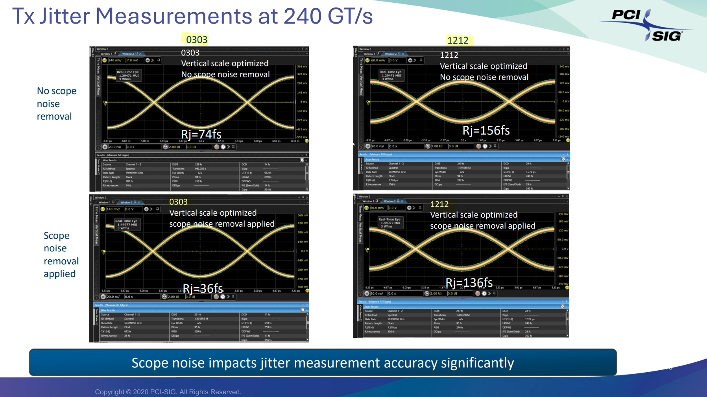


### Linear Fit Pulse Response (LFPR)

> Hsinho Wu, Intel. DesignCon 2021: SNDR Analysis & Its Impacts on Link Performance
>
> Christiaan Bil (Intel), DesignCon 2026. An Experimental Study of PCIe Transmitter Equalization Preset Measurement Methods for 64 and 128 GT/s PAM4 Signaling
>
> Dhruv Gupta, DesignCon 2026. PAM4 measurements through lossy channels – why oscilloscope CDR emulation matters

*TODO* &#128197;


### SNDR

> Marianne Nourzad, July 2nd, 2020 PCI-SIG ® EWG Meeting, *PCIE Gen6 TX SNDR Methodology Discussion*
>
> Pegah Alavi (Keysight Technologies) DesignCon 2025: *PCI Express & PAM4: Balancing Silicon and interconnect interdependencies for 128 GT/s*
>
> Rick Eads, Pegah Alavi, Randy Garrett, Keysight Technologies) DesignCon 2025, *The Road to PCIe 7.0: Advanced Testing Challenges at 64 GBaud PAM4*  [[https://www.keysight.com/us/en/assets/9925-01141/seminar-materials/KEF-DesignCon-2025-PCIe-Eads-Presentation.pdf](https://www.keysight.com/us/en/assets/9925-01141/seminar-materials/KEF-DesignCon-2025-PCIe-Eads-Presentation.pdf)]

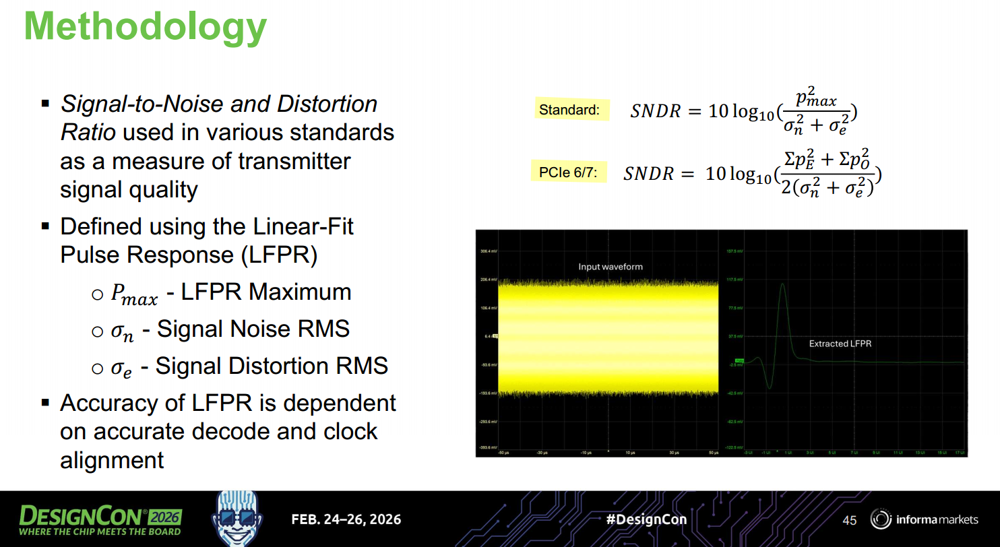

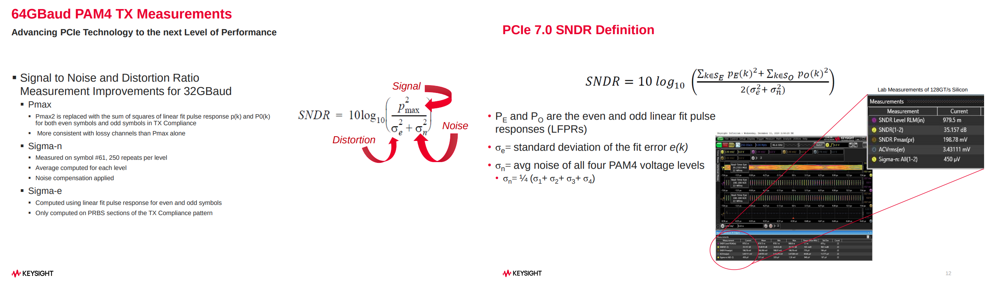


### RLM Measurement Based on Multi-pulse Extraction

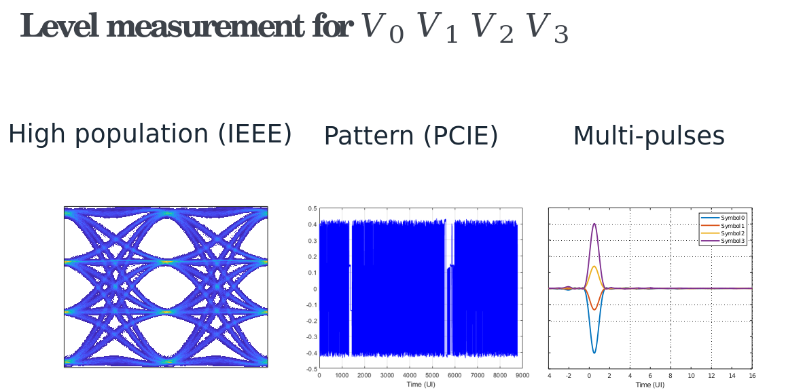


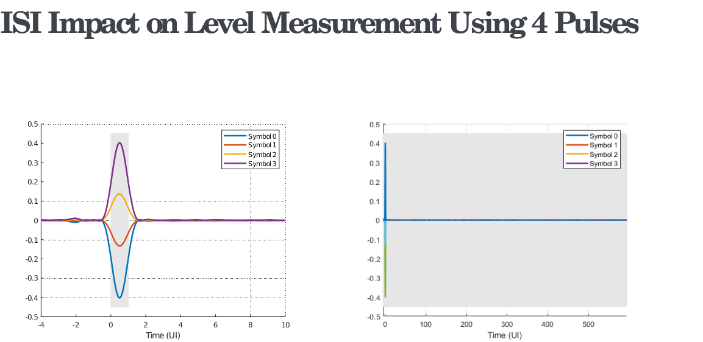


## reference

B. Razavi, "Design Techniques for High-Speed Wireline Transmitters," in IEEE Open Journal of the Solid-State Circuits Society, vol. 1, pp. 53-66, 2021,[[https://www.seas.ucla.edu/brweb/papers/Journals/BROJSSCSep21.pdf](https://www.seas.ucla.edu/brweb/papers/Journals/BROJSSCSep21.pdf)]

Jihwan Kim, ISSCC2019 F5: Design Techniques for a 112Gbs PAM-4 Transmitter

—, Intel, SNU Summer 2021 [Topic] "A 200Gb/s CMOS Transmitter: Challenges and Overcoming Design Techniques" [[https://youtu.be/w3lb_1TwdeE](https://youtu.be/w3lb_1TwdeE)]

—, CICC 2022, ES4-4: Transmitter Design for High-speed Serial Data Communications

Friedel Gerfers, ISSCC2021 T6: Basics of DAC-based Wireline Transmitters

Noman Hai, Synopsys. CICC 2025 Circuit Insights: Basics of Wireline Transmitter Circuits [[https://youtu.be/oofViBGlrjM](https://youtu.be/oofViBGlrjM)]

—, Synopsys. Design Challenges Of High-Speed Wireline Transmitters [[https://semiengineering.com/design-challenges-of-high-speed-wireline-transmitters/](https://semiengineering.com/design-challenges-of-high-speed-wireline-transmitters/)]

—, Synopsys. CMOS Circuit Techniques for Wireline Transmitters [[https://www.synopsys.com/webinars/wireline-transmitters-part-1.html](https://www.synopsys.com/webinars/wireline-transmitters-part-1.html)]

Tod Dickson, IBM. High-Speed CMOS Serial Transmitters for 56-112Gb/s Electrical Interconnects [[https://www.youtube.com/watch?v=g1pcZabsRNc](https://www.youtube.com/watch?v=g1pcZabsRNc)]

---

Yvain Thonnart, CEA-LIST. ISSCC2021 T8: On-Chip Interconnects: Basic Concepts, Designs and Future Opportunities

Mozhgan Mansuri. ISSCC2021 SC3: Clocking, Clock Distribution, and Clock Management in Wireline/Wireless Subsystems

Sam Palermo. High-Performance SERDES Design" Online Course (2025):  Current-Mode DAC TX [[https://youtu.be/A2VsvCPDWxk](https://youtu.be/A2VsvCPDWxk)]

PCIe® 6.0 Specification: The Interconnect for I/O Needs of the Future PCI-SIG® Educational Webinar Series, [[https://pcisig.com/sites/default/files/files/PCIe%206.0%20Webinar_Final_.pdf](https://pcisig.com/sites/default/files/files/PCIe%206.0%20Webinar_Final_.pdf)]

