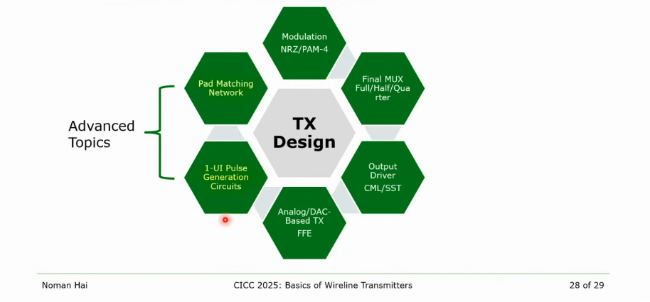
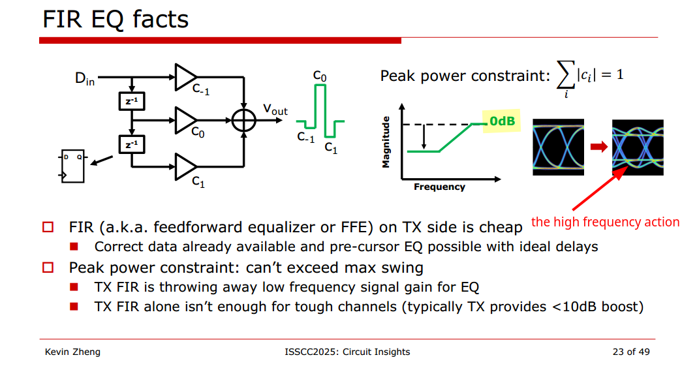
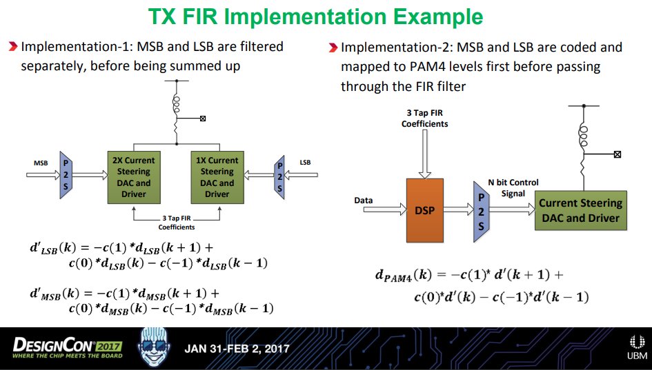
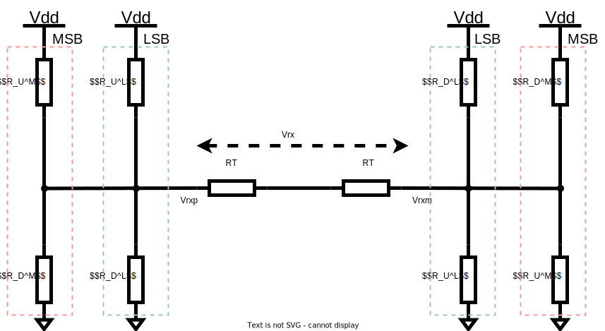
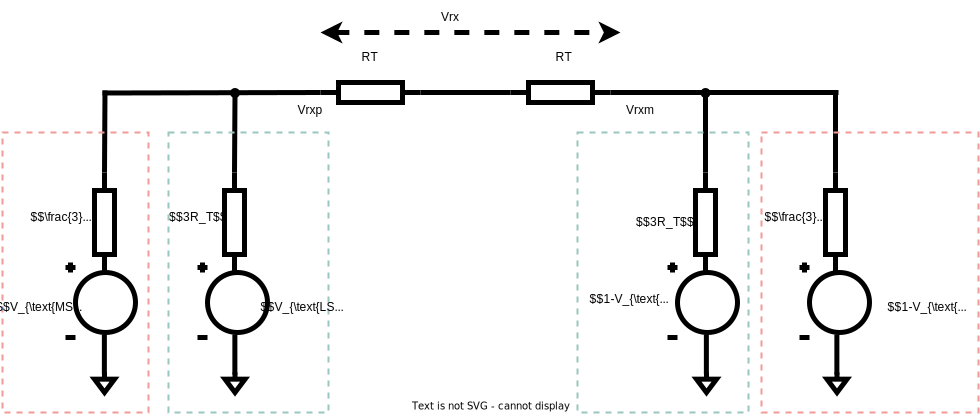
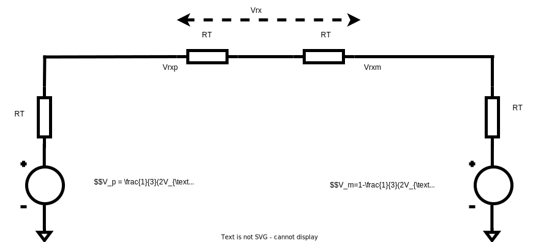

## CML vs. SST based driver


> Design Challenges Of High-Speed Wireline Transmitters [[https://semiengineering.com/design-challenges-of-high-speed-wireline-transmitters/](https://semiengineering.com/design-challenges-of-high-speed-wireline-transmitters/)]


> the resistance of MOS is not highly controlled -> $R_T + Z_N$


## Peak power constraint of TX FIR



Due to circuit limitation, circuit cannot have arbitrarily large voltage on the output, i.e. a *limited maximum swing*. In order to create the high frequency shape, the best we can do is *lower DC gain* (low frequency gain < 1)

- FIR is not increasing the amplitude on the edges
- FIR is reducing the inner eye diagram

The maximum swing stays the same, $\sum_i |c_i|=1$


> Circuit Insights @ ISSCC2025: Circuits for Wireline Communications - Kevin Zheng [[https://youtu.be/8NZl81Dj45M?si=2a8FdfGNP6yBgIW8&t=829](https://youtu.be/8NZl81Dj45M?si=2a8FdfGNP6yBgIW8&t=829)]


## SST Driver

### sharing termination in SST transmitter


Sharing termination keep a constant current through leg, which improve TX speed in this way.
On the other hand, the sharing termination facilitate drain/source sharing technique in layout.

### pull-up and pull-down resistor


**Original stacked structure**

Pro's:

​	smaller static current when both pull up and pull down path is on

Con's:

​	slowly switching due to parasitic capacitance behind pull-up and pull-down resistor


**with single shared linearization resistor**

Pro's:

​	The parasitic capacitance behind the resistor still exists but is now always driven high or low actively

Con's:

​	more static current


## VM Driver Equalization - differential ended termination

$$
V_o = D_{n+1}C_{-1}+D_nC_0+D_{n-1}C_{+1}
$$

where $D_n \in \{-1, 1\}$


$$
V_{\text{rx}} = V_{\text{dd}} \frac{(R_2-R_1)R_T}{R_1R_T+R_2R_T+R_1R_2}
$$
With $R_u=(L+M+N)R_T$

Normalize above equation, obtain
$$
V_{\text{rx,norm}} = \frac{(R_2-R_1)R_T}{R_1R_T+R_2R_T+R_1R_2}
$$


|          | $D_{n-1}$ | $D_{n}$ | $D_{n+1}$ |
| -------- | --------- | ------- | --------- |
| $C_{-1}$ | 1         | -1      | -1        |
| $C_0$    | -1        | 1       | -1        |
| $C_{+1}$ | -1        | -1      | 1         |

Where precursor  $R_L = L\times R_T$, main cursor $R_M = M\times R_T$ and post cursor $R_N = N\times R_T$


###  Equation-1

> $D_{n-1}D_nD_{n+1}=1,-1,-1$


$$\begin{align}
R_1 &= R_N \\
&= \frac{R_u}{N} \\
R_2 &= R_L\parallel R_M \\
&= \frac{R_u}{L+M}
\end{align}$$

We obtain
$$
V_{L}= \frac{1}{2}\cdot\frac{N-(L+M)}{L+M+N}
$$

### Equation-2

> $D_{n-1}D_nD_{n+1}=-1,1,-1$


with $R_1=R_T$ and $R_2=+\infty$, we obtain
$$
V_M = \frac{1}{2}
$$

### Equation-3

> $D_{n-1}D_nD_{n+1}=-1,-1,1$

$$\begin{align}
R_1 &= R_L \\
&= \frac{R_u}{L} \\
R_2 &= R_N\parallel R_M \\
&= \frac{R_u}{N+M}
\end{align}$$

We obtain
$$
V_N = \frac{1}{2}\cdot\frac{L-(N+M)}{L+M+N}
$$

### Obtain FIR coefficients

We define
$$\begin{align}
l &= \frac{L}{L+M+N} \\
m &= \frac{M}{L+M+N} \\
n &= \frac{N}{L+M+N}
\end{align}$$

where $l+m+n=1$

Due to Eq1 ~ Eq3
$$
\left\{ \begin{array}{cl}
C_{-1}-C_0-C_1 & = \frac{1}{2}(n-l-m) \\
-C_{-1}+C_0-C_1 & = \frac{1}{2} \\
-C_{-1}-C_0+C_1 & = \frac{1}{2}(l-n-m)
\end{array} \right.
$$
After scaling, we get
$$
\left\{ \begin{array}{cl}
C_{-1}-C_0-C_1 & = -l-m+n \\
-C_{-1}+C_0-C_1 & = l+m+n \\
-C_{-1}-C_0+C_1 & = l-m-n
\end{array} \right.
$$
Then, **the relationship between FIR coefficients and legs is clear**, i.e.
$$\begin{align}
C_{-1} &= -\frac{L}{L+M+N} \\
C_{0} &= \frac{M}{L+M+N} \\
C_{1} &= -\frac{N}{L+M+N}
\end{align}$$

For example, $C_{-1}=-0.1$, $C_0=0.7$ and $C_1=-0.2$
$$
H(z) = -0.1+0.7z^{-1}-0.2z^{-2}
$$


```matlab
w = [-0.1, 0.7, -0.2];
Fs = 32e9;
[mag, w] = freqz(w, 1, [], Fs);
plot(w/1e9, abs(mag));
xlabel('Freq(GHz)');
ylabel('mag');
grid on;
```

## VM Driver Equalization - single ended termination

### Equation-1


$$\begin{align}
V_{\text{rxp}} &= \frac{1}{2} \cdot \frac{N}{L+M+N} \\
V_{\text{rxm}} &= \frac{1}{2} \cdot \frac{L+M}{L+M+N}
\end{align}$$
So
$$
V_{L}= \frac{1}{2}\cdot\frac{N-(L+M)}{L+M+N}
$$
which is same with differential ended termination

### Equation-2


$$\begin{align}
V_{\text{rxp}} &= \frac{1}{2} \\
V_{\text{rxm}} &= 0
\end{align}$$
So
$$
V_{M}= \frac{1}{2}
$$
which is same with differential ended termination

### Equation-3

$$
V_{N}= \frac{1}{2}\cdot\frac{L-(N+M)}{L+M+N}
$$

### Obtain FIR coefficients

Same with differential ended termination driver.


## Basic Feed Forward Equalization Theory


> Pre-cursor FFE can compensate phase distortion through the channel


> Single-ended termination
>
> Differential termination


## TX Serializer

### mux timing


### divider latch timing


### Two latches


## PAM4 TX



Here, $d_{\text{LSB}} \in \{-1, 1\}$, $d_{\text{MSB}} \in \{-2, 2\}$ and $d' \in \{ -3, -1, 1, 3 \}$


Implementation-1 could potentially experience performance degradation due to

1. Clock skew, $\Delta t$, could make the eye misaligned horizontally
2. Gain mismatch, $\Delta G$, could cause eye nonlinearity
3. Bandwidth mismatch, $\Delta f_{\text{BW}}$, could make the eye misaligned vertically


> Typically, a 3-tap FIR (pre + main + post) TX de-emphasis is used
>
> 3-tap FIR results in $4^3 = 64$ possible distinct signal levels




$$\begin{align}
R_U^M \parallel R_D^M &= \frac{3R_T}{2}\\
R_U^L \parallel R_D^L &= 3R_T
\end{align}$$

Thevenin Equivalent Circuit is 


Which can be simpified as

$$\begin{align}
V_{\text{rx}} &= \frac{1}{2}(V_p - V_m) \\
&= \frac{1}{2}(\frac{2}{3}(2V_{\text{MSB}}+V_{\text{LSB}})-1) \\
&=\frac{1}{3}(2V_{\text{MSB}}+V_{\text{LSB}})-\frac{1}{2}
\end{align}$$

The above eqations demonstrate that the output $V_{\text{rx}}$ is the linear sum of **MSB** and **LSB**; **LSB** and **MSB** have relative weight, i.e. *1* for LSB and *2* for MSB.

Assume pre cusor has $L$ legs, main cursor $M$ legs and post cursor $N$ legs, which is same with the convention in "Voltage-Mode Driver Equalization"

The number of legs connected with supply can expressed as
$$
n_{up} = (1-d_{n+1})L + d_{n}M + (1-d_{n-1})N
$$
Where $d_n \in \{0, 1\}$, or
$$
n_{up} = \frac{1}{2}(-D_{n+1}+1)L + \frac{1}{2}(D_{n}+1)M + \frac{1}{2}(-D_{n-1}+1)N
$$
Where $D_n \in \{-1, +1\}$

Then the number of legs connected with ground is
$$
n_{dn}=L+M+N-n_{up}
$$
where $n_{up}+n_{dn}=L+M+N$

Voltage resistor divider
$$\begin{align}
V_o &= \frac{\frac{R_{U}}{n_{dn}}}{\frac{R_U}{n_{dn}}+\frac{R_U}{n_{up}}} \\
&= \frac{1}{2}- \frac{1}{2}D_{n+1}\frac{L}{L+M+N}+ \frac{1}{2}D_{n}\frac{M}{L+M+N}-\frac{1}{2}D_{n-1}\frac{N}{L+M+N} \\
&= \frac{1}{2}-\frac{1}{2}D_{n+1}\cdot l+ \frac{1}{2}D_{n}\cdot m-\frac{1}{2}D_{n-1}\cdot n
\end{align}$$

where $l+m+n=1$ 

$V_{\text{MSB}}$ and $V_{\text{LSB}}$   can be obtained

$$\begin{align}
V_{\text{MSB}} &= \frac{1}{2}-\frac{1}{2}D^{\text{MSB}}_{n+1}\cdot l+ \frac{1}{2}D^{\text{MSB}}_{n}\cdot m-\frac{1}{2}D^{\text{MSB}}_{n-1}\cdot n \\
V_{\text{LSB}} &= \frac{1}{2}-\frac{1}{2}D^{\text{LSB}}_{n+1}\cdot l+ \frac{1}{2}D^{\text{LSB}}_{n}\cdot m-\frac{1}{2}D^{\text{LSB}}_{n-1}\cdot n
\end{align}$$

Substitute the above equation into $V_{\text{rx}}$, we obtain the relationship between driver legs and FFE coefficients

$$\begin{align}
V_{\text{rx}} &=\frac{1}{3}(2V_{\text{MSB}}+V_{\text{LSB}})-\frac{1}{2} \\
&= \frac{1}{3} \left\{  2\left( \frac{1}{2}-\frac{1}{2}D^{\text{MSB}}_{n+1}\cdot l+ \frac{1}{2}D^{\text{MSB}}_{n}\cdot m- \frac{1}{2}D^{\text{MSB}}_{n-1}\cdot n \right) + \left( \frac{1}{2}-\frac{1}{2}D^{\text{LSB}}_{n+1}\cdot l+ \frac{1}{2}D^{\text{LSB}}_{n}\cdot m- \frac{1}{2}D^{\text{LSB}}_{n-1}\cdot n \right) \right\}-\frac{1}{2} \\
&=  \left(-\frac{l}{6} \cdot 2 \cdot D^{\text{MSB}}_{n+1}+ \frac{m}{6} \cdot 2 \cdot D^{\text{MSB}}_{n}- \frac{n}{6} \cdot 2 \cdot D^{\text{MSB}}_{n-1}\right) + \left(-\frac{l}{6} \cdot D^{\text{LSB}}_{n+1}+ \frac{m}{6} \cdot D^{\text{LSB}}_{n}- \frac{n}{6} \cdot D^{\text{LSB}}_{n-1}\right) \\
&=  -\frac{l}{6}(2 \cdot D^{\text{MSB}}_{n+1}+D^{\text{LSB}}_{n+1})+ \frac{m}{6}(2\cdot D^{\text{MSB}}_{n}+D^{\text{LSB}}_{n}) -\frac{n}{6}(2\cdot D^{\text{MSB}}_{n-1}+D^{\text{LSB}}_{n-1})
\end{align}$$

After scaling, we obtain
$$
V_{\text{rx}}  = -l\cdot(2 \cdot D^{\text{MSB}}_{n+1}+D^{\text{LSB}}_{n+1})+ m\cdot(2\cdot D^{\text{MSB}}_{n}+D^{\text{LSB}}_{n}) - n \cdot(2\cdot D^{\text{MSB}}_{n-1}+D^{\text{LSB}}_{n-1})
$$
Where $C_{-1} = l$, $C_0 = m$ and $C_{1}=n$, which is same with that of NRZ


## reference

Noman Hai, Synopsys. CICC 2025 Circuit Insights: Basics of Wireline Transmitter Circuits [[https://youtu.be/oofViBGlrjM?si=WZnOqtDVG3iDnBHI](https://youtu.be/oofViBGlrjM?si=WZnOqtDVG3iDnBHI)]

Noman Hai, Synopsys. Design Challenges Of High-Speed Wireline Transmitters [[https://semiengineering.com/design-challenges-of-high-speed-wireline-transmitters/](https://semiengineering.com/design-challenges-of-high-speed-wireline-transmitters/)]

Jhwan Kim, CICC 2022, ES4-4: Transmitter Design for High-speed Serial Data Communications 

Friedel Gerfers, ISSCC2021 T6: Basics of DAC-based Wireline Transmitters [[https://www.nishanchettri.com/isscc-slides/2021%20ISSCC/TUTORIALS/ISSCC2021-T6.pdf](https://www.nishanchettri.com/isscc-slides/2021%20ISSCC/TUTORIALS/ISSCC2021-T6.pdf)]

Tod Dickson, IBM. High-Speed CMOS Serial Transmitters for 56-112Gb/s Electrical Interconnects [[https://www.youtube.com/watch?v=g1pcZabsRNc&t=13s](https://www.youtube.com/watch?v=g1pcZabsRNc&t=13s)]

Sam Palermo. High-Performance SERDES Design" Online Course (2025):  Current-Mode DAC TX [[https://youtu.be/A2VsvCPDWxk?si=14J7JC_bnejAlHGW](https://youtu.be/A2VsvCPDWxk?si=14J7JC_bnejAlHGW)]

B. Razavi, "Design Techniques for High-Speed Wireline Transmitters," in IEEE Open Journal of the Solid-State Circuits Society, vol. 1, pp. 53-66, 2021, [[https://www.seas.ucla.edu/brweb/papers/Journals/BROJSSCSep21.pdf](https://www.seas.ucla.edu/brweb/papers/Journals/BROJSSCSep21.pdf)]

PCIe® 6.0 Specification: The Interconnect for I/O Needs of the Future PCI-SIG® Educational Webinar Series, [[https://pcisig.com/sites/default/files/files/PCIe%206.0%20Webinar_Final_.pdf](https://pcisig.com/sites/default/files/files/PCIe%206.0%20Webinar_Final_.pdf)]

J. F. Bulzacchelli et al., "A 28-Gb/s 4-Tap FFE/15-Tap DFE Serial Link Transceiver in 32-nm SOI CMOS Technology," in IEEE Journal of Solid-State Circuits, vol. 47, no. 12, pp. 3232-3248, Dec. 2012, doi: 10.1109/JSSC.2012.2216414.

C. Menolfi et al., "A 112Gb/S 2.6pJ/b 8-Tap FFE PAM-4 SST TX in 14nm CMOS," 2018 IEEE International Solid - State Circuits Conference - (ISSCC), 2018, pp. 104-106, doi: 10.1109/ISSCC.2018.8310205.

E. Chong et al., "A 112Gb/s PAM-4, 168Gb/s PAM-8 7bit DAC-Based Transmitter in 7nm FinFET," ESSCIRC 2021 - IEEE 47th European Solid State Circuits Conference (ESSCIRC), 2021, pp. 523-526, doi: 10.1109/ESSCIRC53450.2021.9567801.

Wang, Z., Choi, M., Lee, K., Park, K., Liu, Z., Biswas, A., Han, J., Du, S., & Alon, E. (2022). An Output Bandwidth Optimized 200-Gb/s PAM-4 100-Gb/s NRZ Transmitter With 5-Tap FFE in 28-nm CMOS. IEEE Journal of Solid-State Circuits, 57(1), 21-31. https://doi.org/10.1109/JSSC.2021.3109562

J. Kim et al., "A 112Gb/s PAM-4 transmitter with 3-Tap FFE in 10nm CMOS," 2018 IEEE International Solid - State Circuits Conference - (ISSCC), 2018, pp. 102-104, doi: 10.1109/ISSCC.2018.8310204.

