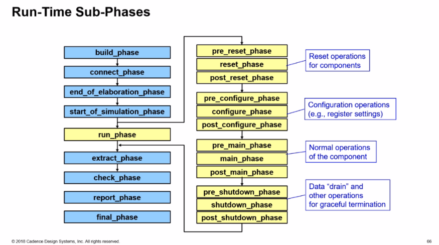

####  Topology of the test

```verilog
function void test_base::start_of_simulation_phase(uvm_phase phase);
	uvm_root::get().print_topology(); // defaults to table printer
endfunction
```

The default printer policy is **uvm_default_table_printer**

There are three default printer policies that the uvm_pkg provides:

> uvm_default_table_printer
> uvm_default_tree_printer
> uvm_default_line_printer


#### Check all configuration settings

Check all configuration settings in a components configuration table to determine if the setting has been used, overridden or not used. When *recurse* is 1 (default), configuration for this and all child components are recursively checked. This function is automatically called in the check phase, but can be manually called at any time.

To get all configuration information prior to the run phase, do something like this in your top object:

```verilog
function void start_of_simulation_phase(uvm_phase phase);
	check_config_usage();
endfunction
```

#### UVM phase



- **Functions** are executed bottom-up (Except for **build and final phases** , which are executed top-down)
- **Tasks** are forked into concurrent executing threads