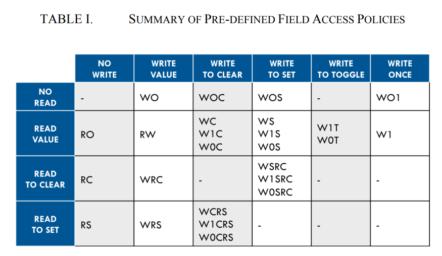
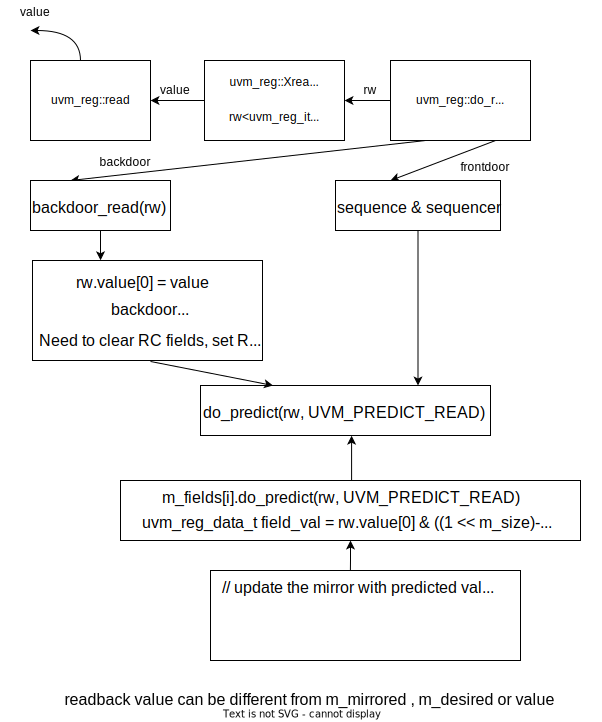

## Field Access Policies



whether a register field can be read or written depends on both the field's configured access policy and the register's rights in the map being used to access the field

[http://www.verilab.com/files/litterick_register_final.pdf](http://www.verilab.com/files/litterick_register_final.pdf)

[https://www.verilab.com/files/litterick_register_slides_sm.pdf](https://www.verilab.com/files/litterick_register_slides_sm.pdf)

## uvm_reg::write

- If a back-door access path is used, the effect of writing the register through a physical access is mimicked. For example, **read-only** bits in the registers will **not** be written. 

- The **mirrored value** will be updated using the `uvm_reg::predict()` method.

```verilog
   extern virtual task write(output uvm_status_e      status,
                             input  uvm_reg_data_t    value,
                             input  uvm_path_e        path = UVM_DEFAULT_PATH,
                             input  uvm_reg_map       map = null,
                             input  uvm_sequence_base parent = null,
                             input  int               prior = -1,
                             input  uvm_object        extension = null,
                             input  string            fname = "",
                             input  int               lineno = 0);
       
   extern virtual task do_write(uvm_reg_item rw);
```


```verilog
task uvm_reg::write(output uvm_status_e      status,
                    input  uvm_reg_data_t    value,
                    input  uvm_path_e        path = UVM_DEFAULT_PATH,
                    input  uvm_reg_map       map = null,
                    input  uvm_sequence_base parent = null,
                    input  int               prior = -1,
                    input  uvm_object        extension = null,
                    input  string            fname = "",
                    input  int               lineno = 0);

   // create an abstract transaction for this operation
   uvm_reg_item rw;

   XatomicX(1);

   set(value);

   rw = uvm_reg_item::type_id::create("write_item",,get_full_name());
   rw.element      = this;
   rw.element_kind = UVM_REG;
   rw.kind         = UVM_WRITE;
   rw.value[0]     = value;
   rw.path         = path;
   rw.map          = map;
   rw.parent       = parent;
   rw.prior        = prior;
   rw.extension    = extension;
   rw.fname        = fname;
   rw.lineno       = lineno;

   do_write(rw);

   status = rw.status;

   XatomicX(0);

endtask
```


## uvm_reg::read

- If a back-door access path is used, the effect of reading the register through a physical access is mimicked. For example, **clear-on-read** bits in the registers will be set to **zero**.

- The **mirrored value** will be updated using the `uvm_reg::predict()` method.

```verilog
   extern virtual task read(output uvm_status_e      status,
                            output uvm_reg_data_t    value,
                            input  uvm_path_e        path = UVM_DEFAULT_PATH,
                            input  uvm_reg_map       map = null,
                            input  uvm_sequence_base parent = null,
                            input  int               prior = -1,
                            input  uvm_object        extension = null,
                            input  string            fname = "",
                            input  int               lineno = 0);
   
   extern virtual task do_read(uvm_reg_item rw);
```



> **readback value can be different from m_mirrored , m_desired or value**


## uvm_reg::poke

- Deposit the value in the DUT register corresponding to this abstraction class instance, **as-is**, using a back-door access.

- Uses the HDL path for the design abstraction specified by **kind**.

- The **mirrored value** will be updated using the `uvm_reg::predict()` method.

```verilog
   extern virtual task poke(output uvm_status_e      status,
                            input  uvm_reg_data_t    value,
                            input  string            kind = "",
                            input  uvm_sequence_base parent = null,
                            input  uvm_object        extension = null,
                            input  string            fname = "",
                            input  int               lineno = 0);
```

## uvm_reg::peek

- Sample the value in the DUT register corresponding to this abstraction class instance using a **back-door** access. The register value is sampled, not modified.
- Uses the HDL path for the design abstraction specified by `kind`.
- The **mirrored value** will be updated using the `uvm_reg::predict()` method.

```verilog
   extern virtual task peek(output uvm_status_e      status,
                            output uvm_reg_data_t    value,
                            input  string            kind = "",
                            input  uvm_sequence_base parent = null,
                            input  uvm_object        extension = null,
                            input  string            fname = "",
                            input  int               lineno = 0);
```

## uvm_reg::mirror

- Read the register and optionally compared the **readback value** with the **current mirrored value** if `check` is `UVM_CHECK`.

- The **mirrored value** will be updated using the `uvm_reg::predict()` method based on the **readback value**.

- The mirroring can be performed using the physical interfaces (frontdoor) or `uvm_reg::peek()` (backdoor).

- If the register contains **write-only** fields, their content is mirrored and optionally checked only if a `UVM_BACKDOOR` access path is used to read the register. 

```verilog
   extern virtual task mirror(output uvm_status_e      status,
                              input uvm_check_e        check  = UVM_NO_CHECK,
                              input uvm_path_e         path = UVM_DEFAULT_PATH,
                              input uvm_reg_map        map = null,
                              input uvm_sequence_base  parent = null,
                              input int                prior = -1,
                              input  uvm_object        extension = null,
                              input string             fname = "",
                              input int                lineno = 0);
```

## uvm_reg::update

- Write this register if the DUT register is out-of-date with the desired/mirrored value in the abstraction class, as determined by the `uvm_reg::needs_update()` method.
- The update can be performed using the using the physical interfaces (frontdoor) or `uvm_reg::poke()` (backdoor) access.

```verilog
   extern virtual task update(output uvm_status_e      status,
                              input  uvm_path_e        path = UVM_DEFAULT_PATH,
                              input  uvm_reg_map       map = null,
                              input  uvm_sequence_base parent = null,
                              input  int               prior = -1,
                              input  uvm_object        extension = null,
                              input  string            fname = "",
                              input  int               lineno = 0);

   
   function bit uvm_reg::needs_update();
       needs_update = 0;
       foreach (m_fields[i]) begin
          if (m_fields[i].needs_update()) begin
             return 1;
          end
       end
   endfunction: needs_update
```


```verilog
task uvm_reg::update(output uvm_status_e      status,
                     input  uvm_path_e        path = UVM_DEFAULT_PATH,
                     input  uvm_reg_map       map = null,
                     input  uvm_sequence_base parent = null,
                     input  int               prior = -1,
                     input  uvm_object        extension = null,
                     input  string            fname = "",
                     input  int               lineno = 0);
   uvm_reg_data_t upd;

   status = UVM_IS_OK;

   if (!needs_update()) return;

   // Concatenate the write-to-update values from each field
   // Fields are stored in LSB or MSB order
   upd = 0;
   foreach (m_fields[i])
      upd |= m_fields[i].XupdateX() << m_fields[i].get_lsb_pos();

   write(status, upd, path, map, parent, prior, extension, fname, lineno);
endtask: update
```


## uvm_reg::predict

- Update the **mirrored and desired value** for this register.
- Predict the mirror (and desired) value of the fields in the register based on the specified observed `value` on a specified address `map`, or based on a calculated value. 
- See `uvm_reg_field::predict()` for more details.

```verilog
   extern virtual function bit predict (uvm_reg_data_t    value,
                                        uvm_reg_byte_en_t be = -1,
                                        uvm_predict_e     kind = UVM_PREDICT_DIRECT,
                                        uvm_path_e        path = UVM_FRONTDOOR,
                                        uvm_reg_map       map = null,
                                        string            fname = "",
                                        int               lineno = 0);
       
   extern virtual function void do_predict
                                (uvm_reg_item      rw,
                                 uvm_predict_e     kind = UVM_PREDICT_DIRECT,
                                 uvm_reg_byte_en_t be = -1);
  
```

### uvm_reg::do_predict

```verilog
function void uvm_reg::do_predict(uvm_reg_item      rw,
                                  uvm_predict_e     kind = UVM_PREDICT_DIRECT,
                                  uvm_reg_byte_en_t be = -1);

   uvm_reg_data_t reg_value = rw.value[0];
   m_fname = rw.fname;
   m_lineno = rw.lineno;

if (rw.status ==UVM_IS_OK )
   rw.status = UVM_IS_OK;

   if (m_is_busy && kind == UVM_PREDICT_DIRECT) begin
      `uvm_warning("RegModel", {"Trying to predict value of register '",
                  get_full_name(),"' while it is being accessed"})
      rw.status = UVM_NOT_OK;
      return;
   end

   foreach (m_fields[i]) begin
      rw.value[0] = (reg_value >> m_fields[i].get_lsb_pos()) &
                                 ((1 << m_fields[i].get_n_bits())-1);
      m_fields[i].do_predict(rw, kind, be>>(m_fields[i].get_lsb_pos()/8));
   end

   rw.value[0] = reg_value;

endfunction: do_predict
```

### uvm_reg_field::do_predict

```verilog
function void uvm_reg_field::do_predict(uvm_reg_item      rw,
                                        uvm_predict_e     kind = UVM_PREDICT_DIRECT,
                                        uvm_reg_byte_en_t be = -1);
   
   uvm_reg_data_t field_val = rw.value[0] & ((1 << m_size)-1);

   if (rw.status != UVM_NOT_OK)
     rw.status = UVM_IS_OK;

   // Assume that the entire field is enabled
   if (!be[0])
     return;

   m_fname = rw.fname;
   m_lineno = rw.lineno;

   case (kind)

     UVM_PREDICT_WRITE:
       begin
         uvm_reg_field_cb_iter cbs = new(this);

         if (rw.path == UVM_FRONTDOOR || rw.path == UVM_PREDICT)
            field_val = XpredictX(m_mirrored, field_val, rw.map);

         m_written = 1;

         for (uvm_reg_cbs cb = cbs.first(); cb != null; cb = cbs.next())
            cb.post_predict(this, m_mirrored, field_val, 
                            UVM_PREDICT_WRITE, rw.path, rw.map);

         field_val &= ('b1 << m_size)-1;

       end

     UVM_PREDICT_READ:
       begin
         uvm_reg_field_cb_iter cbs = new(this);

         if (rw.path == UVM_FRONTDOOR || rw.path == UVM_PREDICT) begin

            string acc = get_access(rw.map);

            if (acc == "RC" ||
                acc == "WRC" ||
                acc == "WSRC" ||
                acc == "W1SRC" ||
                acc == "W0SRC")
              field_val = 0;  // (clear)

            else if (acc == "RS" ||
                     acc == "WRS" ||
                     acc == "WCRS" ||
                     acc == "W1CRS" ||
                     acc == "W0CRS")
              field_val = ('b1 << m_size)-1; // all 1's (set)

            else if (acc == "WO" ||
                     acc == "WOC" ||
                     acc == "WOS" ||
                     acc == "WO1" ||
                     acc == "NOACCESS")
              return;
         end

         for (uvm_reg_cbs cb = cbs.first(); cb != null; cb = cbs.next())
            cb.post_predict(this, m_mirrored, field_val,
                            UVM_PREDICT_READ, rw.path, rw.map);

         field_val &= ('b1 << m_size)-1;

       end

     UVM_PREDICT_DIRECT:
       begin
         if (m_parent.is_busy()) begin
           `uvm_warning("RegModel", {"Trying to predict value of field '",
              get_name(),"' while register '",m_parent.get_full_name(),
              "' is being accessed"})
           rw.status = UVM_NOT_OK;
         end
       end
   endcase

   // update the mirror with predicted value
   m_mirrored = field_val;
   m_desired  = field_val;
   this.value = field_val;

endfunction: do_predict
```

### uvm_reg_field::XpredictX

```verilog
function uvm_reg_data_t uvm_reg_field::XpredictX (uvm_reg_data_t cur_val,
                                                  uvm_reg_data_t wr_val,
                                                  uvm_reg_map    map);
   uvm_reg_data_t mask = ('b1 << m_size)-1;

   case (get_access(map))
     "RO":    return cur_val;
     "RW":    return wr_val;
     "RC":    return cur_val;
     "RS":    return cur_val;
     "WC":    return '0;
     "WS":    return mask;
     "WRC":   return wr_val;
     "WRS":   return wr_val;
     "WSRC":  return mask;
     "WCRS":  return '0;
     "W1C":   return cur_val & (~wr_val);
     "W1S":   return cur_val | wr_val;
     "W1T":   return cur_val ^ wr_val;
     "W0C":   return cur_val & wr_val;
     "W0S":   return cur_val | (~wr_val & mask);
     "W0T":   return cur_val ^ (~wr_val & mask);
     "W1SRC": return cur_val | wr_val;
     "W1CRS": return cur_val & (~wr_val);
     "W0SRC": return cur_val | (~wr_val & mask);
     "W0CRS": return cur_val & wr_val;
     "WO":    return wr_val;
     "WOC":   return '0;
     "WOS":   return mask;
     "W1":    return (m_written) ? cur_val : wr_val;
     "WO1":   return (m_written) ? cur_val : wr_val;
     "NOACCESS": return cur_val;
     default: return wr_val;
   endcase

   `uvm_fatal("RegModel", "uvm_reg_field::XpredictX(): Internal error");
   return 0;
endfunction: XpredictX
```


## uvm_reg::reset , uvm_reg_field::reset

Resetting a register model sets the mirror to the reset value specified in the model

### uvm_reg::reset

```verilog
function void uvm_reg::reset(string kind = "HARD");
   foreach (m_fields[i])
      m_fields[i].reset(kind);
   // Put back a key in the semaphore if it is checked out
   // in case a thread was killed during an operation
   void'(m_atomic.try_get(1));
   m_atomic.put(1);
   m_process = null;
   Xset_busyX(0);
endfunction: reset
```

### uvm_reg_field::reset

```verilog
function void uvm_reg_field::reset(string kind = "HARD");

   if (!m_reset.exists(kind))
      return;

   m_mirrored = m_reset[kind];
   m_desired  = m_mirrored;
   value      = m_mirrored;

   if (kind == "HARD")
      m_written  = 0;

endfunction: reset
```

## uvm_reg_field::randomize

### uvm_reg_field::pre_randomize()

Update the only publicly known property `value` with the **current desired** value so it can be used as a state variable should the `rand_mode` of the field be turned off.

> `value` is `m_desired` if `rand_mode` is off.

```verilog
function void uvm_reg_field::pre_randomize();
   value = m_desired;
endfunction: pre_randomize
```

### uvm_reg_field::post_randomize

```verilog
function void uvm_reg_field::post_randomize();
   m_desired = value;
endfunction: post_randomize
```


## misc

```verilog
typedef  bit unsigned [`UVM_REG_DATA_WIDTH-1:0]  uvm_reg_data_t ;
```


```verilog
// Enum: uvm_predict_e
//
// How the mirror is to be updated
//
// UVM_PREDICT_DIRECT  - Predicted value is as-is
// UVM_PREDICT_READ    - Predict based on the specified value having been read
// UVM_PREDICT_WRITE   - Predict based on the specified value having been written
//
   typedef enum {
      UVM_PREDICT_DIRECT,
      UVM_PREDICT_READ,
      UVM_PREDICT_WRITE
   } uvm_predict_e;
```

