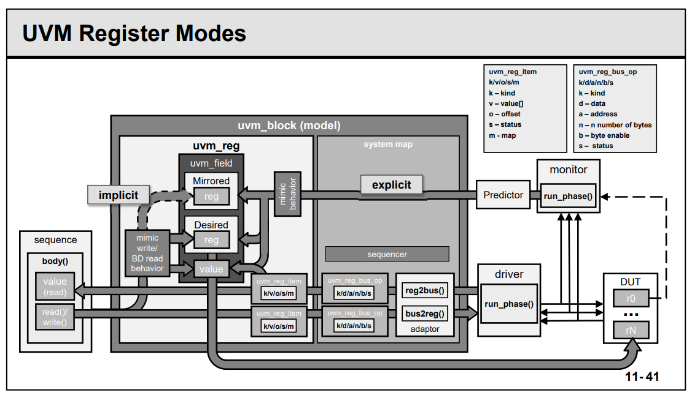
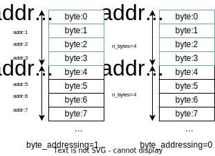

Within an UVM testbench a register model is used 

- either as a means of looking up a mirror of the current DUT hardware state 

- or as means of accessing the hardware via the front or back door 

  and updating the register model database.



#### Register Frontdoor Write

```verilog
model.r0.write(status, value, [UVM_FRONTDOOR], .parent(this));
```

- Sequence sets `uvm_reg` with value
- `uvm_reg` content is translated into bus transaction
- Driver gets bus transaction and writes DUT register
- **Mirror** can be updated either implicitly or explicitly (predictor)

#### Register Backdoor Write

```verilog
model.r0.write(status, value, UVM_BACKDOOR, .parent(this));
```

`uvm_reg` uses DPI/XMR to set DUT register with value

- Physical interface is bypassed
- Register behavior is mimicked

#### Register Backdoor Poke

```verilog
model.r0.poke(status, value, .parent(this));
```

`uvm_reg` used DPI/XMR to set DUT register with **value as is**

- Physical interface is bypassed
- Register behavior is **NOT** mimicked

---

#### Register Frontdoor Read

```verilog
model.r0.read(status, value, [UVM_FRONTDOOR], .parent(this));
```

- Sequence executes `uvm_reg` READ
- `uvm_reg` is translated into bus transaction
- Driver gets bus transaction and read DUT register
- Read value is translated into `uvm_reg` data and returned to sequence
- Mirror updates

#### Register Backdoor Read

```verilog
model.r0.read(status, value, UVM_BACKDOOR, .parent(this));
```

`uvm_reg` used DPI/XMR to get DUT register value

- Physical interface is bypassed
- Register behavior is **mimicked** (acc)

```verilog
   // EXECUTE READ...
   case (rw.path)

      // ...VIA USER BACKDOOR
      UVM_BACKDOOR: begin 
         uvm_reg_backdoor bkdr = get_backdoor();

         uvm_reg_map map = uvm_reg_map::backdoor();
         if (map.get_check_on_read()) exp = get();

         if (bkdr != null)
           bkdr.read(rw);
         else
           backdoor_read(rw);

         value = rw.value[0];

         // Need to clear RC fields, set RS fields and mask WO fields
         if (rw.status != UVM_NOT_OK) begin

            uvm_reg_data_t wo_mask;

            foreach (m_fields[i]) begin
               string acc = m_fields[i].get_access(uvm_reg_map::backdoor());
               if (acc == "RC" ||
                   acc == "WRC" ||
                   acc == "WSRC" ||
                   acc == "W1SRC" ||
                   acc == "W0SRC") begin
                  value &= ~(((1<<m_fields[i].get_n_bits())-1)
                                          << m_fields[i].get_lsb_pos());
               end
               else if (acc == "RS" ||
                        acc == "WRS" ||
                        acc == "WCRS" ||
                        acc == "W1CRS" ||
                        acc == "W0CRS") begin
                  value |= (((1<<m_fields[i].get_n_bits())-1)
                                          << m_fields[i].get_lsb_pos());
               end
               else if (acc == "WO" ||
                        acc == "WOC" ||
                        acc == "WOS" ||
                        acc == "WO1") begin
                  wo_mask |= ((1<<m_fields[i].get_n_bits())-1)
                                          << m_fields[i].get_lsb_pos();
               end
            end

            if (value != rw.value[0]) begin
              uvm_reg_data_t saved;
              saved = rw.value[0];
              rw.value[0] = value;
              if (bkdr != null)
                 bkdr.write(rw);
              else
                 backdoor_write(rw);
              rw.value[0] = saved;
            end

            rw.value[0] &= ~wo_mask;

            if (map.get_check_on_read() &&
               rw.status != UVM_NOT_OK) begin
               void'(do_check(exp, rw.value[0], map));
            end
            
            do_predict(rw, UVM_PREDICT_READ);
         end
      end
```

#### Register Backdoor Peek

```verilog
model.r0.peek(status, value, .parent(this));
```

`uvm_reg` uses DPI/XMR to get DUT register **value as is**

- Physical interface is bypassed
- Register behavior is **NOT** mimicked

```verilog
task uvm_reg::peek(output uvm_status_e      status,
                   output uvm_reg_data_t    value,
                   input  string            kind = "",
                   input  uvm_sequence_base parent = null,
                   input  uvm_object        extension = null,
                   input  string            fname = "",
                   input  int               lineno = 0);

   uvm_reg_backdoor bkdr = get_backdoor();
   uvm_reg_item rw;

   m_fname = fname;
   m_lineno = lineno;
    
   // create an abstract transaction for this operation
   rw = uvm_reg_item::type_id::create("mem_peek_item",,get_full_name());
   rw.element      = this;
   rw.path         = UVM_BACKDOOR;
   rw.element_kind = UVM_REG;
   rw.kind         = UVM_READ;
   rw.bd_kind      = kind;
   rw.parent       = parent;
   rw.extension    = extension;
   rw.fname        = fname;
   rw.lineno       = lineno;

   do_predict(rw, UVM_PREDICT_READ);

endtask: peek 

```

#### Methods to handle property of uvm_reg or uvm_reg_block

##### mirror

```verilog
model.mirror(status, [check], [path], .parent(this));
model.r0.mirro(status, [check], [path], .parent(this));
```

Update **mirrored** and **desired** properties with DUT content

##### set

```verilog
model.r0.set(value);
```

Set value in **desired** properties

##### randomize

```verilog
model.randomize();
model.r0.randomize();
```

Populate **desired** property with random value

##### get

```verilog
value = model.r0.get();
```

Get value from **desired** property

##### update

```verilog
model.update(status, [path], .parent(this));
model.r0.update(status, [path], .parent(this));
```

Update **DUT** and **mirrored** property with **desired** property if **mirrored** property is different from **desired**

##### predict

```verilog
model.r0.predict(value);
```

Set the value of **mirrored** property

##### get_mirrored_value

```verilog
value = model.r0.get_mirrored_value();
```

Get value from **mirrored** property

#### Backdoor Access

- Two ways to generate the backdoor access:
  - Via SystemVerilog Cross Module Reference (XMR)
  - Via SystemVerilog DPI call
- Both allow register model to be part of SystemVerilog package
- XMR implementation is faster
  - Requires user to compile one additional file and at compile-time provide top level path to DUT
  - **VCS only**
- DPI implementation is slower
  - No additional file is needed and top level path can be provided at run-time
  - Portable to other simulators

#### UVM Register Classes: uvm_reg_bus_op & uvm_reg_item

The generic register item is implemented as a struct in order to minimise the amount of memory resource it uses. The struct is defined as type `uvm_reg_bus_op` and this contains 6 fields:

| Property | Type              | Comment/Description                     |
| -------- | ----------------- | --------------------------------------- |
| addr     | uvm_reg_addr_t    | Address field, defaults to 64 bits      |
| data     | uvm_reg_data_t    | Read or write data, defaults to 64 bits |
| kind     | uvm_access_e      | UVM_READ or UVM_WRITE                   |
| n_bits   | unsigned int      | Number of bits being transferred        |
| byte_en  | uvm_reg_byte_en_t | Byte enable                             |
| status   | uvm_status_e      | UVM_IS_OK, UVM_IS_X, UVM_NOT_OK         |

```verilog
typedef struct {
  uvm_access_e kind;	// Kind of access: READ or WRITE.
  uvm_reg_addr_t addr;	// The bus address.
  uvm_reg_data_t data;	// The data to write.
  // The number of bits of <uvm_reg_item::value> being transferred by this transaction.
  int n_bits;	
  uvm_reg_byte_en_t byte_en;	// Enables for the byte lanes on the bus.
  uvm_status_e status;	// The result of the transaction: UVM_IS_OK, UVM_HAS_X, UVM_NOT_OK.
} uvm_reg_bus_op;
```

```verilog
class uvm_reg_item extends uvm_sequence_item;
    rand uvm_access_e kind;
    rand uvm_reg_data_t value[];
    rand uvm_reg_addr_t offset;
    uvm_status_e status;
    uvm_reg_map map;
endclass
```

#### Registers

The register class contains a `build` method which is used to **create** and **configure the fields**.

> this `build` method is not called by the UVM `build_phase`, since the register is an `uvm_object` rather than an `uvm_component`

```verilog
//
// uvm_reg constructor prototype:
//
function new (string name="",      // Register name
              int unsigned n_bits, // Register width in bits
              int has_coverage);   // Coverage model supported by the register
```

```verilog
// Function: new
// 
function new(string name = "ctrl_reg");
    super.new(name, 32, build_coverage(UVM_CVR_FIELD_VALS));
    add_coverage(build_coverage(UVM_CVR_FIELD_VALS));
    if(has_coverage(UVM_CVR_FIELD_VALS))
        cg_vals = new();
endfunction


// Function: sample_values
// 
virtual function void sample_values();
    super.sample_values();
    if (get_coverage(UVM_CVR_FIELD_VALS))
        cg_vals.sample();
endfunction


// Function: build
// 
virtual function void build();
    ass = uvm_reg_field::type_id::create("ass");
    ie = uvm_reg_field::type_id::create("ie");
    lsb = uvm_reg_field::type_id::create("lsb");
    tx_neg = uvm_reg_field::type_id::create("tx_neg");
    rx_neg = uvm_reg_field::type_id::create("rx_neg");
    go_bsy = uvm_reg_field::type_id::create("go_bsy");
    reserved2 = uvm_reg_field::type_id::create("reserved2");
    char_len = uvm_reg_field::type_id::create("char_len");

    ass.configure(this, 1, 13, "RW", 0, 1'b0, 1, 1, 0);
    ie.configure(this, 1, 12, "RW", 0, 1'b0, 1, 1, 0);
    lsb.configure(this, 1, 11, "RW", 0, 1'b0, 1, 1, 0);
    tx_neg.configure(this, 1, 10, "RW", 0, 1'b0, 1, 1, 0);
    rx_neg.configure(this, 1, 9, "RW", 0, 1'b0, 1, 1, 0);
    go_bsy.configure(this, 1, 8, "RW", 0, 1'b0, 1, 1, 0);
    reserved2.configure(this, 1, 7, "RW", 0, 1'b0, 1, 1, 0);
    char_len.configure(this, 7, 0, "RW", 0, 7'b0000000, 1, 1, 0);
endfunction
```

> As shown above, Register width is **32** same with the bus width, **lower 14 bit** is configured. 

**RTL**

```verilog
`define SPI_CTRL_BIT_NB         14
reg [`SPI_CTRL_BIT_NB-1:0] ctrl;	// Control and status register
```


#### Register Maps

Two purpose of the register map

- provide information on the offset of the registers, memories and/or register blocks
- identify bus agent based sequences to be executed  ???

>  There can be several register maps within a block, each one can specify a different **address map** and a different **target bus agent**
>
> register map has to be created which the **register block** using the `create_map` method

```verilog
//
// Prototype for the create_map method
//
function uvm_reg_map create_map(string name,               // Name of the map handle
                                uvm_reg_addr_t base_addr,  // The maps base address
                                int unsigned n_bytes,      // Map access width in bytes
                                uvm_endianness_e endian,   // The endianess of the map
                                bit byte_addressing=1);    // Whether byte_addressing is supported
 
//
// Example:
//
AHB_map = create_map("AHB_map", 'h0, 4, UVM_LITTLE_ENDIAN);
```

> - The **n_bytes** parameter is the word size (bus width) of the bus to which the map is associated. If a register's width exceeds the bus width, more than one bus access is needed to read and write that register over that bus.
>
> - he *byte_addressing* argument affects how the address is incremented in these consecutive accesses. For example, if *n_bytes*=4 and *byte_addressing*=0, then an access to a register that is 64-bits wide and at offset 0 will result in two bus accesses at addresses 0 and 1. With *byte_addressing*=1, that same access will result in two bus accesses at addresses 0 and 4.
>
>   **The default for *byte_addressing is* 1**
>   
> - The **first map** to be created within a register block is assigned to the **default_map** member of the register block




#### Register Adapter

| uvm_reg_adapter              |                                                              |
| ---------------------------- | ------------------------------------------------------------ |
| **Methods**                  | **Description**                                              |
| reg2bus                      | Overload to convert generic register access items to target bus agent sequence items |
| bus2reg                      | Overload to convert target bus sequence items to register model items |
| **Properties (Of type bit)** | **Description**                                              |
| supports_byte_enable         | Set to 1 if the target bus and the target bus agent supports byte enables, else set to 0 |
| provides_responses           | Set to 1 if the target agent driver sends separate response sequence_items that require response handling |

> The **provides_responses** bit should be set if the agent driver returns a separate response item (i.e. `put(response)`, or `item_done(response)`) from its request item

#### Prediction

the update, or prediction, of the register model content can occur using one of three models 

##### Auto Prediction

This mode of operation is the simplest to implement, but suffers from the drawback that it can only keep the register model up to date with **the transfers that it initiates**. If any other sequences directly access the target sequencer to update register content, or if there are register accesses from other DUT interfaces, then the register model will not be updated.

```verilog
function void uvm_reg_map::set_auto_predict(bit on=1); m_auto_predict = on; endfunction

// Gets the auto-predict mode setting for this map.
function bit  uvm_reg_map::get_auto_predict(); return m_auto_predict; endfunction
```

>    // Function: set_auto_predict 
>
>    // 
>
>    // Sets the auto-predict mode for his map.
>
>    // 
>
>    // When ~on~ is ~TRUE~, 
>
>    // the register model will automatically update its **mirror** (what it thinks should be in the DUT) 
>
>    immediately after any bus read or write operation via this map. **Before** a `uvm_reg::write`
>
>    // or `uvm_reg::read` operation returns, the register's `uvm_reg::predict` method is called to update 
>
>    the **mirrored** value in the register.
>
>    // 
>
>    // When ~on~ is ~FALSE~, bus reads and writes via this map do not
>
>    // automatically update the mirror. For real-time updates to the mirror
>
>    // in this mode, you connect a `uvm_reg_predictor` instance to the bus
>
>    // monitor. The predictor takes observed bus transactions from the
>
>    // bus monitor, looks up the associated `uvm_reg` register given
>
>    // the address, then calls that register's `uvm_reg::predict` method.
>
>    // While more complex, this mode will capture all register read/write
>
>    // activity, including that not directly descendant from calls to
>
>    // `uvm_reg::write` and `uvm_reg::read`.
>
>    // 
>
>    // **By default, auto-prediction is turned off**.
>
>    // 


> The register model content is updated based on the register accesses it initiates

##### Explicit Prediction (Recommended Approach)

Explicit prediction is the **default mode** of prediction


The register model content is updated via the **predictor component** based on all observed bus transactions, ensuring that register accesses made without the register model are mirrored correctly. The predictor looks up the accessed register by address then calls its `predict()` method

###### uvm_reg::predict & uvm_reg::do_predict

```verilog
// predict
function bit uvm_reg::predict (uvm_reg_data_t    value,
                               uvm_reg_byte_en_t be = -1,
                               uvm_predict_e     kind = UVM_PREDICT_DIRECT,
                               uvm_path_e        path = UVM_FRONTDOOR,
                               uvm_reg_map       map = null,
                               string            fname = "",
                               int               lineno = 0);
  uvm_reg_item rw = new; 
  rw.value[0] = value;
  rw.path = path;
  rw.map = map; 
  rw.fname = fname;
  rw.lineno = lineno;
  do_predict(rw, kind, be); 
  predict = (rw.status == UVM_NOT_OK) ? 0 : 1; 
endfunction: predict


// do_predict
function void uvm_reg::do_predict(uvm_reg_item      rw,  
                                  uvm_predict_e     kind = UVM_PREDICT_DIRECT,
                                  uvm_reg_byte_en_t be = -1); 

   uvm_reg_data_t reg_value = rw.value[0];
   m_fname = rw.fname;
   m_lineno = rw.lineno;
   
if (rw.status ==UVM_IS_OK )
   rw.status = UVM_IS_OK;

   if (m_is_busy && kind == UVM_PREDICT_DIRECT) begin
      `uvm_warning("RegModel", {"Trying to predict value of register '",
                  get_full_name(),"' while it is being accessed"})
      rw.status = UVM_NOT_OK;
      return;
   end  
   
   foreach (m_fields[i]) begin
      rw.value[0] = (reg_value >> m_fields[i].get_lsb_pos()) &
                                 ((1 << m_fields[i].get_n_bits())-1);
      m_fields[i].do_predict(rw, kind, be>>(m_fields[i].get_lsb_pos()/8));
   end  

   rw.value[0] = reg_value;

endfunction: do_predict
```

###### uvm_reg_field::predict & uvm_reg_field::do_predict
```verilog
// predict

function bit uvm_reg_field::predict (uvm_reg_data_t    value,
                                     uvm_reg_byte_en_t be = -1,
                                     uvm_predict_e     kind = UVM_PREDICT_DIRECT,
                                     uvm_path_e        path = UVM_FRONTDOOR,
                                     uvm_reg_map       map = null,
                                     string            fname = "",
                                     int               lineno = 0);
  uvm_reg_item rw = new;
  rw.value[0] = value;
  rw.path = path;
  rw.map = map;
  rw.fname = fname;
  rw.lineno = lineno;
  do_predict(rw, kind, be);
  predict = (rw.status == UVM_NOT_OK) ? 0 : 1;
endfunction: predict


// do_predict

function void uvm_reg_field::do_predict(uvm_reg_item      rw,
                                        uvm_predict_e     kind = UVM_PREDICT_DIRECT,
                                        uvm_reg_byte_en_t be = -1);
   
   uvm_reg_data_t field_val = rw.value[0] & ((1 << m_size)-1);

   if (rw.status != UVM_NOT_OK)
     rw.status = UVM_IS_OK;

   // Assume that the entire field is enabled
   if (!be[0])
     return;

   m_fname = rw.fname;
   m_lineno = rw.lineno;

   case (kind)

     UVM_PREDICT_WRITE:
       begin
         uvm_reg_field_cb_iter cbs = new(this);

         if (rw.path == UVM_FRONTDOOR || rw.path == UVM_PREDICT)
            field_val = XpredictX(m_mirrored, field_val, rw.map);

         m_written = 1;

         for (uvm_reg_cbs cb = cbs.first(); cb != null; cb = cbs.next())
            cb.post_predict(this, m_mirrored, field_val, 
                            UVM_PREDICT_WRITE, rw.path, rw.map);

         field_val &= ('b1 << m_size)-1;

       end

     UVM_PREDICT_READ:
       begin
         uvm_reg_field_cb_iter cbs = new(this);

         if (rw.path == UVM_FRONTDOOR || rw.path == UVM_PREDICT) begin

            string acc = get_access(rw.map);

            if (acc == "RC" ||
                acc == "WRC" ||
                acc == "WSRC" ||
                acc == "W1SRC" ||
                acc == "W0SRC")
              field_val = 0;  // (clear)

            else if (acc == "RS" ||
                     acc == "WRS" ||
                     acc == "WCRS" ||
                     acc == "W1CRS" ||
                     acc == "W0CRS")
              field_val = ('b1 << m_size)-1; // all 1's (set)

            else if (acc == "WO" ||
                     acc == "WOC" ||
                     acc == "WOS" ||
                     acc == "WO1" ||
                     acc == "NOACCESS")
              return;
         end

         for (uvm_reg_cbs cb = cbs.first(); cb != null; cb = cbs.next())
            cb.post_predict(this, m_mirrored, field_val,
                            UVM_PREDICT_READ, rw.path, rw.map);

         field_val &= ('b1 << m_size)-1;

       end

     UVM_PREDICT_DIRECT:
       begin
         if (m_parent.is_busy()) begin
           `uvm_warning("RegModel", {"Trying to predict value of field '",
              get_name(),"' while register '",m_parent.get_full_name(),
              "' is being accessed"})
           rw.status = UVM_NOT_OK;
         end
       end
   endcase

   // update the mirror with predicted value
   m_mirrored = field_val;
   m_desired  = field_val;
   this.value = field_val;

endfunction: do_predict
```

###### uvm_access_e

```verilog
// Enum: uvm_access_e
//
// Type of operation begin performed
//
// UVM_READ     - Read operation
// UVM_WRITE    - Write operation
//
   typedef enum {
      UVM_READ,
      UVM_WRITE,
      UVM_BURST_READ,
      UVM_BURST_WRITE
   } uvm_access_e;
```

###### uvm_predict_e

```verilog
// Enum: uvm_predict_e
//
// How the mirror is to be updated
//
// UVM_PREDICT_DIRECT  - Predicted value is as-is
// UVM_PREDICT_READ    - Predict based on the specified value having been read
// UVM_PREDICT_WRITE   - Predict based on the specified value having been written
//
   typedef enum {
      UVM_PREDICT_DIRECT,
      UVM_PREDICT_READ,
      UVM_PREDICT_WRITE
   } uvm_predict_e;
```

###### uvm_path_e

```verilog
// Enum: uvm_path_e
//
// Path used for register operation
//
// UVM_FRONTDOOR    - Use the front door
// UVM_BACKDOOR     - Use the back door
// UVM_PREDICT      - Operation derived from observations by a bus monitor via
//                    the <uvm_reg_predictor> class.
// UVM_DEFAULT_PATH - Operation specified by the context
//
   typedef enum {
      UVM_FRONTDOOR,
      UVM_BACKDOOR,
      UVM_PREDICT,
      UVM_DEFAULT_PATH
   } uvm_path_e;
```

##### Passive Prediction
