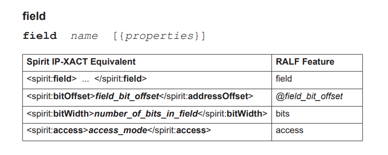

## uvm_reg_field

There are no properties for **unused** or **reserved** fields, and unlike register arrays

### ralf

- bytes: the register size, default is *N\*8 > all field*

```
register CTRL {
   left_to_right;
   field unused {bits 6;}
    field HC1R {
    bits 1; access rw  ;
    coverpoint { bins x = {0,1}}
      }
    field HC1E {bits 1 ; access rw }
    field unused {bits 2; }
    field HC0R {bits 1; access rw }
    field HCOE {bits 1 ; access rw }
    field unused {bits 2; }
    field BL {bits 1; access rw }
    field CSL {bits 1 ; access rw}
    field VSL {bits 1 ; access rw}
    field HSL {bits 1 ; access rw}
    field PC {bits 1 ; access rw}
    field CD {bits 2 ; access rw}
    field VBL {bits 2 ; access rw}
    field CBSWE {bits 1 ; access rw}
    field VBSWE {bits 1 ; access rw}
    field CBSIE {bits 1 ; access rw}
    field VBSIE {bits 1 ; access rw}
    field HIE  {bits 1 ; access rw}
    field VIE  {bits 1 ; access rw}
    field VEN  {bits 1 ; access rw}
}
```

### generated sv

```verilog
 function void build();
      this.HC1R = uvm_reg_field::type_id::create("HC1R",,get_full_name());
      this.HC1R.configure(this, 1, 23, "RW", 0, 1'h0, 0, 0, 0);
      this.HC1E = uvm_reg_field::type_id::create("HC1E",,get_full_name());
      this.HC1E.configure(this, 1, 22, "RW", 0, 1'h0, 0, 0, 0);
      this.HC0R = uvm_reg_field::type_id::create("HC0R",,get_full_name());
      this.HC0R.configure(this, 1, 19, "RW", 0, 1'h0, 0, 0, 0);
      this.HCOE = uvm_reg_field::type_id::create("HCOE",,get_full_name());
      this.HCOE.configure(this, 1, 18, "RW", 0, 1'h0, 0, 0, 0);
      this.BL = uvm_reg_field::type_id::create("BL",,get_full_name());
      this.BL.configure(this, 1, 15, "RW", 0, 1'h0, 0, 0, 0);
      this.CSL = uvm_reg_field::type_id::create("CSL",,get_full_name());
      this.CSL.configure(this, 1, 14, "RW", 0, 1'h0, 0, 0, 0);
      this.VSL = uvm_reg_field::type_id::create("VSL",,get_full_name());
      this.VSL.configure(this, 1, 13, "RW", 0, 1'h0, 0, 0, 0);
      this.HSL = uvm_reg_field::type_id::create("HSL",,get_full_name());
      this.HSL.configure(this, 1, 12, "RW", 0, 1'h0, 0, 0, 0);
      this.PC = uvm_reg_field::type_id::create("PC",,get_full_name());
      this.PC.configure(this, 1, 11, "RW", 0, 1'h0, 0, 0, 0);
      this.CD = uvm_reg_field::type_id::create("CD",,get_full_name());
      this.CD.configure(this, 2, 9, "RW", 0, 2'h0, 0, 0, 0);
      this.VBL = uvm_reg_field::type_id::create("VBL",,get_full_name());
      this.VBL.configure(this, 2, 7, "RW", 0, 2'h0, 0, 0, 0);
      this.CBSWE = uvm_reg_field::type_id::create("CBSWE",,get_full_name());
      this.CBSWE.configure(this, 1, 6, "RW", 0, 1'h0, 0, 0, 0);
      this.VBSWE = uvm_reg_field::type_id::create("VBSWE",,get_full_name());
      this.VBSWE.configure(this, 1, 5, "RW", 0, 1'h0, 0, 0, 0);
      this.CBSIE = uvm_reg_field::type_id::create("CBSIE",,get_full_name());
      this.CBSIE.configure(this, 1, 4, "RW", 0, 1'h0, 0, 0, 0);
      this.VBSIE = uvm_reg_field::type_id::create("VBSIE",,get_full_name());
      this.VBSIE.configure(this, 1, 3, "RW", 0, 1'h0, 0, 0, 0);
      this.HIE = uvm_reg_field::type_id::create("HIE",,get_full_name());
      this.HIE.configure(this, 1, 2, "RW", 0, 1'h0, 0, 0, 0);
      this.VIE = uvm_reg_field::type_id::create("VIE",,get_full_name());
      this.VIE.configure(this, 1, 1, "RW", 0, 1'h0, 0, 0, 0);
      this.VEN = uvm_reg_field::type_id::create("VEN",,get_full_name());
      this.VEN.configure(this, 1, 0, "RW", 0, 1'h0, 0, 0, 0);
   endfunction: build 
```

## uvm_reg_block

### ralf

- bytes : bus width

```
block vga_lcd  {
    bytes 4;
    endian little;
    
    register STAT (`RAL_HDL_PATH.wbs.stat[31:0]) @0004;
    register HTIM (`RAL_HDL_PATH.htim[31:0]) @0008;
    register CTRL (`RAL_HDL_PATH.wbs.ctrl[31:0]) @00010;
    register VTIM (`RAL_HDL_PATH.vtim[31:0]) @0012;
    register C1CR (`RAL_HDL_PATH.c1cr[31:0]) @0016;
    memory CLUT1  @'h0C00;
}
```

### generated sv

```verilog
this.default_map = create_map("", 0, 4, UVM_LITTLE_ENDIAN, 0);

this.STAT = ral_reg_STAT::type_id::create("STAT",,get_full_name());
this.STAT.configure(this, null, "");
this.STAT.build();
this.STAT.add_hdl_path('{ '{"wbs.stat[31:0]", -1, -1}});
this.default_map.add_reg(this.STAT, `UVM_REG_ADDR_WIDTH'h4, "RW", 0);

this.HTIM = ral_reg_HTIM::type_id::create("HTIM",,get_full_name()); 
this.HTIM.configure(this, null, "");
this.HTIM.build();
this.HTIM.add_hdl_path('{'{"htim[31:0]", -1, -1} }); 
this.default_map.add_reg(this.HTIM, `UVM_REG_ADDR_WIDTH'h8, "RW", 0);

this.CTRL = ral_reg_CTRL::type_id::create("CTRL",,get_full_name());
this.CTRL.configure(this, null, ""); 
this.CTRL.build(); 
this.CTRL.add_hdl_path('{'{"wbs.ctrl[31:0]", -1, -1} });
this.default_map.add_reg(this.CTRL, `UVM_REG_ADDR_WIDTH'hA, "RW", 0);

this.VTIM = ral_reg_VTIM::type_id::create("VTIM",,get_full_name()); 
this.VTIM.configure(this, null, "");
this.VTIM.build();
this.VTIM.add_hdl_path('{ '{"vtim[31:0]", -1, -1} }); 
this.default_map.add_reg(this.VTIM, `UVM_REG_ADDR_WIDTH'hC, "RW", 0);

this.C1CR = ral_reg_C1CR::type_id::create("C1CR",,get_full_name());
this.C1CR.configure(this, null, "");
this.C1CR.build();
this.C1CR.add_hdl_path('{ '{"c1cr[31:0]", -1, -1} });
this.default_map.add_reg(this.C1CR, `UVM_REG_ADDR_WIDTH'h10, "RW", 0);

this.CLUT1 = ral_mem_CLUT1::type_id::create("CLUT1",,get_full_name());
this.CLUT1.configure(this, "");
this.CLUT1.build();
this.default_map.add_mem(this.CLUT1, `UVM_REG_ADDR_WIDTH'hC00, "RW", 0);

```


```verilog
class ral_reg_CTRL extends uvm_reg;
class ral_reg_STAT extends uvm_reg;
class ral_reg_HTIM extends uvm_reg;
class ral_reg_VTIM extends uvm_reg;
class ral_reg_C1CR extends uvm_reg;
class ral_mem_CLUT1 extends uvm_mem;
class ral_block_vga_lcd extends uvm_reg_block;
```

## ralgen command

```bash
ralgen -uvm -t dut_regmodel0 vga_lcd_env.ralf
```


## BYTE or HALFWORD access

User is verifying 32 bit registers and the design also allows the BYTE (8 bits) and HALFWORD (16 bits) accesses.

> this is achieved by setting the **bit_addressing=0** field in the **uvm_reg_block::create_map** function.
>
> Using `create_map` in `uvm_reg_block`, you can change the type of addressing scheme you want to use; namely BYTE or HALFWORD.

**create_map**

```verilog
virtual function uvm_reg_map create_map( string name,
                                       uvm_reg_addr_t base_addr,
                                       int unsigned n_bytes,
                                       uvm_endianness_e endian,
                                       bit byte_addressing)
```

Creates an address map with the specified name, then configures it with the following properties:


| Parameter       | Description                                                  |
| --------------- | ------------------------------------------------------------ |
| base_addr       | It is the base address for the map. All registers, memories, and sub-blocks within the map will be at offsets to this address. |
| n_bytes         | It is the byte-width of the bus on which this map is used    |
| endian          | It is the endian format. See uvm_endianness_e for possible values. |
| byte_addressing | It specifies whether consecutive addresses referred are **1 byte apart (TRUE)** or **n_bytes apart (FALSE)**. Default is TRUE. |

- For HALFWORD addressing, you should call create_map the following way:

```verilog
default_map = create_map(get_name(), 0, 2, UVM_LITTLE_ENDIAN, 0); // 32 bit registers offset are 0x00, 0x02, 0x04
```

- For WORD addressing

```verilog
default_map = create_map(get_name(), 0, 4, UVM_LITTLE_ENDIAN, 0); // 32 bit registers offset are 0x00, 0x01, 0x02
```

- For BYTE addressing (default) :

```verilog 
default_map = create_map(get_name(), 0, 4, UVM_LITTLE_ENDIAN, 1); // 32 bit registers offset are 0x00, 0x04, 0x08
```

- BYTE width and byte addressing

```verilog
default_map = create_map(get_name(), 0, 1, UVM_LITTLE_ENDIAN, 1); // 32 bit registers offset are 0x00, 0x04, 0x08 
```

## uvm_reg_block::create_map

Create an address map in this block

> n_bytes   - the byte-width of the bus on which this map is used
>
> byte_addressing - specifies whether consecutive addresses refer are 1 byte apart (TRUE) or `n_bytes` apart (FALSE). Default is TRUE.


```verilog
function uvm_reg_map uvm_reg_block::create_map(string name,
                                               uvm_reg_addr_t base_addr,
                                               int unsigned n_bytes,
                                               uvm_endianness_e endian,
                                               bit byte_addressing=1);

   uvm_reg_map  map; 

   if (this.locked) begin
      `uvm_error("RegModel", "Cannot add map to locked model");
      return null;
   end  

   map = uvm_reg_map::type_id::create(name,,this.get_full_name());
   map.configure(this,base_addr,n_bytes,endian,byte_addressing);

   this.maps[map] = 1; 
   if (maps.num() == 1)
     default_map = map; 

   return map; 
endfunction
```


## uvm_reg_map::add_reg

The register is located at the specified address *offset* from this maps configured base address.

The number of consecutive physical addresses occupied by the register depends on the width of the register and the number of bytes in the physical interface corresponding to this address map.

If *unmapped* is TRUE, the register does not occupy any physical addresses and the base address is ignored. Unmapped registers require a user-defined *frontdoor* to be specified.

```verilog
function void uvm_reg_map::add_reg(uvm_reg rg,  
                                   uvm_reg_addr_t offset,
                                   string rights = "RW",
                                   bit unmapped=0,
                                   uvm_reg_frontdoor frontdoor=null);

   if (m_regs_info.exists(rg)) begin
      `uvm_error("RegModel", {"Register '",rg.get_name(),
                 "' has already been added to map '",get_name(),"'"})
      return;
   end  

   if (rg.get_parent() != get_parent()) begin
      `uvm_error("RegModel",
         {"Register '",rg.get_full_name(),"' may not be added to address map '",
          get_full_name(),"' : they are not in the same block"})
      return;
   end  
   
   rg.add_map(this);

   begin
   uvm_reg_map_info info = new; 
   info.offset   = offset;
   info.rights   = rights;
   info.unmapped = unmapped;
   info.frontdoor = frontdoor;
   m_regs_info[rg] = info;
   end  
endfunction
```


## Register Defines

### `UVM_REG_ADDR_WIDTH

Maximum address width in bits

> Default value is 64. Used to define the <uvm_reg_addr_t> type.

```verilog
`ifndef UVM_REG_ADDR_WIDTH
 `define UVM_REG_ADDR_WIDTH 64
`endif
```

### `UVM_REG_DATA_WIDTH

Maximum data width in bits

> Default value is 64. Used to define the <uvm_reg_data_t> type.

```verilog
`ifndef UVM_REG_DATA_WIDTH
 `define UVM_REG_DATA_WIDTH 64
`endif
```


## Generic RALF Features and IP-XACT Mapping

### field



### register

#### addressOffset

a register has an `addressOffset` that describes the location of the register expressed in `addressUnitBits` as offset to the starting address of the containing `addressBlock` or the containing `registerFile`

#### addressUnitBits

The `addressUnitBits` element describes the number of bits of an address increment between two **consecutive addressable units** in the `addressSpace`. If `addressUnitBits` is not described, then its value **defaults to 8**, indicating a **byte-addressable** `addressSpace`


### block


### memory


## Reference

UVM Register Abstraction Layer Generator User Guide, S-2021.09-SP1, December 2021

[User guide for the IEEE 1685 Standard for IP-XACT](https://www.accellera.org/images/downloads/standards/ip-xact/IP-XACT_User_Guide_2018-02-16.pdf)
