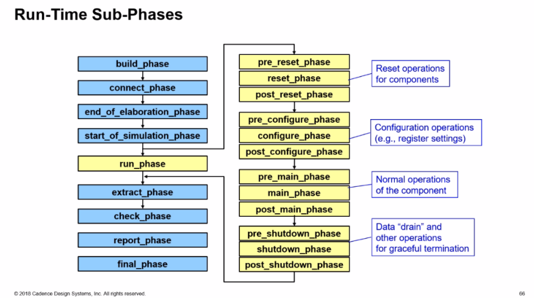

## package import in SystemVerilog compilation

> class forward declaration [[https://verificationacademy.com/forums/systemverilog/class-forward-declaration#answer-41383](https://verificationacademy.com/forums/systemverilog/class-forward-declaration#answer-41383)]


### import and compile order

#### project

**yapp_pkg.sv**

```verilog
package yapp_pkg;
import uvm_pkg::*;
`include "uvm_macros.svh"

 typedef uvm_config_db#(virtual yapp_if) yapp_vif_config;

`include "yapp_packet.sv"
`include "yapp_tx_monitor.sv"
`include "yapp_tx_sequencer.sv"
`include "yapp_tx_seqs.sv"
`include "yapp_tx_driver.sv"
`include "yapp_tx_agent.sv"
`include "yapp_env.sv"

endpackage
```

**yapp_tx_monitor.sv**

```verilog
class yapp_tx_monitor extends uvm_monitor;
  
  // Collected Data handle
  yapp_packet pkt;

  // Count packets collected
  int num_pkt_col;

  // component macro
  `uvm_component_utils_begin(yapp_tx_monitor)
    `uvm_field_int(num_pkt_col, UVM_ALL_ON + UVM_NOCOMPARE)
  `uvm_component_utils_end
/////////////////// virtual interface ////////////////////
  virtual interface yapp_if vif;
/////////////////////////////////////////////////////////
      
  function new (string name, uvm_component parent);
    super.new(name, parent);
  endfunction : new
      ...
     
endclass : yapp_tx_monitor
```

**yapp_tx_driver.sv**

```verilog
class yapp_tx_driver extends uvm_driver #(yapp_packet);

 ////////////////// virtual interface ////////////////////
  virtual interface yapp_if vif;
 /////////////////////////////////////////////////////
      
  int num_sent;

  // component macro
  `uvm_component_utils_begin(yapp_tx_driver)
    `uvm_field_int(num_sent, UVM_ALL_ON + UVM_NOCOMPARE)
  `uvm_component_utils_end

  // Constructor - required syntax for UVM automation and utilities
  function new (string name, uvm_component parent);
    super.new(name, parent);
  endfunction : new

  function void start_of_simulation_phase(uvm_phase phase);
    `uvm_info(get_type_name(), {"start of simulation for ", get_full_name()}, UVM_HIGH)
  endfunction : start_of_simulation_phase
      ...
     
endclass : yapp_tx_driver 
```

**yapp_if.sv**

```verilog
interface yapp_if (input clock, input reset );
timeunit 1ns;
timeprecision 100ps;

import uvm_pkg::*;
`include "uvm_macros.svh"

////////////////// import package //////////////////////
import yapp_pkg::*;
//////////////////////////////////////////////////////    

  // Actual Signals
  logic              in_data_vld;
  logic              in_suspend;
  logic       [7:0]  in_data;

  // signal for transaction recording
  bit monstart, drvstart;

  // local storage for payload
  logic [7:0] payload_mem [0:63];
    ...
    
endinterface : yapp_if
```

> virtual interface is in package;
>
> `yapp_pkg` is imported into interface


> !!! `typedef uvm_config_db#(virtual yapp_if) yapp_vif_config;` is  **forward declaration**
>
> *A forward `typedef` declares an identifier as a type in advance of the full definition of that type*


#### VCS compile

```bash
vcs -full64 -R -sverilog  -ntb_opts uvm-1.2 +UVM_TESTNAME=short_yapp_012_test  -f vcs.f  
```

**vcs.f**

```
-timescale=1ns/1ns

+incdir+../sv

../sv/yapp_if.sv
../sv/yapp_pkg.sv
./clkgen.sv
./hw_top.sv
./tb_top.sv
```

*output ERROR*

```
Error-[SV-LCM-PND] Package not defined
../sv/yapp_if.sv, 18
yapp_if, "yapp_pkg::"
  Package scope resolution failed. Token 'yapp_pkg' is not a package. 
  Originating module 'yapp_if'.
  Move package definition before the use of the package.
```

#### xrun compile

```
xrun -f xrun.f
```

**xrun.f**

```
-64

-uvmhome  CDNS-1.2

// incdir for include files
-incdir ../sv

+UVM_TESTNAME=short_yapp_012_test

-timescale 1ns/1ns

// compile files
../sv/yapp_if.sv
../sv/yapp_pkg.sv
./clkgen.sv
./hw_top.sv
./tb_top.sv
```

*output Error*

```
file: ../sv/yapp_if.sv
import yapp_pkg::*;
              |
xmvlog: *E,NOPBIND (../sv/yapp_if.sv,18|14): Package yapp_pkg could not be bound.
        interface worklib.yapp_if:sv
                errors: 1, warnings: 0
```


#### solution

place `../sv/yapp_pkg.sv` before `../sv/yapp_if.sv`.

> In this particular example, `yapp_pkg` is NOT needed in interface. just delete `import yapp_pkg::*` is enough in `../sv/yapp_if.sv`


### plain example

The order of compilation unit  DON'T matter

#### project

**hw_top.sv**

```verilog
module hw_top;

  // Clock and reset signals
  logic [31:0]  clock_period;
  logic         run_clock;
  logic         clock;
  logic         reset;

  // YAPP Interface to the DUT
  yapp_if in0(clock, reset);

  // CLKGEN module generates clock
  clkgen clkgen (
    .clock(clock),
    .run_clock(1'b1),
    .clock_period(32'd10)
  );

  yapp_router dut(
    .reset(reset),
    .clock(clock),
    .error(),
    // YAPP interface signals connection
    .in_data(in0.in_data),
    .in_data_vld(in0.in_data_vld),
    .in_suspend(in0.in_suspend),
    // Output Channels
    //Channel 0   
    .data_0(),
    .data_vld_0(),
    .suspend_0(1'b0),
    //Channel 1   
    .data_1(),
    .data_vld_1(),
    .suspend_1(1'b0),
    //Channel 2   
    .data_2(),  
    .data_vld_2(),
    .suspend_2(1'b0),
    // Host Interface Signals
    .haddr(),
    .hdata(),
    .hen(),
    .hwr_rd());
    
    ...
        
endmodule
```

**yapp_router.sv**

```verilog
module yapp_router (input clock,                              
                    input reset,                            
                    output error,

                    // Input channel
                    input [7:0] in_data,                           
                    input in_data_vld,                     
                    output in_suspend,
                    // Output Channels
                    output [7:0] data_0,  //Channel 0
                    output reg data_vld_0, 
                    input suspend_0, 
                    output [7:0] data_1,  //Channel 1
                    output reg data_vld_1, 
                    input suspend_1, 
                    output [7:0] data_2,  //Channel 2
                    output reg data_vld_2,
                    input suspend_2,
     
                    // Host Interface Signals
                    input [15:0] haddr,
                    inout [7:0] hdata,
                    input hen,
                    input hwr_rd);                            
...
endmodule    
```

#### compile

place **hw_top.sv** *before or after* **yapp_router.sv**  doesn't matter, the compiler (xrun, vcs) can compile them successfully.


### Conclusion

Always place package before DUT is preferred choice during compiling.


## Transaction Level Modeling (TLM)


- **Blocking methods** are defined with `get()` or `put()` **tasks** to allow them to consume time
- **Non-blocking methods** are defined with `try_get()` or `try_put()` **functions** as they execute in zero time

### Uni-Directional TLM Methods Reference

| **Method**   | **Description**                                              | **Syntax**                                    |
| ------------ | ------------------------------------------------------------ | --------------------------------------------- |
| `put()`      | Blocking put                                                 | `virtual task put(iput TR t);`                |
| `try_put()`  | Nonblocking put<br />-return 1 if successful<br />-return 0 if not | `virtual function bit try_put(input TR t);`   |
| `can_put()`  | Nonblocking test put<br />-return 1 if put would be successful<br />-return 0 if not | `virtual function bit can_put();`             |
| `get()`      | Blocking get                                                 | `virtual task get(output TR t);`              |
| `try_get()`  | Nonblocking get<br />-return 1 if successful<br />-return 0 if not | `virtual function bit try_get(output TR t);`  |
| `can_get()`  | Nonblocking test get<br />-return 1 if get would be successful<br />-return 0 if not | `virtual function bit can_get();`             |
| `peek()`     | Blocking peek                                                | `virtual task peek(output TR t);`             |
| `try_peek()` | Nonblocking peek<br />-return 1 if successful<br />-return 0 if not | `virtual function bit try_peek(output TR t);` |
| `can_peek`   | Nonblocking test peek<br />-return 1 if peek would be successful<br />-return 0 if not | `virtual function bit can_peek();`            |

> The `peek()` methods are similarly to the `get()` methods, but **copy** the transaction instead of **removing** it. The transaction is not consumed, and a subsequent `get` or `peek` operation will return the *same* transaction

### Selected Connector and Method Options

|                              | `put`   | `try_put` | `can_put` | `get`   | `try_get` | `can_get` | `peek`  | `try_peed` | `can_peek` |
| ---------------------------- | ------- | --------- | --------- | ------- | --------- | --------- | ------- | ---------- | ---------- |
| `uvm_put_*`                  | &check; | &check;   | &check;   |         |           |           |         |            |            |
| `uvm_blocking_put_*`         | &check; |           |           |         |           |           |         |            |            |
| `uvm_nonblocking_put_*`      |         | &check;   | &check;   |         |           |           |         |            |            |
| `uvm_get_*`                  |         |           |           | &check; | &check;   | &check;   |         |            |            |
| `uvm_blocking_get_*`         |         |           |           | &check; |           |           |         |            |            |
| `uvm_nonblocking_get_*`      |         |           |           |         | &check;   | &check;   |         |            |            |
| `uvm_get_peek_*`             |         |           |           | &check; | &check;   | &check;   | &check; | &check;    | &check;    |
| `uvm_blocking_get_peek_*`    |         |           |           | &check; |           |           | &check; |            |            |
| `uvm_nonblocking_get_peek_*` |         |           |           |         | &check;   | &check;   |         | &check;    | &check;    |

> in the connectors above, `*` can be replaced by `port`, `imp`, or `export`
>
> All the methods for a specific connector type **MUST** be implemented. If you define an `uvm_put` connection between two compoents, then the component with the `uvm_put_imp` object must provide implementations of **ALL** three put methods, `put`, `try_put` and `can_put`, even if these methods are not explicitly called

### TLM FIFO

The TLM FIFO is a FIFO component wrapped in `get` and `put` `imp` connectors. This has the benefit of data storage as well as providing implementations of the communication methods. Components connected to the TLM FIFO are in control of data transfer and can simply defined port connectors to initiate read and write operations on the FIFO

#### uvm_tlm_fifo


The TLM FIFO object is effectively a FIFO component instantiated between and connected to two components. The FIFO contains `imp` connectors for the standard TLM `put` and `get`/`peek` interfaces, therefore the user does not have to define`imp` ports or communication methods and the FIRO takes care of data storage

The advantages are:

- The user does not need to define communication methods or `imp` connectors
- The FIFO provides data storage between the `write` (`put`) and `read` (`get`/`peek`) components
- There are a number of built-in methods for checking FIFO status

The disadvantages are:

- The user must now initiate both sides of the transfer (both `get`/`peek` and `put`) to complete the transaction
- Two connections must be made (both sides of the FIFO) rather than one


The `put_export` and `get_peek_export` connection objects have alternatives which provide subsets of the full connector. For example, `blocking_put_export` and `nonblocking_put_export` can replace `put_export`. `blocking_get_export`, `nonblocking_get_export` and `get_export` (as well as others) can replace `get_peek_export`.

##### built-in methods

| Method     | Description                                                  | Syntax                                                       |
| ---------- | ------------------------------------------------------------ | ------------------------------------------------------------ |
| `new`      | Standard component constructor with an additional third argument, `size`, which sets the maximum FIFO size. Default size is 1. A size of **0** is an unbounded FIFO | `function new(string name, uvm_component parent=null, int size=1);` |
| `size`     | Return size of FIFO. **0** indicates unbounded FIFO          | `virtual function int size()`                                |
| `used`     | Return number of entries written to the FIFO                 | `virtual function int used();`                               |
| `is_empty` | Return **1** if `used()` is 0, otherwise **0**               | `virtual function bit is empty();`                           |
| `is_full`  | Return 1 if `used()` is equal to `size`, otherwise **0**     | `virtual function bit is_full()`                             |
| `flush`    | Delete all entries from the FIFO, upon which `used()` is **0** and `is_empty()` is **1** | `virtual funciton void flush();`                             |


```verilog
class uvm_tlm_fifo #(type T=int) extends uvm_tlm_fifo_base #(T);
    ...
endclass    
```

```verilog
virtual class uvm_tlm_fifo_base #(type T=int) extends uvm_component;
    uvm_put_imp #(T, this_type) put_export;
    
    uvm_get_peek_imp #(T, this_type) get_peek_export;
    
    uvm_analysis_port #(T) put_ap;
    
    uvm_analysis_port #(T) get_ap;
    
    // The following are aliases to the above put_export
    uvm_put_imp      #(T, this_type) blocking_put_export;
    uvm_put_imp      #(T, this_type) nonblocking_put_export;
    
    // The following are all aliased to the above get_peek_export, which provides
    // the superset of these interfaces.
    uvm_get_peek_imp #(T, this_type) blocking_get_export;
    uvm_get_peek_imp #(T, this_type) nonblocking_get_export;
    uvm_get_peek_imp #(T, this_type) get_export;
    
    uvm_get_peek_imp #(T, this_type) blocking_peek_export;
    uvm_get_peek_imp #(T, this_type) nonblocking_peek_export;
    uvm_get_peek_imp #(T, this_type) peek_export;
    
    uvm_get_peek_imp #(T, this_type) blocking_get_peek_export;
    uvm_get_peek_imp #(T, this_type) nonblocking_get_peek_export;
    
    function new(string name, uvm_component parent = null);
        super.new(name, parent);
        
        put_export = new("put_export", this);
        blocking_put_export     = put_export;
        nonblocking_put_export  = put_export;
        
        get_peek_export = new("get_peek_export", this);
        blocking_get_peek_export    = get_peek_export;
        nonblocking_get_peek_export = get_peek_export;
        blocking_get_export         = get_peek_export;
        nonblocking_get_export      = get_peek_export;
        get_export                  = get_peek_export;
        blocking_peek_export        = get_peek_export;
        nonblocking_peek_export     = get_peek_export;
        peek_export                 = get_peek_export;
        
        put_ap = new("put_ap", this);
        get_ap = new("get_ap", this);
        
    endfunction
```


### Analysis FIFO

#### uvm_tlm_analysis_fifo


`uvm_tlm_analysis_fifo` is a specialization of `uvm_tlm_fifo`

- Intended to buffer write transactions between the UVC monitor analysis port and scoreboard

It has the following characteristics:

- Unbounded (size=0)
- `analysis_export` connector replaces `put_export`
  - Support the analysis `write` method


> By declaring the FIFO in the scoreboard, we can `get` directly from the FIFO output. 
>
> However the write side connection of the FIFO to the interface UVC monitor analysis port must be made (usually) in the testbench which has visibility of both UVC and scoreboard components. The connection is made using a connect method call inside the connect phase method

```verilog
class uvm_tlm_analysis_fifo #(type T = int) extends uvm_tlm_fifo #(T);

  // Port: analysis_export #(T)
  //  
  // The analysis_export provides the write method to all connected analysis
  // ports and parent exports:
  //  
  //|  function void write (T t)
  //  
  // Access via ports bound to this export is the normal mechanism for writing
  // to an analysis FIFO. 
  // See write method of <uvm_tlm_if_base #(T1,T2)> for more information.

  uvm_analysis_imp #(T, uvm_tlm_analysis_fifo #(T)) analysis_export;


  // Function: new
  //  
  // This is the standard uvm_component constructor. ~name~ is the local name
  // of this component. The ~parent~ should be left unspecified when this
  // component is instantiated in statically elaborated constructs and must be
  // specified when this component is a child of another UVM component.

  function new(string name ,  uvm_component parent = null);
    super.new(name, parent, 0); // analysis fifo must be unbounded
    analysis_export = new("analysis_export", this);
  endfunction

  const static string type_name = "uvm_tlm_analysis_fifo #(T)";

  virtual function string get_type_name();
    return type_name;
  endfunction

  function void write(input T t); 
    void'(this.try_put(t)); // unbounded => must succeed
  endfunction

endclass
```


### Analysis Port Broadcast


Analysis ports can (uniquely) be connected to any number of `imp` connectors, including zero


The analysis port in component *yapp_monitor* will be connected to both *monitor_one* and *monitor_two* components. Each of the receiving components has an *analysis imp object* and a write communication method declared. The write method must have the same signature - i.e., they must be void functions called write with a single input argument of type *yapp_packet*, but their implementations can be completely different.

When the `send_yapp` port is connected to both *mone_in* and *mtwo_in* imps, then a single write call from *yapp_monitor* executes both write implementations in *monitor_one* and *monitor_two*


For non-analysis connections

- the TLM object must be connected to a single destination only, i.e., each non-analysis object has exactly **one** connect call.  An object may be used multiple times as the *argument* to a connect, but exactly once as the caller. This is called **many-to-one** connection. For example, many ports can be connected to a one imp connector

For analysis connections

- a TLM object can be connected to any number of destinations i.e., one analysis object can call connect many times. This is called **one-to-many** connection. For example, one port can be connected to many imp connectors. **one-to-many** is only allowed for analysis connections. An analysis connection can also *NOT* call connect. An unconnected TLM object is also only allowed for analysis connections

### Bi-Directional TLM Transport Connection


Connector syntax

```verilog
uvm_blocking_transport_XXX #(type REA, type RSP)
uvm_nonblocking_transport_XXX #(type REQ, type RSP)
uvm_transport_XXX #(type REQ, type RSP)
```

Communication methods

```verilog
task transport(REQ request, output RSP response)
    function bit nb_transport(REQ request, output RSP response)
```


### Gotchas

FIFO/analysis FIFOs do not perform any cloning on input transactions. Therefore, you will need to
check that the UVC monitors collect every transaction into a different instance to avoid
overwriting data in the FIFOs


## reg_verifier of Cadence

### Generation


```verilog
reg_verifier -domain uvmreg -top yapp_router_regs.xml -dut_name yapp_router_regs -out_file yapp_router_regs -cov -quicktest -pkg yapp_router_reg_pkg
```


| generated file                | description                           |
| ----------------------------- | ------------------------------------- |
| yapp_router_regs_config.dat   | Configuration information             |
| yapp_router_regs_hdlpaths.dat | Path information for backddoor access |
| yapp_router_regs_rdb.sv       | Register Model                        |
| cdns_uvmreg_utils_pkg.sv      | Cadence utility package               |
| quicktest.sv                  | UVM test to verify model              |

### Sanity Check

```bash
make run_test
```


```verilog
class yapp_router_regs_t extends cdns_uvm_reg_block;
    uvm_reg_map default_map;
    uvm_reg_map router;
    rand yapp_regs_c router_yapp_regs;
    rand yapp_mem_c router_yapp_mem;
    rand yapp_pkt_mem_c router_yapp_pkt_mem;
    ...
    virtual function void build();
        router = create_map("router", `UVM_REG_ADDR_WIDTH'h0, 1, UVM_LITTLE_ENDIAN, 1);
        default_map = router;
        ...
        //Mapping router map
        router.add_submap(router_yapp_regs.default_map, `UVM_REG_ADDR_WIDTH'h1000)
        router.add_mem(router_yapp_mem, `UVM_REG_ADDR_WIDTH'h1100);
        router.add_mem(router_yapp_pkt_mem, `UVM_REG_ADDR_WIDTH'h1010);
        ...
    endfunction
    
endclass


class qt_test extends uvm_test;
    yapp_router_regs_t model;
    ...
    task run_phase(uvm_phase phase);
        ...
        model.print();
        model.default_map.print();
        model.router_yapp_regs.default_map.print();
    endtask
    ...
endclass
```

**yapp_mem_c**

```verilog
class yapp_mem_c extends uvm_mem;                                                                                                                                                                                                                                
  `uvm_object_utils(yapp_mem_c)                                                                                                       
                                                                                                                               
  function new(input string name="router_yapp_mem");                                                                                 
    super.new(name, 'h100, 8, "RW", UVM_NO_COVERAGE);                                                                                 
  endfunction                                                                                                                            
endclass
```

**yapp_pkt_mem_c**

```verilog
class yapp_pkt_mem_c extends uvm_mem;                                                                                                                                                                                                                                      
  `uvm_object_utils(yapp_pkt_mem_c)                                                                                                                                                                                            
  function new(input string name="router_yapp_pkt_mem");                                                                             
    super.new(name, 'h40, 8, "RO", UVM_NO_COVERAGE);                                                                                 
  endfunction
    
endclass
```

**yapp_regs_c**

```verilog
class yapp_regs_c extends cdns_uvm_reg_block;
  `uvm_object_utils(yapp_regs_c)
  rand addr0_cnt_reg_c addr0_cnt_reg;
  rand addr1_cnt_reg_c addr1_cnt_reg;
  rand addr2_cnt_reg_c addr2_cnt_reg;
  rand illegal_addr_cnt_reg_c addr3_cnt_reg;
  rand ctrl_reg_c ctrl_reg;
  rand en_reg_c en_reg;
  rand mem_size_reg_c mem_size_reg;
  rand oversized_pkt_cnt_reg_c oversized_pkt_cnt_reg;
  rand parity_err_cnt_reg_c parity_err_cnt_reg; 
  virtual function void build();
    uvm_reg  reg_set[$];
    default_map = create_map(get_name(), `UVM_REG_ADDR_WIDTH'h1000, 1, UVM_LITTLE_ENDIAN, 1);                                         
    begin
       uvm_reg_config_ta ta = get_reg_config("yapp_router_regs.router_yapp_regs");
       build_uvm_regs(default_map, this, null, ta, reg_se);
    end                                                                                                                               
    if(! $cast(addr0_cnt_reg, reg_set[0]))
      `uvm_error("UVM_REG", "addr0_cnt_reg register casting error")
    if(! $cast(addr1_cnt_reg, reg_set[1]))
      `uvm_error("UVM_REG", "addr1_cnt_reg register casting error")
    if(! $cast(addr2_cnt_reg, reg_set[2]))
      `uvm_error("UVM_REG", "addr2_cnt_reg register casting error")
    if(! $cast(addr3_cnt_reg, reg_set[3]))
      `uvm_error("UVM_REG", "addr3_cnt_reg register casting error")
    if(! $cast(ctrl_reg, reg_set[4]))
      `uvm_error("UVM_REG", "ctrl_reg register casting error")
    if(! $cast(en_reg, reg_set[5]))
      `uvm_error("UVM_REG", "en_reg register casting error")
    if(! $cast(mem_size_reg, reg_set[6]))
      `uvm_error("UVM_REG", "mem_size_reg register casting error")
    if(! $cast(oversized_pkt_cnt_reg, reg_set[7]))
      `uvm_error("UVM_REG", "oversized_pkt_cnt_reg register casting error")
    if(! $cast(parity_err_cnt_reg, reg_set[8]))
      `uvm_error("UVM_REG", "parity_err_cnt_reg register casting error")
  endfunction   
                                                 
  function new(input string name="router_yapp_regs");
    super.new(name, UVM_NO_COVERAGE);
  endfunction  
endclass 
```

> ```verilog
> class uvm_reg_map extends uvm_object;
> // Function: add_submap
> //
> // Add an address map
> //
> // Add the specified address map instance to this address map.
> // The address map is located at the specified base address.
> // The number of consecutive physical addresses occupied by the submap
> // depends on the number of bytes in the physical interface
> // that corresponds to the submap,
> // the number of addresses used in the submap and
> // the number of bytes in the
> // physical interface corresponding to this address map.
> //
> // An address map may be added to multiple address maps
> // if it is accessible from multiple physical interfaces.
> // An address map may only be added to an address map
> // in the grand-parent block of the address submap.
> //
> extern virtual function void add_submap (uvm_reg_map    child_map,
>                                     uvm_reg_addr_t offset);
> 
> 
> // Function: add_mem
> //
> // Add a memory
> //
> // Add the specified memory instance to this address map.
> // The memory is located at the specified base address and has the
> // specified access rights ("RW", "RO" or "WO").
> // The number of consecutive physical addresses occupied by the memory
> // depends on the width and size of the memory and the number of bytes in the
> // physical interface corresponding to this address map.
> //
> // If ~unmapped~ is TRUE, the memory does not occupy any
> // physical addresses and the base address is ignored.
> // Unmapped memories require a user-defined ~frontdoor~ to be specified.
> //
> // A memory may be added to multiple address maps
> // if it is accessible from multiple physical interfaces.
> // A memory may only be added to an address map whose parent block
> // is the same as the memory's parent block.
> //
> extern virtual function void add_mem (uvm_mem        mem,
>                                  uvm_reg_addr_t offset,
>                                  string         rights = "RW",
>                                  bit            unmapped=0,
>                                  uvm_reg_frontdoor frontdoor=null);
> 
> 
> endclass: uvm_reg_map    
> ```


#### register model print

> // test run_phase
>
> `model.default_map.print();`

```
----------------------------------------------------------------------------------------------------------------------------            
Name                             Type                     Size  Value                                                                   
----------------------------------------------------------------------------------------------------------------------------            
model                            yapp_router_regs_t       -     @3724                                                                   
  router_yapp_regs               yapp_regs_c              -     @3792                                                                   
    addr0_cnt_reg                addr0_cnt_reg_c          -     @3827                                                                   
      addr0_cnt_reg_fld          uvm_reg_field            ...    RO addr0_cnt_reg[7:0]=8'h00                                            
    addr1_cnt_reg                addr1_cnt_reg_c          -     @3839                                                                   
      addr1_cnt_reg_fld          uvm_reg_field            ...    RO addr1_cnt_reg[7:0]=8'h00                                            
    addr2_cnt_reg                addr2_cnt_reg_c          -     @3857                                                                   
      addr2_cnt_reg_fld          uvm_reg_field            ...    RO addr2_cnt_reg[7:0]=8'h00                                            
    addr3_cnt_reg                illegal_addr_cnt_reg_c   -     @3874                                                                   
      addr3_cnt_reg_fld          uvm_reg_field            ...    RO addr3_cnt_reg[7:0]=8'h00                                            
    ctrl_reg                     ctrl_reg_c               -     @3891                                                                   
      plen                       uvm_reg_field            ...    RW ctrl_reg[5:0]=6'h3f                                                 
      rsvd_0                     uvm_reg_field            ...    RW ctrl_reg[7:6]=2'h0                                                  
    en_reg                       en_reg_c                 -     @3908                                                                   
      router_en                  uvm_reg_field            ...    RW en_reg[0:0]=1'h1                                                    
      parity_err_cnt_en          uvm_reg_field            ...    RW en_reg[1:1]=1'h0                                                    
      oversized_pkt_cnt_en       uvm_reg_field            ...    RW en_reg[2:2]=1'h0                                                    
      rsvd_0                     uvm_reg_field            ...    RW en_reg[3:3]=1'h0                                                    
      addr0_cnt_en               uvm_reg_field            ...    RW en_reg[4:4]=1'h0                                                    
      addr1_cnt_en               uvm_reg_field            ...    RW en_reg[5:5]=1'h0                                                    
      addr2_cnt_en               uvm_reg_field            ...    RW en_reg[6:6]=1'h0                                                    
      addr3_cnt_en               uvm_reg_field            ...    RW en_reg[7:7]=1'h0                                                    
    mem_size_reg                 mem_size_reg_c           -     @3928                                                                   
      mem_size_reg_fld           uvm_reg_field            ...    RO mem_size_reg[7:0]=8'h00                                             
    oversized_pkt_cnt_reg        oversized_pkt_cnt_reg_c  -     @3966                                                                   
      oversized_pkt_cnt_reg_fld  uvm_reg_field            ...    RO oversized_pkt_cnt_reg[7:0]=8'h00                                    
    parity_err_cnt_reg           parity_err_cnt_reg_c     -     @3983                                                                   
      parity_err_cnt_reg_fld     uvm_reg_field            ...    RO parity_err_cnt_reg[7:0]=8'h00                                       
  router_yapp_mem                yapp_mem_c               -     @3757                                                                   
    n_bits                       integral                 32    'd8                                                                     
    size                         integral                 32    'd256                                                                   
  router_yapp_pkt_mem            yapp_pkt_mem_c           -     @3779                                                                   
    n_bits                       integral                 32    'd8                                                                     
    size                         integral                 32    'd64
    router                       uvm_reg_map              0     id=@3737 seqr=HI0.sqr offset=0x0 size=0x1200 baseaddr=0x0               
      router_yapp_regs           uvm_reg_map              0     id=@3816 seqr=HI0.sqr offset=0x1000 size=0x5 baseaddr=0x1000            
----------------------------------------------------------------------------------------------------------------------------
```

#### address map print

> // test run_phase
>
> `model.router_yapp_regs.default_map.print();`

```
---------------------------------------------------------------------------
Name                       Type                     Size  Value
---------------------------------------------------------------------------
router                     uvm_reg_map              -     @3737
  endian                                            ...   UVM_LITTLE_ENDIAN
  effective sequencer      uvm_sequencer            ...   HI0.sqr
  router_yapp_mem          yapp_mem_c               ...   @3757 +'h1100
  router_yapp_pkt_mem      yapp_pkt_mem_c           ...   @3779 +'h1010
  router_yapp_regs         uvm_reg_map              -     @3816
    endian                                          ...   UVM_LITTLE_ENDIAN
    effective sequencer    uvm_sequencer            ...   HI0.sqr
    addr0_cnt_reg          addr0_cnt_reg_c          ...   @3827 +'h1009
    addr1_cnt_reg          addr1_cnt_reg_c          ...   @3839 +'h100a
    addr2_cnt_reg          addr2_cnt_reg_c          ...   @3857 +'h100b
    addr3_cnt_reg          illegal_addr_cnt_reg_c   ...   @3874 +'h1006
    ctrl_reg               ctrl_reg_c               ...   @3891 +'h1000
    en_reg                 en_reg_c                 ...   @3908 +'h1001
    mem_size_reg           mem_size_reg_c           ...   @3928 +'h100d
    oversized_pkt_cnt_reg  oversized_pkt_cnt_reg_c  ...   @3966 +'h1005
    parity_err_cnt_reg     parity_err_cnt_reg_c     ...   @3983 +'h1004
---------------------------------------------------------------------------

```

#### submap print

> // test run_phase
>
> `model.router_yapp_regs.default_map.print();`

```verilog
-------------------------------------------------------------------------
Name                     Type                     Size  Value
-------------------------------------------------------------------------
router_yapp_regs         uvm_reg_map              -     @3814
  endian                                          ...   UVM_LITTLE_ENDIAN
  effective sequencer    uvm_sequencer            ...   HI0.sqr
  addr0_cnt_reg          addr0_cnt_reg_c          ...   @3825 +'h1009
  addr1_cnt_reg          addr1_cnt_reg_c          ...   @3837 +'h100a
  addr2_cnt_reg          addr2_cnt_reg_c          ...   @3855 +'h100b
  addr3_cnt_reg          illegal_addr_cnt_reg_c   ...   @3872 +'h1006
  ctrl_reg               ctrl_reg_c               ...   @3889 +'h1000
  en_reg                 en_reg_c                 ...   @3906 +'h1001
  mem_size_reg           mem_size_reg_c           ...   @3926 +'h100d
  oversized_pkt_cnt_reg  oversized_pkt_cnt_reg_c  ...   @3964 +'h1005
  parity_err_cnt_reg     parity_err_cnt_reg_c     ...   @3981 +'h1004
-------------------------------------------------------------------------
```


### cdns_uvmreg_utils_pkg

#### uvm_reg_field_config_t

```verilog
   typedef struct  {                                                                         
        string         name; 
        int unsigned   size; 
        int unsigned   lsb_pos;
        string         access;
        bit            volatile;
        uvm_reg_data_t reset;
        bit            has_reset;
        bit            is_rand; 
        bit            individually_accessible;
      } uvm_reg_field_config_t; 
```

#### uvm_reg_config_t

```verilog
   typedef struct  {
        string          reg_type_name;
        string          configUID;
        string          name;
        uvm_reg_addr_t  offset;
        int unsigned    size_bytes;
        int unsigned    addr_bits;
        string          access;
        int             is_array;
        string          range;
      } uvm_reg_config_t; 
```

#### uvm_blk_config_t

```verilog
   typedef struct {                             
        uvm_reg_addr_t   base_addr;
        int              n_bytes;
        uvm_endianness_e endianess;
        bit              byte_addr_t;
          } uvm_blk_config_t; 
```

#### uvm_reg_field_config_ta

```verilog
typedef uvm_reg_field_config_t uvm_reg_field_config_ta[];
```

#### uvm_reg_field_config_tq

```verilog
typedef uvm_reg_field_config_ta uvm_reg_field_config_tq[string];
```

#### build_uvm_regs


```verilog
function automatic void build_uvm_regs(uvm_reg_map map, uvm_reg_block pblock, uvm_reg_file pfile, ref uvm_reg_config_t f_props[], output uvm_reg out[$]);
   foreach(f_props[idx]) begin        
      uvm_reg_config_t f= f_props[idx];
      if(f.is_array == 0) begin                  
         cdns_uvm_reg reg_t;
         uvm_object obj = factory.create(f.reg_type_name, pfile!=null ? pfile.get_full_name(): "",f.name);
         assert($cast(reg_t,obj));            
         reg_t.configure(pblock, pfile, "");
         reg_t.setconfigUID(f.configUID);       
         reg_t.build();
         // !!! f.offset !!!
         map.add_reg(reg_t, f.offset, f.access);            
         out.push_back(reg_t);
         // !!! print the offset
          `uvm_info("[build_uvm_regs]", $sformatf("### %s offset: %0x", f.reg_type_name, f.offset), UVM_LOW)
      end
       
      else if (f.is_array == 1) begin             
         int unsigned array_offset;               
         string range_str = f.range;        
         int indx, arr_idx = 0;                 
         int range_arr [];                               
         int arr_size = 1;                        
```

> - dynamic array
>   - need `new[size]`
> - queue
>   - DONT need `new`

```
UVM_INFO ./cdns_uvmreg_utils_pkg.sv(322) @ 0: reporter [[build_uvm_regs]] ### addr0_cnt_reg_c offset: 9                                 
UVM_INFO ./cdns_uvmreg_utils_pkg.sv(322) @ 0: reporter [[build_uvm_regs]] ### addr1_cnt_reg_c offset: a                                 
UVM_INFO ./cdns_uvmreg_utils_pkg.sv(322) @ 0: reporter [[build_uvm_regs]] ### addr2_cnt_reg_c offset: b                                 
UVM_INFO ./cdns_uvmreg_utils_pkg.sv(322) @ 0: reporter [[build_uvm_regs]] ### illegal_addr_cnt_reg_c offset: 6                          
UVM_INFO ./cdns_uvmreg_utils_pkg.sv(322) @ 0: reporter [[build_uvm_regs]] ### ctrl_reg_c offset: 0                                      
UVM_INFO ./cdns_uvmreg_utils_pkg.sv(322) @ 0: reporter [[build_uvm_regs]] ### en_reg_c offset: 1                                        
UVM_INFO ./cdns_uvmreg_utils_pkg.sv(322) @ 0: reporter [[build_uvm_regs]] ### mem_size_reg_c offset: d                                  
UVM_INFO ./cdns_uvmreg_utils_pkg.sv(322) @ 0: reporter [[build_uvm_regs]] ### oversized_pkt_cnt_reg_c offset: 5                         
UVM_INFO ./cdns_uvmreg_utils_pkg.sv(322) @ 0: reporter [[build_uvm_regs]] ### parity_err_cnt_reg_c offset: 4
```

> In submap, offset is **0-based**,  `router.add_submap(router_yapp_regs.default_map, ``UVM_REG_ADDR_WIDTH'h1000)`  configure base addr for submap

### IP-XACT XML : yapp_router_regs.xml


#### memory

##### yapp_pkt_mem


##### yapp_mem


#### register


#### yapp_regs

##### ctrl_reg


##### en_reg


## UVM Register Abstraction Layer (RAL) - overview

Within an UVM testbench a register model is used 

- either as a means of looking up a mirror of the current DUT hardware state 

- or as means of accessing the hardware via the front or back door 

  and updating the register model database.


### Register Frontdoor Write

```verilog
model.r0.write(status, value, [UVM_FRONTDOOR], .parent(this));
```

- Sequence sets `uvm_reg` with value
- `uvm_reg` content is translated into bus transaction
- Driver gets bus transaction and writes DUT register
- **Mirror** can be updated either implicitly or explicitly (predictor)

### Register Backdoor Write

```verilog
model.r0.write(status, value, UVM_BACKDOOR, .parent(this));
```

`uvm_reg` uses DPI/XMR to set DUT register with value

- Physical interface is bypassed
- Register behavior is mimicked

### Register Backdoor Poke

```verilog
model.r0.poke(status, value, .parent(this));
```

`uvm_reg` used DPI/XMR to set DUT register with **value as is**

- Physical interface is bypassed
- Register behavior is **NOT** mimicked

---

### Register Frontdoor Read

```verilog
model.r0.read(status, value, [UVM_FRONTDOOR], .parent(this));
```

- Sequence executes `uvm_reg` READ
- `uvm_reg` is translated into bus transaction
- Driver gets bus transaction and read DUT register
- Read value is translated into `uvm_reg` data and returned to sequence
- Mirror updates

### Register Backdoor Read

```verilog
model.r0.read(status, value, UVM_BACKDOOR, .parent(this));
```

`uvm_reg` used DPI/XMR to get DUT register value

- Physical interface is bypassed
- Register behavior is **mimicked** (acc)

```verilog
   // EXECUTE READ...
   case (rw.path)

      // ...VIA USER BACKDOOR
      UVM_BACKDOOR: begin 
         uvm_reg_backdoor bkdr = get_backdoor();

         uvm_reg_map map = uvm_reg_map::backdoor();
         if (map.get_check_on_read()) exp = get();

         if (bkdr != null)
           bkdr.read(rw);
         else
           backdoor_read(rw);

         value = rw.value[0];

         // Need to clear RC fields, set RS fields and mask WO fields
         if (rw.status != UVM_NOT_OK) begin

            uvm_reg_data_t wo_mask;

            foreach (m_fields[i]) begin
               string acc = m_fields[i].get_access(uvm_reg_map::backdoor());
               if (acc == "RC" ||
                   acc == "WRC" ||
                   acc == "WSRC" ||
                   acc == "W1SRC" ||
                   acc == "W0SRC") begin
                  value &= ~(((1<<m_fields[i].get_n_bits())-1)
                                          << m_fields[i].get_lsb_pos());
               end
               else if (acc == "RS" ||
                        acc == "WRS" ||
                        acc == "WCRS" ||
                        acc == "W1CRS" ||
                        acc == "W0CRS") begin
                  value |= (((1<<m_fields[i].get_n_bits())-1)
                                          << m_fields[i].get_lsb_pos());
               end
               else if (acc == "WO" ||
                        acc == "WOC" ||
                        acc == "WOS" ||
                        acc == "WO1") begin
                  wo_mask |= ((1<<m_fields[i].get_n_bits())-1)
                                          << m_fields[i].get_lsb_pos();
               end
            end

            if (value != rw.value[0]) begin
              uvm_reg_data_t saved;
              saved = rw.value[0];
              rw.value[0] = value;
              if (bkdr != null)
                 bkdr.write(rw);
              else
                 backdoor_write(rw);
              rw.value[0] = saved;
            end

            rw.value[0] &= ~wo_mask;

            if (map.get_check_on_read() &&
               rw.status != UVM_NOT_OK) begin
               void'(do_check(exp, rw.value[0], map));
            end
            
            do_predict(rw, UVM_PREDICT_READ);
         end
      end
```

### Register Backdoor Peek

```verilog
model.r0.peek(status, value, .parent(this));
```

`uvm_reg` uses DPI/XMR to get DUT register **value as is**

- Physical interface is bypassed
- Register behavior is **NOT** mimicked

```verilog
task uvm_reg::peek(output uvm_status_e      status,
                   output uvm_reg_data_t    value,
                   input  string            kind = "",
                   input  uvm_sequence_base parent = null,
                   input  uvm_object        extension = null,
                   input  string            fname = "",
                   input  int               lineno = 0);

   uvm_reg_backdoor bkdr = get_backdoor();
   uvm_reg_item rw;

   m_fname = fname;
   m_lineno = lineno;
    
   // create an abstract transaction for this operation
   rw = uvm_reg_item::type_id::create("mem_peek_item",,get_full_name());
   rw.element      = this;
   rw.path         = UVM_BACKDOOR;
   rw.element_kind = UVM_REG;
   rw.kind         = UVM_READ;
   rw.bd_kind      = kind;
   rw.parent       = parent;
   rw.extension    = extension;
   rw.fname        = fname;
   rw.lineno       = lineno;

   do_predict(rw, UVM_PREDICT_READ);

endtask: peek 

```

### Methods to handle property of uvm_reg or uvm_reg_block

#### mirror

```verilog
model.mirror(status, [check], [path], .parent(this));
model.r0.mirro(status, [check], [path], .parent(this));
```

Update **mirrored** and **desired** properties with DUT content

#### set

```verilog
model.r0.set(value);
```

Set value in **desired** properties

#### randomize

```verilog
model.randomize();
model.r0.randomize();
```

Populate **desired** property with random value

#### get

```verilog
value = model.r0.get();
```

Get value from **desired** property

#### update

```verilog
model.update(status, [path], .parent(this));
model.r0.update(status, [path], .parent(this));
```

Update **DUT** and **mirrored** property with **desired** property if **mirrored** property is different from **desired**

#### predict

```verilog
model.r0.predict(value);
```

Set the value of **mirrored** property

#### get_mirrored_value

```verilog
value = model.r0.get_mirrored_value();
```

Get value from **mirrored** property

### Backdoor Access

- Two ways to generate the backdoor access:
  - Via SystemVerilog Cross Module Reference (XMR)
  - Via SystemVerilog DPI call
- Both allow register model to be part of SystemVerilog package
- XMR implementation is faster
  - Requires user to compile one additional file and at compile-time provide top level path to DUT
  - **VCS only**
- DPI implementation is slower
  - No additional file is needed and top level path can be provided at run-time
  - Portable to other simulators

### UVM Register Classes: uvm_reg_bus_op & uvm_reg_item

The generic register item is implemented as a struct in order to minimise the amount of memory resource it uses. The struct is defined as type `uvm_reg_bus_op` and this contains 6 fields:

| Property | Type              | Comment/Description                     |
| -------- | ----------------- | --------------------------------------- |
| addr     | uvm_reg_addr_t    | Address field, defaults to 64 bits      |
| data     | uvm_reg_data_t    | Read or write data, defaults to 64 bits |
| kind     | uvm_access_e      | UVM_READ or UVM_WRITE                   |
| n_bits   | unsigned int      | Number of bits being transferred        |
| byte_en  | uvm_reg_byte_en_t | Byte enable                             |
| status   | uvm_status_e      | UVM_IS_OK, UVM_IS_X, UVM_NOT_OK         |

```verilog
typedef struct {
  uvm_access_e kind;	// Kind of access: READ or WRITE.
  uvm_reg_addr_t addr;	// The bus address.
  uvm_reg_data_t data;	// The data to write.
  // The number of bits of <uvm_reg_item::value> being transferred by this transaction.
  int n_bits;	
  uvm_reg_byte_en_t byte_en;	// Enables for the byte lanes on the bus.
  uvm_status_e status;	// The result of the transaction: UVM_IS_OK, UVM_HAS_X, UVM_NOT_OK.
} uvm_reg_bus_op;
```

```verilog
class uvm_reg_item extends uvm_sequence_item;
    rand uvm_access_e kind;
    rand uvm_reg_data_t value[];
    rand uvm_reg_addr_t offset;
    uvm_status_e status;
    uvm_reg_map map;
endclass
```

### Registers

The register class contains a `build` method which is used to **create** and **configure the fields**.

> this `build` method is not called by the UVM `build_phase`, since the register is an `uvm_object` rather than an `uvm_component`

```verilog
//
// uvm_reg constructor prototype:
//
function new (string name="",      // Register name
              int unsigned n_bits, // Register width in bits
              int has_coverage);   // Coverage model supported by the register
```

```verilog
// Function: new
// 
function new(string name = "ctrl_reg");
    super.new(name, 32, build_coverage(UVM_CVR_FIELD_VALS));
    add_coverage(build_coverage(UVM_CVR_FIELD_VALS));
    if(has_coverage(UVM_CVR_FIELD_VALS))
        cg_vals = new();
endfunction


// Function: sample_values
// 
virtual function void sample_values();
    super.sample_values();
    if (get_coverage(UVM_CVR_FIELD_VALS))
        cg_vals.sample();
endfunction


// Function: build
// 
virtual function void build();
    ass = uvm_reg_field::type_id::create("ass");
    ie = uvm_reg_field::type_id::create("ie");
    lsb = uvm_reg_field::type_id::create("lsb");
    tx_neg = uvm_reg_field::type_id::create("tx_neg");
    rx_neg = uvm_reg_field::type_id::create("rx_neg");
    go_bsy = uvm_reg_field::type_id::create("go_bsy");
    reserved2 = uvm_reg_field::type_id::create("reserved2");
    char_len = uvm_reg_field::type_id::create("char_len");

    ass.configure(this, 1, 13, "RW", 0, 1'b0, 1, 1, 0);
    ie.configure(this, 1, 12, "RW", 0, 1'b0, 1, 1, 0);
    lsb.configure(this, 1, 11, "RW", 0, 1'b0, 1, 1, 0);
    tx_neg.configure(this, 1, 10, "RW", 0, 1'b0, 1, 1, 0);
    rx_neg.configure(this, 1, 9, "RW", 0, 1'b0, 1, 1, 0);
    go_bsy.configure(this, 1, 8, "RW", 0, 1'b0, 1, 1, 0);
    reserved2.configure(this, 1, 7, "RW", 0, 1'b0, 1, 1, 0);
    char_len.configure(this, 7, 0, "RW", 0, 7'b0000000, 1, 1, 0);
endfunction
```

> As shown above, Register width is **32** same with the bus width, **lower 14 bit** is configured. 

**RTL**

```verilog
`define SPI_CTRL_BIT_NB         14
reg [`SPI_CTRL_BIT_NB-1:0] ctrl;	// Control and status register
```


### Register Maps

Two purpose of the register map

- provide information on the offset of the registers, memories and/or register blocks
- identify bus agent based sequences to be executed  ???

>  There can be several register maps within a block, each one can specify a different **address map** and a different **target bus agent**
>
>  register map has to be created which the **register block** using the `create_map` method

```verilog
//
// Prototype for the create_map method
//
function uvm_reg_map create_map(string name,               // Name of the map handle
                                uvm_reg_addr_t base_addr,  // The maps base address
                                int unsigned n_bytes,      // Map access width in bytes
                                uvm_endianness_e endian,   // The endianess of the map
                                bit byte_addressing=1);    // Whether byte_addressing is supported
 
//
// Example:
//
AHB_map = create_map("AHB_map", 'h0, 4, UVM_LITTLE_ENDIAN);
```

> - The **n_bytes** parameter is the word size (bus width) of the bus to which the map is associated. If a register's width exceeds the bus width, more than one bus access is needed to read and write that register over that bus.
>
> - he *byte_addressing* argument affects how the address is incremented in these consecutive accesses. For example, if *n_bytes*=4 and *byte_addressing*=0, then an access to a register that is 64-bits wide and at offset 0 will result in two bus accesses at addresses 0 and 1. With *byte_addressing*=1, that same access will result in two bus accesses at addresses 0 and 4.
>
>   **The default for *byte_addressing is* 1**
>
> - The **first map** to be created within a register block is assigned to the **default_map** member of the register block


### Register Adapter

| uvm_reg_adapter              |                                                              |
| ---------------------------- | ------------------------------------------------------------ |
| **Methods**                  | **Description**                                              |
| reg2bus                      | Overload to convert generic register access items to target bus agent sequence items |
| bus2reg                      | Overload to convert target bus sequence items to register model items |
| **Properties (Of type bit)** | **Description**                                              |
| supports_byte_enable         | Set to 1 if the target bus and the target bus agent supports byte enables, else set to 0 |
| provides_responses           | Set to 1 if the target agent driver sends separate response sequence_items that require response handling |

> The **provides_responses** bit should be set if the agent driver returns a separate response item (i.e. `put(response)`, or `item_done(response)`) from its request item

### Prediction

the update, or prediction, of the register model content can occur using one of three models 

#### Auto Prediction

This mode of operation is the simplest to implement, but suffers from the drawback that it can only keep the register model up to date with **the transfers that it initiates**. If any other sequences directly access the target sequencer to update register content, or if there are register accesses from other DUT interfaces, then the register model will not be updated.

```verilog
function void uvm_reg_map::set_auto_predict(bit on=1); m_auto_predict = on; endfunction

// Gets the auto-predict mode setting for this map.
function bit  uvm_reg_map::get_auto_predict(); return m_auto_predict; endfunction
```

>    // Function: set_auto_predict 
>
>    // 
>
>    // Sets the auto-predict mode for his map.
>
>    // 
>
>    // When ~on~ is ~TRUE~, 
>
>    // the register model will automatically update its **mirror** (what it thinks should be in the DUT) 
>
>    immediately after any bus read or write operation via this map. **Before** a `uvm_reg::write`
>
>    // or `uvm_reg::read` operation returns, the register's `uvm_reg::predict` method is called to update 
>
>    the **mirrored** value in the register.
>
>    // 
>
>    // When ~on~ is ~FALSE~, bus reads and writes via this map do not
>
>    // automatically update the mirror. For real-time updates to the mirror
>
>    // in this mode, you connect a `uvm_reg_predictor` instance to the bus
>
>    // monitor. The predictor takes observed bus transactions from the
>
>    // bus monitor, looks up the associated `uvm_reg` register given
>
>    // the address, then calls that register's `uvm_reg::predict` method.
>
>    // While more complex, this mode will capture all register read/write
>
>    // activity, including that not directly descendant from calls to
>
>    // `uvm_reg::write` and `uvm_reg::read`.
>
>    // 
>
>    // **By default, auto-prediction is turned off**.
>
>    // 


> The register model content is updated based on the register accesses it initiates

#### Explicit Prediction (Recommended Approach)

Explicit prediction is the **default mode** of prediction


The register model content is updated via the **predictor component** based on all observed bus transactions, ensuring that register accesses made without the register model are mirrored correctly. The predictor looks up the accessed register by address then calls its `predict()` method

##### uvm_reg::predict & uvm_reg::do_predict

```verilog
// predict
function bit uvm_reg::predict (uvm_reg_data_t    value,
                               uvm_reg_byte_en_t be = -1,
                               uvm_predict_e     kind = UVM_PREDICT_DIRECT,
                               uvm_path_e        path = UVM_FRONTDOOR,
                               uvm_reg_map       map = null,
                               string            fname = "",
                               int               lineno = 0);
  uvm_reg_item rw = new; 
  rw.value[0] = value;
  rw.path = path;
  rw.map = map; 
  rw.fname = fname;
  rw.lineno = lineno;
  do_predict(rw, kind, be); 
  predict = (rw.status == UVM_NOT_OK) ? 0 : 1; 
endfunction: predict


// do_predict
function void uvm_reg::do_predict(uvm_reg_item      rw,  
                                  uvm_predict_e     kind = UVM_PREDICT_DIRECT,
                                  uvm_reg_byte_en_t be = -1); 

   uvm_reg_data_t reg_value = rw.value[0];
   m_fname = rw.fname;
   m_lineno = rw.lineno;
   
if (rw.status ==UVM_IS_OK )
   rw.status = UVM_IS_OK;

   if (m_is_busy && kind == UVM_PREDICT_DIRECT) begin
      `uvm_warning("RegModel", {"Trying to predict value of register '",
                  get_full_name(),"' while it is being accessed"})
      rw.status = UVM_NOT_OK;
      return;
   end  
   
   foreach (m_fields[i]) begin
      rw.value[0] = (reg_value >> m_fields[i].get_lsb_pos()) &
                                 ((1 << m_fields[i].get_n_bits())-1);
      m_fields[i].do_predict(rw, kind, be>>(m_fields[i].get_lsb_pos()/8));
   end  

   rw.value[0] = reg_value;

endfunction: do_predict
```

##### uvm_reg_field::predict & uvm_reg_field::do_predict

```verilog
// predict

function bit uvm_reg_field::predict (uvm_reg_data_t    value,
                                     uvm_reg_byte_en_t be = -1,
                                     uvm_predict_e     kind = UVM_PREDICT_DIRECT,
                                     uvm_path_e        path = UVM_FRONTDOOR,
                                     uvm_reg_map       map = null,
                                     string            fname = "",
                                     int               lineno = 0);
  uvm_reg_item rw = new;
  rw.value[0] = value;
  rw.path = path;
  rw.map = map;
  rw.fname = fname;
  rw.lineno = lineno;
  do_predict(rw, kind, be);
  predict = (rw.status == UVM_NOT_OK) ? 0 : 1;
endfunction: predict


// do_predict

function void uvm_reg_field::do_predict(uvm_reg_item      rw,
                                        uvm_predict_e     kind = UVM_PREDICT_DIRECT,
                                        uvm_reg_byte_en_t be = -1);
   
   uvm_reg_data_t field_val = rw.value[0] & ((1 << m_size)-1);

   if (rw.status != UVM_NOT_OK)
     rw.status = UVM_IS_OK;

   // Assume that the entire field is enabled
   if (!be[0])
     return;

   m_fname = rw.fname;
   m_lineno = rw.lineno;

   case (kind)

     UVM_PREDICT_WRITE:
       begin
         uvm_reg_field_cb_iter cbs = new(this);

         if (rw.path == UVM_FRONTDOOR || rw.path == UVM_PREDICT)
            field_val = XpredictX(m_mirrored, field_val, rw.map);

         m_written = 1;

         for (uvm_reg_cbs cb = cbs.first(); cb != null; cb = cbs.next())
            cb.post_predict(this, m_mirrored, field_val, 
                            UVM_PREDICT_WRITE, rw.path, rw.map);

         field_val &= ('b1 << m_size)-1;

       end

     UVM_PREDICT_READ:
       begin
         uvm_reg_field_cb_iter cbs = new(this);

         if (rw.path == UVM_FRONTDOOR || rw.path == UVM_PREDICT) begin

            string acc = get_access(rw.map);

            if (acc == "RC" ||
                acc == "WRC" ||
                acc == "WSRC" ||
                acc == "W1SRC" ||
                acc == "W0SRC")
              field_val = 0;  // (clear)

            else if (acc == "RS" ||
                     acc == "WRS" ||
                     acc == "WCRS" ||
                     acc == "W1CRS" ||
                     acc == "W0CRS")
              field_val = ('b1 << m_size)-1; // all 1's (set)

            else if (acc == "WO" ||
                     acc == "WOC" ||
                     acc == "WOS" ||
                     acc == "WO1" ||
                     acc == "NOACCESS")
              return;
         end

         for (uvm_reg_cbs cb = cbs.first(); cb != null; cb = cbs.next())
            cb.post_predict(this, m_mirrored, field_val,
                            UVM_PREDICT_READ, rw.path, rw.map);

         field_val &= ('b1 << m_size)-1;

       end

     UVM_PREDICT_DIRECT:
       begin
         if (m_parent.is_busy()) begin
           `uvm_warning("RegModel", {"Trying to predict value of field '",
              get_name(),"' while register '",m_parent.get_full_name(),
              "' is being accessed"})
           rw.status = UVM_NOT_OK;
         end
       end
   endcase

   // update the mirror with predicted value
   m_mirrored = field_val;
   m_desired  = field_val;
   this.value = field_val;

endfunction: do_predict
```

##### uvm_access_e

```verilog
// Enum: uvm_access_e
//
// Type of operation begin performed
//
// UVM_READ     - Read operation
// UVM_WRITE    - Write operation
//
   typedef enum {
      UVM_READ,
      UVM_WRITE,
      UVM_BURST_READ,
      UVM_BURST_WRITE
   } uvm_access_e;
```

##### uvm_predict_e

```verilog
// Enum: uvm_predict_e
//
// How the mirror is to be updated
//
// UVM_PREDICT_DIRECT  - Predicted value is as-is
// UVM_PREDICT_READ    - Predict based on the specified value having been read
// UVM_PREDICT_WRITE   - Predict based on the specified value having been written
//
   typedef enum {
      UVM_PREDICT_DIRECT,
      UVM_PREDICT_READ,
      UVM_PREDICT_WRITE
   } uvm_predict_e;
```

##### uvm_path_e

```verilog
// Enum: uvm_path_e
//
// Path used for register operation
//
// UVM_FRONTDOOR    - Use the front door
// UVM_BACKDOOR     - Use the back door
// UVM_PREDICT      - Operation derived from observations by a bus monitor via
//                    the <uvm_reg_predictor> class.
// UVM_DEFAULT_PATH - Operation specified by the context
//
   typedef enum {
      UVM_FRONTDOOR,
      UVM_BACKDOOR,
      UVM_PREDICT,
      UVM_DEFAULT_PATH
   } uvm_path_e;
```

#### Passive Prediction


## UVM Register Abstraction Layer (RAL) - source code reading

### Field Access Policies


whether a register field can be read or written depends on both the field's configured access policy and the register's rights in the map being used to access the field

[http://www.verilab.com/files/litterick_register_final.pdf](http://www.verilab.com/files/litterick_register_final.pdf)

[https://www.verilab.com/files/litterick_register_slides_sm.pdf](https://www.verilab.com/files/litterick_register_slides_sm.pdf)

### uvm_reg::write

- If a back-door access path is used, the effect of writing the register through a physical access is mimicked. For example, **read-only** bits in the registers will **not** be written. 

- The **mirrored value** will be updated using the `uvm_reg::predict()` method.

```verilog
   extern virtual task write(output uvm_status_e      status,
                             input  uvm_reg_data_t    value,
                             input  uvm_path_e        path = UVM_DEFAULT_PATH,
                             input  uvm_reg_map       map = null,
                             input  uvm_sequence_base parent = null,
                             input  int               prior = -1,
                             input  uvm_object        extension = null,
                             input  string            fname = "",
                             input  int               lineno = 0);
       
   extern virtual task do_write(uvm_reg_item rw);
```


```verilog
task uvm_reg::write(output uvm_status_e      status,
                    input  uvm_reg_data_t    value,
                    input  uvm_path_e        path = UVM_DEFAULT_PATH,
                    input  uvm_reg_map       map = null,
                    input  uvm_sequence_base parent = null,
                    input  int               prior = -1,
                    input  uvm_object        extension = null,
                    input  string            fname = "",
                    input  int               lineno = 0);

   // create an abstract transaction for this operation
   uvm_reg_item rw;

   XatomicX(1);

   set(value);

   rw = uvm_reg_item::type_id::create("write_item",,get_full_name());
   rw.element      = this;
   rw.element_kind = UVM_REG;
   rw.kind         = UVM_WRITE;
   rw.value[0]     = value;
   rw.path         = path;
   rw.map          = map;
   rw.parent       = parent;
   rw.prior        = prior;
   rw.extension    = extension;
   rw.fname        = fname;
   rw.lineno       = lineno;

   do_write(rw);

   status = rw.status;

   XatomicX(0);

endtask
```


### uvm_reg::read

- If a back-door access path is used, the effect of reading the register through a physical access is mimicked. For example, **clear-on-read** bits in the registers will be set to **zero**.

- The **mirrored value** will be updated using the `uvm_reg::predict()` method.

```verilog
   extern virtual task read(output uvm_status_e      status,
                            output uvm_reg_data_t    value,
                            input  uvm_path_e        path = UVM_DEFAULT_PATH,
                            input  uvm_reg_map       map = null,
                            input  uvm_sequence_base parent = null,
                            input  int               prior = -1,
                            input  uvm_object        extension = null,
                            input  string            fname = "",
                            input  int               lineno = 0);
   
   extern virtual task do_read(uvm_reg_item rw);
```


> **readback value can be different from m_mirrored , m_desired or value**


### uvm_reg::poke

- Deposit the value in the DUT register corresponding to this abstraction class instance, **as-is**, using a back-door access.

- Uses the HDL path for the design abstraction specified by **kind**.

- The **mirrored value** will be updated using the `uvm_reg::predict()` method.

```verilog
   extern virtual task poke(output uvm_status_e      status,
                            input  uvm_reg_data_t    value,
                            input  string            kind = "",
                            input  uvm_sequence_base parent = null,
                            input  uvm_object        extension = null,
                            input  string            fname = "",
                            input  int               lineno = 0);
```

### uvm_reg::peek

- Sample the value in the DUT register corresponding to this abstraction class instance using a **back-door** access. The register value is sampled, not modified.
- Uses the HDL path for the design abstraction specified by `kind`.
- The **mirrored value** will be updated using the `uvm_reg::predict()` method.

```verilog
   extern virtual task peek(output uvm_status_e      status,
                            output uvm_reg_data_t    value,
                            input  string            kind = "",
                            input  uvm_sequence_base parent = null,
                            input  uvm_object        extension = null,
                            input  string            fname = "",
                            input  int               lineno = 0);
```

### uvm_reg::mirror

- Read the register and optionally compared the **readback value** with the **current mirrored value** if `check` is `UVM_CHECK`.

- The **mirrored value** will be updated using the `uvm_reg::predict()` method based on the **readback value**.

- The mirroring can be performed using the physical interfaces (frontdoor) or `uvm_reg::peek()` (backdoor).

- If the register contains **write-only** fields, their content is mirrored and optionally checked only if a `UVM_BACKDOOR` access path is used to read the register. 

```verilog
   extern virtual task mirror(output uvm_status_e      status,
                              input uvm_check_e        check  = UVM_NO_CHECK,
                              input uvm_path_e         path = UVM_DEFAULT_PATH,
                              input uvm_reg_map        map = null,
                              input uvm_sequence_base  parent = null,
                              input int                prior = -1,
                              input  uvm_object        extension = null,
                              input string             fname = "",
                              input int                lineno = 0);
```

### uvm_reg::update

- Write this register if the DUT register is out-of-date with the desired/mirrored value in the abstraction class, as determined by the `uvm_reg::needs_update()` method.
- The update can be performed using the using the physical interfaces (frontdoor) or `uvm_reg::poke()` (backdoor) access.

```verilog
   extern virtual task update(output uvm_status_e      status,
                              input  uvm_path_e        path = UVM_DEFAULT_PATH,
                              input  uvm_reg_map       map = null,
                              input  uvm_sequence_base parent = null,
                              input  int               prior = -1,
                              input  uvm_object        extension = null,
                              input  string            fname = "",
                              input  int               lineno = 0);

   
   function bit uvm_reg::needs_update();
       needs_update = 0;
       foreach (m_fields[i]) begin
          if (m_fields[i].needs_update()) begin
             return 1;
          end
       end
   endfunction: needs_update
```


```verilog
task uvm_reg::update(output uvm_status_e      status,
                     input  uvm_path_e        path = UVM_DEFAULT_PATH,
                     input  uvm_reg_map       map = null,
                     input  uvm_sequence_base parent = null,
                     input  int               prior = -1,
                     input  uvm_object        extension = null,
                     input  string            fname = "",
                     input  int               lineno = 0);
   uvm_reg_data_t upd;

   status = UVM_IS_OK;

   if (!needs_update()) return;

   // Concatenate the write-to-update values from each field
   // Fields are stored in LSB or MSB order
   upd = 0;
   foreach (m_fields[i])
      upd |= m_fields[i].XupdateX() << m_fields[i].get_lsb_pos();

   write(status, upd, path, map, parent, prior, extension, fname, lineno);
endtask: update
```


### uvm_reg::predict

- Update the **mirrored and desired value** for this register.
- Predict the mirror (and desired) value of the fields in the register based on the specified observed `value` on a specified address `map`, or based on a calculated value. 
- See `uvm_reg_field::predict()` for more details.

```verilog
   extern virtual function bit predict (uvm_reg_data_t    value,
                                        uvm_reg_byte_en_t be = -1,
                                        uvm_predict_e     kind = UVM_PREDICT_DIRECT,
                                        uvm_path_e        path = UVM_FRONTDOOR,
                                        uvm_reg_map       map = null,
                                        string            fname = "",
                                        int               lineno = 0);
       
   extern virtual function void do_predict
                                (uvm_reg_item      rw,
                                 uvm_predict_e     kind = UVM_PREDICT_DIRECT,
                                 uvm_reg_byte_en_t be = -1);
  
```

#### uvm_reg::do_predict

```verilog
function void uvm_reg::do_predict(uvm_reg_item      rw,
                                  uvm_predict_e     kind = UVM_PREDICT_DIRECT,
                                  uvm_reg_byte_en_t be = -1);

   uvm_reg_data_t reg_value = rw.value[0];
   m_fname = rw.fname;
   m_lineno = rw.lineno;

if (rw.status ==UVM_IS_OK )
   rw.status = UVM_IS_OK;

   if (m_is_busy && kind == UVM_PREDICT_DIRECT) begin
      `uvm_warning("RegModel", {"Trying to predict value of register '",
                  get_full_name(),"' while it is being accessed"})
      rw.status = UVM_NOT_OK;
      return;
   end

   foreach (m_fields[i]) begin
      rw.value[0] = (reg_value >> m_fields[i].get_lsb_pos()) &
                                 ((1 << m_fields[i].get_n_bits())-1);
      m_fields[i].do_predict(rw, kind, be>>(m_fields[i].get_lsb_pos()/8));
   end

   rw.value[0] = reg_value;

endfunction: do_predict
```

#### uvm_reg_field::do_predict

```verilog
function void uvm_reg_field::do_predict(uvm_reg_item      rw,
                                        uvm_predict_e     kind = UVM_PREDICT_DIRECT,
                                        uvm_reg_byte_en_t be = -1);
   
   uvm_reg_data_t field_val = rw.value[0] & ((1 << m_size)-1);

   if (rw.status != UVM_NOT_OK)
     rw.status = UVM_IS_OK;

   // Assume that the entire field is enabled
   if (!be[0])
     return;

   m_fname = rw.fname;
   m_lineno = rw.lineno;

   case (kind)

     UVM_PREDICT_WRITE:
       begin
         uvm_reg_field_cb_iter cbs = new(this);

         if (rw.path == UVM_FRONTDOOR || rw.path == UVM_PREDICT)
            field_val = XpredictX(m_mirrored, field_val, rw.map);

         m_written = 1;

         for (uvm_reg_cbs cb = cbs.first(); cb != null; cb = cbs.next())
            cb.post_predict(this, m_mirrored, field_val, 
                            UVM_PREDICT_WRITE, rw.path, rw.map);

         field_val &= ('b1 << m_size)-1;

       end

     UVM_PREDICT_READ:
       begin
         uvm_reg_field_cb_iter cbs = new(this);

         if (rw.path == UVM_FRONTDOOR || rw.path == UVM_PREDICT) begin

            string acc = get_access(rw.map);

            if (acc == "RC" ||
                acc == "WRC" ||
                acc == "WSRC" ||
                acc == "W1SRC" ||
                acc == "W0SRC")
              field_val = 0;  // (clear)

            else if (acc == "RS" ||
                     acc == "WRS" ||
                     acc == "WCRS" ||
                     acc == "W1CRS" ||
                     acc == "W0CRS")
              field_val = ('b1 << m_size)-1; // all 1's (set)

            else if (acc == "WO" ||
                     acc == "WOC" ||
                     acc == "WOS" ||
                     acc == "WO1" ||
                     acc == "NOACCESS")
              return;
         end

         for (uvm_reg_cbs cb = cbs.first(); cb != null; cb = cbs.next())
            cb.post_predict(this, m_mirrored, field_val,
                            UVM_PREDICT_READ, rw.path, rw.map);

         field_val &= ('b1 << m_size)-1;

       end

     UVM_PREDICT_DIRECT:
       begin
         if (m_parent.is_busy()) begin
           `uvm_warning("RegModel", {"Trying to predict value of field '",
              get_name(),"' while register '",m_parent.get_full_name(),
              "' is being accessed"})
           rw.status = UVM_NOT_OK;
         end
       end
   endcase

   // update the mirror with predicted value
   m_mirrored = field_val;
   m_desired  = field_val;
   this.value = field_val;

endfunction: do_predict
```

#### uvm_reg_field::XpredictX

```verilog
function uvm_reg_data_t uvm_reg_field::XpredictX (uvm_reg_data_t cur_val,
                                                  uvm_reg_data_t wr_val,
                                                  uvm_reg_map    map);
   uvm_reg_data_t mask = ('b1 << m_size)-1;

   case (get_access(map))
     "RO":    return cur_val;
     "RW":    return wr_val;
     "RC":    return cur_val;
     "RS":    return cur_val;
     "WC":    return '0;
     "WS":    return mask;
     "WRC":   return wr_val;
     "WRS":   return wr_val;
     "WSRC":  return mask;
     "WCRS":  return '0;
     "W1C":   return cur_val & (~wr_val);
     "W1S":   return cur_val | wr_val;
     "W1T":   return cur_val ^ wr_val;
     "W0C":   return cur_val & wr_val;
     "W0S":   return cur_val | (~wr_val & mask);
     "W0T":   return cur_val ^ (~wr_val & mask);
     "W1SRC": return cur_val | wr_val;
     "W1CRS": return cur_val & (~wr_val);
     "W0SRC": return cur_val | (~wr_val & mask);
     "W0CRS": return cur_val & wr_val;
     "WO":    return wr_val;
     "WOC":   return '0;
     "WOS":   return mask;
     "W1":    return (m_written) ? cur_val : wr_val;
     "WO1":   return (m_written) ? cur_val : wr_val;
     "NOACCESS": return cur_val;
     default: return wr_val;
   endcase

   `uvm_fatal("RegModel", "uvm_reg_field::XpredictX(): Internal error");
   return 0;
endfunction: XpredictX
```


### uvm_reg::reset , uvm_reg_field::reset

Resetting a register model sets the mirror to the reset value specified in the model

#### uvm_reg::reset

```verilog
function void uvm_reg::reset(string kind = "HARD");
   foreach (m_fields[i])
      m_fields[i].reset(kind);
   // Put back a key in the semaphore if it is checked out
   // in case a thread was killed during an operation
   void'(m_atomic.try_get(1));
   m_atomic.put(1);
   m_process = null;
   Xset_busyX(0);
endfunction: reset
```

#### uvm_reg_field::reset

```verilog
function void uvm_reg_field::reset(string kind = "HARD");

   if (!m_reset.exists(kind))
      return;

   m_mirrored = m_reset[kind];
   m_desired  = m_mirrored;
   value      = m_mirrored;

   if (kind == "HARD")
      m_written  = 0;

endfunction: reset
```

### uvm_reg_field::randomize

#### uvm_reg_field::pre_randomize()

Update the only publicly known property `value` with the **current desired** value so it can be used as a state variable should the `rand_mode` of the field be turned off.

> `value` is `m_desired` if `rand_mode` is off.

```verilog
function void uvm_reg_field::pre_randomize();
   value = m_desired;
endfunction: pre_randomize
```

#### uvm_reg_field::post_randomize

```verilog
function void uvm_reg_field::post_randomize();
   m_desired = value;
endfunction: post_randomize
```


### misc

```verilog
typedef  bit unsigned [`UVM_REG_DATA_WIDTH-1:0]  uvm_reg_data_t ;
```


```verilog
// Enum: uvm_predict_e
//
// How the mirror is to be updated
//
// UVM_PREDICT_DIRECT  - Predicted value is as-is
// UVM_PREDICT_READ    - Predict based on the specified value having been read
// UVM_PREDICT_WRITE   - Predict based on the specified value having been written
//
   typedef enum {
      UVM_PREDICT_DIRECT,
      UVM_PREDICT_READ,
      UVM_PREDICT_WRITE
   } uvm_predict_e;
```


##  UVM REG RALF & IP-XACT


> UVM Register Abstraction Layer Generator User Guide, S-2021.09-SP1, December 2021
>
> [User guide for the IEEE 1685 Standard for IP-XACT](https://www.accellera.org/images/downloads/standards/ip-xact/IP-XACT_User_Guide_2018-02-16.pdf)

### uvm_reg_field

There are no properties for **unused** or **reserved** fields, and unlike register arrays

#### ralf

- bytes: the register size, default is *N\*8 > all field*

```
register CTRL {
   left_to_right;
   field unused {bits 6;}
    field HC1R {
    bits 1; access rw  ;
    coverpoint { bins x = {0,1}}
      }
    field HC1E {bits 1 ; access rw }
    field unused {bits 2; }
    field HC0R {bits 1; access rw }
    field HCOE {bits 1 ; access rw }
    field unused {bits 2; }
    field BL {bits 1; access rw }
    field CSL {bits 1 ; access rw}
    field VSL {bits 1 ; access rw}
    field HSL {bits 1 ; access rw}
    field PC {bits 1 ; access rw}
    field CD {bits 2 ; access rw}
    field VBL {bits 2 ; access rw}
    field CBSWE {bits 1 ; access rw}
    field VBSWE {bits 1 ; access rw}
    field CBSIE {bits 1 ; access rw}
    field VBSIE {bits 1 ; access rw}
    field HIE  {bits 1 ; access rw}
    field VIE  {bits 1 ; access rw}
    field VEN  {bits 1 ; access rw}
}
```

#### generated sv

```verilog
 function void build();
      this.HC1R = uvm_reg_field::type_id::create("HC1R",,get_full_name());
      this.HC1R.configure(this, 1, 23, "RW", 0, 1'h0, 0, 0, 0);
      this.HC1E = uvm_reg_field::type_id::create("HC1E",,get_full_name());
      this.HC1E.configure(this, 1, 22, "RW", 0, 1'h0, 0, 0, 0);
      this.HC0R = uvm_reg_field::type_id::create("HC0R",,get_full_name());
      this.HC0R.configure(this, 1, 19, "RW", 0, 1'h0, 0, 0, 0);
      this.HCOE = uvm_reg_field::type_id::create("HCOE",,get_full_name());
      this.HCOE.configure(this, 1, 18, "RW", 0, 1'h0, 0, 0, 0);
      this.BL = uvm_reg_field::type_id::create("BL",,get_full_name());
      this.BL.configure(this, 1, 15, "RW", 0, 1'h0, 0, 0, 0);
      this.CSL = uvm_reg_field::type_id::create("CSL",,get_full_name());
      this.CSL.configure(this, 1, 14, "RW", 0, 1'h0, 0, 0, 0);
      this.VSL = uvm_reg_field::type_id::create("VSL",,get_full_name());
      this.VSL.configure(this, 1, 13, "RW", 0, 1'h0, 0, 0, 0);
      this.HSL = uvm_reg_field::type_id::create("HSL",,get_full_name());
      this.HSL.configure(this, 1, 12, "RW", 0, 1'h0, 0, 0, 0);
      this.PC = uvm_reg_field::type_id::create("PC",,get_full_name());
      this.PC.configure(this, 1, 11, "RW", 0, 1'h0, 0, 0, 0);
      this.CD = uvm_reg_field::type_id::create("CD",,get_full_name());
      this.CD.configure(this, 2, 9, "RW", 0, 2'h0, 0, 0, 0);
      this.VBL = uvm_reg_field::type_id::create("VBL",,get_full_name());
      this.VBL.configure(this, 2, 7, "RW", 0, 2'h0, 0, 0, 0);
      this.CBSWE = uvm_reg_field::type_id::create("CBSWE",,get_full_name());
      this.CBSWE.configure(this, 1, 6, "RW", 0, 1'h0, 0, 0, 0);
      this.VBSWE = uvm_reg_field::type_id::create("VBSWE",,get_full_name());
      this.VBSWE.configure(this, 1, 5, "RW", 0, 1'h0, 0, 0, 0);
      this.CBSIE = uvm_reg_field::type_id::create("CBSIE",,get_full_name());
      this.CBSIE.configure(this, 1, 4, "RW", 0, 1'h0, 0, 0, 0);
      this.VBSIE = uvm_reg_field::type_id::create("VBSIE",,get_full_name());
      this.VBSIE.configure(this, 1, 3, "RW", 0, 1'h0, 0, 0, 0);
      this.HIE = uvm_reg_field::type_id::create("HIE",,get_full_name());
      this.HIE.configure(this, 1, 2, "RW", 0, 1'h0, 0, 0, 0);
      this.VIE = uvm_reg_field::type_id::create("VIE",,get_full_name());
      this.VIE.configure(this, 1, 1, "RW", 0, 1'h0, 0, 0, 0);
      this.VEN = uvm_reg_field::type_id::create("VEN",,get_full_name());
      this.VEN.configure(this, 1, 0, "RW", 0, 1'h0, 0, 0, 0);
   endfunction: build 
```

### uvm_reg_block

#### ralf

- bytes : bus width

```
block vga_lcd  {
    bytes 4;
    endian little;
    
    register STAT (`RAL_HDL_PATH.wbs.stat[31:0]) @0004;
    register HTIM (`RAL_HDL_PATH.htim[31:0]) @0008;
    register CTRL (`RAL_HDL_PATH.wbs.ctrl[31:0]) @00010;
    register VTIM (`RAL_HDL_PATH.vtim[31:0]) @0012;
    register C1CR (`RAL_HDL_PATH.c1cr[31:0]) @0016;
    memory CLUT1  @'h0C00;
}
```

#### generated sv

```verilog
this.default_map = create_map("", 0, 4, UVM_LITTLE_ENDIAN, 0);

this.STAT = ral_reg_STAT::type_id::create("STAT",,get_full_name());
this.STAT.configure(this, null, "");
this.STAT.build();
this.STAT.add_hdl_path('{ '{"wbs.stat[31:0]", -1, -1}});
this.default_map.add_reg(this.STAT, `UVM_REG_ADDR_WIDTH'h4, "RW", 0);

this.HTIM = ral_reg_HTIM::type_id::create("HTIM",,get_full_name()); 
this.HTIM.configure(this, null, "");
this.HTIM.build();
this.HTIM.add_hdl_path('{'{"htim[31:0]", -1, -1} }); 
this.default_map.add_reg(this.HTIM, `UVM_REG_ADDR_WIDTH'h8, "RW", 0);

this.CTRL = ral_reg_CTRL::type_id::create("CTRL",,get_full_name());
this.CTRL.configure(this, null, ""); 
this.CTRL.build(); 
this.CTRL.add_hdl_path('{'{"wbs.ctrl[31:0]", -1, -1} });
this.default_map.add_reg(this.CTRL, `UVM_REG_ADDR_WIDTH'hA, "RW", 0);

this.VTIM = ral_reg_VTIM::type_id::create("VTIM",,get_full_name()); 
this.VTIM.configure(this, null, "");
this.VTIM.build();
this.VTIM.add_hdl_path('{ '{"vtim[31:0]", -1, -1} }); 
this.default_map.add_reg(this.VTIM, `UVM_REG_ADDR_WIDTH'hC, "RW", 0);

this.C1CR = ral_reg_C1CR::type_id::create("C1CR",,get_full_name());
this.C1CR.configure(this, null, "");
this.C1CR.build();
this.C1CR.add_hdl_path('{ '{"c1cr[31:0]", -1, -1} });
this.default_map.add_reg(this.C1CR, `UVM_REG_ADDR_WIDTH'h10, "RW", 0);

this.CLUT1 = ral_mem_CLUT1::type_id::create("CLUT1",,get_full_name());
this.CLUT1.configure(this, "");
this.CLUT1.build();
this.default_map.add_mem(this.CLUT1, `UVM_REG_ADDR_WIDTH'hC00, "RW", 0);

```


```verilog
class ral_reg_CTRL extends uvm_reg;
class ral_reg_STAT extends uvm_reg;
class ral_reg_HTIM extends uvm_reg;
class ral_reg_VTIM extends uvm_reg;
class ral_reg_C1CR extends uvm_reg;
class ral_mem_CLUT1 extends uvm_mem;
class ral_block_vga_lcd extends uvm_reg_block;
```

### ralgen command

```bash
ralgen -uvm -t dut_regmodel0 vga_lcd_env.ralf
```


### BYTE or HALFWORD access

User is verifying 32 bit registers and the design also allows the BYTE (8 bits) and HALFWORD (16 bits) accesses.

> this is achieved by setting the **bit_addressing=0** field in the **uvm_reg_block::create_map** function.
>
> Using `create_map` in `uvm_reg_block`, you can change the type of addressing scheme you want to use; namely BYTE or HALFWORD.

**create_map**

```verilog
virtual function uvm_reg_map create_map( string name,
                                       uvm_reg_addr_t base_addr,
                                       int unsigned n_bytes,
                                       uvm_endianness_e endian,
                                       bit byte_addressing)
```

Creates an address map with the specified name, then configures it with the following properties:


| Parameter       | Description                                                  |
| --------------- | ------------------------------------------------------------ |
| base_addr       | It is the base address for the map. All registers, memories, and sub-blocks within the map will be at offsets to this address. |
| n_bytes         | It is the byte-width of the bus on which this map is used    |
| endian          | It is the endian format. See uvm_endianness_e for possible values. |
| byte_addressing | It specifies whether consecutive addresses referred are **1 byte apart (TRUE)** or **n_bytes apart (FALSE)**. Default is TRUE. |

- For HALFWORD addressing, you should call create_map the following way:

```verilog
default_map = create_map(get_name(), 0, 2, UVM_LITTLE_ENDIAN, 0); // 32 bit registers offset are 0x00, 0x02, 0x04
```

- For WORD addressing

```verilog
default_map = create_map(get_name(), 0, 4, UVM_LITTLE_ENDIAN, 0); // 32 bit registers offset are 0x00, 0x01, 0x02
```

- For BYTE addressing (default) :

```verilog 
default_map = create_map(get_name(), 0, 4, UVM_LITTLE_ENDIAN, 1); // 32 bit registers offset are 0x00, 0x04, 0x08
```

- BYTE width and byte addressing

```verilog
default_map = create_map(get_name(), 0, 1, UVM_LITTLE_ENDIAN, 1); // 32 bit registers offset are 0x00, 0x04, 0x08 
```

### uvm_reg_block::create_map

Create an address map in this block

> n_bytes   - the byte-width of the bus on which this map is used
>
> byte_addressing - specifies whether consecutive addresses refer are 1 byte apart (TRUE) or `n_bytes` apart (FALSE). Default is TRUE.


```verilog
function uvm_reg_map uvm_reg_block::create_map(string name,
                                               uvm_reg_addr_t base_addr,
                                               int unsigned n_bytes,
                                               uvm_endianness_e endian,
                                               bit byte_addressing=1);

   uvm_reg_map  map; 

   if (this.locked) begin
      `uvm_error("RegModel", "Cannot add map to locked model");
      return null;
   end  

   map = uvm_reg_map::type_id::create(name,,this.get_full_name());
   map.configure(this,base_addr,n_bytes,endian,byte_addressing);

   this.maps[map] = 1; 
   if (maps.num() == 1)
     default_map = map; 

   return map; 
endfunction
```


### uvm_reg_map::add_reg

The register is located at the specified address *offset* from this maps configured base address.

The number of consecutive physical addresses occupied by the register depends on the width of the register and the number of bytes in the physical interface corresponding to this address map.

If *unmapped* is TRUE, the register does not occupy any physical addresses and the base address is ignored. Unmapped registers require a user-defined *frontdoor* to be specified.

```verilog
function void uvm_reg_map::add_reg(uvm_reg rg,  
                                   uvm_reg_addr_t offset,
                                   string rights = "RW",
                                   bit unmapped=0,
                                   uvm_reg_frontdoor frontdoor=null);

   if (m_regs_info.exists(rg)) begin
      `uvm_error("RegModel", {"Register '",rg.get_name(),
                 "' has already been added to map '",get_name(),"'"})
      return;
   end  

   if (rg.get_parent() != get_parent()) begin
      `uvm_error("RegModel",
         {"Register '",rg.get_full_name(),"' may not be added to address map '",
          get_full_name(),"' : they are not in the same block"})
      return;
   end  
   
   rg.add_map(this);

   begin
   uvm_reg_map_info info = new; 
   info.offset   = offset;
   info.rights   = rights;
   info.unmapped = unmapped;
   info.frontdoor = frontdoor;
   m_regs_info[rg] = info;
   end  
endfunction
```


### Register Defines

#### `UVM_REG_ADDR_WIDTH

Maximum address width in bits

> Default value is 64. Used to define the <uvm_reg_addr_t> type.

```verilog
`ifndef UVM_REG_ADDR_WIDTH
 `define UVM_REG_ADDR_WIDTH 64
`endif
```

#### `UVM_REG_DATA_WIDTH

Maximum data width in bits

> Default value is 64. Used to define the <uvm_reg_data_t> type.

```verilog
`ifndef UVM_REG_DATA_WIDTH
 `define UVM_REG_DATA_WIDTH 64
`endif
```


### Generic RALF Features and IP-XACT Mapping

#### field


#### register

##### addressOffset

a register has an `addressOffset` that describes the location of the register expressed in `addressUnitBits` as offset to the starting address of the containing `addressBlock` or the containing `registerFile`

##### addressUnitBits

The `addressUnitBits` element describes the number of bits of an address increment between two **consecutive addressable units** in the `addressSpace`. If `addressUnitBits` is not described, then its value **defaults to 8**, indicating a **byte-addressable** `addressSpace`


#### block


#### memory


## Global Handles in UVM

### Mechanism in  UVM-1.1

```verilog
function void test_base::start_of_simulation_phase(uvm_phase phase);
	super.start_of_simulation_phase(phase);
	uvm_top.print_topology(); // Will not compile in UVM-1.2
	factory.print(); // Will not compile in UVM-1.2
endfunction
```

> Global handles uvm_top and factory in uvm_pkg have been removed in UVM-1.2 and later

### Mechanism in UVM-1.1 and UVM-1.2

Call the **get() method of the class** to retrieve the singleton handle.

```verilog
function void test_base::start_of_simulation_phase(uvm_phase phase);
	super.start_of_simulation_phase(phase);
	uvm_root::get().print_topology(); // Works in UVM-1.1 & UVM-1.2
	uvm_factory::get().print(); // Works in UVM-1.1 & UVM-1.2
endfunction
```
### Mechanism Only in UVM-1.2

```verilog
function void test_base::start_of_simulation_phase(uvm_phase phase);
	uvm_coreservice_t cs = uvm_coreservice_t::get();
	cs.get_root().print_topology();
	cs.get_factory().print();
endfunction
```

**uvm_coreservice_t** is the uvm-1.2 mechanism for accessing all the central UVM services such as
**uvm_root**,**uvm_factory**, **uvm_report_server**, etc.

```verilog
// Using the uvm_coreservice_t:
uvm_coreservice_t cs;
uvm_factory f;
uvm_root top;
cs = uvm_coreservice_t::get();
f = cs.get_factory();
top = cs.get_root();
```


## uvm_config_db::set  & precedence rule

> [https://vlsiverify.com/uvm/uvm_config_db-in-uvm#Precedence_Rule](https://vlsiverify.com/uvm/uvm_config_db-in-uvm#Precedence_Rule)

### Two Precedence rules

There are two precedence rules applicable to `uvm_config_db`. In the `build_phase`,

1. A `set()` call in **a context higher up the component hierarchy** takes precedence over a `set()` call that occurs lower in the hierarchical path.
2. On having **same context field**, **the last** `set()` call takes precedence over the earlier `set()` call.

### Example for rule - 1

```verilog
`include "uvm_macros.svh"
import uvm_pkg::*;

class component_A extends uvm_component;
  int id;
  `uvm_component_utils(component_A)
  
  function new(string name = "component_A", uvm_component parent = null);
    super.new(name, parent);
    id = 1;
  endfunction
  
  function display();
    `uvm_info(get_type_name(), $sformatf("inside component_A: id = %0d", id), UVM_LOW);
  endfunction
endclass

class component_B extends component_A;
  int receive_value;
  int id;
  
  `uvm_component_utils(component_B)
  
  function new(string name = "component_B", uvm_component parent = null);
    super.new(name, parent);
    id = 2;
  endfunction
  
  function void build_phase(uvm_phase phase);
    super.build_phase(phase);
    if(!uvm_config_db #(int)::get(this, "*", "value", receive_value))
      `uvm_fatal(get_type_name(), "get failed for resource in this scope");    
  endfunction
  
  function display();
    `uvm_info(get_type_name(), $sformatf("inside component_B: id = %0d, receive_value = %0d", id, receive_value), UVM_LOW);
  endfunction
endclass

class env extends uvm_env;
  `uvm_component_utils(env)
  component_A comp_A;
  component_B comp_B;
  
  function new(string name = "env", uvm_component parent = null);
    super.new(name, parent);
  endfunction
  
  function void build_phase(uvm_phase phase);
    super.build_phase(phase);
    comp_A = component_A ::type_id::create("comp_A", this);
    comp_B = component_B ::type_id::create("comp_B", this);
    
    uvm_config_db #(int)::set(this, "*", "value", 200);
  endfunction
  
  task run_phase(uvm_phase phase);
    super.run_phase(phase);
    void'(comp_A.display());
    void'(comp_B.display());
  endtask
endclass

class my_test extends uvm_test;
  bit control;
  `uvm_component_utils(my_test)
  env env_o;
  
  function new(string name = "my_test", uvm_component parent = null);
    super.new(name, parent);
  endfunction
  
  function void build_phase(uvm_phase phase);
    super.build_phase(phase);
    ////////////////////////////////////////////////////
      env_o = env::type_id::create("env_o", this);				// line 99
    
      uvm_config_db #(int)::set(null, "*", "value", 100);		// line 101
	////////////////////////////////////////////////////
  endfunction
   
  function void end_of_elaboration_phase(uvm_phase phase);
    super.end_of_elaboration_phase(phase);
    uvm_top.print_topology();
  endfunction
endclass

module tb_top;
  initial begin
    run_test("my_test");
  end
endmodule
```

```
UVM_INFO /xcelium20.09/tools//methodology/UVM/CDNS-1.2/sv/src/base/uvm_root.svh(605) @ 0: reporter [UVMTOP] UVM testbench topology:
--------------------------------------
Name          Type         Size  Value
--------------------------------------
uvm_test_top  my_test      -     @1810
  env_o       env          -     @1877
    comp_A    component_A  -     @1922
    comp_B    component_B  -     @1953
--------------------------------------

UVM_INFO testbench.sv(14) @ 0: uvm_test_top.env_o.comp_A [component_A] inside component_A: id = 1
UVM_INFO testbench.sv(36) @ 0: uvm_test_top.env_o.comp_B [component_B] inside component_B: id = 2, receive_value = 100
```

> As you can see , the `uvm_config_db::set` is after the factory `type_id::create`,  but **receive_value** is still **100**, I believe that `build_phase` of upper hierarchy finish first before create lower components.
>
> But the recommendation in literature and many web is place `uvm_config_db::set` before `create`


### Simple Example for rule - 2

```verilog
    uvm_config_db #(int)::set(null, "*", "value", 100);
    uvm_config_db #(int)::set(null, "*", "value", 200);
```

[[complete code]](https://www.edaplayground.com/x/jgvh)

```
UVM_INFO /xcelium20.09/tools//methodology/UVM/CDNS-1.2/sv/src/base/uvm_root.svh(605) @ 0: reporter [UVMTOP] UVM testbench topology:
--------------------------------------
Name          Type         Size  Value
--------------------------------------
uvm_test_top  my_test      -     @1810
  env_o       env          -     @1877
    comp_A    component_A  -     @1924
    comp_B    component_B  -     @1955
--------------------------------------

UVM_INFO testbench.sv(14) @ 0: uvm_test_top.env_o.comp_A [component_A] inside component_A: id = 1
UVM_INFO testbench.sv(36) @ 0: uvm_test_top.env_o.comp_B [component_B] inside component_B: id = 2, receive_value = 200
```

### Another Example for rule - 2

The `set` in  `super.build_phase` and `set` in current `build_phase` are at the **same hierarchy**, so **rule-2** apply

base_test

```verilog
class base_test extends uvm_test;

  // component macro
  `uvm_component_utils(base_test)

  router_tb tb;

  // component constructor
  function new(string name, uvm_component parent);
    super.new(name, parent);
  endfunction : new

  // UVM build_phase()
  function void build_phase(uvm_phase phase);
    super.build_phase(phase);
    uvm_config_int::set(this, "*", "recording_detail", 1);
    uvm_config_wrapper::set(this, "tb.yapp.tx_agent.sequencer.run_phase", 
                                                      "default_sequence",
                                                      yapp_5_packets::get_type());
    tb = router_tb::type_id::create("tb", this);
  endfunction : build_phase

endclass : base_test
```

#### test2 - One

> `yapp_incr_payload_seq` override the `yapp_5_packets`  in `super.build_phase(phase)`, **yapp_incr_payload_seq** is used.

```verilog
class test2 extends base_test;

  // component macro
  `uvm_component_utils(test2)

  // component constructor
  function new(string name, uvm_component parent);
    super.new(name, parent);
  endfunction : new

  function void build_phase(uvm_phase phase);
    yapp_packet::type_id::set_type_override(short_yapp_packet::get_type());
    super.build_phase(phase);
    uvm_config_wrapper::set(this, "tb.yapp.tx_agent.sequencer.run_phase", 
                                                      "default_sequence",
                                                      yapp_incr_payload_seq::get_type());
  endfunction : build_phase

endclass : test2
```

```
---------------------------------------------------------------------------------------------------------------------                   
Name                           Type               Size  Value
---------------------------------------------------------------------------------------------------------------------                   
req                            short_yapp_packet  -     @3045
  length                       integral           6     'h5
  addr                         integral           2     'h1
  payload                      da(integral)       5     -
    [0]                        integral           8     'h0
    [1]                        integral           8     'h1
    [2]                        integral           8     'h2
    [3]                        integral           8     'h3
    [4]                        integral           8     'h4
  parity                       integral           8     'h11
  parity_type                  parity_t           1     GOOD_PARITY
  packet_delay                 integral           32    'd19
  begin_time                   time               64    0
  depth                        int                32    'd2
  parent sequence (name)       string             21    yapp_incr_payload_seq                                                           
  parent sequence (full name)  string             61    uvm_test_top.tb.yapp.tx_agent.sequencer.yapp_incr_payload_seq                   
  sequencer                    string             39    uvm_test_top.tb.yapp.tx_agent.sequencer                                         
---------------------------------------------------------------------------------------------------------------------
```

#### test2 - Two

> the `yapp_5_packets`  in `super.build_phase(phase)`  overide `yapp_incr_payload_seq`  in test2's `build_phase`, **yapp_5_packets** is used

```verilog
class test2 extends base_test;

  // component macro
  `uvm_component_utils(test2)

  // component constructor
  function new(string name, uvm_component parent);
    super.new(name, parent);
  endfunction : new

  function void build_phase(uvm_phase phase);
    yapp_packet::type_id::set_type_override(short_yapp_packet::get_type());
    uvm_config_wrapper::set(this, "tb.yapp.tx_agent.sequencer.run_phase", 
                                                      "default_sequence",
                                                      yapp_incr_payload_seq::get_type());
    super.build_phase(phase);
  endfunction : build_phase

endclass : test2
```


```
--------------------------------------------------------------------------------------------------------------                          
Name                           Type               Size  Value
--------------------------------------------------------------------------------------------------------------                          
req                            short_yapp_packet  -     @3176
  length                       integral           6     'h6
  addr                         integral           2     'h1
  payload                      da(integral)       6     -
    [0]                        integral           8     'h4f
    [1]                        integral           8     'hbe
    [2]                        integral           8     'hb
    [3]                        integral           8     'h1d
    [4]                        integral           8     'h72
    [5]                        integral           8     'hc5
  parity                       integral           8     'h49
  parity_type                  parity_t           1     GOOD_PARITY
  packet_delay                 integral           32    'd0
  begin_time                   time               64    40
  depth                        int                32    'd2
  parent sequence (name)       string             14    yapp_5_packets                                                                  
  parent sequence (full name)  string             54    uvm_test_top.tb.yapp.tx_agent.sequencer.yapp_5_packets                          
  sequencer                    string             39    uvm_test_top.tb.yapp.tx_agent.sequencer                                         
-------------------------------------------------------------------------------------------------------------- 
```


## complex project topology in UVM


### compile

- `-incdir` for all UVC's  ``include`
- all pkg.sv
- all if.sv
- all RTL DUT
- uvm top module


### uvm top.sv

```verilog
module tb_top;
  
  // import the UVM library
  import uvm_pkg::*;

  // include the UVM macros
  `include "uvm_macros.svh"

  // import the yapp UVC
  import yapp_pkg::*;
  import hbus_pkg::*;
  import channel_pkg::*;
  import clock_and_reset_pkg::*;

  // include the test library file
  `include "router_tb.sv"
  `include "router_test_lib.sv"
    
  initial begin 
    yapp_vif_config::set(null, "uvm_test_top.tb.yapp.tx_agent.*", "vif", hw_top.in0);
    hbus_vif_config::set(null, "uvm_test_top.tb.hbus.*", "vif", hw_top.hif ); 
    channel_vif_config::set(null, "uvm_test_top.tb.chan0.*", "vif", hw_top.ch0);
    channel_vif_config::set(null, "uvm_test_top.tb.chan1.*", "vif", hw_top.ch1);
    channel_vif_config::set(null, "uvm_test_top.tb.chan2.*", "vif", hw_top.ch2);
    clock_and_reset_vif_config::set(null, "uvm_test_top.tb.clock_and_reset.*", "vif", hw_top.clk_rst_if);
    run_test();
  end


endmodule : tb_top
```


### RTL top

```verilog
module hw_top;

  // Clock and reset signals
  logic [31:0]  clock_period;
  logic         run_clock;
  logic         clock;
  logic         reset;

  // YAPP Interface to the DUT
  yapp_if in0(clock, reset);
  // reset will now be generated by the Clock and Reset UVC
  // input: clock; output: reset, run_clock, clock_period
  clock_and_reset_if clk_rst_if(.clock(clock), .reset(reset), .run_clock(run_clock), .clock_period(clock_period));
  hbus_if hif(.clock(clock), .reset(reset));

  channel_if ch0(.clock(clock), .reset(reset));
  channel_if ch1(.clock(clock), .reset(reset));
  channel_if ch2(.clock(clock), .reset(reset));

  // CLKGEN module generates clock
  clkgen clkgen (
    .clock(clock),
    .run_clock(run_clock),
    .clock_period(clock_period)
  );

  yapp_router dut(
      ...


endmodule
```


### pkg.sv

``include` all related uvm class in **pgk.sv**

```verilog
package yapp_pkg;
import uvm_pkg::*;
`include "uvm_macros.svh"

typedef uvm_config_db#(virtual yapp_if) yapp_vif_config;

`include "yapp_packet.sv"
`include "yapp_tx_monitor.sv"
`include "yapp_tx_sequencer.sv"
`include "yapp_tx_seqs.sv"
`include "yapp_tx_driver.sv"
`include "yapp_tx_agent.sv"
`include "yapp_env.sv"

endpackage
```


### if.sv

```verilog
interface yapp_if (input clock, input reset );
timeunit 1ns;
timeprecision 100ps;

import uvm_pkg::*;
`include "uvm_macros.svh"

import yapp_pkg::*;
    ...
    
endinterface : yapp_if
```


## Hierarchical Connections and Exports in UVM

`imp` and `port` connectors are sufficient for modeling most connections, but there is third connector, `export`, which is used exclusively in hierarchical connections.

Normally hierarchical routing is not required. A `port` on an UVC monitor can be connected directly to an `imp` in a scoreboard by specifying full hierarchical pathname (e.g., env.agent.monitor.analysis_port). The structure of an UVC is fixed and so the user knows to look in the monitor component for the analysis ports.

However the internal hierarchy of a module UVC is more arbitrary, and it may be convenient to route all the module UVC connectors to the top level to allow use without knowledge of the internal structure.


On the initiator side

- ports are routed up the hierarchy via other port instances

On the target side

- only the component which defines the communication method is allowed to have an `imp` instance. So we need a third object to route connections up the target side hierarchy - `export`


The hierarchical route must be connected at each level in the direction of control flow:

```verilog
initiator.connect(target)
```


Connection rules are as follows:

- `port` initiators can be connected to `port`, `export` or `imp` targets
- `export` initiators can be connected to `export` or `imp` targets
- `imp` cannot be connection initiator. `imp` is target only and is always the last connection object on a route


**uvm_analysis_port**

```verilog
class uvm_analysis_port # (
   	type 	T	 = 	int
) extends uvm_port_base # (uvm_tlm_if_base #(T,T))
```
**uvm_analysis_port**

```verilog
class uvm_analysis_port # (
   	type 	T	 = 	int
) extends uvm_port_base # (uvm_tlm_if_base #(T,T))
```
**uvm_analysis_imp**

```verilog
class uvm_analysis_imp #(
   	type 	T	 = 	int,
   	type 	IMP	 = 	int
) extends uvm_port_base #(uvm_tlm_if_base #(T,T))
```


**QA**

1. What are the three distinct functions of a scoreboard?

   Reference model, expected data storage and comparison

2. To how many consumer components can an analysis port be connected?

   Any number, including zero

3. What are the names of the two declarations made available by the following macro:

   ```verilog
   `uvm_analysis_imp_decl(_possible)
   ```

   Subclass `uvm_analysis_imp_possible`

   Method `write_possible`

4. Why should a scoreboard clone the data received by a `write` method?

   The `write` method only sends a reference, therefore if the sending component uses the same reference for every data item, overwriting of data in the storage function of the scoreboard is possible without cloning.


## Debug topology and Check config usage in UVM

###  Topology of the test

```verilog
function void test_base::start_of_simulation_phase(uvm_phase phase);
	uvm_root::get().print_topology(); // defaults to table printer
endfunction
```

The default printer policy is **uvm_default_table_printer**

There are three default printer policies that the uvm_pkg provides:

> uvm_default_table_printer
> uvm_default_tree_printer
> uvm_default_line_printer


### Check all configuration settings

Check all configuration settings in a components configuration table to determine if the setting has been used, overridden or not used. When *recurse* is 1 (default), configuration for this and all child components are recursively checked. This function is automatically called in the check phase, but can be manually called at any time.

To get all configuration information prior to the run phase, do something like this in your top object:

```verilog
function void start_of_simulation_phase(uvm_phase phase);
	check_config_usage();
endfunction
```

### UVM phase



- **Functions** are executed bottom-up (Except for **build and final phases** , which are executed top-down)
- **Tasks** are forked into concurrent executing threads


## project topology in UVM

Most user-defined UVM classes are placed in *separate files*

Classes can only be compiled from a *module* or *package scope*

Recommendation:

- Include related class files into a package
- Import the package into modules where required

The UVM library is supplied in the package `uvm_pkg`

- Import package to access library
- The macro file `uvm_macros.svh` must be included separately

yapp_packet.sv

```verilog
class yapp_packet extends uvm_sequence_item;
    ...
endclass : yapp_packet   
```


yapp_pkg.sv

```verilog
package  yapp_pkg;
	import uvm_pkg::*;
	`include "uvm_macros.svh"

	`include "yapp_packet.sv"
endpackage : yapp_pkg
```


run.f for `xrun`

```bash
// 64 bit option for AWS labs
-64

 -uvmhome CDNS-1.2

// include directories
-incdir ../sv

// compile files
../sv/yapp_pkg.sv
./top.sv
```


## Functional Coverage Modeling

### Coverage Options

- Explicit (user defined)
  - Fully and clearly expressed within sources
    - Sequence and temporal coverage using assertions
    - Data-oriented coverage using `covergroup`
  - Planned and  defined by the verification team
- Implicit
  - Derived or computed from source
    - Code coverage measured by the simulator
  - May be defined outside the verification team
  - May be implied by the verification interface
    - e.g., an industry standard protocol

### Explicit Coverage in Systemverilog

#### Assertions for control-oriented coverage

- Defined as procedural statements
- **CANNOT** be defined in a class

```verilog
property req_gnt (cyc);
    @(posedge clk)
    	$rose(req) ##0 (req && !gnt)[cyc] ##1 gnt;
endproperty

cover property (req_gnt(3));
cover property (req_gnt(4));
cover property (req_gnt(5));
```

> Control-oriented coverage uses SystemVerilog Assertion (SVA) syntax and the cover directive. It is used to cover sequences of signal values over time. Assertions cannot be declared or "covered" in a class declaration, so their use in an UVM verification environment is restricted to **interface only**

#### Covergroup for data-oriented coverage

- CAN be declared as a class member and created in class constructor
- Used in **interface** and module UVCs

```verilog
covergroup cg @(posedge clk);
    len: coverpoint pkt.lenght {
        illegal_bins zero = {0};
        bins sml = {[1:10]}
        ...
    }
    addrxlen : cross pkt.addr, len;
endgroup

cg cg1 = new();
```

> Data-oriented coverage uses the `covergroup` construct. Covergroups can be declared and created in classes, therefore they are essential for explicit coverage in a UVM verification environment.

##### Interface Monitor Coverage

`covergroup new` constructor is called **directly** off the declaration of the covergroup, it does not have a separate instance name

```verilog
collected_pkts_cq = new();
```

The `covergroup ` instance must be created in the class constructor, not a UVM  `build_phase` or other phase method


```verilog
class yapp_tx_monitor extends uvm_monitor;
    // constructor
    
    covergroup collected_pkts_cg;
        ...
    endgroup
    
    yapp_packet packet_collected;
    
    task run_phase(uvm_phase phase);
        collect_packet();
        ...
    endtask
    
    task collect_packet();
        // read RTL signals via interface
        // reconstruct packet
        collected_pkts_cg.sample();
        ...
    endtask
    
    ...
endclass
```

##### Module UVC Coverage

Typical module UVC coverage:

- Routing - packets flow from input ports to all legal outputs
- latency - all packets received within speicied delay

> The module UVC monitor receives data from the interface monitors via analysis ports, so the implementation of the analysis write function is a convenient place to put coverage code


## run_test search testcase in UVM

It depends on the simulator:

- QuestaSim, Xcelium: You have to `import` pkg or ``include`  file in top testbench
- VCS:  VCS automatically search testcase in other Compilation Units

```verilog
// test_pkg.sv
package sim_pkg;
	import uvm_pkg::*;
	`include "uvm_macros.svh"

	class my_test extends uvm_test;
		`uvm_component_utils(my_test)
		
		function new(string name, uvm_component parent);
			super.new(name, parent);
		endfunction : new

		task run_phase(uvm_phase phase);
			`uvm_info(get_type_name(), "this is run_phase of my_test", UVM_LOW)
		endtask : run_phase
	endclass : my_test

	class its_test extends uvm_test;
		`uvm_component_utils(its_test)
		
		function new(string name, uvm_component parent);
			super.new(name, parent);
		endfunction : new

		task run_phase(uvm_phase phase);
			`uvm_info(get_type_name(), "this is run_phase of its_test", UVM_LOW)
		endtask : run_phase
	endclass : its_test

endpackage : sim_pkg
```

```verilog
// tb_top.sv
module tb_top;
	import uvm_pkg::*;
	//import sim_pkg::*;

	initial begin
		run_test();
	end
endmodule
```

| simulator | cmd                                                          | result  |
| --------- | ------------------------------------------------------------ | ------- |
| VCS       | `vcs -sverilog -ntb_opts uvm-1.2 test_pkg.sv tb_top.sv`<br />`./simv +UVM_TESTNAME=my_test` | &check; |
| Xcelium   | `xrun -64 -uvmhome CDNS-1.2 test_pkg.sv tb_top.sv +UVM_TESTNAME=my_test` | &cross; |
| QuestaSim | `vlog test_pkg.sv tb_top.sv -L $QUESTA_HOME/uvm-1.2`<br />`vsim -c -do "run -all;exit" +UVM_TESTNAME=my_test work.tb_top -L $QUESTA_HOME/uvm-1.2` | &cross; |

*Xcelium log:*

> `UVM_WARNING @ 0: reporter [BDTYP] Cannot create a component of type 'my_test' because it is not registered with the factory.
> UVM_FATAL @ 0: reporter [INVTST] Requested test from command line +UVM_TESTNAME=my_test not found.
> UVM_INFO /home/EDA/Cadence/XCELIUM2109/tools/methodology/UVM/CDNS-1.2/sv/src/base/uvm_report_catcher.svh(705) @ 0: reporter [UVM/REPORT/CATCHER]` 

*QuestaSim log:*

> `# UVM_INFO verilog_src/questa_uvm_pkg-1.2/src/questa_uvm_pkg.sv(277) @ 0: reporter [Questa UVM] QUESTA_UVM-1.2.3`
> `# UVM_INFO verilog_src/questa_uvm_pkg-1.2/src/questa_uvm_pkg.sv(278) @ 0: reporter [Questa UVM]  questa_uvm::init(+struct)`
> `# UVM_WARNING @ 0: reporter [BDTYP] Cannot create a component of type 'my_test' because it is not registered with the factory.`
> `# UVM_FATAL @ 0: reporter [INVTST] Requested test from command line +UVM_TESTNAME=my_test not found.`
> `# UVM_INFO verilog_src/uvm-1.2/src/base/uvm_report_server.svh(847) @ 0: reporter [UVM/REPORT/SERVER]`

**solution:**

uncomment `//import sim_pkg::*;` in *tb_top.sv*

## Efficient Sequence Objection in UVM

Objections are handled in **pre/post body** decalared in a base sequence class

This is efficient for all sequence execution options:

- Default sequences use body objections

- Test sequences use test objections

- Subsequences use objections of the root sequence which calls them

```verilog
class yapp_base_seq extends uvm_sequence#(yapp_packet);

    task pre_body();
        if(starting_phase != null);
        	starting_phase.raise_objection(this, get_type_name());
    endtask
    task post_body();
    	if(starting_phase != null);
    		starting_phase.drop_objection(this, get_type_name());	
    endtask

class yapp012 extends yapp_base_seq;

```

**Set as default sequence of sequencer:**

A default sequence is a root sequence, so the **pre/post body** methods are executed and objection are raised/dropped there

**Test sequence:**

A test sequence is a root sequence, so the **pre/post body** methods are executed. However, for a test sequence, `starting_phase` is `null` and so the objection is not handled in the sequence. The test must raise and drop objections

**Subsequence:**

Not a root sequence,  so **pre/post body** methods are not executed. The root sequence which ultimately called the subsequence handles the objections, using one of the two options above.


> If a **sequence** is call via a **`uvm_do** variant, the it is defined as a subsequence and its **pre/post_body()** methods are not executed.

**objection change in UVM1.2**

Raising or dropping objections directly from `starting_phase` is deprecated

- must use `get_starting_phase()` method

- prevents modification of phase during sequence

```verilog
task pre_body();
    uvm_phase sp = get_starting_phase();
    if (sp != null)
        sp.raise_objection(this, get_type_name());
endtask
```
