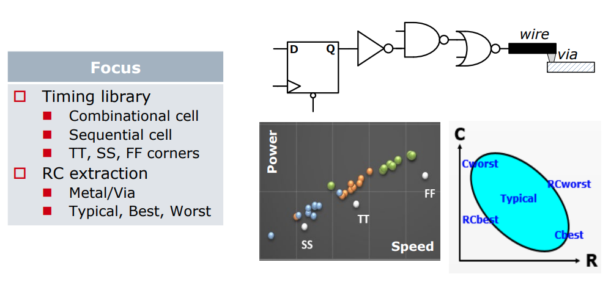

#### Process Corners

#### Global/Local Variation

#### Timing and RC Modeling with Process Corners

#### Global and Local variation by Gaussian

> Local Monte-Carlo (**SSG, FFG with Local Gaussian**) as Signoff golden

#### Process Corner Model Limitations

Variation section

- Total corner (TT/SS/FF/SF/FS)
  - E.g. TTMacro_MOS_MOS_MOSCAP
- Global Corner (TTG/SSG/FFG/SFG/FSG) + Local MC
  - E.g. TTGlobalCorner_LocalMC_MOS_MOSCAP
- Local MC
  - E.g. LocalMCOnly_MOS_MOSCAP
- Global MC + Local MC (Total MC)
  - GlobalMC_LocalMC_MOS_MOSCAP

> **SSGNP, FFGNP**:
>
> When N/P global correlation is weak (R^2=0.15), the corner of N/PMOS balance circuit (e.g. inverter) can be tightened (**3sigma -> 2.5sgma**) due to the **cancellation** between NMOS and PMOS
>
> SSGNP, FFGNP usually used in Digital STA

> - **Global variation** validation with **global corner**
>   - **3-sigma of global MC** simulation is aligned with **global corner**
> - **Total variation** validation with **total corner**
>   - **3-sigma of global MC + local MC (total)** simulation is aligned with **total corner**

#### Global Corner

> [https://community.cadence.com/cadence_technology_forums/f/custom-ic-design/20466/monte-carlo-simulation-global-local-vs-local-and-process-vs-mismatch/1365101#1365101](https://community.cadence.com/cadence_technology_forums/f/custom-ic-design/20466/monte-carlo-simulation-global-local-vs-local-and-process-vs-mismatch/1365101#1365101)
>
> The **"total corner"** is representative of the maximum device parameter variation including local device variation effects. However, it is not a statistical corner. 
>
> The **"global" corner** is defined as the **"total" corner minus the impact of "local variation"** 
>
> Hence, if you were to examine simulation results for a parameter using a "total" and "global" corner, you would find the range of variation will be less with the "global" corner than with the "total" corner.
>
> The "global" corner is provided for use in **statistical simulations**. Hence, when performing a Monte-Carlo simulation, the "global" corner is selected - NOT the "total" corner.

$$
\Delta V_{T,\sigma_{total}} = \sqrt{\Delta^2 _{T, \sigma_{global}}+\Delta^2 _{T, \sigma_{local}}}
$$

#### reference

Eric J.-W. Fang, T5: Fundamentals of Process Monitors for Signoff-Oriented Circuit Design, 2022 IEEE International Solid-State Circuits Conference

Alvin Loke, Device and Physical Design Considerations for Circuits in FinFET Technology, ISSCC 2020 Short Course

簡報 Cln16ffcll Sr V1d0 2p1 Usage Guide URL: [https://usermanual.wiki/Document/cln16ffcllsrv1d02p1usageguide.1649731847/view](https://usermanual.wiki/Document/cln16ffcllsrv1d02p1usageguide.1649731847/view)

Radojcic, Riko, Dan Perry and Mark Nakamoto. “Design for manufacturability for fabless manufactuers.” *IEEE Solid-State Circuits Magazine* 1 (2009): n. pag.

How To Reduce Implementation Headaches In FinFET Processes URL: [https://semiengineering.com/how-to-reduce-implementation-headaches-in-finfet-processes/](https://semiengineering.com/how-to-reduce-implementation-headaches-in-finfet-processes/)

陌上风骑驴看IC, STA | SSGNP, FFGNP. [https://mp.weixin.qq.com/s/eJ8fYRJBR1E9XbfH95OUOg](https://mp.weixin.qq.com/s/eJ8fYRJBR1E9XbfH95OUOg)

陌上风骑驴看IC, STA | ssg 跟ss corner 的区别——谬误更正版 [https://mp.weixin.qq.com/s?__biz=MzUzODczODg2NQ==&mid=2247486225&idx=1&sn=e9c68f6108ae6c9958d47ca0b29373ca&chksm=fad262cfcda5ebd949cc91353c7cbfaf4ba61179306f7d8e98461a4f4ca9d8a9baef5e9f2cc1&scene=178&cur_album_id=1326356275000705025#rd](https://mp.weixin.qq.com/s?__biz=MzUzODczODg2NQ==&mid=2247486225&idx=1&sn=e9c68f6108ae6c9958d47ca0b29373ca&chksm=fad262cfcda5ebd949cc91353c7cbfaf4ba61179306f7d8e98461a4f4ca9d8a9baef5e9f2cc1&scene=178&cur_album_id=1326356275000705025#rd)

The Evolution, Pitfalls, and Cargo Cult Engineering of Advanced Digital Timing Sign-off [https://www.tauworkshop.com/2021/speaker_slides/christian_l.pdf](https://www.tauworkshop.com/2021/speaker_slides/christian_l.pdf)

Don O'Riordan Cadence Design Systems. Recommended Spectre Monte Carlo modeling methodology [[https://designers-guide.org/modeling/montecarlo.pdf](https://designers-guide.org/modeling/montecarlo.pdf)]

