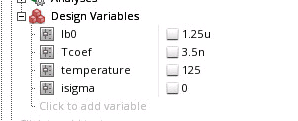

`Specifying Parameter Distributions Using Statistics Blocks`

- `process`:  generate random number once per MC run
- `mismatch` :  generate a random number per instance

## reference

Article (20498356) Title: How to vary design variables with statistical distribution to be used with Monte Carlo analysis
URL: [https://support.cadence.com/apex/ArticleAttachmentPortal?id=a1O3w000009ErHHEA0](https://support.cadence.com/apex/ArticleAttachmentPortal?id=a1O3w000009ErHHEA0)

Spectre Circuit Simulator Reference
