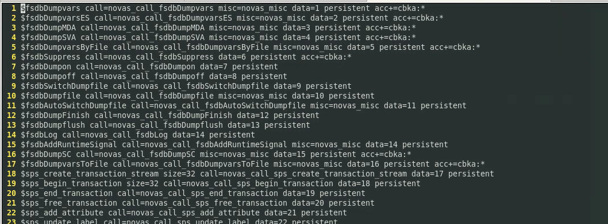

## VCS with customized UVM version

```bash
# uvm 1.1 customized
$ export VCS_UVM_HOME="path/to/uvm-1.1d/src"
$ vcs -full64 -debug_access+all -kdb -sverilog -ntb_opts uvm -timescale=1ns/1ps -f filelist.f
$ ./simv -gui=verdi
```


## VCS with release UVM

```
$ vcs -full64 -debug_access+all -kdb -sverilog -ntb_opts uvm-1.2
```


## VCS compile-time options

**-kdb**: Enables generating Verdi KDB database

**-lca**: Enables Limited Customer Availability feature, which is not fully test

**+vpi**: Enables the use of VPI PLI access routines. 

​	*Verilog PLI (Programming Language Interface) is a mechanism to invoke C or C++ functions from Verilog code.*

**-P <pli.tab>**: Specifies a PLI table file

​	`${VERDI_HOME}/share/PLI/VCS/LINUX64/novas.tb`



**+define+<macro_name>=<value>**: Define a text macro, Test for this definition in your Verilog source code using the ``ifdef`  compiler directive

`+define+SIMULATION` when compiling	

``ifdef SIMULATOIN` in code

**-debug_access**: Enables dumping to FSDB/VPD, and limited read/callback capability. Use `-debug_access+classs` for testbench debug, and `debug_access+all` for all debug capabilities. Refer the VCS user guide for more granular options for debug control under the switch `debug_access` and refer to `debug_region` for region control

**-y <directory_pathname>**: Specifies a Verilog library directory to search for module definitons

**-v \<filename\>**: Specifies a Verilog library file to search for module definitons

**+nospecify**: Suppresses module path delays and time checks in specify blocks

**-l \<filename\>**: (lower case L) Specifies a log file where VCS records compilation message and runtime messages if you include the -R, -RI, or -RIG option

**+vcs+fsdbon**:  A **compile-time** substitute for `$fsdbDumpvars` system task. The *+vcs+fsdbon*  switch enables dumping for the **entire design**. If you do not add a corresponding *-debug_access\** switch, then *-debug_access* is automatically  added.  Note that you must also set **VERDI_HOME**.

> $ ./simv
>
> FSDB Dumper for VCS, Release Verdi_S-2021.09-SP2-2, Linux x86_64/64bit, 05/22/2022
> (C) 1996 - 2022 by Synopsys, Inc.
> \*Verdi\* : Create FSDB file 'novas.fsdb'
> \*Verdi\* : Begin traversing the scopes, layer (0).
> \*Verdi\* : End of traversing.

**+vcs+vcdpluson**: A **compile-time** substitute for `$vcdpluson` system task. The *+vcs+vcdpluson* switch enables dumping for the **entire design**. If you do not add a corresponding *-debug_access\** switch, then *-debug_access* is automatically added

> $ ./simv
>
> VCD+ Writer S-2021.09-SP2-2_Full64 Copyright (c) 1991-2021 by Synopsys Inc.

**+incdir+\<directory\>**: Specifies the directories that contain the files you specified with the ``include` compiler directive. You can specify more than on directory, separating each path name with the `+` character.


### Compile time Use Model

Just add the `-kdb` option to VCS executables when running simulation

- Three steps flow:

  - `vlogan/vhdlan/syscan -kdb`

    Compile design and generate un-resolved KDB to *./work*

  - `vcs -kdb -debug_access+all <other option>`

    Generate elaborated KDB to *./sim.dadir*

- Two steps flow:

  - `vcs -kdb -debug_access+all <other option>`

    Compile design and generate elaborated KDB to *./simv.dadir*


## Common `simv` Option

`-gv <gen=value>`:  override runtime VHDL generics *

`-ucli`: stop at Tcl prompt upon start-up

`-i <run.tcl>`: execute specified Tcl script upon start-up

`-l <logfile>`: create runtime logfile

`-gui`: create runtime logfile

`-xlrm`: allow relaxed/non-LRM compliant code

`-cm <options>`: enable coverate options


## verdi binkey

`SHIFT+A`: *Find Signal/Find Instance/Find Instport*

`SHIFT+S`: *Find Scope*

### module traverse


> *Show Calling*
>
> *Show Definition*
>
> Double-Click **instance name**  is same with click *Show Definition*
>
> Double-Click **module name** is same with click *Show Calling*

### signal traverse


> *Driver*
>
> *Load*
>
> Double-Click **signal name** is same with click *Driver*

## Verdi options

`-ssf fastFile(s)|dumpFile(s)|fastFile list(s)`: Load FSDB (\*.fsdb), virtual FSDB (\*.vf) , gzipped FSDB (\*.fsdb.gz), bzip2 FSDB (\*.fsdb.bz2), waveform dump (\*.vcd, \*.vcd.gz) files, or FSDB file list (\*.flst)

`-simBin <simv_executable>`: Specify the path of the simulation binary file.


`-dbdir`: Specify the daidir (simv.daidir ) directory to load

> In the VCS two-step flow, the VCS generated KDB (kdb.elab++) is saved under the simv.daidir/ directory (like `simv.daidir`/kdb.elab++).

`-f file_name / -file file_name`: Load an ASCII file containing design source files and additional simulator options

## Import Design from UFE

> **Knowledge Database (KDB)**: As it compiles the design, the Verdi platform uses its internal synthesis technology to recognize and extract specific structural, logical, and functional information about the design and stores the resulting detailed design information in the KDB

The Unified Compiler Flow (UFE) uses VCS with the `-kdb` option and the generated `simv.daidar` includes the **KDB** information

1. `verdi -dbdir simv.daidir`

   Use the new -dbdir option to specify the simv.daidir directory

2. `verdi -simBin simv`

   Load `simv.daidir` from *the **same directory** as `simv`* and invoke Verdi if `simv.daidir` is available

3. `verdi -ssf novas.fsdb`

   Load KDB automatically from FSDB,

> For 2 and 3, use the `-dbdir` option to load *simv.dadir* if you have move it to somewhere else


## Reference Design and FSDB on the Command Line

```
verdi -f <source_file_name> -ssf <fsdb_file_name>
```

> Where, source_file_name is the source file name and fsdb_file_name is the name of the FSDB file

## reference

Verdi使用总结 URL: [https://www.wenhui.space/docs/07-ic-verify/tools/verdi_userguide/](https://www.wenhui.space/docs/07-ic-verify/tools/verdi_userguide/)

[Using Verdi for Design Understanding - Driver/Load Tracing in Verdi | Synopsys](https://www.youtube.com/watch?v=cFHKjDzoPyY&ab_channel=Synopsys)

[Using Verdi for Design Understanding - Connectivity Tracing and FSM Extraction in Verdi | Synopsys](https://www.youtube.com/watch?v=yjs7R5UWOEw&ab_channel=Synopsys)

