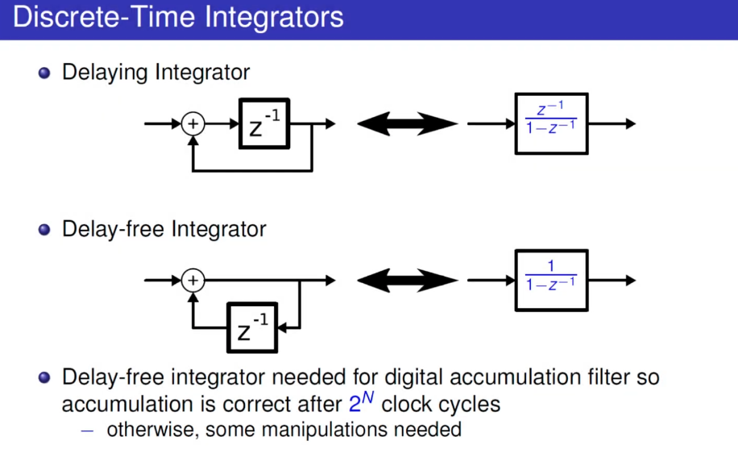
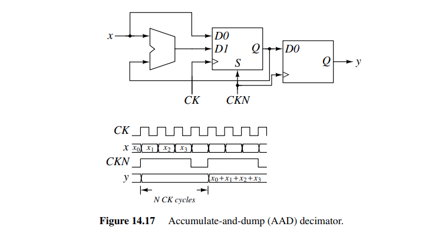

## Discrete-Time Integrators

> Qasim Chaudhari. Discrete-Time Integrators [[https://wirelesspi.com/discrete-time-integrators/](https://wirelesspi.com/discrete-time-integrators/)]
>
> David Johns (University of Toronto) "Oversampled Data Converters" Course (2019) [[https://youtu.be/qIJ2LORYmyA?si=_pGb18rhsMUZ-lAf](https://youtu.be/qIJ2LORYmyA?si=_pGb18rhsMUZ-lAf)]

Delaying Integrator

Delay-free Integrator

## Discrete-Time Differentiator

> Qasim Chaudhari. Design of a Discrete-Time Differentiator [[https://wirelesspi.com/design-of-a-discrete-time-differentiator/](https://wirelesspi.com/design-of-a-discrete-time-differentiator/)]

*TODO* &#128197;

## Accumulate-and-dump (AAD) decimator

accumulating the input for $N$ cycles and then latching the result and resetting the integrator

> It adds up $N$ succeeding input samples at rate $1/T$ and delivers their sum in a *single* sample at the output. Therefore, the process comprises a **filter (in the accumulation)** and a **down-sampler (in the dump)**

## Moving Average and CIC Filters

> An Intuitive Look at Moving Average and CIC Filters [[web](https://tomverbeure.github.io/2020/09/30/Moving-Average-and-CIC-Filters.html), [code](https://github.com/tomverbeure/pdm/tree/master/modeling/cic_filters)]
>
> A Beginner's Guide To Cascaded Integrator-Comb (CIC) Filters [[https://www.dsprelated.com/showarticle/1337.php](https://www.dsprelated.com/showarticle/1337.php)]

**cascade-integrator-comb (CIC)** decimator

*TODO* &#128197;

## reference

Jabbour, Chadi, etc.. "Digitally enhanced mixed signal systems." *IEEE International Symposium on Circuits and Systems (ISCAS)*. 2019.

Sen M. Kuo. Real-Time Digital Signal Processing: Fundamentals, Implementations and Applications, 3rd Edition. John Wiley & Sons 2013

Taylor, Fred. *Digital filters: principles and applications with MATLAB*. John Wiley & Sons, 2011

Kuo, Sen-Maw. (2013) Real-Time Digital Signal Processing: Implementations and Applications 3rd [[pdf](https://students.aiu.edu/submissions/profiles/resources/onlineBook/H7Y7t7_Real-Time_Digital_Signal_Processing_Applications-_3rd.pdf)]

D. Markovic and R. W. Brodersen, DSP Architecture Design Essentials, Springer, 2012.

---

Bevan Baas, EEC281 VLSI Digital Signal Processing,  [[https://www.ece.ucdavis.edu/~bbaas/281/](https://www.ece.ucdavis.edu/~bbaas/281/)]

Mark Horowitz. EE371: Advanced VLSI Circuit Design Spring 2006-2007 [[https://web.stanford.edu/class/archive/ee/ee371/ee371.1066/](https://web.stanford.edu/class/archive/ee/ee371/ee371.1066/)]

謝秉璇. 2019 積體電路設計導論 [[link](https://nthuee.org/archive//%E7%A9%8D%E9%AB%94%E9%9B%BB%E8%B7%AF%E8%A8%AD%E8%A8%88%E5%B0%8E%E8%AB%96/2019%E8%AC%9D%E7%A7%89%E7%92%87/)]

Tinoosh Mohsenin. CMPE 691: Digital Signal Processing Hardware Implementation [[https://userpages.cs.umbc.edu/tinoosh/cmpe691/](https://userpages.cs.umbc.edu/tinoosh/cmpe691/)]

Keshab K. Parhi [[http://www.ece.umn.edu/users/parhi/](http://www.ece.umn.edu/users/parhi/)]

---

Qasim Chaudhari. FIR vs IIR Filters – A Practical Comparison [[https://wirelesspi.com/fir-vs-iir-filters-a-practical-comparison/](https://wirelesspi.com/fir-vs-iir-filters-a-practical-comparison/)]

—. Finite Impulse Response (FIR) Filters [[https://wirelesspi.com/finite-impulse-response-fir-filters/](https://wirelesspi.com/finite-impulse-response-fir-filters/)]

—. Why FIR Filters have Linear Phase [[https://wirelesspi.com/why-fir-filters-have-linear-phase/](https://wirelesspi.com/why-fir-filters-have-linear-phase/)]

—. Moving Average Filter [[https://wirelesspi.com/moving-average-filter/](https://wirelesspi.com/moving-average-filter/)]

—. Cascaded Integrator Comb (CIC) Filters – A Staircase of DSP. [[https://wirelesspi.com/cascaded-integrator-comb-cic-filters-a-staircase-of-dsp/](https://wirelesspi.com/cascaded-integrator-comb-cic-filters-a-staircase-of-dsp/)]
