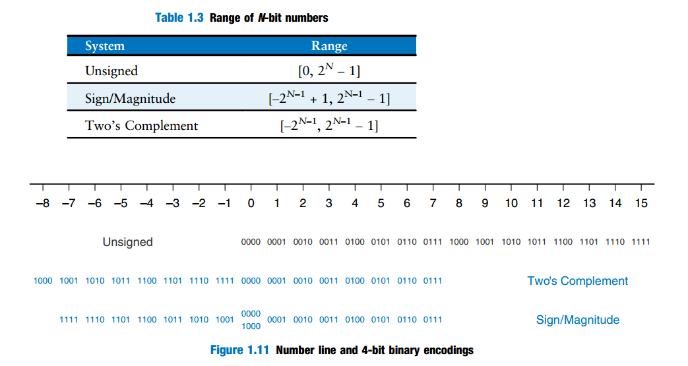
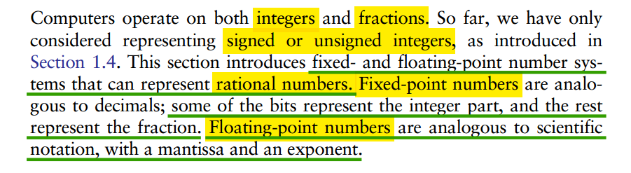
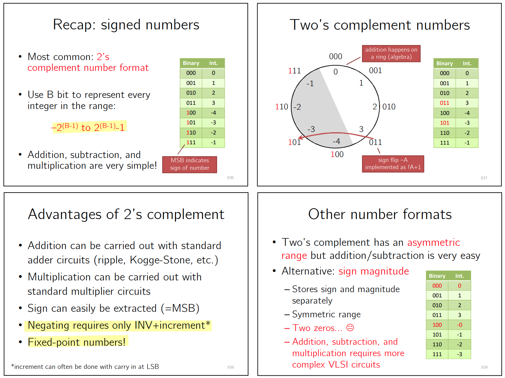
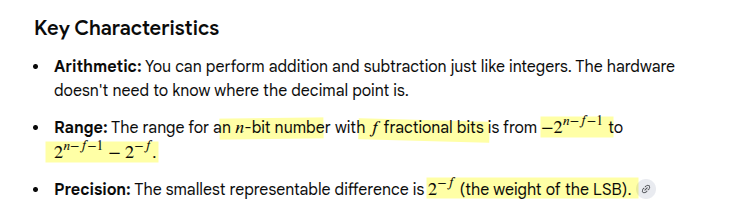
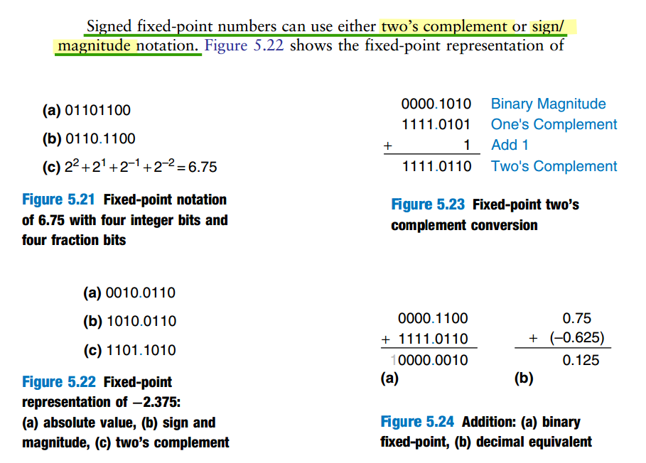
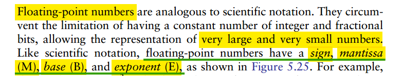
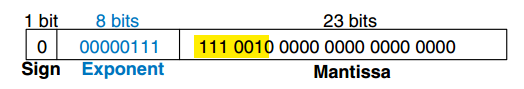

## Number Systems

> Harris, David Money, and Sarah L. Harris. *Digital Design and Computer Architecture*. 2nd ed. Morgan Kaufmann, 2013. [[pdf](https://github.com/last-genius/comp_arch_list/blob/master/books/Digital%20Design%20and%20Computer%20Architecture.%20ARM%20Edition%20by%20Sarah%20Harris%2C%20David%20Harris.pdf)]

***integers***

***rational number***

### 2's Complement

> [[https://bpb-us-w2.wpmucdn.com/sites.coecis.cornell.edu/dist/4/81/files/2019/06/4740_lecture23ALU-circuits.pdf](https://bpb-us-w2.wpmucdn.com/sites.coecis.cornell.edu/dist/4/81/files/2019/06/4740_lecture23ALU-circuits.pdf)]

> Google AI Mode [[https://share.google/aimode/KsxxgDF0vAdhAIgm0](https://share.google/aimode/KsxxgDF0vAdhAIgm0)]

### Fixed Point Number

### Floating Point Number

> Dennis Forbes. Understanding Floating-Point Numbers [[https://dennisforbes.ca/blog/features/floating_point/understanding-floating-point-numbers/](https://dennisforbes.ca/blog/features/floating_point/understanding-floating-point-numbers/)]
>
> IEEE Standard for Floating-Point Arithmetic [[https://www-users.cse.umn.edu/~vinals/tspot_files/phys4041/2020/IEEE%20Standard%20754-2019.pdf](https://www-users.cse.umn.edu/~vinals/tspot_files/phys4041/2020/IEEE%20Standard%20754-2019.pdf)]

|                                      |                                |                                                              |
| ------------------------------------ | ------------------------------ | ------------------------------------------------------------ |
| **32-bit floating-point version 1**  | store *implicit leading one*   |  |
| **32-bit floating-point version 2**  | discard *implicit leading one* |  |
| **IEEE 754 floating point notation** | *biased exponent*              |  |

> [[https://share.google/aimode/yY2R2EQCTsP9BlMNx](https://share.google/aimode/yY2R2EQCTsP9BlMNx)]

| Format                        | Exponent Bits | Bias (Decimal) | Representable Range |
| ----------------------------- | ------------- | -------------- | ------------------- |
| **Single Precision (32-bit)** | 8             | **127**        | -126 to +127        |
| **Double Precision (64-bit)** | 11            | **1023**       | -1022 to +1023      |

## VLSI Arithmetic

*TODO* &#128197;

## Finite Wordlength Effects

> Tianshuang Qiu; Ying Guo, "7. Finite-Precision Numerical Effects in Digital Signal Processing," in *Signal Processing and Data Analysis* , De Gruyter, 2018, pp.236-248
>
> Antoniou, Andreas. “Digital Signal Processing: Signals, Systems, and Filters.” (2005). [[pdf](https://fmipa.umri.ac.id/wp-content/uploads/2016/03/Andreas-Intoniou-Digital-signal-processing.9780071454247.31527.pdf)]

*TODO* &#128197;

## reference

Jabbour, Chadi, etc.. "Digitally enhanced mixed signal systems." *IEEE International Symposium on Circuits and Systems (ISCAS)*. 2019.

Sen M. Kuo. Real-Time Digital Signal Processing: Fundamentals, Implementations and Applications, 3rd Edition. John Wiley & Sons 2013

Taylor, Fred. *Digital filters: principles and applications with MATLAB*. John Wiley & Sons, 2011

Kuo, Sen-Maw. (2013) Real-Time Digital Signal Processing: Implementations and Applications 3rd [[pdf](http://dl.icdst.org/pdfs/files/e51100ce301ad56951e4511a9a1c66aa.pdf)]

D. Markovic and R. W. Brodersen, DSP Architecture Design Essentials, Springer, 2012.

---

Bevan Baas, EEC281 VLSI Digital Signal Processing,  [[https://www.ece.ucdavis.edu/~bbaas/281/](https://www.ece.ucdavis.edu/~bbaas/281/)]

Mark Horowitz. EE371: Advanced VLSI Circuit Design Spring 2006-2007 [[https://web.stanford.edu/class/archive/ee/ee371/ee371.1066/](https://web.stanford.edu/class/archive/ee/ee371/ee371.1066/)]

Tinoosh Mohsenin. CMPE 691: Digital Signal Processing Hardware Implementation [[https://userpages.cs.umbc.edu/tinoosh/cmpe691/](https://userpages.cs.umbc.edu/tinoosh/cmpe691/)]

Keshab K. Parhi [[http://www.ece.umn.edu/users/parhi/](http://www.ece.umn.edu/users/parhi/)]

謝秉璇. 2019 積體電路設計導論 [[link](https://nthuee.org/archive//%E7%A9%8D%E9%AB%94%E9%9B%BB%E8%B7%AF%E8%A8%AD%E8%A8%88%E5%B0%8E%E8%AB%96/2019%E8%AC%9D%E7%A7%89%E7%92%87/)]

---

Jason Sachs. Understanding and Preventing Overflow (I Had Too Much to Add Last Night) [[https://www.embeddedrelated.com/showarticle/532.php](https://www.embeddedrelated.com/showarticle/532.php)]

—. Round Round Get Around: Why Fixed-Point Right-Shifts Are Just Fine [[https://www.embeddedrelated.com/showarticle/1015.php](https://www.embeddedrelated.com/showarticle/1015.php)]

—. How to Build a Fixed-Point PI Controller That Just Works: Part I [[https://www.embeddedrelated.com/showarticle/121.php](https://www.embeddedrelated.com/showarticle/121.php)]

—. How to Build a Fixed-Point PI Controller That Just Works: Part II [[https://www.embeddedrelated.com/showarticle/123.php](https://www.embeddedrelated.com/showarticle/123.php)]

---

AHMED SHAHEIN, Fixed-Point Simulation in GNU Octave—Without MATLAB [[https://www.dsprelated.com/showarticle/1786.php](https://www.dsprelated.com/showarticle/1786.php)]

A. Antoniou, "On the roots of digital signal processing. Part I," in *IEEE Circuits and Systems Magazine*, vol. 7, no. 1, pp. 8-18, First Quarter 2007

—, "Feature - On the roots of digital signal processing - Part II," in *IEEE Circuits and Systems Magazine*, vol. 7, no. 4, pp. 8-19, Fourth Quarter 2007
