## SST Driver

### sharing termination in SST transmitter

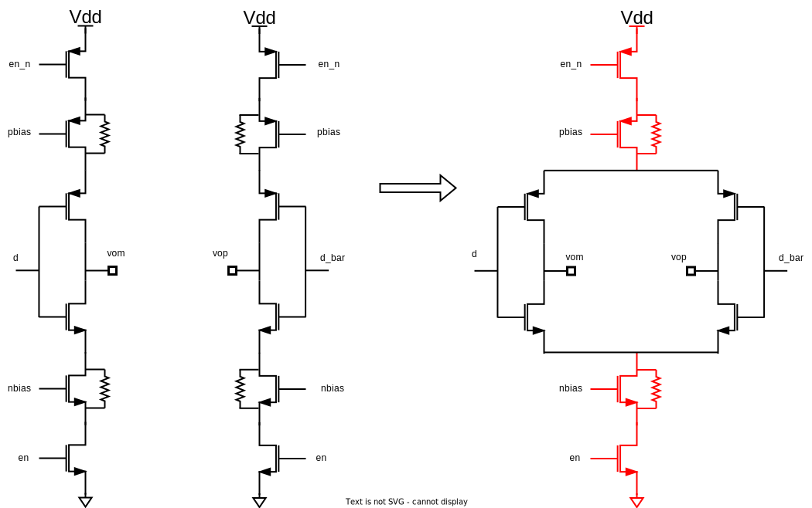

Sharing termination keep a constant current through leg, which improve TX speed in this way.
On the other hand, the sharing termination facilitate drain/source sharing technique in layout.

### pull-up and pull-down resistor

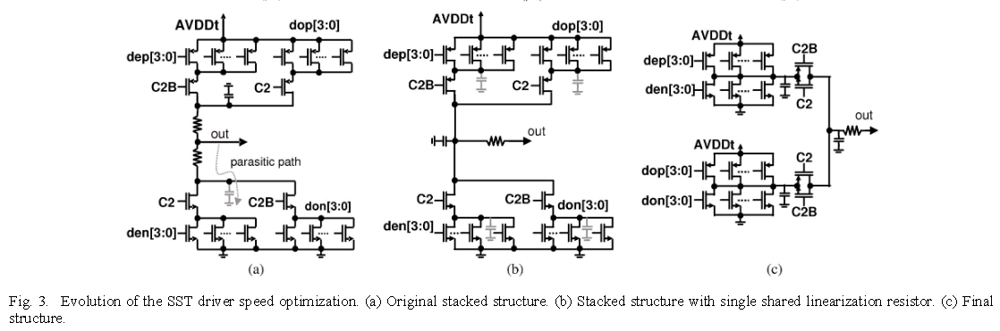

**Original stacked structure**

Pro's:

​	smaller static current when both pull up and pull down path is on

Con's:

​	slowly switching due to parasitic capacitance behind pull-up and pull-down resistor


**with single shared linearization resistor**

Pro's:

​	The parasitic capacitance behind the resistor still exists but is now always driven high or low actively

Con's:

​	more static current


## VM Driver Equalization - differential ended termination

$$
V_o = D_{n+1}C_{-1}+D_nC_0+D_{n-1}C_{+1}
$$

where $D_n \in \{-1, 1\}$

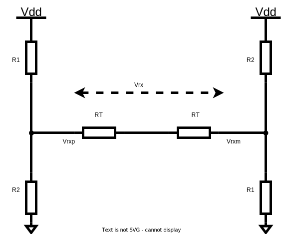
$$
V_{\text{rx}} = V_{\text{dd}} \frac{(R_2-R_1)R_T}{R_1R_T+R_2R_T+R_1R_2}
$$
With $R_u=(L+M+N)R_T$

Normalize above equation, obtain
$$
V_{\text{rx,norm}} = \frac{(R_2-R_1)R_T}{R_1R_T+R_2R_T+R_1R_2}
$$


|          | $D_{n-1}$ | $D_{n}$ | $D_{n+1}$ |
| -------- | --------- | ------- | --------- |
| $C_{-1}$ | 1         | -1      | -1        |
| $C_0$    | -1        | 1       | -1        |
| $C_{+1}$ | -1        | -1      | 1         |

Where precursor  $R_L = L\times R_T$, main cursor $R_M = M\times R_T$ and post cursor $R_N = N\times R_T$

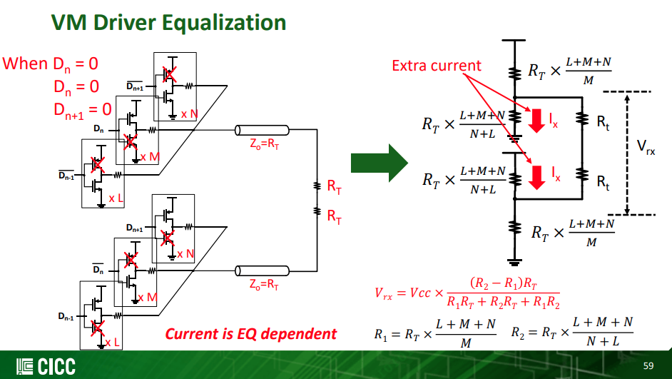

###  Equation-1

> $D_{n-1}D_nD_{n+1}=1,-1,-1$

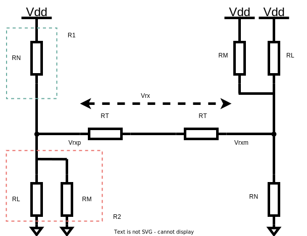

$$\begin{align}
R_1 &= R_N \\
&= \frac{R_u}{N} \\
R_2 &= R_L\parallel R_M \\
&= \frac{R_u}{L+M}
\end{align}$$

We obtain
$$
V_{L}= \frac{1}{2}\cdot\frac{N-(L+M)}{L+M+N}
$$

### Equation-2

> $D_{n-1}D_nD_{n+1}=-1,1,-1$

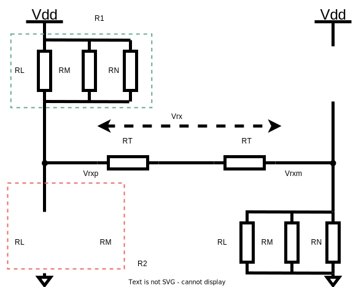

with $R_1=R_T$ and $R_2=+\infty$, we obtain
$$
V_M = \frac{1}{2}
$$

### Equation-3

> $D_{n-1}D_nD_{n+1}=-1,-1,1$

$$\begin{align}
R_1 &= R_L \\
&= \frac{R_u}{L} \\
R_2 &= R_N\parallel R_M \\
&= \frac{R_u}{N+M}
\end{align}$$

We obtain
$$
V_N = \frac{1}{2}\cdot\frac{L-(N+M)}{L+M+N}
$$

### Obtain FIR coefficients

We define
$$\begin{align}
l &= \frac{L}{L+M+N} \\
m &= \frac{M}{L+M+N} \\
n &= \frac{N}{L+M+N}
\end{align}$$

where $l+m+n=1$

Due to Eq1 ~ Eq3
$$
\left\{ \begin{array}{cl}
C_{-1}-C_0-C_1 & = \frac{1}{2}(n-l-m) \\
-C_{-1}+C_0-C_1 & = \frac{1}{2} \\
-C_{-1}-C_0+C_1 & = \frac{1}{2}(l-n-m)
\end{array} \right.
$$
After scaling, we get
$$
\left\{ \begin{array}{cl}
C_{-1}-C_0-C_1 & = -l-m+n \\
-C_{-1}+C_0-C_1 & = l+m+n \\
-C_{-1}-C_0+C_1 & = l-m-n
\end{array} \right.
$$
Then, **the relationship between FIR coefficients and legs is clear**, i.e.
$$\begin{align}
C_{-1} &= -\frac{L}{L+M+N} \\
C_{0} &= \frac{M}{L+M+N} \\
C_{1} &= -\frac{N}{L+M+N}
\end{align}$$

For example, $C_{-1}=-0.1$, $C_0=0.7$ and $C_1=-0.2$
$$
H(z) = -0.1+0.7z^{-1}-0.2z^{-2}
$$
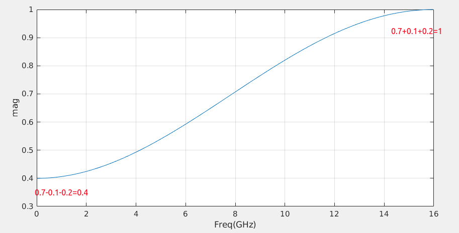

```matlab
w = [-0.1, 0.7, -0.2];
Fs = 32e9;
[mag, w] = freqz(w, 1, [], Fs);
plot(w/1e9, abs(mag));
xlabel('Freq(GHz)');
ylabel('mag');
grid on;
```

## VM Driver Equalization - single ended termination

### Equation-1

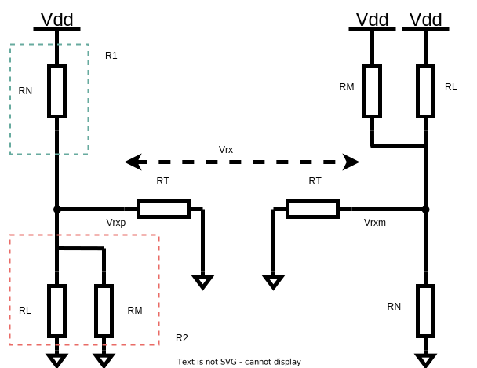

$$\begin{align}
V_{\text{rxp}} &= \frac{1}{2} \cdot \frac{N}{L+M+N} \\
V_{\text{rxm}} &= \frac{1}{2} \cdot \frac{L+M}{L+M+N}
\end{align}$$
So
$$
V_{L}= \frac{1}{2}\cdot\frac{N-(L+M)}{L+M+N}
$$
which is same with differential ended termination

### Equation-2

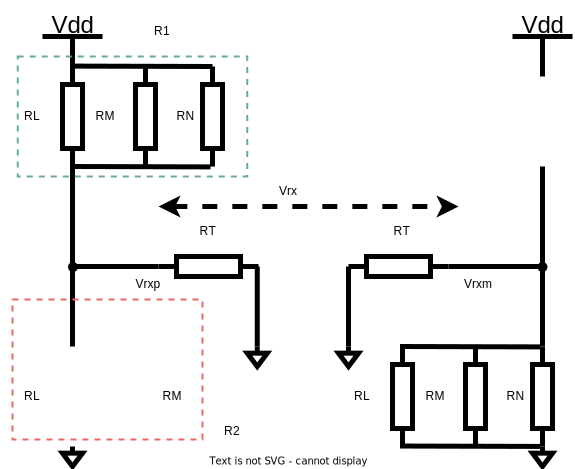

$$\begin{align}
V_{\text{rxp}} &= \frac{1}{2} \\
V_{\text{rxm}} &= 0
\end{align}$$
So
$$
V_{M}= \frac{1}{2}
$$
which is same with differential ended termination

### Equation-3

$$
V_{N}= \frac{1}{2}\cdot\frac{L-(N+M)}{L+M+N}
$$

### Obtain FIR coefficients

Same with differential ended termination driver.


## Basic Feed Forward Equalization Theory

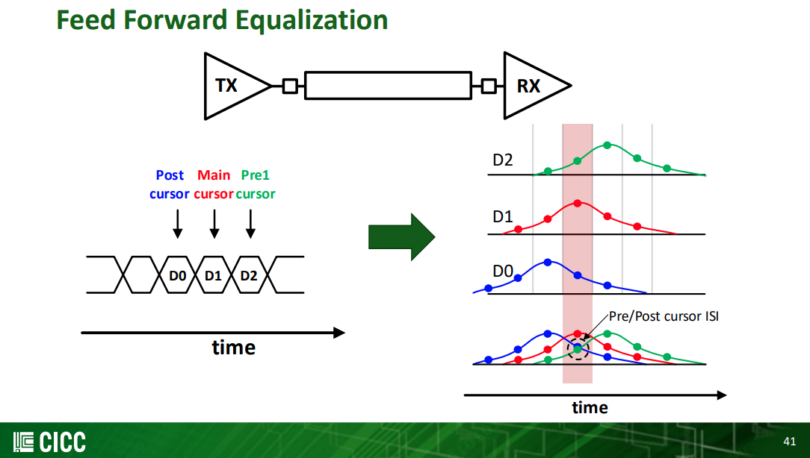

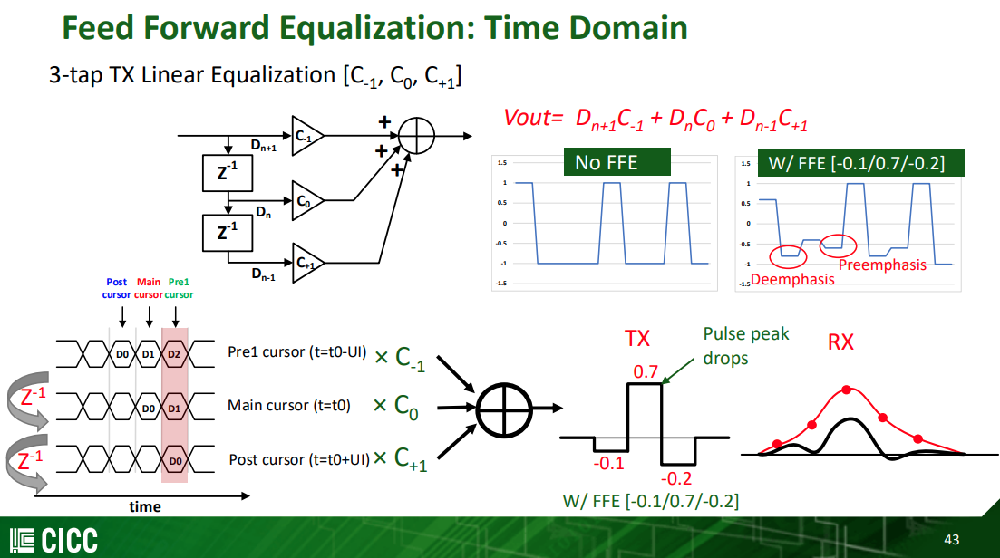

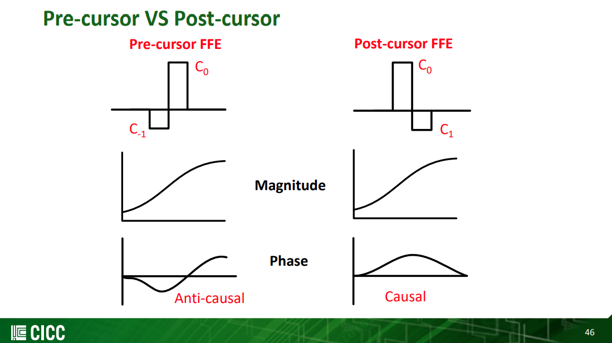

> Pre-cursor FFE can compensate phase distortion through the channel


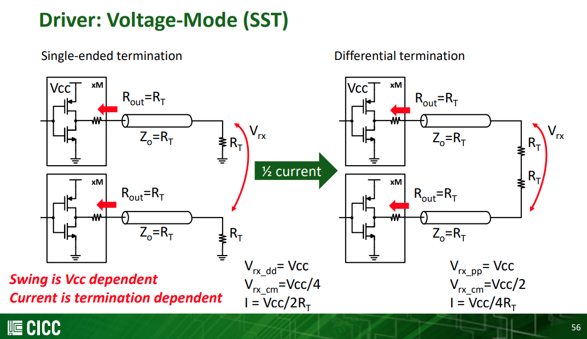

> Single-ended termination
>
> Differential termination


## reference

J. F. Bulzacchelli et al., "A 28-Gb/s 4-Tap FFE/15-Tap DFE Serial Link Transceiver in 32-nm SOI CMOS Technology," in IEEE Journal of Solid-State Circuits, vol. 47, no. 12, pp. 3232-3248, Dec. 2012, doi: 10.1109/JSSC.2012.2216414.

Jhwan Kim, CICC 2022, ES4-4: Transmitter Design for High-speed Serial Data Communications 
