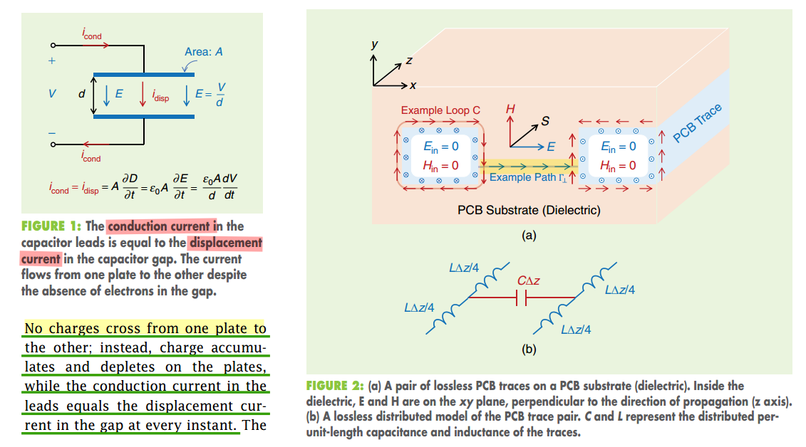
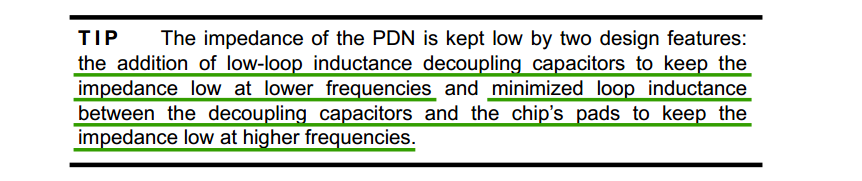
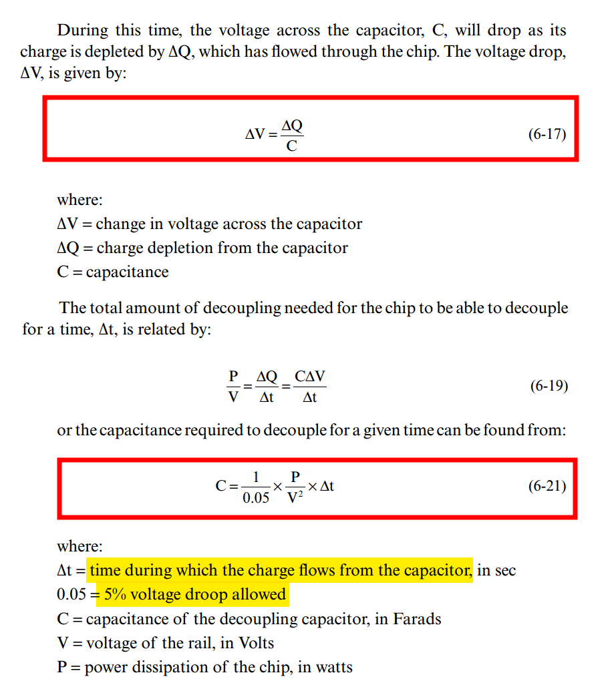
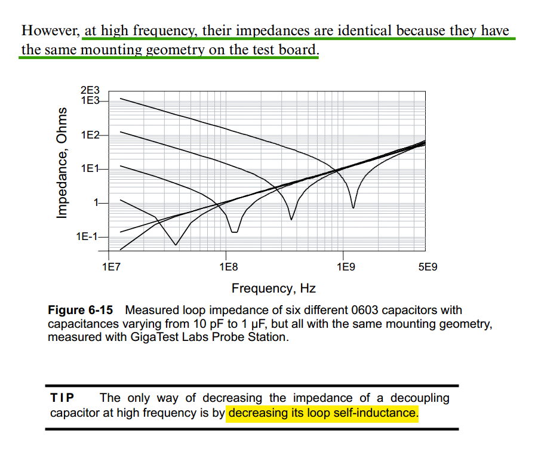

## Electromagnetic coupling

**Electric field coupling** (also called **capacitive coupling**) occurs when energy is coupled from one circuit to another through an **electric field**

**Magnetic field coupling** (also called **inductive coupling**) occurs when energy is coupled from one circuit to another through a **magnetic field**

---

For instance

- magnetic coupling between multiple inductors
- capacitive coupling between multiple transmission lines

##  displacement current

> A. Sheikholeslami, "Current Without Electrons [Circuit Intuitions]," in IEEE Solid-State Circuits Magazine, vol. 17, no. 4, pp. 8-10, Fall 2025

 ***displacement current*** & ***conduction current***

##   Current Return Path

Current return paths are frequency dependent $Z = R +j\omega L$

- Low frequency
  - $R$ dominates - current use as many returns as possible to have parallel resistances
- High frequency
  - $j\omega L$​ dominates - current use the *closest possible return path* to form *the smallest possible loop inductance*
- Very high frequency
  - The current would be confined to the *nearest* possible return only at ultra-high frequencies (skin effect)

---

**skin effect** & **Dielectric loss**

---

***EMX simulation***

**setup:**

**frequency sweep:**

> Cadence October 2020, *Analysis of a Figure-Eight Inductor with EMX RAK*
>
> 

## Tline Approximation

> [[https://web.stanford.edu/class/archive/ee/ee371/ee371.1066/handouts/markChapt.pdf](https://web.stanford.edu/class/archive/ee/ee371/ee371.1066/handouts/markChapt.pdf)]
>
> Eric Bogatin. Pop Quiz: When is an Interconnect Not a Transmission Line? [[https://www.signalintegrityjournal.com/blogs/4-eric-bogatin-signal-integrity-journal-technical-editor/post/265-pop-quiz-when-is-an-interconnect-not-a-transmission-line](https://www.signalintegrityjournal.com/blogs/4-eric-bogatin-signal-integrity-journal-technical-editor/post/265-pop-quiz-when-is-an-interconnect-not-a-transmission-line)]

## Decoupling Capacitor

## Grounding

> Chapter 11 Layout and grounding [[http://ieb-srv1.upc.es/gieb/tecniques/doc/EMC/pdfs/ScienceDirect_articles_27Jul2018_12-16-10.699/Chapter-11---Layout-and-grounding_2007_EMC-for-Product-Designers.pdf](http://ieb-srv1.upc.es/gieb/tecniques/doc/EMC/pdfs/ScienceDirect_articles_27Jul2018_12-16-10.699/Chapter-11---Layout-and-grounding_2007_EMC-for-Product-Designers.pdf)]

*TODO* 

## reference

信号完整性揭秘:于博士SI设计手记

Bogatin, E. (2018). *Signal and power integrity, simplified*. Prentice Hall. [[pdf](https://www.oldfriend.url.tw/article/SI_PI_book/Signal%20and%20Power%20Integrity%20-%20Simplified_2nd_Eric%20Bogatin_Prentice%20Hall%20PTR_2010.pdf)]

High-speed Serial Interface Lect. 9 – Noise [[http://tera.yonsei.ac.kr/class/2017_2_2/lecture/Lect%209%20Noise.pdf](http://tera.yonsei.ac.kr/class/2017_2_2/lecture/Lect%209%20Noise.pdf)]

---

Yuriy Shlepnev. How Interconnects Work: Characteristic Impedance and Reflections [[https://www.linkedin.com/pulse/how-interconnects-work-characteristic-impedance-yuriy-shlepnev/](https://www.linkedin.com/pulse/how-interconnects-work-characteristic-impedance-yuriy-shlepnev/)]

—. How Interconnects Work: Bandwidth for Modeling and Measurements [[https://www.linkedin.com/pulse/how-interconnects-work-bandwidth-modeling-yuriy-shlepnev/?trackingId=874kpm3XuNyV9D0eP6IioA%3D%3D](https://www.linkedin.com/pulse/how-interconnects-work-bandwidth-modeling-yuriy-shlepnev/?trackingId=874kpm3XuNyV9D0eP6IioA%3D%3D)]

Eric Bogatin. Pop Quiz: When is an Interconnect Not a Transmission Line?  [[https://www.signalintegrityjournal.com/blogs/4-eric-bogatin-signal-integrity-journal-technical-editor/post/265-pop-quiz-when-is-an-interconnect-not-a-transmission-line](https://www.signalintegrityjournal.com/blogs/4-eric-bogatin-signal-integrity-journal-technical-editor/post/265-pop-quiz-when-is-an-interconnect-not-a-transmission-line)]

TeledyneLeCroy/SignalIntegrity Python tools for signal integrity applications [[SignalIntegrityApp](https://github.com/TeledyneLeCroy/SignalIntegrity)]

A Look at Transmission-Line Losses [[http://blog.teledynelecroy.com/2018/06/a-look-at-transmission-line-losses.html](http://blog.teledynelecroy.com/2018/06/a-look-at-transmission-line-losses.html)]

How Much Transmission-Line Loss is Too Much? [[http://blog.teledynelecroy.com/2018/06/how-much-transmission-line-loss-is-too.html](http://blog.teledynelecroy.com/2018/06/how-much-transmission-line-loss-is-too.html)]

Raymond Y. Chen, Raymond Y. Chen. Fundamentals of S Fundamentals of S-Parameter Parameter Modeling for Power Distribution Modeling for Power Distribution System (PDS) and SSO Analysis System (PDS) and SSO Analysis [[https://ibis.org/summits/jun05/chen.pdf](https://ibis.org/summits/jun05/chen.pdf)]

