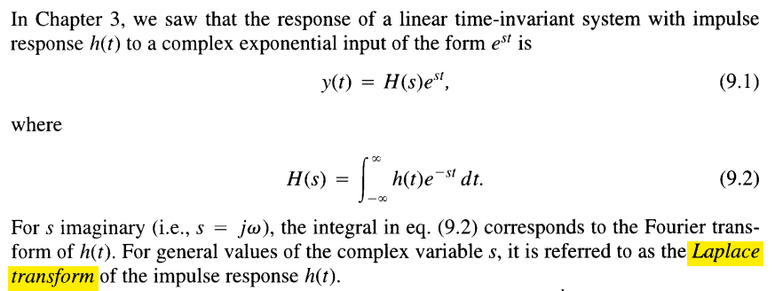
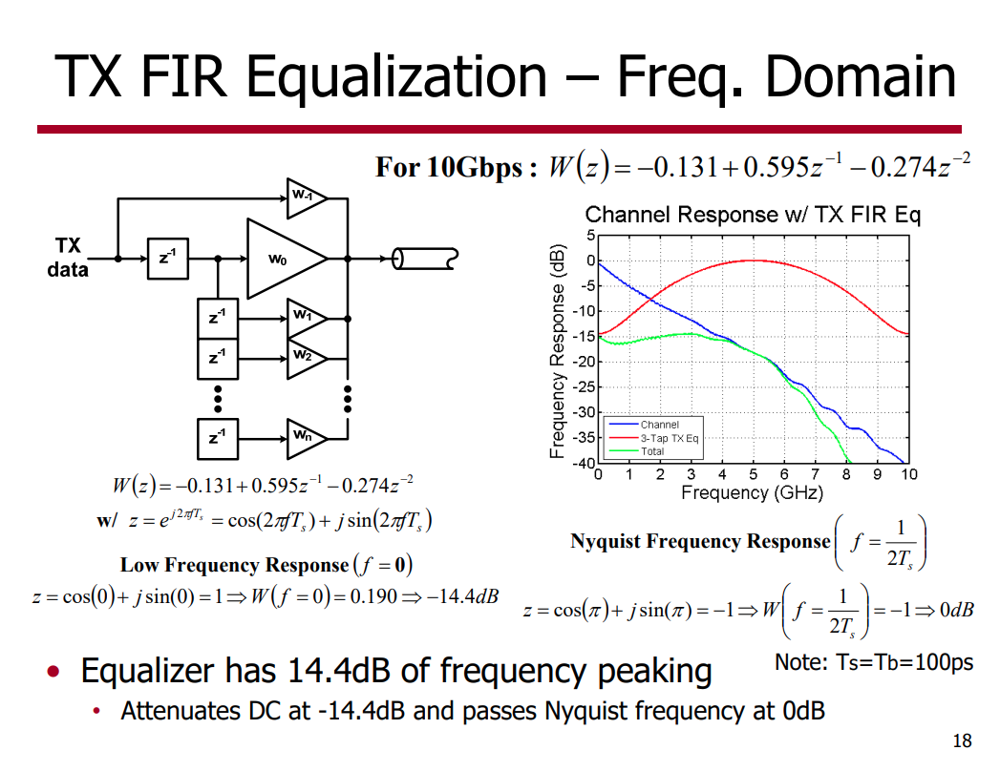
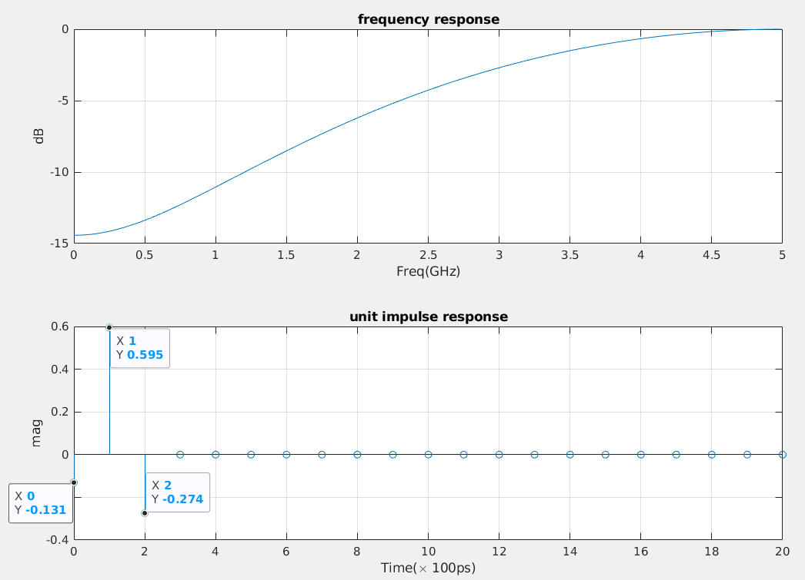
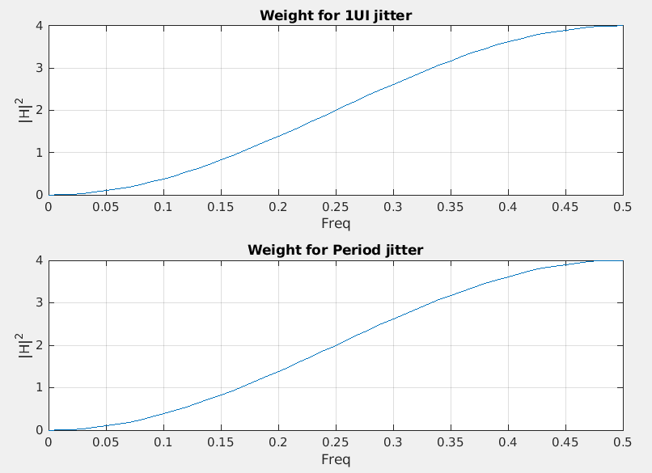
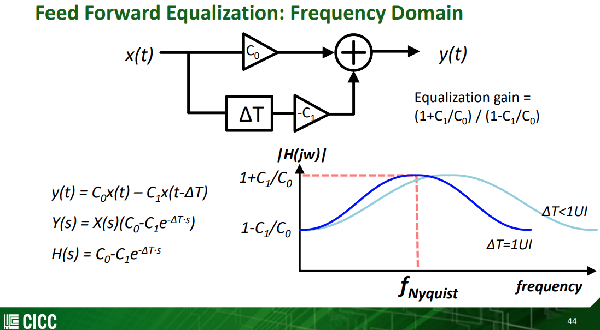
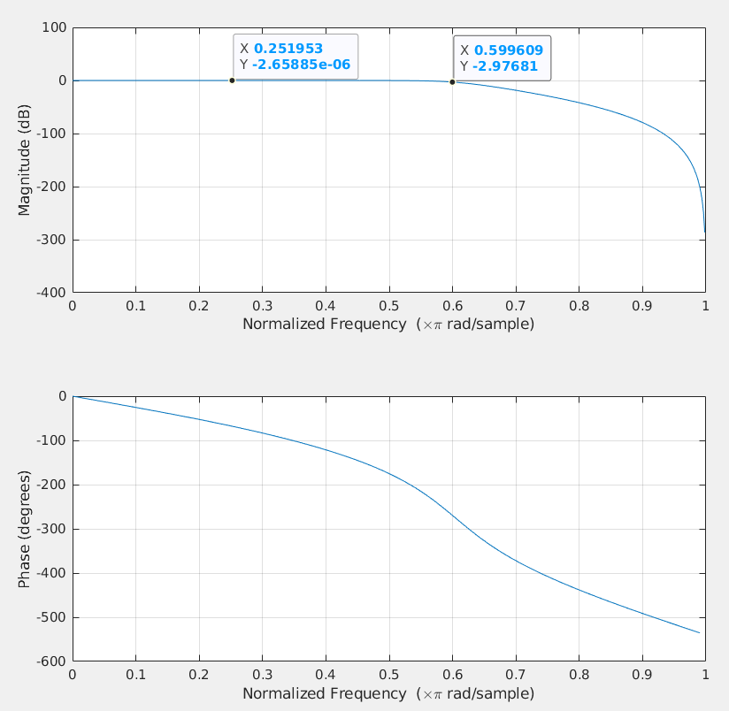
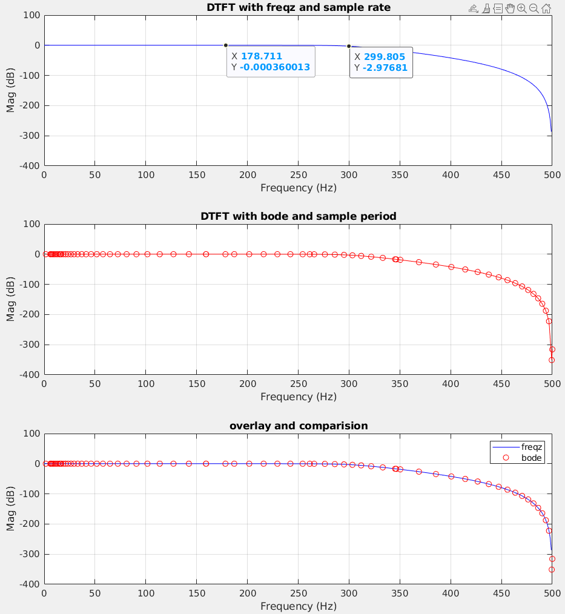
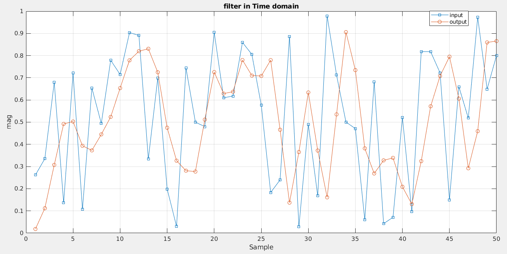
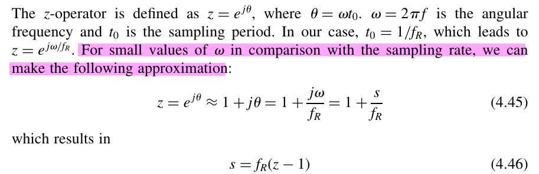
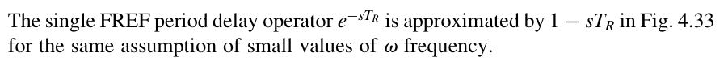

- Laplace transform
  - a generalization of the *continuous*-time Fourier transform
  - converts *integro-differential equations* into *algebraic equations*
- z-transforms
  - a generalization of the *discrete*-time Fourier transform
  - converts *difference equations* into *algebraic equations*





## Bilinear Transformation

*TODO* &#128197;


## FIR Equalization

### Frequency Response


$$
z = e^{j\omega T_s}
$$

### Unit impulse

filter coefficients are **[-0.131, 0.595, -0.274]** and sampling period is **100ps**



```matlab
%% Frequency response
w = [-0.131, 0.595, -0.274];
Ts = 100e-12;
[mag, w] = freqz(w, 1, [], 1/Ts);
subplot(2, 1, 1)
plot(w/1e9, 20*log10(abs(mag)));
xlabel('Freq(GHz)');
ylabel('dB');
grid on;
title('frequency response');

%% unit impulse response from transfer function
subplot(2, 1, 2)
z = tf('z', Ts);
h = -0.131 + 0.595*z^(-1) -0.274*z^(-2);
[y, t] = impulse(h);
stem(t*1e10, y*Ts);  % !!! y*Ts is essential
grid on;
title("unit impulse response");
xlabel('Time(\times 100ps)');
ylabel('mag');
```

> `impulse`:
>
> For discrete-time systems, the impulse response is the response to a unit area pulse of length `Ts` and height `1/Ts`, where `Ts` is the sample time of the system. (This pulse approaches $\delta(t)$ as `Ts` approaches zero.)
>
> 
>
> Scale output:
>
> Multiply `impulse` output with sample period `Ts` in order to correct `1/Ts` height of `impulse` function.


### PSD transformation 

If we have power spectrum or power spectrum density of **both edge's absolute jitter** ($x(n)$) , $P_{\text{xx}}$

Then **1UI** jitter is $x_{\text{1UI}}(n)=x(n)-x(n-1)$, and **Period** jitter is $x_{\text{Period}}(n)=x(n)-x(n-2)$, which can be modeled as FIR filter, $H(\omega) = 1-z^{-k}$, i.e. $k=1$ for **1UI** jitter and $k=2$ **Period** jitter
$$\begin{align}
P_{\text{xx}}'(\omega) &= P_{\text{xx}}(\omega) \cdot \left| 1-z^{-k}  \right|^2 \\
&= P_{\text{xx}}(\omega) \cdot \left| 1-(e^{j\omega T_s})^{-k}  \right|^2 \\
&= P_{\text{xx}}(\omega) \cdot \left| 1-e^{-j\omega T_s k}  \right|^2
\end{align}$$



```matlab
clear all
close all
clc

xf_fs = 0:0.01:0.5;
k = 1;
H_1UI = 1 - exp(-1i*2*pi*xf_fs);
HH_1UI = abs(H_1UI).^2;
subplot(2, 1, 1);
plot(xf_fs, HH_1UI);
grid on;
xlabel('Freq');
ylabel('|H|^2')
title('Weight for 1UI jitter');

k = 2;
H_period = 1 - exp(-1i*2*pi*xf_fs);
HH_period = abs(H_period).^2;
subplot(2, 1, 2)
plot(xf_fs, HH_period);
grid on;
xlabel('Freq');
ylabel('|H|^2')
title('Weight for Period jitter');
```



$$
x(t-\Delta T)\overset{FT}{\longrightarrow} X(s)e^{-\Delta T \cdot s}
$$


## Multirate Signal Processing

*TODO* &#128197;


## Butterworth filter

> function varargout = butter(n, Wn, varargin)
>
> %   BUTTER Butterworth digital and analog filter design.
>
> %   [B,A] = BUTTER(N,Wn) designs an Nth order lowpass digital
>
> %   Butterworth filter and returns the filter coefficients in length
>
> %   N+1 vectors B (numerator) and A (denominator). The coefficients
>
> %   are listed in descending powers of z. The cutoff frequency
>
> %   Wn must be **0.0 < Wn < 1.0**, with 1.0 corresponding to
>
> %   half the sample rate.

$$
w_n = \frac{f_c}{0.5f_s}
$$

where $f_c$ is cutoff frequency, $f_s$ is sampling frequency


$$
\Phi = \omega T_s \text { ,}\Phi \in [0,2\pi]
$$

Find the relationship between $\omega_n$ and \Phi

$$\begin{align}
\Phi &= 2\pi f_c \frac{1}{f_s}  \\
&=\pi \frac{f_c}{0.5f_s} \\
&= \pi \omega _n
\end{align}$$


Given $f_c$ is 300 Hz and $f_s$ is 1000 Hz, we get
$$
\omega_n = \frac{f_c}{0.5*f_s} = 0.6
$$
and in `rad/sample` unit, cutoff frequency is 
$$
\Phi = \pi * \omega_n = 0.6 \pi \text {, unit: rad/sample}
$$

### Z-transform

$$
z= e^{-j\Phi}
$$

```matlab
fc = 300;
fs = 1000;

[b,a] = butter(6,fc/(fs/2));
fprintf('The numerator b is:\n ');
fprintf('%g ', b);
fprintf('\n');
fprintf('The denominator a is:\n ');
fprintf('%g ', a);
fprintf('\n');

figure(1)
freqz(b, a);
ylim([-400, 100])
```

> The numerator (`b`) and denominator (`a`) depend on the cutoff frequency and the order; the cutoff frequency is denominated with $\omega_n$ . Just multiply the $\pi$, we get the Z-transform $\Phi$ rad/sample, which is the plot of `freqz(b, a)`




### Transfer function with sample information

$$
z = e^{-j\omega T_s}
$$



```verilog
figure(2)
ylim([-400, 100])
[h,f] = freqz(b,a,[],fs);
hdb20 = 20*log10(abs(h));
subplot(3,1,1)
plot(f, hdb20, 'b')
ylim([-400, 100])
title('DTFT with freqz and sample rate')
xlabel('Frequency (Hz)')
ylabel('Mag (dB)')
grid on;

subplot(3,1,2)
sys = tf(b, a, 1/fs);
[mag, phs, wout] = bode(sys);
wout = wout(:);
whz = wout/2/pi;
hdb = 20*log10(mag(:));
plot(whz, hdb, 'r-o');
ylim([-400, 100])
title('DTFT with bode and sample period')
xlabel('Frequency (Hz)')
ylabel('Mag (dB)')
grid on;


subplot(3,1,3)
plot(f, hdb20,'b', whz, hdb, 'ro');
legend('freqz', 'bode')
ylim([-400, 100])
title('overlay and comparision')
xlabel('Frequency (Hz)')
ylabel('Mag (dB)')
grid on;

```

### Time Domain from Frequency Domain

Assume input is **sampled by** $f_s$

```verilog
figure(3)
% assume x is sampled by fs
x = rand(1, 50);
y = filter(b, a, x);
xt = (1:50);
plot(xt, x, '-s', xt, y, '-o')
legend('input', 'output')
xlabel('Sample')
ylabel('mag')
title('filter in Time domain')
grid on;
```




## $s$- and $z$-Domains Conversion 





> Staszewski, Robert Bogdan, and Poras T. Balsara. All-digital frequency synthesizer in deep-submicron CMOS. John Wiley & Sons, 2006.


## 


## reference

[Sam Palermo, ECEN720,  Lecture 7: Equalization Introduction & TX FIR Eq](https://people.engr.tamu.edu/spalermo/ecen689/lecture7_ee720_eq_intro_txeq.pdf)

[Sam Palermo, ECEN720, Lab5 –Equalization Circuits ](https://people.engr.tamu.edu/spalermo/ecen689/ECEN720_lab5_2021.pdf)

B. Razavi, "The z-Transform for Analog Designers [The Analog Mind\]," IEEE Solid-State Circuits Magazine, Volume. 12, Issue. 3, pp. 8-14, Summer 2020. [[https://www.seas.ucla.edu/brweb/papers/Journals/BR_SSCM_3_2020.pdf](https://www.seas.ucla.edu/brweb/papers/Journals/BR_SSCM_3_2020.pdf)]

Jhwan Kim, CICC 2022, ES4-4: Transmitter Design for High-speed Serial Data Communications 

Mathuranathan. Digital filter design – Introduction [[https://www.gaussianwaves.com/2020/02/introduction-to-digital-filter-design/](https://www.gaussianwaves.com/2020/02/introduction-to-digital-filter-design/)]
