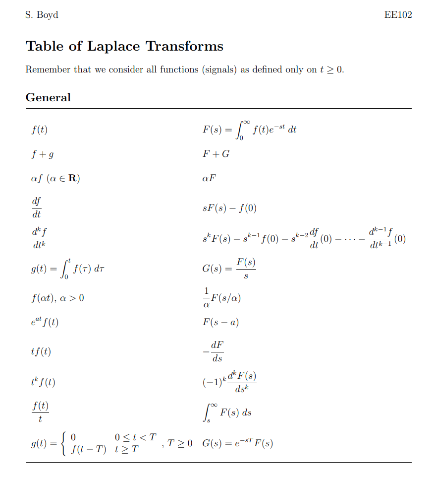
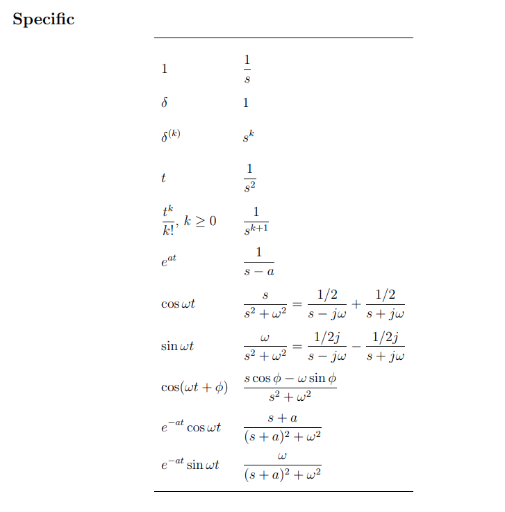
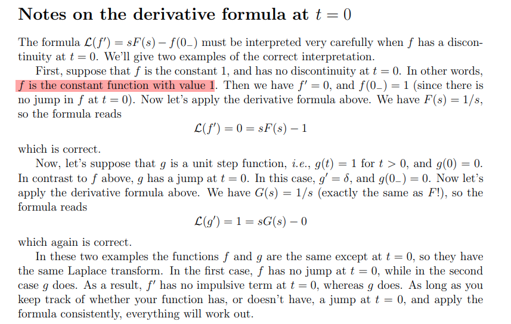
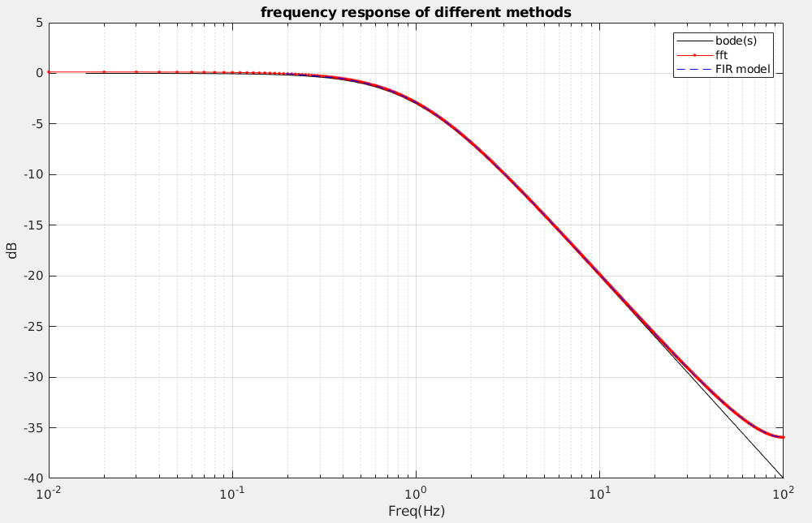

- Laplace transform
  - a generalization of the *continuous*-time Fourier transform
  - converts *integro-differential equations* into *algebraic equations*
- z-transforms
  - a generalization of the *discrete*-time Fourier transform
  - converts *difference equations* into *algebraic equations*







## warmup


### derivative formula t=0




> S. Boyd EE102 Table of Laplace Transforms [[https://web.stanford.edu/~boyd/ee102/laplace-table.pdf](https://web.stanford.edu/~boyd/ee102/laplace-table.pdf)]
>
> Gabriel Nagy, Ordinary Differential Equations [[https://users.math.msu.edu/users/gnagy/teaching/ode.pdf](https://users.math.msu.edu/users/gnagy/teaching/ode.pdf)]


## Multirate Signal Processing

*TODO* &#128197;


## $s$- and $z$-Domains Conversion 


> Staszewski, Robert Bogdan, and Poras T. Balsara. All-digital frequency synthesizer in deep-submicron CMOS. John Wiley & Sons, 2006.


## Transfer function from sampled impulse response

> continuous-time filter designs to discrete-time designs through techniques such as ***impulse invariance***


useful functions

- using `fft`

  The outputs of the DFT are **samples** of the DTFT

- using `freqz`

  modeling as **FIR filter**, and the impulse response sequence of an FIR filter is the same as the sequence of filter coefficients, we can express the frequency response in terms of either the filter coefficients or the impulse response

  > `fft` is used in `freqz` internally

**Question**:

How to obtain continuous system transfer function from sampled impulse

---

> First order lowpass filter with 3-dB frequency **1Hz**



```matlab
clear all;
clc;

%% continuous system
s = tf('s');
h = 2*pi/(2*pi+s);
[mag, phs, wout] = bode(h);
fct = wout(:)/2/pi;
Hct_dB = 20*log10(mag(:));


fstep = 0.01;           % freq resolution
fnyqst = 100;
Ts = 1/(2*fnyqst);
Fs = 1/Ts;              % sampling freq
Ns = ceil(Fs/fstep);    % samping points
fstep = Fs/Ns;          % update fstep
t = (0:Ns-1)*Ts;        % sampling time points

y = impulse(h, t);      % impulse resp

%% modelling as discrete system
Y = fft(y);                 % dft
Hfft = Y * Ts;              % !!! multiply Ts
Hfft_dB = 20*log10(abs(Hfft(1:Ns/2+1)));
ffft = (1:Ns/2+1)*fstep - fstep;


[Hfir, ffir] = freqz(y, 1, [], 1/Ts);   % modelling as FIR
Hfir = Hfir * Ts;           % !!! multiply Ts
Hfir_dB = 20*log10(abs(Hfir));

%% plot
semilogx(fct, Hct_dB, 'k', ffft, Hfft_dB, 'r.-', ffir, Hfir_dB, 'b--');
legend('bode(s)', 'fft', 'FIR model')
xlabel('Freq(Hz)');
ylabel('dB');
xlim([1e-2 1e2]);
grid on;
title('frequency response of different methods');
```


## Bilinear Transformation

*TODO* &#128197;


## FIR Equalization

### Frequency Response


$$
z = e^{j\omega T_s}
$$

### Unit impulse

filter coefficients are **[-0.131, 0.595, -0.274]** and sampling period is **100ps**


```matlab
%% Frequency response
w = [-0.131, 0.595, -0.274];
Ts = 100e-12;
[mag, w] = freqz(w, 1, [], 1/Ts);
subplot(2, 1, 1)
plot(w/1e9, 20*log10(abs(mag)));
xlabel('Freq(GHz)');
ylabel('dB');
grid on;
title('frequency response');

%% unit impulse response from transfer function
subplot(2, 1, 2)
z = tf('z', Ts);
h = -0.131 + 0.595*z^(-1) -0.274*z^(-2);
[y, t] = impulse(h);
stem(t*1e10, y*Ts);  % !!! y*Ts is essential
grid on;
title("unit impulse response");
xlabel('Time(\times 100ps)');
ylabel('mag');
```

> `impulse`:
>
> For discrete-time systems, the impulse response is the response to a unit area pulse of length `Ts` and height `1/Ts`, where `Ts` is the sample time of the system. (This pulse approaches $\delta(t)$ as `Ts` approaches zero.)
>
> 
>
> Scale output:
>
> Multiply `impulse` output with sample period `Ts` in order to correct `1/Ts` height of `impulse` function.


### PSD transformation 

If we have power spectrum or power spectrum density of **both edge's absolute jitter** ($x(n)$) , $P_{\text{xx}}$

Then **1UI** jitter is $x_{\text{1UI}}(n)=x(n)-x(n-1)$, and **Period** jitter is $x_{\text{Period}}(n)=x(n)-x(n-2)$, which can be modeled as FIR filter, $H(\omega) = 1-z^{-k}$, i.e. $k=1$ for **1UI** jitter and $k=2$ **Period** jitter
$$\begin{align}
P_{\text{xx}}'(\omega) &= P_{\text{xx}}(\omega) \cdot \left| 1-z^{-k}  \right|^2 \\
&= P_{\text{xx}}(\omega) \cdot \left| 1-(e^{j\omega T_s})^{-k}  \right|^2 \\
&= P_{\text{xx}}(\omega) \cdot \left| 1-e^{-j\omega T_s k}  \right|^2
\end{align}$$


```matlab
clear all
close all
clc

xf_fs = 0:0.01:0.5;
k = 1;
H_1UI = 1 - exp(-1i*2*pi*xf_fs);
HH_1UI = abs(H_1UI).^2;
subplot(2, 1, 1);
plot(xf_fs, HH_1UI);
grid on;
xlabel('Freq');
ylabel('|H|^2')
title('Weight for 1UI jitter');

k = 2;
H_period = 1 - exp(-1i*2*pi*xf_fs);
HH_period = abs(H_period).^2;
subplot(2, 1, 2)
plot(xf_fs, HH_period);
grid on;
xlabel('Freq');
ylabel('|H|^2')
title('Weight for Period jitter');
```


$$
x(t-\Delta T)\overset{FT}{\longrightarrow} X(s)e^{-\Delta T \cdot s}
$$


## reference

[Sam Palermo, ECEN720,  Lecture 7: Equalization Introduction & TX FIR Eq](https://people.engr.tamu.edu/spalermo/ecen689/lecture7_ee720_eq_intro_txeq.pdf)

[Sam Palermo, ECEN720, Lab5 –Equalization Circuits ](https://people.engr.tamu.edu/spalermo/ecen689/ECEN720_lab5_2021.pdf)

B. Razavi, "The z-Transform for Analog Designers [The Analog Mind\]," IEEE Solid-State Circuits Magazine, Volume. 12, Issue. 3, pp. 8-14, Summer 2020. [[https://www.seas.ucla.edu/brweb/papers/Journals/BR_SSCM_3_2020.pdf](https://www.seas.ucla.edu/brweb/papers/Journals/BR_SSCM_3_2020.pdf)]

Jhwan Kim, CICC 2022, ES4-4: Transmitter Design for High-speed Serial Data Communications 

Mathuranathan. Digital filter design – Introduction [[https://www.gaussianwaves.com/2020/02/introduction-to-digital-filter-design/](https://www.gaussianwaves.com/2020/02/introduction-to-digital-filter-design/)]

Daniel Boschen, "Fast Track to Designing FIR Filters with Python" [[https://events.gnuradio.org/event/24/contributions/598/attachments/186/485/Boschen%20FIR%20Filter%20Presentation.pdf](https://events.gnuradio.org/event/24/contributions/598/attachments/186/485/Boschen%20FIR%20Filter%20Presentation.pdf)]

Daniel Boschen, "Quick Start on Control Loops with Python" [[https://events.gnuradio.org/event/24/contributions/599/attachments/187/480/Boschen%20Control%20Presentation.pdf](https://events.gnuradio.org/event/24/contributions/599/attachments/187/480/Boschen%20Control%20Presentation.pdf)]
