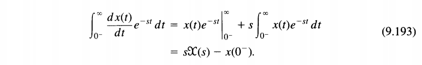
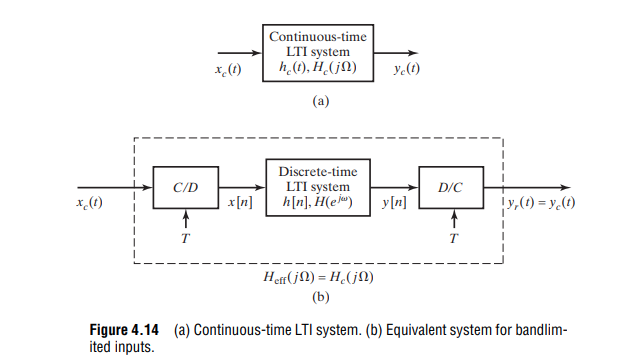

- Laplace transform
  - a generalization of the *continuous*-time Fourier transform
  - converts *integro-differential equations* into *algebraic equations*
- z-transforms
  - a generalization of the *discrete*-time Fourier transform
  - converts *difference equations* into *algebraic equations*


> *system function,* *transfer function*: $H(s)$
>
> *frequency response*: $H(j\omega)$, if the ROC of $H(s)$ includes the imaginary axis, i.e.$s=j\omega \in \text{ROC}$


## Laplace Transform

To specify the Laplace transform of a signal, both the **algebraic expression** and the **ROC** are required. The *ROC* is the range of values of $s$ for the integral of $t$ converges


> ***bilateral*** Laplace transform


where $s$ in the ROC and $\mathfrak{Re}\{s\}=\sigma$

> The formal evaluation of the integral for a general $X(s)$ requires the use of **contour integration** in the complex plane. However, for the class of *rational transforms*, the inverse Laplace transform can be determined without directly evaluating eq. (9.56) by using the technique of **partial fraction expansion** 


### ROC Property

The range of values of s for which the integral in converges is referred to as the **region of convergence** (which we abbreviate as **ROC**) of the Laplace transform


> i.e. **no** pole in RHP for stable LTI sytem


### System Causality

For a causal LTI system, the impulse response is zero for $t \lt 0$ and thus is ***right sided***


> causality implies that the ROC is to the right of the rightmost pole, but the converse is not in general true, unless the system function is rational


### System Stability

> The system is **stable**, or equivalently, that $h(t)$ is **absolutely integrable** and therefore has a Fourier
> transform,  then the ROC must include the **entire $j\omega$-axis**


> all of the poles have ***negative*** real parts


## Unilateral Laplace transform

> analyzing ***causal*** systems and, particularly, systems specified by linear constant-coefficient differential equations with ***nonzero initial conditions*** (i.e., systems that are not initially at rest)


A particularly important difference between the properties of the unilateral and bilateral transforms is the **differentiation property** $\frac{d}{dt}x(t)$

|                                  | Laplace Transform |
| -------------------------------- | ----------------- |
| **Bilateral Laplace Transform**  | $sX(s)$           |
| **Unilateral Laplace Transform** | $sX(s)-x(0^-)$    |



> *Integration by parts* for unilateral Laplace transform
>
> 

> in *Bilateral Laplace Transform*
>
> 


> In fact, the ***initial- and final-value theorems*** are basically ***unilateral transform properties***, as they apply only to signals $x(t)$ that are identically $0$ for $t \lt 0$.


## $z$-Transform

The $z$-transform for discrete-time signals is the counterpart of the Laplace transform for continuous-time signals


where $z=re^{j\omega}$


> The $z$-transform evaluated on the *unit circle* corresponds to the *Fourier transform*


### ROC Property


### system stability

The system is **stable**, or equivalently, that $h[n]$ is **absolutely summable** and therefore has a Fourier
transform,  then the ROC must include the **unit circle**


### $z$-Transform Table


> [[http://www.ws.binghamton.edu/Fowler/fowler%20personal%20page/EE301_files/ZT%20Tables_rev2.pdf](http://www.ws.binghamton.edu/Fowler/fowler%20personal%20page/EE301_files/ZT%20Tables_rev2.pdf)]

## Unilateral $z$-Transform


The **time shifting** property is different in the unilateral case because the lower limit in the unilateral transform definition is fixed at zero, $x[n-n_0]$


> *bilateral $z$-transform*
>
> 

> *unilateral $z$-transform*
>
> 

> *Initial rest condition*
>
> 


## Initial Value Theorem & Final Value Theorem

### Laplace Transform

Two valuable *Laplace transform* theorem

- Initial Value Theorem, which states that it is always possible to determine the **initial value** of the time function $f(t)$ from its Laplace transform
  $$
  \lim _{s\to \infty}sF(s) = f(0^+)
  $$

- Final Value Theorem allows us to compute the **constant steady-state value** of a time function given its Laplace transform
  $$
  \lim _{s\to 0}sF(s) = f(\infty)
  $$

  > If $f(t)$ is step response, then $f(0^+) = H(\infty)$ and $f(\infty) = H(0)$, where $H(s)$ is transfer function


### $z$-transform


Initial Value Theorem
$$
f[0]=\lim_{z\to\infty}F(z)
$$
final value theorem
$$
\lim_{n\to\infty}f[n]=\lim_{z\to1}(z-1)F(z)
$$

> Coert Vonk. Initial/final value proofs [[https://coertvonk.com/physics/lfz-transforms/z/initial-final-value-proofs-31543](https://coertvonk.com/physics/lfz-transforms/z/initial-final-value-proofs-31543)]


## $s$- and $z$-Domains Connection 

discrete-time systems also can be analyzed by means of the Laplace transform — the $z$-transform is the Laplace transform in disguise and that discrete-time systems can be analyzed as if they were continuous-time systems.


A continuous-time system with transfer function $H(s)$ that is *identical in structure* to the discrete-time system $H[z]$ except that the delays in $H[z]$ are replaced by elements that delay continuous-time signals. 

> | delay element         | Time domain   | Transform |
> | --------------------- | ------------- | --------- |
> | **$z$-transform**     | $\delta[n-1]$ | $z^{-1}$  |
> | **Laplace transform** | $\delta(t-T)$ | $e^{-sT}$ |


|                  | $z$-transform                        |                                                  | Laplace transform                                 |
| ---------------- | ------------------------------------ | ------------------------------------------------ | ------------------------------------------------- |
| **$x[n]$**       | $X[z]=\sum_{n=0}^{\infty}x[n]z^{-n}$ | $\bar{x}(t)=\sum_{n=0}^{\infty}x[n]\delta(t-nT)$ | $\overline{X}(s)=\sum_{n=0}^{\infty}x[n]e^{-snT}$ |
| **$y[n]$**       | $Y[z]=\sum_{n=0}^{\infty}y[n]z^{-n}$ | $\bar{y}(t)=\sum_{n=0}^{\infty}y[n]\delta(t-nT)$ | $\overline{Y}(s)=\sum_{n=0}^{\infty}y[n]e^{-snT}$ |
| $h[n]$           | $H[z]=\sum_{n=0}^{\infty}h[n]z^{-n}$ | $\bar{h}(t)=\sum_{n=0}^{\infty}h[n]\delta(t-nT)$ | $\overline{H}(s)=\sum_{n=0}^{\infty}h[n]e^{-snT}$ |
| $y[n]=x[n]*h[n]$ | $Y[z]=X[z]H[z]$                      | $\bar{y}(t)=\bar{x}(t)*\bar{h}(t)$               | $\overline{Y}(s)=\overline{X}(s)\overline{H}(s)$  |

Therefore, we obtain

$$\begin{align}
\sum_{n=0}^{\infty}y[n]z^{-n} &=\sum_{n=0}^{\infty}x[n]z^{-n}\cdot\sum_{n=0}^{\infty}h[n]z^{-n} \\
\sum_{n=0}^{\infty}y[n]e^{-snT} &=\sum_{n=0}^{\infty}x[n]e^{-snT}\cdot \sum_{n=0}^{\infty}h[n]e^{-snT}
\end{align}$$

The *$z$-transform of a sequence*  can be considered to be the *Laplace transform of  impulses sampled train* with a change of variable $z = e^{sT}$ or $s = \frac{1}{T}\ln z$

Note that the transformation $z = e^{sT}$ transforms the imaginary axis in the $s$ plane ($s = j\omega$) into a unit circle in the $z$ plane ($z = e^{sT} = e^{j\omega T}$, or $|z| = 1$)


> Note: $\bar{h}(t)$ is the impulse sampled version of $h(t)$

---

Note $\bar{h}(t)$ is impulse sampled signal, whose CTFT is scaled by $\frac{1}{T}$ of continuous signal $h(t)$, $\overline{H}[e^{sT}]=\overline{H}(e^{sT})$ is the approximation of continuous time system response, for example summation $\frac{1}{1-z^{-1}}$
$$
\frac{1}{1-z^{-1}} = \frac{1}{1-e^{-sT}} \approx \frac{1}{j\omega \cdot T}
$$
And we know transform of integral $u(t)$ is $\frac{1}{s}$, as expected there is ratio $T$

---


> Staszewski, Robert Bogdan, and Poras T. Balsara. All-digital frequency synthesizer in deep-submicron CMOS. John Wiley & Sons, 2006.


## impulse invariance

> A straightforward and useful relationship between the *continuous-time impulse response* $h_c(t)$ and the *discrete-time impulse response* $h[n]$ 





$$
h[n] = Th_c(nT)
$$

and $T$ is chosen such that

$$
H_c(j\omega)=0, \space\space |\hat{\omega}| \ge \frac{\pi}{T}
$$

When $h[n]$ and $h_c(t)$ are related through the above equation, i.e., the impulse response of the discrete-time  system is a *scaled*, *sampled* version of $h_c(t)$, the *discrete-time system* is said to be an impulse-invariant version of the *continuous-time system*

we have
$$
H(e^{j\hat{\omega}}) = H_c\left(j\frac{\hat{\omega}}{T}\right),\space\space |\hat{\omega}| \lt \pi
$$


- $h[n] = Th_c(nT)$ and $T\to 0$ 

  guarantees $y_c(nT) = y_r(nT)$, i.e. *output equivalence* ***only at the sampling instants***

- $H_c(j\Omega)$ is *bandlimited* and $T \lt 1/2f_h$

  guarantees $y_c(t) = y_r(t)$


> The scaling of $T$ can alternatively be thought of as a normalization of the time domain, that is average impulse response shall be same i.e., $h[n]\times 1 = h(nT)\times T$


---

> note that the *impulse-invariant transform* is ***not*** appropriate for ***high-pass responses***, because of ***aliasing errors***
>
> 


&#11088; *bandlimited*


&#11088; *bandlimited*


---


## Transfer function & sampled impulse response

> continuous-time filter designs to discrete-time designs through techniques such as ***impulse invariance***


useful functions

- using `fft`

  The outputs of the DFT are samples of the DTFT

- using `freqz`

  modeling as FIR filter, and the impulse response sequence of an FIR filter is the same as the sequence of filter coefficients, we can express the frequency response in terms of either the filter coefficients or the impulse response

  > `fft` is used in `freqz` internally


> `freqz` method is straightforward, which apply impulse invariance criteria. Though `fft` is used for signal processing mostly, 

---


```matlab
clear all;
clc;

%% continuous system
s = tf('s');
h = 2*pi/(2*pi+s); 	% First order lowpass filter with 3-dB frequency 1Hz
[mag, phs, wout] = bode(h);
fct = wout(:)/2/pi;
Hct_dB = 20*log10(mag(:));


fstep = 0.01;           % freq resolution
fnyqst = 1000;
Ts = 1/(2*fnyqst);
Fs = 1/Ts;              % sampling freq
Ns = ceil(Fs/fstep);    % samping points
fstep = Fs/Ns;          % update fstep
t = (0:Ns-1)*Ts;        % sampling time points

y = impulse(h, t);      % impulse resp

%% modelling as discrete system
Y = fft(y);                 % dft
Hfft = Y * Ts;              % !!! multiply Ts
Hfft_dB = 20*log10(abs(Hfft(1:Ns/2+1)));
ffft = (1:Ns/2+1)*fstep - fstep;


[Hfir, ffir] = freqz(y, 1, [], 1/Ts);   % modelling as FIR
Hfir = Hfir * Ts;           % !!! multiply Ts
Hfir_dB = 20*log10(abs(Hfir));

%% plot
semilogx(fct, Hct_dB, '-ok', ffft, Hfft_dB, 'r.-', ffir, Hfir_dB, 'b--');
legend('bode(s)', 'fft', 'FIR model')
xlabel('Freq(Hz)');
ylabel('dB');
xlim([1e-2 1e2]);
grid on;
title('frequency response of different methods');
```


---

***!!! only multiply Ts***


## FIR Equalization

### Frequency Response


$$
z = e^{j\omega T_s}
$$

### Unit impulse

filter coefficients are [-0.131, 0.595, -0.274] and sampling period is 100ps


```matlab
%% Frequency response
w = [-0.131, 0.595, -0.274];
Ts = 100e-12;
[mag, w] = freqz(w, 1, [], 1/Ts);
subplot(2, 1, 1)
plot(w/1e9, 20*log10(abs(mag)));
xlabel('Freq(GHz)');
ylabel('dB');
grid on;
title('frequency response');

%% unit impulse response from transfer function
subplot(2, 1, 2)
z = tf('z', Ts);
h = -0.131 + 0.595*z^(-1) -0.274*z^(-2);
[y, t] = impulse(h);
stem(t*1e10, y*Ts);  % !!! y*Ts is essential
grid on;
title("unit impulse response");
xlabel('Time(\times 100ps)');
ylabel('mag');
```

> `impulse`:
>
> For discrete-time systems, the impulse response is the response to a unit area pulse of length `Ts` and height `1/Ts`, where `Ts` is the sample time of the system. (This pulse approaches $\delta(t)$ as `Ts` approaches zero.)
>
> 
>
> Scale output:
>
> Multiply `impulse` output with sample period `Ts` in order to correct `1/Ts` height of `impulse` function.


### PSD transformation 

If we have power spectrum or power spectrum density of both edge's absolute jitter ($x(n)$) , $P_{\text{xx}}$

Then 1UI jitter is $x_{\text{1UI}}(n)=x(n)-x(n-1)$, and Period jitter is $x_{\text{Period}}(n)=x(n)-x(n-2)$, which can be modeled as FIR filter, $H(\omega) = 1-z^{-k}$, i.e. $k=1$ for 1UI jitter and $k=2$ Period jitter
**$$\begin{align}
P_{\text{xx}}'(\omega) &= P_{\text{xx}}(\omega) \cdot \left| 1-z^{-k}  \right|^2 \\
&= P_{\text{xx}}(\omega) \cdot \left| 1-(e^{j\omega T_s})^{-k}  \right|^2 \\
&= P_{\text{xx}}(\omega) \cdot \left| 1-e^{-j\omega T_s k}  \right|^2
\end{align}$$**


```matlab
clear all
close all
clc

xf_fs = 0:0.01:0.5;
k = 1;
H_1UI = 1 - exp(-1i*2*pi*xf_fs);
HH_1UI = abs(H_1UI).^2;
subplot(2, 1, 1);
plot(xf_fs, HH_1UI);
grid on;
xlabel('Freq');
ylabel('|H|^2')
title('Weight for 1UI jitter');

k = 2;
H_period = 1 - exp(-1i*2*pi*xf_fs);
HH_period = abs(H_period).^2;
subplot(2, 1, 2)
plot(xf_fs, HH_period);
grid on;
xlabel('Freq');
ylabel('|H|^2')
title('Weight for Period jitter');
```


$$
x(t-\Delta T)\overset{FT}{\longrightarrow} X(s)e^{-\Delta T \cdot s}
$$


## Bilinear Transform

> [[https://tttapa.github.io/Pages/Mathematics/Systems-and-Control-Theory/Digital-filters/Discretization/Bilinear-transform.html](https://tttapa.github.io/Pages/Mathematics/Systems-and-Control-Theory/Digital-filters/Discretization/Bilinear-transform.html)]

an algebraic transformation between the variables $s$ and $z$ that maps the entire **imaginary**  $j\Omega$-**axis** in the $s$-plane to one revolution of the **unit circle** in the $z$-plane 

$$\begin{align}
z &= \frac{1+s\frac{T_s}{2}}{1-s\frac{T_s}{2}} \\
s &= \frac{2}{T_s}\cdot \frac{1-z^{-1}}{1+z^{-1}}
\end{align}$$

where $T_s$ is the sampling period


**frequency warping:**


- The bilinear transformation avoids the problem of **aliasing** encountered with the use of *impulse invariance*, because it maps the entire imaginary axis of the $s$-plane onto the unit circle in the $z$-plane  

- *impulse invariance* **cannot** be used to map **highpass** continuous-time designs to high pass discrete-time designs, since highpass continuous-time filters are **not bandlimited**

- Due to nonlinear warping of the frequency axis introduced by the bilinear transformation,  bilinear transformation applied to a continuous-time differentiator **will not** result in a discrete-time differentiator. However, impulse invariance can be applied to **bandlimited continuous-time differentiator**

  > The feature of the frequency response of *discrete-time differentiators* is that it is *linear with frequency*  


---

The simple approximation $z=e^{sT}\approx1+sT$, ~~the *first equal* come from ***impulse invariance*** essentially~~


---

> Stephen Roberts. Lecture 3 - Design of Digital Filters [[https://www.robots.ox.ac.uk/~sjrob/Teaching/B14_SP/b14_sp_lect3.pdf](https://www.robots.ox.ac.uk/~sjrob/Teaching/B14_SP/b14_sp_lect3.pdf)]

## Design of IIR Filters From Analog Filters

> Modeling a Continuous-Time System with Matlab
>
> Because the mapping between the continuous ($s$-plane) and discrete domains ($z$-plane) *cannot be done exactly*, the various design methods are *at best approximations*


> Neil Robertson. Modeling a Continuous-Time System with Matlab [[https://www.dsprelated.com/showarticle/1055.php](https://www.dsprelated.com/showarticle/1055.php)]
>
> —. Modeling Anti-Alias Filters [[https://www.dsprelated.com/showarticle/1418.php](https://www.dsprelated.com/showarticle/1418.php)]
>
> `impinvar` [[https://www.mathworks.com/help/signal/ref/impinvar.html](https://www.mathworks.com/help/signal/ref/impinvar.html)]
>
> `bilinear` [[https://www.mathworks.com/help/signal/ref/bilinear.html](https://www.mathworks.com/help/signal/ref/bilinear.html)]
>
> `filter` [[https://www.mathworks.com/help/matlab/ref/filter.html](https://www.mathworks.com/help/matlab/ref/filter.html)]
>
> ---
>
> The design of IIR filters [[https://ocw.mit.edu/courses/2-161-signal-processing-continuous-and-discrete-fall-2008/14f29be83ac38f11eb1a1bd5fdb6f5ea_lecture_18.pdf](https://ocw.mit.edu/courses/2-161-signal-processing-continuous-and-discrete-fall-2008/14f29be83ac38f11eb1a1bd5fdb6f5ea_lecture_18.pdf)]
>
> The design of IIR filters (cont.) [[https://ocw.mit.edu/courses/2-161-signal-processing-continuous-and-discrete-fall-2008/cc00ac6d468dc9dcf2238fc1d1a194d4_lecture_19.pdf](https://ocw.mit.edu/courses/2-161-signal-processing-continuous-and-discrete-fall-2008/cc00ac6d468dc9dcf2238fc1d1a194d4_lecture_19.pdf)]
>
> Lecture 19: Design of IIR Filters [[http://smartdata.ece.ufl.edu/eee5502/2020_fall/media/2020_eee5502_slides28.pdf](http://smartdata.ece.ufl.edu/eee5502/2020_fall/media/2020_eee5502_slides28.pdf)]


### Approximation of Derivatives

> Perhaps the simplest method for ***low-order systems*** is to use *backward-difference approximation* to *continuous domain derivatives*


> Note this approximation is ***not same*** with *impulse invariance*, e.g. $\frac{1}{s^3} \to \frac{T^3z(z+1)}{2(-1)^3}$ employing impulse invariance

---

$$
1- z^{-1} = 1-e^{j\Omega T} = 1-\cos(\omega T) + j\sin(\Omega T) \approx 1-1+j\Omega T = s T
$$

That is

$$
s \approx \frac{1-z^{-1}}{T}
$$


### Matched z-Transform (Root Matching)

The *matched Z-transform method*, also called the *pole-zero mapping* or *pole-zero matching method*, and abbreviated **MPZ** or **MZT**

$$
z = e^{sT}
$$


---


```matlab
% https://www.dsprelated.com/showarticle/1642.php

%II One-pole RC filter model
Ts= 1/fs;
Wc= 1/(R*C);               % rad -3 dB frequency
fc= Wc/(2*pi);             % Hz -3 dB frequency
a1= -exp(-Wc*Ts);
b0= 1 + a1;                % numerator coefficient
a= [1 a1];                 % denominator coeffs
y_filt= filter(b0,a,y);    % filter the DAC's output signal y
```


### Impulse Invariance (`impinvar`)

-  To extend the accurate frequency range, we would need to ***increase the sample rate***
-  impulse-invariant transform is not appropriate for *high-pass responses*, because of ***aliasing errors***


Note $h[n] = Th_c(nT)$, Multiply the analog ***impulse response*** by this gain to enable meaningful comparison (*other response, like step, the amplitude correction is not needed*)


---


```matlab
% https://www.dsprelated.com/showarticle/1055.php
% modified by hguo, Sun Jun 22 09:21:48 AM CST 2025

% butter_3rd_order.m      6/4/17 nr
% Starting with the butterworth transfer function in s,
% Create discrete-time filter using the impulse invariance xform and compare
% its time and frequency responses to those of the continuous time filter.
% Filter fc = 1 rad/s = 0.159 Hz


% I.  Given H(s), find H(z) using the impulse-invariant transform
fs= 4;            % Hz  sample frequency
% 3rd order butterworth polynomial
num= 1;
den= [1 2 2 1];
[b,a]= impinvar(num,den,fs);         % coeffs of H(z)
%[b,a]= bilinear(num,den,fs)

% II.  Impulse Response and Step Response
% find discrete-time impulse response
Ts= 1/fs;
N= 16*fs;
n= 0:N-1;
t= n*Ts;
x= [1, zeros(1,N-1)];   % impulse
x= fs*x;              % make impulse response amplitude independent of fs
y= filter(b,a,x);    % filter the impulse  
subplot(2,2,1),plot(t,y,'.'),grid,
xlabel('seconds')

% Continuous-time Impulse response from inverse Laplace transform
% Blinchikoff and Zverev, p116
h= exp(-t) - 2/sqrt(3)*exp(-t/2).*cos(sqrt(3)/2*t + pi/6); 
subplot(2,2,2),plot(t,y,'.',t,h),grid
title('Impulse Response'),legend('discrete-time filter response', 'continuous-time filter response'),xlabel('seconds')

% find discrete-time step response
x= ones(1,N);         % step
y= filter(b,a,x);    % filter the step         
% Continuous-time step response. Blinchikoff and Zverev, p116
t= t+Ts/2;                 % offset t to to align step responses
h= 1 - exp(-t) - 2/sqrt(3)*exp(-t/2).*sin(sqrt(3)/2*t); 
e= h-y;                    % error of discrete-time response
subplot(2,2,3),plot(t,y,'.',t,h),grid
title('Step Response'),legend('discrete-time filter response', 'continuous-time filter response'),xlabel('seconds')
% discrete-time response error
subplot(2,2,4),plot(t,e),grid
title('Error of discrete-time step response'),xlabel('seconds')
```


---

- To use the `filter` function with the `b` coefficients from an FIR filter, use `y = filter(b,1,x)`.


---


### Bilinear Transformation (`bilinear`)

*TODO* &#128197;


## bandwidth from pulse response

> L.W. Couch, *Digital and Analog Communication* *Systems*, 8th Edition, Pearson, 2013.
>
> [Generating Basic signals – Rectangular Pulse and Power Spectral Density using FFT](https://www.gaussianwaves.com/2014/07/generating-basic-signals-rectangule-pulse-and-power-spectral-density-using-fft/)


Convolution Property of the Fourier Transform
$$
x(t)*h(t)\longleftrightarrow  X(\omega)H(\omega)
$$
pulse response can be obtained by convolve impulse response with UI length rectangular
$$
H(\omega) = \frac{Y_{\text{pulse}}(\omega)}{X_{\text{rect}}(\omega)} = \frac{Y_{\text{pulse}}(\omega)}{\text{sinc}(\omega)}
$$


```matlab
% Convolution Property of the Fourier Transform
% pulse(t) = h(t) * rect(t)
% -> fourier transform
% PULSE = H * RECT
% FT(RECT) = sinc
% H = PULSE/RECT = PULSE/sinc
xx = pi*ui.*w(1:plt_num);
y_sinc = ui.*sin(xx)./xx;
y_sinc(1) = y_sinc(2);
y_sinc = y_sinc/y_sinc(1);  % we dont care the absoulte gain
h_ban1 = abs(h(1:plt_num))./abs(y_sinc);

h_dB = 20*log10(abs(h_ban1));
[hmin, Index] = min(abs(h_dB +3 ));
f_3dB = w(Index);
f_3dB = f_3dB/1e9;
```


***sinc function***

Notice that the complete definition of $\operatorname{sinc}$ on $\mathbb R$ is
$$
\operatorname{Sa}(x)=\operatorname{sinc}(x) = \begin{cases} \frac{\sin x}{x} & x\ne 0, \\ 1, & x = 0, \end{cases}
$$
which is **continuous**.


To approach to real spectrum of continuous rectangular waveform, $\text{NFFT}$  has to be big enough.

```matlab
clear;
close all;
clc;

fs=500; %sampling frequency
Ts = 1/fs;
T=0.2; %width of the rectangule pulse in seconds

figure(1)
hold on;
t=-0.5:1/fs:0.5; %time base
x=rectpuls(t,T); %generating the square wave
sum(x>0.5)
stem(t,x,'--k');
plot(t, x, 'b.-')
xstart = T/2-Ts/2;
xend = -T/2-Ts/2;
plot([xstart, xstart], [-1, 1.02], 'r--');
plot([xend, xend], [-1, 1.02], 'r--');
plot([-0.11, 0.11], [1, 1], 'r--')
hold off;
grid on;
title(['Rectangular Pulse width=', num2str(T),'s']);
xlabel('Time(s)');
ylabel('Amplitude');
xlim([-0.12, 0.12]);
ylim([-0.05, 1.05]);

figure(2)
hold on
Titer = [1, 4, 16, 32, 64, 128];
color = {'k', 'g', 'r', 'm', 'c', 'b'};
formatSpec = 'NFFT=%d';
for k=1:length(Titer)
    t=-Titer(k):Ts:Titer(k); %time base
    x=rectpuls(t,T); %generating the square wave

    L=length(x);
    Np = nextpow2(L)-1;
    NFFT = 2^Np;
    X = fftshift(fft(x,NFFT)); %FFT with FFTshift for both negative & positive frequencies
    f = fs*(-NFFT/2:NFFT/2-1)/NFFT; %Frequency Vector
    Xc = abs(X)*Ts; % continuous signal spectrum
    plot(f, Xc, "Color",color{k}, 'LineWidth',2);
    legend_str{k} = [num2str(NFFT, formatSpec)];
end
hold off
legend(legend_str);
title('Magnitude of X_c (original continuous signal)');
xlabel('Frequency (Hz)')
ylabel('Magnitude |X(f)|');
grid on;
```


## reference

Alan V. Oppenheim, Alan S. Willsky, and S. Hamid Nawab. 1996. Signals & systems (2nd ed.)

Alan V Oppenheim, Ronald W. Schafer. 2010. Discrete-Time Signal Processing, 3rd edition

B.P. Lathi, Roger Green. Linear Systems and Signals (The Oxford Series in Electrical and Computer Engineering) 3rd Edition

[Sam Palermo, ECEN720,  Lecture 7: Equalization Introduction & TX FIR Eq](https://people.engr.tamu.edu/spalermo/ecen689/lecture7_ee720_eq_intro_txeq.pdf)

[Sam Palermo, ECEN720, Lab5 –Equalization Circuits ](https://people.engr.tamu.edu/spalermo/ecen689/ECEN720_lab5_2021.pdf)

B. Razavi, "The z-Transform for Analog Designers [The Analog Mind\]," IEEE Solid-State Circuits Magazine, Volume. 12, Issue. 3, pp. 8-14, Summer 2020. [[https://www.seas.ucla.edu/brweb/papers/Journals/BR_SSCM_3_2020.pdf](https://www.seas.ucla.edu/brweb/papers/Journals/BR_SSCM_3_2020.pdf)]

Jhwan Kim, CICC 2022, ES4-4: Transmitter Design for High-speed Serial Data Communications 

Mathuranathan. Digital filter design – Introduction [[https://www.gaussianwaves.com/2020/02/introduction-to-digital-filter-design/](https://www.gaussianwaves.com/2020/02/introduction-to-digital-filter-design/)]

Daniel Boschen, "Fast Track to Designing FIR Filters with Python" [[https://events.gnuradio.org/event/24/contributions/598/attachments/186/485/Boschen%20FIR%20Filter%20Presentation.pdf](https://events.gnuradio.org/event/24/contributions/598/attachments/186/485/Boschen%20FIR%20Filter%20Presentation.pdf)]

Daniel Boschen, "Quick Start on Control Loops with Python" [[https://events.gnuradio.org/event/24/contributions/599/attachments/187/480/Boschen%20Control%20Presentation.pdf](https://events.gnuradio.org/event/24/contributions/599/attachments/187/480/Boschen%20Control%20Presentation.pdf)]
